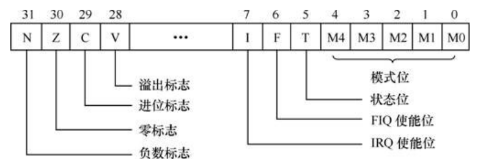

# ARM汇编笔记
## str指令
- STR指令的格式为：
```STR{条件}  源寄存器，<存储器地址>```
- STR指令用亍从源寄存器中将一个32位的字数据传送到存储器中。该指令在程序设计中比较常用，寻址方式灵活多样，使用方式可参考指令LDR。
- 指令示例：
    ```
    STR R0，[R1]，＃8  ；将R0中的字数据写入以R1为地址的存储器中，并将新地址R1＋8写入R1。
    STR R0，[R1，＃8]  ；将R0中的字数据写入以R1＋8为地址的存储器中。
    str     r1, [r0]  ；将r1寄存器的值，传送到地址值为r0的（存储器）内存中
    ```
- https://blog.csdn.net/assyiran/article/details/71440516
---
<br/>

## tst指令
- TST指令格式为：
```TST{条件}{P}  <op 1>, <op 2>```
- TST 来检查是否设置了特定的位。操作数 1 是要测试的数据字，操作数 2 是一个位掩码，TST指令将操作数1与操作数2做逻辑与运算，和ANDS的区别就是不保存结果。TST会改变CPSR的条件标志位。
- 这个指令通常与EQ，NE这些条件码来组合使用，但是使用过程中需要注意 ：与掩码逻辑与运算之后，全部测试位为0的时候，标志位Z = 1，此时EQ成立，反之则 Z = 0，NE成立。
---
<br/>

## cpsr_c
- ARM每种工作模式除R0~R15共16个寄存器外，还有第17个寄存器CPSR,叫做 当前程序状态寄存器，CPSR中一些位被用于标识各种状态，一些位被用于标识当前出于什么工作模式。
- 
- 其中cpsr_c代表的是这32位中的低8位，也就是控制位，当你看到有些程序里这样写 ```msr cpsr_c 0xd2```这样的语句时，就是在更改这8位的状态
---
<br/>

## LDMIA
- LDMIA R0! ,{R3-R9} ; 将R0指向的地址上连续空间的数据，保存到R3-R9当中，!表示R0值更新,IA后缀表示按WORD递增
---
<br/>

## SUBS Rn,Rn,#1
- 意思是 Rn 自身减 1 并设置标志位
---
<br/>

## adr r0， _start
- 将指定地址赋到r0中
---
<br/>

## ORR
- ORR指令的格式为： ORR{条件}{S}  目的寄存器，操作数1，操作数2
- ORR指令用于在两个操作数上进行逻辑或运算，并把结果放置到目的寄存器中。
- 操作数1应是一个寄存器，操作数2可以是一个寄存器，被移位的寄存器，或一个立即数。
- 操作数2为32位的掩码，如果在掩码中置了某一位1，则将这一位置1。未设置的掩码位保持不变。
---
<br/>

## MCR/MRC
- MCR指令将ARM处理器的寄存器中的数据传送到协处理器的寄存器中。如果协处理器不能成功地执行该操作，将产生未定义的指令异常中断。
- MRC指令将协处理器的寄存器中数值传送到ARM处理器的寄存器中。如果协处理器不能成功地执行该操作，将产生未定义的指令异常中断。
- ```MRC p2,5,r3,c5,c6``` 协处理器p2把c5和c6经过5操作的结果赋给r3
- ```MCR p6,0,r4,c5,c6``` 协处理器p6把r4执行0操作后将结果存放进c5
- ```MRC p3,9,r3,c5,c6,2``` 协处理器p3把c5和c6经过9操作（类型2）的结果赋给r3
- https://blog.csdn.net/wh8_2011/article/details/53183727
---
<br/>

## ldr
- ldr 加载指令： LDR{条件}  目的寄存器，<存储器地址>
    - LDR指令用亍从存储器中将一个32位的字数据传送到目的寄存器中。该指令通常用于从存储器中读取32位的字数据到通用寄存器，然后对数据进行处理。当程序计数器PC作为目的寄存器时，指令从存储器中读取的字数据被当作目的地址，从而可以实现程序流程的跳转。该指令在程序设计中比较常用，寻址方式灵活多样
    ```
        指令示例：
        LDR R0，[R1]         ；将存储器地址为R1的字数据读入寄存器R0。
        LDR R0，[R1，R2]  ；将存储器地址为R1+R2的字数据读入寄存器R0。
        LDR R0，[R1，＃8]   ；将存储器地址为R1+8的字数据读入寄存器R0。
        LDR R0，[R1，R2]！；将存储器地址为R1+R2的字数据读入寄存器R0,幵将新地址R1＋R2写入R1。
        LDR R0，[R1，＃8]！  ；将存储器地址为R1+8的字数据读入寄存器R0，幵将新地址R1＋8写入R1。 
        LDR R0，[R1]，R2  ；将存储器地址为R1的字数据读入寄存器R0，幵将新地址R1＋R2写入R1。
        LDR R0，[R1，R2，LSL＃2]！  ；将存储器地址为R1＋R2×4的字数据读入寄存器R0，并将新地址R1＋R2×4写入R1。
        LDR R0，[R1]，R2，LSL＃2  ；将存储器地址为R1的字数据读入寄存器R0，幵将新地址R1＋R2×4写入R1。”
    ```
- ldr伪指令
    - ARM指令集中，LDR通常都是作加载指令的，但是它也可以作伪指令。
    - LDR伪指令的形式是“LDR Rn,=expr”。
- http://blog.chinaunix.net/uid-28458801-id-4084264.html
---
<br/>

## EOR逻辑异或指令
- ```EOR{<cond>}{S}  <Rd>,<Rn>,<shifter_operand>```
    - 逻辑异或EOR（Exclusive OR）指令将寄存器<Rn>中的值和<shifter_operand>的值执行按位“异或”操作，并将执行结果存储到目的寄存器<Rd>中，同时根据指令的执行结果更新CPSR中相应的条件标志位。
---
<br/>

## LR(R14）寄存器
- lr(r14）的作用问题，这个lr一般来说有两个作用：
    1. 当使用bl或者blx跳转到子过程的时候，r14保存了返回地址，可以在调用过程结尾恢复。
    2. 异常中断发生时，这个异常模式特定的物理R14被设置成该异常模式将要返回的地址。

- 另外注意pc，在调试的时候显示的是当前指令地址，而用mov lr,pc的时候lr保存的是此指令向后数两条指令的地址，大家可以试一下用mov pc,pc，结果得到的是跳转两条指令，这个原因是由于arm的流水线造成的，预取两条指令的结果.
---
<br/>

## bic 
- BIC指令的格式为： ```BIC{条件}{S}  目的寄存器，操作数1，操作数2```
- BIC指令用于清除操作数1的某些位，并把结果放置到目的寄存器中。操作数1应是一个寄存器， 操作数2可以是一个寄存器、被移位的寄存器、或一个立即数。操作数2为32位的掩码，如果在 掩码中置了某一位1，则清除这一位。未设置的掩码位保持不变。
    ```
    bic r0,r0,#0x1f
    0x1f=11111b
    其含义：清除r0的bit[4:0]位。
    ```
---
<br/>


---
<br/>


---
<br/>


---
<br/>


---
<br/>


---
<br/>


---
<br/>