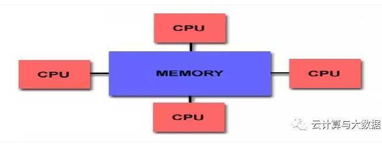
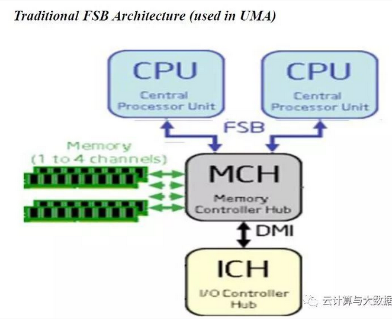
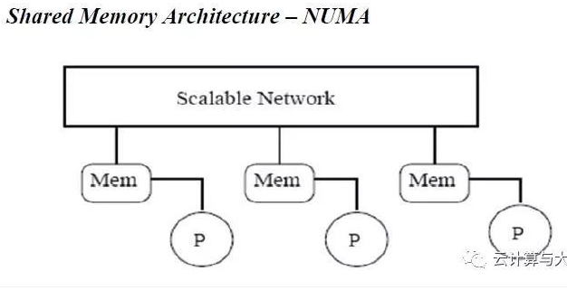
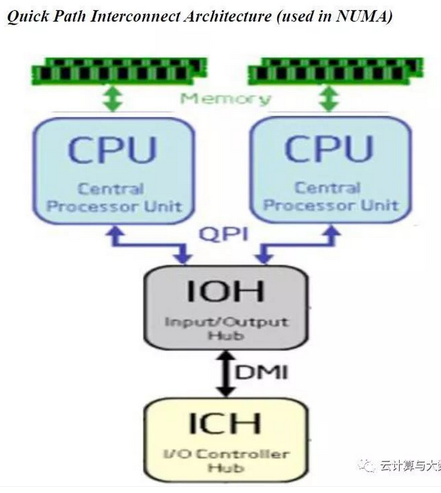
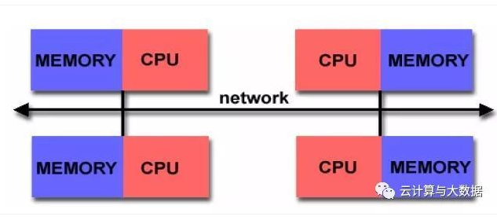
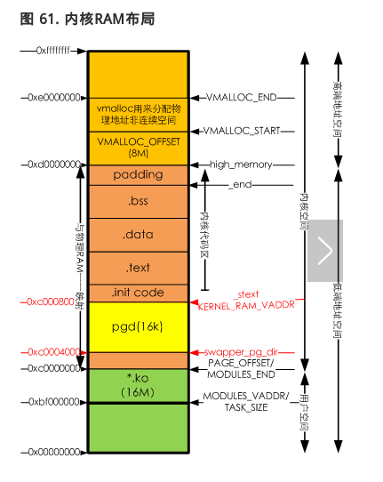
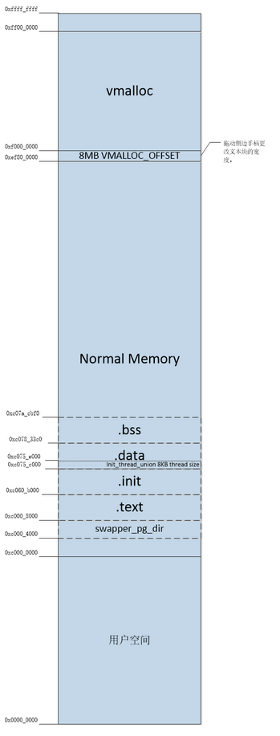
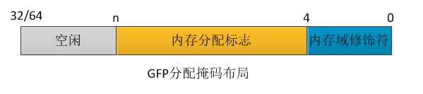

# Kernel 笔记

## 常用数字进制对照
1. 0x1 0000 0000 = 4G
2. 0x  C000 0000 = 3G
3. 0x  8000 0000 = 2G
4. 0x  4000 0000 = 1G
5. 0x  0010 0000 = 1M
6. 0x  0000 0400 = 1K
7. 0x  0000 1000 = 4K
---

## 内核常用宏
1. PAGE_OFFSET: 描述内核空间的偏移量
---

## 内核调试
- 模拟4核 Cortex-A9 Versatile Express开发平台：
    ```
    qemu-system-arm -M vexpress-a9 -smp 4 -m 1024M -kernel arch/arm/boot/zImage -append "rdinit=/linuxrc console=ttyAMA0 loglevel=8" -dtb arch/arm/boot/dts/vexpress-v2p-ca9.dtb -nographic
    ```

- 关闭QEMU平台：killall qemu-system-arm
---

## DTS（设备树）
- 如果要使用Device Tree，首先用户要了解自己的硬件配置和系统运行参数，并把这些信息组织成Device Tree source file。通过DTC（Device Tree Compiler），可以将这些适合人类阅读的Device Tree source file变成适合机器处理的Device Tree binary file（有一个更好听的名字，DTB，device tree blob）。在系统启动的时候，boot program（例如：firmware、bootloader）可以将保存在flash中的DTB copy到内存（当然也可以通过其他方式，例如可以通过bootloader的交互式命令加载DTB，或者firmware可以探测到device的信息，组织成DTB保存在内存中），并把DTB的起始地址传递给client program（例如OS kernel，bootloader或者其他特殊功能的程序）。对于计算机系统（computer system），一般是firmware->bootloader->OS，对于嵌入式系统，一般是bootloader->OS。

- .dts文件是一种ASCII 文本格式的Device Tree描述，此文本格式非常人性化，适合人类的阅读习惯。基本上，在ARM Linux在，一个.dts文件对应一个ARM的machine，一般放置在内核的arch/arm/boot/dts/目录。由于一个SoC可能对应多个machine（一个SoC可以对应多个产品和电路板），势必这些.dts文件需包含许多共同的部分，Linux内核为了简化，把SoC公用的部分或者多个machine共同的部分一般提炼为.dtsi，类似于C语言的头文件。其他的machine对应的.dts就include这个.dtsi。

- 技术文档：https://blog.csdn.net/radianceblau/article/details/70800076
---

## 内存大小
- 内存定义路径（unisoc）：sprdroid9.0_trunk/kernel4.14/arch/arm64/boot/dts/sprd/ums312-2h10.dts
    ```
    33	memory: memory {
    34		device_type = "memory";
    35		reg = <0x0 0x80000000 0x0 0x80000000>; #<base-addr size>
    36	};
    ```
- 读取内存：
    1. sprdroid9.0_trunk/kernel4.14/init/main.c：
    ```
    534	setup_arch(&command_line);
    ```
    2. sprdroid9.0_trunk/kernel4.14/arch/arm64/kernel/setup.c：
    ```
    245void __init setup_arch(char **cmdline_p)
    246{
    247	pr_info("Boot CPU: AArch64 Processor [%08x]\n", read_cpuid_id());
    248
    249	sprintf(init_utsname()->machine, UTS_MACHINE);
    250	init_mm.start_code = (unsigned long) _text;
    251	init_mm.end_code   = (unsigned long) _etext;
    252	init_mm.end_data   = (unsigned long) _edata;
    253	init_mm.brk	   = (unsigned long) _end;
    254
    255	*cmdline_p = boot_command_line; “boot_command_line是一个静态数组，在arm64的环境下是2048，也就是说bootloader传递给kernel的commandline超过2048就要修改kernel源代码加这个数组加大”
    256
    257	early_fixmap_init();
    258	early_ioremap_init();
    259
    260	setup_machine_fdt(__fdt_pointer); “__fdt_pointer 是bootloader传递过来的，代表devicetree在内存中的地址”
    ```
    3. sprdroid9.0_trunk/kernel4.14/arch/arm64/kernel/setup.c：
    ```
    185 if (!dt_virt || !early_init_dt_scan(dt_virt))
    ```
    4. sprdroid9.0_trunk/kernel4.14/drivers/of/fdt.c
    ```
    1322	early_init_dt_scan_nodes();
    ```
    5. sprdroid9.0_trunk/kernel4.14/drivers/of/fdt.c
    ```
    1302void __init early_init_dt_scan_nodes(void)
    1303{
    1304	/* Retrieve various information from the /chosen node */
    1305	of_scan_flat_dt(early_init_dt_scan_chosen, boot_command_line); “获取命令行信息，即dts文件中chosen节点中bootargs，将commandline copy到boot_command_line中”
    1306
    1307	/* Initialize {size,address}-cells info */
    1308	of_scan_flat_dt(early_init_dt_scan_root, NULL);
    1309
    1310	/* Setup memory, calling early_init_dt_add_memory_arch */
    1311	of_scan_flat_dt(early_init_dt_scan_memory, NULL); "获取dts中memory节点信息， base-addr和size"
    1312}
    ```
---

## 内存管理-节点（node）
### 体系结构模型
1. 流行的并行体系结构计算机分为以下两种模型：
    - Shared Memory Architecture: 所有处理器共享相同的内存地址空间。这种体系结构主要解决的问题是关于cache一致性, 其又分以下两种：
    
        - UMA（Uniform Memory Access）：所有处理器都一样，并且对所有的内存区域有相同的访问时间
        
        
        - NUMA（Non-Uniform Memory Access）: 所有处理器都一样，但是每个处理器拥有自己的本地内存。与Distributed Memory Architecture不同的是，不同处理器会存在内存地址映射，并且访问本地内存和其它处理器内存的时间会有不同。
        
        
    - Distributed Memory Architecture: 每个处理器拥有自己的本地内存，不存在跨处理器内存地址映射问题。因此也没有cache一致性问题。
    
2. arm linux 属于Shared Memory Architecture -> UMA
3. 摘自： https://cloud.tencent.com/developer/article/1355334

### 节点node
    - 在NUMA体系结构中，内存被分割成多个区域（BANK，也叫”簇”），依据簇与处理器的”距离”不同, 访问不同簇的时间也会不同。
    - 每个簇被认为是一个节点（node）。在linux中的 struct pglist_data 体现了这一概念，即便在UMA体系结构中亦是如此。
    - UMA体系结构中，只有一个节点。

### pg_data_t 描述
1. 内存中的每个节点都由 pg_data_t 描述，而 pg_data_t 由 struct pglist_data 定义。在分配一个页面时，linux采用节点局部分配策略，从最靠近CPU的节点分配内存。
2. 结构体 struct pglist_data 在 [sprdroid9.0_trunk/kernel4.4/include/linux/mmzone.h:654] 中声明:
    ```
    typedef struct pglist_data {
            struct zone node_zones[MAX_NR_ZONES];
            struct zonelist node_zonelists[MAX_ZONELISTS];
            int nr_zones;
    #ifdef CONFIG_FLAT_NODE_MEM_MAP /* means !SPARSEMEM */
            struct page *node_mem_map;
    #ifdef CONFIG_PAGE_EXTENSION
            struct page_ext *node_page_ext;
    #endif
    #endif
    #ifndef CONFIG_NO_BOOTMEM
            struct bootmem_data *bdata;
    #endif
    #ifdef CONFIG_MEMORY_HOTPLUG
            /*
            * Must be held any time you expect node_start_pfn, node_present_pages
            * or node_spanned_pages stay constant.  Holding this will also
            * guarantee that any pfn_valid() stays that way.
            *
            * pgdat_resize_lock() and pgdat_resize_unlock() are provided to
            * manipulate node_size_lock without checking for CONFIG_MEMORY_HOTPLUG.
            *
            * Nests above zone->lock and zone->span_seqlock
            */
            spinlock_t node_size_lock;
    #endif
            unsigned long node_start_pfn;
            unsigned long node_present_pages; /* total number of physical pages */
            unsigned long node_spanned_pages; /* total size of physical page
                                                range, including holes */
            int node_id;
            wait_queue_head_t kswapd_wait;
            wait_queue_head_t pfmemalloc_wait;
            struct task_struct *kswapd;     /* Protected by
                                            mem_hotplug_begin/end() */
            int kswapd_max_order;
            enum zone_type classzone_idx;
    #ifdef CONFIG_NUMA_BALANCING
            /* Lock serializing the migrate rate limiting window */
            spinlock_t numabalancing_migrate_lock;

            /* Rate limiting time interval */
            unsigned long numabalancing_migrate_next_window;

            /* Number of pages migrated during the rate limiting time interval */
            unsigned long numabalancing_migrate_nr_pages;
    #endif

    #ifdef CONFIG_DEFERRED_STRUCT_PAGE_INIT
            /*
            * If memory initialisation on large machines is deferred then this
            * is the first PFN that needs to be initialised.
            */
            unsigned long first_deferred_pfn;
            /* Number of non-deferred pages */
            unsigned long static_init_pgcnt;
    #endif /* CONFIG_DEFERRED_STRUCT_PAGE_INIT */
    } pg_data_t;

    ```
    - node_zones：节点中管理区描述符的数组，这些管理区为ZONE_HIGHMEM, ZONE_NORMAL, ZONE_DMA.
    - node_zonelists：页分配器使用的zonelist数据结构的数组，这是优先分配的管理区数组。当调用free_area_init_core()时，该数组由mm/page_alloc.c文件中的build_zonelists()进行分配。分配时，如果ZONE_HIGHMEM分配失败，就返回来分配为ZONE_NORMAL或ZONE_DMA。
        - struct zonelist
        ```
        struct zonelist {
            struct zoneref _zonerefs[MAX_ZONES_PER_ZONELIST + 1];
        };
        ```
        - struct zoneref
        ```
        struct zoneref {
            //实际引用的zone指针
            struct zone *zone;    /* Pointer to actual zone */
            //在引用数组中的索引
            int zone_idx;        /* zone_idx(zoneref->zone) */
        };         
        ```
    - nr_zones：节点中管理区数目。节点中有1到3个管理区，但并不是所有的节点都有三个管理区。比如，一个CPU簇里可能并没有ZONE_DMA。
    - node_mem_map
        - 在linux内核中，所有的物理内存都用struct page结构来描述，这些对象以数组形式存放，而这个数组的地址就是mem_map。内核以节点node为单位，每个node下的物理内存统一管理，也就是说在表示内存node的描述类型struct pglist_data中，有node_mem_map这个成员，其针对平坦型内存
进行描述(CONFIG_FLAT_NODE_MEM_MAP)，与此相反的是SPARSEMEM，其稀疏性内存描述。
        - 也就是说，每个内存节点node下，成员node_mem_map是此node下所有内存以struct page描述后，所有这些对象的基地址，这些对象以数组形式存放。
        - 如果系统只有一个pglist_data对象，那么此对象下的node_mem_map即为全局对象mem_map。函数alloc_node_mem_map()就是针对节点node的node_mem_map处理
        - 摘自： https://blog.csdn.net/sunlei0625/article/details/79276490， 对mem_map这个知识点讲的很透彻
    - bdata：系统中内存的每个节点都有一个bootmem_data数据结构。它包含引导内存分配器为节点分配内存所需的信息
    - node_start_pfn：节点第一个页面帧逻辑编号，所有页帧是依次编号的，每个页帧的号码都是全局唯一的。在UMA中总是0
        - 页帧号： 参考http://book.51cto.com/art/201502/465673.htm
    - node_present_pages：该节点下包含的物理页面的总数
    - node_spanned_pages：物理页面范围的总大小，包括洞
    - node_id：这是从0开始的节点号（NID）
    - kswapd_wait：交换守护进程的等待队列。
    - wait_queue_head_t pfmemalloc_wait：直接内存回收中的等待队列。
    - kswapd：指向该节点的kswapd守护进程，该进程用于释放页面。
    - kswapd_max_order：用于页交换子系统的实现，用来定义需要释放的区域的长度。
    - classzone_idx：管理区类型，ZONE_HIGHMEM, ZONE_NORMAL或 ZONE_DMA.
---


## 物理内存映射
- 页表初始化 start_kernel() -> setup_arch() -> paging_init()
    1. sprdroid9.0_trunk/kernel4.14/init/main.c:
    ```
    534	setup_arch(&command_line);
    ```
    2. sprdroid9.0_trunk/kernel4.14/arch/arm64/kernel/setup.c：
    ```
    1075 void __init setup_arch(char **cmdline_p)
    {
    1080	mdesc = setup_machine_fdt(__atags_pointer); “输入是设备树(DTB)首地址，返回的mdesc是描述平台信息的结构体”
    1121	paging_init(mdesc);
    }
    ```
    3. sprdroidq_trunk/kernel4.14/arch/arm/mm/mmu.c
    ```
    1622void __init paging_init(const struct machine_desc *mdesc)
    1623{
    1624	void *zero_page;
    1625
    1626	prepare_page_table();
    1627	map_lowmem();
    1647}
    ```
    4. sprdroidq_trunk/kernel4.14/arch/arm/mm/mmu.c
    ```
    1246static inline void prepare_page_table(void)
    1247{
    1248	unsigned long addr;
    1249	phys_addr_t end;
    1250
    1251	/*
    1252	 * Clear out all the mappings below the kernel image.
    1253	 */
    1254	for (addr = 0; addr < MODULES_VADDR; addr += PMD_SIZE)
    1255		pmd_clear(pmd_off_k(addr));
    1256
    1257#ifdef CONFIG_XIP_KERNEL
    1258	/* The XIP kernel is mapped in the module area -- skip over it */
    1259	addr = ((unsigned long)_exiprom + PMD_SIZE - 1) & PMD_MASK;
    1260#endif
    1261	for ( ; addr < PAGE_OFFSET; addr += PMD_SIZE)
    1262		pmd_clear(pmd_off_k(addr));
    1263
    1264	/*
    1265	 * Find the end of the first block of lowmem.
    1266	 */
    1267	end = memblock.memory.regions[0].base + memblock.memory.regions[0].size;
    1268	if (end >= arm_lowmem_limit)
    1269		end = arm_lowmem_limit;
    1270
    1271	/*
    1272	 * Clear out all the kernel space mappings, except for the first
    1273	 * memory bank, up to the vmalloc region.
    1274	 */
    1275	for (addr = __phys_to_virt(end);
    1276	     addr < VMALLOC_START; addr += PMD_SIZE)
    1277		pmd_clear(pmd_off_k(addr));
    1278}

    这里对如下3段地址调用pmd_clear()函数类清除一级页表项到内容：
    0x0 ~ MODULES_VADDR; 用户空间，线性映射， 低端地址空间
    MODULES_VADDR ~ PAGE_OFFSET; 用户空间， 线性映射， 地段地址空间
    arm_lowmem_limit ~ VMALLOC_START;  内核空间，高端地址空间， 线性映射， VMALLOC_OFFSET区间

    内存ram布局参考《空间划分》章节
    ``` 
    5. sprdroidq_trunk/kernel4.14/arch/arm/mm/mmu.c
    ```
    1429static void __init map_lowmem(void) "主要创建低端地址映射"
    ```
---

## zone初始化
- 页表初始化完成后，内核就可以对内存进行管理了， 但是内核并不是统一对待这些页面，内核采用区块zone到方式来管理内存

- struct zone数据结构：sprdroidq_trunk/kernel4.14/include/linux/mmzone.h
    ```
    360struct zone
    ```

- zone类型：ZONE_DMA, ZONE_DMA32, ZONE_NORMAL, ZONE_HIGHMEM
    ```
    303enum zone_type
    ```

- zone初始化
    1. start_kernel -> setup_arch -> paging_init -> bootmem_init -> zone_sizes_init -> free_area_init_node -> free_area_init_core(sprdroidq_trunk/kernel4.14/mm/page_alloc.c)

    2. sprdroidq_trunk/kernel4.14/arch/arm/mm/init.c:
        - zone的初始化在bootmem_init中进行。通过find_limits找出物理内存开始帧号min_low_pfn、结束帧号max_pfn、NORMAL区域的结束帧号max_low_pfn
        ```    
            303void __init bootmem_init(void)
            304{
                ...
            310	find_limits(&min, &max_low, &max_high); "min_now_pfn=0x60000 max_low_pfn=0x8f800 max_pfn=0xa0000，通过全局变量memblock获取信息"
                ...           
            331	zone_sizes_init(min, max_low, max_high); "从min_low_pfn到max_low_pfn是ZONE_NORMAL，max_low_pfn到max_pfn是ZONE_HIGHMEM"
            }
        ```
        - zone_sizes_init中计算出每个zone大小以及zone之间的hole，然后调用free_area_init_node创建内存节点的zone
        ```
            140 static void __init zone_sizes_init(unsigned long min, unsigned long max_low, 141	unsigned long max_high)
        ```
- zonelist数据结构
    1. 系统中会有一个zonelist的数据结构，伙伴系统分配器会从zonelist开始分配内存，zonelist有一个zoneref数组，数组里有一个成员会指向zone数据结构。zoneref数组的第一个成员指向的zone是页面分配器的第一个候选者，其它成员则是第一个候选者分配失败之后才考虑，优先级逐渐降低。
---

## 空间划分
- 32bit Linux中，一共能使用到虚拟地址空间时4GB，用户空间和内核空间到划分通常时3：1，也可以按照2：2来划分。 

- [sprdroidq_trunk/kernel4.14/arch/arm/Kconfig], 有一个“memory split”配置选项，可以用于调整内核空间和用户空间到大小划分。通常使用VMSPLIT_3G
    ```
    1420choice
    1421	prompt "Memory split"
    1422	depends on MMU
    1423	default VMSPLIT_3G
    1424	help
    1425	  Select the desired split between kernel and user memory.
    1426
    1427	  If you are not absolutely sure what you are doing, leave this
    1428	  option alone!
    1429
    1430	config VMSPLIT_3G
    1431		bool "3G/1G user/kernel split"
    1432	config VMSPLIT_3G_OPT
    1433		depends on !ARM_LPAE
    1434		bool "3G/1G user/kernel split (for full 1G low memory)"
    1435	config VMSPLIT_2G
    1436		bool "2G/2G user/kernel split"
    1437	config VMSPLIT_1G
    1438		bool "1G/3G user/kernel split"
    1439endchoice   
    ```

- 内存ram布局：
    
    

- 线性映射到物理地址和虚拟地址转换关系
    - [sprdroidq_trunk/kernel4.14/arch/arm/include/asm/memory.h]
        ```
        255static inline phys_addr_t __virt_to_phys_nodebug(unsigned long x)
        256{
        257	return (phys_addr_t)x - PAGE_OFFSET + PHYS_OFFSET;
        258}
        260static inline unsigned long __phys_to_virt(phys_addr_t x)
        261{
        262	return x - PHYS_OFFSET + PAGE_OFFSET;
        263}
        ```
---

## 分配物理页面
### 伙伴系统(Buddy System)
1. Linux内核中最基本的内存分配系统。
2. 操作系统中最常用到一种动态存储管理方法，在用户提出申请时，分配一块大小合适到内存块给用户，反之在用户释放内存块时回收。
3. 在伙伴系统中，内存块是2到order次幂。
4. Linux内核中order到最大值用MAX_ORDER来表示，通常是11，也就是把所有的空闲页面分组成11个内存块链表，每个内存块链表分别包含1、2、4、8、16、32、...、1024个连续到页面。
5. 1024个页面对应着4MB大小的连续物理内存。

### 伙伴系统分配内存
- 常用接口函数： [include/linux/gfp.h] alloc_pages
    ```
    #define alloc_pages(gfp_mask, order) \
		alloc_pages_node(numa_node_id(), gfp_mask, order)
    
    gfp_mask: 分配掩码
    order： 分配阶数
    ```
- 分配掩码：gfp（get free page）
    - 分配掩码布局：
    - https://blog.csdn.net/farmwang/article/details/66975128

