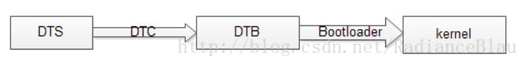

# Linux内核分析（一）——DTS设备树

## 1. Linux 内核中DTS的由来

- DTS即Device Tree Source 设备树源码, Device Tree是一种描述硬件的数据结构，它起源于 OpenFirmware (OF)。

- 在Linux 2.6中，ARM架构的板极硬件细节过多地被硬编码在arch/arm/plat-xxx和arch/arm/mach-xxx，比如板上的platform设备、resource、i2c_board_info、spi_board_info以及各种硬件的platform_data，这些板级细节代码对内核来讲只不过是垃圾代码。而采用Device Tree后，许多硬件的细节可以直接透过它传递给Linux，而不再需要在kernel中进行大量的冗余编码。

- 本质上，Device Tree改变了原来用hardcode方式将HW 配置信息嵌入到内核代码的方法，改用bootloader传递一个DB的形式。

- 如果我们认为kernel是一个black box，那么其输入参数应该包括：a.识别platform的信息  b.runtime的配置参数  c.设备的拓扑结构以及特性

  ​		对于嵌入式系统，在系统启动阶段，bootloader会加载内核并将控制权转交给内核，此外，还需要把上述的三个参数信息传递给kernel，以便kernel可以有较大的灵活性。在linux kernel中，Device Tree的设计目标就是如此。

  

## 2. DTS基本知识

### 2.1 DTS的加载过程
- 如果要使用Device Tree，首先用户要了解自己的硬件配置和系统运行参数，并把这些信息组织成Device Tree source file。通过DTC（Device Tree Compiler），可以将这些适合人类阅读的Device Tree source file变成适合机器处理的Device Tree binary file（有一个更好听的名字，DTB，device tree blob）。
- 在系统启动的时候，boot program（例如：firmware、bootloader）可以将保存在flash中的DTB copy到内存（当然也可以通过其他方式，例如可以通过bootloader的交互式命令加载DTB，或者firmware可以探测到device的信息，组织成DTB保存在内存中），并把DTB的起始地址传递给client program（例如OS kernel，bootloader或者其他特殊功能的程序）。对于计算机系统（computer system），一般是firmware->bootloader->OS，对于嵌入式系统，一般是bootloader->OS。dts加载过程如下：

### 2.2 DTS的描述信息

- Device Tree由一系列被命名的结点（node）和属性（property）的元素组成，而结点本身可包含子结点。所谓属性，其实就是成对出现的name和value。
- 在Device Tree中，可描述的信息包括（原先这些信息大多被hard code到kernel中）：
  1. CPU的数量和类别
  2. 内存基地址和大小
  3. 总线和桥
  4. 外设连接
  5. 中断控制器和中断使用情况
  6. GPIO控制器和GPIO使用情况
  7. Clock控制器和Clock使用情况

- 它基本上就是画一棵电路板上CPU、总线、设备组成的树，Bootloader会将这棵树传递给内核，然后内核可以识别这棵树，并根据它展开出Linux内核中的platform_device、i2c_client、spi_device等设备，而这些设备用到的内存、IRQ等资源，也被传递给了内核，内核会将这些资源绑定给展开的相应的设备。
- 是否Device Tree要描述系统中的所有硬件信息？答案是否定的。基本上，那些可以动态探测到的设备是不需要描述的，例如USB device。不过对于SOC上的usb hostcontroller，它是无法动态识别的，需要在device tree中描述。同样的道理，在computersystem中，PCI device可以被动态探测到，不需要在device tree中描述，但是PCI  bridge如果不能被探测，那么就需要描述之。
- .dts文件是一种ASCII 文本格式的Device Tree描述，此文本格式非常人性化，适合人类的阅读习惯。基本上，在ARM Linux在，一个.dts文件对应一个ARM的machine，一般放置在内核的arch/arm/boot/dts/目录。由于一个SoC可能对应多个machine（一个SoC可以对应多个产品和电路板），势必这些.dts文件需包含许多共同的部分，Linux内核为了简化，把SoC公用的部分或者多个machine共同的部分一般提炼为.dtsi，类似于C语言的头文件。其他的machine对应的.dts就include这个.dtsi。当然，和C语言的头文件类似，.dtsi也可以include其他的.dtsi，譬如几乎所有的ARM SoC的.dtsi都引用了skeleton.dtsi，即#include"skeleton.dtsi“ 或者 /include/ "skeleton.dtsi"。
- 正常情况下所有的dts文件以及dtsi文件都含有一个根节点”/”,这样include之后就会造成有很多个根节点? 按理说 device tree既然是一个树，那么其只能有一个根节点，所有其他的节点都是派生于根节点的child node。
- 其实Device Tree Compiler会对DTS的node进行合并，最终生成的DTB中只有一个 root  node.    device tree的基本单元是node。这些node被组织成树状结构，除了root node，每个node都只有一个parent。一个device tree文件中只能有一个root node。每个node中包含了若干的property/value来描述该node的一些特性。每个node用节点名字（node name）标识，节点名字的格式是node-name@unit-address。如果该node没有reg属性（后面会描述这个property），那么该节点名字中必须不能包括@和unit-address。unit-address的具体格式是和设备挂在那个bus上相关。例如对于cpu，其unit-address就是从0开始编址，以此加一。而具体的设备，例如以太网控制器，其unit-address就是寄存器地址。root  node的node name是确定的，必须是“/”。

- 在一个树状结构的device tree中，如何引用一个node呢？要想唯一指定一个node必须使用full path，例如/node-name-1/node-name-2/node-name-N。 

