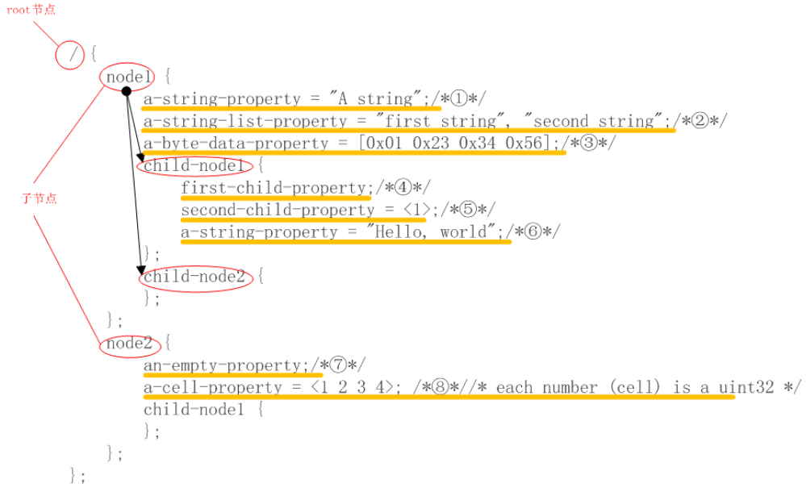
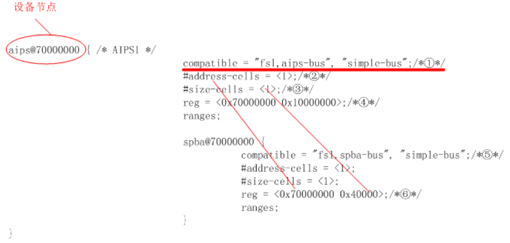
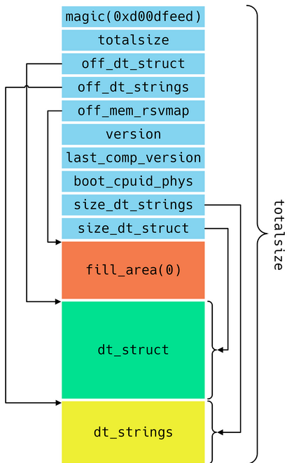
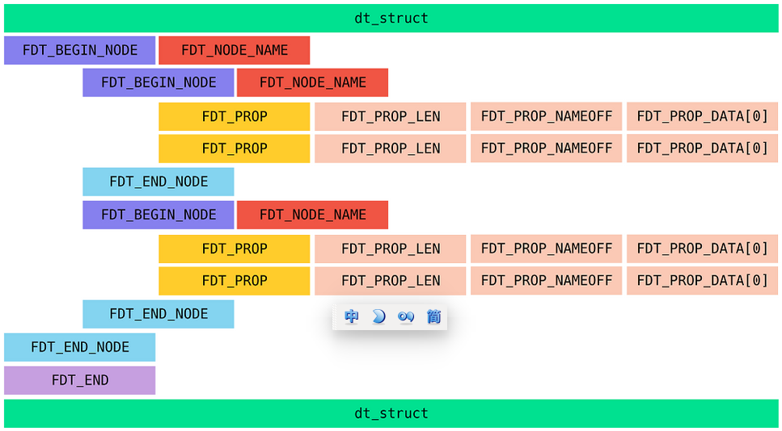
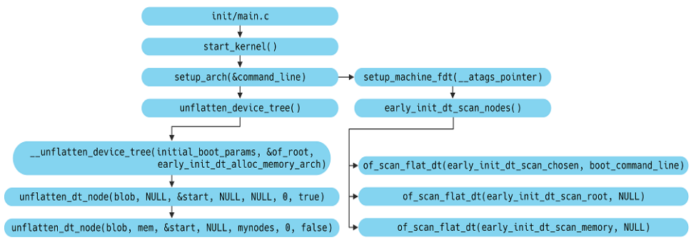
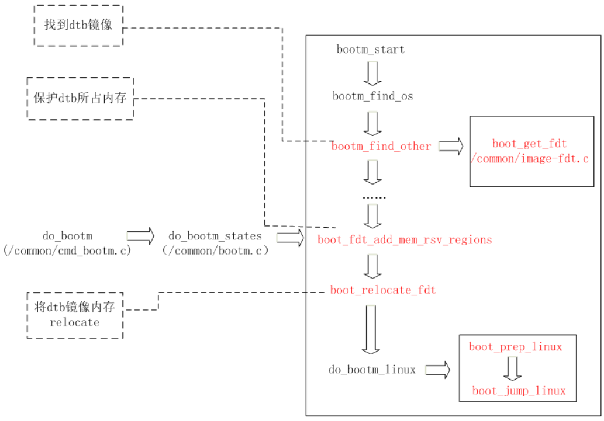
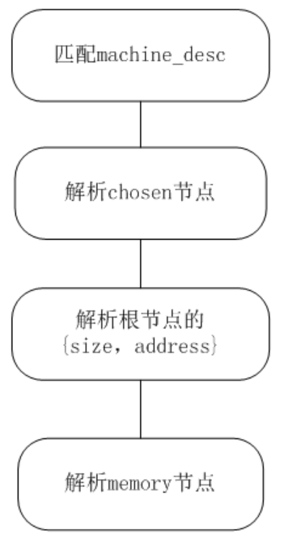

# Linux内核分析（一）——设备树

## 概述

- 本章节详细阐述了Linux内核中设备树的基本概念、基本内容、相关结构、相关的解析函数和数据结构、加载和解析过程，以及Linux内核中常用的接口函数等等。
- 设备树与Linux内核中驱动模块相关性较强，如果只是了解一下设备树，那么对于设备树的加载及解析相关部分，则不必过于深入追究。
- 本章节全面介绍了设备树的基本知识，以及在设备启动过程中的加载流程，相关函数调用流程，部分调用环节还有待完善，Linux内核中常用的接口函数仍需进一步阐述。

## 1. Linux 内核中设备树的基本概念及作用

- Linux引入FDT目的很明确--降低代码冗余。过去在内核源码中，存在大量对板级细节信息描述的代码。这些代码充斥在/arch/arm/plat-xxx和/arch/arm/mach-xxx目录，对内核而言这些platform设备、resource、i2c_board_info、spi_board_info以及各种硬件的platform_data绝大多数纯属垃圾冗余代码。为了解决这一问题，ARM内核版本3.x之后引入了原先在Power PC等其他体系架构已经使用的Flattened Device Tree。即Linux内核中引入的设备树，Flattened Device Tree，简称FDT，扁平设备树，后续我们Linux内核中所说的设备树，都是扁平设备树。

- 简而言之，设备树就是描述单板资源以及设备的一种文本文件。“A data structure by which bootloaders pass hardware layout to Linux in a device-independent manner, simplifying hardware probing.”开源文档中对设备树的描述是，一种描述硬件资源的[数据结构](http://lib.csdn.net/base/datastructure)，它通过bootloader将硬件资源传给内核，使得内核和硬件资源描述相对独立。

- Device Tree可以描述的信息包括CPU的数量和类别、内存基地址和大小、总线和桥、外设连接、中断控制器和中断使用情况、GPIO控制器和GPIO使用情况、Clock控制器和Clock使用情况。

- 它基本上就是画一棵电路板上CPU、总线、设备组成的树，Bootloader会将这棵树传递给内核，然后内核可以识别这棵树，并根据它展开出Linux内核中的platform_device、i2c_client、spi_device等设备，而这些设备用到的内存、IRQ等资源，也被传递给了内核，内核会将这些资源绑定给展开的相应的设备。

- 是否Device Tree要描述系统中的所有硬件信息？答案是否定的。基本上，那些可以动态探测到的设备是不需要描述的，例如USB device。不过对于SOC上的usb hostcontroller，它是无法动态识别的，需要在device tree中描述。同样的道理，在computersystem中，PCI device可以被动态探测到，不需要在device tree中描述，但是PCI  bridge如果不能被探测，那么就需要描述之。另外，设备树对于可热插拔的热备不进行具体描述，它只描述用于控制该热插拔设备的控制器。

- 设备树的主要优势：对于同一SOC的不同主板，只需更换设备树文件.dtb即可实现不同主板的无差异支持，而无需更换内核文件。

- 注：要使得3.x之后的内核支持使用设备树，除了内核编译时需要打开相对应的选项外，bootloader也需要支持将设备树的数据结构传给内核。

  


## 2. 设备树基本知识

### 2.1 设备树的组成和使用
- 设备树包含DTC（device tree compiler），DTS（device tree source和DTB（device tree blob）。三者关系如下：

  1. .dts文件是一种ASCII 文本格式的Device Tree描述，此文本格式非常人性化，适合人类的阅读习惯。基本上，在ARM Linux在，一个.dts文件对应一个ARM的machine，一般放置在内核的arch/arm/boot/dts/目录。

  2. 由于一个SoC可能对应多个machine（一个SoC可以对应多个产品和电路板），势必这些.dts文件需包含许多共同的部分，Linux内核为了简化，把SoC公用的部分或者多个machine共同的部分一般提炼为.dtsi，类似于C语言的头文件。其他的machine对应的.dts就include这个.dtsi。当然，和C语言的头文件类似，.dtsi也可以include其他的.dtsi，譬如几乎所有的ARM SoC的.dtsi都引用了skeleton.dtsi，即#include"skeleton.dtsi“ 或者 /include/ "skeleton.dtsi"。

  3. uboot和linux不能识别dts文件，只能识别二进制文件，所以需要将.dts文件编译成.dtb文件。dtb文件是一种可以被kernel和uboot识别的二进制文件。

     ​		把.dts文件编译成.dtb文件的工具就是DTC。DTC的源码位于内核的scripts/dtc目录，内核选中CONFIG_OF，编译内核的时候，主机可执行程序DTC就会被编译出来。即scripts/dtc/Makefile中
  
     ``````makefile
     hostprogs-y := dtc
      always := $(hostprogs-y)
     ``````

     ​		在内核的arch/arm/boot/dts/Makefile中，若选中某种SOC，则与其对应相关的所有dtb文件都将编译出来。在linux下，make dtbs可单独编译dtb。

     ​		在Linux的scripts/dtc目录下除了提供dtc工具外，也可以自己安装dtc工具，linux下执行：sudo apt-get install device-tree-compiler安装dtc工具。dtc工具的使用方法是：dtc -I dts -O dtb -o xxx.dtb xxx.dts，即可生成dts文件对应的dtb文件了。 当然了，dtc -I dtb -O dts -o xxx.dts xxx.dtb反过来即可生成dts文件。其中还提供了一个fdtdump的工具，可以dump dtb文件，方便查看信息。
  
     
  

### 2.2 设备树中DTS（DTSI）文件的基本语法

- Device Tree由一系列被命名的节点（node），以及描述节点的属性（property）的元素组成，而节点本身可包含子节点。所谓属性，其实就是成对出现的name和value。

- 正常情况下所有的dts文件以及dtsi文件都含有一个根节点（root节点）”/”，这样include之后就会造成有很多个根节点? 按理说 device tree既然是一个树，那么其只能有一个根节点，所有其他的节点都是派生于根节点的child node。其实也正是如此，Device Tree Compiler在对.dts进行编译生成dtb时，会对node进行合并操作，最终生成的DTB中只有一个 root  node。

- device tree的基本单元是node。这些node被组织成树状结构，除了root node，每个node都只有一个parent。一个device tree文件中只能有一个root node。每个node中包含了若干的property/value来描述该node的一些特性。每个node用节点名字（node name）标识，节点名字的格式是node-name@unit-address。

- 在一个树状结构的device tree中，如何引用一个node呢？要想唯一指定一个node必须使用full path，例如/node-name-1/node-name-2/node-name-N。

- 在节点的{}里面是描述该节点的属性（property），即设备的特性。它的值是多样化的，我们以下图为例：

  1. 它可以是字符串string，如①；也可能是字符串数组string-list，如②

  2. 它也可以是32 bit unsigned integers，如cell⑧，用<>表示

  3. 它也可以是binary data，如③，用[]表示

  4. 它也可能是空，如⑦

- 在/arch/arm/boot/dts/目录中有一个文件skeleton.dtsi，该文件为各ARM vendor共用的一些硬件定义信息。以下为skeleton.dtsi的全部内容。

  ```c
  / {
  	#address-cells = <1>;
  	#size-cells = <1>;
  	chosen { };
  	aliases { };
  	memory { device_type = "memory"; reg = <0 0>; };
  };
  ```
  
  如上，属性# address-cells的值为1，它代表以“/”根节点为parent的子节点中，reg属性中存在一个address值；#size-cells的值为1，它代表以“/” 根节点为parent的子节点中，reg属性中存在一个size值。即父节点的#address-cells和#size-cells的含义如下：
  
  1. #address-cells，用来描述子节点“reg”属性的地址表中用来描述首地址的cell数量；
  
   	2.  #size-cells，用来描述子节点“reg”属性的地址表中用来描述地址长度的cell数量；

### 2.3 典型节点描述

- chosen node

  ```makefile
  chosen {
          bootargs = "tegraid=40.0.0.00.00 vmalloc=256M video=tegrafb console=ttyS0, 115200n8 earlyprintk";
  };
  ```

  chosen node 主要用来描述由系统指定的runtime parameter，它并没有描述任何硬件设备节点信息。原先通过tag list传递的一些linux kernel运行的参数，可以通过chosen节点来传递。如command line可以通过bootargs这个property来传递。如果存在chosen node，它的parent节点必须为“/”根节点。

- aliases node

  ```makefile
  aliases {
  	i2c6 = &pca9546_i2c0;
  	i2c7 = &pca9546_i2c1;
  	i2c8 = &pca9546_i2c2;
  	i2c9 = &pca9546_i2c3;
  };
  ```

  aliases node用来定义别名，类似C++中引用。上面是一个在.dtsi中的典型应用，当使用i2c6时，也即使用pca9546_i2c0，使得引用节点变得简单方便。例：当.dts  include 该.dtsi时，将i2c6的status属性赋值为okay，则表明该主板上的pca9546_i2c0处于enable状态；反之，status赋值为disabled，则表明该主板上的pca9546_i2c0处于disenable状态。如下是引用的具体例子：

  ```makefile
  &i2c6 {
  	status = "okay";
  };
  ```

- memory node

  ```makefile
  memory {
  	device_type = "memory";
  	reg = <0x00000000 0x20000000>; /* 512 MB */
  };
  ```

  对于memory node，device_type必须为memory，由之前的描述可以知道该memory node是以0x00000000为起始地址，以0x20000000为地址长度的512MB的空间。

  一般而言，在.dts中不对memory进行描述，而是通过bootargs中类似521M@0x00000000的方式传递给内核。

- 其他节点

  由于其他设备节点依据属性进行描述，具有类似的形式。接下来的部分主要分析各种属性的含义及作用，并结合相关的例子进行阐述。

  1. Reg属性

     在device node 中，reg是描述memory-mapped IO register的offset和length。子节点的reg属性address和length长度取决于父节点对应的#address-cells和#size-cells的值。例：

     在上述的aips节点中，存在子节点spda。spda中的中reg为<0x70000000 0x40000 >，其0x700000000为address，0x40000为size。这一点在图(../picture/dts基本语法范例.png)有作介绍。

     这里补充的一点是：设备节点的名称格式[node-name@unit-address](mailto:node-name@unit-address)，节点名称用node-name唯一标识，为一个ASCII字符串。其中@unit-address为可选项，可以不作描述。unit-address的具体格式和设备挂载在哪个bus上相关。如：cpu的unit-address从0开始编址，以此加1；本例中，aips为0x70000000。

  2. compatible属性

     在上图①中，compatible属性为string list，用来将设备匹配对应的driver驱动，优先级为从左向右。本例中spba的驱动优先考虑“fsl，spba-bus”驱动；若没有“fsl，aips-bus”驱动，则用字符串“simple-bus”来继续寻找合适的驱动。即compatible实现了原先内核版本3.x之前，platform_device中.name的功能，至于具体的实现方法，本文后面会做讲解。

     注：对于“/”root节点，它也存在compatible属性，用来匹配machine type。具体说明将在后面给出。

  3. interrupts属性

     设备节点通过interrupt-parent来指定它所依附的中断控制器，当节点没有指定interrupt-parent时，则从parent节点中继承。上面例子中，root节点的interrupt-parent = <&mic>。这里使用了引用，即mic引用了②中的inrerrupt-controller @40008000；root节点的子节点并没有指定interrupt-controller，如ahb、fab，它们均使用从根节点继承过来的mic，即位于0x40008000的中断控制器。

     若子节点使用到中断(中断号、触发方法等等)，则需用interrupt属性来指定，该属性的数值长度受中断控制器中#inrerrupt-cells值③控制，即interrupt属性<>中数值的个数为#inrerrupt-cells的值；本例中#inrerrupt-cells=<2>，因而④中interrupts的值为<0x3d 0>形式，具体每个数值的含义由驱动实现决定。

  4. ranges属性

     ranges属性为地址转换表，这在pcie中使用较为常见，它表明了该设备在到parent节点中所对用的地址映射关系。ranges格式长度受当前节点#address-cell、parent节点#address-cells、当前节点#size-cell所控制。顺序为ranges=<当前节点#address-cell, parent节点#address-cells , 当前节点#size-cell>。在本例中，当前节点#address-cell=<1>,对应于⑤中的第一个0x20000000；parent节点#address-cells=<1>，对应于⑤中的第二个0x20000000；当前节点#size-cell=<1>，对应于⑤中的0x30000000。即ahb节点所占空间从0x20000000地址开始，对应于父节点的0x20000000地址开始的0x30000000地址空间大小。

     注：对于相同名称的节点，dtc会根据定义的先后顺序进行合并，其相同属性，取后定义的那个。

## 3. Device Tree文件结构 

- DTB由三部分组成：头（Header）、结构块（device-tree structure）、字符串块（string block），其布局结构如下：
- 通过以上分析，可以得到Device Tree文件结构如下图所示。dtb文件的头部首先存放的是fdt_header的结构体信息，接着是填充区域，填充大小为off_dt_struct – sizeof(struct fdt_header)，填充的值为0。接着就是struct fdt_property结构体的相关信息。最后是dt_string部分。

### 3.1 Device Tree文件头信息

- 我们使用上文提到的fdtdump工具，以vexpress-v2p-ca5s.dtb文件为例，Linux终端执行fdtdump -sd  vexpress-v2p-ca5s.dtb > vexpress-v2p-ca5s.txt，vexpress-v2p-ca5s.txt部分内容如下：

  ```
  vexpress-v2p-ca5s.dtb: found fdt at offset 0
  /dts-v1/;
  // magic:		0xd00dfeed
  // totalsize:		0x313b (12603)
  // off_dt_struct:	0x38
  // off_dt_strings:	0x2dac
  // off_mem_rsvmap:	0x28
  // version:		17
  // last_comp_version:	16
  // boot_cpuid_phys:	0x0
  // size_dt_strings:	0x38f
  // size_dt_struct:	0x2d74
  ```

- 以上信息便是Device Tree头信息，存储在dtb文件的开头部分，在Linux内核中使用`struct fdt_header`结构体描述，该结构体定义在linux-5.1/scripts/dtc/libfdt/fdt.h文件中。（注：好多设备树相关文章中也有使用`struct boot_param_header`结构体（定义在arch/powerpc/include/asm/prom.h）的，两个结构体内容一样）：

  ```
    struct fdt_header {
    		fdt32_t	magic;				/* 设备树幻数，固定为0xd00dfeed */
    		fdt32_t	totalsize;			/* 整个设备树的大小*/
        	fdt32_t	off_dt_struct;		/* 保存结构块在整个设备树中的偏移*/
   		fdt32_t	off_dt_strings;		/* 保存字符串块在整个设备树中的偏移*/
  		fdt32_t	off_mem_rsvmap;		/* 保留内存区，该区保留了不能被内核动态分配的内存空间*/
         	fdt32_t	version;			/* 设备树版本*/
          fdt32_t	last_comp_version;	/* 向下兼容版本号*/
    		/* version 2 fields below */
    		fdt32_t	boot_cpuid_phys;	/* 为在多核处理器中用于启动的主CPU的物理id*/
    		/* version 3 fields below */
    		fdt32_t	dt_strings_size;	/* 字符串块大小*/
    		/* version 17 fields below */
    		fdt32_t	dt_struct_size;		/* 结构块大小*/
    };
  ```

  fdtdump工具的输出信息即是以上结构中每一个成员的值，struct fdt_header结构体包含了Device Tree的私有信息。例如: fdt_header.magic是fdt的魔数,固定值为0xd00dfeed，fdt_header.totalsize是fdt文件的大小。使用二进制工具打开vexpress-v2p-ca5s.dtb验证。vexpress-v2p-ca5s.dtb二进制文件头信息如下图所示。从下图中可以得到Device Tree的文件是以大端模式储存。并且，头部信息和fdtdump的输出信息一致。

  ```
    1 0000000: d0 0d fe ed 00 00 31 3b 00 00 00 38 00 00 2d ac  ......1;...8..-.
    2 0000010: 00 00 00 28 00 00 00 11 00 00 00 10 00 00 00 00  ...(............
    3 0000020: 00 00 03 8f 00 00 2d 74 00 00 00 00 00 00 00 00  ......-t........
    4 0000030: 00 00 00 00 00 00 00 00 00 00 00 01 00 00 00 00  ................
    5 0000040: 00 00 00 03 00 00 00 09 00 00 00 00 56 32 50 2d  ............V2P-
    6 0000050: 43 41 35 73 00 00 00 00 00 00 00 03 00 00 00 04  CA5s............
    7 0000060: 00 00 00 06 00 00 02 25 00 00 00 03 00 00 00 04  .......%........
    8 0000070: 00 00 00 0e 00 00 00 0f 00 00 00 03 00 00 00 23  ...............#
    9 0000080: 00 00 00 20 61 72 6d 2c 76 65 78 70 72 65 73 73  ... arm,vexpress
  ```

  

### 3.2 device-tree structure——节点

- 设备树结构块是一个线性化的结构体，是设备树的主体，以<u>节点的形式保存了主板上的设备信息(我的理解：设备树结构体描述了dts文件中的节点信息。)</u>。

- 节点（node）信息使用struct fdt_node_header结构体描述。各个结构体信息如下: `/scripts/dtc/libfdt/fdt.h`

  ```c
  81struct fdt_node_header {
  82	fdt32_t tag;
  83	char name[0];
  84};
  85
  ```

  ​		struct fdt_node_header描述节点信息，tag是标识node的起始结束等信息的标志位，name指向node名称的首地址。tag的取值如下，我们一般把这些宏称之为token。：  

  ```c
  #define FDT_BEGIN_NODE	0x1		/* Start of node, full name */
  #define FDT_END_NODE	0x2		/* End node */
  #define FDT_PROP		0x3		/* Property: name off, size, content */
  #define FDT_NOP			0x4		/* nop */
  #define FDT_END			0x9
  ```

  1. FDT_BEGIN_NODE (0x00000001)。该token描述了一个node的开始位置，紧挨着该token的就是node name（包括unit address）。
  2. FDT_END_NODE (0x00000002)。该token描述了一个node的结束位置。
  3. FDT_PROP (0x00000003)。该token描述了一个property的开始位置，该token之后是两个u32的数据，分别是length和name offset。length表示该property value data的size。name offset表示该属性字符串在device tree strings block的偏移值。length和name offset之后就是长度为length具体的属性值数据。
  4. FDT_NOP (0x00000004)。
  5. FDT_END (0x00000009)。该token标识了一个DTB的结束位置。

- 节点属性信息使用struct fdt_property结构体描述。

  ```c
  86struct fdt_property {
  87	fdt32_t tag;
  88	fdt32_t len;
  89	fdt32_t nameoff;
  90	char data[0];
  91};
  ```

  1. 描述属性采用struct fdt_property描述，tag标识是属性，取值为FDT_PROP；
  2. len为属性值的长度（包括‘\0’，单位：字节）；
  3. nameoff为属性名称存储位置相对于off_dt_strings的偏移地址。

- 设备树节点的结构如下：
  
  一个节点的结构如下：
  
  1. 节点开始标志：一般为FDT_BEGIN_NODE（0x00000001）。
  2. 节点路径或者节点的单元名(version<3以节点路径表示，version>=0x10以节点单元名表示)。
  3. 填充字段（对齐到四字节）。
  4. 节点属性。每个属性以宏FDT_PROP(0x00000003)开始，后面依次为属性值的字节长度(4字节)、属性名称在字符串块中的偏移量(4字节)、属性值和填充（对齐到四字节）。
  5. 如果存在子节点，则定义子节点。
  6. 节点结束标志FDT_END_NODE(0x00000002)。


## 4. kernel解析Device Tree

- Device Tree文件结构描述就以上struct fdt_header、struct fdt_node_header及struct fdt_property三个结构体描述。kernel会根据Device Tree的结构解析出kernel能够使用的struct property结构体。<u>kernel根据Device Tree中所有的属性解析出数据填充struct property结构体</u>。struct property结构体描述如下:

  ```c
  struct property {
      char *name;		/*属性名*/
      int	length;		/*属性值长度*/
      void *value;	/*属性值*/
      struct property *next;	/*指向下一个属性值*/
      unsigned long _flags;	/*标志*/
      unsigned int unique_id;
  }
  ```

  ​		kernel根据Device Tree的文件结构信息转换成struct property结构体，并将同一个node节点下面的所有属性通过property.next指针进行链接，形成一个单链表。

- kernel解析Device Tree的函数调用过程如下图所示: 

  1. kernel的C语言阶段的入口函数是init/main.c/start_kernel()函数，在early_init_dt_scan_nodes()中会做以下三件事：
     - 扫描/chosen或者/chose@0节点下面的bootargs属性值到boot_command_line，此外，还处理initrd相关的property，并保存在initrd_start和initrd_end这两个全局变量中；
     - 扫描根节点下面，获取{size,address}-cells信息，并保存在dt_root_size_cells和dt_root_addr_cells全局变量中；   
     - 扫描具有device_type = “memory”属性的/memory或者/memory@0节点下面的reg属性值，并把相关信息保存在meminfo中，全局变量meminfo保存了系统内存相关的信息。 

  2. Device Tree中的每一个node节点经过kernel处理都会生成一个struct device_node的结构体，struct 
     device_node最终一般会被挂接到具体的struct device结构体。struct device_node结构体描述如下：kernel4.14/include/linux/of.h

     ```c
     49struct device_node {
     50	const char *name;	/*node的名称，取最后一次“/”和“@”之间子串*/
     51	const char *type;	/*device_type的属性名称，没有为<NULL>*/
     52	phandle phandle;	/*phandle属性值*/
     53	const char *full_name;	/*指向该结构体结束的位置，存放node的路径全名，例如：/chosen*/
     54	struct fwnode_handle fwnode;
     55
     56	struct	property *properties;	/*指向该节点下的第一个属性，其他属性与该属性链表相接*/
     57	struct	property *deadprops;	/* removed properties */
     58	struct	device_node *parent;	/*指向父节点*/
     59	struct	device_node *child;		/*指向子节点*/
     60	struct	device_node *sibling;	/*姊妹节点，与自己同等级的node*/
     61	struct	kobject kobj;			/* sysfs文件系统目录体现 */
     62	unsigned long _flags;			/* 当前node状态标志位，见/include/linux/of.h line141-145 */
     63	void	*data;
     64#if defined(CONFIG_SPARC)
     65	const char *path_component_name;
     66	unsigned int unique_id;
     67	struct of_irq_controller *irq_trans;
     68#endif
     69};
     ...
     141/* flag descriptions (need to be visible even when !CONFIG_OF) */
     142#define OF_DYNAMIC	1 /* node and properties were allocated via kmalloc */
     143#define OF_DETACHED	2 /* node has been detached from the device tree */
     144#define OF_POPULATED	3 /* device already created for the node */
     145#define OF_POPULATED_BUS	4 /* of_platform_populate recursed to children of this node */
     ```

     

  3. 

     

### 4.1 machine_desc结构

/linux-5.1/arch/arm/include/asm/mach/arch.h

```c
27  struct machine_desc {
28  	unsigned int		nr;		/* architecture number	*/
29  	const char		*name;		/* architecture name	*/
30  	unsigned long		atag_offset;	/* tagged list (relative) */
31  	const char *const 	*dt_compat;	/* array of device tree
32  						 * 'compatible' strings	*/
33  
34  	unsigned int		nr_irqs;	/* number of IRQs */
35  
36  #ifdef CONFIG_ZONE_DMA
37  	phys_addr_t		dma_zone_size;	/* size of DMA-able area */
38  #endif
39  
40  	unsigned int		video_start;	/* start of video RAM	*/
41  	unsigned int		video_end;	/* end of video RAM	*/
42  
43  	unsigned char		reserve_lp0 :1;	/* never has lp0	*/
44  	unsigned char		reserve_lp1 :1;	/* never has lp1	*/
45  	unsigned char		reserve_lp2 :1;	/* never has lp2	*/
46  	enum reboot_mode	reboot_mode;	/* default restart mode	*/
47  	unsigned		l2c_aux_val;	/* L2 cache aux value	*/
48  	unsigned		l2c_aux_mask;	/* L2 cache aux mask	*/
49  	void			(*l2c_write_sec)(unsigned long, unsigned);
50  	const struct smp_operations	*smp;	/* SMP operations	*/
51  	bool			(*smp_init)(void);
52  	void			(*fixup)(struct tag *, char **);
53  	void			(*dt_fixup)(void);
54  	long long		(*pv_fixup)(void);
55  	void			(*reserve)(void);/* reserve mem blocks	*/
56  	void			(*map_io)(void);/* IO mapping function	*/
57  	void			(*init_early)(void);
58  	void			(*init_irq)(void);
59  	void			(*init_time)(void);
60  	void			(*init_machine)(void);
61  	void			(*init_late)(void);
62  #ifdef CONFIG_GENERIC_IRQ_MULTI_HANDLER
63  	void			(*handle_irq)(struct pt_regs *);
64  #endif
65  	void			(*restart)(enum reboot_mode, const char *);
66  };
```

- 内核将机器信息记录为machine_desc结构体（该定义在/arch/arm/include/asm/mach/arch.h），并保存在\_arch_info_begin到\_arch_info_end之间（\_arch_info_begin，\_arch_info_end为虚拟地址，是编译内核时指定的，此时mmu还未进行初始化。它其实通过汇编完成地址偏移操作）。
- machine_desc结构体用宏MACHINE_START进行定义，一般在/arch/arm/子目录，与板级相关的文件中进行成员函数及变量的赋值。由linker将machine_desc聚集在.arch.info.init节区形成列表。
- bootloader引导内核时，ARM寄存器r2会将.dtb的首地址传给内核，内核根据该地址，解析.dtb中根节点的compatible属性，将该属性与内核中预先定义machine_desc结构体的dt_compat成员做匹配，得到最匹配的一个machine_desc。
- 在代码中，内核通过在start_kernel->setup_arch中调用setup_machine_fdt来实现上述功能，该函数的具体实现可参见/arch/arm/kernel/devtree.c。

### 4.2 设备节点结构体

kernel4.14/include/linux/of.h

```c
49struct device_node {
50	const char *name;	/*设备名称*/
51	const char *type;	/*设备类型*/
52	phandle phandle;
53	const char *full_name;	/*设备全程，包括父设备名*/
54	struct fwnode_handle fwnode;
55
56	struct	property *properties;	/*设备属性链表*/
57	struct	property *deadprops;	/* removed properties */
58	struct	device_node *parent;	/*指向父节点*/
59	struct	device_node *child;		/*指向子节点*/
60	struct	device_node *sibling;	/*指向兄弟节点*/
61	struct	kobject kobj;
62	unsigned long _flags;
63	void	*data;
64#if defined(CONFIG_SPARC)
65	const char *path_component_name;
66	unsigned int unique_id;
67	struct of_irq_controller *irq_trans;
68#endif
69};
```

- 记录节点信息的结构体。.dtb经过解析之后将以device_node列表的形式存储节点信息。

### 4.3 属性结构体

```c
struct property {
    char *name;		/*属性名*/
    int	length;		/*属性值长度*/
    void *value;	/*属性值*/
    struct property *next;	/*指向下一个属性值*/
    unsigned long _flags;	/*标志*/
    unsigned int unique_id;
}
```

- device_node结构体中的成员结构体，用于描述节点属性信息。

### 4.4 uboot下的相关结构体

- 首先我们看下uboot用于记录os、initrd、fdt信息的数据结构bootm_headers，其定义在u-boot15/include/image.h中，这边截取了其中与dtb相关的一小部分。

  ```c
  295typedef struct bootm_headers {
  ...
  305#if defined(CONFIG_FIT)
  ...
  316	void		*fit_hdr_fdt;	/* FDT blob FIT image header */
  317	const char	*fit_uname_fdt;	/* FDT blob subimage node unit name */
  318	int		fit_noffset_fdt;/* FDT blob subimage node offset */
  ...
  323#endif
  ...
  356#ifdef CONFIG_LMB
  357	struct lmb	lmb;		/* for memory mgmt */
  358#endif
  359} bootm_headers_t;
  ```

  1. fit_hdr_fdt指向DTB设备树镜像的头。
  2. lmb为uboot下的一种内存管理机制，全称为logical memory blocks。用于管理镜像的内存。lmb所记录的内存信息最终会传递给kernel。这里对lmb不做展开描述。在/include/lmb.h和/lib/lmb.c中有对lmb的接口和定义的具体描述。有兴趣的读者可以看下，所包含的代码量不多。

## 5. DTB加载及解析过程

### 5.1 dtb加载



- 先从uboot里的do_bootm出发，根据之前描述，DTB在内存中的地址通过bootm命令进行传递。在bootm中，它会根据所传进来的DTB地址，对DTB所在内存做一系列操作，为内核解析DTB提供保证。上图为对应的函数调用关系图。

- 在do_bootm中，主要调用函数为do_bootm_states，第四个参数为bootm所要处理的阶段和状态。 

- 在do_bootm_states中，bootm_start会对lmb进行初始化操作，lmb所管理的物理内存块有三种方式获取。起始地址，优先级从上往下：

  1. 环境变量“bootm_low”
  2. 宏CONFIG_SYS_SDRAM_BASE（在tegra124中为0x80000000）
  3. gd->bd->bi_dram[0].start

  大小：

  1. 环境变量“bootm_size”
  2. gd->bd->bi_dram[0].size

- 经过初始化之后，这块内存就归lmb所管辖。接着，调用bootm_find_os进行kernel镜像的相关操作，这里不具体阐述。
- 还记得之前讲过bootm的三个参数么，第一个参数内核地址已经被bootm_find_os处理，而接下来的两个参数会在bootm_find_other中执行操作。
  - 首先，bootm_find_other根据第二个参数找到ramdisk的地址，得到ramdisk的镜像；然后根据第三个参数得到DTB镜像，同检查kernel和ramdisk镜像一样，检查DTB镜像也会进行一系列的校验工作，如果校验错误，将无法正常启动内核。另外，uboot在确认DTB镜像无误之后，会将该地址保存在环境变量“fdtaddr”中。
  - 接着，uboot会把DTB镜像reload一次，使得DTB镜像所在的物理内存归lmb所管理：
    1. boot_fdt_add_mem_rsv_regions会将原先的内存DTB镜像所在的内存置为reserve，保证该段内存不会被其他非法使用，保证接下来的reload数据是正确的；
    2. boot_relocate_fdt会在bootmap区域中申请一块未被使用的内存，接着将DTB镜像内容复制到这块区域（即归lmb所管理的区域）

- 注：若环境变量中，指定“fdt_high”参数，则会根据该值，调用lmb_alloc_base函数来分配DTB镜像reload的地址空间。若分配失败，则会停止bootm操作。因而，不建议设置fdt_high参数。

- 接下来，do_bootm会根据内核的类型调用对应的启动函数。与linux对应的是do_bootm_linux。

  1. boot_prep_linux 为启动后的kernel准备参数
  2. boot_jump_linux，下图是boot_jump_linux的片段代码，可以看出：若使用DTB，则原先用来存储ATAG的寄存器R2，将会用来存储.dtb镜像地址。boot_jump_linux最后将调用kernel_entry，将.dtb镜像地址传给内核。       

 - 下面我们看内核处理部分，在arch/arm/kernel/head.S中，有这样一段：

   ```
   117	/*
   118	 * r1 = machine no, r2 = atags or dtb,
   119	 * r8 = phys_offset, r9 = cpuid, r10 = procinfo
   120	 */
   121	bl	__vet_atags
   ```

   __vet_atags定义在/arch/arm/kernel/head-common.S中，它主要对DTB镜像做了一个简单的校验。

   ```
   47__vet_atags:
   48	tst	r2, #0x3			@ aligned?
   49	bne	1f
   50
   51	ldr	r5, [r2, #0]
   52#ifdef CONFIG_OF_FLATTREE
   53	ldr	r6, =OF_DT_MAGIC		@ is it a DTB?
   54	cmp	r5, r6
   55	beq	2f
   56#endif
   57	cmp	r5, #ATAG_CORE_SIZE		@ is first tag ATAG_CORE?
   58	cmpne	r5, #ATAG_CORE_SIZE_EMPTY
   59	bne	1f
   60	ldr	r5, [r2, #4]
   61	ldr	r6, =ATAG_CORE
   62	cmp	r5, r6
   63	bne	1f
   64
   652:	ret	lr				@ atag/dtb pointer is ok
   66
   671:	mov	r2, #0
   68	ret	lr
   69ENDPROC(__vet_atags)
   ```

### 5.2 dtb解析

- 真正解析处理dtb的开始部分，是setup_arch->setup_machine_fdt。这部分的处理在第四部分的machine_desc中有提及。如下图为setup_machine_fdt的解析过程。                                
  1. 解析chosen节点将对boot_command_line进行初始化。
  2. 解析根节点的{size，address}将对dt_root_size_cells，dt_root_addr_cells进行初始化。为之后解析memory等其他节点提供依据。
  3. 解析memory节点，将会把节点中描述的内存，加入memory的bank。为之后的内存初始化提供条件。
  4. 解析设备树在函数unflatten_device_tree中完成，它将.dtb解析成device_node结构（第四部分有其定义），并构成单项链表，以供OF的API接口使用。

- 下面主要结合代码分析：/drivers/of/fdt.c

  ```c
  1326/**
  1327 * unflatten_device_tree - create tree of device_nodes from flat blob
  1328 *
  1329 * unflattens the device-tree passed by the firmware, creating the
  1330 * tree of struct device_node. It also fills the "name" and "type"
  1331 * pointers of the nodes so the normal device-tree walking functions
  1332 * can be used.
  1333 */
  1334void __init unflatten_device_tree(void)
  1335{	//解析设备树，将所有的设备节点链入全局链表of_allnodes中
  1336	__unflatten_device_tree(initial_boot_params, NULL, &of_root,
  1337				early_init_dt_alloc_memory_arch, false);
  1338	//设置内核输出终端，以及遍历"/aliases"节点下的所有的属性，挂入相应链表
  1339	/* Get pointer to "/chosen" and "/aliases" nodes for use everywhere */
  1340	of_alias_scan(early_init_dt_alloc_memory_arch);
  1341
  1342	unittest_unflatten_overlay_base();
  1343}
  ```

  ```c
  458/**
  459 * __unflatten_device_tree - create tree of device_nodes from flat blob
  460 *
  461 * unflattens a device-tree, creating the
  462 * tree of struct device_node. It also fills the "name" and "type"
  463 * pointers of the nodes so the normal device-tree walking functions
  464 * can be used.
  465 * @blob: The blob to expand
  466 * @dad: Parent device node
  467 * @mynodes: The device_node tree created by the call
  468 * @dt_alloc: An allocator that provides a virtual address to memory
  469 * for the resulting tree
  470 *
  471 * Returns NULL on failure or the memory chunk containing the unflattened
  472 * device tree on success.
  473 */
  474void *__unflatten_device_tree(const void *blob,
  475			      struct device_node *dad,
  476			      struct device_node **mynodes,
  477			      void *(*dt_alloc)(u64 size, u64 align),
  478			      bool detached)
  479{
  480	int size;
  481	void *mem;
  482
  483	pr_debug(" -> unflatten_device_tree()\n");
  484
  485	if (!blob) {
  486		pr_debug("No device tree pointer\n");
  487		return NULL;
  488	}
  489
  490	pr_debug("Unflattening device tree:\n");
  491	pr_debug("magic: %08x\n", fdt_magic(blob));
  492	pr_debug("size: %08x\n", fdt_totalsize(blob));
  493	pr_debug("version: %08x\n", fdt_version(blob));
  494 //检查设备树头
  495	if (fdt_check_header(blob)) {
  496		pr_err("Invalid device tree blob header\n");
  497		return NULL;
  498	}
  499
  500	/* First pass, scan for size */
  501	size = unflatten_dt_nodes(blob, NULL, dad, NULL);
  502	if (size < 0)
  503		return NULL;
  504
  505	size = ALIGN(size, 4);
  506	pr_debug("  size is %d, allocating...\n", size);
  507 //调用early_init_dt_alloc_memory_arch函数，为设备树分配内存空间
  508	/* Allocate memory for the expanded device tree */
  509	mem = dt_alloc(size + 4, __alignof__(struct device_node));
  510	if (!mem)
  511		return NULL;
  512
  513	memset(mem, 0, size);
  514 //设备树结束处赋值0xdeadbeef，为了后边检查是否有数据溢出
  515	*(__be32 *)(mem + size) = cpu_to_be32(0xdeadbeef);
  516
  517	pr_debug("  unflattening %p...\n", mem);
  518
  519	/* Second pass, do actual unflattening */
  520	unflatten_dt_nodes(blob, mem, dad, mynodes);
  521	if (be32_to_cpup(mem + size) != 0xdeadbeef)
  522		pr_warning("End of tree marker overwritten: %08x\n",
  523			   be32_to_cpup(mem + size));
  524
  525	if (detached && mynodes) {
  526		of_node_set_flag(*mynodes, OF_DETACHED);
  527		pr_debug("unflattened tree is detached\n");
  528	}
  529
  530	pr_debug(" <- unflatten_device_tree()\n");
  531	return mem;
  532}
  ```

  ```c
  385/**
  386 * unflatten_dt_nodes - Alloc and populate a device_node from the flat tree
  387 * @blob: The parent device tree blob
  388 * @mem: Memory chunk to use for allocating device nodes and properties
  389 * @dad: Parent struct device_node
  390 * @nodepp: The device_node tree created by the call
  391 *
  392 * It returns the size of unflattened device tree or error code
  393 */
  394static int unflatten_dt_nodes(const void *blob,
  395			      void *mem,
  396			      struct device_node *dad,
  397			      struct device_node **nodepp)
  398{
  399	struct device_node *root;
  400	int offset = 0, depth = 0, initial_depth = 0;
  401#define FDT_MAX_DEPTH	64
  402	unsigned int fpsizes[FDT_MAX_DEPTH];
  403	struct device_node *nps[FDT_MAX_DEPTH];
  404	void *base = mem;
  405	bool dryrun = !base;
  406
  407	if (nodepp)
  408		*nodepp = NULL;
  409
  410	/*
  411	 * We're unflattening device sub-tree if @dad is valid. There are
  412	 * possibly multiple nodes in the first level of depth. We need
  413	 * set @depth to 1 to make fdt_next_node() happy as it bails
  414	 * immediately when negative @depth is found. Otherwise, the device
  415	 * nodes except the first one won't be unflattened successfully.
  416	 */
  417	if (dad)
  418		depth = initial_depth = 1;
  419
  420	root = dad;
  421	fpsizes[depth] = dad ? strlen(of_node_full_name(dad)) : 0;
  422	nps[depth] = dad;
  423
  424	for (offset = 0;
  425	     offset >= 0 && depth >= initial_depth;
  426	     offset = fdt_next_node(blob, offset, &depth)) {
  427		if (WARN_ON_ONCE(depth >= FDT_MAX_DEPTH))
  428			continue;
  429
  430		fpsizes[depth+1] = populate_node(blob, offset, &mem,
  431						 nps[depth],
  432						 fpsizes[depth],
  433						 &nps[depth+1], dryrun);
  434		if (!fpsizes[depth+1])
  435			return mem - base;
  436
  437		if (!dryrun && nodepp && !*nodepp)
  438			*nodepp = nps[depth+1];
  439		if (!dryrun && !root)
  440			root = nps[depth+1];
  441	}
  442
  443	if (offset < 0 && offset != -FDT_ERR_NOTFOUND) {
  444		pr_err("Error %d processing FDT\n", offset);
  445		return -EINVAL;
  446	}
  447
  448	/*
  449	 * Reverse the child list. Some drivers assumes node order matches .dts
  450	 * node order
  451	 */
  452	if (!dryrun)
  453		reverse_nodes(root);
  454
  455	return mem - base;
  456}
  457
  ```

  - 总的归纳为：
    1. kernel入口处获取到uboot传过来的.dtb镜像的基地址
    2. 通过early_init_dt_scan()函数来获取kernel初始化时需要的bootargs和cmd_line等系统引导参数。
    3. 调用unflatten_device_tree函数来解析dtb文件，构建一个由device_node结构连接而成的单向链表，并使用全局变量of_allnodes保存这个链表的头指针。
    4. 内核调用OF的API接口，获取of_allnodes链表信息来初始化内核其他子系统、设备等。

## 6. OF的API接口

- OF的接口函数在/drivers/of/目录下，有of_i2c.c、of_mdio.c、of_mtd.c、Adress.c等等，这里将列出几个常用的API接口。

1. 用来查找在dtb中的根节点

   `unsigned long __init of_get_flat_dt_root(void)`

2. 根据deice_node结构的full_name参数，在全局链表of_allnodes中，查找合适的device_node

   `struct device_node *of_find_node_by_path(const char *path)`

   例如：

   ```c
   struct device_node *cpus;
   cpus=of_find_node_by_path("/cpus");
   ```

3. 若from=NULL，则在全局链表of_allnodes中根据name查找合适的device_node

   `struct device_node *of_find_node_by_name(struct device_node *from,const char *name)`

   例如：

   ```c
   struct device_node *np;
   np = of_find_node_by_name(NULL,"firewire");
   ```

4. 根据设备类型查找相应的device_node

   `struct device_node *of_find_node_by_type(struct device_node *from,const char *type)`

   例如：

   ```c
   struct device_node *tsi_pci;
   tsi_pci= of_find_node_by_type(NULL,"pci");
   ```

5. 根据compatible字符串查找device_node

   `struct device_node *of_find_compatible_node(struct device_node *from,const char *type, const char *compatible)`

6. 根据节点属性的name查找device_node

   `struct device_node *of_find_node_with_property(struct device_node *from,const char *prop_name)`

7. 根据phandle查找device_node

   `struct device_node *of_find_node_by_phandle(phandle handle)`

8. 根据alias的name获得设备id号

   `int of_alias_get_id(struct device_node *np, const char *stem)`

9. device node计数增加/减少

   `struct device_node *of_node_get(struct device_node *node)`

   `void of_node_put(struct device_node *node)`

10. 根据property结构的name参数，在指定的device node中查找合适的property

    `struct property *of_find_property(const struct device_node *np,const char *name,int *lenp)`

11. 根据property结构的name参数，返回该属性的属性值

    `const void *of_get_property(const struct device_node *np, const char *name,int *lenp)`

12. 根据compat参数与device node的compatible匹配，返回匹配度

    `int of_device_is_compatible(const struct device_node *device,const char *compat)`

13. 获得父节点的device node

    `struct device_node *of_get_parent(const struct device_node *node)`

14. 将matches数组中of_device_id结构的name和type与device node的compatible和type匹配，返回匹配度最高的of_device_id结构

    `const struct of_device_id *of_match_node(const struct of_device_id *matches,const struct device_node *node)`

15. 根据属性名propname，读出属性值中的第index个u32数值给out_value

    `int of_property_read_u32_index(const struct device_node *np,const char *propname,u32 index, u32 *out_value)`

16. 根据属性名propname，读出该属性的数组中sz个属性值给out_values

    `int of_property_read_u8_array(const struct device_node *np,const char *propname, u8 *out_values, size_t sz)`

    `int of_property_read_u16_array(const struct device_node *np,const char *propname, u16 *out_values, size_t sz)`

    `int of_property_read_u32_array(const struct device_node *np,const char *propname, u32 *out_values,size_t sz)`

17. 根据属性名propname，读出该属性的u64属性值

    `int of_property_read_u64(const struct device_node *np, const char *propname,u64 *out_value)`

18. 根据属性名propname，读出该属性的字符串属性值

    `int of_property_read_string(struct device_node *np, const char *propname,const char **out_string)`

19. 根据属性名propname，读出该字符串属性值数组中的第index个字符串

    `int of_property_read_string_index(struct device_node *np, const char *propname,int index, const char **output)`

20. 读取属性名propname中，字符串属性值的个数

    `int of_property_count_strings(struct device_node *np, const char *propname)`

21. 读取该设备的第index个irq号

    `unsigned int irq_of_parse_and_map(struct device_node *dev, int index)`

22. 读取该设备的第index个irq号，并填充一个irq资源结构体

    `int of_irq_to_resource(struct device_node *dev, int index, struct resource *r)`

23. 获取该设备的irq个数

    `int of_irq_count(struct device_node *dev)`

24. 获取设备寄存器地址，并填充寄存器资源结构体

    `int of_address_to_resource(struct device_node *dev, int index,struct resource *r)`

    `const __be32 *of_get_address(struct device_node *dev, int index, u64 *size,unsigned int *flags)`

25. 获取经过映射的寄存器虚拟地址

    `void __iomem *of_iomap(struct device_node *np, int index)`

26. 根据device_node查找返回该设备对应的platform_device结构

    `struct platform_device *of_find_device_by_node(struct device_node *np)`

27. 根据device node，bus id以及父节点创建该设备的platform_device结构

    `struct platform_device *of_device_alloc(struct device_node *np,const char *bus_id,struct device *parent)`

    `static struct platform_device *of_platform_device_create_pdata(struct device_node *np,const char *bus_id, void *platform_data,struct device *parent)`

28. 遍历of_allnodes中的节点挂接到of_platform_bus_type总线上,由于此时of_platform_bus_type总线上还没有驱动,所以此时不进行匹配

    `int of_platform_bus_probe(struct device_node *root,const struct of_device_id *matches,struct device *parent)`