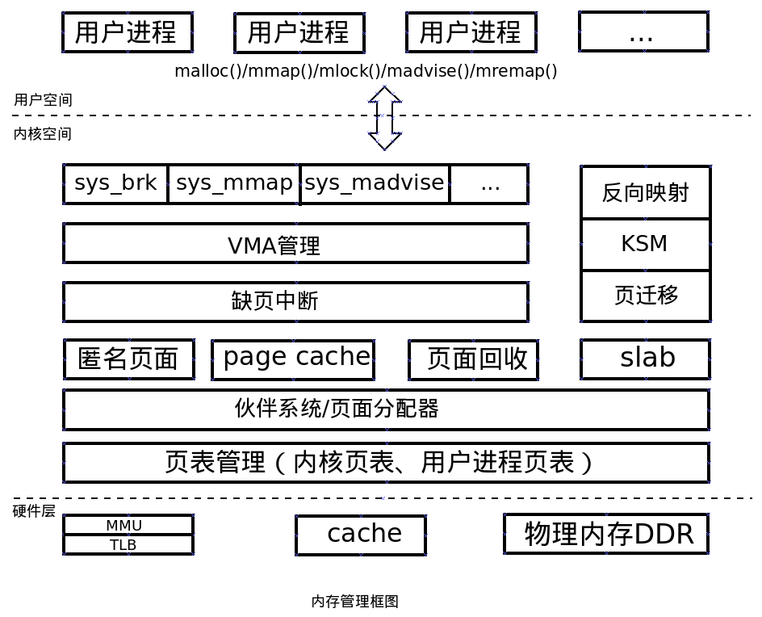
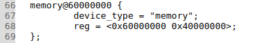
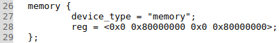
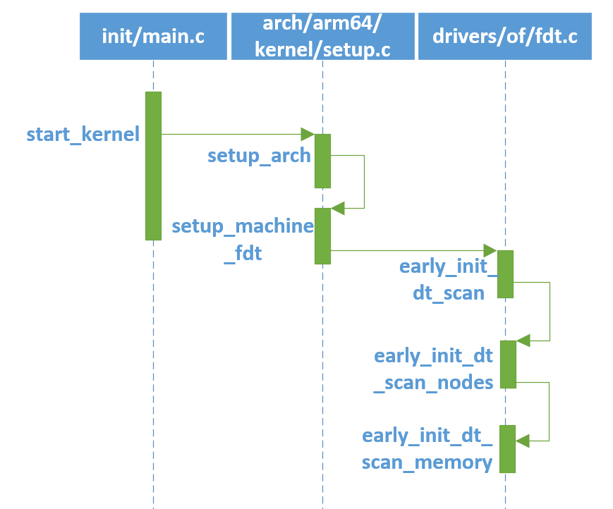

# Linux内核分析（二）——内存

## 1. 物理内存初始化

- 从硬件角度来看内存，随机存储器（RAM）是与CPU直接交换数据的内部存储器。目前大部分计算机都使用DDR的存储设备。DDR的初始化一般是在BIOS或bootloader中，BIOS或bootloader把DDR的大小传递给Linux内核，因此从Linux内核角度来看，DDR其实就是一段物理内存空间。

### 1.1 内存管理概述

- 内存空间分为3个层次：用户空间层、内核空间层、硬件层。
  1. 用户空间层，可以理解为Linux内核内存管理为用户空间暴露的系统调用接口。
  2. 内核空间层，包含的模块相当丰富。用户空间和内核空间的接口是系统调用，因此内核空间层首先需要处理这些内存管理相关的系统调用，例如sys_brk、sys_mmap、sys_madvise等。接下来就包括VMA管理、缺页中断管理、匿名页面、page cache、页面回收、反向映射、slab分配器、页面管理等模块了。
  3. 硬件层，包括处理器的MMU、TLB、cache部件，以及板载的物理内存，例如LPDDR或者DDR。

### 1.2 DTS

- 在ARM Linux中，各种设备的相关属性描述都采用DTS方式来呈现。DTS是device tree source的简称。
- 如果要使用Device Tree，首先用户要了解自己的硬件配置和系统运行参数，并把这些信息组织成Device Tree source file。通过DTC（Device Tree Compiler），可以将这些适合人类阅读的Device Tree source file变成适合机器处理的Device Tree binary file（有一个更好听的名字，DTB，device tree blob）。在系统启动的时候，boot program（例如：firmware、bootloader）可以将保存在flash中的DTB copy到内存（当然也可以通过其他方式，例如可以通过bootloader的交互式命令加载DTB，或者firmware可以探测到device的信息，组织成DTB保存在内存中），并把DTB的起始地址传递给client program（例如OS kernel，bootloader或者其他特殊功能的程序）。对于计算机系统（computer system），一般是firmware->bootloader->OS，对于嵌入式系统，一般是bootloader->OS。
- .dts文件是一种ASCII 文本格式的Device Tree描述，此文本格式非常人性化，适合人类的阅读习惯。基本上，在ARM Linux在，一个.dts文件对应一个ARM的machine，一般放置在内核的arch/arm/boot/dts/目录。由于一个SoC可能对应多个machine（一个SoC可以对应多个产品和电路板），势必这些.dts文件需包含许多共同的部分，Linux内核为了简化，把SoC公用的部分或者多个machine共同的部分一般提炼为.dtsi，类似于C语言的头文件。其他的machine对应的.dts就include这个.dtsi。
- 参考文档：https://blog.csdn.net/radianceblau/article/details/70800076

### 1.3 内核内存大小

- 内核内存定义：

  1. sprdroid9.0_trunk/kernel4.14/arch/arm/boot/dts/vexpress-v2p-ca9.dts
  2. sprdroid9.0_trunk/kernel4.14/arch/arm64/boot/dts/sprd/sp9832e-1h10.dts 

  3. 以上分别为arm32、arm64内核内存定义，vexpress-v2p-ca9.dts文件中定义了内核内存的起始地址为0x6000 0000， 大小为0x4000 0000，即1G大小的的内存空间。sp9832e-1h10.dts文件中定义了内存的起始地址为0x0000 0000 8000 0000，大小为0x0000 0000 8000 0000，即2G大小的内核内存空间，注意，此处的起始地址为物理地址。

  4. arm32、arm64内存定义因为地址位数不同稍有不同，具体可参考Linux设备树中节点的定义等相关知识，如https://www.linuxidc.com/Linux/2016-01/127337p6.htm

- 解析内存
  
  1. 内核在启动的过程中，需要解析DTS（vexpress-v2p-ca9.dts、sp9832e-1h10.dts）文件，相关代码调用如下：
  
  2. 函数解析
  
     - [linux-4.0](http://localhost:8080/source/xref/linux-4.0/)/[init](http://localhost:8080/source/xref/linux-4.0/init/)/[main.c](http://localhost:8080/source/xref/linux-4.0/init/main.c)
  
       ​		start_kernel(void) -> setup_arch(&command_line)，调用setup_arch函数，传给他的参数是未被初始化的内部变量command_line。
  
     ```c
     489  asmlinkage __visible void __init start_kernel(void)
     490  {
     491  	char *command_line;
     		...
     520  	setup_arch(&command_line);
     		...
     675  }
     ```
  
     
  
     - [linux-4.0](http://localhost:8080/source/xref/linux-4.0/)/[arch](http://localhost:8080/source/xref/linux-4.0/arch/)/[arm64](http://localhost:8080/source/xref/linux-4.0/arch/arm64/)/[kernel](http://localhost:8080/source/xref/linux-4.0/arch/arm64/kernel/)/[setup.c](http://localhost:8080/source/xref/linux-4.0/arch/arm64/kernel/setup.c)
  
       ​		setup_arch(&command_line) -> setup_machine_fdt(__fdt_pointer)，这个setup_arch()函数是start_kernel阶段最重要的一个函数，每个体系都有自己的setup_arch()函数，是体系结构相关的，具体编译哪个体系的setup_arch()函数，由顶层Makefile中的ARCH变量决定。
  
     ```c
     356  void __init setup_arch(char **cmdline_p)
     357  {
     		...
             
     360  	setup_machine_fdt(__fdt_pointer);
     361  
     		...
     405  }
     ```
  
     ​		参数__fdt_pointer 是bootloader传递过来的，代表devicetree在内存中的地址
  
     
  
     - setup_machine_fdt(__fdt_pointer) -> early_init_dt_scan(phys_to_virt(dt_phys))
  
     ```C
     310  static void __init setup_machine_fdt(phys_addr_t dt_phys)
     311  {
     312  	if (!dt_phys || !early_init_dt_scan(phys_to_virt(dt_phys))) {
     			...
     321  	}
     		...
     324  }
     ```
  
     ​		phys_to_virt() 函数将物理地址转化为虚拟地址。
  
     
  
     - [linux-4.0](http://localhost:8080/source/xref/linux-4.0/)/[drivers](http://localhost:8080/source/xref/linux-4.0/drivers/)/[of](http://localhost:8080/source/xref/linux-4.0/drivers/of/)/[fdt.c](http://localhost:8080/source/xref/linux-4.0/drivers/of/fdt.c)
  
       early_init_dt_scan(phys_to_virt(dt_phys)) -> early_init_dt_scan_nodes()
  
     ```c
     1038  bool __init early_init_dt_scan(void *params)
     1039  {
     1040  	bool status;
     1041  
     1042  	status = early_init_dt_verify(params);
     1043  	if (!status)
     1044  		return false;
     1045  
     1046  	early_init_dt_scan_nodes();
     1047  	return true;
     1048  }
     ```
  
     
  
     - early_init_dt_scan_nodes(phys_to_virt(dt_phys)) -> early_init_dt_verify(params)，early_init_dt_verify(params)函数中，将devicetree在内存中的地址（转换后的虚拟地址）赋值给initial_boot_params，initial_boot_params在后面的of_scan_flat_dt函数使用到。
  
     ```c
     1009  bool __init early_init_dt_verify(void *params)
     1010  {
     1011  	if (!params)
     1012  		return false;
     1013  
     1014  	/* check device tree validity */
     1015  	if (fdt_check_header(params))
     1016  		return false;
     1017  
     1018  	/* Setup flat device-tree pointer */
     1019  	initial_boot_params = params;
     1020  	of_fdt_crc32 = crc32_be(~0, initial_boot_params,
     1021  				fdt_totalsize(initial_boot_params));
     1022  	return true;
     1023  }
     ```
  
     
  
     - early_init_dt_scan_nodes() -> early_init_dt_scan_memory
  
     ```c
     1026  void __init early_init_dt_scan_nodes(void)
     1027  {
     1028  	/* Retrieve various information from the /chosen node */
     1029  	of_scan_flat_dt(early_init_dt_scan_chosen, boot_command_line);
     1030  
     1031  	/* Initialize {size,address}-cells info */
     1032  	of_scan_flat_dt(early_init_dt_scan_root, NULL);
     1033  
     1034  	/* Setup memory, calling early_init_dt_add_memory_arch */
     1035  	of_scan_flat_dt(early_init_dt_scan_memory, NULL);
     1036  }
     ```
  
     
  
     - of_scan_flat_dt函数是用来scan整个device  tree，针对每一个node调用callback函数。"of_scan_flat_dt(early_init_dt_scan_memory, NULL)"针对memory node进行scan。 
  
     ```c
     590  int __init of_scan_flat_dt(int (*it)(unsigned long node,
     591  				     const char *uname, int depth,
     592  				     void *data),
     593  			   void *data)
     594  {
     595  	const void *blob = initial_boot_params;
     596  	const char *pathp;
     597  	int offset, rc = 0, depth = -1;
     598  
     599     for (offset = fdt_next_node(blob, -1, &depth);
     600               offset >= 0 && depth >= 0 && !rc;
     601               offset = fdt_next_node(blob, offset, &depth)) {
     602  
     603  		pathp = fdt_get_name(blob, offset, NULL);
     604  		if (*pathp == '/')
     605  			pathp = kbasename(pathp);
     606  		rc = it(offset, pathp, depth, data);
     607  	}
     608  	return rc;
     609  }
     ```
  
     
  
     - setup_machine_fdt、early_init_dt_scan、early_init_dt_scan_nodes、early_init_dt_verify、early_init_dt_scan_nodes、of_scan_flat_dt、以及early_init_dt_scan_memory都是对设备树进行操作的相关函数，需要对设备树有一定的了解，我们会在其他章节中对设备树及其内核中设备树相关的操作函数做一详细介绍，本章节暂只理解各函数基本功能即可。early_init_dt_scan_memory函数是对设备树中内存节点读取的核心函数。
  
     ```c
     856  int __init early_init_dt_scan_memory(unsigned long node, const char *uname,
     857  				     int depth, void *data)
     858  {
     859  	const char *type = of_get_flat_dt_prop(node, "device_type", NULL);
     860  	const __be32 *reg, *endp;
     861  	int l;
     862  
     863  	/* We are scanning "memory" nodes only */
     864  	if (type == NULL) {
     865  		/*
     866  		 * The longtrail doesn't have a device_type on the
     867  		 * /memory node, so look for the node called /memory@0.
     868  		 */
     869  		if (!IS_ENABLED(CONFIG_PPC32) || depth != 1 || strcmp(uname, "memory@0") != 0)
     870  			return 0;
     871  	} else if (strcmp(type, "memory") != 0)
     872  		return 0;
     873  
     874  	reg = of_get_flat_dt_prop(node, "linux,usable-memory", &l);
     875  	if (reg == NULL)
     876  		reg = of_get_flat_dt_prop(node, "reg", &l);
     877  	if (reg == NULL)
     878  		return 0;
     879  
     880  	endp = reg + (l / sizeof(__be32));
     881  
     882  	pr_debug("memory scan node %s, reg size %d, data: %x %x %x %x,\n",
     883  	    uname, l, reg[0], reg[1], reg[2], reg[3]);
     884  
     885  	while ((endp - reg) >= (dt_root_addr_cells + dt_root_size_cells)) {
     886  		u64 base, size;
     887  
     888  		base = dt_mem_next_cell(dt_root_addr_cells, &reg);
     889  		size = dt_mem_next_cell(dt_root_size_cells, &reg);
     890  
     891  		if (size == 0)
     892  			continue;
     893  		pr_debug(" - %llx ,  %llx\n", (unsigned long long)base,
     894  		    (unsigned long long)size);
     895  
     896  		early_init_dt_add_memory_arch(base, size);
     897  	}
     898  
     899  	return 0;
     900  }
     ```
  
     ​		of_get_flat_dt_prop(node, "device_type", NULL)；获取device_type属性值。
  
     ​		第874行可以看出linux内核不仅支持reg属性，也支持linux,usable-memory属性。由于memory node一定是root node的child，因此dt_root_addr_cells（root  node的#address-cells属性值）和dt_root_size_cells（root node的#size-cells属性值）之和就是address，size数组的entry size，这两个值在early_init_dt_scan_root函数中设置。
  
     ​		early_init_dt_add_memory_arch(base, size)添加物理内存到memblock中进行管理。