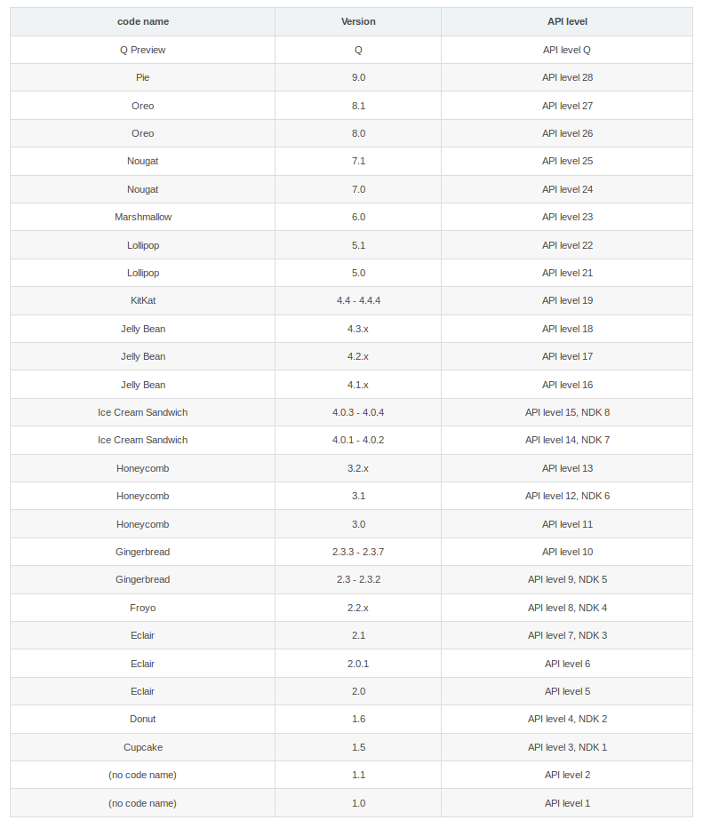
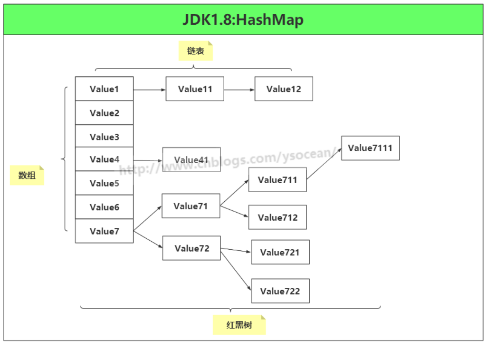
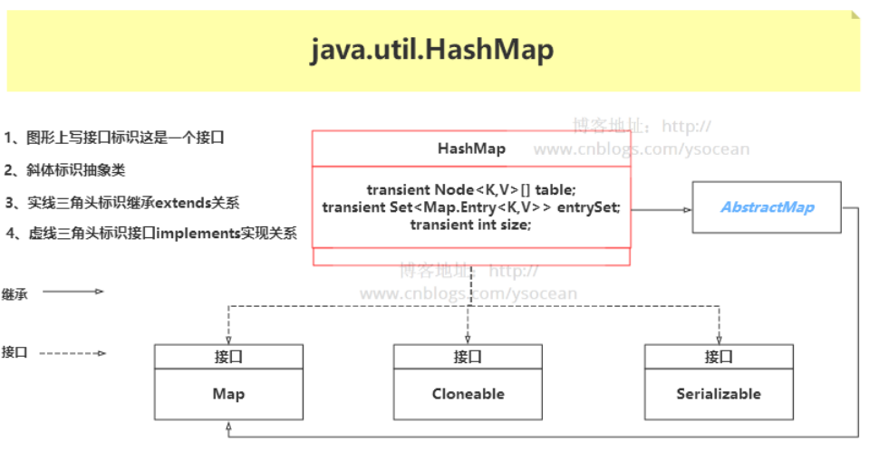
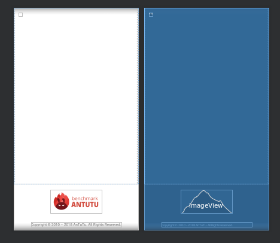
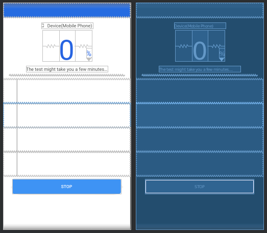

# Android 笔记（antutu源码分析）

## Android中的Bundle
- Bundle主要用于传递数据；它保存的数据，是以key-value(键值对)的形式存在的。
- Bundle经常使用在Activity之间或者线程间传递数据，传递的数据可以是boolean、byte、int、long、float、double、string等基本类型或它们对应的数组，也可以是对象或对象数组。
- 当Bundle传递的是对象或对象数组时，必须实现Serializable或Parcelable接口。
- Bundle提供了各种常用类型的putXxx()/getXxx()方法，用于读写基本类型的数据。（各种方法可以查看API）
- https://www.jianshu.com/p/deb1c62bce5f
---

## app_v7_r5/app/src/main/java/com/antutu/ABenchMark/ABenchMarkStart.java:87
- 源码：
    ```
    @Override
    protected void onCreate(Bundle savedInstanceState) {
        if (savedInstanceState == null){
            savedInstanceState = new Bundle();
        }
        savedInstanceState.putBoolean(KEY_IS_FULL_SCREEN, true);
        super.onCreate(savedInstanceState);
        ...
        setContentView(R.layout.activity_abenchmark_start);
        ...
    }
    ```
- 分析：
    - super.onCreate(savedInstanceState)是调用父类Activity的onCreate()方法；
    - savedInstanceState是保存当前Activity的状态信息，如果一个非running的Activity因为资源紧张而被系统销毁，当再次启动这个Activity时，可以通过这个保存下来的状态实例，即通过saveInstanceState获取之前的信息，然后使用这些信息，让用户感觉和之前的界面一模一样，提升用户体验；
    - https://www.cnblogs.com/dazuihou/p/3565647.html
---

## @Nullable
- 源码：
    ```
    protected void onCreate(@Nullable Bundle savedInstanceState)
    ```
- 分析：
    - 在写程序的时候你可以定义是否可为空指针。通过使用像@NotNull和@Nullable之类的annotation来声明一个方法是否是空指针安全的。现代的编译器、IDE或者工具可以读此annotation并帮你添加忘记的空指针检查，或者向你提示出不必要的乱七八糟的空指针检查。IntelliJ和findbugs已经支持了这些annotation。这些annotation同样是JSR 305的一部分，但即便IDE或工具中没有，这个annotation本身可以作为文档。看到@NotNull和@Nullable，程序员自己可以决定是否做空指针检查。顺便说一句，这个技巧对Java程序员来说相对比较新，要采用需要一段时间。
    - https://blog.csdn.net/ashencode/article/details/81865462
---

## Android中setContentView的作用
- 源码：app_v7_r5/app/src/main/java/com/antutu/ABenchMark/ABenchMarkStart.java:101
    ```
    @Override
    protected void onCreate(Bundle savedInstanceState) {
        ...
        setContentView(R.layout.activity_abenchmark_start);
        ...
    }
    ```
- 分析：
    - setContentView主要做了两件事，一是创建系统布局，二是加载自己的布局
    - https://blog.csdn.net/u013209460/article/details/82964724
---

## Android名称、版本和API level的对应关系
- 对应关系如图：
    
---

## Android中的ABI
- ABI是Application Binary Interface的缩写。
- ABI常表示两个程序模块之间的接口，且其中一个模块常为机器码级别的library或操作系统。
- ABI定义了函数库的调用、应用的二进制文件（尤其是.so）如何运行在相应的系统平台上等细节。
- Android目前支持以下七种ABI：armeabi、armeabi-v7a、arm64-v8a、x86、x86_64、mips、mips64
- https://blog.csdn.net/mandagod/article/details/88245287
---
<br/>

# com.antutu.benchmark - ABenchmarkApplication.java (此文件中的代码主要涉及antutu apk的安装)
## JDK1.8源码——java.util.HashMap 类
- HashMap 是一个利用哈希表原理来存储元素的集合。遇到冲突时，HashMap 是采用的链地址法来解决，在 JDK1.7 中，HashMap 是由 数组+链表构成的。但是在 JDK1.8 中，HashMap 是由 数组+链表+红黑树构成，新增了红黑树作为底层数据结构，结构变得复杂了，但是效率也变的更高效。下面我们来具体介绍在 JDK1.8 中 HashMap 是如何实现的。

- HashMap 是一个散列表，它存储的内容是键值对(key-value)映射，而且 key 和 value 都可以为 null。 
    ```
    public class HashMap<K,V> extends AbstractMap<K,V>
    implements Map<K,V>, Cloneable, Serializable {
    ```
    

- 参考技术文档：https://www.cnblogs.com/ysocean/p/8711071.html
---

## java.lang.ref.WeakReference类
- 在Java里, 当一个对象o被创建时, 它被放在Heap里. 当GC运行的时候, 如果发现没有任何引用指向o, o就会被回收以腾出内存空间. 或者换句话说, 一个对象被回收, 必须满足两个条件: 1)没有任何引用指向它 2)GC被运行.
- 在现实情况写代码的时候, 我们往往通过把所有指向某个对象的referece置空来保证这个对象在下次GC运行的时候被回收 (可以用java -verbose:gc来观察gc的行为)
    ```
    Object c = new Car();
    c=null;
    ```
- 手动置空对象对于程序员来说, 是一件繁琐且违背自动回收的理念的.  对于简单的情况, 手动置空是不需要程序员来做的, 因为在java中, 对于简单对象, 当调用它的方法执行完毕后, 指向它的引用会被从stack中popup, 所以他就能在下一次GC执行时被回收了. 但是, 也有特殊例外. 当使用cache的时候, 由于cache的对象正是程序运行需要的, 那么只要程序正在运行, cache中的引用就不会被GC给(或者说, cache中的reference拥有了和主程序一样的life cycle). 那么随着cache中的reference越来越多, GC无法回收的object也越来越多, 无法被自动回收. 当这些object需要被回收时, 回收这些object的任务只有交给程序编写者了. 然而这却违背了GC的本质(自动回收可以回收的objects).
- 所以，java中引入了weak reference. 相对于前面举例中的strong reference:
    ```
    Object c = new Car(); //只要c还指向car object, car object就不会被回收
    ```
 - 当一个对象仅仅被weak reference指向, 而没有任何其他strong reference指向的时候, 如果GC运行, 那么这个对象就会被回收. weak reference的语法是:
    ```
    WeakReference<Car> weakCar = new WeakReference(Car)(car);
    ```
 - 当要获得weak reference引用的object时, 首先需要判断它是否已经被回收:
    ```
    weakCar.get();
    如果此方法为空, 那么说明weakCar指向的对象已经被回收了.
    ```
- 参考技术文档：https://blog.csdn.net/zmx729618/article/details/54093532
---

## android.support.multidex.MultiDex
1. 对于功能越来越复杂的app的两大问题
    - 我们自己应用的方法数超过了65536, 我们所说的方法数限制，这个方法数包括了jar包，框架，还有我们自己应用的代码
    - 我们应用的方法数没有超过65536，但是加上依赖的jar包，框架等，超过了65536（根据方案一的结果，我们应用方法数是65579，那我们删掉200个方法，就小于65536）
    - 方法数并没有超过65536，编译也完成了，但是在android2.3以前的系统安装的时候，会异常中止安装。
        - 这个问题会发生在Android 2.2以及Android 2.3的设备上，涉及到一个名为dexopt的程序，全称dex optimization，即dex文件优化程序。在优化过程中，dexopt采用一个固定大小的缓冲区（LinearAlloc）来存储应用中所有方法的信息，那么之所以会出现在老版本停止安装，是因为老版本的缓冲区的大小是5M，而在新版本中，这个缓冲区的大小是8M或者16M，在老版本中更容易超过这个限制。
        - dexopt的执行过程是在第一次加载dex文件的时候执行的。这个过程产生了一个ODEX文件，全称Optimised Dex。这个ODEX文件是在安装过程中从apk里提取出的可运行文件，是优化dex产生的，再把apk包里的dex文件删除，这样就做到了预先提取。如果没有ODEX文件，那么系统会从apk包中提取dex然后再运行。所以优化后可以加快软件的启动速度，预先提取，减少对RAM的占用。

        - 在早期的Android系统中，dexopt会把每一个类的方法id检索起来，存在一个链表结构里，而这个链表的长度是用一个short类型来保存的，导致方法id的数目不能够超过65536个。虽然新版本的android系统中，dexopt修复了这个问题，但是老版本的android系统的用户市场占有率还是占一定比例，还是不能放弃这部分用户的，所以我们在开发中需要对老版本的这个问题进行兼容。

2. 方法数越界的解决方案
    - 插件化技术
        - 我们可以采用动态加载部分dex，通过将一个dex拆分成两个或多个dex，解决方法数越界的问题。
        - 插件化是一套重量级的技术方案，我们需要通过反射来调用插件的类或方法，要使用一套插件框架来配合，而且插件化适合一些独立的模块，兼容性问题往往较多，如果只是用于解决方法数越界的话，并不是最好的方案。
    - multidex解决方案
        - 为了解决方法数越界的问题，Google在2014年提出了multidex的解决方案，这个方案主要是针对AndroidStudio和Gradle编译环境的，将一个dex文件拆成两个或多个dex文件。
        - 不过需要注意的是multidex有一个版本问题，在Android 5.0以前使用multidex需要手动引入Google提供的android-support-multidex.jar这个jar包。这个jar包我们可以在Android SDK目录下的extras/android/support/multidex/library/libs下找到。而从Android 5.0开始，Andorid默认支持了multidex。
        - 所以，我们就需要注意我们的SDK版本了，如果已经支持了multidex，而我们又把android-support-multidex.jar放在了项目的libs文件下，就会报错。
3. MultiDex.install 对dex的加载。
4. 参考技术文档：https://www.cnblogs.com/chenxibobo/p/6076459.html <br/>
    https://www.cnblogs.com/lzl-sml/p/5216861.html <br />
    https://likfe.com/2016/08/17/android-multiDex/
---

# com.antutu.ABenchMark -- ABenchMarkStart.java(antutu的启动界面)
## layout -- activity_abenchmark_start.xml
- 
- setContentView(R.layout.activity_abenchmark_start)
    - R.layout.activity_abenchmark_start是个布局文件即控件都是如何摆放如何显示的，setContentView就是设置一个Activity的显示界面，这句话就是设置这个这句话所再的Activity采用R.layout下的main布局文件进行布局
---

# com.antutu.benchmark.ui.test.activity -- ActivityScoreBench.java(antutu开始测试)
## layout -- activity_main_test.xml
- 
- 点击Test后，跳转到界面，执行测试前的一些准备工作


