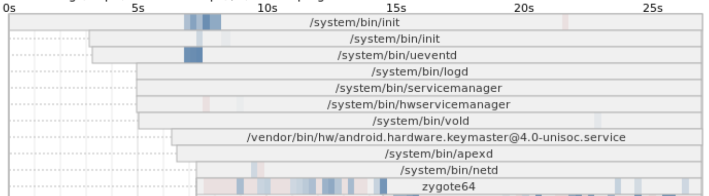
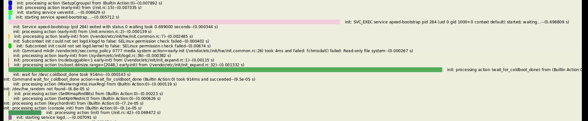
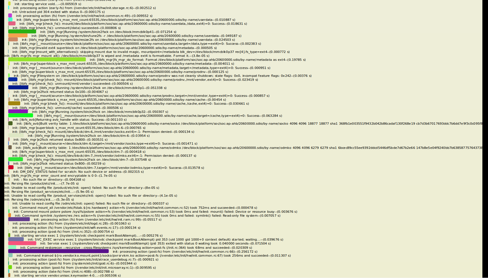
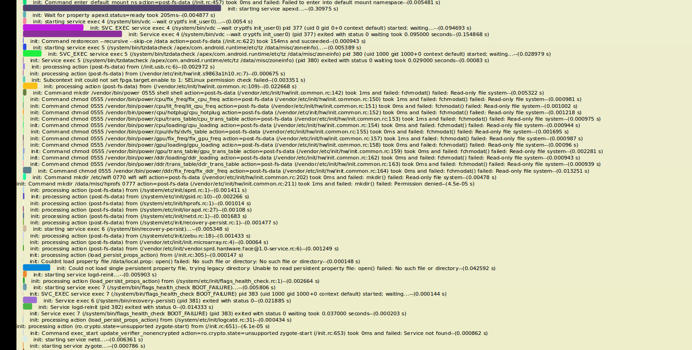

# AndroidQ裁剪

## 开机启动优化

- 查看系统启动时间的命令

  `sudo adb logcat -b events | grep boot`

- 启动阶段主要事件

  |                                name | description                                                  |
  | ----------------------------------: | ------------------------------------------------------------ |
  |                 boot_progress_start | 代表着Android屏幕点亮，开始显示启动动画. 系统进入用户空间，标志着kernel启动完成 |
  |         boot_progress_preload_start | Zygote启动                                                   |
  |           boot_progress_preload_end | Zygote结束                                                   |
  |            boot_progress_system_run | SystemServer ready,开始启动Android系统服务，如PMS，APMS等    |
  |             boot_progress_pms_start | PMS开始扫描安装的应用                                        |
  | boot_progress_pms_system_scan_start | PMS先行扫描/system目录下的安装包                             |
  |   boot_progress_pms_data_scan_start | PMS扫描/data目录下的安装包                                   |
  |          boot_progress_pms_scan_end | PMS扫描结束                                                  |
  |             boot_progress_pms_ready | PMS就绪                                                      |
  |             boot_progress_ams_ready | AMS就绪                                                      |
  |         boot_progress_enable_screen | AMS启动完成后开始激活屏幕，从此以后屏幕才能响应用户的触摸，它在WindowManagerService发出退出开机动画的时间节点之前，而真正退出开机动画还会花费少许时间，具体依赖animation zip 包中的desc.txt。wm_boot_animation_done才是用户感知到的动画结束时间节点 |
  |                    sf_stop_bootanim | SF设置service.bootanim.exit属性值为1，标志系统要结束开机动画了，可以用来跟踪开机动画结尾部分消耗的时间 |
  |              wm_boot_animation_done | 开机动画结束，这一步用户能直观感受到开机结束                 |

  > 1. Kernel part : boot_progress_start
  > 2. Zygote time : boot_progress_preload_end - boot_progress_preload_start
  > 3. /system Scan time : boot_progress_pms_data_scan_start - boot_progress_pms_system_scan_start
  > 4. /data Scan time : boot_progress_pms_scan_end- boot_progress_pms_data_scan_start
  > 5. Home activity start time : boot_progress_enable_screen- boot_progress_ams_ready


- 各阶段分析

  | 启动阶段主要事件                    | 时间（ms） | 描述                                                         | 时间差值 |
  | ----------------------------------- | ---------- | ------------------------------------------------------------ | -------- |
  | boot_progress_start                 | 9185       | 代表着Android屏幕点亮，开始显示启动动画. 系统进入用户空间，标志着kernel启动完成 | 0        |
  | boot_progress_preload_start         | 11344      | Zygote preload启动                                           | 2159     |
  | boot_progress_preload_end           | 14350      | Zygote preload结束                                           | 3006     |
  | boot_progress_system_run            | 14847      | SystemServer ready,开始启动Android系统服务，如PMS，APMS等    | 497      |
  | boot_progress_pms_start             | 15804      | PMS开始扫描安装的应用                                        | 957      |
  | boot_progress_pms_system_scan_start | 15909      | PMS先行扫描/system目录下的安装包                             | 105      |
  | boot_progress_pms_data_scan_start   | 18870      | PMS扫描/data目录下的安装包                                   | 2961     |
  | boot_progress_pms_scan_end          | 18889      | PMS扫描结束                                                  | 19       |
  | boot_progress_pms_ready             | 19283      | PMS就绪                                                      | 394      |
  | boot_progress_ams_ready             | 23368      | AMS就绪                                                      | 4085     |
  | boot_progress_enable_screen         | 23698      | AMS启动完成后开始激活屏幕，从此以后屏幕才能响应用户的触摸，它在WindowManagerService发出退出开机动画的时间节点之前，而真正退出开机动画还会花费少许时间，具体依赖animation zip 包中的desc.txt。wm_boot_animation_done才是用户感知到的动画结束时间节点 | 330      |
  | sf_stop_bootanim                    | 26607      | SF设置service.bootanim.exit属性值为1，标志系统要结束开机动画了，可以用来跟踪开机动画结尾部分消耗的时间 | 2909     |
  | wm_boot_animation_done              | 26609      | 开机动画结束，这一步用户能直观感受到开机结束                 | 2        |

- 从kernel启动完成到Zygote启动耗时2159ms，期间有如下相关进程：

  
  
- 共有ueventd、logd、servicemanager、hwservicemanager、vold、keymaster、apexd、netd，主要耗时是在logd、keymaster、netd三个进程相比于其前一个进程启动较晚。

- 在ueventd、logd之间，我们从init.rc可以看出，两者之间只有一个`exec_start apexd-bootstrap`，其他的都是文件（夹）操作，我们从kmsg图中也能看出来，期间主要是`exec_start apexd-bootstrap`和`wait_for_coldboot_done`最耗时：

  

- 在vold、keymaster之间，keymaster在vold启动大概1s后才启动，我们从下图中可以看出，这期间主要是fs相关的进程：libfs_mgr、fs、vdc、post-fs

  

- apexd、netd之间，netd在apexd启动大概0.5s后才启动，我们从下图中可以看出，这期间主要耗时在：apexd、vdc

  

- boot_progress_preload_start 到 boot_progress_preload_end，即zygote启动到结束共耗时3006ms，我们从抓取的logcat中分析，这期间主要是PreloadClasses（2091ms）、PreloadResources（621ms），这期间一直在等待`package_native`service

  ```c
  01-01 00:00:11.344   385   385 D Zygote  : begin preload
  01-01 00:00:11.344   385   385 I Zygote  : Calling ZygoteHooks.beginPreload()
  01-01 00:00:11.357   386   386 I zygote  : Explicit concurrent copying GC freed 298(39KB) AllocSpace objects, 0(0B) LOS objects, 98% free, 24KB/1560KB, paused 81us total 14.337ms
  01-01 00:00:11.366   386   386 I zygote  : Explicit concurrent copying GC freed 5(32KB) AllocSpace objects, 0(0B) LOS objects, 98% free, 24KB/1560KB, paused 171us total 8.214ms
  01-01 00:00:11.366   386   386 D Zygote32Timing: PostZygoteInitGC took to complete: 24ms
  01-01 00:00:11.366   386   386 D Zygote32Timing: ZygoteInit took to complete: 25ms
  01-01 00:00:11.379   469   517 I ServiceManager: Waiting for service 'package_native' on '/dev/binder'...
  01-01 00:00:11.414   386   386 I Zygote  : Accepting command socket connections
  01-01 00:00:11.480   469   517 I ServiceManager: Waiting for service 'package_native' on '/dev/binder'...
  01-01 00:00:11.489   385   385 D Zygote64Timing: BeginPreload took to complete: 145ms
  01-01 00:00:11.490   385   385 I Zygote  : Preloading classes...
  01-01 00:00:11.502   385   385 W Zygote  : Class not found for preloading: android.app.-$$Lambda$ActivityThread$ZXDWm3IBeFmLnFVblhB-IOZCr9o
  01-01 00:00:11.581   469   517 I ServiceManager: Waiting for service 'package_native' on '/dev/binder'...
  01-01 00:00:11.654   385   385 W Zygote  : Class not found for preloading: android.bluetooth.BluetoothA2dp$2
  01-01 00:00:11.681   469   517 I ServiceManager: Waiting for service 'package_native' on '/dev/binder'...
  01-01 00:00:11.704   385   385 I PackageBackwardCompatibility: Could not find android.content.pm.AndroidTestBaseUpdater, ignoring
  01-01 00:00:11.782   469   517 I ServiceManager: Waiting for service 'package_native' on '/dev/binder'...
  01-01 00:00:12.084   469   517 I chatty  : uid=0(root) /system/bin/storaged identical 3 lines
  01-01 00:00:12.184   469   517 I ServiceManager: Waiting for service 'package_native' on '/dev/binder'...
  01-01 00:00:12.208   466   466 W ServiceManagement: Waited one second for android.hardware.media.c2@1.0::IComponentStore/software
  01-01 00:00:12.210   466   466 I ServiceManagement: getService: Trying again for android.hardware.media.c2@1.0::IComponentStore/software...
  01-01 00:00:12.286   469   517 I ServiceManager: Waiting for service 'package_native' on '/dev/binder'...
  01-01 00:00:12.376   385   385 E SystemFonts: Error mapping font file /system/fonts/NotoSansCuneiform-Regular.ttf
  01-01 00:00:12.381   385   385 E SystemFonts: Error mapping font file /system/fonts/NotoSansEgyptianHieroglyphs-Regular.ttf
  01-01 00:00:12.387   469   517 I ServiceManager: Waiting for service 'package_native' on '/dev/binder'...
  01-01 00:00:12.480   385   385 E SystemFonts: Error mapping font file /system/fonts/NotoSansSymbols-Regular-Subsetted.ttf
  01-01 00:00:12.480   385   385 E SystemFonts: Error mapping font file /system/fonts/NotoSansCJK-Regular.ttc
  01-01 00:00:12.481   385   385 E SystemFonts: Error mapping font file /system/fonts/NotoSerifCJK-Regular.ttc
  01-01 00:00:12.481   385   385 E SystemFonts: Error mapping font file /system/fonts/NotoColorEmoji.ttf
  01-01 00:00:12.487   469   517 I ServiceManager: Waiting for service 'package_native' on '/dev/binder'...
  01-01 00:00:12.588   469   517 I ServiceManager: Waiting for service 'package_native' on '/dev/binder'...
  01-01 00:00:12.667   385   385 E ActivityRecognitionHardware: activity_recognition HAL is deprecated. class_init is effectively a no-op
  01-01 00:00:12.689   469   517 I ServiceManager: Waiting for service 'package_native' on '/dev/binder'...
  01-01 00:00:12.749   405   405 I ServiceManagement: Registered android.hardware.sensors@1.0::ISensors/default (start delay of 5199ms)
  01-01 00:00:12.749   405   405 I ServiceManagement: Removing namespace from process name android.hardware.sensors@1.0-service to sensors@1.0-service.
  01-01 00:00:12.750   405   405 I android.hardware.sensors@1.0-service: Registration complete for android.hardware.sensors@1.0::ISensors/default.
  01-01 00:00:12.789   469   517 I ServiceManager: Waiting for service 'package_native' on '/dev/binder'...
  01-01 00:00:12.890   385   385 I zygote64: Thread[1,tid=385,Native,Thread*=0x7289c17c00,peer=0x12c021c8,"main"] recursive attempt to load library "libmedia_jni.so"
  01-01 00:00:12.890   469   517 I ServiceManager: Waiting for service 'package_native' on '/dev/binder'...
  01-01 00:00:12.892   385   385 D MtpDeviceJNI: register_android_mtp_MtpDevice
  01-01 00:00:12.892   385   385 I zygote64: Thread[1,tid=385,Native,Thread*=0x7289c17c00,peer=0x12c021c8,"main"] recursive attempt to load library "libmedia_jni.so"
  01-01 00:00:12.893   385   385 I zygote64: Thread[1,tid=385,Native,Thread*=0x7289c17c00,peer=0x12c021c8,"main"] recursive attempt to load library "libmedia_jni.so"
  01-01 00:00:12.934   385   385 W Zygote  : Class not found for preloading: android.media.audiopolicy.AudioProductStrategies
  01-01 00:00:12.934   385   385 W Zygote  : Class not found for preloading: android.media.audiopolicy.AudioVolumeGroups
  01-01 00:00:12.991   469   517 I ServiceManager: Waiting for service 'package_native' on '/dev/binder'...
  01-01 00:00:13.092   469   517 I chatty  : uid=0(root) /system/bin/storaged identical 1 line
  01-01 00:00:13.193   469   517 I ServiceManager: Waiting for service 'package_native' on '/dev/binder'...
  01-01 00:00:13.210   466   466 W ServiceManagement: Waited one second for android.hardware.media.c2@1.0::IComponentStore/software
  01-01 00:00:13.212   466   466 I ServiceManagement: getService: Trying again for android.hardware.media.c2@1.0::IComponentStore/software...
  01-01 00:00:13.262   385   385 W Zygote  : Class not found for preloading: android.view.textclassifier.-$$Lambda$TextClassificationManager$JIaezIJbMig_-kVzN6oArzkTsJE
  01-01 00:00:13.276   413   413 E libtrusty: tipc_connect: can't connect to tipc service "com.android.trusty.faceid" (err=110)
  01-01 00:00:13.276   413   413 E Face-CA : tipc_connect() failed! 
  01-01 00:00:13.276   413   413 E Face-CA : open_tee_faceid: connect faceid ta error(-110).
  01-01 00:00:13.277   413   413 E FaceIdHal: open tee fail.
  01-01 00:00:13.277   413   413 E vendor.sprd.hardware.face@1.0-service: Can't open face methods, error: -1
  01-01 00:00:13.277   413   413 E vendor.sprd.hardware.face@1.0-service: Can't open HAL module
  01-01 00:00:13.281   413   413 I ServiceManagement: Registered vendor.sprd.hardware.face@1.0::IExtBiometricsFace/default (start delay of 5671ms)
  01-01 00:00:13.282   413   413 I ServiceManagement: Removing namespace from process name vendor.sprd.hardware.face@1.0-service to face@1.0-service.
  01-01 00:00:13.293   469   517 I ServiceManager: Waiting for service 'package_native' on '/dev/binder'...
  01-01 00:00:13.296   385   385 W Zygote  : Class not found for preloading: com.android.internal.net.NetworkStatsFactory
  01-01 00:00:13.315   385   385 W Zygote  : Class not found for preloading: com.android.internal.telephony.-$$Lambda$PhoneSubInfoController$8HFbCDJDN1mrLJG980qYH5MGqMk
  01-01 00:00:13.315   385   385 W Zygote  : Class not found for preloading: com.android.internal.telephony.-$$Lambda$PhoneSubInfoController$U28a_EGx2cvmQhDfRRgonMt5Zrc
  01-01 00:00:13.315   385   385 W Zygote  : Class not found for preloading: com.android.internal.telephony.-$$Lambda$SubscriptionInfoUpdater$-zZXM9oMRZ3vZz7dJOG19J00Bmw
  01-01 00:00:13.316   385   385 W Zygote  : Class not found for preloading: com.android.internal.telephony.-$$Lambda$SubscriptionInfoUpdater$D5yF1HbS4cvCyoAj3FESkPtA_0g
  01-01 00:00:13.316   385   385 W Zygote  : Class not found for preloading: com.android.internal.telephony.-$$Lambda$SubscriptionInfoUpdater$MMx9iQX0JVqqMPLTUZhdBubFSzU
  01-01 00:00:13.350   385   385 W Zygote  : Class not found for preloading: com.android.internal.telephony.PhoneConfigurationModels
  01-01 00:00:13.351   301   301 I hwservicemanager: getTransport: Cannot find entry vendor.sprd.hardware.network@1.0::INetworkControl/default in either framework or device manifest.
  01-01 00:00:13.353   467   467 E NetworkHAL: INetworkControl getService failed !!!
  01-01 00:00:13.359   385   385 W Zygote  : Class not found for preloading: com.android.internal.telephony.SubscriptionController$ScLocalLog
  01-01 00:00:13.365   385   385 W Zygote  : Class not found for preloading: com.android.internal.telephony.UiccSmsController
  01-01 00:00:13.394   469   517 I ServiceManager: Waiting for service 'package_native' on '/dev/binder'...
  01-01 00:00:13.494   469   517 I ServiceManager: Waiting for service 'package_native' on '/dev/binder'...
  01-01 00:00:13.499   385   385 I Zygote  : ...preloaded 7590 classes in 2009ms.
  01-01 00:00:13.500   385   385 I zygote64: VMRuntime.preloadDexCaches starting
  01-01 00:00:13.579   385   385 I zygote64: VMRuntime.preloadDexCaches strings total=391025 before=12823 after=12823
  01-01 00:00:13.579   385   385 I zygote64: VMRuntime.preloadDexCaches types total=36563 before=7150 after=7419
  01-01 00:00:13.579   385   385 I zygote64: VMRuntime.preloadDexCaches fields total=164747 before=8001 after=8202
  01-01 00:00:13.579   385   385 I zygote64: VMRuntime.preloadDexCaches methods total=289327 before=11116 after=11548
  01-01 00:00:13.580   385   385 I zygote64: VMRuntime.preloadDexCaches finished
  01-01 00:00:13.580   385   385 D Zygote64Timing: PreloadClasses took to complete: 2091ms
  01-01 00:00:13.589   385   385 I zygote64: The ClassLoaderContext is a special shared library.
  01-01 00:00:13.593   385   385 D ApplicationLoaders: Created zygote-cached class loader: /system/framework/android.hidl.base-V1.0-java.jar
  01-01 00:00:13.595   469   517 W ServiceManager: Service package_native didn't start. Returning NULL
  01-01 00:00:13.595   469   517 E storaged: getService package_native failed
  01-01 00:00:13.600   385   385 I zygote64: The ClassLoaderContext is a special shared library.
  01-01 00:00:13.601   469   517 I storaged: storaged: Start
  01-01 00:00:13.602   385   385 D ApplicationLoaders: Created zygote-cached class loader: /system/framework/android.hidl.manager-V1.0-java.jar
  01-01 00:00:13.602   385   385 D Zygote64Timing: CacheNonBootClasspathClassLoaders took to complete: 22ms
  01-01 00:00:13.604   469   517 I ServiceManager: Waiting for service 'package_native' on '/dev/binder'...
  01-01 00:00:14.007   469   517 I chatty  : uid=0(root) /system/bin/storaged identical 4 lines
  01-01 00:00:14.108   469   517 I ServiceManager: Waiting for service 'package_native' on '/dev/binder'...
  01-01 00:00:14.147   385   385 I Zygote  : Preloading resources...
  01-01 00:00:14.179   385   385 W Resources: Preloaded drawable resource #0x108027c (android:drawable/dialog_background_material) that varies with configuration!!
  01-01 00:00:14.208   469   517 I ServiceManager: Waiting for service 'package_native' on '/dev/binder'...
  01-01 00:00:14.212   466   466 W ServiceManagement: Waited one second for android.hardware.media.c2@1.0::IComponentStore/software
  01-01 00:00:14.214   466   466 I ServiceManagement: getService: Trying again for android.hardware.media.c2@1.0::IComponentStore/software...
  01-01 00:00:14.217   385   385 I Zygote  : ...preloaded 64 resources in 70ms.
  01-01 00:00:14.223   385   385 I Zygote  : ...preloaded 41 resources in 6ms.
  01-01 00:00:14.223   385   385 D Zygote64Timing: PreloadResources took to complete: 621ms
  01-01 00:00:14.257   385   385 D libEGL  : loaded /vendor/lib64/egl/libEGL_POWERVR_ROGUE.so
  01-01 00:00:14.270   385   385 D libEGL  : loaded /vendor/lib64/egl/libGLESv1_CM_POWERVR_ROGUE.so
  01-01 00:00:14.278   385   385 D libEGL  : loaded /vendor/lib64/egl/libGLESv2_POWERVR_ROGUE.so
  01-01 00:00:14.301   385   385 I Zygote  : Preloading shared libraries...
  01-01 00:00:14.309   469   517 I ServiceManager: Waiting for service 'package_native' on '/dev/binder'...
  01-01 00:00:14.336   385   385 I Zygote  : Called ZygoteHooks.endPreload()
  01-01 00:00:14.339   385   385 I Zygote  : Installed AndroidKeyStoreProvider in 3ms.
  01-01 00:00:14.350   385   385 I Zygote  : Warmed up JCA providers in 11ms.
  01-01 00:00:14.350   385   385 D Zygote  : end preload
  01-01 00:00:14.350   385   385 D Zygote64Timing: ZygotePreload took to complete: 3006ms
  
  ```

- boot_progress_preload_end 到 boot_progress_system_run 耗时497ms，从logcat中分析，此0.5s内主要是zygote创建、启动system server进程：

  ```
  01-01 00:00:14.354   301   301 I hwservicemanager: getTransport: Cannot find entry vendor.sprd.hardware.network@1.0::INetworkControl/default in either framework or device manifest.
  01-01 00:00:14.354   467   467 E NetworkHAL: INetworkControl getService failed !!!
  01-01 00:00:14.395   385   385 I zygote64: Explicit concurrent copying GC freed 62610(3475KB) AllocSpace objects, 16(388KB) LOS objects, 49% free, 2548KB/5097KB, paused 77us total 44.605ms
  01-01 00:00:14.410   469   517 I ServiceManager: Waiting for service 'package_native' on '/dev/binder'...
  01-01 00:00:14.432   385   385 I zygote64: Explicit concurrent copying GC freed 5971(206KB) AllocSpace objects, 0(0B) LOS objects, 49% free, 2373KB/4747KB, paused 38us total 28.491ms
  01-01 00:00:14.433   385   385 D Zygote64Timing: PostZygoteInitGC took to complete: 82ms
  01-01 00:00:14.433   385   385 D Zygote64Timing: ZygoteInit took to complete: 3092ms
  01-01 00:00:14.511   469   517 I ServiceManager: Waiting for service 'package_native' on '/dev/binder'...
  01-01 00:00:14.558   385   385 D Zygote  : Forked child process 737
  01-01 00:00:14.558   385   385 I Zygote  : System server process 737 has been created
  01-01 00:00:14.563   385   385 I Zygote  : Accepting command socket connections
  01-01 00:00:14.602   737   737 I system_server: The ClassLoaderContext is a special shared library.
  01-01 00:00:14.612   469   517 I ServiceManager: Waiting for service 'package_native' on '/dev/binder'...
  01-01 00:00:14.649   737   737 I system_server: The ClassLoaderContext is a special shared library.
  01-01 00:00:14.683   737   737 I chatty  : uid=1000 system_server identical 1 line
  01-01 00:00:14.697   737   737 I system_server: The ClassLoaderContext is a special shared library.
  01-01 00:00:14.713   469   517 I ServiceManager: Waiting for service 'package_native' on '/dev/binder'...
  01-01 00:00:14.831   737   737 I SystemServer: InitBeforeStartServices
  01-01 00:00:14.835   737   737 W SystemServer: System clock is before 1970; setting to 1970.
  01-01 00:00:14.837   737   737 W SystemServer: Timezone not set; setting to GMT.
  01-01 00:00:14.847   737   737 I SystemServer: Entered the Android system server!
  
  ```

- boot_progress_system_run 到 boot_progress_pms_start 耗时957ms，从logcat中分析此期间主要是启动一些主要的service：Installer、DeviceIdentifiersPolicyService、ActivityManager、PowerManager、RecoverySystemService、LightsService、SunLightService、DisplayManagerService、PackageManagerService。

  ```
  01-01 00:00:14.847   737   737 I SystemServer: Entered the Android system server!
  01-01 00:00:14.915   469   517 I chatty  : uid=0(root) /system/bin/storaged identical 2 lines
  01-01 00:00:15.016   469   517 I ServiceManager: Waiting for service 'package_native' on '/dev/binder'...
  01-01 00:00:15.114   737   737 E UsbAlsaJackDetectorJNI: Can't register UsbAlsaJackDetector native methods
  01-01 00:00:15.117   469   517 I ServiceManager: Waiting for service 'package_native' on '/dev/binder'...
  01-01 00:00:15.181   737   737 D SystemServerTiming: InitBeforeStartServices took to complete: 350ms
  01-01 00:00:15.182   737   737 I SystemServer: StartServices
  01-01 00:00:15.182   737   737 I SystemServer: StartWatchdog
  01-01 00:00:15.214   466   466 W ServiceManagement: Waited one second for android.hardware.media.c2@1.0::IComponentStore/software
  01-01 00:00:15.215   466   466 I ServiceManagement: getService: Trying again for android.hardware.media.c2@1.0::IComponentStore/software...
  01-01 00:00:15.215   737   737 D SystemServerTiming: StartWatchdog took to complete: 33ms
  01-01 00:00:15.216   737   737 I SystemServer: Reading configuration...
  01-01 00:00:15.216   737   737 I SystemServer: ReadingSystemConfig
  01-01 00:00:15.218   469   517 I ServiceManager: Waiting for service 'package_native' on '/dev/binder'...
  01-01 00:00:15.219   737   737 D SystemServerTiming: ReadingSystemConfig took to complete: 3ms
  01-01 00:00:15.219   737   737 I SystemServer: StartInstaller
  01-01 00:00:15.220   737   764 D SystemServerInitThreadPool: Started executing ReadingSystemConfig
  01-01 00:00:15.222   737   737 I SystemServiceManager: Starting com.android.server.pm.InstallerEx
  01-01 00:00:15.237   737   737 D SystemServerTiming: StartInstaller took to complete: 18ms
  01-01 00:00:15.238   737   737 I SystemServer: DeviceIdentifiersPolicyService
  01-01 00:00:15.238   737   737 I SystemServiceManager: Starting com.android.server.os.DeviceIdentifiersPolicyService
  01-01 00:00:15.239   737   737 D SystemServerTiming: DeviceIdentifiersPolicyService took to complete: 1ms
  01-01 00:00:15.239   737   737 I SystemServer: UriGrantsManagerService
  01-01 00:00:15.240   737   737 I SystemServiceManager: Starting com.android.server.uri.UriGrantsManagerService$Lifecycle
  01-01 00:00:15.253   737   737 D SystemServerTiming: UriGrantsManagerService took to complete: 13ms
  01-01 00:00:15.253   737   737 I SystemServer: StartActivityManager
  01-01 00:00:15.253   737   737 I SystemServiceManager: Starting com.android.server.wm.ActivityTaskManagerService$Lifecycle
  01-01 00:00:15.274   737   737 I SystemServiceManager: Starting com.android.server.am.ActivityManagerService$Lifecycle
  01-01 00:00:15.281   737   764 W SystemConfig: No directory /product/etc/sysconfig, skipping
  01-01 00:00:15.301   737   764 W SystemConfig: No directory /product_services/etc/sysconfig, skipping
  01-01 00:00:15.302   737   764 W SystemConfig: No directory /product_services/etc/permissions, skipping
  01-01 00:00:15.302   737   764 D SystemServerInitThreadPool: Finished executing ReadingSystemConfig
  01-01 00:00:15.318   469   517 I ServiceManager: Waiting for service 'package_native' on '/dev/binder'...
  01-01 00:00:15.335   737   737 E libc    : Access denied finding property "sys.lmk.autocalc"
  01-01 00:00:15.350   737   737 I ActivityManager: Memory class: 192
  01-01 00:00:15.356   301   301 I hwservicemanager: getTransport: Cannot find entry vendor.sprd.hardware.network@1.0::INetworkControl/default in either framework or device manifest.
  01-01 00:00:15.356   467   467 E NetworkHAL: INetworkControl getService failed !!!
  01-01 00:00:15.389   737   737 D BatteryStatsImpl: Reading daily items from /data/system/batterystats-daily.xml
  01-01 00:00:15.419   469   517 I ServiceManager: Waiting for service 'package_native' on '/dev/binder'...
  01-01 00:00:15.432   737   737 E BatteryStatsImpl: Error reading battery statistics
  01-01 00:00:15.432   737   737 E BatteryStatsImpl: java.io.FileNotFoundException: /data/system/batterystats.bin: open failed: ENOENT (No such file or directory)
  01-01 00:00:15.432   737   737 E BatteryStatsImpl: 	at libcore.io.IoBridge.open(IoBridge.java:496)
  01-01 00:00:15.432   737   737 E BatteryStatsImpl: 	at java.io.FileInputStream.<init>(FileInputStream.java:159)
  01-01 00:00:15.432   737   737 E BatteryStatsImpl: 	at com.android.internal.os.AtomicFile.openRead(AtomicFile.java:157)
  01-01 00:00:15.432   737   737 E BatteryStatsImpl: 	at com.android.internal.os.AtomicFile.readFully(AtomicFile.java:162)
  01-01 00:00:15.432   737   737 E BatteryStatsImpl: 	at com.android.internal.os.BatteryStatsImpl.readLocked(BatteryStatsImpl.java:13375)
  01-01 00:00:15.432   737   737 E BatteryStatsImpl: 	at com.android.server.am.ActivityManagerService.<init>(ActivityManagerService.java:2524)
  01-01 00:00:15.432   737   737 E BatteryStatsImpl: 	at com.android.server.am.ActivityManagerServiceEx.<init>(ActivityManagerServiceEx.java:90)
  01-01 00:00:15.432   737   737 E BatteryStatsImpl: 	at com.android.server.am.ActivityManagerService$Lifecycle.<init>(ActivityManagerService.java:2238)
  01-01 00:00:15.432   737   737 E BatteryStatsImpl: 	at java.lang.reflect.Constructor.newInstance0(Native Method)
  01-01 00:00:15.432   737   737 E BatteryStatsImpl: 	at java.lang.reflect.Constructor.newInstance(Constructor.java:343)
  01-01 00:00:15.432   737   737 E BatteryStatsImpl: 	at com.android.server.SystemServiceManager.startService(SystemServiceManager.java:101)
  01-01 00:00:15.432   737   737 E BatteryStatsImpl: 	at com.android.server.am.ActivityManagerService$Lifecycle.startService(ActivityManagerService.java:2244)
  01-01 00:00:15.432   737   737 E BatteryStatsImpl: 	at com.android.server.SystemServer.startBootstrapServices(SystemServer.java:674)
  01-01 00:00:15.432   737   737 E BatteryStatsImpl: 	at com.android.server.SystemServer.run(SystemServer.java:524)
  01-01 00:00:15.432   737   737 E BatteryStatsImpl: 	at com.android.server.SystemServer.main(SystemServer.java:363)
  01-01 00:00:15.432   737   737 E BatteryStatsImpl: 	at java.lang.reflect.Method.invoke(Native Method)
  01-01 00:00:15.432   737   737 E BatteryStatsImpl: 	at com.android.internal.os.RuntimeInit$MethodAndArgsCaller.run(RuntimeInit.java:503)
  01-01 00:00:15.432   737   737 E BatteryStatsImpl: 	at com.android.internal.os.ZygoteInit.main(ZygoteInit.java:908)
  01-01 00:00:15.432   737   737 E BatteryStatsImpl: Caused by: android.system.ErrnoException: open failed: ENOENT (No such file or directory)
  01-01 00:00:15.432   737   737 E BatteryStatsImpl: 	at libcore.io.Linux.open(Native Method)
  01-01 00:00:15.432   737   737 E BatteryStatsImpl: 	at libcore.io.ForwardingOs.open(ForwardingOs.java:167)
  01-01 00:00:15.432   737   737 E BatteryStatsImpl: 	at libcore.io.BlockGuardOs.open(BlockGuardOs.java:252)
  01-01 00:00:15.432   737   737 E BatteryStatsImpl: 	at libcore.io.IoBridge.open(IoBridge.java:482)
  01-01 00:00:15.432   737   737 E BatteryStatsImpl: 	... 17 more
  01-01 00:00:15.434   737   737 E BatteryStatsImpl: Error reading battery history
  01-01 00:00:15.434   737   737 E BatteryStatsImpl: java.io.FileNotFoundException: /data/system/battery-history/0.bin: open failed: ENOENT (No such file or directory)
  01-01 00:00:15.434   737   737 E BatteryStatsImpl: 	at libcore.io.IoBridge.open(IoBridge.java:496)
  01-01 00:00:15.434   737   737 E BatteryStatsImpl: 	at java.io.FileInputStream.<init>(FileInputStream.java:159)
  01-01 00:00:15.434   737   737 E BatteryStatsImpl: 	at com.android.internal.os.AtomicFile.openRead(AtomicFile.java:157)
  01-01 00:00:15.434   737   737 E BatteryStatsImpl: 	at com.android.internal.os.AtomicFile.readFully(AtomicFile.java:162)
  01-01 00:00:15.434   737   737 E BatteryStatsImpl: 	at com.android.internal.os.BatteryStatsImpl.readLocked(BatteryStatsImpl.java:13394)
  01-01 00:00:15.434   737   737 E BatteryStatsImpl: 	at com.android.server.am.ActivityManagerService.<init>(ActivityManagerService.java:2524)
  01-01 00:00:15.434   737   737 E BatteryStatsImpl: 	at com.android.server.am.ActivityManagerServiceEx.<init>(ActivityManagerServiceEx.java:90)
  01-01 00:00:15.434   737   737 E BatteryStatsImpl: 	at com.android.server.am.ActivityManagerService$Lifecycle.<init>(ActivityManagerService.java:2238)
  01-01 00:00:15.434   737   737 E BatteryStatsImpl: 	at java.lang.reflect.Constructor.newInstance0(Native Method)
  01-01 00:00:15.434   737   737 E BatteryStatsImpl: 	at java.lang.reflect.Constructor.newInstance(Constructor.java:343)
  01-01 00:00:15.434   737   737 E BatteryStatsImpl: 	at com.android.server.SystemServiceManager.startService(SystemServiceManager.java:101)
  01-01 00:00:15.434   737   737 E BatteryStatsImpl: 	at com.android.server.am.ActivityManagerService$Lifecycle.startService(ActivityManagerService.java:2244)
  01-01 00:00:15.434   737   737 E BatteryStatsImpl: 	at com.android.server.SystemServer.startBootstrapServices(SystemServer.java:674)
  01-01 00:00:15.434   737   737 E BatteryStatsImpl: 	at com.android.server.SystemServer.run(SystemServer.java:524)
  01-01 00:00:15.434   737   737 E BatteryStatsImpl: 	at com.android.server.SystemServer.main(SystemServer.java:363)
  01-01 00:00:15.434   737   737 E BatteryStatsImpl: 	at java.lang.reflect.Method.invoke(Native Method)
  01-01 00:00:15.434   737   737 E BatteryStatsImpl: 	at com.android.internal.os.RuntimeInit$MethodAndArgsCaller.run(RuntimeInit.java:503)
  01-01 00:00:15.434   737   737 E BatteryStatsImpl: 	at com.android.internal.os.ZygoteInit.main(ZygoteInit.java:908)
  01-01 00:00:15.434   737   737 E BatteryStatsImpl: Caused by: android.system.ErrnoException: open failed: ENOENT (No such file or directory)
  01-01 00:00:15.434   737   737 E BatteryStatsImpl: 	at libcore.io.Linux.open(Native Method)
  01-01 00:00:15.434   737   737 E BatteryStatsImpl: 	at libcore.io.ForwardingOs.open(ForwardingOs.java:167)
  01-01 00:00:15.434   737   737 E BatteryStatsImpl: 	at libcore.io.BlockGuardOs.open(BlockGuardOs.java:252)
  01-01 00:00:15.434   737   737 E BatteryStatsImpl: 	at libcore.io.IoBridge.open(IoBridge.java:482)
  01-01 00:00:15.434   737   737 E BatteryStatsImpl: 	... 17 more
  01-01 00:00:15.443   737   771 I BatteryStatsService: Using power.stats HAL
  01-01 00:00:15.446   737   771 W BatteryStatsService: Rail information is not available
  01-01 00:00:15.446   737   771 W BatteryStatsService: Rail energy data is not available
  01-01 00:00:15.447   737   771 E BluetoothAdapter: Bluetooth binder is null
  01-01 00:00:15.454   737   771 E BatteryExternalStatsWorker: no controller energy info supplied for telephony
  01-01 00:00:15.470   737   771 I KernelCpuUidFreqTimeReader: mPerClusterTimesAvailable=true
  01-01 00:00:15.519   469   517 I ServiceManager: Waiting for service 'package_native' on '/dev/binder'...
  01-01 00:00:15.546   301   301 I hwservicemanager: getTransport: Cannot find entry android.hardware.memtrack@1.0::IMemtrack/default in either framework or device manifest.
  01-01 00:00:15.546   737   737 E memtrack: Couldn't load memtrack module
  01-01 00:00:15.546   737   737 W android.os.Debug: failed to get memory consumption info: -1
  01-01 00:00:15.557   737   737 I AppOps  : No existing app ops /data/system/appops.xml; starting empty
  01-01 00:00:15.571   737   737 I IntentFirewall: Read new rules (A:0 B:0 S:0)
  01-01 00:00:15.620   737   737 D AppOps  : AppOpsService published
  01-01 00:00:15.620   469   517 I ServiceManager: Waiting for service 'package_native' on '/dev/binder'...
  01-01 00:00:15.637   737   737 D SystemServerTiming: StartActivityManager took to complete: 384ms
  01-01 00:00:15.637   737   737 I SystemServer: StartPowerManager
  01-01 00:00:15.637   737   737 I SystemServiceManager: Starting com.android.server.power.PowerManagerService
  01-01 00:00:15.664   737   737 D PowerManagerService: Acquiring suspend blocker "PowerManagerService.Display".
  01-01 00:00:15.669   301   301 I hwservicemanager: getTransport: Cannot find entry android.hardware.power@1.0::IPower/default in either framework or device manifest.
  01-01 00:00:15.669   737   737 I PowerManagerService-JNI: Couldn't load power HAL service
  01-01 00:00:15.673   737   737 D SystemServerTiming: StartPowerManager took to complete: 36ms
  01-01 00:00:15.673   737   737 I SystemServer: StartThermalManager
  01-01 00:00:15.673   737   737 I SystemServiceManager: Starting com.android.server.power.ThermalManagerService
  01-01 00:00:15.679   737   737 D SystemServerTiming: StartThermalManager took to complete: 6ms
  01-01 00:00:15.679   737   737 I SystemServer: InitPowerManagement
  01-01 00:00:15.683   737   737 D SystemServerTiming: InitPowerManagement took to complete: 4ms
  01-01 00:00:15.683   737   737 I SystemServer: StartRecoverySystemService
  01-01 00:00:15.683   737   737 I SystemServiceManager: Starting com.android.server.RecoverySystemService
  01-01 00:00:15.686   737   737 D SystemServerTiming: StartRecoverySystemService took to complete: 3ms
  01-01 00:00:15.687   737   737 V RescueParty: Disabled because of active USB connection
  01-01 00:00:15.687   737   737 I SystemServer: StartLightsService
  01-01 00:00:15.687   737   737 I SystemServiceManager: Starting com.android.server.lights.LightsService
  01-01 00:00:15.701   737   737 D SystemServerTiming: StartLightsService took to complete: 14ms
  01-01 00:00:15.701   737   737 I SystemServer: StartSidekickService
  01-01 00:00:15.701   737   737 D SystemServerTiming: StartSidekickService took to complete: 0ms
  01-01 00:00:15.703   737   737 I SystemServiceManager: Starting com.android.server.display.SunLightService
  01-01 00:00:15.704   737   737 I SystemServer: StartDisplayManager
  01-01 00:00:15.704   737   737 I SystemServiceManager: Starting com.android.server.display.DisplayManagerService
  01-01 00:00:15.718   737   737 D SystemServerTiming: StartDisplayManager took to complete: 14ms
  01-01 00:00:15.718   737   737 I SystemServer: isCCSASupport = false
  01-01 00:00:15.718   737   737 I SystemServer: WaitForDisplay
  01-01 00:00:15.719   737   737 I SystemServiceManager: Starting phase 100
  01-01 00:00:15.721   469   517 I ServiceManager: Waiting for service 'package_native' on '/dev/binder'...
  01-01 00:00:15.735   737   759 I DisplayManagerService: Display device added: DisplayDeviceInfo{"Built-in Screen": uniqueId="local:0", 1080 x 1920, modeId 2, defaultModeId 2, supportedModes [{id=1, width=720, height=1280, fps=60.0024}, {id=2, width=1080, height=1920, fps=60.0024}], colorMode 0, supportedColorModes [], HdrCapabilities android.view.Display$HdrCapabilities@40f16308, density 480, 403.411 x 403.041 dpi, appVsyncOff 2000000, presDeadline 16666000, touch INTERNAL, rotation 0, type BUILT_IN, address {port=0}, state UNKNOWN, FLAG_DEFAULT_DISPLAY, FLAG_ROTATES_WITH_CONTENT, FLAG_SECURE, FLAG_SUPPORTS_PROTECTED_BUFFERS}
  01-01 00:00:15.749   430   430 D SurfaceFlinger: Setting power mode 2 on display 0
  01-01 00:00:15.751   301   301 I hwservicemanager: getTransport: Cannot find entry android.hardware.light@2.0::ILight/default in either framework or device manifest.
  01-01 00:00:15.752   737   737 D SystemServerTiming: WaitForDisplay took to complete: 33ms
  01-01 00:00:15.752   737   759 W StrictMode: No activity manager; failed to Dropbox violation.
  01-01 00:00:15.753   737   737 I SystemServer: StartPackageManagerService
  01-01 00:00:15.753   737   737 I Watchdog: Pausing HandlerChecker: main thread for reason: packagemanagermain. Pause count: 1
  01-01 00:00:15.755   737   759 I DisplayManagerService: Display device changed state: "Built-in Screen", ON
  01-01 00:00:15.754   737   759 I chatty  : uid=1000(system) android.display identical 4 lines
  01-01 00:00:15.755   737   759 W StrictMode: No activity manager; failed to Dropbox violation.
  01-01 00:00:15.795   737   737 D PackageManagerServiceExUtils: CPU core number: 8
  01-01 00:00:15.798   737   737 D PackageManagerServiceExUtils: CPU core number: 8
  
  ```

- boot_progress_pms_start到boot_progress_pms_scan_end，主要是system目录下app的扫描，共耗时3479ms

## AndroidQ代码修正

- frameworks/base/core/java/com/android/internal/os/ZygoteInit.java
- system/core/init/init.cpp
- frameworks/base/services/java/com/android/server/SystemServer.java +979
  - 不可裁剪
    1. MakeLocationServiceReady 裁掉导致手机不断重启(在bootanimation和luncher界面来回切换)
    2. PhaseThirdPartyAppsCanStart 能启动到桌面，但是桌面黑屏
    3. MakePackageManagerServiceReady 能启动到桌面，但是安装app时导致安装失败
    4. MakePowerManagerServiceReady 裁掉导致手机luncher界面频繁黑屏
    5. MakeWindowManagerServiceReady 能启动到桌面，但是命令行无法运行antutu
    6. StartBootPhaseSystemServicesReady 无法启动到桌面
    7. StartMediaProjectionManager 桌面黑屏
    8. StartMediaSessionService 桌面黑屏
    9. StartJobScheduler 裁掉导致手机不断重启(在bootanimation和luncher界面来回切换)
    10. .StartAudioService 无法启动到桌面
    11.  StartNotificationManager 无法启动到桌面
    12.  StartConnectivityService 无法启动到桌面
    13.  StartNetworkPolicyManagerService 无法启动到桌面
    14.  StartNetworkManagementService 无法启动到桌面
    15.  StartDevicePolicyManager 桌面黑屏
    16.  StartLockSettingsService 无法启动到桌面
    17.  StartStorageManagerService 无法启动到桌面
    18.  MakeDisplayReady 无法启动到桌面
    19.  StartInputMethodManagerLifecycle 无法启动到桌面
    20.  WindowManagerServiceOnInitReady 无法启动到桌面
    21.  SetWindowManagerService 无法启动到桌面
    22.  StartWindowManagerService 无法启动到桌面
    23.  StartInputManagerService 无法启动到桌面
    24.  StartAlarmManagerService 无法启动到桌面
    25.  InstallSystemProviders 无法启动到桌面
    26.  StartContentService 无法启动到桌面
    27.  StartAccountManagerService 无法启动到桌面
    28.  StartWebViewUpdateService 影响antutu成绩
    29.  StartUsageService  无法启动到桌面
    30.  StartBatteryService 无法启动到桌面
    31.  StartOverlayManagerService 无法启动到桌面
    32.  SetSystemProcess 无法启动到桌面
    33.  StartPackageManagerService  无法启动到桌面
    34.  StartDisplayManager 无法启动到桌面
    35.  StartLightsService 无法启动到桌面
    36.  StartPowerManager 无法启动到桌面
    37.  StartActivityManager 无法启动到桌面
    38.  UriGrantsManagerService 无法启动到桌面
  - 可裁剪
    1. WaitForDisplay
    2. StartRollbackManagerService
    3. StartTelephonyRegistry
    4. StartEntropyMixer
    5. StartVibratorService
    6. IpConnectivityMetrics
    7. NetworkWatchlistService
    8. PinnerService
    9. StartUiModeManager
    10.  UpdatePackagesIfNeeded
    11.  StartOemLockService
    12.  StartContentSuggestionsService
    13.  StartWifi
    14.  StartWifiScanning
    15.  StartWifiP2P
    16.  StartTimeDetectorService
    17.  StartSearchManagerService
    18.  StartAppWidgetService
    19.  StartStatsCompanionService
    20.  MakeLockSettingsServiceReady
    21.  MakeWindowManagerServiceReady
    22.  MakeDisplayManagerServiceReady
    23.  StartActivityManagerReadyPhase
    24.  MakeNetworkStatsServiceReady
    25.  MakeConnectivityServiceReady
    26.  StartNetworkStack
    27.  MakeNetworkTimeUpdateReady

## 模块修正

- `com.android.media.swcodec`模块不可移除，否则，antutu3D无法运行