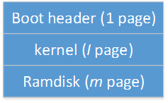
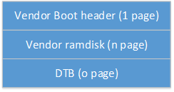

# AndroidR中dts、boot、vendor_boot关系

>   在AndroidR分支，Kernel5.4版本下，当修改dts(i)后，是需要替换boot.img和vendor_boot.img的。
>
>   修改dts(i)，本应该只影响到dtb的编译，那么为什么会涉及到boot.img和vendor_boot.img两个分区？我们通过以下两个分区的文件结构来解释原因：

>   AndroidR + Kernel5.4分区

-   boot.img 文件结构如下，Ramdisk为normally ramdisk & recovery ramdisk。 dts(i)修改后，影响了Kernel Image的文件，或recovery相关文件，需要替换boot.img

 

-   vendor_boot.img 文件结构如下，vendor-ramdisk包含Unisoc first stage fstab & ko 修改了KO相关文件，fstab的文件，dts文件，所以，dts(i)修改后，需要替换vendor_boot.img。

>   dtbo在AndroidR+K5.4上仍然为独立分区。

