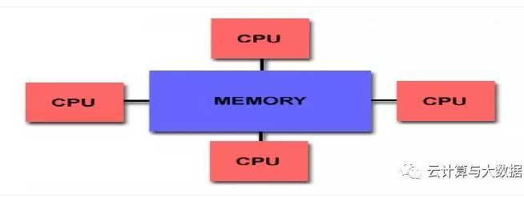
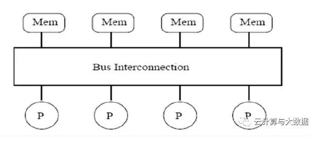
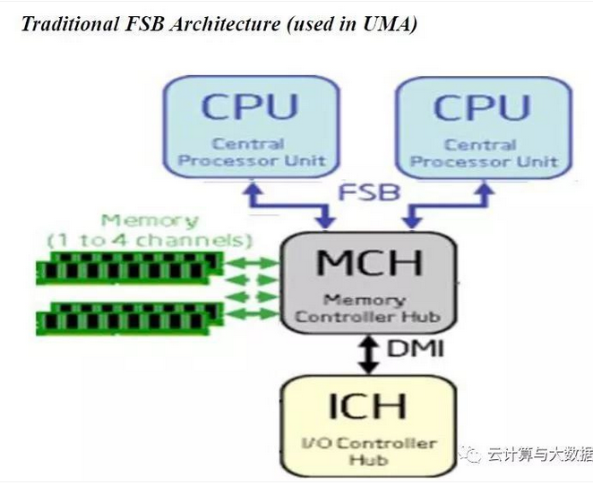
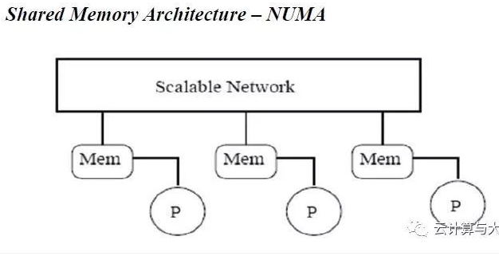
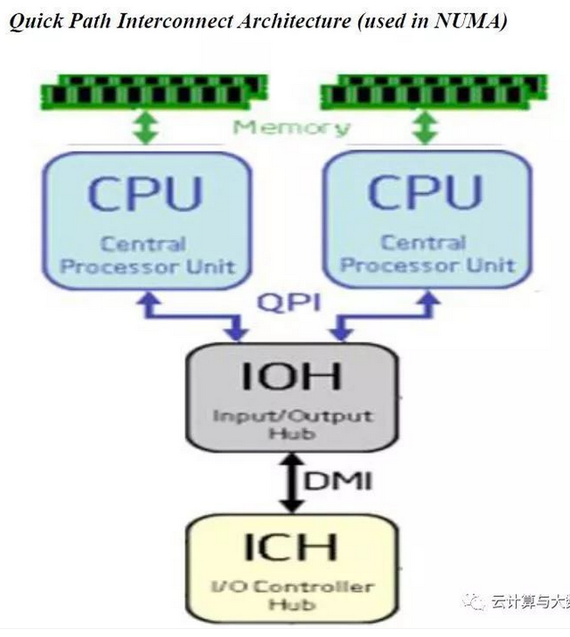
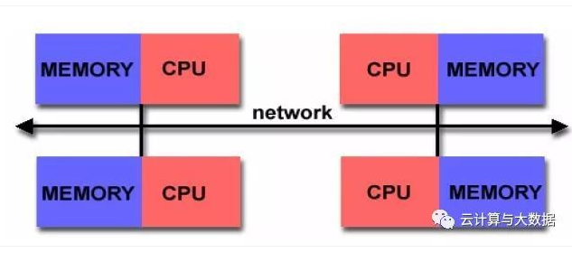
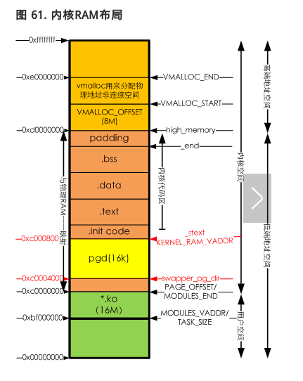
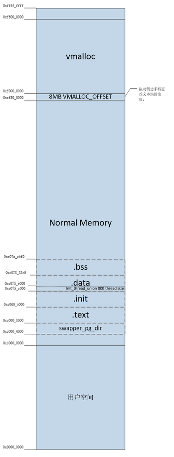
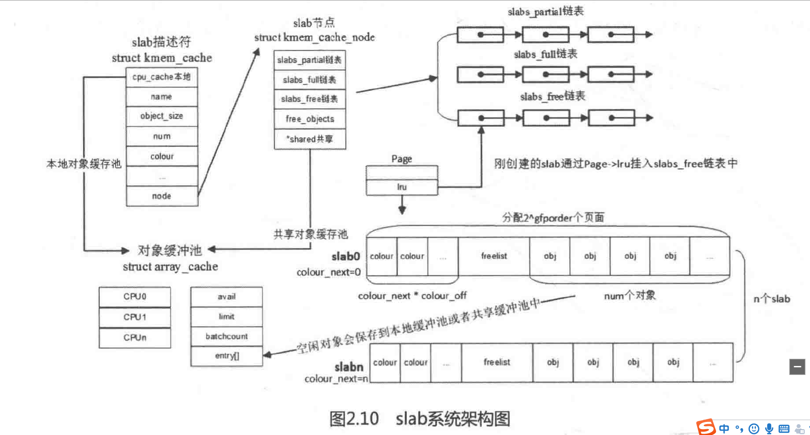
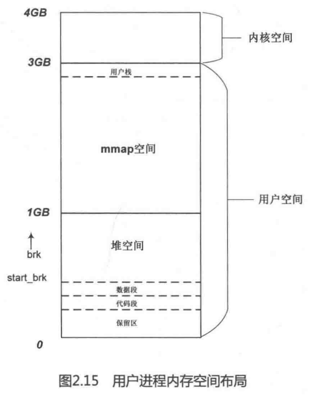

# Kernel 笔记

## 常用数字进制对照
1. 0x40 0000 0000 = 256G
2. 0x1  0000 0000 = 4G
3. 0x   C000 0000 = 3G
4. 0x   8000 0000 = 2G
5. 0x   4000 0000 = 1G
6. 0x   0010 0000 = 1M
7. 0x   0000 0400 = 1K
8. 0x   0000 1000 = 4K
---

## 内核常用宏
1. PAGE_OFFSET: 描述内核空间的偏移量
---

## 内核调试
- 内核编译
  
    ```
    export ARCH=arm
export CROSS_COMPILE=arm-linux-gnueabi-
    make vexpress_defconfig
    make menuconfig
    
    make bzImage -j4 ARCH=arm CROSS_COMPILE=arm-linux-gnueabi-
    make dtbs
    ```
    
    
    
- 模拟4核 Cortex-A9 Versatile Express开发平台：
  
    ```
    qemu-system-arm -M vexpress-a9 -smp 4 -m 1024M -kernel arch/arm/boot/zImage -append "rdinit=/linuxrc console=ttyAMA0 loglevel=8" -dtb arch/arm/boot/dts/vexpress-v2p-ca9.dtb -nographic
    ```

- 关闭QEMU平台：killall qemu-system-arm
---

## DTS（设备树）
- 如果要使用Device Tree，首先用户要了解自己的硬件配置和系统运行参数，并把这些信息组织成Device Tree source file。通过DTC（Device Tree Compiler），可以将这些适合人类阅读的Device Tree source file变成适合机器处理的Device Tree binary file（有一个更好听的名字，DTB，device tree blob）。在系统启动的时候，boot program（例如：firmware、bootloader）可以将保存在flash中的DTB copy到内存（当然也可以通过其他方式，例如可以通过bootloader的交互式命令加载DTB，或者firmware可以探测到device的信息，组织成DTB保存在内存中），并把DTB的起始地址传递给client program（例如OS kernel，bootloader或者其他特殊功能的程序）。对于计算机系统（computer system），一般是firmware->bootloader->OS，对于嵌入式系统，一般是bootloader->OS。

- .dts文件是一种ASCII 文本格式的Device Tree描述，此文本格式非常人性化，适合人类的阅读习惯。基本上，在ARM Linux在，一个.dts文件对应一个ARM的machine，一般放置在内核的arch/arm/boot/dts/目录。由于一个SoC可能对应多个machine（一个SoC可以对应多个产品和电路板），势必这些.dts文件需包含许多共同的部分，Linux内核为了简化，把SoC公用的部分或者多个machine共同的部分一般提炼为.dtsi，类似于C语言的头文件。其他的machine对应的.dts就include这个.dtsi。

- 技术文档：https://blog.csdn.net/radianceblau/article/details/70800076
---

## 内存大小
- 内存定义路径（unisoc）：sprdroid9.0_trunk/kernel4.14/arch/arm64/boot/dts/sprd/ums312-2h10.dts
```
    33	memory: memory {
    34		device_type = "memory";
    35		reg = <0x0 0x80000000 0x0 0x80000000>; #<base-addr size>
    36	};
```
- 读取内存：
    1. sprdroid9.0_trunk/kernel4.14/init/main.c：
    ```
    534	setup_arch(&command_line);
    ```
    2. sprdroid9.0_trunk/kernel4.14/arch/arm64/kernel/setup.c：
    ```
    245void __init setup_arch(char **cmdline_p)
    246{
    247	pr_info("Boot CPU: AArch64 Processor [%08x]\n", read_cpuid_id());
    248
    249	sprintf(init_utsname()->machine, UTS_MACHINE);
    250	init_mm.start_code = (unsigned long) _text;
    251	init_mm.end_code   = (unsigned long) _etext;
    252	init_mm.end_data   = (unsigned long) _edata;
    253	init_mm.brk	   = (unsigned long) _end;
    254
    255	*cmdline_p = boot_command_line; “boot_command_line是一个静态数组，在arm64的环境下是2048，也就是说bootloader传递给kernel的commandline超过2048就要修改kernel源代码加这个数组加大”
    256
    257	early_fixmap_init();
    258	early_ioremap_init();
    259
    260	setup_machine_fdt(__fdt_pointer); “__fdt_pointer 是bootloader传递过来的，代表devicetree在内存中的地址”
    ```
    3. sprdroid9.0_trunk/kernel4.14/arch/arm64/kernel/setup.c：
    ```
    185 if (!dt_virt || !early_init_dt_scan(dt_virt))
    ```
    4. sprdroid9.0_trunk/kernel4.14/drivers/of/fdt.c
    ```
    1322	early_init_dt_scan_nodes();
    ```
    5. sprdroid9.0_trunk/kernel4.14/drivers/of/fdt.c
    ```
    1302void __init early_init_dt_scan_nodes(void)
    1303{
    1304	/* Retrieve various information from the /chosen node */
    1305	of_scan_flat_dt(early_init_dt_scan_chosen, boot_command_line); “获取命令行信息，即dts文件中chosen节点中bootargs，将commandline copy到boot_command_line中”
    1306
    1307	/* Initialize {size,address}-cells info */
    1308	of_scan_flat_dt(early_init_dt_scan_root, NULL);
    1309
    1310	/* Setup memory, calling early_init_dt_add_memory_arch */
    1311	of_scan_flat_dt(early_init_dt_scan_memory, NULL); "获取dts中memory节点信息， base-addr和size"
    1312}
    ```
---

## 内存管理-节点（node）
### 体系结构模型
1. 流行的并行体系结构计算机分为以下两种模型：
    - Shared Memory Architecture: 所有处理器共享相同的内存地址空间。这种体系结构主要解决的问题是关于cache一致性, 其又分以下两种：
    
        - UMA（Uniform Memory Access）：所有处理器都一样，并且对所有的内存区域有相同的访问时间
          
          
        - NUMA（Non-Uniform Memory Access）: 所有处理器都一样，但是每个处理器拥有自己的本地内存。与Distributed Memory Architecture不同的是，不同处理器会存在内存地址映射，并且访问本地内存和其它处理器内存的时间会有不同。
          
          
    - Distributed Memory Architecture: 每个处理器拥有自己的本地内存，不存在跨处理器内存地址映射问题。因此也没有cache一致性问题。
    
2. arm linux 属于Shared Memory Architecture -> UMA
3. 摘自： https://cloud.tencent.com/developer/article/1355334

### 节点node
    - 在NUMA体系结构中，内存被分割成多个区域（BANK，也叫”簇”），依据簇与处理器的”距离”不同, 访问不同簇的时间也会不同。
    - 每个簇被认为是一个节点（node）。在linux中的 struct pglist_data 体现了这一概念，即便在UMA体系结构中亦是如此。
    - UMA体系结构中，只有一个节点。

### pg_data_t 描述
1. 内存中的每个节点都由 pg_data_t 描述，而 pg_data_t 由 struct pglist_data 定义。在分配一个页面时，linux采用节点局部分配策略，从最靠近CPU的节点分配内存。
2. 结构体 struct pglist_data 在 [sprdroid9.0_trunk/kernel4.4/include/linux/mmzone.h:654] 中声明:
    ```
    typedef struct pglist_data {
            struct zone node_zones[MAX_NR_ZONES];
            struct zonelist node_zonelists[MAX_ZONELISTS];
            int nr_zones;
    #ifdef CONFIG_FLAT_NODE_MEM_MAP /* means !SPARSEMEM */
            struct page *node_mem_map;
    #ifdef CONFIG_PAGE_EXTENSION
            struct page_ext *node_page_ext;
    #endif
    #endif
    #ifndef CONFIG_NO_BOOTMEM
            struct bootmem_data *bdata;
    #endif
    #ifdef CONFIG_MEMORY_HOTPLUG
            /*
            * Must be held any time you expect node_start_pfn, node_present_pages
            * or node_spanned_pages stay constant.  Holding this will also
            * guarantee that any pfn_valid() stays that way.
            *
            * pgdat_resize_lock() and pgdat_resize_unlock() are provided to
            * manipulate node_size_lock without checking for CONFIG_MEMORY_HOTPLUG.
            *
            * Nests above zone->lock and zone->span_seqlock
            */
            spinlock_t node_size_lock;
    #endif
            unsigned long node_start_pfn;
            unsigned long node_present_pages; /* total number of physical pages */
            unsigned long node_spanned_pages; /* total size of physical page
                                                range, including holes */
            int node_id;
            wait_queue_head_t kswapd_wait;
            wait_queue_head_t pfmemalloc_wait;
            struct task_struct *kswapd;     /* Protected by
                                            mem_hotplug_begin/end() */
            int kswapd_max_order;
            enum zone_type classzone_idx;
    #ifdef CONFIG_NUMA_BALANCING
            /* Lock serializing the migrate rate limiting window */
            spinlock_t numabalancing_migrate_lock;

            /* Rate limiting time interval */
            unsigned long numabalancing_migrate_next_window;

            /* Number of pages migrated during the rate limiting time interval */
            unsigned long numabalancing_migrate_nr_pages;
    #endif

    #ifdef CONFIG_DEFERRED_STRUCT_PAGE_INIT
            /*
            * If memory initialisation on large machines is deferred then this
            * is the first PFN that needs to be initialised.
            */
            unsigned long first_deferred_pfn;
            /* Number of non-deferred pages */
            unsigned long static_init_pgcnt;
    #endif /* CONFIG_DEFERRED_STRUCT_PAGE_INIT */
    } pg_data_t;

    ```
    - node_zones：节点中管理区描述符的数组，这些管理区为ZONE_HIGHMEM, ZONE_NORMAL, ZONE_DMA.
    - node_zonelists：页分配器使用的zonelist数据结构的数组，这是优先分配的管理区数组。当调用free_area_init_core()时，该数组由mm/page_alloc.c文件中的build_zonelists()进行分配。分配时，如果ZONE_HIGHMEM分配失败，就返回来分配为ZONE_NORMAL或ZONE_DMA。
        - struct zonelist
        ```
        struct zonelist {
            struct zoneref _zonerefs[MAX_ZONES_PER_ZONELIST + 1];
        };
        ```
        - struct zoneref
        ```
        struct zoneref {
            //实际引用的zone指针
            struct zone *zone;    /* Pointer to actual zone */
            //在引用数组中的索引
            int zone_idx;        /* zone_idx(zoneref->zone) */
        };         
        ```
    - nr_zones：节点中管理区数目。节点中有1到3个管理区，但并不是所有的节点都有三个管理区。比如，一个CPU簇里可能并没有ZONE_DMA。
    - node_mem_map
        - 在linux内核中，所有的物理内存都用struct page结构来描述，这些对象以数组形式存放，而这个数组的地址就是mem_map。内核以节点node为单位，每个node下的物理内存统一管理，也就是说在表示内存node的描述类型struct pglist_data中，有node_mem_map这个成员，其针对平坦型内存
进行描述(CONFIG_FLAT_NODE_MEM_MAP)，与此相反的是SPARSEMEM，其稀疏性内存描述。
        - 也就是说，每个内存节点node下，成员node_mem_map是此node下所有内存以struct page描述后，所有这些对象的基地址，这些对象以数组形式存放。
        - 如果系统只有一个pglist_data对象，那么此对象下的node_mem_map即为全局对象mem_map。函数alloc_node_mem_map()就是针对节点node的node_mem_map处理
        - 摘自： https://blog.csdn.net/sunlei0625/article/details/79276490， 对mem_map这个知识点讲的很透彻
    - bdata：系统中内存的每个节点都有一个bootmem_data数据结构。它包含引导内存分配器为节点分配内存所需的信息
    - node_start_pfn：节点第一个页面帧逻辑编号，所有页帧是依次编号的，每个页帧的号码都是全局唯一的。在UMA中总是0
      
        - 页帧号： 参考http://book.51cto.com/art/201502/465673.htm
    - node_present_pages：该节点下包含的物理页面的总数
    - node_spanned_pages：物理页面范围的总大小，包括洞
    - node_id：这是从0开始的节点号（NID）
    - kswapd_wait：交换守护进程的等待队列。
    - wait_queue_head_t pfmemalloc_wait：直接内存回收中的等待队列。
    - kswapd：指向该节点的kswapd守护进程，该进程用于释放页面。
    - kswapd_max_order：用于页交换子系统的实现，用来定义需要释放的区域的长度。
    - classzone_idx：管理区类型，ZONE_HIGHMEM, ZONE_NORMAL或 ZONE_DMA.
---


## 物理内存映射
- 页表初始化 start_kernel() -> setup_arch() -> paging_init()
    1. sprdroid9.0_trunk/kernel4.14/init/main.c:
    ```
    534	setup_arch(&command_line);
    ```
    2. sprdroid9.0_trunk/kernel4.14/arch/arm64/kernel/setup.c：
    ```
    1075 void __init setup_arch(char **cmdline_p)
    {
    1080	mdesc = setup_machine_fdt(__atags_pointer); “输入是设备树(DTB)首地址，返回的mdesc是描述平台信息的结构体”
    1121	paging_init(mdesc);
    }
    ```
    3. sprdroidq_trunk/kernel4.14/arch/arm/mm/mmu.c
    ```
    1622void __init paging_init(const struct machine_desc *mdesc)
    1623{
    1624	void *zero_page;
    1625
    1626	prepare_page_table();
    1627	map_lowmem();
    1647}
    ```
    4. sprdroidq_trunk/kernel4.14/arch/arm/mm/mmu.c
    ```
    1246static inline void prepare_page_table(void)
    1247{
    1248	unsigned long addr;
    1249	phys_addr_t end;
    1250
    1251	/*
    1252	 * Clear out all the mappings below the kernel image.
    1253	 */
    1254	for (addr = 0; addr < MODULES_VADDR; addr += PMD_SIZE)
    1255		pmd_clear(pmd_off_k(addr));
    1256
    1257#ifdef CONFIG_XIP_KERNEL
    1258	/* The XIP kernel is mapped in the module area -- skip over it */
    1259	addr = ((unsigned long)_exiprom + PMD_SIZE - 1) & PMD_MASK;
    1260#endif
    1261	for ( ; addr < PAGE_OFFSET; addr += PMD_SIZE)
    1262		pmd_clear(pmd_off_k(addr));
    1263
    1264	/*
    1265	 * Find the end of the first block of lowmem.
    1266	 */
    1267	end = memblock.memory.regions[0].base + memblock.memory.regions[0].size;
    1268	if (end >= arm_lowmem_limit)
    1269		end = arm_lowmem_limit;
    1270
    1271	/*
    1272	 * Clear out all the kernel space mappings, except for the first
    1273	 * memory bank, up to the vmalloc region.
    1274	 */
    1275	for (addr = __phys_to_virt(end);
    1276	     addr < VMALLOC_START; addr += PMD_SIZE)
    1277		pmd_clear(pmd_off_k(addr));
    1278}

    这里对如下3段地址调用pmd_clear()函数类清除一级页表项到内容：
    0x0 ~ MODULES_VADDR; 用户空间，线性映射， 低端地址空间
    MODULES_VADDR ~ PAGE_OFFSET; 用户空间， 线性映射， 地段地址空间
    arm_lowmem_limit ~ VMALLOC_START;  内核空间，高端地址空间， 线性映射， VMALLOC_OFFSET区间

    内存ram布局参考《空间划分》章节
    ```
    5. sprdroidq_trunk/kernel4.14/arch/arm/mm/mmu.c
    ```
    1429static void __init map_lowmem(void) "主要创建低端地址映射"
    ```
---

## zone初始化
- 页表初始化完成后，内核就可以对内存进行管理了， 但是内核并不是统一对待这些页面，内核采用区块zone到方式来管理内存

- struct zone数据结构：sprdroidq_trunk/kernel4.14/include/linux/mmzone.h
    ```
    359struct zone {
    360	/* Read-mostly fields */
    361
    362	/* zone watermarks, access with *_wmark_pages(zone) macros */
    363	unsigned long watermark[NR_WMARK]; /*每个zone在系统启动时会计算出3个水位值，分别是WMARK_MIN、WMARK_LOW、WMARK_HIGH，这在页面分配器和kswapd页面回收中会用到。水位值的计算是在__setup_per_zone_wmarks()函数中，通过min_free_kbytes和zone管理的页面数等参数计算得出。*/
    364
    365	unsigned long nr_reserved_highatomic;
    366
    367	/*
    368	 * We don't know if the memory that we're going to allocate will be
    369	 * freeable or/and it will be released eventually, so to avoid totally
    370	 * wasting several GB of ram we must reserve some of the lower zone
    371	 * memory (otherwise we risk to run OOM on the lower zones despite
    372	 * there being tons of freeable ram on the higher zones).  This array is
    373	 * recalculated at runtime if the sysctl_lowmem_reserve_ratio sysctl
    374	 * changes.
    375	 */
    376	long lowmem_reserve[MAX_NR_ZONES]; //zone中预留的内存
    377
    378#ifdef CONFIG_NUMA
    379	int node;
    380#endif
    381	struct pglist_data	*zone_pgdat; //指向内存节点
    382	struct per_cpu_pageset __percpu *pageset; //用于维护Per-CPU上的一系列页面，以减少自旋锁的争用
    383
    384#ifndef CONFIG_SPARSEMEM
    385	/*
    386	 * Flags for a pageblock_nr_pages block. See pageblock-flags.h.
    387	 * In SPARSEMEM, this map is stored in struct mem_section
    388	 */
    389	unsigned long		*pageblock_flags;
    390#endif /* CONFIG_SPARSEMEM */
    391
    392	/* zone_start_pfn == zone_start_paddr >> PAGE_SHIFT */
    393	unsigned long		zone_start_pfn; // zone中开始页面的页帧号
    394
    395	/*
    396	 * spanned_pages is the total pages spanned by the zone, including
    397	 * holes, which is calculated as:
    398	 * 	spanned_pages = zone_end_pfn - zone_start_pfn;
    399	 *
    400	 * present_pages is physical pages existing within the zone, which
    401	 * is calculated as:
    402	 *	present_pages = spanned_pages - absent_pages(pages in holes);
    403	 *
    404	 * managed_pages is present pages managed by the buddy system, which
    405	 * is calculated as (reserved_pages includes pages allocated by the
    406	 * bootmem allocator):
    407	 *	managed_pages = present_pages - reserved_pages;
    408	 *
    409	 * So present_pages may be used by memory hotplug or memory power
    410	 * management logic to figure out unmanaged pages by checking
    411	 * (present_pages - managed_pages). And managed_pages should be used
    412	 * by page allocator and vm scanner to calculate all kinds of watermarks
    413	 * and thresholds.
    414	 *
    415	 * Locking rules:
    416	 *
    417	 * zone_start_pfn and spanned_pages are protected by span_seqlock.
    418	 * It is a seqlock because it has to be read outside of zone->lock,
    419	 * and it is done in the main allocator path.  But, it is written
    420	 * quite infrequently.
    421	 *
    422	 * The span_seq lock is declared along with zone->lock because it is
    423	 * frequently read in proximity to zone->lock.  It's good to
    424	 * give them a chance of being in the same cacheline.
    425	 *
    426	 * Write access to present_pages at runtime should be protected by
    427	 * mem_hotplug_begin/end(). Any reader who can't tolerant drift of
    428	 * present_pages should get_online_mems() to get a stable value.
    429	 *
    430	 * Read access to managed_pages should be safe because it's unsigned
    431	 * long. Write access to zone->managed_pages and totalram_pages are
    432	 * protected by managed_page_count_lock at runtime. Idealy only
    433	 * adjust_managed_page_count() should be used instead of directly
    434	 * touching zone->managed_pages and totalram_pages.
    435	 */
    436	unsigned long		managed_pages; // zone中被伙伴系统管理的页面数量
    437	unsigned long		spanned_pages; // zone中包含的页面数量
    438	unsigned long		present_pages; // zone中实际管理的页面数量。对一些体系结构来说，其值和spanned_pages相等
    439
    440	const char		*name;
    441
    442#ifdef CONFIG_MEMORY_ISOLATION
    443	/*
    444	 * Number of isolated pageblock. It is used to solve incorrect
    445	 * freepage counting problem due to racy retrieving migratetype
    446	 * of pageblock. Protected by zone->lock.
    447	 */
    448	unsigned long		nr_isolate_pageblock;
    449#endif
    450
    451#ifdef CONFIG_MEMORY_HOTPLUG
    452	/* see spanned/present_pages for more description */
    453	seqlock_t		span_seqlock;
    454#endif
    455
    456	int initialized;
    457
    458	/* Write-intensive fields used from the page allocator */
    459	ZONE_PADDING(_pad1_)
    460
    461	/* free areas of different sizes */
    462	struct free_area	free_area[MAX_ORDER]; // 管理空闲区域的数组，包含管理链表等
    463
    464	/* zone flags, see below */
    465	unsigned long		flags;
    466
    467	/* Primarily protects free_area */
    468	spinlock_t		lock; // 并行访问时用于对zone保护的自旋锁
    469
    470	/* Write-intensive fields used by compaction and vmstats. */
    471	ZONE_PADDING(_pad2_)
    472
    473	/*
    474	 * When free pages are below this point, additional steps are taken
    475	 * when reading the number of free pages to avoid per-cpu counter
    476	 * drift allowing watermarks to be breached
    477	 */
    478	unsigned long percpu_drift_mark;
    479
    480#if defined CONFIG_COMPACTION || defined CONFIG_CMA
    481	/* pfn where compaction free scanner should start */
    482	unsigned long		compact_cached_free_pfn;
    483	/* pfn where async and sync compaction migration scanner should start */
    484	unsigned long		compact_cached_migrate_pfn[2];
    485#endif
    486
    487#ifdef CONFIG_COMPACTION
    488	/*
    489	 * On compaction failure, 1<<compact_defer_shift compactions
    490	 * are skipped before trying again. The number attempted since
    491	 * last failure is tracked with compact_considered.
    492	 */
    493	unsigned int		compact_considered;
    494	unsigned int		compact_defer_shift;
    495	int			compact_order_failed;
    496#endif
    497
    498#if defined CONFIG_COMPACTION || defined CONFIG_CMA
    499	/* Set to true when the PG_migrate_skip bits should be cleared */
    500	bool			compact_blockskip_flush;
    501#endif
    502
    503	bool			contiguous;
    504
    505	ZONE_PADDING(_pad3_)
    506	/* Zone statistics */
    507	atomic_long_t		vm_stat[NR_VM_ZONE_STAT_ITEMS]; //zone 计数
    508	atomic_long_t		vm_numa_stat[NR_VM_NUMA_STAT_ITEMS];
    509} ____cacheline_internodealigned_in_smp;
    ```

- zone类型：ZONE_DMA, ZONE_DMA32, ZONE_NORMAL, ZONE_HIGHMEM
    ```
    303enum zone_type
    ```

- zone初始化
    1. start_kernel -> setup_arch -> paging_init -> bootmem_init -> zone_sizes_init -> free_area_init_node -> free_area_init_core(sprdroidq_trunk/kernel4.14/mm/page_alloc.c)

    2. sprdroidq_trunk/kernel4.14/arch/arm/mm/init.c:
        - zone的初始化在bootmem_init中进行。通过find_limits找出物理内存开始帧号min_low_pfn、结束帧号max_pfn、NORMAL区域的结束帧号max_low_pfn
        ```    
            303void __init bootmem_init(void)
            304{
                ...
            310	find_limits(&min, &max_low, &max_high); "min_now_pfn=0x60000 max_low_pfn=0x8f800 max_pfn=0xa0000，通过全局变量memblock获取信息"
                ...           
            331	zone_sizes_init(min, max_low, max_high); "从min_low_pfn到max_low_pfn是ZONE_NORMAL，max_low_pfn到max_pfn是ZONE_HIGHMEM"
            }
        ```
        - zone_sizes_init中计算出每个zone大小以及zone之间的hole，然后调用free_area_init_node创建内存节点的zone
        ```
            140 static void __init zone_sizes_init(unsigned long min, unsigned long max_low, 141	unsigned long max_high)
        ```
- zonelist数据结构
  
    1. 系统中会有一个zonelist的数据结构，伙伴系统分配器会从zonelist开始分配内存，zonelist有一个zoneref数组，数组里有一个成员会指向zone数据结构。zoneref数组的第一个成员指向的zone是页面分配器的第一个候选者，其它成员则是第一个候选者分配失败之后才考虑，优先级逐渐降低。
---

## 空间划分
- 32bit Linux中，一共能使用到虚拟地址空间时4GB，用户空间和内核空间到划分通常时3：1，也可以按照2：2来划分。 

- [sprdroidq_trunk/kernel4.14/arch/arm/Kconfig], 有一个“memory split”配置选项，可以用于调整内核空间和用户空间到大小划分。通常使用VMSPLIT_3G
    ```
    1420choice
    1421	prompt "Memory split"
    1422	depends on MMU
    1423	default VMSPLIT_3G
    1424	help
    1425	  Select the desired split between kernel and user memory.
    1426
    1427	  If you are not absolutely sure what you are doing, leave this
    1428	  option alone!
    1429
    1430	config VMSPLIT_3G
    1431		bool "3G/1G user/kernel split"
    1432	config VMSPLIT_3G_OPT
    1433		depends on !ARM_LPAE
    1434		bool "3G/1G user/kernel split (for full 1G low memory)"
    1435	config VMSPLIT_2G
    1436		bool "2G/2G user/kernel split"
    1437	config VMSPLIT_1G
    1438		bool "1G/3G user/kernel split"
    1439endchoice   
    ```

- 内存ram布局：
    
    

- 线性映射到物理地址和虚拟地址转换关系
    - [sprdroidq_trunk/kernel4.14/arch/arm/include/asm/memory.h]
        ```
        255static inline phys_addr_t __virt_to_phys_nodebug(unsigned long x)
        256{
        257	return (phys_addr_t)x - PAGE_OFFSET + PHYS_OFFSET;
        258}
        260static inline unsigned long __phys_to_virt(phys_addr_t x)
        261{
        262	return x - PHYS_OFFSET + PAGE_OFFSET;
        263}
        ```
---

## 分配物理页面
### 伙伴系统(Buddy System)
1. Linux内核中最基本的内存分配系统。
2. 操作系统中最常用到一种动态存储管理方法，在用户提出申请时，分配一块大小合适到内存块给用户，反之在用户释放内存块时回收。
3. 在伙伴系统中，内存块是2到order次幂。
4. Linux内核中order到最大值用MAX_ORDER来表示，通常是11，也就是把所有的空闲页面分组成11个内存块链表，每个内存块链表分别包含1、2、4、8、16、32、...、1024个连续到页面。
5. 1024个页面对应着4MB大小的连续物理内存。

### 伙伴系统分配内存
- 常用接口函数： [include/linux/gfp.h] alloc_pages
    ```
    #define alloc_pages(gfp_mask, order) \
		alloc_pages_node(numa_node_id(), gfp_mask, order)
    
    gfp_mask: 分配掩码
    order： 分配阶数
    ```
- 分配掩码：gfp（get free page）
    - 分配掩码布局：
    - https://blog.csdn.net/farmwang/article/details/66975128


## slab分配器
### slab系统架构图
- 
### slab描述符
```
11struct kmem_cache {
12	struct array_cache __percpu *cpu_cache; //一个Per-CPU的struct array_cache数据结构，每个CPU一个，表示本地CPU的对象缓冲池
13
14/* 1) Cache tunables. Protected by slab_mutex */
15	unsigned int batchcount; //表示当前CPU的本地对象缓冲池array_cache为空时，从共享的缓冲池或者slabs_partial/slabs_free列表中获取对象的数目。
16	unsigned int limit; // 当本地对象缓冲池的空闲对象数目大于limit时就会主动释放batchcount个对象，便于内核回收和销毁slab
17	unsigned int shared; // 用于多核系统
18
19	unsigned int size; // 对象的长度，这个长度要加上align对齐的字节
20	struct reciprocal_value reciprocal_buffer_size; 
21/* 2) touched by every alloc & free from the backend */
22
23	unsigned int flags;		/* constant flags */ // 对象的分配掩码
24	unsigned int num;		/* # of objs per slab */ // 一个slab中最多可以有多少个对象
25
26/* 3) cache_grow/shrink */
27	/* order of pgs per slab (2^n) */
28	unsigned int gfporder; // 一个slab中占用2^gfporder个页面
29
30	/* force GFP flags, e.g. GFP_DMA */
31	gfp_t allocflags;
32
33	size_t colour;			/* cache colouring range */ // 一个slab中有几个不同的cache line
34	unsigned int colour_off;	/* colour offset */ // 一个cache colour的长度，和L1 cache line大小相同
35	struct kmem_cache *freelist_cache; 
36	unsigned int freelist_size; // 每个对象要占用1Byte来存放freelist
37
38	/* constructor func */
39	void (*ctor)(void *obj);
40
41/* 4) cache creation/removal */
42	const char *name; // 描述符的名称
43	struct list_head list;
44	int refcount;
45	int object_size; // 对象的实际大小
46	int align; // 对齐的长度
47
48/* 5) statistics */
49#ifdef CONFIG_DEBUG_SLAB
50	unsigned long num_active;
51	unsigned long num_allocations;
52	unsigned long high_mark;
53	unsigned long grown;
54	unsigned long reaped;
55	unsigned long errors;
56	unsigned long max_freeable;
57	unsigned long node_allocs;
58	unsigned long node_frees;
59	unsigned long node_overflow;
60	atomic_t allochit;
61	atomic_t allocmiss;
62	atomic_t freehit;
63	atomic_t freemiss;
64#ifdef CONFIG_DEBUG_SLAB_LEAK
65	atomic_t store_user_clean;
66#endif
67
68	/*
69	 * If debugging is enabled, then the allocator can add additional
70	 * fields and/or padding to every object. size contains the total
71	 * object size including these internal fields, the following two
72	 * variables contain the offset to the user object and its size.
73	 */
74	int obj_offset;
75#endif /* CONFIG_DEBUG_SLAB */
76
77#ifdef CONFIG_MEMCG
78	struct memcg_cache_params memcg_params;
79#endif
80#ifdef CONFIG_KASAN
81	struct kasan_cache kasan_info;
82#endif
83
84#ifdef CONFIG_SLAB_FREELIST_RANDOM
85	unsigned int *random_seq;
86#endif
87
88	struct kmem_cache_node *node[MAX_NUMNODES]; //slab节点，在NUMA系统中每个节点有一个struct kmem_cache_node数据结构。在ARM Vexpress平台中，只有一个节点
89};
```
- slab分配器可以分配以Byte为单位的小内存，是用来解决小内存分配问题的，也是内存分配中非常重要的角色之一。其最终还是由伙伴系统来分配出实际的物理页面，只不过slab分配器在这些连续的物理页面上实现了自己的算法，以此来对小内存块进行管理。

- 创建slab描述符
    ```
    struct kmem_cache * kmem_cache_create(const chat *name, size_t size, size_t align,
        unsigned long flags, void (*ctor)(void *))
    
    name: slab描述符的名称；
    size: 缓存对象的大小；
    align：缓存对象需要对齐的字节数；
    flags：分配掩码；
    ctor：对象的构造函数；
    ```

- 释放slab描述符
    ```
    void kmem_cache_destroy(struct kmem_cache *s)
    ```

- 分配缓存对象
    ```
    void *kmem_cache_alloc(struct kmem_cache *, gfp_t flags)
    ```

- 释放缓存对象
    ```
    void kmem_cache_free(struct kmem_cache *, void *)
    ```
- kmalloc函数接口大量使用了slab机制
  
    - kmalloc()函数用于创建通用的缓存，类似于用户空间中C标准库malloc()函数
---

## vmalloc
### kmalloc、vmalloc区别
- kmalloc基于slab分配器，slab缓冲区建立在一个连续物理地址的大块内存之上，所以其缓存对象也是物理地址连续的。
- vmalloc分配内存，在内核中不需要连续的物理地址，而仅仅需要内核空间里连续的虚拟地址内存块。

### vmalloc struct vm_struct结构
- 内核在管理虚拟内存中的VMALLOC区域时, 内核必须跟踪哪些子区域被使用、哪些是空闲的. 为此定义了一个数据结构vm_struct。一个vm_struct代表一个vmalloc区域， 通过next形成一个链表。
- struct vm_struct结构，vm_struct 是kernel space 除low memory中用于表示连续的虚拟地址空间，常用于vmalloc/vfree的操作
    ```
    struct vm_struct {
        struct vm_struct    *next; //表示下一个vm，所有的vm组成一个链表
        void                *addr; //映射的首地址，虚拟地址
        unsigned long        size; //映射地址区间的大小
        unsigned long        flags;
        struct page         **pages; //一组指针，这些指针描述映射到这个区间里面的一个个真实的物理页对应的page指针
        unsigned int        nr_pages; //表示该地址区间映射了多少物理页
        phys_addr_t         phys_addr; //仅当用ioremap映射了由物理地址描述的物理内存区域时才需要，该信息保存在phys_addr中
        const void          *caller; //指向调用__vmalloc_node_flags被调用的地址
    };

    flags的取值如下：
    /* bits in flags of vmalloc's vm_struct below */
    #define VM_IOREMAP        0x00000001    /* ioremap() and friends */
    #define VM_ALLOC        0x00000002    /* vmalloc() */
    #define VM_MAP            0x00000004    /* vmap()ed pages */
    #define VM_USERMAP        0x00000008    /* suitable for remap_vmalloc_range */
    #define VM_VPAGES        0x00000010    /* buffer for pages was vmalloc'ed */
    #define VM_UNINITIALIZED    0x00000020    /* vm_struct is not fully initialized */
    #define VM_NO_GUARD        0x00000040      /* don't add guard page */
    #define VM_KASAN        0x00000080      /* has allocated kasan shadow memory */
    /* bits [20..32] reserved for arch specific ioremap internals */
    ```
- struct vmap_area
    ```
    struct vmap_area {
        unsigned long va_start;       /*malloc区的起始地址*/
        unsigned long va_end;         /*malloc区的结束地址*/
        unsigned long flags;          /*类型标识*/
        struct rb_node rb_node;	   /* address sorted rbtree */
        struct list_head list;		   /* address sorted list */
        struct list_head purge_list; /* "lazy purge" list */
        struct vm_struct *vm;                /*指向配对的vm_struct*/
        struct rcu_head rcu_head;
    };
    ```
### vmalloc 调用过程
1. void *vmalloc(unsigned long size) [/linux-4.0/mm/vmalloc.c]
    ```
    call: __vmalloc_node_flags(size, NUMA_NO_NODE, GFP_KERNEL | __GFP_HIGHMEM);
    ```
2. static inline void *__vmalloc_node_flags(unsigned long size, int node, gfp_t flags)
    ```
    call: __vmalloc_node(size, 1, flags, PAGE_KERNEL, node, __builtin_return_address(0));
    __builtin_return_address(0)的含义是，得到当前函数返回地址，即此函数被别的函数调用，然后此函数执行完毕后，返回，所谓返回地址就是那时候的地址。
    http://blog.chinaunix.net/uid-26817832-id-3351553.html
    ```
3. static void *__vmalloc_node(unsigned long size, unsigned long align, gfp_t gfp_mask, gprot_t prot, int node, const void *caller)
    ```
    call: __vmalloc_node_range(size, align, VMALLOC_START, VMALLOC_END, gfp_mask, prot, 0, node, caller)
    ```
4. void *__vmalloc_node_range(unsigned long size, unsigned long align, unsigned long start, unsigned long end, gfp_t gfp_mask, pgprot_t prot, unsigned long vm_flags, int node, const void *caller)
    ```
    call: __get_vm_area_node(size, align, VM_ALLOC | VM_UNINITIALIZED |	vm_flags, start, end, node, gfp_mask, caller)
    ```
    - static struct vm_struct *__get_vm_area_node(unsigned long size, unsigned long align, unsigned long flags, unsigned long start, unsigned long end, int node, gfp_t gfp_mask, const void *caller)
        ```
        call: alloc_vmap_area(size, align, start, end, node, gfp_mask)
        ```
5. static struct vmap_area *alloc_vmap_area(unsigned long size, unsigned long align,unsigned long vstart, unsigned long vend, int node, gfp_t gfp_mask)
   
    - alloc_vmap_area在vmalloc整个空间中查找一块大小合适的并且没有人使用的空间，这段空间称为hole。
---

## VMA
- 在32位系统中，每个用户进程可以拥有3GB大小的虚拟地址空间，通常要远大于物理内存。用户进程通常会多次调用malloc()或使用mmap()接口映射文件到用户空间进行读写等操作，这些操作都会要求在虚拟地址空间中分配内存块，这些内存块基本上都是离散的。
- malloc()是用户态常用的分配内存的接口，mmap()是用户态常用的用于建立文件映射或匿名映射的函数。
- 这些进程地址空间在内核中使用struct vm_area_struct数据结构来描述，简称VMA，也被称为进程地址空间或进程线性区。
- 由于这些地址空间归属于各个用户进程，所以在用户进程的struct mm_struct数据结构中也有相应的成员，用于对这些VMA进行管理。

- struct vm_area_struct
```
    struct vm_area_struct {
        /* The first cache line has the info for VMA tree walking. */

        unsigned long vm_start;         
        unsigned long vm_end;           /*指定VMA在进程地址空间的起始地址和结束地址*/

        /* linked list of VM areas per task, sorted by address */
        struct vm_area_struct *vm_next, *vm_prev; /*进程的VMA都连接成一个链表*/

        struct rb_node vm_rb; /*VMA作为一个节点加入红黑树中，每个进程的struct mm_struct数据结构中都有这样一个红黑树 mm->mm_rb，红黑树的引入是为了提高查找特定VMA的速度。*/

        /*
         * Largest free memory gap in bytes to the left of this VMA.
         * Either between this VMA and vma->vm_prev, or between one of the
         * VMAs below us in the VMA rbtree and its ->vm_prev. This helps
         * get_unmapped_area find a free area of the right size.
         */
        unsigned long rb_subtree_gap;

        /* Second cache line starts here. */

        struct mm_struct *vm_mm;        /* 指向该VMA所属进程的struct mm_struct数据结构 */
        pgprot_t vm_page_prot;          /* VMA访问权限 */
        unsigned long vm_flags;         /* 描述该VMA的一组标志位 */

        /*
         * For areas with an address space and backing store,
         * linkage into the address_space->i_mmap interval tree.
         */
        struct {
                struct rb_node rb;
                unsigned long rb_subtree_last;
        } shared;

        /*
         * A file's MAP_PRIVATE vma can be in both i_mmap tree and anon_vma
         * list, after a COW of one of the file pages.  A MAP_SHARED vma
         * can only be in the i_mmap tree.  An anonymous MAP_PRIVATE, stack
         * or brk vma (with NULL file) can only be in an anon_vma list.
         */
        struct list_head anon_vma_chain; 
        struct anon_vma *anon_vma;      /* anon_vma_chain、anon_vma用于管理RMAP反向映射 */

        /* Function pointers to deal with this struct. */
        const struct vm_operations_struct *vm_ops; /*指向许多方法的集合，这些方法用于在VMA中执行各种操作，通常用于文件映射。*/

        /* Information about our backing store: */
        unsigned long vm_pgoff;         /* 指定文件映射的偏移量，这个变量的单位不是Byte，而是页面的大小（PAGE_SIZE）。对于匿名页面来说，它的值可以是0或者vm_addr/PAGE_SIZE */
        struct file * vm_file;          /* 指向file的实例，描述一个被映射的文件。 (can be NULL). */
        void * vm_private_data;         /* was vm_pte (shared mem) */

    #ifndef CONFIG_MMU
            struct vm_region *vm_region;    /* NOMMU mapping region */
    #endif
    #ifdef CONFIG_NUMA
            struct mempolicy *vm_policy;    /* NUMA policy for the VMA */
    #endif
    };
```
- struct mm_struct数据结构是描述进程内存管理的核心数据结构，该数据结构也提供了管理VMA所需要的信息，
```
struct mm_struct {
   struct vm_area_struct *mmap; /* 形成一个单链表，进程中所有的VMA都链接到这个链表中，链表头是mm_struct->mmap */
   struct rb_root mm_rb; /* 红黑树的根节点，每个进程有一棵VMA的红黑树 */
   ... 
}
每个VMA都要连接到mm_struct中的链表和红黑树中，以方便查找。VMA按照起始地址以递增的方式插入mm_struct->mmap链表中，当进程拥有大量的VMA时，扫描链表和查找特定的VMA是非常低效的操作，所以内核中通常要靠红黑树来协助，以便提高查找速度。
```
- rb_entry(node,type,member)返回该节点对应的数据类型，即该节点下包含member成员的type的数据类型。
- vmachche_update(unsigned long addr, struct vm_area_struct *newvma), 将newvma添加到vmacache[VMACACHE_SIZE]数组中，vmacache[VMACACHE_SIZE]数组存放最近访问过的VMA，addr用于计算vmacache的哈希值。

## malloc
- malloc()函数是C函数库封装的一个核心函数，C函数库会做一些处理后调用Linux内核系统去调用brk。
- 32位Linux内核中，每个用户进程拥有3GB的虚拟空间。用户进程的可执行文件由代码段和数据段组成，数据段包括所有的静态分配的数据空间，例如全局变量和静态局部变量等。这些空间在可执行文件装载时，内核就为其分配好这些空间，包括虚拟地址和物理页面，并建立好二者的映射关系。用户进程的用户栈从3GB虚拟空间的顶部开始，由顶向下延伸，而brk分配的空间是从数据段的顶部end_data到用户栈的地步。<br />


## 反向映射RMAP
- 反向映射的概念是在Linux2.5中开始提出的。

### 父进程分配匿名页面
- /linux-4.0/mm/memory.c
    ```
    static int do_anonymous_page(struct mm_struct *mm, struct vm_area_struct *vma,
    		unsigned long address, pte_t *page_table, pmd_t *pmd,
    		unsigned int flags)
    ```
- do_anonymous_page分配匿名页面时，调用RMAP反向映射系统的两个API接口来完成初始化：<br />
    1. /linux-4.0/mm/rmap.c, anon_vma_prepare主要为进程地址空间VMA准备struct anon_vma数据结构和一些管理用的链表。
        ```
        int anon_vma_prepare(struct vm_area_struct *vma)
        ```
    2. /linux-4.0/mm/rmap.c,设置分配的页面（page）的标志位（PG_SwapBacked）、_mapcount引用计数、页面所在zone的匿名页面的计数，并设置该页面为匿名映射。
        ```
        void page_add_new_anon_rmap(struct page *page, struct vm_area_struct *vma, unsigned long address)
        ```
### 父进程创建子进程
- 父进程通过fork系统调用创建子进程时，子进程会复制父进程的进程地址空间VMA数据结构的内容作为自己的进程地址空间，并且会复制父进程的pte页表项内容到子进程的页表中，实现父子进程共享页表。
- 多个不同子进程的虚拟页面会同时映射到同一个物理页面。另外多个不相干的进程的虚拟页面也可以通过KSM机制映射到同一个物理页面中。
- 为了实现RMAP反向映射系统，在子进程复制父进程的VMA时，需要添加hook钩子。
---
<br/>

## 回收页面
- 在Linux系统中，当内存有盈余时，内核会尽量地使用内存作为文件缓存（page cache），从而提高系统的性能。文件缓存页面会加入到文件类型的LRU链表中，当系统内存紧张时，文件缓存页面会被丢弃，或者被修改的文件缓存会被回写到存储设备中，与块设备同步之后便可释放出物理内存。
- Linux系统会使用存储设备（磁盘）当作交换分区，内核将很少使用的内存换出到交换分区，以便释放出物理内存，这个机制称为页交换（swapping），这些处理机制统称为页面回收（page reclaim）。
<br/>

## LRU链表

## kswapd内核线程
- Linux内核中有一个非常重要的内核线程kswapd，负责在内存不足的情况下回收页面。kswapd内核线程初始化时会为系统中每个NUMA内存节点创建一个名为“kswapd%d”的内核线程。

- 每个node节点都有一个pg_data_t [define location: include/linux/mmzone.h]数据结构来描述物理内存的布局：
    ```c
    typedef struct pglist_data {
        struct zone node_zones[MAX_NR_ZONES];
        struct zonelist node_zonelists[MAX_ZONELISTS];
        int nr_zones;
    #ifdef CONFIG_FLAT_NODE_MEM_MAP	/* means !SPARSEMEM */
        struct page *node_mem_map;
    #ifdef CONFIG_PAGE_EXTENSION
        struct page_ext *node_page_ext;
    #endif
    #endif
    #ifndef CONFIG_NO_BOOTMEM
        struct bootmem_data *bdata;
    #endif
    #ifdef CONFIG_MEMORY_HOTPLUG
        /*
        * Must be held any time you expect node_start_pfn, node_present_pages
        * or node_spanned_pages stay constant.  Holding this will also
        * guarantee that any pfn_valid() stays that way.
        *
        * pgdat_resize_lock() and pgdat_resize_unlock() are provided to
        * manipulate node_size_lock without checking for CONFIG_MEMORY_HOTPLUG.
        *
        * Nests above zone->lock and zone->span_seqlock
        */
        spinlock_t node_size_lock;
    #endif
        unsigned long node_start_pfn;
        unsigned long node_present_pages; /* total number of physical pages */
        unsigned long node_spanned_pages; /* total size of physical page
                            range, including holes */
        int node_id;
        wait_queue_head_t kswapd_wait;
        wait_queue_head_t pfmemalloc_wait;
        struct task_struct *kswapd;	/* Protected by
                        mem_hotplug_begin/end() */
        int kswapd_max_order;
        enum zone_type classzone_idx;
    #ifdef CONFIG_NUMA_BALANCING
        /* Lock serializing the migrate rate limiting window */
        spinlock_t numabalancing_migrate_lock;

        /* Rate limiting time interval */
        unsigned long numabalancing_migrate_next_window;

        /* Number of pages migrated during the rate limiting time interval */
        unsigned long numabalancing_migrate_nr_pages;
    #endif
    } pg_data_t;
    ```
    - kswapd_wait是一个等待队列，每个pg_data_t数据结构都有这样一个等待队列，它是在free_area_init_core()函数中初始化的。
    - kswapd_max_order、classzone_idx被作为参数由页面分配路径上的唤醒函数wakeup_kswapd()传递给kswapd内核线程。在分配内存路径上，如果在低水位（ALLOC_WMARK_LOW）的情况下无法成功分配内存，那么会通过wakeup_kswapd()函数唤醒kswapd内核线程来回收页面，以便释放一些内存。
    
- balance_pgdat函数是回收页面的主函数

## 内存归整（memory compaction）

- 伙伴系统以页为单位来管理内存，内存碎片也是基于页面的，即由大量离散且不连续的页面导致的。内存碎片不是好事情，有些情况下物理设备需要大段的连续的物理内存，如果内核无法满足，则会发生内核panic。内存归整就是为了解决内核碎片化而出现的一个功能。
- 内核中去碎片化的基本原理是按照页的可移动性将页面分组。迁移内核本身使用的物理内存的实现难度和复杂度都很大，因此目前的内核是不迁移本身使用的物理页面。对于用户进程使用的页面，实际上通过用户页表的映射的映射来访问。用户页表可以移动和修改映射关系，不会影响用户进程，因此内存归整是基于页面迁移来实现的。
- 内存归整的一个重要的应用场景是在分配大块内存时（order > 1），在WMARK_LOW低水位情况下分配失败，唤醒kswapd内核线程后依然无法分配出内存，这时调用__alloc_pages_direct_compact()来压缩内存尝试分配出所需要的内存。

## KSM

- KSM全称Kernel SamePage Merging，用于合并内容相同的页面。
- KSM只会处理通过madvise系统调用显示指定的用户进程空间内存，因此用户程序想使用这个功能就必须在分配内存时显示地调用`madvise(addr,length,MADV_MERGEABLE)`，如果用户想在KSM中取消某一个用户进程地址空间的合并功能，也需要显示地调用`madvise(addr,length,MADV_UNMERGEABLE)` 。
- 在Android系统中，在libc库（Android系统的libc库是bionic）中的mmap函数实现已经默认添加了此功能。