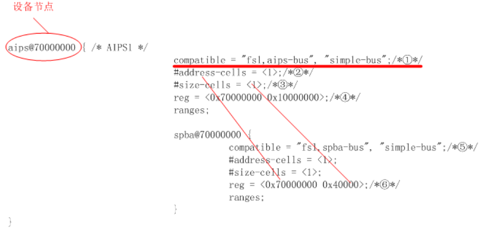
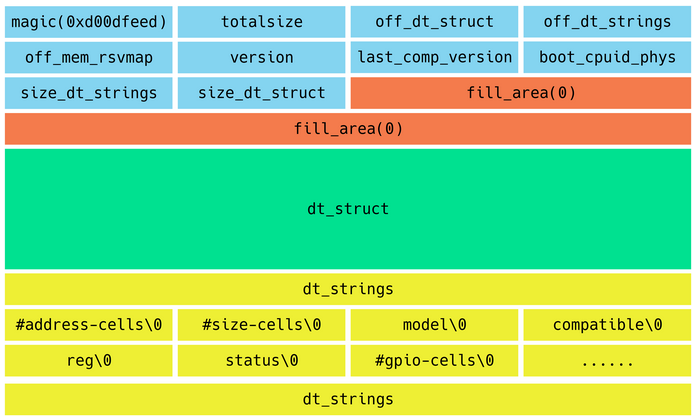
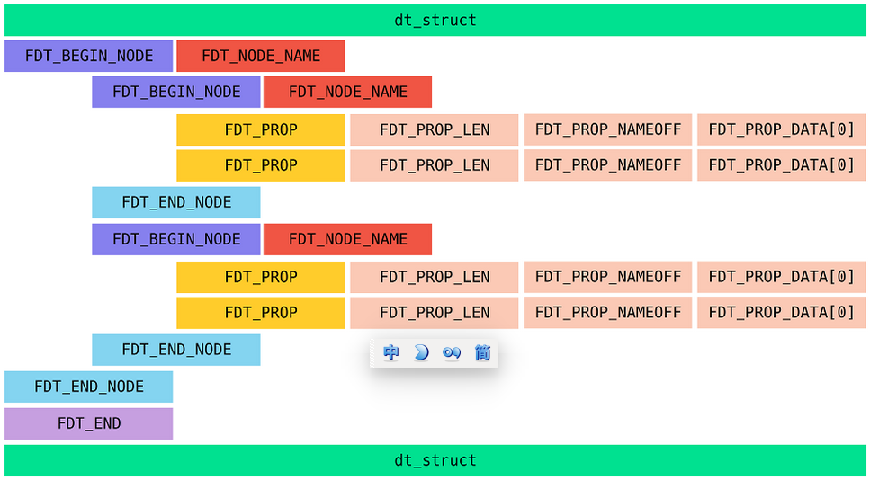

# Linux内核内存管理（一）——设备树

## 概述

>   本章节详细阐述了Linux内核中设备树的基本概念、基本内容、相关结构、相关的解析函数和数据结构、加载和解析过程，以及Linux内核中常用的接口函数等等。

>   设备树与Linux内核中驱动模块相关性较强，如果只是了解一下设备树，那么对于设备树的加载及解析相关部分，则不必过于深入追究。

>   本章节全面介绍了设备树的基本知识，以及在设备启动过程中的加载流程，相关函数调用流程，部分调用环节还有待完善，Linux内核中常用的接口函数仍需进一步阐述。

## 1. Linux 内核中设备树的基本概念及作用

>   Linux引入FDT目的很明确--降低代码冗余。过去在内核源码中，存在大量对板级细节信息描述的代码。这些代码充斥在/arch/arm/plat-xxx和/arch/arm/mach-xxx目录，对内核而言这些platform设备、resource、i2c_board_info、spi_board_info以及各种硬件的platform_data绝大多数纯属垃圾冗余代码。为了解决这一问题，ARM内核版本3.x之后引入了原先在Power PC等其他体系架构已经使用的Flattened Device Tree。即Linux内核中引入的设备树，Flattened Device Tree，简称FDT，扁平设备树，后续我们Linux内核中所说的设备树，都是扁平设备树。

>   简而言之，设备树就是描述单板资源以及设备的一种文本文件。“A data structure by which bootloaders pass hardware layout to Linux in a device-independent manner, simplifying hardware probing.”开源文档中对设备树的描述是，一种描述硬件资源的数据结构，它通过bootloader将硬件资源传给内核，使得内核和硬件资源描述相对独立。

>   Device Tree可以描述的信息包括CPU的数量和类别、内存基地址和大小、总线和桥、外设连接、中断控制器和中断使用情况、GPIO控制器和GPIO使用情况、Clock控制器和Clock使用情况。

>   它基本上就是画一棵电路板上CPU、总线、设备组成的树，Bootloader会将这棵树传递给内核，然后内核可以识别这棵树，并根据它展开出Linux内核中的platform_device、i2c_client、spi_device等设备，而这些设备用到的内存、IRQ等资源，也被传递给了内核，内核会将这些资源绑定给展开的相应的设备。

>   是否Device Tree要描述系统中的所有硬件信息？答案是否定的。基本上，那些可以动态探测到的设备是不需要描述的，例如USB device。不过对于SOC上的usb hostcontroller，它是无法动态识别的，需要在device tree中描述。同样的道理，在computersystem中，PCI device可以被动态探测到，不需要在device tree中描述，但是PCI  bridge如果不能被探测，那么就需要描述之。另外，设备树对于可热插拔的热备不进行具体描述，它只描述用于控制该热插拔设备的控制器。

>   设备树的主要优势：对于同一SOC的不同主板，只需更换设备树文件.dtb即可实现不同主板的无差异支持，而无需更换内核文件。

>   注：要使得3.x之后的内核支持使用设备树，除了内核编译时需要打开相对应的选项外，bootloader也需要支持将设备树的数据结构传给内核。


## 2. 设备树基本知识

### 2.1 设备树的组成和使用
>   设备树包含DTC（device tree compiler），DTS（device tree source和DTB（device tree blob）。三者关系如下：


>   .dts文件是一种ASCII 文本格式的Device Tree描述，此文本格式非常人性化，适合人类的阅读习惯。基本上，在ARM Linux在，一个.dts文件对应一个ARM的machine，一般放置在内核的arch/arm/boot/dts/目录。

>   由于一个SoC可能对应多个machine（一个SoC可以对应多个产品和电路板），势必这些.dts文件需包含许多共同的部分，Linux内核为了简化，把SoC公用的部分或者多个machine共同的部分一般提炼为.dtsi，类似于C语言的头文件。其他的machine对应的.dts就include这个.dtsi。当然，和C语言的头文件类似，.dtsi也可以include其他的.dtsi，譬如几乎所有的ARM SoC的.dtsi都引用了skeleton.dtsi，即#include"skeleton.dtsi“ 或者 /include/ "skeleton.dtsi"。

>   uboot和linux不能识别dts文件，只能识别二进制文件，所以需要将.dts文件编译成.dtb文件。dtb文件是一种可以被kernel和uboot识别的二进制文件。

>   把.dts文件编译成.dtb文件的工具就是DTC。DTC的源码位于内核的scripts/dtc目录，内核选中CONFIG_OF，编译内核的时候，主机可执行程序DTC就会被编译出来。即scripts/dtc/Makefile中

```makefile
hostprogs-y := dtc
 always := $(hostprogs-y)

```

>   在内核的arch/arm/boot/dts/Makefile中，若选中某种SOC，则与其对应相关的所有dtb文件都将编译出来。在linux下，make dtbs可单独编译dtb。

>   在Linux的scripts/dtc目录下除了提供dtc工具外，也可以自己安装dtc工具，linux下执行：sudo apt-get install device-tree-compiler安装dtc工具。dtc工具的使用方法是：dtc -I dts -O dtb -o xxx.dtb xxx.dts，即可生成dts文件对应的dtb文件了。 当然了，dtc -I dtb -O dts -o xxx.dts xxx.dtb反过来即可生成dts文件。其中还提供了一个fdtdump的工具，可以dump dtb文件，方便查看信息。


### 2.2 设备树中DTS（DTSI）文件的基本语法

>   Device Tree由一系列被命名的节点（node），以及描述节点的属性（property）的元素组成，而节点本身可包含子节点。所谓属性，其实就是成对出现的name和value。

>   正常情况下所有的dts文件以及dtsi文件都含有一个根节点（root节点）”/”，这样include之后就会造成有很多个根节点? 按理说 device tree既然是一个树，那么其只能有一个根节点，所有其他的节点都是派生于根节点的child node。其实也正是如此，Device Tree Compiler在对.dts进行编译生成dtb时，会对node进行合并操作，最终生成的DTB中只有一个 root  node。

>   device tree的基本单元是node。这些node被组织成树状结构，除了root node，每个node都只有一个parent。一个device tree文件中只能有一个root node。每个node中包含了若干的property/value来描述该node的一些特性。每个node用节点名字（node name）标识，节点名字的格式是node-name@unit-address。

>   在一个树状结构的device tree中，如何引用一个node呢？要想唯一指定一个node必须使用full path，例如/node-name-1/node-name-2/node-name-N。

>   在节点的{}里面是描述该节点的属性（property），即设备的特性。它的值是多样化的，我们以下图为例：


1.   它可以是字符串string，如①；也可能是字符串数组string-list，如②
2.   它也可以是32 bit unsigned integers，如cell⑧，用<>表示
3.   它也可以是binary data，如③，用[]表示
4.   它也可能是空，如⑦

>   在/arch/arm/boot/dts/目录中有一个文件skeleton.dtsi，该文件为各ARM vendor共用的一些硬件定义信息。以下为skeleton.dtsi的全部内容。

```c
/ {
	#address-cells = <1>;
	#size-cells = <1>;
	chosen { };
	aliases { };
	memory { device_type = "memory"; reg = <0 0>; };
};

```

如上，属性# address-cells的值为1，它代表以“/”根节点为parent的子节点中，reg属性中存在一个address值；#size-cells的值为1，它代表以“/” 根节点为parent的子节点中，reg属性中存在一个size值。即父节点的#address-cells和#size-cells的含义如下：

1.   #address-cells，用来描述子节点“reg”属性的地址表中用来描述首地址的cell数量；
2.   #size-cells，用来描述子节点“reg”属性的地址表中用来描述地址长度的cell数量；

### 2.3 典型节点描述

>   chosen node

```makefile
chosen {
        bootargs = "tegraid=40.0.0.00.00 vmalloc=256M video=tegrafb console=ttyS0, 115200n8 earlyprintk";
};

```


chosen node 主要用来描述由系统指定的runtime parameter，它并没有描述任何硬件设备节点信息。原先通过tag list传递的一些linux kernel运行的参数，可以通过chosen节点来传递。如command line可以通过bootargs这个property来传递。如果存在chosen node，它的parent节点必须为“/”根节点。

>   aliases node

```makefile
aliases {
	i2c6 = &pca9546_i2c0;
	i2c7 = &pca9546_i2c1;
	i2c8 = &pca9546_i2c2;
	i2c9 = &pca9546_i2c3;
};

```

aliases node用来定义别名，类似C++中引用。上面是一个在.dtsi中的典型应用，当使用i2c6时，也即使用pca9546_i2c0，使得引用节点变得简单方便。例：当.dts  include 该.dtsi时，将i2c6的status属性赋值为okay，则表明该主板上的pca9546_i2c0处于enable状态；反之，status赋值为disabled，则表明该主板上的pca9546_i2c0处于disenable状态。如下是引用的具体例子：

```makefile
&i2c6 {
        status = "okay";
      };
      
```

>   memory node

```makefile
memory {
	device_type = "memory";
	reg = <0x00000000 0x20000000>; /* 512 MB */
};

```

对于memory node，device_type必须为memory，由之前的描述可以知道该memory node是以0x00000000为起始地址，以0x20000000为地址长度的512MB的空间。

一般而言，在.dts中不对memory进行描述，而是通过bootargs中类似521M@0x00000000的方式传递给内核。

>   其他节点

由于其他设备节点依据属性进行描述，具有类似的形式。接下来的部分主要分析各种属性的含义及作用，并结合相关的例子进行阐述。

**Reg属性**

在device node 中，reg是描述memory-mapped IO register的offset和length。子节点的reg属性address和length长度取决于父节点对应的#address-cells和#size-cells的值。例：                                        

在上述的aips节点中，存在子节点spba。spba中的中reg为<0x70000000 0x40000 >，其0x700000000为address，0x40000为size。这一点在图(../picture/dts基本语法范例.png)有作介绍。

这里补充的一点是：设备节点的名称格式[node-name@unit-address](mailto:node-name@unit-address)，节点名称用node-name唯一标识，为一个ASCII字符串。其中@unit-address为可选项，可以不作描述。unit-address的具体格式和设备挂载在哪个bus上相关。如：cpu的unit-address从0开始编址，以此加1；本例中，aips为0x70000000。

**compatible属性**

在上图①中，compatible属性为string list，用来将设备匹配对应的driver驱动，优先级为从左向右。本例中spba的驱动优先考虑“fsl，spba-bus”驱动；若没有“fsl，aips-bus”驱动，则用字符串“simple-bus”来继续寻找合适的驱动。即compatible实现了原先内核版本3.x之前，platform_device中.name的功能，至于具体的实现方法，本文后面会做讲解。

注：对于“/”root节点，它也存在compatible属性，用来匹配machine type。具体说明将在后面给出。

**interrupts属性**


设备节点通过interrupt-parent来指定它所依附的中断控制器，当节点没有指定interrupt-parent时，则从parent节点中继承。上面例子中，root节点的interrupt-parent = <&mic>。这里使用了引用，即mic引用了②中的inrerrupt-controller @40008000；root节点的子节点并没有指定interrupt-controller，如ahb、fab，它们均使用从根节点继承过来的mic，即位于0x40008000的中断控制器。

若子节点使用到中断(中断号、触发方法等等)，则需用interrupt属性来指定，该属性的数值长度受中断控制器中#inrerrupt-cells值③控制，即interrupt属性<>中数值的个数为#inrerrupt-cells的值；本例中#inrerrupt-cells=<2>，因而④中interrupts的值为<0x3d 0>形式，具体每个数值的含义由驱动实现决定。

**ranges属性**

ranges属性为地址转换表，这在pcie中使用较为常见，它表明了该设备在到parent节点中所对用的地址映射关系。ranges格式长度受当前节点#address-cell、parent节点#address-cells、当前节点#size-cell所控制。顺序为ranges=<当前节点#address-cell, parent节点#address-cells , 当前节点#size-cell>。在本例中，当前节点#address-cell=<1>,对应于⑤中的第一个0x20000000；parent节点#address-cells=<1>，对应于⑤中的第二个0x20000000；当前节点#size-cell=<1>，对应于⑤中的0x30000000。即ahb节点所占空间从0x20000000地址开始，对应于父节点的0x20000000地址开始的0x30000000地址空间大小。

注：对于相同名称的节点，dtc会根据定义的先后顺序进行合并，其相同属性，取后定义的那个。

## 3. Device Tree文件结构

>   DTB由三部分组成：头（Header）、结构块（device-tree structure）、字符串块（string block），其布局结构如下：


>   通过以上分析，可以得到Device Tree文件结构如下图所示。dtb文件的头部首先存放的是fdt_header的结构体信息，接着是填充区域，填充大小为off_dt_struct – sizeof(struct fdt_header)，填充的值为0。接着就是struct fdt_property结构体的相关信息。最后是dt_string部分。

 

### 3.1 Device Tree文件头信息

>   我们使用上文提到的fdtdump工具，以vexpress-v2p-ca5s.dtb文件为例，Linux终端执行fdtdump -sd  vexpress-v2p-ca5s.dtb > vexpress-v2p-ca5s.txt，vexpress-v2p-ca5s.txt部分内容如下：

```
vexpress-v2p-ca5s.dtb: found fdt at offset 0
/dts-v1/;
// magic:		0xd00dfeed
// totalsize:		0x313b (12603)
// off_dt_struct:	0x38
// off_dt_strings:	0x2dac
// off_mem_rsvmap:	0x28
// version:		17
// last_comp_version:	16
// boot_cpuid_phys:	0x0
// size_dt_strings:	0x38f
// size_dt_struct:	0x2d74

```

>   以上信息便是Device Tree头信息，存储在dtb文件的开头部分，在Linux内核中使用`struct fdt_header`结构体描述，该结构体定义在linux-5.1/scripts/dtc/libfdt/fdt.h文件中。（注：好多设备树相关文章中也有使用`struct boot_param_header`结构体（定义在arch/powerpc/include/asm/prom.h）的，两个结构体内容一样）：

```c
  struct fdt_header {
  		fdt32_t	magic;				/* 设备树幻数，固定为0xd00dfeed */
  		fdt32_t	totalsize;			/* 整个设备树的大小*/
      	fdt32_t	off_dt_struct;		/* 保存结构块在整个设备树中的偏移*/
 		fdt32_t	off_dt_strings;		/* 保存字符串块在整个设备树中的偏移*/
		fdt32_t	off_mem_rsvmap;		/* 保留内存区，该区保留了不能被内核动态分配的内存空间*/
       	fdt32_t	version;			/* 设备树版本*/
        fdt32_t	last_comp_version;	/* 向下兼容版本号*/
  		/* version 2 fields below */
  		fdt32_t	boot_cpuid_phys;	/* 为在多核处理器中用于启动的主CPU的物理id*/
  		/* version 3 fields below */
  		fdt32_t	dt_strings_size;	/* 字符串块大小*/
  		/* version 17 fields below */
  		fdt32_t	dt_struct_size;		/* 结构块大小*/
  };
```

fdtdump工具的输出信息即是以上结构中每一个成员的值，struct fdt_header结构体包含了Device Tree的私有信息。例如: fdt_header.magic是fdt的魔数,固定值为0xd00dfeed，fdt_header.totalsize是fdt文件的大小。使用二进制工具打开vexpress-v2p-ca5s.dtb验证。vexpress-v2p-ca5s.dtb二进制文件头信息如下图所示。从下图中可以得到Device Tree的文件是以大端模式储存。并且，头部信息和fdtdump的输出信息一致。

```
  0000000: d0 0d fe ed 00 00 31 3b 00 00 00 38 00 00 2d ac  ......1;...8..-.
  0000010: 00 00 00 28 00 00 00 11 00 00 00 10 00 00 00 00  ...(............
  0000020: 00 00 03 8f 00 00 2d 74 00 00 00 00 00 00 00 00  ......-t........
  0000030: 00 00 00 00 00 00 00 00 00 00 00 01 00 00 00 00  ................
  0000040: 00 00 00 03 00 00 00 09 00 00 00 00 56 32 50 2d  ............V2P-
  0000050: 43 41 35 73 00 00 00 00 00 00 00 03 00 00 00 04  CA5s............
  0000060: 00 00 00 06 00 00 02 25 00 00 00 03 00 00 00 04  .......%........
  0000070: 00 00 00 0e 00 00 00 0f 00 00 00 03 00 00 00 23  ...............#
  0000080: 00 00 00 20 61 72 6d 2c 76 65 78 70 72 65 73 73  ... arm,vexpress
  
```


### 3.2 device-tree structure——节点

>   设备树结构块是一个线性化的结构体，是设备树的主体，以节点的形式保存了主板上的设备信息(我的理解：设备树结构体描述了dts文件中的节点信息。)。

>   节点（node）信息使用struct fdt_node_header结构体描述。各个结构体信息如下: `/scripts/dtc/libfdt/fdt.h`

```c
struct fdt_node_header {
	fdt32_t tag;
	char name[0];
};

```

struct fdt_node_header描述节点信息，tag(有些地方也叫token)是标识node的起始结束等信息的标志位，name指向node名称的首地址。tag的取值如下：  

```c
#define FDT_BEGIN_NODE	0x1		/* Start of node, full name */
#define FDT_END_NODE	0x2		/* End node */
#define FDT_PROP		0x3		/* Property: name off, size, content */
#define FDT_NOP			0x4		/* nop */
#define FDT_END			0x9

```

1. FDT_BEGIN_NODE (0x00000001)。该tag描述了一个node的开始位置，紧挨着该tag的就是node name（包括unit address）。
2. FDT_END_NODE (0x00000002)。该tag描述了一个node的结束位置。
3. FDT_PROP (0x00000003)。该tag描述了一个property的开始位置，该tag之后是两个u32的数据，分别是length和name offset。length表示该property value data的size。name offset表示该属性字符串在device tree strings block的偏移值。length和name offset之后就是长度为length具体的属性值数据。
4. FDT_NOP (0x00000004)。
5. FDT_END (0x00000009)。该tag标识了一个DTB的结束位置。

>   节点属性信息使用struct fdt_property结构体描述。

```c
struct fdt_property {
	fdt32_t tag;
	fdt32_t len;
	fdt32_t nameoff;
	char data[0];
};

```

1. 描述属性采用struct fdt_property描述，tag标识是属性，取值为FDT_PROP；
2. len为属性值的长度（包括‘\0’，单位：字节）；
3. nameoff为属性名称存储位置相对于off_dt_strings的偏移地址。

>   设备树节点的结构如下:



一个节点的结构如下：

1. 节点开始标志：一般为FDT_BEGIN_NODE（0x00000001）。
2. 节点路径或者节点的单元名(version<3以节点路径表示，version>=0x10以节点单元名表示)。
3. 填充字段（对齐到四字节）。
4. 节点属性。每个属性以宏FDT_PROP(0x00000003)开始，后面依次为属性值的字节长度(4字节)、属性名称在字符串块中的偏移量(4字节)、属性值和填充（对齐到四字节）。
5. 如果存在子节点，则定义子节点。
6. 节点结束标志FDT_END_NODE(0x00000002)。


## 4. kernel解析Device Tree

>   Device Tree文件结构描述就以上struct fdt_header、struct fdt_node_header及struct fdt_property三个结构体描述。kernel会根据Device Tree的结构解析出kernel能够使用的struct property结构体。kernel根据Device Tree中所有的属性解析出数据填充struct property结构体。struct property结构体描述如下:

```c
struct property {
    char *name;		/*属性名*/
    int	length;		/*属性值长度*/
    void *value;	/*属性值*/
    struct property *next;	/*指向下一个属性值*/
    unsigned long _flags;	/*标志*/
    unsigned int unique_id;
}

```

kernel根据Device Tree的文件结构信息转换成struct property结构体，并将同一个node节点下面的所有属性通过property.next指针进行链接，形成一个单链表。

>   kernel解析Device Tree的函数调用过程如下图所示: 


>   kernel的C语言阶段的入口函数是init/main.c/start_kernel()函数，在early_init_dt_scan_nodes()中会做以下三件事：

1.  扫描/chosen或者/chose@0节点下面的bootargs属性值到boot_command_line，此外，还处理initrd相关的property，并保存在initrd_start和initrd_end这两个全局变量中；
2.  扫描根节点下面，获取{size,address}-cells信息，并保存在dt_root_size_cells和dt_root_addr_cells全局变量中；
3.  扫描具有device_type = “memory”属性的/memory或者/memory@0节点下面的reg属性值，并把相关信息保存在meminfo中，全局变量meminfo保存了系统内存相关的信息。

>   Device Tree中的每一个node节点经过kernel处理都会生成一个struct device_node的结构体，struct device_node最终一般会被挂接到具体的struct device结构体。struct device_node结构体描述如下：kernel4.14/include/linux/of.h     

```c
struct device_node {
	const char *name;	/*node的名称，取最后一次“/”和“@”之间子串*/
	const char *type;	/*device_type的属性名称，没有为<NULL>*/
	phandle phandle;	/*phandle属性值*/
	const char *full_name;	/*指向该结构体结束的位置，存放node的路径全名，例如：/chosen*/
	struct fwnode_handle fwnode;

	struct	property *properties;	/*指向该节点下的第一个属性，其他属性与该属性链表相接*/
	struct	property *deadprops;	/* removed properties */
	struct	device_node *parent;	/*指向父节点*/
	struct	device_node *child;		/*指向子节点*/
	struct	device_node *sibling;	/*姊妹节点，与自己同等级的node*/
	struct	kobject kobj;			/* sysfs文件系统目录体现 */
	unsigned long _flags;			/* 当前node状态标志位，见/include/linux/of.h line141-145 */
	void	*data;
#if defined(CONFIG_SPARC)
	const char *path_component_name;
	unsigned int unique_id;
	struct of_irq_controller *irq_trans;
#endif
};
    ...
/* flag descriptions (need to be visible even when !CONFIG_OF) */
#define OF_DYNAMIC	1 /* node and properties were allocated via kmalloc */
#define OF_DETACHED	2 /* node has been detached from the device tree */
#define OF_POPULATED	3 /* device already created for the node */
#define OF_POPULATED_BUS	4 /* of_platform_populate recursed to children of this node */

```

>   下面分析以上信息是如何得来的。Device Tree的解析首先从unflatten_device_tree()开始，实现代码如下：     

```c
// linux-5.1/drivers/of/fdt.c    
/**
 * unflatten_device_tree - create tree of device_nodes from flat blob
 *
 * unflattens the device-tree passed by the firmware, creating the
 * tree of struct device_node. It also fills the "name" and "type"
 * pointers of the nodes so the normal device-tree walking functions
 * can be used.
 */
void __init unflatten_device_tree(void)
{
	__unflatten_device_tree(initial_boot_params, NULL, &of_root,
				early_init_dt_alloc_memory_arch, false);

	/* Get pointer to "/chosen" and "/aliases" nodes for use everywhere */
	of_alias_scan(early_init_dt_alloc_memory_arch);

	unittest_unflatten_overlay_base();
}

```

>   分析以上代码，在`unflatten_device_tree()`中，调用函数`__unflatten_device_tree()`，参数`initial_boot_params`指向Device Tree在内存中的首地址，`of_root`在经过该函数处理之后，会指向根节点，`early_init_dt_alloc_memory_arch`是一个函数指针，为`struct device_node`和`struct property`结构体分配内存的回调函数（callback）。

>   `__unflatten_device_tree`  函数与`unflatten_device_tree`在同一文件中，定义如下：

```c
// linux-5.1/drivers/of/fdt.c  
/**
 * __unflatten_device_tree - create tree of device_nodes from flat blob
 *
 * unflattens a device-tree, creating the
 * tree of struct device_node. It also fills the "name" and "type"
 * pointers of the nodes so the normal device-tree walking functions
 * can be used.
 * @blob: The blob to expand
 * @dad: Parent device node
 * @mynodes: The device_node tree created by the call
 * @dt_alloc: An allocator that provides a virtual address to memory
 * for the resulting tree
 * @detached: if true set OF_DETACHED on @mynodes
 *
 * Returns NULL on failure or the memory chunk containing the unflattened
 * device tree on success.
 */
void *__unflatten_device_tree(const void *blob,
			      struct device_node *dad,
			      struct device_node **mynodes,
			      void *(*dt_alloc)(u64 size, u64 align),
			      bool detached)
{
	int size;
	void *mem;

	pr_debug(" -> unflatten_device_tree()\n");

	if (!blob) {
		pr_debug("No device tree pointer\n");
		return NULL;
	}

	pr_debug("Unflattening device tree:\n");
	pr_debug("magic: %08x\n", fdt_magic(blob));
	pr_debug("size: %08x\n", fdt_totalsize(blob));
	pr_debug("version: %08x\n", fdt_version(blob));

	if (fdt_check_header(blob)) {
		pr_err("Invalid device tree blob header\n");
		return NULL;
	}

	/* First pass, scan for size */
	size = unflatten_dt_nodes(blob, NULL, dad, NULL);
	if (size < 0)
		return NULL;

	size = ALIGN(size, 4);
	pr_debug("  size is %d, allocating...\n", size);

	/* Allocate memory for the expanded device tree */
	mem = dt_alloc(size + 4, __alignof__(struct device_node));
	if (!mem)
		return NULL;

	memset(mem, 0, size);

	*(__be32 *)(mem + size) = cpu_to_be32(0x);

	pr_debug("  unflattening %p...\n", mem);

	/* Second pass, do actual unflattening */
	unflatten_dt_nodes(blob, mem, dad, mynodes);
	if (be32_to_cpup(mem + size) != 0xdeadbeef)
		pr_warning("End of tree marker overwritten: %08x\n",
			   be32_to_cpup(mem + size));

	if (detached && mynodes) {
		of_node_set_flag(*mynodes, OF_DETACHED);
		pr_debug("unflattened tree is detached\n");
	}

	pr_debug(" <- unflatten_device_tree()\n");
	return mem;
}
```
>   在`__unflatten_device_tree()`函数中，两次调用`unflatten_dt_nodes()`函数，第一次是为了得到Device Tree转换成`struct device_node`和`struct property`结构体需要分配的内存大小，第二次调用才是具体填充每一个`struct device_node`和`struct property`结构体。

>   `unflatten_dt_nodes()`代码列出如下，需要注意的是，较早版本（Linux4.0）中，该幻数原型为`unflatten_dt_node()`，两个函数实现的功能是一样的，只是在`unflatten_dt_nodes()`函数中多包了一层`populate_node()`，而在`unflatten_dt_node()`函数中，`populate_node()`相关实现代码是展开着的。

```c
// linux-5.1/drivers/of/fdt.c
/**
 * unflatten_dt_nodes - Alloc and populate a device_node from the flat tree
 * @blob: The parent device tree blob
 * @mem: Memory chunk to use for allocating device nodes and properties
 * @dad: Parent struct device_node
 * @nodepp: The device_node tree created by the call
 *
 * It returns the size of unflattened device tree or error code
 */
static int unflatten_dt_nodes(const void *blob,
			      void *mem,
			      struct device_node *dad,
			      struct device_node **nodepp)
{
	struct device_node *root;
	int offset = 0, depth = 0, initial_depth = 0;
#define FDT_MAX_DEPTH	64
	struct device_node *nps[FDT_MAX_DEPTH];
	void *base = mem;
	bool dryrun = !base;

	if (nodepp)
		*nodepp = NULL;

	/*
	 * We're unflattening device sub-tree if @dad is valid. There are
	 * possibly multiple nodes in the first level of depth. We need
	 * set @depth to 1 to make fdt_next_node() happy as it bails
	 * immediately when negative @depth is found. Otherwise, the device
	 * nodes except the first one won't be unflattened successfully.
	 */
	if (dad)
		depth = initial_depth = 1;

	root = dad;
	nps[depth] = dad;

	for (offset = 0;
	     offset >= 0 && depth >= initial_depth;
	     offset = fdt_next_node(blob, offset, &depth)) {
		if (WARN_ON_ONCE(depth >= FDT_MAX_DEPTH))
			continue;

		if (!IS_ENABLED(CONFIG_OF_KOBJ) &&
		    !of_fdt_device_is_available(blob, offset))
			continue;

		if (!populate_node(blob, offset, &mem, nps[depth],
				   &nps[depth+1], dryrun))
			return mem - base;

		if (!dryrun && nodepp && !*nodepp)
			*nodepp = nps[depth+1];
		if (!dryrun && !root)
			root = nps[depth+1];
	}

	if (offset < 0 && offset != -FDT_ERR_NOTFOUND) {
		pr_err("Error %d processing FDT\n", offset);
		return -EINVAL;
	}

	/*
	 * Reverse the child list. Some drivers assumes node order matches .dts
	 * node order
	 */
	if (!dryrun)
		reverse_nodes(root);

	return mem - base;
}
```

>   由`unflatten_dt_nodes()`函数可知，在`__unflatten_device_tree()`函数中，两次调用`unflatten_dt_nodes()`函数，第一次调用`unflatten_dt_nodes()`函数，mem为NULL，根据367、368两行可知，此时dryrun为true，此时就不再执行`if(!dryrun)`相关代码（这部分代码主要实现每一个struct device_node和struct property结构体的具体填充），所以第一次，我们只计算Device Tree转换成struct device_node和struct property结构体需要分配的内存大小（赋值给size），而第二次调用`unflatten_dt_nodes()`函数时，mem参数已经通过`__unflatten_device_tree()`函数中`dt_alloc()`获取相应的值，故在第二次调用`unflatten_dt_nodes()`函数时，此时dryrun为false，通过执行`if(!dryrun)`相关代码填充每一个struct device_node和struct property结构体。

>   `populate_node()`是计算节点所需内存大小的核心函数，其实现代码如下：

```c
// linux-5.1/drivers/of/fdt.c
static bool populate_node(const void *blob,
			  int offset,
			  void **mem,
			  struct device_node *dad,
			  struct device_node **pnp,
			  bool dryrun)
{
	struct device_node *np;
	const char *pathp;
	unsigned int l, allocl;

	pathp = fdt_get_name(blob, offset, &l);
	if (!pathp) {
		*pnp = NULL;
		return false;
	}

	allocl = ++l;

	np = unflatten_dt_alloc(mem, sizeof(struct device_node) + allocl,
				__alignof__(struct device_node));
	if (!dryrun) {
		char *fn;
		of_node_init(np);
		np->full_name = fn = ((char *)np) + sizeof(*np);

		memcpy(fn, pathp, l);

		if (dad != NULL) {
			np->parent = dad;
			np->sibling = dad->child;
			dad->child = np;
		}
	}
	/* 处理该node节点下面所有的property */
	populate_properties(blob, offset, mem, np, pathp, dryrun);
	if (!dryrun) {
		np->name = of_get_property(np, "name", NULL);
		if (!np->name)
			np->name = "<NULL>";
	}

	*pnp = np;
	return true;
}
```

>   `populate_properties()`函数计算节点内部所有的property所需内存，实现代码如下：

```c
// linux-5.1/drivers/of/fdt.c
static void populate_properties(const void *blob,
				int offset,
				void **mem,
				struct device_node *np,
				const char *nodename,
				bool dryrun)
{
	struct property *pp, **pprev = NULL;
	int cur;
	bool has_name = false;

	pprev = &np->properties;
	for (cur = fdt_first_property_offset(blob, offset);
	     cur >= 0;
	     cur = fdt_next_property_offset(blob, cur)) {
		const __be32 *val;
		const char *pname;
		u32 sz;

		val = fdt_getprop_by_offset(blob, cur, &pname, &sz);
		if (!val) {
			pr_warn("Cannot locate property at 0x%x\n", cur);
			continue;
		}

		if (!pname) {
			pr_warn("Cannot find property name at 0x%x\n", cur);
			continue;
		}

		if (!strcmp(pname, "name"))
			has_name = true;

		pp = unflatten_dt_alloc(mem, sizeof(struct property),
					__alignof__(struct property));
		if (dryrun)
			continue;

		/* We accept flattened tree phandles either in
		 * ePAPR-style "phandle" properties, or the
		 * legacy "linux,phandle" properties.  If both
		 * appear and have different values, things
		 * will get weird. Don't do that.
		 */
		if (!strcmp(pname, "phandle") ||
		    !strcmp(pname, "linux,phandle")) {
			if (!np->phandle)
				np->phandle = be32_to_cpup(val);
		}

		/* And we process the "ibm,phandle" property
		 * used in pSeries dynamic device tree
		 * stuff
		 */
		if (!strcmp(pname, "ibm,phandle"))
			np->phandle = be32_to_cpup(val);

		pp->name   = (char *)pname;
		pp->length = sz;
		pp->value  = (__be32 *)val;
		*pprev     = pp;
		pprev      = &pp->next;
	}

	/* With version 0x10 we may not have the name property,
	 * recreate it here from the unit name if absent
	 */
   /* 为每个node节点添加一个name的属性 */
	if (!has_name) {
		const char *p = nodename, *ps = p, *pa = NULL;
		int len;
		/* 属性name的value值为node节点的名称，取“/”和“@”之间的子串 */
		while (*p) {
			if ((*p) == '@')
				pa = p;
			else if ((*p) == '/')
				ps = p + 1;
			p++;
		}

		if (pa < ps)
			pa = p;
		len = (pa - ps) + 1;
		pp = unflatten_dt_alloc(mem, sizeof(struct property) + len,
					__alignof__(struct property));
		if (!dryrun) {
			pp->name   = "name";
			pp->length = len;
			pp->value  = pp + 1;
			*pprev     = pp;
			pprev      = &pp->next;
			memcpy(pp->value, ps, len - 1);
			((char *)pp->value)[len - 1] = 0;
			pr_debug("fixed up name for %s -> %s\n",
				 nodename, (char *)pp->value);
		}
	}

	if (!dryrun)
		*pprev = NULL;
}
```


## 5. OF的API接口

>   OF的接口函数在/drivers/of/目录下，有of_i2c.c、of_mdio.c、of_mtd.c、Adress.c等等，这里将列出几个常用的API接口。各接口内部的函数调用，请自行在Linux-5.1代码中追踪。

**用来查找在dtb中的根节点**

`unsigned long __init of_get_flat_dt_root(void)`

```c
// linux-5.1/drivers/of/fdt.c
/**
 * of_get_flat_dt_root - find the root node in the flat blob
 */
unsigned long __init of_get_flat_dt_root(void)
{
	return 0;
}
```

**根据deice_node结构的full_name参数，在全局链表of_allnodes中，查找合适的device_node**

`struct device_node *of_find_node_by_path(const char *path)`

例如：

```c
struct device_node *cpus;
cpus=of_find_node_by_path("/cpus");

// linux-5.1/include/linux/of.h
static inline struct device_node *of_find_node_by_path(const char *path)
{
	return of_find_node_opts_by_path(path, NULL);
}

// linux-5.1/drivers/of/base.c
/**
 *	of_find_node_opts_by_path - Find a node matching a full OF path
 *	@path: Either the full path to match, or if the path does not
 *	       start with '/', the name of a property of the /aliases
 *	       node (an alias).  In the case of an alias, the node
 *	       matching the alias' value will be returned.
 *	@opts: Address of a pointer into which to store the start of
 *	       an options string appended to the end of the path with
 *	       a ':' separator.
 *
 *	Valid paths:
 *		/foo/bar	Full path
 *		foo		Valid alias
 *		foo/bar		Valid alias + relative path
 *
 *	Returns a node pointer with refcount incremented, use
 *	of_node_put() on it when done.
 */
struct device_node *of_find_node_opts_by_path(const char *path, const char **opts)
{
	struct device_node *np = NULL;
	struct property *pp;
	unsigned long flags;
	const char *separator = strchr(path, ':');

	if (opts)
		*opts = separator ? separator + 1 : NULL;

	if (strcmp(path, "/") == 0)
		return of_node_get(of_root);

	/* The path could begin with an alias */
	if (*path != '/') {
		int len;
		const char *p = separator;

		if (!p)
			p = strchrnul(path, '/');
		len = p - path;

		/* of_aliases must not be NULL */
		if (!of_aliases)
			return NULL;

		for_each_property_of_node(of_aliases, pp) {
			if (strlen(pp->name) == len && !strncmp(pp->name, path, len)) {
				np = of_find_node_by_path(pp->value);
				break;
			}
		}
		if (!np)
			return NULL;
		path = p;
	}

	/* Step down the tree matching path components */
	raw_spin_lock_irqsave(&devtree_lock, flags);
	if (!np)
		np = of_node_get(of_root);
	np = __of_find_node_by_full_path(np, path);
	raw_spin_unlock_irqrestore(&devtree_lock, flags);
	return np;
}
EXPORT_SYMBOL(of_find_node_opts_by_path);
```

**若from=NULL，则在全局链表of_allnodes中根据name查找合适的device_node**

`struct device_node *of_find_node_by_name(struct device_node *from,const char *name)`

例如：

```c
struct device_node *np;
np = of_find_node_by_name(NULL,"firewire");

// linux-5.1/drivers/of/base.c
/**
 *	of_find_node_by_name - Find a node by its "name" property
 *	@from:	The node to start searching from or NULL; the node
 *		you pass will not be searched, only the next one
 *		will. Typically, you pass what the previous call
 *		returned. of_node_put() will be called on @from.
 *	@name:	The name string to match against
 *
 *	Returns a node pointer with refcount incremented, use
 *	of_node_put() on it when done.
 */
struct device_node *of_find_node_by_name(struct device_node *from,
	const char *name)
{
 	struct device_node *np;
 	unsigned long flags;
 
 	raw_spin_lock_irqsave(&devtree_lock, flags);
 	for_each_of_allnodes_from(from, np)
 		if (of_node_name_eq(np, name) && of_node_get(np))
 			break;
 	of_node_put(from);
 	raw_spin_unlock_irqrestore(&devtree_lock, flags);
 	return np;
 }
 EXPORT_SYMBOL(of_find_node_by_name);
```

**根据设备类型查找相应的device_node**

`struct device_node *of_find_node_by_type(struct device_node *from,const char *type)`

例如：

```c
struct device_node *tsi_pci;
tsi_pci= of_find_node_by_type(NULL,"pci");

// linux-5.1/drivers/of/base.c
/**
 *	of_find_node_by_type - Find a node by its "device_type" property
 *	@from:	The node to start searching from, or NULL to start searching
 *		the entire device tree. The node you pass will not be
 *		searched, only the next one will; typically, you pass
 *		what the previous call returned. of_node_put() will be
 *		called on from for you.
 *	@type:	The type string to match against
 *
 *	Returns a node pointer with refcount incremented, use
 *	of_node_put() on it when done.
 */
struct device_node *of_find_node_by_type(struct device_node *from,
	const char *type)
{
	struct device_node *np;
	unsigned long flags;

	raw_spin_lock_irqsave(&devtree_lock, flags);
	for_each_of_allnodes_from(from, np)
		if (__of_node_is_type(np, type) && of_node_get(np))
			break;
	of_node_put(from);
	raw_spin_unlock_irqrestore(&devtree_lock, flags);
	return np;
}
EXPORT_SYMBOL(of_find_node_by_type);
```

**根据compatible字符串查找device_node**

`struct device_node *of_find_compatible_node(struct device_node *from,const char *type, const char *compatible)`

```c
// linux-5.1/drivers/of/base.c

/**
 *	of_find_compatible_node - Find a node based on type and one of the
 *                                tokens in its "compatible" property
 *	@from:		The node to start searching from or NULL, the node
 *			you pass will not be searched, only the next one
 *			will; typically, you pass what the previous call
 *			returned. of_node_put() will be called on it
 *	@type:		The type string to match "device_type" or NULL to ignore
 *	@compatible:	The string to match to one of the tokens in the device
 *			"compatible" list.
 *
 *	Returns a node pointer with refcount incremented, use
 *	of_node_put() on it when done.
 */
struct device_node *of_find_compatible_node(struct device_node *from,
	const char *type, const char *compatible)
{
	struct device_node *np;
	unsigned long flags;

	raw_spin_lock_irqsave(&devtree_lock, flags);
	for_each_of_allnodes_from(from, np)
		if (__of_device_is_compatible(np, compatible, type, NULL) &&
		    of_node_get(np))
			break;
	of_node_put(from);
	raw_spin_unlock_irqrestore(&devtree_lock, flags);
	return np;
}
EXPORT_SYMBOL(of_find_compatible_node);
```

**跟据节点属性的name查找device_node**
`struct device_node *of_find_node_with_property(struct device_node *from,const char *prop_name)`

```c
// linux-5.1/drivers/of/base.c
   
/**
 *	of_find_node_with_property - Find a node which has a property with
 *                                   the given name.
 *	@from:		The node to start searching from or NULL, the node
 *			you pass will not be searched, only the next one
 *			will; typically, you pass what the previous call
 *			returned. of_node_put() will be called on it
 *	@prop_name:	The name of the property to look for.
 *
 *	Returns a node pointer with refcount incremented, use
 *	of_node_put() on it when done.
 */
struct device_node *of_find_node_with_property(struct device_node *from,
	const char *prop_name)
{
	struct device_node *np;
	struct property *pp;
	unsigned long flags;

	raw_spin_lock_irqsave(&devtree_lock, flags);
	for_each_of_allnodes_from(from, np) {
		for (pp = np->properties; pp; pp = pp->next) {
			if (of_prop_cmp(pp->name, prop_name) == 0) {
				of_node_get(np);
				goto out;
			}
		}
	}
out:
	of_node_put(from);
	raw_spin_unlock_irqrestore(&devtree_lock, flags);
	return np;
}
EXPORT_SYMBOL(of_find_node_with_property);

```

**跟据phandle查找device_node**

`struct device_node *of_find_node_by_phandle(phandle handle)`

```c
// linux-5.1/drivers/of/base.c

/**
 * of_find_node_by_phandle - Find a node given a phandle
 * @handle:	phandle of the node to find
 *
 * Returns a node pointer with refcount incremented, use
 * of_node_put() on it when done.
 */
struct device_node *of_find_node_by_phandle(phandle handle)
{
	struct device_node *np = NULL;
	unsigned long flags;
	phandle masked_handle;

	if (!handle)
		return NULL;

	raw_spin_lock_irqsave(&devtree_lock, flags);

	masked_handle = handle & phandle_cache_mask;

	if (phandle_cache) {
		if (phandle_cache[masked_handle] &&
		    handle == phandle_cache[masked_handle]->phandle)
			np = phandle_cache[masked_handle];
		if (np && of_node_check_flag(np, OF_DETACHED)) {
			WARN_ON(1); /* did not uncache np on node removal */
			of_node_put(np);
			phandle_cache[masked_handle] = NULL;
			np = NULL;
		}
	}

	if (!np) {
		for_each_of_allnodes(np)
			if (np->phandle == handle &&
			    !of_node_check_flag(np, OF_DETACHED)) {
				if (phandle_cache) {
					/* will put when removed from cache */
					of_node_get(np);
					phandle_cache[masked_handle] = np;
				}
				break;
			}
	}

	of_node_get(np);
	raw_spin_unlock_irqrestore(&devtree_lock, flags);
	return np;
}
EXPORT_SYMBOL(of_find_node_by_phandle);

```

**根据alias的name获得设备id号**

`int of_alias_get_id(struct device_node *np, const char *stem)`

```c
// linux-5.1/drivers/of/base.c

/**
 * of_alias_get_id - Get alias id for the given device_node
 * @np:		Pointer to the given device_node
 * @stem:	Alias stem of the given device_node
 *
 * The function travels the lookup table to get the alias id for the given
 * device_node and alias stem.  It returns the alias id if found.
 */
int of_alias_get_id(struct device_node *np, const char *stem)
{
	struct alias_prop *app;
	int id = -ENODEV;

	mutex_lock(&of_mutex);
	list_for_each_entry(app, &aliases_lookup, link) {
		if (strcmp(app->stem, stem) != 0)
			continue;

		if (np == app->np) {
			id = app->id;
			break;
		}
	}
	mutex_unlock(&of_mutex);

	return id;
}
EXPORT_SYMBOL_GPL(of_alias_get_id);

```

**device node计数增加/减少**

`struct device_node *of_node_get(struct device_node *node)`

`void of_node_put(struct device_node *node)`

```c
// linux-5.1/drivers/of/dynamic.c

/**
 * of_node_get() - Increment refcount of a node
 * @node:	Node to inc refcount, NULL is supported to simplify writing of
 *		callers
 *
 * Returns node.
 */
struct device_node *of_node_get(struct device_node *node)
{
	if (node)
		kobject_get(&node->kobj);
	return node;
}
EXPORT_SYMBOL(of_node_get);

/**
 * of_node_put() - Decrement refcount of a node
 * @node:	Node to dec refcount, NULL is supported to simplify writing of
 *		callers
 */
void of_node_put(struct device_node *node)
{
	if (node)
		kobject_put(&node->kobj);
}
EXPORT_SYMBOL(of_node_put);

```

**根据property结构的name参数，在指定的device node中查找合适的property**

`struct property *of_find_property(const struct device_node *np,const char *name,int *lenp)`

```c
// linux-5.1/drivers/of/base.c

struct property *of_find_property(const struct device_node *np,
				  const char *name,
				  int *lenp)
{
	struct property *pp;
	unsigned long flags;

	raw_spin_lock_irqsave(&devtree_lock, flags);
	pp = __of_find_property(np, name, lenp);
	raw_spin_unlock_irqrestore(&devtree_lock, flags);

	return pp;
}
EXPORT_SYMBOL(of_find_property);

```

**跟据property结构的name参数，返回该属性的属性值**

`const void *of_get_property(const struct device_node *np, const char *name,int *lenp)`

```c
// linux-5.1/drivers/of/base.c

/*
 * Find a property with a given name for a given node
 * and return the value.
 */
const void *of_get_property(const struct device_node *np, const char *name,
			    int *lenp)
{
	struct property *pp = of_find_property(np, name, lenp);

	return pp ? pp->value : NULL;
}
EXPORT_SYMBOL(of_get_property);

```

**根据compat参数与device node的compatible匹配，返回匹配度**

`int of_device_is_compatible(const struct device_node *device,const char *compat)`

```c
// linux-5.1/drivers/of/base.c
/** Checks if the given "compat" string matches one of the strings in
 * the device's "compatible" property
 */
int of_device_is_compatible(const struct device_node *device,
		const char *compat)
{
	unsigned long flags;
	int res;

	raw_spin_lock_irqsave(&devtree_lock, flags);
	res = __of_device_is_compatible(device, compat, NULL, NULL);
	raw_spin_unlock_irqrestore(&devtree_lock, flags);
	return res;
}
EXPORT_SYMBOL(of_device_is_compatible);

```

**获得父节点的device node**

`struct device_node *of_get_parent(const struct device_node *node)`

```c
// linux-5.1/drivers/of/base.c

/**
 *	of_get_parent - Get a node's parent if any
 *	@node:	Node to get parent
 *
 *	Returns a node pointer with refcount incremented, use
 *	of_node_put() on it when done.
 */
struct device_node *of_get_parent(const struct device_node *node)
{
	struct device_node *np;
	unsigned long flags;

	if (!node)
		return NULL;

	raw_spin_lock_irqsave(&devtree_lock, flags);
	np = of_node_get(node->parent);
	raw_spin_unlock_irqrestore(&devtree_lock, flags);
	return np;
}
EXPORT_SYMBOL(of_get_parent);

```

**将matches数组中of_device_id结构的name和type与device node的compatible和type匹配，返回匹配度最高的of_device_id结构**

`const struct of_device_id *of_match_node(const struct of_device_id *matches,const struct device_node *node)`

```c
// linux-5.1/drivers/of/base.c

/**
 * of_match_node - Tell if a device_node has a matching of_match structure
 *	@matches:	array of of device match structures to search in
 *	@node:		the of device structure to match against
 *
 *	Low level utility function used by device matching.
 */
const struct of_device_id *of_match_node(const struct of_device_id *matches,
					 const struct device_node *node)
{
	const struct of_device_id *match;
	unsigned long flags;

	raw_spin_lock_irqsave(&devtree_lock, flags);
	match = __of_match_node(matches, node);
	raw_spin_unlock_irqrestore(&devtree_lock, flags);
	return match;
}
EXPORT_SYMBOL(of_match_node);

```

**跟据属性名propname，读出属性值中的第index个u32数值给out_value**

`int of_property_read_u32_index(const struct device_node *np,const char *propname,u32 index, u32 *out_value)`

```c
// linux-5.1/drivers/of/property.c
/**
 * of_property_read_u32_index - Find and read a u32 from a multi-value property.
 *
 * @np:		device node from which the property value is to be read.
 * @propname:	name of the property to be searched.
 * @index:	index of the u32 in the list of values
 * @out_value:	pointer to return value, modified only if no error.
 *
 * Search for a property in a device node and read nth 32-bit value from
 * it. Returns 0 on success, -EINVAL if the property does not exist,
 * -ENODATA if property does not have a value, and -EOVERFLOW if the
 * property data isn't large enough.
 *
 * The out_value is modified only if a valid u32 value can be decoded.
 */
int of_property_read_u32_index(const struct device_node *np,
				       const char *propname,
				       u32 index, u32 *out_value)
{
	const u32 *val = of_find_property_value_of_size(np, propname,
					((index + 1) * sizeof(*out_value)),
					0,
					NULL);

	if (IS_ERR(val))
		return PTR_ERR(val);

	*out_value = be32_to_cpup(((__be32 *)val) + index);
	return 0;
}
EXPORT_SYMBOL_GPL(of_property_read_u32_index);

```

**根据属性名propname，读出该属性的数组中sz个属性值给out_values**

`int of_property_read_u8_array(const struct device_node *np,const char *propname, u8 *out_values, size_t sz)`

`int of_property_read_u16_array(const struct device_node *np,const char *propname, u16 *out_values, size_t sz)`

`int of_property_read_u32_array(const struct device_node *np,const char *propname, u32 *out_values,size_t sz)`

`int of_property_read_u64_array(const struct device_node *np,const char *propname, u64 *out_values,size_t sz)`

```c
// linux-5.1/include/linux/of.h

/**
 * of_property_read_u8_array - Find and read an array of u8 from a property.
 *
 * @np:		device node from which the property value is to be read.
 * @propname:	name of the property to be searched.
 * @out_values:	pointer to return value, modified only if return value is 0.
 * @sz:		number of array elements to read
 *
 * Search for a property in a device node and read 8-bit value(s) from
 * it. Returns 0 on success, -EINVAL if the property does not exist,
 * -ENODATA if property does not have a value, and -EOVERFLOW if the
 * property data isn't large enough.
 *
 * dts entry of array should be like:
 *	property = /bits/ 8 <0x50 0x60 0x70>;
 *
 * The out_values is modified only if a valid u8 value can be decoded.
 */
static inline int of_property_read_u8_array(const struct device_node *np,
					    const char *propname,
					    u8 *out_values, size_t sz)
{
	int ret = of_property_read_variable_u8_array(np, propname, out_values,
						     sz, 0);
	if (ret >= 0)
		return 0;
	else
		return ret;
}

/**
 * of_property_read_u16_array - Find and read an array of u16 from a property.
 *
 * @np:		device node from which the property value is to be read.
 * @propname:	name of the property to be searched.
 * @out_values:	pointer to return value, modified only if return value is 0.
 * @sz:		number of array elements to read
 *
 * Search for a property in a device node and read 16-bit value(s) from
 * it. Returns 0 on success, -EINVAL if the property does not exist,
 * -ENODATA if property does not have a value, and -EOVERFLOW if the
 * property data isn't large enough.
 *
 * dts entry of array should be like:
 *	property = /bits/ 16 <0x5000 0x6000 0x7000>;
 *
 * The out_values is modified only if a valid u16 value can be decoded.
 */
static inline int of_property_read_u16_array(const struct device_node *np,
					     const char *propname,
					     u16 *out_values, size_t sz)
{
	int ret = of_property_read_variable_u16_array(np, propname, out_values,
						      sz, 0);
	if (ret >= 0)
		return 0;
	else
		return ret;
}

/**
 * of_property_read_u32_array - Find and read an array of 32 bit integers
 * from a property.
 *
 * @np:		device node from which the property value is to be read.
 * @propname:	name of the property to be searched.
 * @out_values:	pointer to return value, modified only if return value is 0.
 * @sz:		number of array elements to read
 *
 * Search for a property in a device node and read 32-bit value(s) from
 * it. Returns 0 on success, -EINVAL if the property does not exist,
 * -ENODATA if property does not have a value, and -EOVERFLOW if the
 * property data isn't large enough.
 *
 * The out_values is modified only if a valid u32 value can be decoded.
 */
static inline int of_property_read_u32_array(const struct device_node *np,
					     const char *propname,
					     u32 *out_values, size_t sz)
{
	int ret = of_property_read_variable_u32_array(np, propname, out_values,
						      sz, 0);
	if (ret >= 0)
		return 0;
	else
		return ret;
}

/**
 * of_property_read_u64_array - Find and read an array of 64 bit integers
 * from a property.
 *
 * @np:		device node from which the property value is to be read.
 * @propname:	name of the property to be searched.
 * @out_values:	pointer to return value, modified only if return value is 0.
 * @sz:		number of array elements to read
 *
 * Search for a property in a device node and read 64-bit value(s) from
 * it. Returns 0 on success, -EINVAL if the property does not exist,
 * -ENODATA if property does not have a value, and -EOVERFLOW if the
 * property data isn't large enough.
 *
 * The out_values is modified only if a valid u64 value can be decoded.
 */
static inline int of_property_read_u64_array(const struct device_node *np,
					     const char *propname,
					     u64 *out_values, size_t sz)
{
	int ret = of_property_read_variable_u64_array(np, propname, out_values,
						      sz, 0);
	if (ret >= 0)
		return 0;
	else
		return ret;
}
```

**根据属性名propname，读出该属性的u64属性值**

`int of_property_read_u64(const struct device_node *np, const char *propname,u64 *out_value)`

```c
// linux-5.1/drivers/of/property.c

/**
 * of_property_read_u64 - Find and read a 64 bit integer from a property
 * @np:		device node from which the property value is to be read.
 * @propname:	name of the property to be searched.
 * @out_value:	pointer to return value, modified only if return value is 0.
 *
 * Search for a property in a device node and read a 64-bit value from
 * it. Returns 0 on success, -EINVAL if the property does not exist,
 * -ENODATA if property does not have a value, and -EOVERFLOW if the
 * property data isn't large enough.
 *
 * The out_value is modified only if a valid u64 value can be decoded.
 */
int of_property_read_u64(const struct device_node *np, const char *propname,
			 u64 *out_value)
{
	const __be32 *val = of_find_property_value_of_size(np, propname,
						sizeof(*out_value),
						0,
						NULL);

	if (IS_ERR(val))
		return PTR_ERR(val);

	*out_value = of_read_number(val, 2);
	return 0;
}
EXPORT_SYMBOL_GPL(of_property_read_u64);
```

**根据属性名propname，读出该属性的字符串属性值**

`int of_property_read_string(struct device_node *np, const char *propname,const char **out_string)`

```c
// linux-5.1/drivers/of/property.c

/**
 * of_property_read_string - Find and read a string from a property
 * @np:		device node from which the property value is to be read.
 * @propname:	name of the property to be searched.
 * @out_string:	pointer to null terminated return string, modified only if
 *		return value is 0.
 *
 * Search for a property in a device tree node and retrieve a null
 * terminated string value (pointer to data, not a copy). Returns 0 on
 * success, -EINVAL if the property does not exist, -ENODATA if property
 * does not have a value, and -EILSEQ if the string is not null-terminated
 * within the length of the property data.
 *
 * The out_string pointer is modified only if a valid string can be decoded.
 */
int of_property_read_string(const struct device_node *np, const char *propname,
				const char **out_string)
{
	const struct property *prop = of_find_property(np, propname, NULL);
	if (!prop)
		return -EINVAL;
	if (!prop->value)
		return -ENODATA;
	if (strnlen(prop->value, prop->length) >= prop->length)
		return -EILSEQ;
	*out_string = prop->value;
	return 0;
}
EXPORT_SYMBOL_GPL(of_property_read_string);
```

**根据属性名propname，读出该字符串属性值数组中的第index个字符串**

`int of_property_read_string_index(struct device_node *np, const char *propname,int index, const char **output)`

```c
// linux-5.1/include/linux/of.h

/**
 * of_property_read_string_index() - Find and read a string from a multiple
 * strings property.
 * @np:		device node from which the property value is to be read.
 * @propname:	name of the property to be searched.
 * @index:	index of the string in the list of strings
 * @out_string:	pointer to null terminated return string, modified only if
 *		return value is 0.
 *
 * Search for a property in a device tree node and retrieve a null
 * terminated string value (pointer to data, not a copy) in the list of strings
 * contained in that property.
 * Returns 0 on success, -EINVAL if the property does not exist, -ENODATA if
 * property does not have a value, and -EILSEQ if the string is not
 * null-terminated within the length of the property data.
 *
 * The out_string pointer is modified only if a valid string can be decoded.
 */
static inline int of_property_read_string_index(const struct device_node *np,
						const char *propname,
						int index, const char **output)
{
	int rc = of_property_read_string_helper(np, propname, output, 1, index);
	return rc < 0 ? rc : 0;
}
```

**读取属性名propname中，字符串属性值的个数**

`int of_property_count_strings(struct device_node *np, const char *propname)`

```c
// linux-5.1/include/linux/of.h

/**
 * of_property_count_strings() - Find and return the number of strings from a
 * multiple strings property.
 * @np:		device node from which the property value is to be read.
 * @propname:	name of the property to be searched.
 *
 * Search for a property in a device tree node and retrieve the number of null
 * terminated string contain in it. Returns the number of strings on
 * success, -EINVAL if the property does not exist, -ENODATA if property
 * does not have a value, and -EILSEQ if the string is not null-terminated
 * within the length of the property data.
 */
static inline int of_property_count_strings(const struct device_node *np,
					    const char *propname)
{
	return of_property_read_string_helper(np, propname, NULL, 0, 0);
}
```

**读取该设备的第index个irq号**

`unsigned int irq_of_parse_and_map(struct device_node *dev, int index)`

```c
// linux-5.1/drivers/of/irq.c

/**
 * irq_of_parse_and_map - Parse and map an interrupt into linux virq space
 * @dev: Device node of the device whose interrupt is to be mapped
 * @index: Index of the interrupt to map
 *
 * This function is a wrapper that chains of_irq_parse_one() and
 * irq_create_of_mapping() to make things easier to callers
 */
unsigned int irq_of_parse_and_map(struct device_node *dev, int index)
{
	struct of_phandle_args oirq;

	if (of_irq_parse_one(dev, index, &oirq))
		return 0;

	return irq_create_of_mapping(&oirq);
}
EXPORT_SYMBOL_GPL(irq_of_parse_and_map);
```

**读取该设备的第index个irq号，并填充一个irq资源结构体**

`int of_irq_to_resource(struct device_node *dev, int index, struct resource *r)`

```c
// linux-5.1/drivers/of/irq.c

/**
 * of_irq_to_resource - Decode a node's IRQ and return it as a resource
 * @dev: pointer to device tree node
 * @index: zero-based index of the irq
 * @r: pointer to resource structure to return result into.
 */
int of_irq_to_resource(struct device_node *dev, int index, struct resource *r)
{
	int irq = of_irq_get(dev, index);

	if (irq < 0)
		return irq;

	/* Only dereference the resource if both the
	 * resource and the irq are valid. */
	if (r && irq) {
		const char *name = NULL;

		memset(r, 0, sizeof(*r));
		/*
		 * Get optional "interrupt-names" property to add a name
		 * to the resource.
		 */
		of_property_read_string_index(dev, "interrupt-names", index,
					      &name);

		r->start = r->end = irq;
		r->flags = IORESOURCE_IRQ | irqd_get_trigger_type(irq_get_irq_data(irq));
		r->name = name ? name : of_node_full_name(dev);
	}

	return irq;
}
EXPORT_SYMBOL_GPL(of_irq_to_resource);
```

**获取该设备的irq个数**

`int of_irq_count(struct device_node *dev)`

```c
// linux-5.1/drivers/of/irq.c

/**
 * of_irq_count - Count the number of IRQs a node uses
 * @dev: pointer to device tree node
 */
int of_irq_count(struct device_node *dev)
{
	struct of_phandle_args irq;
	int nr = 0;

	while (of_irq_parse_one(dev, nr, &irq) == 0)
		nr++;

	return nr;
}
```

**获取设备寄存器地址，并填充寄存器资源结构体**

`int of_address_to_resource(struct device_node *dev, int index,struct resource *r)`

`const __be32 *of_get_address(struct device_node *dev, int index, u64 *size,unsigned int *flags)`

```c
// linux-5.1/drivers/of/address.c

/**
 * of_address_to_resource - Translate device tree address and return as resource
 *
 * Note that if your address is a PIO address, the conversion will fail if
 * the physical address can't be internally converted to an IO token with
 * pci_address_to_pio(), that is because it's either called too early or it
 * can't be matched to any host bridge IO space
 */
int of_address_to_resource(struct device_node *dev, int index,
			   struct resource *r)
{
	const __be32	*addrp;
	u64		size;
	unsigned int	flags;
	const char	*name = NULL;

	addrp = of_get_address(dev, index, &size, &flags);
	if (addrp == NULL)
		return -EINVAL;

	/* Get optional "reg-names" property to add a name to a resource */
	of_property_read_string_index(dev, "reg-names",	index, &name);

	return __of_address_to_resource(dev, addrp, size, flags, name, r);
}
EXPORT_SYMBOL_GPL(of_address_to_resource);

const __be32 *of_get_address(struct device_node *dev, int index, u64 *size,
		    unsigned int *flags)
{
	const __be32 *prop;
	unsigned int psize;
	struct device_node *parent;
	struct of_bus *bus;
	int onesize, i, na, ns;

	/* Get parent & match bus type */
	parent = of_get_parent(dev);
	if (parent == NULL)
		return NULL;
	bus = of_match_bus(parent);
	bus->count_cells(dev, &na, &ns);
	of_node_put(parent);
	if (!OF_CHECK_ADDR_COUNT(na))
		return NULL;

	/* Get "reg" or "assigned-addresses" property */
	prop = of_get_property(dev, bus->addresses, &psize);
	if (prop == NULL)
		return NULL;
	psize /= 4;

	onesize = na + ns;
	for (i = 0; psize >= onesize; psize -= onesize, prop += onesize, i++)
		if (i == index) {
			if (size)
				*size = of_read_number(prop + na, ns);
			if (flags)
				*flags = bus->get_flags(prop);
			return prop;
		}
	return NULL;
}
EXPORT_SYMBOL(of_get_address);
```

**获取经过映射的寄存器虚拟地址**

`void __iomem *of_iomap(struct device_node *np, int index)`

```c
// linux-5.1/drivers/of/address.c

/**
 * of_iomap - Maps the memory mapped IO for a given device_node
 * @device:	the device whose io range will be mapped
 * @index:	index of the io range
 *
 * Returns a pointer to the mapped memory
 */
void __iomem *of_iomap(struct device_node *np, int index)
{
	struct resource res;

	if (of_address_to_resource(np, index, &res))
		return NULL;

	return ioremap(res.start, resource_size(&res));
}
EXPORT_SYMBOL(of_iomap);
```

**根据device_node查找返回该设备对应的platform_device结构**

`struct platform_device *of_find_device_by_node(struct device_node *np)`

```c
// linux-5.1/drivers/of/platform.c

/**
 * of_find_device_by_node - Find the platform_device associated with a node
 * @np: Pointer to device tree node
 *
 * Takes a reference to the embedded struct device which needs to be dropped
 * after use.
 *
 * Returns platform_device pointer, or NULL if not found
 */
struct platform_device *of_find_device_by_node(struct device_node *np)
{
	struct device *dev;

	dev = bus_find_device(&platform_bus_type, NULL, np, of_dev_node_match);
	return dev ? to_platform_device(dev) : NULL;
}
EXPORT_SYMBOL(of_find_device_by_node);
```

**根据device node，bus id以及父节点创建该设备的platform_device结构**

`struct platform_device *of_device_alloc(struct device_node *np,const char *bus_id,struct device *parent)`

`static struct platform_device *of_platform_device_create_pdata(struct device_node *np,const char *bus_id, void *platform_data,struct device *parent)`

```c
// linux-5.1/drivers/of/platform.c

/**
 * of_device_alloc - Allocate and initialize an of_device
 * @np: device node to assign to device
 * @bus_id: Name to assign to the device.  May be null to use default name.
 * @parent: Parent device.
 */
struct platform_device *of_device_alloc(struct device_node *np,
				  const char *bus_id,
				  struct device *parent)
{
	struct platform_device *dev;
	int rc, i, num_reg = 0, num_irq;
	struct resource *res, temp_res;

	dev = platform_device_alloc("", PLATFORM_DEVID_NONE);
	if (!dev)
		return NULL;

	/* count the io and irq resources */
	while (of_address_to_resource(np, num_reg, &temp_res) == 0)
		num_reg++;
	num_irq = of_irq_count(np);

	/* Populate the resource table */
	if (num_irq || num_reg) {
		res = kcalloc(num_irq + num_reg, sizeof(*res), GFP_KERNEL);
		if (!res) {
			platform_device_put(dev);
			return NULL;
		}

		dev->num_resources = num_reg + num_irq;
		dev->resource = res;
		for (i = 0; i < num_reg; i++, res++) {
			rc = of_address_to_resource(np, i, res);
			WARN_ON(rc);
		}
		if (of_irq_to_resource_table(np, res, num_irq) != num_irq)
			pr_debug("not all legacy IRQ resources mapped for %pOFn\n",
				 np);
	}

	dev->dev.of_node = of_node_get(np);
	dev->dev.fwnode = &np->fwnode;
	dev->dev.parent = parent ? : &platform_bus;

	if (bus_id)
		dev_set_name(&dev->dev, "%s", bus_id);
	else
		of_device_make_bus_id(&dev->dev);

	return dev;
}
EXPORT_SYMBOL(of_device_alloc);
```

**遍历of_allnodes中的节点挂接到of_platform_bus_type总线上,由于此时of_platform_bus_type总线上还没有驱动,所以此时不进行匹配**

`int of_platform_bus_probe(struct device_node *root,const struct of_device_id *matches,struct device *parent)`

```c
// linux-5.1/drivers/of/platform.c

/**
 * of_platform_bus_probe() - Probe the device-tree for platform buses
 * @root: parent of the first level to probe or NULL for the root of the tree
 * @matches: match table for bus nodes
 * @parent: parent to hook devices from, NULL for toplevel
 *
 * Note that children of the provided root are not instantiated as devices
 * unless the specified root itself matches the bus list and is not NULL.
 */
int of_platform_bus_probe(struct device_node *root,
			  const struct of_device_id *matches,
			  struct device *parent)
{
	struct device_node *child;
	int rc = 0;

	root = root ? of_node_get(root) : of_find_node_by_path("/");
	if (!root)
		return -EINVAL;

	pr_debug("%s()\n", __func__);
	pr_debug(" starting at: %pOF\n", root);

	/* Do a self check of bus type, if there's a match, create children */
	if (of_match_node(matches, root)) {
		rc = of_platform_bus_create(root, matches, NULL, parent, false);
	} else for_each_child_of_node(root, child) {
		if (!of_match_node(matches, child))
			continue;
		rc = of_platform_bus_create(child, matches, NULL, parent, false);
		if (rc) {
			of_node_put(child);
			break;
		}
	}

	of_node_put(root);
	return rc;
}
EXPORT_SYMBOL(of_platform_bus_probe);
```
