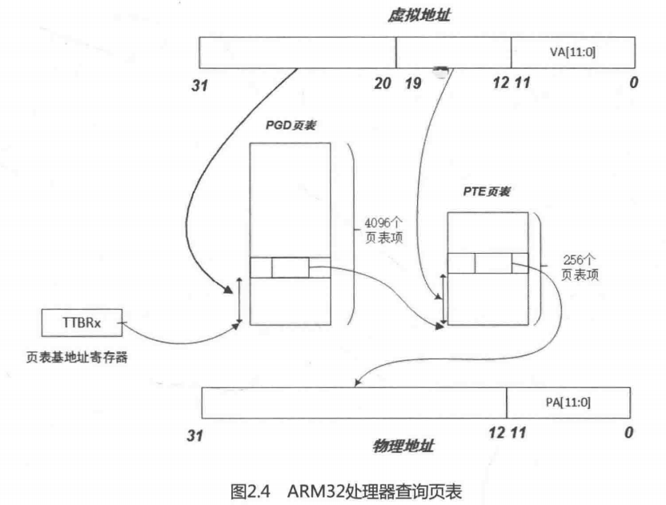
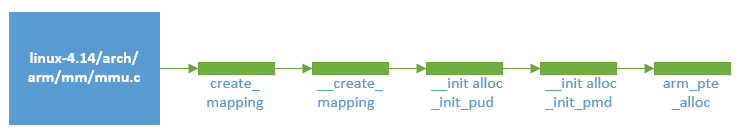
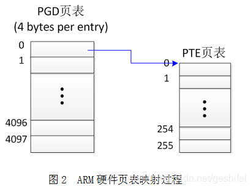
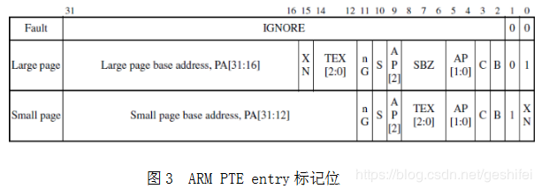
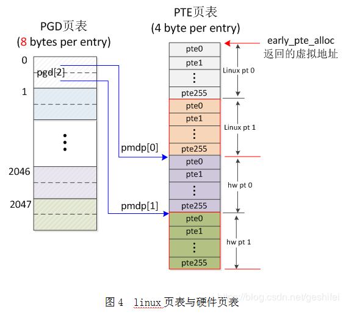
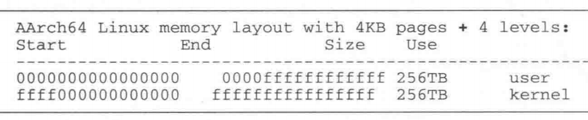
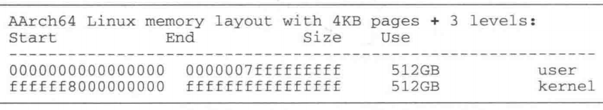

# Linux内核内存管理(七)——页表的映射过程

## 1. ARM32 页表映射

- 在 32bit 的Linux内核中一般采用3层的映射模型，第1层是页全局目录（Page Global Directory，PGD），第2层是页中间目录（Page Middle Directory，PMD），第3层是页面映射表（Page Table Entry，PTE）。
- ARM32系统中只用到两层映射，因此在实际代码中就要在3层的映射模型中合并1层。

### 1.1 段式映射

- 在ARM32架构中，可以按段（section）来映射，这时采用单层映射模式。在单层映射模式下，内存中有个段映射表，表中有4096个表项，每个表项的大小是4Byte，所以这个段映射表大小是16KB，而且其位置必须与16KB边界对齐。
- 当CPU访问内存时，32位虚拟地址的高12位 [31:20] 用作访问段映射表的索引，从表中找到相应的表项。每个表项提供了一个12位的物理地址，以及相应的标志位。将这12位物理地址和虚拟地址的低20位拼凑在一起，就得到32位的物理地址。
- 每个段表项可以寻址1MB大小的地址空间。在相同表项的情况下，虚拟地址的后20位恰好可以寻址 2^20，即1M大小的地址空间。

### 1.2 页表映射



- 如上图，ARM32页表映射方式，MMU映射过程如上图所示。
- 在ARM32架构中，如果采用页表映射方式，段映射表就变成了一级映射表（First Level table，在Linux内核中成为PGD），其表项提供的不再是物理段地址，而是二级页表的基地址。32位虚拟地址的高 12 位（bit[31 : 20]）作为访问一级页表的索引值，找到相应的表项，每个表项指向一个二级页表的起始地址。以虚拟地址的次 8 位（bit[19 : 12]）作为访问二级页表的索引值，得到相应的页表项，从这个页表项中找到20位的物理页面地址。最后将这20位物理页面地址和虚拟地址的低 12 位拼凑在一起，得到最终的  32 位物理地址。这个过程在ARM32架构中由MMU应将完成，软件不需要介入。


### 1.3 页面映射的实现
>   相关宏设置

```c
/* linux-4.14/arch/arm/include/asm/pgtable-2level.h */

/*
 * PMD_SHIFT determines the size of the area a second-level page table can map
 * PGDIR_SHIFT determines what a third-level page table entry can map
 */
#define PMD_SHIFT     21
#define PGDIR_SHIFT       21

#define PMD_SIZE      (1UL << PMD_SHIFT) //0x0020 0000
#define PMD_MASK      (~(PMD_SIZE-1)) //0xFFE0 0000
#define PGDIR_SIZE        (1UL << PGDIR_SHIFT) //0x0020 0000
#define PGDIR_MASK        (~(PGDIR_SIZE-1)) //0xFFE0 0000
```

PMD_SIZE 宏用于计算由页中间目录的一个单独表项所映射的区域大小;PGDIR_SIZE宏用于计算页全局目录中一个单独表项所能映射区域的大小。

PGDIR_SHIFT和PMD_SHIFT都被设置成了21，而ARM32架构中一级页表PGD的偏移量应该是20，关于这个问题，后文会具体解释，此处暂时忽略。

>   ARM Linux内核的也表映射是通过建立具体内存区间的页面映射来实现的。内存区间通过结构体 map_desc 来描述，具体定义如下：

```c
/* linux-4.14/arch/arm/include/asm/mach/map.h */

struct map_desc {
	unsigned long virtual; // 虚拟地址的起始地址
	unsigned long pfn; // 物理地址的起始地址的页帧号
	unsigned long length; // 内存区间长度
	unsigned int type; // 该内存区间的属性
};
```

>   内存区间的属性通过一个全局的mem_type结构体数组来描述，struct mem_type 定义如下：

```c
/* linux-4.14/arch/arm/mm/mm.h */
struct mem_type {
	pteval_t prot_pte; // 用于页面表项的控制位和标志位
	pteval_t prot_pte_s2;
	pmdval_t prot_l1; // 用于一级页面表的控制位和标志位
	pmdval_t prot_sect;
	unsigned int domain; //用于ARM中定义不同的域
};
```

>   全局 mem_type[] 数组描述所有的内存区间类型，其定义如下：

```c
/* linux-4.14/arch/arm/mm/mmu.c */
static struct mem_type mem_types[] __ro_after_init = {
...
	[MT_DEVICE_CACHED] = {	  /* ioremap_cached */
		.prot_pte	= PROT_PTE_DEVICE | L_PTE_MT_DEV_CACHED,
		.prot_l1	= PMD_TYPE_TABLE,
		.prot_sect	= PROT_SECT_DEVICE | PMD_SECT_WB,
		.domain		= DOMAIN_IO,
	},
	[MT_DEVICE_WC] = {	/* ioremap_wc */
		.prot_pte	= PROT_PTE_DEVICE | L_PTE_MT_DEV_WC,
		.prot_l1	= PMD_TYPE_TABLE,
		.prot_sect	= PROT_SECT_DEVICE,
		.domain		= DOMAIN_IO,
	},
...
 	[MT_MEMORY_RWX] = {
 		.prot_pte  = L_PTE_PRESENT | L_PTE_YOUNG | L_PTE_DIRTY,
 		.prot_l1   = PMD_TYPE_TABLE,
 		.prot_sect = PMD_TYPE_SECT | PMD_SECT_AP_WRITE,
 		.domain    = DOMAIN_KERNEL,
 	},
 	[MT_MEMORY_RW] = {
 		.prot_pte  = L_PTE_PRESENT | L_PTE_YOUNG | L_PTE_DIRTY |
 			     L_PTE_XN,
 		.prot_l1   = PMD_TYPE_TABLE,
 		.prot_sect = PMD_TYPE_SECT | PMD_SECT_AP_WRITE,
 		.domain    = DOMAIN_KERNEL,
 	},
...
};
```

-   ARM中允许使用16个不同的域，但在ARM Linux中只定义和使用3个。

```c
/* linux-4.14/arch/arm/include/asm/domain.h */
#define DOMAIN_KERNEL	2 // 用于系统空间
#define DOMAIN_USER	1 // 用于用户空间
#define DOMAIN_IO	0 // 用于I/O地址域，实际上也属于系统空间
    
```

-   `prot_pte` 定义如下：

```c
/* linux-4.14/arch/arm/include/asm/pgtable-2level.h */
#define L_PTE_VALID		(_AT(pteval_t, 1) << 0)		/* Valid */
#define L_PTE_PRESENT		(_AT(pteval_t, 1) << 0)
#define L_PTE_YOUNG		(_AT(pteval_t, 1) << 1)
#define L_PTE_DIRTY		(_AT(pteval_t, 1) << 6)
#define L_PTE_RDONLY		(_AT(pteval_t, 1) << 7)
#define L_PTE_USER		(_AT(pteval_t, 1) << 8)
#define L_PTE_XN		(_AT(pteval_t, 1) << 9)
#define L_PTE_SHARED		(_AT(pteval_t, 1) << 10)	/* shared(v6), coherent(xsc3) */
#define L_PTE_NONE		(_AT(pteval_t, 1) << 11)

/* linux-4.14/arch/arm/mm/mmu.c */
#define PROT_PTE_DEVICE		L_PTE_PRESENT|L_PTE_YOUNG|L_PTE_DIRTY|L_PTE_XN
#define PROT_PTE_S2_DEVICE	PROT_PTE_DEVICE
#define PROT_SECT_DEVICE	PMD_TYPE_SECT|PMD_SECT_AP_WRITE
```

-   `prot_l1`定义如下：

```c
/* linux-4.0/arch/arm/include/asm/pgtable-2level-hwdef.h */
#define PMD_TYPE_MASK		(_AT(pmdval_t, 3) << 0)
#define PMD_TYPE_FAULT		(_AT(pmdval_t, 0) << 0)
#define PMD_TYPE_TABLE		(_AT(pmdval_t, 1) << 0)
#define PMD_TYPE_SECT		(_AT(pmdval_t, 2) << 0)
#define PMD_PXNTABLE		(_AT(pmdval_t, 1) << 2)     /* v7 */
#define PMD_BIT4		(_AT(pmdval_t, 1) << 4)
#define PMD_DOMAIN(x)		(_AT(pmdval_t, (x)) << 5)
#define PMD_PROTECTION		(_AT(pmdval_t, 1) << 9)		/* v5 */
```

-   以上便是整个`map_desc`数据结构，其完整地描述了一个内存区间。

>   create_mapping

-   `create_mapping()`函数就是为一个给定的内存区间建立页面映射，其被调用流程为：`start_kernel()->setup_arch()->paging_init()->map_lowmem()->create_mapping()`，具体调用细节，感兴趣的可以在代码中进行跟踪，此处不做详细阐述。

-   create_mapping()函数调用流程：



-   各函数定义及解析如下：

```c
/* linux-4.14/arch/arm/mm/mmu.c */
static void __init create_mapping(struct map_desc *md)
{
   /* 检查该内存区间（struct map_desc *md）是否属于用户空间，如果是，则返回，不再继续映射操作 */
	if (md->virtual != vectors_base() && md->virtual < TASK_SIZE) {
		pr_warn("BUG: not creating mapping for 0x%08llx at 0x%08lx in user region\n",
			(long long)__pfn_to_phys((u64)md->pfn), md->virtual);
		return;
	}

   /* 检查该内存区间的类型，以及该内存区间是否属于vmalloc（用来分配物理地址非连续空间，240M） */
	if ((md->type == MT_DEVICE || md->type == MT_ROM) &&
	    md->virtual >= PAGE_OFFSET && md->virtual < FIXADDR_START &&
	    (md->virtual < VMALLOC_START || md->virtual >= VMALLOC_END)) {
		pr_warn("BUG: mapping for 0x%08llx at 0x%08lx out of vmalloc space\n",
			(long long)__pfn_to_phys((u64)md->pfn), md->virtual);
	}
 
	/* 调用__create_mapping，init_mm为全局变量，用于后续的查找PGD，early_alloc 是一个用于
	 * 后续内存分配（当pte表项内容为0时，即该虚拟地址没有映射物理地址，需要分配物理内存）的指针函数*/
	__create_mapping(&init_mm, md, early_alloc, false);
}

static void __init __create_mapping(struct mm_struct *mm, struct map_desc *md,
				    void *(*alloc)(unsigned long sz),
				    bool ng)
{
	unsigned long addr, length, end;
	phys_addr_t phys;
	const struct mem_type *type;
	pgd_t *pgd;

   /* 通过md->type来获取描述该内存区域属性的mem_type数据结构，然后只需要通过查表的方式获取
    * mem_type数据结构里的具体内容。 */
	type = &mem_types[md->type];

#ifndef CONFIG_ARM_LPAE
	/*
	 * Catch 36-bit addresses
	 */
	if (md->pfn >= 0x100000) {
		create_36bit_mapping(mm, md, type, ng);
		return;
	}
#endif

	addr = md->virtual & PAGE_MASK;
	phys = __pfn_to_phys(md->pfn);
	length = PAGE_ALIGN(md->length + (md->virtual & ~PAGE_MASK));

	if (type->prot_l1 == 0 && ((addr | phys | length) & ~SECTION_MASK)) {
		pr_warn("BUG: map for 0x%08llx at 0x%08lx can not be mapped using pages, ignoring.\n",
			(long long)__pfn_to_phys(md->pfn), addr);
		return;
	}

   /* 获取pgd表项 */
	pgd = pgd_offset(mm, addr);
	end = addr + length;
	do {
   		/* 以PGDIR_SIZE为步长获取next值 */
		unsigned long next = pgd_addr_end(addr, end);
		/* 初始化PGD页表项内容和下一级页表PUD */
		alloc_init_pud(pgd, addr, next, phys, type, alloc, ng);

		phys += next - addr;
		addr = next;
	} while (pgd++, addr != end);
}

static void __init alloc_init_pud(pgd_t *pgd, unsigned long addr,
				  unsigned long end, phys_addr_t phys,
				  const struct mem_type *type,
				  void *(*alloc)(unsigned long sz), bool ng)
{
   /* arm 平台支持两级页表映射，所以PUD设置成与PGD等同。 pud_offset直接返回pgd*/
	pud_t *pud = pud_offset(pgd, addr);
	unsigned long next;

	do {
   		/* 两级页表映射中，pud与pgd等同，所以PUD_SIZE=PGDIR_SIZE,通过pud_addr_end函数
   	 	 * 获取到的next值应该与end值相等，即该do-while循环只循环一次 */
		next = pud_addr_end(addr, end);
   		/* 初始化PUD页表项内容和下一级页表PMD */
		alloc_init_pmd(pud, addr, next, phys, type, alloc, ng);
		phys += next - addr;
	} while (pud++, addr = next, addr != end);
}

static void __init alloc_init_pmd(pud_t *pud, unsigned long addr,
				      unsigned long end, phys_addr_t phys,
				      const struct mem_type *type,
				      void *(*alloc)(unsigned long sz), bool ng)
{
   /* 与alloc_init_pud类似 */
	pmd_t *pmd = pmd_offset(pud, addr);
	unsigned long next;

	do {
		/*
		 * With LPAE, we must loop over to map
		 * all the pmds for the given range.
		 */
		next = pmd_addr_end(addr, end);

		/*
		 * Try a section mapping - addr, next and phys must all be
		 * aligned to a section boundary.
		 */
   		/* if语句做section mapping（段映射）检查，若不是段映射，则执行alloc_init_pte */
		if (type->prot_sect &&
				((addr | next | phys) & ~SECTION_MASK) == 0) {
			__map_init_section(pmd, addr, next, phys, type, ng);
		} else {
			alloc_init_pte(pmd, addr, next,
				       __phys_to_pfn(phys), type, alloc, ng);
		}

		phys += next - addr;

	} while (pmd++, addr = next, addr != end);
}

static void __init alloc_init_pte(pmd_t *pmd, unsigned long addr,
				  unsigned long end, unsigned long pfn,
				  const struct mem_type *type,
				  void *(*alloc)(unsigned long sz),
				  bool ng)
{
   /* 判断相应的PTE页表项是否已经存在，如果不存在，那就新建PTE页表项 */
	pte_t *pte = arm_pte_alloc(pmd, addr, type->prot_l1, alloc);
	do {
   		/* 通过__pgprot() 和 pfn 组成 PTE entry，最后由set_pte_ext完成对硬件页表项的设置 */
		set_pte_ext(pte, pfn_pte(pfn, __pgprot(type->prot_pte)),
			    ng ? PTE_EXT_NG : 0);
		pfn++;
	} while (pte++, addr += PAGE_SIZE, addr != end);
}

static pte_t * __init arm_pte_alloc(pmd_t *pmd, unsigned long addr,
				unsigned long prot,
				void *(*alloc)(unsigned long sz))
{
   /* *pmd中存放的是pte页表的基地址，pmd_none(*pmd)判断该基地址是否选择，不存在的话，
    * 执行if语句，新建pte页表项 */
	if (pmd_none(*pmd)) {
   		/* 此处的alloc函数便是create_mapping函数中调用__create_mapping时所传递的指
   	 	 * 针函数early_alloc，通过一层一层传递，最后在此处调用。early_alloc函数最终调用
   	  	 * memblock_alloc函数，该函数可以向kernel申请一块可用的物理内存，此处已属于kernel
   	 	 * 内存分配的范畴，不做细讲。 这里分配了两个PTE_HWTABLE_OFF（512），也就是分配了
   	 	 * 两份页面表项。*/
   		/* 因为Linux内核默认的PGD是从21位开始的，也就是 bit[31:21]，一共2048个一级页表项。
   	 	 * 而ARM32硬件结构中，PGD是从20位开始，页表数目是4096，比Linux内核的要多一倍。 */
		pte_t *pte = alloc(PTE_HWTABLE_OFF + PTE_HWTABLE_SIZE);
   		/* 将新建的pte页面表的基地址设置到pmd页表项中,本节后续还要详细介绍 */
		__pmd_populate(pmd, __pa(pte), prot);
	}
	BUG_ON(pmd_bad(*pmd));
   	/* pte_offset_kernel 返回相应的PTE页面表项 */
	return pte_offset_kernel(pmd, addr);
}
```

`create_mapping()`函数通过调用`pgd_offset()`函数获取所属页面目录项PGD。内核的页表存放在swapper_pg_dir地址中，可以通过 init_mm 数据结构来获取，init_mm 定义如下：

```c
/* linux-4.14/mm/init-mm.c */
struct mm_struct init_mm = {
	.mm_rb		= RB_ROOT,
	.pgd		= swapper_pg_dir,
	.mm_users	= ATOMIC_INIT(2),
	.mm_count	= ATOMIC_INIT(1),
	.mmap_sem	= __RWSEM_INITIALIZER(init_mm.mmap_sem),
	.page_table_lock =  __SPIN_LOCK_UNLOCKED(init_mm.page_table_lock),
	.mmlist		= LIST_HEAD_INIT(init_mm.mmlist),
	.user_ns	= &init_user_ns,
	INIT_MM_CONTEXT(init_mm)
};
```

内核页表的基地址定义如下：

```c
/* linux-4.14/arch/arm/kernel/head.S */
#define KERNEL_RAM_VADDR	(PAGE_OFFSET + TEXT_OFFSET)
#if (KERNEL_RAM_VADDR & 0xffff) != 0x8000
#error KERNEL_RAM_VADDR must start at 0xXXXX8000
#endif

#ifdef CONFIG_ARM_LPAE
	/* LPAE requires an additional page for the PGD */
#define PG_DIR_SIZE	0x5000
#define PMD_ORDER	3
#else
#define PG_DIR_SIZE	0x4000
#define PMD_ORDER	2
#endif

	.globl	swapper_pg_dir
	.equ	swapper_pg_dir, KERNEL_RAM_VADDR - PG_DIR_SIZE

/* linux-4.14/arch/arm/Makefile */
textofs-y	:= 0x00008000
TEXT_OFFSET := $(textofs-y)
```

pgd_offset()宏可以从 init_mm 数据结构所指定的页面目录中找到地址addr所属的页面目录项指针 pgd。 首先 通过 init_mm 结构体得到页表的基地址，然后通过 addr 右移 PGDIR_SHIFT 得到 pgd 的索引值，最后在一级页表中找到相应的页表项 pgd 指针。PGD的定义如下：

```c
typedef struct { pmdval_t pgd[2]; } pgd_t;
#define pgd_index(addr)		((addr) >> PGDIR_SHIFT)
#define pgd_offset(mm, addr)	((mm)->pgd + pgd_index(addr))
```

`arm_pte_alloc() -> __pmd_populate()`函数实现如下：

```c
/* linux-4.14/arch/arm/include/asm/pgalloc.h */
static inline void __pmd_populate(pmd_t *pmdp, phys_addr_t pte,
				  pmdval_t prot)
{
    /* 这里把刚分配的1024个PTE页面表中的第512个页表项的地址作为基地址，再加上一些标志位信息
     * prot 作为页表项内容，写入上一级的 PMD 中。 */
	pmdval_t pmdval = (pte + PTE_HWTABLE_OFF) | prot;
    /* 相邻的两个二级页表的基地址分别写入PMD的页表项中的pmdp[0]和pmdp[1]指针中。 */
	pmdp[0] = __pmd(pmdval);
#ifndef CONFIG_ARM_LPAE
	pmdp[1] = __pmd(pmdval + 256 * sizeof(pte_t));
#endif
	flush_pmd_entry(pmdp);
}
```

由pgd定义可知，pgd其实是pmdval_t pgd[2]，长度是两倍，也就是pgd包括两份相邻的PTE页表，所以pgd_offset在查找pgd表项时，是按照 pgd[2] 长度来进行计算的，因此查找相应的 pgd 表项时，其中 pgd[0] 指向第一份 PTE 页表，pgd[1] 指向第二份 PTE 页表。

后续第3部分，回答“ARM32架构中一级页表PGD的偏移量 PGDIR_SHIFT设置为21”，以及“PGD 页表项为什么是两倍长度”的问题。


-   ARM硬件页表映射过程如下图：

​                                  

页表中每一项称为一个entry（也就是我们之前所说的表项），entry存放的是物理地址值，PGD entry值指向2级页表（PTE页表），PTE entry值指向物理页。

由于以下两个原因，linux代码对上图的映射过程做了一些调整：

1.  PTE entry中的一些低bit位被硬件使用了，没有linux需要的“accessed”、“dirty”等标志位。参考内核代码注释： Hardware-wise, we have a two level page table structure, where the first level has 4096 entries, and the second level has 256 entries.  Each entry is one 32-bit word.  Most of the bits in the second level entry are used by hardware, and there aren't any "accessed" and "dirty" bits。
2.  linux 希望PTE页表本身也是一个页表大小。参考内核代码注释：However, Linux also expects one "PTE" table per page, and at least a "dirty" bit.，但本章1.2页面映射章节中的PTE页表只有256*4 Byte=1k大小。

-   所以，针对以上两个问题，linux做了一些处理，使内核中实现的页表能够满足硬件要求，最终的arm页表如下图：                                           

如上表，解释如下：

1.  软件实现必须符合硬件要求，ARM要求4096个PGD entry，256个PTE entry。解决：PGD每个entry为8 bytes，定义为pmdval_t pgd[2]，故共2048*2=4096 PGD entry。ARM MMU用va的bit[31,20]（本章1.2页面映射章节）在PGD 4096项中找到对应的entry，每个entry指向一个hw页表（上图）。每一个hw页表有256个entry，ARM MMU用va的bit[19,12]在hw页表中找到对应的entry。所以从硬件角度看，linux实现的arm页表，完全符合硬件要求。
2.  Linux需要 "accessed" and "dirty"位。解决：从图（arm pte entry标记位.png)中可以看出，PTE entry的低位已经被硬件占用，所以只能再复制出一份页表（称为linux页表或linux pt），上图的hw pt 0对应Linux pt 0，linux页表的低bit位被linux系统用来提供需要的 "accessed" and "dirty"位。hw pt由MMU使用，linux pt由操作系统使用。
3.  Linux期望PTE页表占用1个page。解决：ARM的hw pt为256\*4 bytes=1k，不满一个page大小。内核代码在实现上采用了一个小技巧，让一个PGD entry映射2个连续的hw pt，同时将对应的2个linux pt也组织在一起，共1k*4=4k。

因为linux代码让PGD一次映射2个hw pt，所以软件需要做一些处理来实现这个目的。软件定义PGD表项为pmdval_t pgd[2]，pgd[i]指向一个hw pt，所以PGD表项一共有4096/2=2048项，也就是说需要用bit[31,21]来寻址这2048项，所以pgtable-2level.h中定义了：#define PGDIR_SHIFT 21 (注意，本章1.2页面映射章节图中PGD偏移20bit，那是给硬件MMU用的，跟我们这里的软件偏移没有关系)。


## 2. ARM64 页表映射

- 理解了ARM32页表映射过程，对于ARM64页表映射过程的理解也就相对容易些了。
- 目前基于ARMv8-A架构的处理器最大可支持到48根地址线，也就是寻址2^48的虚拟地址空间。即虚拟地址空间范围为 0x0000 0000 0000 0000 ~ 0x0000 FFFF FFFF FFFF，共 256 TB。
- 基于 ARMv8-A架构的处理器可以通过配置 CONFIG_ARM64_VA_BITS 这个宏来设置虚拟地址的宽度。

```c
/* linux-4.14/arch/arm64/Kconfig */
config ARM64_VA_BITS
	int
	default 36 if ARM64_VA_BITS_36
	default 39 if ARM64_VA_BITS_39
	default 42 if ARM64_VA_BITS_42
	default 47 if ARM64_VA_BITS_47
	default 48 if ARM64_VA_BITS_48
```

- 另外基于ARMv8-A架构的处理器支持的最大物理地址宽度也是48位。

- Linux 内存空间布局与地址映射的粒度和地址映射的层级有关。基于ARMv8-A架构的处理器支持的页面大小可以是 4KB、16KB或者64KB。映射的层级可以是3级或者4级。

- 下面是页面大小为4KB，地址宽度为48位，4级映射的内存分布图：

  页面大小为4KB，地址宽度为48位，3级映射的内存分布图如下：

  Linux 内核的 documentation/arm64/memory.txt 文件中还有其他不同配置的内存分布图。

- 后续我们以页面大小为4KB，地址宽度为48位，4级映射的配置为基础介绍ARM64的地址映射过程。

### 2.1 ARM64虚拟地址转换

.png)

1.  如果输入的虚拟地址最高位 bit[63]为 1，那么这个地址是用于内核空间的，页表的基地址寄存器用 TTBR1_EL1（Translation Table Base Register 1）。如果 bit[63]为 0，那么这个地址是用于用户空间的，页表的基地址寄存器用 TTBR0。
2.  TTBRx 寄存器保存了第 0 级页表的基地址 （L0 Table base address，Linux内核中称为PGD），L0 页表中有512个表项 （Table Descriptor），以虚拟地址的 bit[47:39]作为索引值在L0页表中查找相应的表项。每个表项的内容含有下一级页表的基地址，即L1页表（Linux内核中称为PUD）的基地址。
3.  PUD 页表中有512个表项，以虚拟地址的 bit[38:30]为索引值在PUD表中查找相应的表项，每个表项的内容含有下一级页表的基地址，即L2页表（Linux内核中称为PMD）的基地址。
4.  PMD页表中有512个表项，以虚拟地址的 bit[29:21]为索引值在PMD表中查找相应的表项，每个表项的内容含有下一级页表的基地址，即L3页表（Linux内核中称为PTE）的基地址。
5.  在PTE页表中，以虚拟地址的 bit[20:12]为索引值在PTE表中查找相应的表项，每个PTE表项中含有最终物理地址的bit[47:12]，和虚拟地址中的[11:0] 合并成最终的物理地址，完成地址翻译过程。

该过程与 《Linux 内核分析(五)——页表》章节中介绍页表结构内容相似。


### 2.2 页面映射的函数实现

在内核初始化阶段会对内核空间的页表进行一一映射，实现的函数从\__create_pgd_mapping()开始，前面调用关系是：`start_kernel()->setup_arch()->paging_init()->map_mem()->__map_memblock()-> __create_pgd_mapping()`，具体调用细节，感兴趣的可以在代码中进行跟踪，此处不做详细阐述。

虚拟地址的一些前期检查在 map_mem() 函数中实现，此处不再详述。

- __create_pgd_mapping

```c
/* linux-4.14/arch/arm64/mm/mmu.c */
static void __create_pgd_mapping(pgd_t *pgdir, phys_addr_t phys,
				 unsigned long virt, phys_addr_t size,
				 pgprot_t prot,
				 phys_addr_t (*pgtable_alloc)(void),
				 int flags)
{
	unsigned long addr, length, end, next;
   /* 通过pgd_offset_raw 函数获取pgd页面目录表项 */
	pgd_t *pgd = pgd_offset_raw(pgdir, virt);

	/*
	 * If the virtual and physical address don't have the same offset
	 * within a page, we cannot map the region as the caller expects.
	 */
	if (WARN_ON((phys ^ virt) & ~PAGE_MASK))
		return;

	phys &= PAGE_MASK;
	addr = virt & PAGE_MASK;
	length = PAGE_ALIGN(size + (virt & ~PAGE_MASK));

	end = addr + length;
   /* 以PGDIR_SIZE为步长遍历内存区域[addr, end],然后调用alloc_init_pud（）来初始化PGD页
    * 表项内容和下一级页表PUD。pgd_addr_end以PGDIR_SIZE为步长。 */
	do {
		next = pgd_addr_end(addr, end);
		alloc_init_pud(pgd, addr, next, phys, prot, pgtable_alloc,
			       flags);
		phys += next - addr;
	} while (pgd++, addr = next, addr != end);
}
```

ARM64 PGD 的表项通过 `__create_pgd_mapping() -> pgd_offset_raw()` 宏来获取，其定义：

```c
/* linux-4.14/arch/arm64/include/asm/pgtable.h */
/* to find an entry in a page-table-directory */
#define pgd_index(addr)	(((addr) >> PGDIR_SHIFT) & (PTRS_PER_PGD - 1))

#define pgd_offset_raw(pgd, addr)	((pgd) + pgd_index(addr))
```

相关宏定义如下：

```c
[linux-4.14/arch/arm64/include/asm/pgtable-hwdef.h]

#define ARM64_HW_PGTABLE_LEVELS(va_bits) (((va_bits) - 4) / (PAGE_SHIFT - 3))
#define ARM64_HW_PGTABLE_LEVEL_SHIFT(n)	((PAGE_SHIFT - 3) * (4 - (n)) + 3)

#define PTRS_PER_PTE		(1 << (PAGE_SHIFT - 3))

/*
 * PMD_SHIFT determines the size a level 2 page table entry can map.
 */
#if CONFIG_PGTABLE_LEVELS > 2
#define PMD_SHIFT		ARM64_HW_PGTABLE_LEVEL_SHIFT(2)
#define PMD_SIZE		(_AC(1, UL) << PMD_SHIFT)
#define PMD_MASK		(~(PMD_SIZE-1))
#define PTRS_PER_PMD		PTRS_PER_PTE
#endif

/*
 * PUD_SHIFT determines the size a level 1 page table entry can map.
 */
#if CONFIG_PGTABLE_LEVELS > 3
#define PUD_SHIFT		ARM64_HW_PGTABLE_LEVEL_SHIFT(1)
#define PUD_SIZE		(_AC(1, UL) << PUD_SHIFT)
#define PUD_MASK		(~(PUD_SIZE-1))
#define PTRS_PER_PUD		PTRS_PER_PTE
#endif

/*
 * PGDIR_SHIFT determines the size a top-level page table entry can map
 * (depending on the configuration, this level can be 0, 1 or 2).
 */
#define PGDIR_SHIFT		ARM64_HW_PGTABLE_LEVEL_SHIFT(4 - CONFIG_PGTABLE_LEVELS)
#define PGDIR_SIZE		(_AC(1, UL) << PGDIR_SHIFT)
#define PGDIR_MASK		(~(PGDIR_SIZE-1))
#define PTRS_PER_PGD		(1 << (VA_BITS - PGDIR_SHIFT))
```

PAGE_SHIFT 根据页的大小来定的，如4K（2^12）大小的页，其PAGE_SHIFT 为12，va_bits 为48，ARM64_HW_PGTABLE_LEVELS 为映射页表的级数，通过以上计算，该值为4，即4级页表，那么通过计算可以得到 PGDIR_SHIFT = 39，PUD_SHIFT = 30，PMD_SHIFT = 21。每级页表的页表项数目分别用PTRS_PER_PGD、PTRS_PER_PUD、PTRS_PER_PMD 和 PTRS_PER_PTE 来表示，都等于 512。PGDIR_SIZE 宏表示一个PGD页表项能覆盖的内存范围大小为512GB。PUD_SIZE 等于 1GB，PMD_SIZE 等于 2MB， PAGE_SIZE等于 4KB。


继续分析 __create_pgd_mapping() 函数，调用pgd_offset_raw 的参数 pgdir 是从 paging_init() 函数中传递下来的，如下：

```c
/* linux-4.14/arch/arm64/mm/mmu.c */
void __init paging_init(void)
{
	phys_addr_t pgd_phys = early_pgtable_alloc();
	pgd_t *pgd = pgd_set_fixmap(pgd_phys);

	map_kernel(pgd);
	map_mem(pgd);
   ...
}
```


- alloc_init_pud

```c
[linux-4.14/arch/arm64/mm/mmu.c]

static void alloc_init_pud(pgd_t *pgd, unsigned long addr, unsigned long end,
				  phys_addr_t phys, pgprot_t prot,
				  phys_addr_t (*pgtable_alloc)(void),
				  int flags)
{
	pud_t *pud;
	unsigned long next;

	if (pgd_none(*pgd)) {
		phys_addr_t pud_phys;
		BUG_ON(!pgtable_alloc);
		pud_phys = pgtable_alloc();
		__pgd_populate(pgd, pud_phys, PUD_TYPE_TABLE);
	}
	BUG_ON(pgd_bad(*pgd));

	pud = pud_set_fixmap_offset(pgd, addr);
	do {
		pud_t old_pud = *pud;

		next = pud_addr_end(addr, end);

		/*
		 * For 4K granule only, attempt to put down a 1GB block
		 */
		if (use_1G_block(addr, next, phys) &&
		    (flags & NO_BLOCK_MAPPINGS) == 0) {
			pud_set_huge(pud, phys, prot);

			/*
			 * After the PUD entry has been populated once, we
			 * only allow updates to the permission attributes.
			 */
			BUG_ON(!pgattr_change_is_safe(pud_val(old_pud),
						      pud_val(*pud)));
		} else {
			alloc_init_cont_pmd(pud, addr, next, phys, prot,
					    pgtable_alloc, flags);

			BUG_ON(pud_val(old_pud) != 0 &&
			       pud_val(old_pud) != pud_val(*pud));
		}
		phys += next - addr;
	} while (pud++, addr = next, addr != end);

	pud_clear_fixmap();
}
```

1.  通过 pgd_none() 判断当前 PGD 表项内容是否为空。如果 PGD 表项内容为空，说明下一级页表为空，那么需要动态分配下一级页表。下一级页表 PUD 一共有 PTRS_PER_PUD 个页表项，即 512 个表项，然后通过 __pgd_populate() 把刚分配的 PUD 页表设置到相应的PGD 页表项中。
2.  通过 pud_set_fixmap_offset() 来获取相应的 PUD 表项。最终使用虚拟地址的 bit[38~30]位来做索引值。
3.  接下来以 PUD_SIZE （即 1 << 30, 1GB）为步长，通过while循环来设置下一级页表。
4.  use_1G_block() 函数会判断是否使用 1GB 大小的 block 来映射，当这里要映射的内存块大小正好是 PUD_SIZE ，那么只需要映射到 PUD 就好了，接下来的 PMD 和 PTE 页表等到真正需要使用时再映射，通过 pud_set_huge() 函数来设置相应的 PUD 表项。
5.  如果 use_1G_block() 函数判断不能通过 1GB 大小来映射，那么就需要调用 alloc_init_cont_pmd() 函数来进行下一级页表的映射。


- alloc_init_cont_pmd

```c
[linux-4.14/arch/arm64/mm/mmu.c]

static void alloc_init_cont_pmd(pud_t *pud, unsigned long addr,
				unsigned long end, phys_addr_t phys,
				pgprot_t prot,
				phys_addr_t (*pgtable_alloc)(void), int flags)
{
	unsigned long next;

	/*
	 * Check for initial section mappings in the pgd/pud.
	 */
	BUG_ON(pud_sect(*pud));
	if (pud_none(*pud)) {
		phys_addr_t pmd_phys;
		BUG_ON(!pgtable_alloc);
		pmd_phys = pgtable_alloc();
		__pud_populate(pud, pmd_phys, PUD_TYPE_TABLE);
	}
	BUG_ON(pud_bad(*pud));

	do {
		pgprot_t __prot = prot;

		next = pmd_cont_addr_end(addr, end);

		/* use a contiguous mapping if the range is suitably aligned */
		if ((((addr | next | phys) & ~CONT_PMD_MASK) == 0) &&
		    (flags & NO_CONT_MAPPINGS) == 0)
			__prot = __pgprot(pgprot_val(prot) | PTE_CONT);

		init_pmd(pud, addr, next, phys, __prot, pgtable_alloc, flags);

		phys += next - addr;
	} while (addr = next, addr != end);
}

static void init_pmd(pud_t *pud, unsigned long addr, unsigned long end,
		     phys_addr_t phys, pgprot_t prot,
		     phys_addr_t (*pgtable_alloc)(void), int flags)
{
	unsigned long next;
	pmd_t *pmd;

	pmd = pmd_set_fixmap_offset(pud, addr);
	do {
		pmd_t old_pmd = *pmd;

		next = pmd_addr_end(addr, end);

		/* try section mapping first */
		if (((addr | next | phys) & ~SECTION_MASK) == 0 &&
		    (flags & NO_BLOCK_MAPPINGS) == 0) {
			pmd_set_huge(pmd, phys, prot);

			/*
			 * After the PMD entry has been populated once, we
			 * only allow updates to the permission attributes.
			 */
			BUG_ON(!pgattr_change_is_safe(pmd_val(old_pmd),
						      pmd_val(*pmd)));
		} else {
			alloc_init_cont_pte(pmd, addr, next, phys, prot,
					    pgtable_alloc, flags);

			BUG_ON(pmd_val(old_pmd) != 0 &&
			       pmd_val(old_pmd) != pmd_val(*pmd));
		}
		phys += next - addr;
	} while (pmd++, addr = next, addr != end);

	pmd_clear_fixmap();
}
```

alloc_init_cont_pmd() 函数用于配置 PMD 页表：

1.  首先通过 pud_none() 判断当前 PUD 表项内容是否为空。如果 PUD 表项内容为空，说明下一级页表为空，那么需要动态分配下一级页表。下一级页表 PMD 一共有 PTRS_PER_PMD 个页表项，即 512 个表项，然后通过 __pud_populate() 把刚分配的 PMD 页表设置到相应的PUD 页表项中。
2.  调用 init_pmd() 函数，在  init_pmd() 函数中， 通过 pmd_set_fixmap_offset() 来获取相应的 PMD 表项。最终使用虚拟地址的 bit[29~21]位来做索引值。
3.  接下来以 PMD_SIZE （即 1 << 21,  2MB）为步长，通过while循环来设置下一级页表。
4.  如果虚拟区间的开始地址addr和结束地址next，以及物理地址 phys 都与 SECTION_SIZE (2MB) 大小对齐，那么直接设置PMD页表项，不需要映射下一级页表。下一级页表等到需要用时再映射也来得及，所以这里直接通过 pmd_set_huge() 设置 PMD 页表项。
5.  如果映射的内存不是和 SECTION_SIZE  对齐的，那么需要通过 alloc_init_cont_pte() 函数来映射下一级 PTE 页表。


- alloc_init_cont_pte

```c
[linux-4.14/arch/arm64/mm/mmu.c]

static void alloc_init_cont_pte(pmd_t *pmd, unsigned long addr,
				unsigned long end, phys_addr_t phys,
				pgprot_t prot,
				phys_addr_t (*pgtable_alloc)(void),
				int flags)
{
	unsigned long next;

	BUG_ON(pmd_sect(*pmd));
	if (pmd_none(*pmd)) {
		phys_addr_t pte_phys;
		BUG_ON(!pgtable_alloc);
		pte_phys = pgtable_alloc();
		__pmd_populate(pmd, pte_phys, PMD_TYPE_TABLE);
	}
	BUG_ON(pmd_bad(*pmd));

	do {
		pgprot_t __prot = prot;

		next = pte_cont_addr_end(addr, end);

		/* use a contiguous mapping if the range is suitably aligned */
		if ((((addr | next | phys) & ~CONT_PTE_MASK) == 0) &&
		    (flags & NO_CONT_MAPPINGS) == 0)
			__prot = __pgprot(pgprot_val(prot) | PTE_CONT);

		init_pte(pmd, addr, next, phys, __prot);

		phys += next - addr;
	} while (addr = next, addr != end);
}

static void init_pte(pmd_t *pmd, unsigned long addr, unsigned long end,
		     phys_addr_t phys, pgprot_t prot)
{
	pte_t *pte;

	pte = pte_set_fixmap_offset(pmd, addr);
	do {
		pte_t old_pte = *pte;

		set_pte(pte, pfn_pte(__phys_to_pfn(phys), prot));

		/*
		 * After the PTE entry has been populated once, we
		 * only allow updates to the permission attributes.
		 */
		BUG_ON(!pgattr_change_is_safe(pte_val(old_pte), pte_val(*pte)));

		phys += PAGE_SIZE;
	} while (pte++, addr += PAGE_SIZE, addr != end);

	pte_clear_fixmap();
}
```

PTE 页表是 4 级页表的最后一级， alloc_init_cont_pte() 配置 PTE 页表项。

1.  首先通过 pmd_none() 判断当前 PMD 表项内容是否为空。如果 PMD 表项内容为空，说明下一级页表为空，那么需要动态分配 PTRS_PER_PTE 个页表项，即 512 个表项，然后通过 __pmd_populate() 把刚分配的 PTE 页表设置到相应的PMD 页表项中。
2.  调用 init_pte() 函数，在  init_pte() 函数中， 通过 pte_set_fixmap_offset() 来获取相应的 PTE 表项。最终使用虚拟地址的 bit[20~12]位来做索引值。
3.  接下来以 PAG_SIZE （即 1 << 12,  4kB）为步长，通过while循环来设置PTE页表项。
