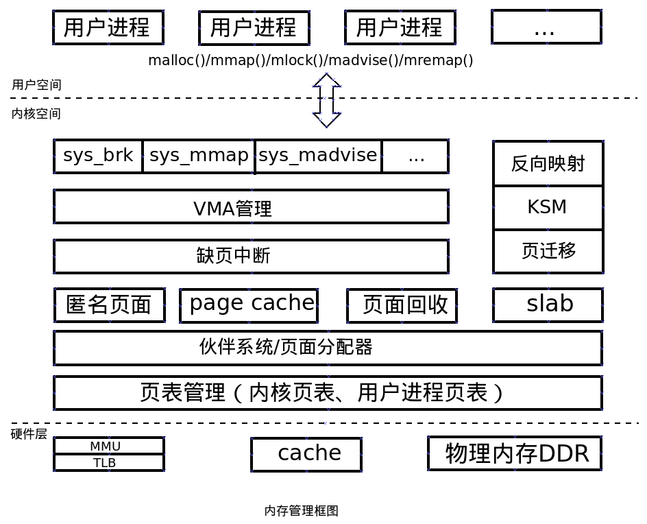
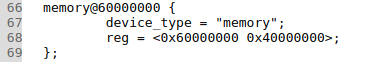
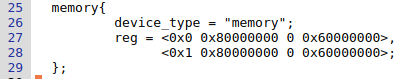
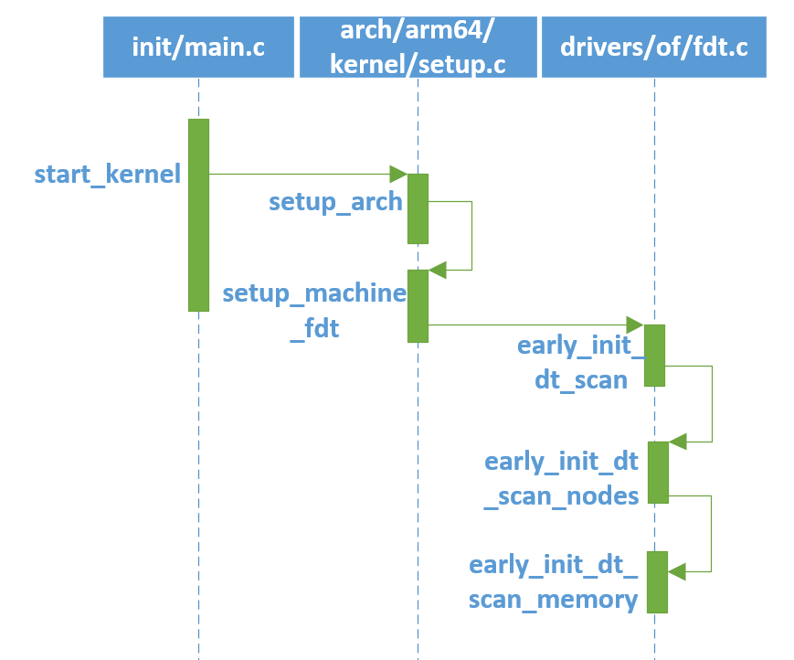

# Linux内核内存管理（三）——内存解析

## 1. 物理内存初始化

- 从硬件角度来看内存，随机存储器（RAM）是与CPU直接交换数据的内部存储器。目前大部分计算机都使用DDR的存储设备。DDR的初始化一般是在BIOS或bootloader中，BIOS或bootloader把DDR的大小传递给Linux内核，因此从Linux内核角度来看，DDR其实就是一段物理内存空间。

### 1.1 内存管理概述

- 内存空间分为3个层次：用户空间层、内核空间层、硬件层。             
-   用户空间层，可以理解为Linux内核内存管理为用户空间暴露的系统调用接口。

- 内核空间层，包含的模块相当丰富。用户空间和内核空间的接口是系统调用，因此内核空间层首先需要处理这些内存管理相关的系统调用，例如sys_brk、sys_mmap、sys_madvise等。接下来就包括VMA管理、缺页中断管理、匿名页面、page cache、页面回收、反向映射、slab分配器、页面管理等模块了。
- 硬件层，包括处理器的MMU、TLB、cache部件，以及板载的物理内存，例如LPDDR或者DDR。

### 1.2 内核内存大小

**内核内存定义**

Linux-4.14/arch/arm/boot/dts/vexpress-v2p-ca9.dts                                                           

linux-4.14/arch/arm64/boot/dts/sprd/sp9860g-1h10.dts                                                   

以上分别为arm32、arm64内核内存定义，vexpress-v2p-ca9.dts文件中定义了内核内存的起始地址为0x6000 0000， 大小为0x4000 0000，即1G大小的的内存空间。注意，此处的起始地址为物理地址。

arm32、arm64内存定义因为地址位数不同稍有不同，具体可参考Linux设备树中节点的定义等相关知识，如https://www.linuxidc.com/Linux/2016-01/127337p6.htm

### 1.3 内核内存解析

-   内核在启动的过程中，需要解析DTS（vexpress-v2p-ca9.dts、sp9832e-1h10.dts）文件，相关代码调用如下：


**函数解析**

-   `linux-4.14/init/main.c`, `start_kernel(void) -> setup_arch(&command_line)`，调用setup_arch函数，传给他的参数是未被初始化的内部变量command_line。

```c
asmlinkage __visible void __init start_kernel(void)
{
	char *command_line;

	setup_arch(&command_line);
	...
}

```

- `linux-4.14/[arch/arm/kernel/setup.c`，`setup_arch(&command_line) -> setup_machine_fdt(__atags_pointer)`，这个setup_arch()函数是start_kernel阶段最重要的一个函数，每个体系都有自己的setup_arch()函数，是体系结构相关的，具体编译哪个体系的setup_arch()函数，由顶层Makefile中的ARCH变量决定，参数__atags_pointer是bootloader传递过来的，代表devicetree在内存中的地址，一般为0x68000000。

```c
void __init setup_arch(char **cmdline_p)
{
	const struct machine_desc *mdesc;

	setup_processor();
	mdesc = setup_machine_fdt(__atags_pointer);
   ...
}

```

- `linux-4.14/arch/arm/kernel/devtree.c`，`setup_machine_fdt(__atags_pointer) -> early_init_dt_scan(phys_to_virt(dt_phys))`

```C
const struct machine_desc * __init setup_machine_fdt(unsigned int dt_phys)
{
...  
  	if (!dt_phys || !early_init_dt_verify(phys_to_virt(dt_phys)))
  		return NULL;
...
  	early_init_dt_scan_nodes();
...
}

```

`phys_to_virt()` 函数将物理地址转化为虚拟地址。`dt_phys`为`0x68000000`时，转化为虚拟地址`0xc8000000`。`early_init_dt_verify()`函数主要检测设备树的有效性（主要做一些设备树头的检查，设备树相关数据的校验），如下：`linux-4.14/drivers/of/fdt.c`

```c
bool __init early_init_dt_verify(void *params)
{
	if (!params)
		return false;

	/* check device tree validity */
	if (fdt_check_header(params))
		return false;

	/* Setup flat device-tree pointer */
	initial_boot_params = params;
	of_fdt_crc32 = crc32_be(~0, initial_boot_params,
				fdt_totalsize(initial_boot_params));
	return true;
}

```

   - `linux-4.14/drivers/of/fdt.c`，`early_init_dt_scan_nodes() -> early_init_dt_scan_memory，early_init_dt_scan_nodes()`函数实现三部分功能，具体如代码中的注释所述。

```c
void __init early_init_dt_scan_nodes(void)
{
	/* Retrieve various information from the /chosen node */
    /*  扫描 /chosen node，保存运行时参数（bootargs）到boot_command_line，此外，还处理initrd相关的property，并保存在initrd_start和initrd_end这两个全局变量中 */
	of_scan_flat_dt(early_init_dt_scan_chosen, boot_command_line);

	/* Initialize {size,address}-cells info */
    /* 扫描根节点，获取 {size,address}-cells信息，并保存在dt_root_size_cells和dt_root_addr_cells全局变量中 */
	of_scan_flat_dt(early_init_dt_scan_root, NULL);

	/* Setup memory, calling early_init_dt_add_memory_arch */
    /* 扫描DTB中的memory node，并把相关信息保存在meminfo中，全局变量meminfo保存了系统内存相关的信息。*/
	of_scan_flat_dt(early_init_dt_scan_memory, NULL);
}

```

   - `of_scan_flat_dt`函数是用来scan整个device  tree，针对每一个node调用callback函数。`of_scan_flat_dt(early_init_dt_scan_memory, NULL)`针对memory node进行scan。

```c
int __init of_scan_flat_dt(int (*it)(unsigned long node,
				     const char *uname, int depth,
				     void *data),
			   void *data)
{
	const void *blob = initial_boot_params;
	const char *pathp;
	int offset, rc = 0, depth = -1;

	if (!blob)
		return 0;

	for (offset = fdt_next_node(blob, -1, &depth);
	     offset >= 0 && depth >= 0 && !rc;
	     offset = fdt_next_node(blob, offset, &depth)) {

		pathp = fdt_get_name(blob, offset, NULL);
		if (*pathp == '/')
			pathp = kbasename(pathp);
	/*此处调用的回调函数是early_init_dt_scan_memory，即扫描dtb中的所有device_type = “memory”的节点*/
		rc = it(offset, pathp, depth, data);
	}
	return rc;
}

```

   - `linux-4.14/drivers/of/fdt.c`，`early_init_dt_scan_memory`函数查找dtb中内存节点（`device_type = “memory”`的节点）。并将该节点的reg属性值（`<base, size>`数组）中的base/size值保存在memblock中（`early_init_dt_add_memory_arch`函数），注意，此处添加的内存起始地址是物理内存。

```c
int __init early_init_dt_scan_memory(unsigned long node, const char *uname,
				     int depth, void *data)
{
	const char *type = of_get_flat_dt_prop(node, "device_type", NULL);
	const __be32 *reg, *endp;
	int l;
	bool hotpluggable;

	/* We are scanning "memory" nodes only */
	if (type == NULL) {
		/*
		 * The longtrail doesn't have a device_type on the
		 * /memory node, so look for the node called /memory@0.
		 */
		if (!IS_ENABLED(CONFIG_PPC32) || depth != 1 || strcmp(uname, "memory@0") != 0)
			return 0;
	} else if (strcmp(type, "memory") != 0)
		return 0;

	reg = of_get_flat_dt_prop(node, "linux,usable-memory", &l);
	if (reg == NULL)
		reg = of_get_flat_dt_prop(node, "reg", &l);
	if (reg == NULL)
		return 0;

	endp = reg + (l / sizeof(__be32));
	hotpluggable = of_get_flat_dt_prop(node, "hotpluggable", NULL);

	pr_debug("memory scan node %s, reg size %d,\n", uname, l);

	while ((endp - reg) >= (dt_root_addr_cells + dt_root_size_cells)) {
		u64 base, size;

		base = dt_mem_next_cell(dt_root_addr_cells, &reg);
		size = dt_mem_next_cell(dt_root_size_cells, &reg);

		if (size == 0)
			continue;
		pr_debug(" - %llx ,  %llx\n", (unsigned long long)base,
		    (unsigned long long)size);

		early_init_dt_add_memory_arch(base, size);

		if (!hotpluggable)
			continue;

		if (early_init_dt_mark_hotplug_memory_arch(base, size))
			pr_warn("failed to mark hotplug range 0x%llx - 0x%llx\n",
				base, base + size);
	}

	return 0;
}

```

`early_init_dt_add_memory_arch(base, size)`最终调用`memblock_add(base, size)`将内存添加到到memblock子系统中进行管理。`memblock`内存管理机制用于在Linux启动后管理内存，一直到`free_initmem()`为止。之后`totalram_pages`就稳定在一个数值。至于`memblock`具体介绍，可参考后续章节《内存分配》。