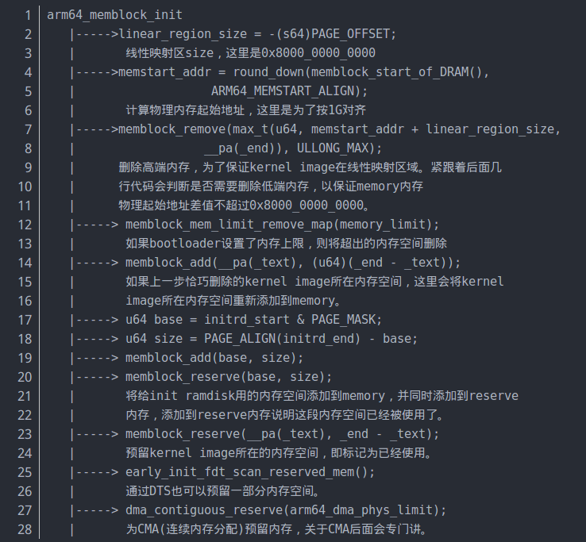

# Linux内核内存管理(八)——内存分配——memblock

## 1. memblock

- 系统初始化的时候`buddy`系统（伙伴系统），`slab`分配器等并没有被初始化，当需要执行一些内存管理、内存分配的任务，就引入了一种内存管理器`bootmem`分配器。

- 当`buddy`系统和`slab`分配器初始化结束后，在`mem_init()`中对`bootmem`分配器进行释放，内存管理与分配由`buddy`系统，`slab`分配器等进行接管。

- 而`memblock`是用来替代`bootmem`的新接口。`memblock`用于开机阶段的内存管理。
- 内存中的某些部分是永久的分配给内核的，比如内核代码段和数据段，`ramdisk`和`fdt`占用的空间等。它们是系统内存的一部分，但是不能被侵占，也不参与内存分配，称之为静态内存；还有，`GPU`、`Camera`等都需要预留大量连续内存，这部分内存平时不用，但是系统必须提前预留好，称之为预留内存；最后，内存的其余部分称之为动态内存，是需要内存管理的宝贵资源。
- 在开机阶段内存以内存区块来管理，`memblock`把物理内存划分为若干内存区块，内存区块由结构体`struct memblock_region`来描述，`Memblock`中有两种内存类型, `memory`和`reserved`，`memory`用于记录总的内存资源，`reserved`用于记录已经使用或者预留的内存资源。


## 2. memblock 相关数据结构

> `memblock`结构体

```c
[linux-4.14/include/linux/memblock.h]
struct memblock {
	bool bottom_up;  // 表示分配器分配内存的方式 true:从低地址向高地址分配  false:相反就是从高地址向低地址分配内存
	phys_addr_t current_limit; // 可以使用的内存的上限
	struct memblock_type memory; // 可分配内存的集合，申请内存时，会从这些集合中分配内存
	struct memblock_type reserved; // 已分配内存（包括预留内存）的集合，分配出去的内存会放在这个集合里面管理
#ifdef CONFIG_HAVE_MEMBLOCK_PHYS_MAP
	struct memblock_type physmem; // 物理内存的集合
#endif
};

```

> `memblock_type`结构体

```c
[linux-4.14/include/linux/memblock.h]
struct memblock_type {
	unsigned long cnt;	/* number of regions 当前管理的集合中记录的内存区域个数 */
	unsigned long max;	/* size of the allocated array 当前管理的集合中可记录的内存区域的最大个数，最大值是INIT_PHYSMEM_REGIONS */
	phys_addr_t total_size;	/* size of all regions 集合记录的内存总和 */
	struct memblock_region *regions; // 执行内存区域结构（memblock_region）的指针
	char *name;
};

```

> `memblock_region`结构体描述了内存区域

```c
[linux-4.14/include/linux/memblock.h]
#define INIT_MEMBLOCK_REGIONS	128 /* 数组最大容纳128个区块，如果超过这个限制将重新分配一个区块管理数组，并且是原来的两倍大小 */

struct memblock_region { // 描述一个内存区域
	phys_addr_t base; // 内存区域的起始地址，是物理地址
	phys_addr_t size; // 内存区域大小，单位是字节
	unsigned long flags; // 该内存区域的标识，例如MEMBLOCK_NOMAP，在做映射的时候不要映射到内核中
#ifdef CONFIG_HAVE_MEMBLOCK_NODE_MAP
	int nid; // 节点号，CPU被划分为多个节点(node)，每个node 有对应的内存簇bank，一个标识
#endif
};


```

> 结构体`memblock`、`memblock_type`、`memblock_region`之间的逻辑关系如下图：


> 在`memblock`中，管理内存的数据结构（`struct memblock`）被定义为一个全局的变量，并且赋予了对应的初值。

```c
[linux-4.14/include/linux/memblock.h]
#define INIT_MEMBLOCK_REGIONS	128
#define INIT_PHYSMEM_REGIONS	4
#define MEMBLOCK_ALLOC_ANYWHERE	(~(phys_addr_t)0) //0xffffffff（32位）

[linux-4.14/mm/memblock.c]
/* 对于__init、__initdata和__exit、__exitdata的定义位于<linux/init.h>,这些宏定义的作用是告诉编译器
 * 将这些函数或者数据放入相应的section中，而在模块加载的阶段.ko文件中的代码和数据的加载区域是根据section
 * 来加载的。之所以要使用这个宏定义，其中一个原因是标记为初始化的函数和数据,表明该函数和数据仅在初始化期间使
 * 用。在模块装载之后，模块装载就会将初始化函数扔掉。这样可以将该函数占用的内存释放出来。 
 */
static struct memblock_region memblock_memory_init_regions[INIT_MEMBLOCK_REGIONS] __initdata_memblock;
static struct memblock_region memblock_reserved_init_regions[INIT_MEMBLOCK_REGIONS] __initdata_memblock;
#ifdef CONFIG_HAVE_MEMBLOCK_PHYS_MAP
static struct memblock_region memblock_physmem_init_regions[INIT_PHYSMEM_REGIONS] __initdata_memblock;
#endif

struct memblock memblock __initdata_memblock = {
	.memory.regions		= memblock_memory_init_regions,
	.memory.cnt		= 1,	/* empty dummy entry 表示内存块数量，还没有插入内存块时设置为1*/
	.memory.max		= INIT_MEMBLOCK_REGIONS, /* 数组最大容纳区块数 */
	.memory.name		= "memory", /* 内存数组名 */

	.reserved.regions	= memblock_reserved_init_regions,
	.reserved.cnt		= 1,	/* empty dummy entry */
	.reserved.max		= INIT_MEMBLOCK_REGIONS,
	.reserved.name		= "reserved",

#ifdef CONFIG_HAVE_MEMBLOCK_PHYS_MAP
	.physmem.regions	= memblock_physmem_init_regions,
	.physmem.cnt		= 1,	/* empty dummy entry */
	.physmem.max		= INIT_PHYSMEM_REGIONS,
	.physmem.name		= "physmem",
#endif

	.bottom_up		= false, //内存分配方式是从高地址往低地址分配
	.current_limit		= MEMBLOCK_ALLOC_ANYWHERE,
};
```

`memblock.memory.regions` 指向 `memblock_memory_init_regions` 数组，数组大小是128，`memblock.reserved.regions` 指向`memblock_reserved_init_regions` 数组，数组大小是128，`memblock.physmem.regions` 指向 `memblock_physmem_init_regions` 数组，数组大小是4。`memblock` 初始化后如下图：


## 3. `memblock`主要函数

### 3.1 `memblock_add`

- `memblock_add()`函数用于添加region到`memblock.memory`中，`memblock_add()`函数，其定义和解析如下：

```c
[linux-4.14/mm/memblock.c]
/* base: 物理内存的起始地址
 * size: 物理内存的大小
 * base,size表示出物理内存区间，第一次调用memblock_add（）函数时，<base, size>    * = <0x6000 0000,
 * 0x4000 0000>
 */
int __init_memblock memblock_add(phys_addr_t base, phys_addr_t size)
{
	phys_addr_t end = base + size - 1;

	memblock_dbg("memblock_add: [%pa-%pa] %pF\n",
		     &base, &end, (void *)_RET_IP_);
	/* 调用memblock_add_range(),
     * memblock.memory: memblock 即上面介绍的全局变量，memblock.memory就是可用内存集合。
     */
	return memblock_add_range(&memblock.memory, base, size, MAX_NUMNODES, 0);
}

/**
 * memblock_merge_regions - merge neighboring compatible regions
 * @type: memblock type to scan
 *
 * Scan @type and merge neighboring compatible regions.
 */
static void __init_memblock memblock_merge_regions(struct memblock_type *type)
{
	int i = 0;

	/* cnt never goes below 1 */
	while (i < type->cnt - 1) {
		struct memblock_region *this = &type->regions[i];
		struct memblock_region *next = &type->regions[i + 1];

		if (this->base + this->size != next->base || //前一个内存区域的结尾地址不等于下一个内存区域的起始地址
		    memblock_get_region_node(this) !=
		    memblock_get_region_node(next) || //两个内存区域不是同一个node
		    this->flags != next->flags) { //两个内存区域的标志不一样
			BUG_ON(this->base + this->size > next->base);
			i++;
			continue;
		}
 
 		this->size += next->size; //如果两个内存区域相连，则进行合并
 		/* move forward from next + 1, index of which is i + 2 */
 		memmove(next, next + 1, (type->cnt - (i + 2)) * sizeof(*next)); //后面部分往前挪一个位置
 		type->cnt--; //内存区域计数减1
 	}
}
  
/**
 * memblock_insert_region - insert new memblock region
 * @type:	memblock type to insert into
 * @idx:	index for the insertion point
 * @base:	base address of the new region
 * @size:	size of the new region
 * @nid:	node id of the new region
 * @flags:	flags of the new region
 *
 * Insert new memblock region [@base,@base+@size) into @type at @idx.
 * @type must already have extra room to accommodate the new region.
 */
/**
 * memblock_insert_region()的实现很简单，就是把idx 位置后面的数据往后挪一个位置，然后把要添加
 * 的内存区域信息保存在idx对应的数据结构中
 */
static void __init_memblock memblock_insert_region(struct memblock_type *type,
						   int idx, phys_addr_t base,
						   phys_addr_t size,
						   int nid, unsigned long flags)
{
	struct memblock_region *rgn = &type->regions[idx];

	BUG_ON(type->cnt >= type->max);
	/**
	 * 把插入位置后的内存区域都往后面挪一个位置，memmove（）函数可自行查看源码，比较简单，功能就是
	 * 实现逐字节拷贝。
	 */
 	memmove(rgn + 1, rgn, (type->cnt - idx) * sizeof(*rgn));
  	rgn->base = base;//上面挪完之后，将加入的内存区域插入当前位置
  	rgn->size = size;
  	rgn->flags = flags;
  	memblock_set_region_node(rgn, nid);
  	type->cnt++;//新加的内存区域个数加1
  	type->total_size += size;//总的内存大小累加
}
  
/**
 * memblock_add_range - add new memblock region
 * @type: memblock type to add new region into
 * @base: base address of the new region
 * @size: size of the new region
 * @nid: nid of the new region
 * @flags: flags of the new region
 *
 * Add new memblock region [@base,@base+@size) into @type.  The new region
 * is allowed to overlap with existing ones - overlaps don't affect already
 * existing regions.  @type is guaranteed to be minimal (all neighbouring
 * compatible regions are merged) after the addition.
 *
 * RETURNS:
 * 0 on success, -errno on failure.
 */
int __init_memblock memblock_add_range(struct memblock_type *type,
				phys_addr_t base, phys_addr_t size,
				int nid, unsigned long flags)
{
	bool insert = false;
	phys_addr_t obase = base;
	phys_addr_t end = base + memblock_cap_size(base, &size);
	int idx, nr_new;
	struct memblock_region *rgn;

	if (!size)
		return 0;

	/* special case for empty array */
    /* 刚开始还没有空余的memory加入到 memblock 管理的数组中，所以type->regions[0].size == 0
     * 成立，跑完if 里面的代码后就返回了 */
	if (type->regions[0].size == 0) {
		WARN_ON(type->cnt != 1 || type->total_size);
		type->regions[0].base = base;
		type->regions[0].size = size;
		type->regions[0].flags = flags;
		memblock_set_region_node(&type->regions[0], nid);
		type->total_size = size;
		return 0;
	}
    /* 以下代码在第二次调用memblock_add（）函数时才会执行, 因为第二次调用memblock_add（）函数时，
     * type->regions[0].size ！= 0，不再执行上面的if语句 */
    repeat:
	/*
	 * The following is executed twice.  Once with %false @insert and
	 * then with %true.  The first counts the number of regions needed
	 * to accommodate the new area.  The second actually inserts them.
	 */
	base = obase;
	nr_new = 0;

	for_each_memblock_type(type, rgn) {
		phys_addr_t rbase = rgn->base;
		phys_addr_t rend = rbase + rgn->size;

		if (rbase >= end)
			break;
		if (rend <= base)
			continue;
		/*
		 * @rgn overlaps.  If it separates the lower part of new
		 * area, insert that portion.
		 */
		if (rbase > base) {
#ifdef CONFIG_HAVE_MEMBLOCK_NODE_MAP
			WARN_ON(nid != memblock_get_region_node(rgn));
#endif
			WARN_ON(flags != rgn->flags);
			nr_new++;
			if (insert)
				memblock_insert_region(type, idx++, base,
						       rbase - base, nid,
						       flags);
		}
		/* area below @rend is dealt with, forget about it */
		base = min(rend, end);
	}

	/* insert the remaining portion */
	if (base < end) {
		nr_new++;
		if (insert)
			memblock_insert_region(type, idx, base, end - base,
					       nid, flags);
	}

	if (!nr_new)
		return 0;

	/*
	 * If this was the first round, resize array and repeat for actual
	 * insertions; otherwise, merge and return.
	 */
	if (!insert) {
		while (type->cnt + nr_new > type->max)//添加的内存区域超过了最大值128
			if (memblock_double_array(type, obase, size) < 0)//把数组扩大一倍，这种情况我们先不考虑
				return -ENOMEM;
 	    insert = true;
		goto repeat;
    } else {
		memblock_merge_regions(type);
		return 0;
	}
}
  
```

第一次调用`memblock_add()`函数，只执行到 memblock_add_range（）526行，repeat标志位下的代码不再执行，在arm 32位下，没有再去调用`memblock_add()`函数，而在arm 64位下，第一次调用`memblock_add()`函数后，返回到setup_arch() 函数，把dtf 得到的memory base和size信息添加到memblock后，继续执行arm64_memblock_init()，在arm64_memblock_init()函数中，再一次调用了`memblock_add()`函数，此时就会执行repeat标志位下的代码。


### 3.2 memblock_remove

>   `memblock_remove()`函数用于将一个region从memblock.memory中移除，删除内存就是从memory类型的内存中，删除一段内存空间。由于这段内存空间往往是某个或某些region的一部分，所以删除一段内存空间，有可能将一个region拆分成两个region。内存删除规则：

1.  如果删除的内存位于某个region的中间，则该region会首先被拆分成三个region，最后一个中间的region被删除，如下图：
2.  如果删除的内存位于某个region的前半部分或者后半部分，则该region首先被拆分成两个region，后面或者前面的region会被删除，如下图：
3.  如果删除的内存跨越多个region，会按照前两条规则将region拆分，最后删除相应的region，如下图：

-   函数调用关系：`memblock_remove() -> memblock_remove_range() -> memblock_isolate_range() -> memblock_remove_region()`

- `memblock_remove()`函数定义如下，其中`memblock_isolate_range()`函数的作用是把要移除的区域标识出来，`start_rgn`标识了移除区域的起始位置，`end_rgn`是结束位置，最用调用`memblock_remove_region()`函数把这些区域移除，部分函数前面已解析过，其他函数也比较简单，暂不做过多解析：

```c
[linux-4.14/mm/memblock.c]

int __init_memblock memblock_remove(phys_addr_t base, phys_addr_t size)
{
    return memblock_remove_range(&memblock.memory, base, size);
}

static int __init_memblock memblock_remove_range(struct memblock_type *type,
                                                 phys_addr_t base, phys_addr_t size)
{
    int start_rgn, end_rgn;
    int i, ret;

    ret = memblock_isolate_range(type, base, size, &start_rgn, &end_rgn);
    if (ret)
        return ret;

    for (i = end_rgn - 1; i >= start_rgn; i--)
        memblock_remove_region(type, i);
    return 0;
}


/**
  * memblock_isolate_range - isolate given range into disjoint memblocks
  * @type: memblock type to isolate range for
  * @base: base of range to isolate
  * @size: size of range to isolate
  * @start_rgn: out parameter for the start of isolated region
  * @end_rgn: out parameter for the end of isolated region
    *
  * Walk @type and ensure that regions don't cross the boundaries defined by
  * [@base,@base+@size).  Crossing regions are split at the boundaries,
  * which may create at most two more regions.  The index of the first
  * region inside the range is returned in *@start_rgn and end in *@end_rgn.
    *
  * RETURNS:
  * 0 on success, -errno on failure.
  */
static int __init_memblock memblock_isolate_range(struct memblock_type *type,
					phys_addr_t base, phys_addr_t size,
					int *start_rgn, int *end_rgn)
{
	phys_addr_t end = base + memblock_cap_size(base, &size);
	int idx;
	struct memblock_region *rgn;

	*start_rgn = *end_rgn = 0;

	if (!size)
		return 0;

	/* we'll create at most two more regions */
    /* 当删除的内存位于某个region的中间，则该region会首先被拆分成三个region，此时，region个数
     * 会增加2个，下面while检测当region个数增加2后是否越过max值 */
	while (type->cnt + 2 > type->max)
		if (memblock_double_array(type, base, size) < 0)
			return -ENOMEM;

	for_each_memblock_type(type, rgn) {
		phys_addr_t rbase = rgn->base;
		phys_addr_t rend = rbase + rgn->size;

		if (rbase >= end)
			break;
		if (rend <= base)
			continue;
		
		if (rbase < base) {
			/*
			 * @rgn intersects from below.  Split and continue
			 * to process the next region - the new top half.
			 */
			rgn->base = base;
			rgn->size -= base - rbase;
			type->total_size -= base - rbase;
			memblock_insert_region(type, idx, rbase, base - rbase,
					       memblock_get_region_node(rgn),
					       rgn->flags);
		} else if (rend > end) {
			/*
			 * @rgn intersects from above.  Split and redo the
			 * current region - the new bottom half.
			 */
			rgn->base = end;
			rgn->size -= end - rbase;
			type->total_size -= end - rbase;
			memblock_insert_region(type, idx--, rbase, end - rbase,
					       memblock_get_region_node(rgn),
					       rgn->flags);
		} else {
			/* @rgn is fully contained, record it */
			if (!*end_rgn)
				*start_rgn = idx;
			*end_rgn = idx + 1;
		}
	}

	return 0;
}

static void __init_memblock memblock_remove_region(struct memblock_type *type, unsigned long r)
{
	type->total_size -= type->regions[r].size;
	memmove(&type->regions[r], &type->regions[r + 1],
		(type->cnt - (r + 1)) * sizeof(type->regions[r]));
	type->cnt--;

	/* Special case for empty arrays */
	if (type->cnt == 0) {
		WARN_ON(type->total_size != 0);
		type->cnt = 1;
		type->regions[0].base = 0;
		type->regions[0].size = 0;
		type->regions[0].flags = 0;
		memblock_set_region_node(&type->regions[0], MAX_NUMNODES);
	}
}
```


### 3.3 memblock_alloc

- `memblock_alloc()`函数用于分配内存，其内部逻辑分两步：


1.  遍历memory类型内存的region，并从中剔除掉已经分配的内存，已经分配的内存以region的形式存放在rserved类型内存中，从中分配合适的内存。
2.  调用memblock_reserve函数将分配的内存以region的形式存放在rserved类型内存中。

```c
[linux-4.14/include/linux/memblock.h]
/* Definition of memblock flags. */
enum {
	MEMBLOCK_NONE		= 0x0,	/* No special request */
	...
};
#define MEMBLOCK_ALLOC_ACCESSIBLE	0
[linux-4.14/include/linux/numa.h]
#define	NUMA_NO_NODE	(-1)

[linux-4.14/mm/memblock.c]
phys_addr_t __init memblock_alloc(phys_addr_t size, phys_addr_t align)
{
	return memblock_alloc_base(size, align, MEMBLOCK_ALLOC_ACCESSIBLE);
}
/**
 * memblock_alloc 最终调用到 memblock_alloc_range_nid, 中间调用了许多函数，这些函数实际上没有做什么，
 * 只不过多传了一些参数而已，此处就不列出来了
 * start: 0
 * end: MEMBLOCK_ALLOC_ACCESSIBLE // MEMBLOCK_ALLOC_ACCESSIBLE也为0
 * nid: NUMA_NO_NODE // NUMA_NO_NODE 为-1
 * flags: MEMBLOCK_NONE // MEMBLOCK_NONE 为0
 */
static phys_addr_t __init memblock_alloc_range_nid(phys_addr_t size,
					phys_addr_t align, phys_addr_t start,
					phys_addr_t end, int nid, ulong flags)
{
	phys_addr_t found;

	if (!align)
		align = SMP_CACHE_BYTES;

	found = memblock_find_in_range_node(size, align, start, end, nid,
					    flags);
	if (found && !memblock_reserve(found, size)) {
		/*
		 * The min_count is set to 0 so that memblock allocations are
		 * never reported as leaks.
		 */
		kmemleak_alloc_phys(found, size, 0, 0);
		return found;
	}
	return 0;
}


/**
 * memblock_find_in_range_node - find free area in given range and node
 * @size: size of free area to find
 * @align: alignment of free area to find
 * @start: start of candidate range
 * @end: end of candidate range, can be %MEMBLOCK_ALLOC_{ANYWHERE|ACCESSIBLE}
 * @nid: nid of the free area to find, %NUMA_NO_NODE for any node
 * @flags: pick from blocks based on memory attributes
 *
 * Find @size free area aligned to @align in the specified range and node.
 *
 * When allocation direction is bottom-up, the @start should be greater
 * than the end of the kernel image. Otherwise, it will be trimmed. The
 * reason is that we want the bottom-up allocation just near the kernel
 * image so it is highly likely that the allocated memory and the kernel
 * will reside in the same node.
 *
 * If bottom-up allocation failed, will try to allocate memory top-down.
 *
 * RETURNS:
 * Found address on success, 0 on failure.
 */
phys_addr_t __init_memblock memblock_find_in_range_node(phys_addr_t size,
					phys_addr_t align, phys_addr_t start,
					phys_addr_t end, int nid, ulong flags)
{
	phys_addr_t kernel_end, ret;

	/* pump up @end */
	if (end == MEMBLOCK_ALLOC_ACCESSIBLE)
		end = memblock.current_limit;

	/* avoid allocating the first page */
	start = max_t(phys_addr_t, start, PAGE_SIZE);
	end = max(start, end);
	kernel_end = __pa_symbol(_end);

	/*
	 * try bottom-up allocation only when bottom-up mode
	 * is set and @end is above the kernel image.
	 */
 /**
  * memblock_bottom_up()函数获取全局变量memblock.bottom_up值，因为memblock.bottom_up为
  * false，即内存分配方式是从高地址向低地址，所以此处不执行if语句内部代码
    */
	if (memblock_bottom_up() && end > kernel_end) {
		phys_addr_t bottom_up_start;

		/* make sure we will allocate above the kernel */
		bottom_up_start = max(start, kernel_end);
	
		/* ok, try bottom-up allocation first */
		ret = __memblock_find_range_bottom_up(bottom_up_start, end,
						      size, align, nid, flags);
		if (ret)
			return ret;
	
		/*
		 * we always limit bottom-up allocation above the kernel,
		 * but top-down allocation doesn't have the limit, so
		 * retrying top-down allocation may succeed when bottom-up
		 * allocation failed.
		 *
		 * bottom-up allocation is expected to be fail very rarely,
		 * so we use WARN_ONCE() here to see the stack trace if
		 * fail happens.
		 */
		WARN_ONCE(1, "memblock: bottom-up allocation failed, memory hotunplug may be affected\n");
	}

	return __memblock_find_range_top_down(start, end, size, align, nid,
					      flags);
}


/**
 * __memblock_find_range_top_down - find free area utility, in top-down
 * @start: start of candidate range
 * @end: end of candidate range, can be %MEMBLOCK_ALLOC_{ANYWHERE|ACCESSIBLE}
 * @size: size of free area to find
 * @align: alignment of free area to find
 * @nid: nid of the free area to find, %NUMA_NO_NODE for any node
 * @flags: pick from blocks based on memory attributes
 *
 * Utility called from memblock_find_in_range_node(), find free area top-down.
 *
 * RETURNS:
 * Found address on success, 0 on failure.
 */
static phys_addr_t __init_memblock
__memblock_find_range_top_down(phys_addr_t start, phys_addr_t end,
			       phys_addr_t size, phys_addr_t align, int nid,
			       ulong flags)
{
	phys_addr_t this_start, this_end, cand;
	u64 i;

	for_each_free_mem_range_reverse(i, nid, flags, &this_start, &this_end,
					NULL) {	//遍历memory.regions 和 reserved.regions
		this_start = clamp(this_start, start, end); //在允许申请的地址范围 取值 , 可以认为就返回了this_start
		this_end = clamp(this_end, start, end); //在允许申请的地址范围 取值 。 可以认为就返回了this_end

		if (this_end < size) //可分配内存区域小于要申请的内存大小，继续查找下一个可分配内存区域
			continue;
	
		cand = round_down(this_end - size, align); //这里可以直接看作是 cand = this -end  ，因为内存分配方式是从高到低
		if (cand >= this_start) //cand 肯定要在this_start 到this_end 之前才行呀 cand |<--size -->|
			return cand;  //this_start|------- ... ------| this_end
	}

	return 0;
}
```

上面`for_each_free_mem_range_reverse`为一个for循环的宏， 内部调用了`__next_mem_range_rev()`函数，如下：

```c
[linux-4.14/include/linux/memblock.h]
/**
 * for_each_free_mem_range_reverse - rev-iterate through free memblock areas
 * @i: u64 used as loop variable
 * @nid: node selector, %NUMA_NO_NODE for all nodes
 * @flags: pick from blocks based on memory attributes
 * @p_start: ptr to phys_addr_t for start address of the range, can be %NULL
 * @p_end: ptr to phys_addr_t for end address of the range, can be %NULL
 * @p_nid: ptr to int for nid of the range, can be %NULL
 *
 * Walks over free (memory && !reserved) areas of memblock in reverse
 * order.  Available as soon as memblock is initialized.
 */
#define for_each_free_mem_range_reverse(i, nid, flags, p_start, p_end,	\
					p_nid)				\
	for_each_mem_range_rev(i, &memblock.memory, &memblock.reserved,	\
			       nid, flags, p_start, p_end, p_nid)

/**
 * for_each_mem_range_rev - reverse iterate through memblock areas from
 * type_a and not included in type_b. Or just type_a if type_b is NULL.
 * @i: u64 used as loop variable
 * @type_a: ptr to memblock_type to iterate
 * @type_b: ptr to memblock_type which excludes from the iteration
 * @nid: node selector, %NUMA_NO_NODE for all nodes
 * @flags: pick from blocks based on memory attributes
 * @p_start: ptr to phys_addr_t for start address of the range, can be %NULL
 * @p_end: ptr to phys_addr_t for end address of the range, can be %NULL
 * @p_nid: ptr to int for nid of the range, can be %NULL
 */
#define for_each_mem_range_rev(i, type_a, type_b, nid, flags,		\
			       p_start, p_end, p_nid)			\
	for (i = (u64)ULLONG_MAX,					\
		     __next_mem_range_rev(&i, nid, flags, type_a, type_b,\
					  p_start, p_end, p_nid);	\
	     i != (u64)ULLONG_MAX;					\
	     __next_mem_range_rev(&i, nid, flags, type_a, type_b,	\
				  p_start, p_end, p_nid))

[linux-4.14/mm/memblock.c]

/**
 * __next_mem_range_rev - generic next function for for_each_*_range_rev()
 *
 * Finds the next range from type_a which is not marked as unsuitable
 * in type_b.
 *
 * @idx: pointer to u64 loop variable
 * @nid: node selector, %NUMA_NO_NODE for all nodes
 * @flags: pick from blocks based on memory attributes
 * @type_a: pointer to memblock_type from where the range is taken
 * @type_b: pointer to memblock_type which excludes memory from being taken
 * @out_start: ptr to phys_addr_t for start address of the range, can be %NULL
 * @out_end: ptr to phys_addr_t for end address of the range, can be %NULL
 * @out_nid: ptr to int for nid of the range, can be %NULL
 *
 * Reverse of __next_mem_range().
 */
/**
 * idx: 147行中的 &i
 * type_a: 236行 &memblock.memory
 * type_b: 236行 &memblock.reserved
 * __next_mem_range_rev() 函数就是在遍历memblock.memory、memblock.reserved，寻找一块空	   
 * 间（[out_start, out_end]），这块空间存在于memblock.memory包含的region中，但不在
 * memblock.reserved包含的region中。
 */
void __init_memblock __next_mem_range_rev(u64 *idx, int nid, ulong flags,
					  struct memblock_type *type_a,
					  struct memblock_type *type_b,
					  phys_addr_t *out_start,
					  phys_addr_t *out_end, int *out_nid)
{
	int idx_a = *idx & 0xffffffff; //idx_a idx_b分别保存在idx的低32位和高32位
	int idx_b = *idx >> 32;

	if (WARN_ONCE(nid == MAX_NUMNODES, "Usage of MAX_NUMNODES is deprecated. Use NUMA_NO_NODE instead\n"))
		nid = NUMA_NO_NODE;

	if (*idx == (u64)ULLONG_MAX) { //初始遍历mem_range，idx赋值为ULONG_MAX
		idx_a = type_a->cnt - 1; //获得type_a和type_b的index
		if (type_b != NULL)
			idx_b = type_b->cnt;
		else
			idx_b = 0;
	}

	for (; idx_a >= 0; idx_a--) { //遍历type_a中的memblock_type,找出不在type_b中的空间
 		struct memblock_region *m = &type_a->regions[idx_a];
 
 		phys_addr_t m_start = m->base;
 		phys_addr_t m_end = m->base + m->size;
 		int m_nid = memblock_get_region_node(m);
 
 		/* only memory regions are associated with nodes, check it */
 		if (nid != NUMA_NO_NODE && nid != m_nid)
 			continue;
 
 		/* skip hotpluggable memory regions if needed */
 		if (movable_node_is_enabled() && memblock_is_hotpluggable(m))
 			continue;
 
 		/* if we want mirror memory skip non-mirror memory regions */
 		if ((flags & MEMBLOCK_MIRROR) && !memblock_is_mirror(m))
 			continue;
 
 		/* skip nomap memory unless we were asked for it explicitly */
 		if (!(flags & MEMBLOCK_NOMAP) && memblock_is_nomap(m))
 			continue;
 
 		if (!type_b) { //如果没有定义type_b,则直接返回找到的type_a的start和end
 			if (out_start)
 				*out_start = m_start;
 			if (out_end)
 				*out_end = m_end;
 			if (out_nid)
 				*out_nid = m_nid;
 			idx_a--;
 			*idx = (u32)idx_a | (u64)idx_b << 32;
 			return;
 		}
 
 		/* scan areas before each reservation */
 		for (; idx_b >= 0; idx_b--) { //找reservation之前的区域
 			struct memblock_region *r;
 			phys_addr_t r_start;
 			phys_addr_t r_end;
 
 		//r_start和r_end记录memblock.reserved相邻两个内存区域(regions)的空闲区域
 		//       r_start|          |r_end
 		//    |---...---|          |---...---|   
 		//  regions[idx_b-1]      regions[idx_b]
 			r = &type_b->regions[idx_b];
 			r_start = idx_b ? r[-1].base + r[-1].size : 0; //找到不在type_b中的区域，这段区域与type_a中重叠的区域可以拿出来分配
 			r_end = idx_b < type_b->cnt ?
 				r->base : ULLONG_MAX;
 			/*
 			 * if idx_b advanced past idx_a,
 			 * break out to advance idx_a
 			 */
 
 			if (r_end <= m_start) //如果找到的type_a起始地址m_start大于r_end，那说明type_a 区域都在type_b之上，应break出来，遍历下一个type_a
 				break;
 			/* if the two regions intersect, we're done */
 			if (m_end > r_start) { //如果两个区域有重叠，则取出重叠区域
 				if (out_start)
 					*out_start = max(m_start, r_start);//out_start 比较memblock.memory 区域和空闲区域重叠的起始地址
 				if (out_end)
 					*out_end = min(m_end, r_end);//out_end 比较memblock.memory 区域和空闲区域重叠的结尾地址
 				if (out_nid)
 					*out_nid = m_nid;
 				if (m_start >= r_start)
 					idx_a--;
 				else
 					idx_b--;
 				*idx = (u32)idx_a | (u64)idx_b << 32;
 				return;
 			}
 		}
 	}
 	/* signal end of iteration */
 	*idx = ULLONG_MAX;
}
```

回到`memblock_alloc_range_nid()`函数中：

```c
[linux-4.14/mm/memblock.c]
/* memblock_alloc 最终调用到 memblock_alloc_range_nid, 中间调用了许多函数，这些函数实际上没有做什么，只不过多传了一些参数而已，此处就不列出来了
start: 0
end: MEMBLOCK_ALLOC_ACCESSIBLE // MEMBLOCK_ALLOC_ACCESSIBLE也为0
nid: NUMA_NO_NODE // NUMA_NO_NODE 为-1
flags: MEMBLOCK_NONE // MEMBLOCK_NONE 为0
*/
static phys_addr_t __init memblock_alloc_range_nid(phys_addr_t size,
                                                   phys_addr_t align, phys_addr_t start,
                                                   phys_addr_t end, int nid, ulong flags)
{
    phys_addr_t found;

    if (!align)
        align = SMP_CACHE_BYTES;

    found = memblock_find_in_range_node(size, align, start, end, nid,
                                        flags);
    /**
	 * 当找到可分配的空间后（found不为空），memblock_reserve将这段空间（会以region的形式）添
	 * 加到memblock.reserved中，这样当再需要分配空间时，已分配的空间便不能再分配出去。
	 */
    if (found && !memblock_reserve(found, size)) {
        /*
  		 * The min_count is set to 0 so that memblock allocations are
  		 * never reported as leaks.
  		 */
        kmemleak_alloc_phys(found, size, 0, 0);
        return found;
    }
    return 0;
}
```

### 3.4 memblock_reserve，memblock_free

- `memblock_reserve()`函数将region添加到memblock.reserved，由其定义可知，其功能主要通过调用`memblock_add_range()`函数来实现，而该函数我们在 `3.1 memblock_add`章节中已经解析过，此处不再赘述：

```c
[linux-4.14/mm/memblock.c]
int __init_memblock memblock_reserve(phys_addr_t base, phys_addr_t size)
{
	phys_addr_t end = base + size - 1;

	memblock_dbg("memblock_reserve: [%pa-%pa] %pF\n",
		     &base, &end, (void *)_RET_IP_);

	return memblock_add_range(&memblock.reserved, base, size, MAX_NUMNODES, 0);
}

```

- `memblock_free()`函数用于将一个region从memblock.reserved中移除，由其定义可知，其功能主要通过调用`memblock_remove_range()`函数来实现，该函数我们在 3.2 memblock_remove 章节中已经解析过，此处不再赘述：

```c
[linux-4.14/mm/memblock.c]
int __init_memblock memblock_free(phys_addr_t base, phys_addr_t size)
{
	phys_addr_t end = base + size - 1;

	memblock_dbg("   memblock_free: [%pa-%pa] %pF\n",
		     &base, &end, (void *)_RET_IP_);

	kmemleak_free_part_phys(base, size);
	return memblock_remove_range(&memblock.reserved, base, size);
}
```


## 4. memblock 初始化流程

### 4.1 添加memory类型内存

- 系统初始化阶段，所有的内存资源，都会添加到memory类型内存中。我们在《设备树》章节中有讲到，设备树本身就是描述硬件资源信息的，理所当然，内存资源信息也应该挂在设备树上，即Linux中的内存资源信息，是以设备树的形式来告知内核。对于Linux内核如何从设备树上获取内存资源信息，《内存解析》章节有详细介绍，接下来我们基于《内存解析》章节着重分析一下，内核获取到内存资源信息后，以什么样的形式保存内存资源信息。
- 函数调用关系：`start_kernel() -> setup_arch() -> setup_machine_fdt() -> early_init_dt_scan_nodes() -> early_init_dt_scan_memory() -> early_init_dt_add_memory_arch() -> memblock_add()`
- 我们从`early_init_dt_add_memory_arch()`函数开始解析，其上层的函数调用流程在《内存解析》章节中已有详细解析，此处不再赘述。`early_init_dt_add_memory_arch()`函数定义及解析如下：

```c
[linux-4.14/drivers/of/fdt.c]

#ifdef CONFIG_HAVE_MEMBLOCK
#ifndef MIN_MEMBLOCK_ADDR
#define MIN_MEMBLOCK_ADDR	__pa(PAGE_OFFSET)
#endif
#ifndef MAX_MEMBLOCK_ADDR
#define MAX_MEMBLOCK_ADDR	((phys_addr_t)~0)
#endif
/*
	base: 设备树内存节点中的起始地址值；
 	size: 该内存节点中包含内存的大小。
 	arm32 内存节点中reg属性一般格式：reg = <0x60000000 0x40000000>;对应 base=0x60000000，size=0x40000000
*/
void __init __weak early_init_dt_add_memory_arch(u64 base, u64 size)
{
	const u64 phys_offset = MIN_MEMBLOCK_ADDR;/* 获取内核起始地址（PAGE_OFFSET）对应的物理地址 */

	if (!PAGE_ALIGNED(base)) { /* 检查 base 是否页对齐 */
		if (size < PAGE_SIZE - (base & ~PAGE_MASK)) {
			pr_warn("Ignoring memory block 0x%llx - 0x%llx\n",
				base, base + size);
			return;
		}
		size -= PAGE_SIZE - (base & ~PAGE_MASK);
		base = PAGE_ALIGN(base);
	}
	size &= PAGE_MASK;

	if (base > MAX_MEMBLOCK_ADDR) {
		pr_warning("Ignoring memory block 0x%llx - 0x%llx\n",
				base, base + size);
		return;
	}

	if (base + size - 1 > MAX_MEMBLOCK_ADDR) {
		pr_warning("Ignoring memory range 0x%llx - 0x%llx\n",
				((u64)MAX_MEMBLOCK_ADDR) + 1, base + size);
		size = MAX_MEMBLOCK_ADDR - base + 1;
	}

	if (base + size < phys_offset) {
		pr_warning("Ignoring memory block 0x%llx - 0x%llx\n",
			   base, base + size);
		return;
	}
	if (base < phys_offset) {
		pr_warning("Ignoring memory range 0x%llx - 0x%llx\n",
			   base, phys_offset);
		size -= phys_offset - base;
		base = phys_offset;
	}
	memblock_add(base, size);
}

```

- `early_init_dt_add_memory_arch()`函数最终调用memblock_add将dts指定的内存range以region的形式存入memory类型内存中。

### 4.2 memblock模块初始化

>   memblock模块初始化主要实现在函数 `arm(64)_memblock_init` 内，初始化主要是为了界定memblock管理的物理内存的上下限，以及预留一些有特殊作用的物理内存。

1.  物理内存起始地址: Memory类型内存中，第一个region的起始地址。
2.  物理内存结束地址: Memory类型内存中，最后一个region的结束地址。

我们先来分析 arm64_memblock_init() 函数

#### 4.2.1 arm64_memblock_init

- 对于48bit寻址范围来说，arm64内核虚拟地址范围是0xffff_0000_0000_0000-0xffff_ffff_ffff_ffff，其中0xffff_8000_0000_0000-0xffff_ffff_ffff_ffff这段空间属于线性映射空间，memblock管理的物理地址，必须能够线性映射到0xffff_8000_0000_0000-0xffff_ffff_ffff_ffff范围，所以memblock管理物理内存上限与下限的差值不能超过0x0000_8000_0000_0000。

- 以下两种情况需要特别说明：

1.  物理内存结束地址与起始地址差值超过线性映射范围，此时kernel选择删除低端内存，保留高端内存。
2.  kernel image在高端内存，并且超出了线性映射范围，此时kernel选择增加高端内存，删除低端内存。

- `arm64_memblock_init()`函数内部调用流程

  

- `arm64_memblock_init()`函数解析

```c
  [linux-4.14/arch/arm64/mm/init.c]
  void __init arm64_memblock_init(void)
  {
  	const s64 linear_region_size = -(s64)PAGE_OFFSET; //线性映射区size：0x8000 0000 0000
  
  	/* Handle linux,usable-memory-range property */
   	/* 处理设备树中`linux,usable-memory-range`属性，将其标识的memory range从memblock中移除  */
  	fdt_enforce_memory_region();
  
  	/*
  	 * Ensure that the linear region takes up exactly half of the kernel
  	 * virtual address space. This way, we can distinguish a linear address
  	 * from a kernel/module/vmalloc address by testing a single bit.
  	 */
  	BUILD_BUG_ON(linear_region_size != BIT(VA_BITS - 1));
  
  	/*
  	 * Select a suitable value for the base of physical memory.
  	 */
   	/* memblock_start_of_DRAM()获取memblock.memory.regions[0].base，以
 	 * memblock.memory.regions[0].base值向下对齐
 	 * ARM64_MEMSTART_ALIGN，并赋值给memstart_addr，简单些，就是计算物理起始地址，并按照
 	 * ARM64_MEMSTART_ALIGN对齐。
     */

    	memstart_addr = round_down(memblock_start_of_DRAM(),
    				   ARM64_MEMSTART_ALIGN);

  	/*
  	 * Remove the memory that we will not be able to cover with the
     * linear mapping. Take care not to clip the kernel which may be
     * high in memory.
     * memblock_remove删除高端内存，为了保证kernel image在线性映射区域。紧跟着后面几
     * 行代码会判断是否需要删除低端内存，以保证memory内存物理起始地址差值不超过
     * 0x8000_0000_0000。
     */
      memblock_remove(max_t(u64, memstart_addr + linear_region_size,
                            __pa_symbol(_end)), ULLONG_MAX);
      if (memstart_addr + linear_region_size < memblock_end_of_DRAM()) {
          /* ensure that memstart_addr remains sufficiently aligned */
          memstart_addr = round_up(memblock_end_of_DRAM() - linear_region_size,
                                   ARM64_MEMSTART_ALIGN);
          memblock_remove(0, memstart_addr);
      }

  	/*
  	 * Apply the memory limit if it was set. Since the kernel may be loaded
     * high up in memory, add back the kernel region that must be accessible
     * via the linear mapping.
     * memblock_mem_limit_remove_map(): 如果bootloader设置了内存上限，则将超出的内存空间删除
     * memblock_add(): 如果上一步恰巧删除的kernel image所在内存空间，这里会将kernel image所
     * 在内存空间重新添加到memory
     */
      if (memory_limit != (phys_addr_t)ULLONG_MAX) {
          memblock_mem_limit_remove_map(memory_limit);
          memblock_add(__pa_symbol(_text), (u64)(_end - _text));
      }

   /* 将给init ramdisk用的内存空间([initrd_start ~ initrd_end]，这两个参数是通过设备树获取
    * 到的)添加到memory，
    * 并同时添加到reserve内存，添加到reserve内存说明这段内存空间已经被使用了。
    */
  	if (IS_ENABLED(CONFIG_BLK_DEV_INITRD) && initrd_start) {
  		/*
  		 * Add back the memory we just removed if it results in the
         * initrd to become inaccessible via the linear mapping.
         * Otherwise, this is a no-op
         */
        u64 base = initrd_start & PAGE_MASK;
        u64 size = PAGE_ALIGN(initrd_end) - base;

  		/*
  		 * We can only add back the initrd memory if we don't end up
         * with more memory than we can address via the linear mapping.
         * It is up to the bootloader to position the kernel and the
         * initrd reasonably close to each other (i.e., within 32 GB of
         * each other) so that all granule/#levels combinations can
         * always access both.
         */
        if (WARN(base < memblock_start_of_DRAM() ||
                 base + size > memblock_start_of_DRAM() +
                 linear_region_size,
                 "initrd not fully accessible via the linear mapping -- please check your bootloader ...\n")) {
            initrd_start = 0;
        } else {
            memblock_remove(base, size); /* clear MEMBLOCK_ flags */
            memblock_add(base, size);
            memblock_reserve(base, size);
        }
    }

 	/* CONFIG_RANDOMIZE_BASE 未定义 */
  	if (IS_ENABLED(CONFIG_RANDOMIZE_BASE)) {
  		extern u16 memstart_offset_seed;
  		u64 range = linear_region_size -
  			    (memblock_end_of_DRAM() - memblock_start_of_DRAM());

  		/*
  		 * If the size of the linear region exceeds, by a sufficient
         * margin, the size of the region that the available physical
         * memory spans, randomize the linear region as well.
         */
        if (memstart_offset_seed > 0 && range >= ARM64_MEMSTART_ALIGN) {
            range /= ARM64_MEMSTART_ALIGN;
            memstart_addr -= ARM64_MEMSTART_ALIGN *
                ((range * memstart_offset_seed) >> 16);
        }
    }

  	/*
  	 * Register the kernel text, kernel data, initrd, and initial
     * pagetables with memblock.
     */
      memblock_reserve(__pa_symbol(_text), _end - _text); // 预留kernel image所在的内存空间，即标记为已经使用
      #ifdef CONFIG_BLK_DEV_INITRD
      	if (initrd_start) {
      		memblock_reserve(initrd_start, initrd_end - initrd_start);

  		/* the generic initrd code expects virtual addresses */
  		initrd_start = __phys_to_virt(initrd_start);
  		initrd_end = __phys_to_virt(initrd_end);
  	}
  #endif

  	early_init_fdt_scan_reserved_mem(); // 获取dts中“reserved-memory”属性的内存空间，并在memblock中预留这部分内存空间

  	/* 4GB maximum for 32-bit only capable devices */
  	if (IS_ENABLED(CONFIG_ZONE_DMA))
  		arm64_dma_phys_limit = max_zone_dma_phys();
  	else
  		arm64_dma_phys_limit = PHYS_MASK + 1;

  	reserve_crashkernel();

  	reserve_elfcorehdr();

  	high_memory = __va(memblock_end_of_DRAM() - 1) + 1;

  	dma_contiguous_reserve(arm64_dma_phys_limit); // 为CMA(连续内存分配)预留内存

  	memblock_allow_resize(); // 将memblock_can_resize置位
  }
```


#### 4.2.2 arm_memblock_init

- `arm_memblock_init()`函数逻辑相比于64位较简单，其定义及解析如下：

```c
[linux-4.14/arch/arm/mm/init.c]
void __init arm_memblock_init(const struct machine_desc *mdesc)
{
	/* Register the kernel text, kernel data and initrd with memblock. */
	memblock_reserve(__pa(KERNEL_START), KERNEL_END - KERNEL_START); // 预留kernel image内存空间

	arm_initrd_init(); // 添加init ramdisk用的内存空间

	arm_mm_memblock_reserve(); // 预留page tables用的内存空间

	/* reserve any platform specific memblock areas */
	if (mdesc->reserve) // 预留平台指定的 memblock 区域
		mdesc->reserve();

	early_init_fdt_reserve_self(); // 预留供FDT blob使用的memory
	early_init_fdt_scan_reserved_mem(); // 获取dts中“reserved-memory”属性的内存空间，并在memblock中预留这部分内存空间

	/* reserve memory for DMA contiguous allocations */
	dma_contiguous_reserve(arm_dma_limit); // 为CMA(连续内存分配)预留内存

	arm_memblock_steal_permitted = false;
	memblock_dump_all(); // 供memblock debug使用
}
```