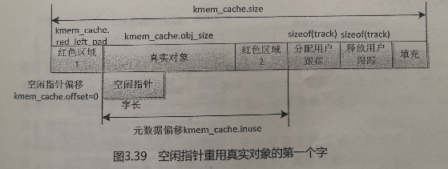

# Linux内核内存管理(十一)——块分配器

## 1 概述

### 1.1 为什么要使用块分配器

- 内核在运行时，经常需要在内核空间3G~3G+high_memory这个内存空间申请动态内存，以存放一些结构类型的数据。例如，在创建一个程序时，它就要为该程序控制块task_struct申请一段内存空间；在撤销这个程序时，又要释放这个空间。在内核中，由于这种结构体类型数据的数量相当大，而数据所占的内存空间又不可能刚好是一个或多个页框，所以在以页框为最小分配单位的分配方法里，这种数据产生的碎片就相当多，内存空间浪费比较惊人。
- 于是，这就促使人们在不破坏页管理机制的条件下，考虑更小的内存分配粒度。所以自从Linux2.2开始，设计者在Linux系统中采用了一个叫做slab的小对象分配模式。

- 外部碎片：什么是外部碎片呢？我们通过一个图来解释：

  假设这是一段连续的页框，阴影部分表示已经被使用的页框，现在需要申请一个连续的5个页框。这个时候，在这段内存上不能找到连续的5个空闲的页框，就会去另一段内存上去寻找5个连续的页框，这样子，久而久之就形成了页框的浪费。称为外部碎片。内核中使用伙伴算法的迁移机制(我们在后续章节中会介绍这种机制)很好的解决了这种外部碎片。

- 内部碎片：当我们申请几十个字节的时候，内核也是给我们分配一个页，这样在每个页中就形成了很大的浪费。称之为内部碎片。内核中引入了slab机制去尽力的减少这种内部碎片。

- 伙伴系统分配内存时是以`page`为单位的，而在实际中有很多内存需求是以`Byte`为单位的，为了解决小块内存的分配问题，Linux内核提供了块分配器，最早实现的块分配器就是`slab`分配器。

### 1.2 缓冲区和slab的概念

- slab模式是20世纪90年代提出的一个为小数据分配内存空间的方法。**在设计slab模式时，人们看到：内核的这些小数据虽然量很大，但是种类并不多，于是就提出了这样一个思想：把若干的页框合在一起形成一大存储块——slab，并在这个slab中只存储同一类数据，这样就可以在这个slab内部打破页的界限，以该类型数据的大小来定义分配粒度，存放多个数据，这样就可以尽可能地减少页内碎片了。在Linux中，多个存储同类数据的slab的集合叫做一类对象的缓冲区——cache。注意，这不是硬件的那个cache，只是借用这个名词而已。**
- 采用slab模式的另一个考虑就是：**一些内核数据不但需要为其分配内存，而且还经常需要对它们进行一些比较费时的初始化操作。这样，当这些数据在内核运行时频繁地创建和撤销，就消耗了大量的CPU时间。而slab模式恰好就能解决这个问题。**
- **slab分配机制：slab分配器是基于对象进行管理的，所谓的对象就是内核中的数据结构（例如：task_struct、file_struct
  等）。相同类型的对象归为一类，每当要申请这样一个对象时，slab分配器就从一个slab列表中分配一个这样大小的单元出去，而当要释放时，将其重新保存在该列表中，而不是直接返回给伙伴系统，从而避免外部碎片。**

- `slab`分配器的作用不仅仅是分配小块内存，更重要的作用是针对经常分配和释放的对象充当缓存，`slab`分配器的核心思想是：为每种对象类型创建一个内存缓存（更通俗的讲就是对象缓冲区），每个内存缓存由多个大块（`slab`，原意是大块的混凝土）组成，一个大块是一个或多个连续的物理页，每个大块包含多个对象。`slab`采用了面向对象的思想，基于对象类型管理内存，每种对象被划分为一类，例如进程描述符（task_struct）是一个类，每个进程描述符实例是一个对象，内存缓存的组成如下图：                                          
- 一个缓冲区（内存缓存）是一个特殊的内存区，其中有多个slab，**一个slab占用的内存空间必须为整数页并且是连续的，但在slab内部却没有页的概念；**而一个slab所占用的页框的数目，则是在以保证产生的页内碎片最小为目标，由负责创建缓冲区的内核函数kmem_cache_create()调用slab分配器经过计算得出的。
- slab的优点：

1.  **内核通常依赖于对小对象的分配，它们会在系统生命周期内进行无数次分配。slab 缓存分配器通过对类似大小的对象进行缓存而提供这种功能，从而避免了常见的碎片问题；**
2.  **slab 分配器还支持通用对象的初始化，从而避免了为同一目的而对一个对象重复进行初始化；**
3.  **slab 分配器还可以支持硬件缓存对齐和着色，这允许不同缓存中的对象占用相同的缓存行，从而提高缓存的利用率并获得更好的性能。**

- `slab`分配器在某些情况下表现不太好，所以Linux内核提供了两个改进的块分配器：

1.  在配备了大量物理内存的大型计算机上，`slab`分配器的管理数据结构的内存开销比较大，所以设计了`slub`分配器；
2.  在小内存的嵌入式设备上，`slab`分配器的代码太多，太复杂，所以设计了一个精简的`slob`分配器，slob是`Simple List Of Blocks`的缩写，意思是简单的块链表。

目前`slub`分配器已成为默认的块分配器。

- `slab`分配器最终还是由伙伴系统来分配出实际的物理页面，只不过`slab`分配器在这些连续的物理页面上实现了自己的算法，以此来对小内存块进行管理。


## 2 编程接口

- slab缓冲区有专用缓冲区和通用缓冲区之分，3种块分配器（`slab`，`slub`，`slob`）提供了统一的编程接口。

### 2.1 通用缓冲区

>   对于内核的一些初始化工作量不大的数据结构可以使用通用缓冲区。在Linux中通用缓冲区按可分配对象空间的大小，分为可以容纳32字节大小对象的缓冲区、64字节大小对象的缓冲区……128KB对象大小的缓冲区。自**通用缓冲区申请对象空间的内核函数为kmalloc()，而释放对象空间的函数为kfree()。**

>   从普通区域分配页的缓冲区的名称是`kmalloc-<size>`(size 是对象的长度)，从DMA区域分配页的缓冲区的名称是`dma-kmalloc-<size>`，执行命令`cat/proc/slabinfo`可以看到这些通用的缓冲区。

>   通用的缓冲区的编程接口：

-   分配内存

```c
void *kmalloc(size_t size, gfp_t flags);
size: 需要的内存长度；
flags: 传给页分配器的分配标志位，当缓冲区没有空闲对象，向页分配器请求分配页的时候使用这个分配标志位。
页分配器找到一个合适的通用内缓冲区对象的长度刚好大于或等于请求的内存长度，然后从这个内存缓冲区对象。如果分配成功，返回对象的地址，否则返回空指针。

```

-   重新分配内存

```c
void *krealloc(const void *p, size_t new_size, gfp_t flags);
p: 需要重新分配内存的对象。
new_size: 新的长度。
flags: 传给页分配器的分配标志位。
根据新的长度为对象重新分配内存，如果分配成功，返回新的地址，否则返回空指针。

```

-   释放内存

```c
void kfree(const void *objp);
objp: kmalloc()返回的对象的地址。

```

### 2.2 专用缓冲区

>   使用通用的缓冲区的缺点是：块分配器需要找到一个对象的长度刚好大于或等于请求的内存长度的通用缓冲区，如果请求的内存长度和缓冲区的对象长度相差很远，浪费比较大，例如申请36字节，实际分配的内存长度是64字节，浪费了28字节。所以有时候使用者需要创建专用的缓冲区。

>   slab专用缓冲区主要用于内核频繁使用的一些数据结构，例如task_struct、mm_struct、vm_area_struct、file、dentry、inode等。编程接口如下：

-   创建专用缓冲区

```c
struct kmem_cache *kmem_cache_create(const char *name, size_t size, size_t align, unsigned long flags, void (*ctor)(void *));
name: `slab`描述符名称；
size: 对象的长度；
align: 对象需要对齐的数值；
flags: `slab`标志位；
ctor: 对象的构造函数；
如果创建成功，返回缓冲区的地址，否则返回空指针。

```

-   如果要在缓冲区中申请一个对象的控件，则需调用内核函数`kmem_cache_alloc`，即从指定的缓冲区分配对象

```c
void *kmem_cache_alloc(struct kmem_cache *cachep, gfp_t flags)；
cachep: 从指定的缓冲区分配；
flags: 传给页分配器的分配标志位，当内缓冲区有空闲对象，向页分配器请求分配页的时候使用这个分配标志位。
如果分配成功，返回对象的地址，否则返回空指针。

```

-   一个对象在使用之后，还要调用内核函数kmem_cache_free()将其占有的空间归还缓冲区并由缓冲区来管理。注意，是归还缓冲区，使已经被释放的对象空间成为一个空闲对象空间，而不是归还内存。释放对象

```c
void kmem_cache_free(struct kmem_cache *cachep, void *objp)；
cachep： 对象所属的缓冲区；
objp： 对象的地址；

```

-   当认为某一个缓冲区确实不需要使用了，则需调用内核函数kmem_cache_distory()把缓冲区的控件归还内存。但一般不需要这样做，因为内核的守护程序kswapd会定时对slab中的空闲对象进行必要的回收工作。销毁缓冲区

```c
void kmem_cache_destroy(struct kmem_cache *s)；
s： 缓冲区。

```


## 3 `slab`分配器

### 3.1 数据结构

- 缓冲区的数据结构如下图：
- 每个缓冲区对应一个`kmem_cache`实例。`struct kmem_cache`数据结构是`slab`分配器的核心数据结构，我们把它称为`slab`描述符，每个`slab`描述符都由一个`struct kmem_cache`数据结构来抽象描述。其定义如下：

```c
[linux-4.14/include/linux/slab_def.h]
11  struct kmem_cache {
12  	struct array_cache __percpu *cpu_cache; //一个`Per-CPU`的`struct array_cache`数据结构，每个CPU一个，表示本地CPU的对象缓冲池。
13  
14  /* 1) Cache tunables. Protected by slab_mutex */
15  	unsigned int batchcount; //表示当前CPU的本地对象缓冲池 array_cache 为空时，从共享的缓冲池或者 slabs_partial/slabs_free 列表中获取对象的数目
16  	unsigned int limit; //当本地对象缓冲池中的空闲对象数目大于limit时就会主动释放batchcount个对象，便于内核回收和销毁slab
17  	unsigned int shared; //用于多核系统
18  
19  	unsigned int size; // 对象的长度，这个长度要加上align对齐字节
20  	struct reciprocal_value reciprocal_buffer_size;
21  /* 2) touched by every alloc & free from the backend */
22  
23  	unsigned int flags;		/* constant flags 对象的分配掩码*/
24  	unsigned int num;		/* # of objs per slab 一个slab中最多可以有多少个对象*/
25  
26  /* 3) cache_grow/shrink */
27  	/* order of pgs per slab (2^n) */
28  	unsigned int gfporder; // `slab`的阶数，一个slab中占用2^gfporder个页面
29  
30  	/* force GFP flags, e.g. GFP_DMA */
31  	gfp_t allocflags;
32  
33  	size_t colour;			/* cache colouring range 一个slab中有几个不同的cache line*/
34  	unsigned int colour_off;	/* colour offset 一个cache colour的长度，和L1 cache line大小相同*/
35  	struct kmem_cache *freelist_cache;
36  	unsigned int freelist_size; // 每个对象要占用1Byte来存放freelist
37  
38  	/* constructor func */
39  	void (*ctor)(void *obj);
40  
41  /* 4) cache creation/removal */
42  	const char *name; // slab描述符的名称
43  	struct list_head list;
44  	int refcount;
45  	int object_size; // 对象的实际大小
46  	int align; // 对齐的长度
47  
48  /* 5) statistics */
49  #ifdef CONFIG_DEBUG_SLAB
50  	unsigned long num_active;
51  	unsigned long num_allocations;
52  	unsigned long high_mark;
53  	unsigned long grown;
54  	unsigned long reaped;
55  	unsigned long errors;
56  	unsigned long max_freeable;
57  	unsigned long node_allocs;
58  	unsigned long node_frees;
59  	unsigned long node_overflow;
60  	atomic_t allochit;
61  	atomic_t allocmiss;
62  	atomic_t freehit;
63  	atomic_t freemiss;
64  #ifdef CONFIG_DEBUG_SLAB_LEAK
65  	atomic_t store_user_clean;
66  #endif
67  
68  	/*
69  	 * If debugging is enabled, then the allocator can add additional
70  	 * fields and/or padding to every object. size contains the total
71  	 * object size including these internal fields, the following two
72  	 * variables contain the offset to the user object and its size.
73  	 */
74  	int obj_offset;
75  #endif /* CONFIG_DEBUG_SLAB */
76  
77  #ifdef CONFIG_MEMCG
78  	struct memcg_cache_params memcg_params;
79  #endif
80  #ifdef CONFIG_KASAN
81  	struct kasan_cache kasan_info;
82  #endif
83  
84  #ifdef CONFIG_SLAB_FREELIST_RANDOM
85  	unsigned int *random_seq;
86  #endif
87  
88  	struct kmem_cache_node *node[MAX_NUMNODES]; // slab 节点，在NUMA系统中每个节点有一个struct kmem_cache_node数据结构，而在非NUMA系统中，只有一个节点。
89  };

[linux-4.14/mm/slab.c]
184  struct array_cache {
185  	unsigned int avail; /* 对象缓存池中可用的对象数目 */
186  	unsigned int limit; /* 和 struct kmem_cache 数据结构中的语义一致*/
187  	unsigned int batchcount; /* 和 struct kmem_cache 数据结构中的语义一致*/
188  	unsigned int touched; /* 从缓冲池移除一个对象时，将touched置1，而收缩缓存时，将touched置0 */
189  	void *entry[];	/* 保存对象的实体
190  			 * Must have this definition in here for the proper
191  			 * alignment of array_cache. Also simplifies accessing
192  			 * the entries.
 193  			 */
194  };
```

-   每个内存节点对应一个`kmem_cache_node`实例。该实例包含3个`slab`链表：链表`slabs_partial`把部分对象空闲的`slab`链接起来，链表`slabs_full`把没有空闲对象的`slab`链接起来，链表`slabs_free`把所有对象空闲的`slab`链接起来。成员`total_slabs`是`slab`数量。

```c
  [linux-4.14/mm/slab.h]
   
  453  struct kmem_cache_node {
  454  	spinlock_t list_lock;
  455  
  456  #ifdef CONFIG_SLAB
  457  	struct list_head slabs_partial;	/* partial list first, better asm code */
  458  	struct list_head slabs_full;
  459  	struct list_head slabs_free;
  460  	unsigned long total_slabs;	/* length of all slab lists */
  461  	unsigned long free_slabs;	/* length of free slab list only */
  462  	unsigned long free_objects;
  463  	unsigned int free_limit;
  464  	unsigned int colour_next;	/* Per-node cache coloring */
  465  	struct array_cache *shared;	/* shared per node */
  466  	struct alien_cache **alien;	/* on other nodes */
  467  	unsigned long next_reap;	/* updated without locking */
  468  	int free_touched;		/* updated without locking */
  469  #endif
  470  
  471  #ifdef CONFIG_SLUB
  472  	unsigned long nr_partial;
  473  	struct list_head partial;
  474  #ifdef CONFIG_SLUB_DEBUG
  475  	atomic_long_t nr_slabs;
  476  	atomic_long_t total_objects;
  477  	struct list_head full;
  478  #endif
  479  #endif
  480  
  481  };
```

-   每个`slab`由一个或多个连续的物理页组成，页的阶数是`kmem_cache.gfporder`，如果阶数大于0，组成一个复合页。`slab`被划分为多个对象，大多数情况下，`slab`长度不是对象长度的整数倍，`slab`有剩余部分，可以用来给`slab`着色：“把`slab`的第一个对象从`slab`的起始位置偏移一个数值，偏移值是处理器的一级缓存行长度的整数倍，不同`slab`的偏移值不同，使不同`slab`的对象映射到处理器不同的缓存行”，所以我们看到在`slab`的前面有一个着色部分。
-   page结构体的相关成员如下(无关的成员已省略)：

```c
  /* linux-4.14/include/linux/mm_types.h */
   
  42  struct page {
  43  	/* First double word block */
  44  	unsigned long flags;		/* `flags`设置标志位`PG_slab`，表示页属于`slab`分配器 */
  45  					 
  46  	union {
  			...
  54  		void *s_mem;			/* `s_mem`存放`slab`第一个对象的地址 */
  			...
  57  	};
  58
  59  	/* Second double word */
  60  	union {
  			...
  62  		void *freelist;		/* `freelist`指向空闲对象链表 */
  			...
  64  	};
  65
  66  	union {
  			...
  79  		struct {
  80  
  81  			union {
  					...
  93  				unsigned int active;		/* `active`表示已分配对象的数量 */
  					...
  100  			};
  				...
  106  		};
  107  	};
  108  
  		...
  116  	union {
  117  		struct list_head lru;	/* `lru`作为链表节点加入其中一条`slab`链表 */
  			...
  136  		};
  			...
  170  	};
  171
  172  	/* Remainder is not double word aligned */
  173  	union {
  			...
  188  		struct kmem_cache *slab_cache;	/* `slab_cache`指向`kmem_cache`实例 */
  189  	};
		...
  213  }

```

`kfree`函数怎么知道对象属于哪个通用的缓冲区？ 分为以下5步：

1.  根据对象的虚拟地址得到物理地址，因为块分配器使用的虚拟地址属于直接映射的内核虚拟地址空间，虚拟地址=物理地址+常量，把虚拟地址转换成物理地址很方便；
2.  根据物理地址得到物理页号；
3.  根据物理页号得到page实例；
4.  如果是复合页，需要得到首页的page实例；
5.  根据page实例的成员`slab_cache`得到`kmem_cache`实例。

-   `kmem_cache`实例的成员`cpu_cache`指向`array_cache`实例，每个处理器对应一个`array_cache`实例，称为数组缓存，用来缓存刚刚释放的对象，分配时首先从当前处理器的数组缓存分配，避免每次都要从`slab`分配，减少链表操作和锁操作，提高分配速度。`slab`描述符给每个CPU都提供了一个对象缓存池（`array_cache`），其数据结构定义如下：

```c
[linux-4.14/mm/slab.c]

184  struct array_cache {
185  	unsigned int avail; //对象缓存池中可用的对象数目，即数组`entry`存放的对象数量
186  	unsigned int limit; //数组缓存大小
187  	unsigned int batchcount; //同 struct kmem_cache 定义
188  	unsigned int touched; //从缓存池移除一个对象时，将touched置1，而收缩缓存时，将touched置0
189  	void *entry[]; //保存对象的实体，存放对象的地址
194  };

```

每个对象的内存布局如下图： 

​          
​    

1.  红色区域1：长度是8字节，写入一个魔幻数，如果值被修改，说明对象被改写；
2.  真实对象：长度是`kmem_cache.obj_size`，偏移是`kmem_cache.obj_offset`；
3.  填充：用来对齐的填充字节；
4.  红色区域2：长度是8字节，写入一个魔幻数，如果值被修改，说明对象被改写；
5.  最后一个使用者：在64位系统上长度是8字节，存放最后一个调用者的地址，用来确定对象被谁改写。
6.  对象的长度是`kmem_cache.size`。红色区域1、2和最后一个使用者是可选的，当想要发现内存分配和使用的错误，打开调试配置宏`CONFIG_DEBUG_SLAB`的时候，对象才包括这3个成员。

  - `kmem_cache.obj_size`是调用者指定的对象长度，`kmem_cache.size`是对象的实际占用的内存长度，通常比前者大，原因是为了提高访问对象的速度，需要把对象的地址和长度都对齐到某个值，对齐值的函数实现如下：

```c
[linux-4.14/mm/slab_common.c]
344  unsigned long calculate_alignment(unsigned long flags,
345  		unsigned long align, unsigned long size)
346  {
347  	/*
348  	 * If the user wants hardware cache aligned objects then follow that
349  	 * suggestion if the object is sufficiently large.
350  	 *
351  	 * The hardware cache alignment cannot override the specified
352  	 * alignment though. If that is greater then use it.
353  	 */
354  	if (flags & SLAB_HWCACHE_ALIGN) {
355  		unsigned long ralign = cache_line_size();
356  		while (size <= ralign / 2)
357  			ralign /= 2;
358  		align = max(align, ralign);
359  	}
360  
361  	if (align < ARCH_SLAB_MINALIGN)
362  		align = ARCH_SLAB_MINALIGN;
363  
364  	return ALIGN(align, sizeof(void *));
365  }

```

1. 如果创建缓冲区时指定了标志位`SLAB_HWCACHE_ALIGN`，要求和处理器的一级缓存行的长度对齐，计算对齐值的方法如下：
   - 如果对象的长度大于一级缓存行的长度的一半，对齐值取一级缓存行的长度；
   - 如果对象的长度小于一级缓存行的长度的一半，对齐值取（一级缓存行的长度/2^n），把2^n个对象放在一个一级缓存行里面，需要为n找到一个合适的值。
   - 如果对齐值小于指定的对齐值，取指定的对齐值。
   - 举例说明：假设指定的对齐值是4字节，一级缓存行的长度是32字节，对象的长度是12字节，那么对齐值是16字节，对象占用的内存长度是16字节，把两个对象放在一个一级缓存行里面。
2. 如果对齐值小于`ARCH_SLAB_MINALIGN`，那么取`ARCH_SLAB_MINALIGN`，`ARCH_SLAB_MINALIGN`是各种处理器架构定义的最小对齐值，默认值是8.
3. 把对齐值向上调整为指针长度的整数倍。


### 3.2 空闲对象链表

>   每个`slab`需要一个空闲对象链表，从而把所有空闲对象链接起来，空闲对象链表是用数组实现的，数组的元素个数是`slab`的对象数量，数组存放空闲对象的索引。假设一个`slab`包含4个对象，空闲对象链表的初始状态如下图所示：


`page->freelist`指向空闲对象链表，数组中第n个元素存放的对象索引是n，如果打开了`SLAB`空闲链表随机化的配置宏`CONFIG_SLAB_FREELIST_RANDOM`，数组中第n个元素存放的对象索引是随机的。

`page->active`为0，有两重意思：存放空闲对象索引的第一数组元素的索引是0；已分配对象的数量是0。

>   第一次分配对象，从0号数组元素取出空闲对象索引0，`page->active`增加到1，空闲对象链表如下图所示：


>   当所有对象分配完毕后，`page->active`增加到4，等于`slab`的对象数量，空闲对象链表如下图所示：


>   当释放索引为0的对象以后，`page->active`减1变成3,3号数组元素存放空闲对象索引0，空闲对象链表如下图所示：


>   空闲对象链表的位置有3种选择：

1.  使用一个对象存放空闲对象链表，此时`kmem_cache.flags`设置了标志位`CFLGS_OBJFREELIST_SLAB`。
2.  把空闲对象链表放在`slab`外面，此时`kmem_cache.flags`设置了标志位`CFLGS_OFF_SLAB`。
3.  把空闲对象链表放在`slab`尾部。如果`kmem_cache.flags`没有设置上面两个标志位，就表示把空闲对象链表放在`slab`尾部。

>   如果使用一个对象存放空闲对象链表，默认使用最后一个对象。如果打开了`SLAB`空闲链表随机化的配置宏`CONFIG_SLAB_FREELIST_RANDOM`，这个对象是随机选择的。假设一个`slab`包含4个对象，使用1号对象存放空闲对象链表，初始状态如下图所示： 

​                                              

>   这种方案会不会导致可以分配的对象减少一个呢？答案是不会，存放空闲对象链表的对象可以被分配。这种方案采用了巧妙的方法：

-   必须把存放空闲对象链表的对象索引放在空闲对象数组的最后面，保证这个对象是最后一个被分配出去的；分配最后一个空闲对象，`page->active`增加到4，`page->freelist`变成空指针，所有对象被分配出去，已经不需要空闲对象链表，如下图所示：

-   在所有对象分配完毕后，假设现在释放2号对象，`slab`使用2号对象存放空闲对象链表，`page->freelist`指向2号对象，把对象索引2存放在空闲对象数组的最后面，如下图所示：

- 如果把空闲对象链表放在`slab`外面，需要为空闲对象链表创建一个缓冲区，`kmem_cache.freelist_cache`指向空闲对象链表的缓冲区，如下图所示：                                

- 如果`slab`尾部的剩余部分足够大，可以把空闲对象链表放在`slab`尾部，如下图所示：


>   创建缓冲区的时候，确定空闲对象链表的位置的方法如下：

-   首选尝试使用一个对象存放空闲对象链表：

1.  如果指定了对象的构造函数，那么这种方案不适合；
2.  如果指定了标志位`SLAB_TYPESAFE_BY_RCU`，表示使用RCU技术延迟释放`slab`，那么这种方案不适合；
3.  计算出`slab`长度和`slab`的对象数量，空闲对象链表的长度等于（`slab`的对象数量 * 对象索引长度）。如果空闲对象链表的长度大于对象的长度，那么这种方案不适合。

-   接着尝试把空闲对象链表放在`slab`外面，计算出`slab`长度和`slab`的对象数量，如果`slab`的剩余长度大于或等于空闲对象链表的长度，应该把空闲对象链表放在`slab`尾部，不应该使用这种方案。

-   最后尝试把空闲对象链表放在`slab`尾部。


### 3.3 计算`slab`长度

- 函数`calculate_slab_order`负责计算`slab`长度，即一个`slab`需要多少个物理页面，同时计算`slab`中可以容纳多少个对象，其定义如下：

```c
[linux-4.14.130/mm/slab.c]
static size_t calculate_slab_order(struct kmem_cache *cachep,
				size_t size, unsigned long flags)
{
	size_t left_over = 0;
	int gfporder;
	/*从0开始计算最合适的gfporder值，最多支持的页面数是2^KMALLOC_MAX_ORDER,KMALLOC_MAX_ORDER是`kmalloc()`函数支持的最大阶数*/
	for (gfporder = 0; gfporder <= KMALLOC_MAX_ORDER; gfporder++) {
		unsigned int num;
		size_t remainder;
		/* 计算在2^gfporder个页面大小的情况下可以容纳多少个对象，以及剩余长度remainder */
		num = cache_estimate(gfporder, size, flags, &remainder);
		if (!num) /* 如果对象数量为0，那么不合适 */
			continue;

		/* Can't handle number of objects more than SLAB_OBJ_MAX_NUM 如果对象数量大于允许的最大slab对象数量SLAB_OBJ_MAX_NUM，那么不合适*/
		if (num > SLAB_OBJ_MAX_NUM)
			break;
		/* 标志位CFLGS_OFF_SLAB表示空闲对象链表放在slab外面 */
		if (flags & CFLGS_OFF_SLAB) {
			struct kmem_cache *freelist_cache;
			size_t freelist_size;

			freelist_size = num * sizeof(freelist_idx_t); /* freelist_idx_t是对象索引的数据类型, unsigned char or unsigned short */
			freelist_cache = kmalloc_slab(freelist_size, 0u); /* 根据size获取对应的kmem_cache对象，这个对象（缓冲区）是为空闲链表创建的，可参考本章`3.2 空闲对象链表`小节内容 */
			if (!freelist_cache)
				continue;

			/*
			 * Needed to avoid possible looping condition
			 * in cache_grow_begin()
			 * 如果freelist_cache的自己的flag设置了标志位CFLGS_OFF_SLAB，那么不合适
			 */
			if (OFF_SLAB(freelist_cache))
				continue;

			/* check if off slab has enough benefit 如果空闲对象链表的长度大于对象长度的一半，那么不合适 */
			if (freelist_cache->size > cachep->size / 2)
				continue;
		}

		/* Found something acceptable - save it away */
		cachep->num = num;
		cachep->gfporder = gfporder;
		left_over = remainder;

		/*
		 * A VFS-reclaimable slab tends to have most allocations
		 * as GFP_NOFS and we really don't want to have to be allocating
		 * higher-order pages when we are unable to shrink dcache.
		 × 如果`slab`是可回收的（设置了标志位`SLAB_RECLAIM_ACCOUNT`），那么选择这个阶数
		 */
		if (flags & SLAB_RECLAIM_ACCOUNT)
			break;

		/*
		 * Large number of objects is good, but very large slabs are
		 * currently bad for the gfp()s.
		 × 如果阶数大于或等于允许的最大`slab`阶数（`slab_max_order`），那么选择这个阶数，尽量选择低的阶数，因为申请高阶页块成功的概率低
		 */
		if (gfporder >= slab_max_order)
			break;

		/*
		 * Acceptable internal fragmentation?
		 × 如果剩余长度（left_over）小于或等于`slab`长度的`1/8`，那么选择这个阶数
		 */
		if (left_over * 8 <= (PAGE_SIZE << gfporder))
			break;
	}
	return left_over;
}

static unsigned int cache_estimate(unsigned long gfporder, size_t buffer_size,
		unsigned long flags, size_t *left_over)
{
	unsigned int num;
	size_t slab_size = PAGE_SIZE << gfporder;

	if (flags & (CFLGS_OBJFREELIST_SLAB | CFLGS_OFF_SLAB)) {
		num = slab_size / buffer_size;
		*left_over = slab_size % buffer_size;
	} else {
		num = slab_size / (buffer_size + sizeof(freelist_idx_t));
		*left_over = slab_size %
			(buffer_size + sizeof(freelist_idx_t));
	}

	return num;
}
[linux-4.14.130/mm/slab_common.c]
/* kmalloc_slab代码本身比较简单，先对size做了判断，看是否符合要求，如果size小于等于192，则从size_index数组中获取对应的阶；否则调用fls函数获取对应的阶。最后根据此阶作为下标，获取对应的kmem_cache对象 */
struct kmem_cache *kmalloc_slab(size_t size, gfp_t flags)
{
	int index;

	if (size <= 192) {
		if (!size)
			return ZERO_SIZE_PTR;

		index = size_index[size_index_elem(size)];
	} else {
		if (unlikely(size > KMALLOC_MAX_CACHE_SIZE)) {
			WARN_ON(1);
			return NULL;
		}
		index = fls(size - 1);
	}

#ifdef CONFIG_ZONE_DMA
	if (unlikely((flags & GFP_DMA)))
		return kmalloc_dma_caches[index];

#endif
	return kmalloc_caches[index];
}
```

从0阶到`kmalloc()`函数支持的最大阶数`KMALLOC_MAX_ORDER`，尝试如下：

1.  计算对象数量和剩余长度；
2.  如果对象数量是0，那么不合适；
3.  如果对象数量大于允许的最大`slab`对象数量，那么不合适。允许的最大`slab`对象数量是`SLAB_OBJ_MAX_NUM`，等于`2^(sizeof(freelist_idx_t))×8-1`，`freelist_idx_t`是对象索引的数据类型；
4.  对于空闲对象链表在`slab`外面的情况，如果空闲对象链表的长度大于对象长度的一半，那么不合适；
5.  如果`slab`是可回收的（设置了标志位`SLAB_RECLAIM_ACCOUNT`），那么选择这个阶数；
6.  如果阶数大于或等于允许的最大`slab`阶数（`slab_max_order`），那么选择这个阶数，尽量选择低的阶数，因为申请高阶页块成功的概率低。
7.  如果剩余长度小于或等于`slab`长度的`1/8`，那么选择这个阶数。

- `slab_max_order`：允许的最大`slab`阶数。如果内存容量大于32MB，那么默认值是1，否则默认值是0。可以通过内核参数`slab_max_order`指定。


### 3.4 着色

- `slab`是一个或多个连续的物理页，起始地址总是页长度的整数倍，不同`slab`中相同的偏移位置在处理器一级缓存中的索引相同。如果`slab`的剩余部分的长度超过一级缓存行的长度，剩余部分对应的一级缓存行没有被利用；如果对象的填充字节的长度超过一级缓存行的长度，填充字节对应的一级缓存行没有被利用。这两种情况导致处理器的某些缓存行被过度使用，另一些缓存行很少使用。
- 在`slab`的剩余部分的长度超过一级缓存行的长度的情况下，为了均匀利用处理器的所有一级缓存行，`slab`着色（slab corloring）利用`slab`的剩余部分，使不同`slab`的第一个对象的偏移不同。
- 着色是一个比喻，和颜色无关，只是表示`slab`中的第一个对象需要移动一个偏移量，使对象放到不同的一级缓存行里。
- 缓冲区中着色相关的成员如下：

1.  `kmem_cache.colour_off`是颜色偏移，等于处理器的一级缓存行的长度，如果小于对齐值，那么取对齐值；
2.  `kmem_cache.colour`是着色范围，等于（`slab`的剩余长度/颜色偏移）。
3.  `kmem_cache.node[n]->colour_next`是下一种颜色，初始值是0。

- 在内存节点n上创建新的`slab`，计算`slab`的颜色偏移的方法如下：

1.  把`kmem_cache.node[n]->colour_next`加1，如果大于或等于着色范围，那么把值设为0；
2.  `slab`的颜色偏移 = `kmem_cache.node[n]->colour_next * kmem_cache.colour_off`。

- `slab`对应的page结构体的成员`s_mem`存放第一个对象的地址，等于（`slab`的起始地址 + `slab`的颜色偏移）。


### 3.5 每处理器数组缓存

- 如下图所示， 缓冲区为每个处理器创建了一个数组缓存（结构体`array_cache`）。释放对象时，把对象存放到当前处理器对应的数组缓存中：分配对象时，先从当前处理器的数组缓存分配对象，采用后进先出（Last In Fisrt Out, LIFO）的原则，这种做法可以提高性能。

1.  刚释放的对象很可能还在处理器的缓存中，可以更好地利用处理器的缓存。
2.  减少链表操作。
3.  避免处理器之间的互斥，减少自旋锁操作。

- 结构体`array_cache`如下：

1.  成员`entry`是存放对象地址的数组；
2.  成员`avail`是数组存放的对象的数量；
3.  成员`limit`是数组的大小，和结构体`kmem_cache`的成员`limit`的值相同，是根据对象长度猜测的一个值；
4.  成员`batchcount`是批量值，和结构体`kmem_cache`的成员`batchcount`的值相同，批量值是数组大小的一半。

- 分配对象的时候，先从当前处理器的数组缓存分配对象。如果数组缓存是空，那么从批量分配对象以重新填充数组缓存，批量值就是数组缓存的成员`batchcount`。
- 释放对象的时候，如果数组缓存是满的，那么先从数组缓存中的对象批量归还给`slab`，批量值就是数组缓存的成员`batchcount`，然后把正在释放的对象存放到数组缓存中。


### 3.6 缓冲区合并

- 为了减少内存开销和增加对象的缓存热度，块分配器会合并相似的缓冲区。在创建缓冲区的时候，从已经存在的缓冲区中找到一个相似的缓冲区，和原始的创建者共享这个缓冲区。3种分配器都（`slab`，`slub`，`slob`）支持缓冲区合并。

- 假设正在创建的缓冲区是t：

1.  如果合并控制变量`slab_nomerge`的值是1，那么不合并。默认值是0，如果想要禁止合并，可以在引导内核时使用内核参数`slab_nomerge`指定。
2.  如果t指定了对象构造函数，不能合并。
3.  如果t设置了阻止合并的标志位，那么不能合并。阻止合并的标志位是调试和使用`RCU`技术延迟释放`slab`，其代码如下：

```c
#define SLAB_NEVER_MERGE (SLAB_RED_ZONE | SLAB_POISON | SLAB_STORE_USER | \
 		SLAB_TRACE | SLAB_TYPESAFE_BY_RCU | SLAB_NOLEAKTRACE | \
		SLAB_FAILSLAB | SLAB_KASAN)
 
```

- 遍历每个缓冲区s，判断t是否可以和s合并：

1.  如果s设置了阻止合并的标志位，那么t不能和s合并；
2.  如果s指定了对象构造函数，那么t不能和s合并；
3.  如果t的对象长度大于s的对象长度，那么t不能和s合并；
4.  如果对齐值不兼容，即s的对象长度不是t的对齐值的整数倍，那么t不能和s合并；
5.  如果s的对象长度和t的对象长度的差值大于或等于指针长度，那么t不能和s合并；
6.  `slab`分配器特有的检查项：如果t的对齐值不是0，并且t的对齐值大于s的对齐值，或者s的对齐值不是t的对齐值的整数倍，那么t不能和s合并；
7.  如果t的下面三个标志位和s不相同，那么t不能和s合并；

```c
#define SLAB_MERGE_SAME (SLAB_RECLAIM_ACCOUNT | SLAB_CACHE_DMA | \
 			 SLAB_ACCOUNT)

```
-   顺利通过前面7项检查，说明t和s可以合并。

- 找到可以合并的缓冲区以后，把引用计数加1，对象的原始长度取两者的最大值，然后把缓冲区的地址返回给调用者。


### 3.7 回收内存

- 对于所有对象空闲的`slab`，没有立即释放，而是放在空闲`slab`链表中。只有内存节点上空闲对象的数量超过限制，才开始回收空闲`slab`，直到空闲对象的数量小于或等于限制。
- 如下图所示，结构体`kmem_cache_node`的成员`slabs_free`是空闲`slab`链表的头节点，成员`free_objects`是空闲对象的数量，成员`free_limit`是空闲对象的数量限制。                               
- 节点n的空闲对象的数量限制 = （1 + 节点的处理器数量）*`kmem_cache.bachcount` + `kmem_cache.num`。
- `slab`分配器定期回收对象和空闲`slab`，实现方法是在每个处理器上向全局工作队列添加一个延迟工作项，工作项的处理函数是`cache_reap`。
- 每个处理器每隔2秒针对每个缓冲区执行如下操作：

1.  回收节点n（假设当前处理器属于节点n）对应的远程节点数组缓存中的对象；
2.  如果过去2秒没有从当前处理器的数组缓存分配对象，那么回收数组缓存中的对象；

- 每个处理器每隔4秒针对每个缓冲区执行如下操作：

1.  如果过去4秒没有从共享数组缓存分配对象，那么回收共享数组缓存中的对象；
2.  如果过去4秒没有从空闲`slab`分配对象，那么回收空闲`slab`。


### 3.8 调试

- 出现内存改写时，我们需要定位出是谁改写。`slab`分配器提供了调试功能，我们可以打开调试配置宏`CONFIG_DEBUG_SLAB`，此时对象增加3个字段：红色区域1、红色区域2和最后一个使用者，如下图所示：

- 分配对象时，把对象毒化：把最后1字节以外的每个字节设置为`0x5a`，把最后1个字节设置为`0xa5`；把对象前后的红色区域设置为宏`RED_ACTIVE`表示魔幻数；字段“最后一个使用者”保存调用函数的地址。
- 释放对象时，检查对象：如果对象前后的红色区域都是宏`RED_ACTIVE`表示的魔幻数，说明正常；如果对象前后的红色区域都是宏`RED_INACTIVE`表示的魔幻数，说明重复释放；其他情况，说明写越界。
- 释放对象时，把对象毒化：把最后1字节以外的每个字节设置为`0x6b`，把最后1个字节设置为`0xa5`；把对象前后的红色区域设置为宏`RED_INACTIVE`，字段“最后一个使用者”保存调用函数的地址。
- 再次分配对象时，检查对象：如果对象不符合“最后1字节以外的每个字节为`0x6b`，最后1个字节为`0xa5`”，说明对象被改写；如果对象前后的红色区域不是宏`RED_INACTIVE`表示的魔幻数，说明重复释放或者写越界。


## 4 `slub`分配器

- `slub`分配器继承了`slab`分配器的核心思想，在某些地方做了改进：

1.  `slab`分配器的管理数据结构开销大，早期每个`slab`有一个描述符和跟在后面的空闲对象数组。`slub`分配器把`slab`的管理信息保存在page结构体中，使用联合体重用`page`的结构体成员，没有使`page`结构体的大小增加。现在`slab`分配器反过来向`slub`分配器学习，抛弃了`slab`描述符，把`slab`的管理信息保存在page结构体中。
2.  `slab`分配器的链表多，分为空闲`slab`链表、部分空闲`slab`链表和满`slab`链表，管理复杂。`slub`分配器只保留了部分空闲`slab`链表。
3.  `slab`分配器对`NUMA`系统的支持复杂，每个内存节点有共享数组缓存和远程节点数组缓存，对象在这些数组缓存之间转移，实现复杂。`slub`分配器做了简化。
4.  `slub`分配器抛弃了效果不明显的`slab`着色。

### 4.1 数据结构

- slub分配器缓冲区的数据结构如下图所示：

-   每个缓冲区对应一个kmem_cache实例

```c
[linux-4.14/include/linux/slub_def.h]

82  struct kmem_cache {
83  	struct kmem_cache_cpu __percpu *cpu_slab; /*  */
84  	/* Used for retriving partial slabs etc */
85  	unsigned long flags;
86  	unsigned long min_partial;
87  	int size;		/* The size of an object including meta data，包括元数据的对象长度 */
88  	int object_size;	/* The size of an object without meta data， 对象的原始长度 */
89  	int offset;		/* Free pointer offset. */
90  #ifdef CONFIG_SLUB_CPU_PARTIAL
91  	/* Number of per cpu partial objects to keep around */
92  	unsigned int cpu_partial;
93  #endif
94  	struct kmem_cache_order_objects oo; /* 存放最优slab的阶数和对象数，低16位是对象数，高16位是slab的阶数，即oo等于（（slab的阶数）<<16 | 对象数），最优slab是剩余部分最小的slab */
95  
96  	/* Allocation and freeing of slabs */
97  	struct kmem_cache_order_objects max;
98  	struct kmem_cache_order_objects min; /* 存放最小slab的阶数和对象数，格式和oo相同。最小slab只需要足够存放一个对象。当设备长时间运行以后，内存碎片化，分配连续物理页很难成功，如果分配最优slab失败，就分配最小slab */
99  	gfp_t allocflags;	/* gfp flags to use on each alloc */
100  	int refcount;		/* Refcount for slab cache destroy */
101  	void (*ctor)(void *);
102  	int inuse;		/* Offset to metadata */
103  	int align;		/* Alignment */
104  	int reserved;		/* Reserved bytes at the end of slabs，如果slab长度不是对象长度的整数倍，尾部有剩余部分，尾部也可能有保留部分，成员reserved存放保留长度 */
105  	int red_left_pad;	/* Left redzone padding size */
106  	const char *name;	/* Name (only for display!) */
107  	struct list_head list;	/* List of slab caches */
108  #ifdef CONFIG_SYSFS
109  	struct kobject kobj;	/* For sysfs */
110  	struct work_struct kobj_remove_work;
111  #endif
112  #ifdef CONFIG_MEMCG
113  	struct memcg_cache_params memcg_params;
114  	int max_attr_size; /* for propagation, maximum size of a stored attr */
115  #ifdef CONFIG_SYSFS
116  	struct kset *memcg_kset;
117  #endif
118  #endif
119  
120  #ifdef CONFIG_SLAB_FREELIST_HARDENED
121  	unsigned long random;
122  #endif
123  
124  #ifdef CONFIG_NUMA
125  	/*
126  	 * Defragmentation by allocating from a remote node.
127  	 */
128  	int remote_node_defrag_ratio;
129  #endif
130  
131  #ifdef CONFIG_SLAB_FREELIST_RANDOM
132  	unsigned int *random_seq;
133  #endif
134  
135  #ifdef CONFIG_KASAN /* CONFIG_KASAN标志位是配置内存检测工具KASAN */
136  	struct kasan_cache kasan_info;
137  #endif
138  
139  	struct kmem_cache_node *node[MAX_NUMNODES];
140  };

```

-   每个内存节点对应一个`kmem_cache_node`实例：

```c
[linux-4.14/mm/slab.h]

453  struct kmem_cache_node {
454  	spinlock_t list_lock;
		...
471  #ifdef CONFIG_SLUB
472  	unsigned long nr_partial; /* nr_partial是部分空闲slab的数量 */
473  	struct list_head partial; /* 链表partial把部分空闲的slab链接起来 */
474  #ifdef CONFIG_SLUB_DEBUG
475  	atomic_long_t nr_slabs;
476  	atomic_long_t total_objects;
477  	struct list_head full;
478  #endif
479  #endif
480  
481  };

```

每个`slab`由一个或多个连续的物理页组成，页的阶数是最优`slab`或最小`slab`的阶数，如果阶数大于0，组成一个复合页。

`slab`被划分为多个对象，如果`slab`长度不是对象长度的整数倍，尾部有剩余部分，尾部也可能有保留部分，`kmem_cache`实例的成员`reserved`存放保留长度。

在创建缓冲区的时候，如果指定了标志位`SLAB_TYPESAFE_BY_RCU`，要求使用`RCU`延迟释放`slab`，在调用函数`call_rcu`把释放`slab`的函数加入`RCU`回调函数队列的时候，需要提供一个`rcu_head`实例，`slab`提供的`rcu_head`实例的位置分为两种情况：
1.  如果`page`结构体的成员`lru`的长度大于或等于`rcu_head`结构体的长度，那么重用成员`lru`；
2.  如果`page`结构体的成员`lru`的长度小于`rcu_head`结构体的长度，那么必须在`slab`尾部为`rcu_head`结构体保留空间，保留长度是`rcu_head`结构体的长度。


   - `page`结构体相关成员如下(无关成员已省略)：

```c
/* linux-4.14/include/linux/mm_types.h */

42  struct page {
43  	/* First double word block */
44  	unsigned long flags;		/* `flags`设置标志位`PG_slab`，表示页属于`slub`分配器 */
45  					 
46  	union {
            ...
54  		void *s_mem;			/* `s_mem`存放`slab`第一个对象的地址 */
                 ...
57  	};
58
59  	/* Second double word */
60  	union {
            ...
62  		void *freelist;		/* `freelist`指向第一个空闲对象 */
            ...
64  	};
65
66  	union {
            ...
79  		struct {
80  
81  			union {
                    ...
94  				struct {			/* SLUB */
95  					unsigned inuse:16; /* 表示已分配对象的数量 */
96  					unsigned objects:15; /* 对象数量 */
97  					unsigned frozen:1; /* 表示slab释放被冻结在每处理器slab缓存中。如果slab在每处理器slab缓存中，它处于冻结状态；如果slab在内存节点的部分空闲slab链表中，它处于解冻状态。*/
98  				};
                     ...
100  			};
                 ...
106  		};
107  	};
108  
             ...
116  	union {
117  		struct list_head lru;	/* `lru`作为链表节点加入部分空闲`slab`链表 */
                 ...
136  		};
                 ...
170  	};
171
172  	/* Remainder is not double word aligned */
173  	union {
                 ...
188  		struct kmem_cache *slab_cache;	/* `slab_cache`指向`kmem_cache`实例 */
189  	};
             ...
213  }

```

`kmem_cache`实例的成员`cpu_slab`指向`kmem_cache_cpu`实例，每个处理器对应一个`kmem_cache_cpu`实例，称为每处理器`slab`缓存。

1.  `slab`分配器的每处理器数组缓存以对象为单位，而`slub`分配器的每处理器`slab`缓存以`slab`为单位。
2.  成员`freelist`指向当前使用的`slab`的空闲对象链表，成员`page`指向当前使用的`slab`对应的`page`实例。成员`partial`指向每处理器部分空闲`slab`链表
3.  对象有两种内存布局，区别是空闲指针的位置不同：第一种内存布局如下图，空闲指针在红色区域2的后面。

第二种内存布局如下图，空闲指针重用真实对象的第一个字。



`kmem_cache.offset`是空闲指针的偏移，空闲指针的地址等于（真实对象的地址 + 空闲指针偏移）。

红色区域1的长度 = `kmem_cache.red_left_pad` = 字长对齐到指定的对齐值

红色区域2的长度 = 字长 - （对象长度 % 字长）

当开启`SLUB`分配器的调试配置宏`CONFIG_SLUB_DEBUG`的时候，对象才包含红色区域1、2、分配用户跟踪和释放用户跟踪这4个成员。

以下3中情况下选择第一种内存布局：

1.  指定构造函数；
2.  指定标志位`SLAB_TYPESAFE_BY_RCU`，要求使用`RCU`延迟释放slab；
3.  指定标志位`SLAB_POISON`，要求毒化对象。

其他情况下使用第二种内存布局。

### 4.2 空闲对象链表

- 以对象使用第一种内存布局为例说明，一个`slab`的空闲对象链表的初始状态如下图所示：

- `page->freelist`指向第一个空闲对象中的真实对象，前一个空闲对象中的空闲指针指向后一个空闲对象中的真实对象，最后一个空闲对象中的空闲指针是空指针。如果打开了`slab`空闲链表随机化的配置宏`CONFIG_SLAB_FREELIST_TANDOM`，每个对象在空闲对象链表中的位置是随机的。
- 分配一个对象以后，`page->freelist`指向下一个空闲对象中的真实对象，空闲对象链表如下图所示：


### 4.3 计算slab长度

- `slub`分配器在创建缓冲区的时候计算了两种`slab`长度：最优`slab`和最小`slab`。最优`slab`是剩余部分比例最小的`slab`，最小`slab`只需要足够存放一个对象。当设备长时间运行以后，内存碎片化，分配连续物理页很难成功，如果分配最优`slab`失败，就分配最小`slab`。
- 计算最优`slab`的长度时，有3个重要的控制参数：

1.  `slub_min_objects`:`slab`的最小对象数量，默认值是0，可以在引导内核时使用内核参数`slub_min_objects`设置；
2.  `slub_min_order`: `slab`的最小阶数，默认值是0，可以在引导内核时使用内核参数`slub_min_order`设置；
3.  `slub_max_order`: `slab`的最大阶数，默认值是页分配器认为昂贵的阶数3，可以在引导内核时使用内核参数`slub_max_order`设置。

- 函数`calculate_order`负责计算最优`slab`的长度，其计算步骤如下：


-1： 计算最小对象数量`min_objects`。取控制参数`slub_min_objects`。如果控制参数`slub_min_objects`是0，那么根据处理器数量估算一个值，`min_objects = 4 × (fls(nr_cpu_ids) + 1)`，`nr_cpu_ids`是处理器数量，函数`fls`用来获取被设置的最高位，假设有16个处理器，`fls（16）`的结果是5。最小对象数量不能超过最大阶数`slub_max_order`计算出来的最大对象数量。

-2： 尝试把多个对象放在一个slab中

```
while (最小对象数量min_objects大于1) {
	slab剩余部分比例fraction取16，是倒数值。
	while (剩余部分比例fraction 大于或等于4) {
		调用函数 slab_order(对象长度size，最小对象数量 min_objects，最大阶数slub_max_order，剩余部分比例fraction， 保留长							 度reserved)计算阶数。
		如果算出的阶数不超过最大阶数slub_max_order，那么返回这个阶数。
		把剩余部分比例fraction除以2，然后重试
	}
	把最小对象数量min_objects减1，然后重试。
}

```

-3： 如果不能把多个对象放在一个`slab`中，那么尝试把一个对象放在一个`slab`中。先尝试最大阶数取控制参数`slub_max_order`：最小对象数量取1，剩余部分比例取1，调用函数`slab_order`计算阶数，如果阶数不超过`slub_max_order`，那么返回这个阶数。

然后尝试最大阶数取`MAX_ORDER`（页分配器支持的最大阶数是`MAX_ORDER`-1）：最小对象数量取1，剩余部分比例取1，调用函数`slab_order`计算阶数，如果阶数小于`MAX_ORDER`，那么返回这个阶数。

-   函数`slab_order`负责计算阶数，输入参数是（对象长度size，最小对象数量 min_objects，最大阶数slub_max_order，剩余部分比例fraction， 保留长度reserved），其算法如下：

```
如果最小slab的对象数量已经超过每页最大对象数量（宏MAX_OBJS_PER_PAGE，值是32767），那么slab长度取（对象长度 × 每页最大对象数）向上对齐到2^n页的长度，然后取一半，slab阶数是（get_order(对象长度 × 每页最大对象数) - 1），函数get_order用来得到内存长度的分配阶。

最小阶数min_order从slab最小阶数slub_min_order和根据最小对象数量min_objects算出的slab阶数中取最大值。

从最小阶数min_order到最大阶数max_order尝试 {
	slab长度 = 页长度左移阶数位
	剩余长度 = （slab长度 - 保留长度）除以对象长度取余数
	剩余部分比例 = 剩余长度 / slab长度
	如果剩余部分比例不超过上限（1/fraction），那么取这个阶数。
}

```


### 4.4 每处理器`slab`缓存

- `slab`分配器的每处理器缓存以对象为单位，而`slub`分配器的每处理器缓存以`slab`为单位，如下图所示，缓冲区为每个处理器创建了一个`slab`缓存。
  
1. 使用结构体`kmem_cache_cpu`描述`slab`缓存，成员`page`指向当前使用的`slab`对应的`page`实例，成员`freelist`指向空闲对象链表，成员`partial`指向部分空闲`slab`链表。
- 当前使用的`slab`对应的`page`实例：成员`frozen`的值为1，表示当前`slab`被冻结在每处理器`slab`缓存中；成员`freelist`被设置为空指针。
-   部分空闲`slab`链表: 只有打开配置宏`CONFIG_SLUB_CPU_PARTIAL`，才会使用部分空闲`slab`链表（如果打开了调试配置宏`CONFIG_SLUB_DEBUG`，还要求没有设置`slab`调试标志位），目前默认打开了这个配置宏。为了和内存节点的空闲`slab`链表区分，我们把每处理器`slab`缓存中的空闲`slab`链表称为每处理器空闲`slab`链表。

- 链表中每个`slab`对应的`page`实例成员`frozen`的值为1，表示`slab`被冻结在每处理器`slab`缓存中；成员`next`指向下一个slab对应的`page`实例。
- 链表中第一个`slab`对应的`page`实例的成员`pages`存放链表中`slab`的数量，成员`pobjects`存放链表中空闲对象的数量；后面的`slab`没有使用这两个成员。
- `kmem_cache`实例的成员`cpu_partial`决定了链表中空闲对象的最大数量，是根据对象长度估算的值。
- 分配对象时，首先从当前处理器的`slab`缓存分配，如果当前有一个`slab`正在使用并且有空闲对象，那么分配一个对象；如果`slab`缓存中的部分空闲`slab`链表不是空的，那么取第一个`slab`作为当前使用的`slab`；其他情况下，需要重填当前处理器的`slab`缓存。

1.  如果内存节点的部分空闲`slab`链表不是空的，那么取第一个`slab`作为当前使用的`slab`，并且重填`slab`缓存中的部分空闲`slab`链表，直到取出的所有`slab`的空闲对象总数超过限制`kmem_cache.cpu_partial`的一半为止。
2.  否则，创建一个新的`slab`，作为当前使用的`slab`。

- 什么情况下会把`slab`放到每处理器部分空闲`slab`链表中？释放对象的时候，如果对象所属的`slab`以前没有空闲对象，并且没有冻结在每处理器`slab`缓存中，那么把`slab`放到当前处理器的部分空闲`slab`链表中。如果发现当前处理器的部分空闲`slab`链表中空闲对象的总数超过`kmem_cache.cpu_partial`，先把链表中的所有`slab`归还到内存节点的部分空闲`slab`链表中。这种做法的好处是：把空闲对象非常少的`slab`放在每处理器空闲`slab`链表中，优先从空闲对象非常少的`slab`分配对象，减少内存浪费。


### 4.5 回收内存

- 对于所有对象空闲的`slab`，如果内存节点的部分空闲`slab`的数量大于或等于最小部分空闲`slab`数量，那么直接释放，否则放在部分空闲`slab`链表的尾部。
- 最小部分空闲`slab`数量`kmem_cache.min_partial`的计算方法：（log2（对象长度））/2，并且把限制在范围[5, 10]。


### 4.6 调试

- 如果我们需要使用slub分配器的调试功能，首先需要打开调试配置宏`CONFIG_DEBUG_SLUB`，然后有如下两种选择：

1.  打开配置宏`CONFIG_SLUB_DEBUG_ON`，为所有缓冲区打开所有所有调试选项。
2.  在引导内核时使用内核参数`slub_debug`。

```
slub_debug=<调试选项>				为所有缓冲区打开调试选项
slub_debug=<调试选项>,<内缓冲区称>	只为指定的内存缓冲区调试选项

```

- 调试选项如下所示：

1.  F: 在分配和释放时执行昂贵的一致性检查（对应标志位`SLAB_CONSISTENCY_CHECKS`）
2.  Z: 红色区域（对应标志位`SLAB_RED_ZONE`）
3.  P: 毒化对象（对应标志位`SLAB_POISON`）
4.  U: 分配/释放用户跟踪（对应标志位`SLAB_STORE_USER`）
5.  T: 跟踪分配和释放（对应标志位`SLAB_TRACE`），只在一个缓冲区上使用
6.  A: 注入分配对象失败的错误（对应标志位`SLAB_FAILSLAB`，需要打开配置宏`CONFIG_FAILSLAB`）
7.  O: 为可能导致更高的最小slab阶数的缓冲区关闭调试
8.  -: 关闭所有调试选项，在内核配置了`CONFIG_SLUB_DUBUG_ON`时有用处

- 如果没有指定调试选择（即`slub_debug=`），表示打开所有调试选项。


## 5 `slob`分配器

- `slob`分配器的最大特点就是简洁，代码只有600多行，特别适合小内存的嵌入式设备。

### 5.1 数据结构

- `slob`分配器缓冲区的数据结构如下图所示：


1.  每个缓冲区对应一个`kmem_cache`实例，成员`object_size`是对象原始长度，成员`size`是包括填充的对象长度，`align`是对齐值。
2.  所有缓冲区共享`slab`，所有对象长度小于`256`字节的缓冲区共享小对象`slab`链表中的`slab`，所有对象长度小于`1024`字节的缓冲区共享中等对象`slab`链表中的`slab`，所有对象长度小于1页的缓冲区共享大对象`slab`链表中的`slab`。对象长度大于或等于1页的缓冲区，直接从页分配器分配页，不需要经过`slob`分配器。

- 每个slab的长度是一页，`page`结构体相关成员如下：

```c
/* linux-4.14/include/linux/mm_types.h */

42  struct page {
43  	/* First double word block */
44  	unsigned long flags;		/* `flags`设置标志位`PG_slab`，表示页属于`slob`分配器；设置标志位`PG_slob_free`，表示`slab`在`slab`链表中 */
		...
59  	/* Second double word */
60  	union {
            ...
62  		void *freelist;		/* `freelist`指向第一个空闲对象 */
            ...
64  	};
65
66  	union {
            ...
79  		struct {
80  
81  			union {
                    ...
99  				int units;			/* SLOB， 表示空闲单元的数量 */
100  			};
                 ...
106  		};
107  	};
108  
        ...
116  	union {
117  		struct list_head lru;	/* `lru`作为链表节点加入部分空闲`slab`链表 */
                 ...
136  		};
                 ...
170  	};
		...
213  }

```

- `slob`分配器的分配粒度是单元，也就是说，分配长度必须是单元的整数倍，单元是数据类型`slobidx_t`的长度，通常是2字节。数据类型`slobidx_t`的定义如下：

```c
[linux-4.14/mm/slob.c]

85  #if PAGE_SIZE <= (32767 * 2)
86  typedef s16 slobidx_t;
87  #else
88  typedef s32 slobidx_t;
89  #endif

```


### 5.2 空闲对象链表

- 在`slob`分配器中，对象更准确的说法是块（block），因为多个对象长度不同的缓冲区可能从同一个`slab`分配对象，一个`slab`可能出现大小不同的块。

- 空闲块的内存布局分为如下两种情况：


1.  对于长度大于一个单元的块，第一个单元存放块长度，第二单元存放下一个空闲块的偏移。
2.  对于只有一个单元的块，该单元存放下一个空闲块的偏移的相反数，也就是说，是一个负数。

- 长度和偏移都是单元数量，偏移的基准是页的起始地址。

- 已经分配出去的块：如果使用`kmalloc()`从通用缓冲区分配的块，使用块前面的4字节存放申请的字节数，因为使用`kfree()`释放时需要知道块的长度。如果是从专用缓冲区分配的块，从`kmem_cache`结构体的成员`size`就可以知道块的长度。

- 假设页长度是4KB，单元是2字节，一个`slab`的空闲对象链表的初始状态如图所示，`slab`只有一个空闲块，第一个单元存放长度2048，第二个单元存放下一个空闲块的偏移2048，`slab`对应的`page`结构体成员`freelist`指向第一个空闲块，成员`units`存放空闲单元数量2048。

  

- 假设一个对象长度是32子节点的缓冲区从这个`slab`分配了一个对象，空闲对象链表如如所示，`slab`的前面32字节被分配，空闲块从第32字节开始，第一个单元存放长度2032，第二单元存放下一个空闲块的偏移2048，`slab`对应的`page`结构体成员`freelist`指向这个空闲块，成员`units`存放空闲单元数量2032。

  

### 5.3 分配对象

- 分配对象时，根据对象长度选择不同的策略：

1.  如果对象长度小于256字节，那么从小对象`slab`链表中查找`slab`分配。
2.  如果对象长度小于1024字节，那么从中等对象`slab`链表中查找`slab`分配。
3.  如果对象长度小于1页，那么从大对象`slab`链表中查找`slab`分配。
4.  如果对象长度大于或等于1页，那么直接从页分配器分配页，不需要经过`slob`分配器。

- 对于前3种情况，遍历`slab`链表，对于空闲单元数量（`page.units`）大于或等于对象长度的`slab`，遍历空闲对象链表，当找到一个合适的空闲块时，处理方法是：如果空闲块的长度等于对象长度，那么把这个空闲块从空闲对象链表中删除；如果空闲块的长度大于对象长度，那么把这个空闲块分裂为两部分，一部分分配出去，剩下部分放在空闲对象链表中。
- 如果分配对象以后，`slab`的空闲单元数量变成0，那么从`slab`链表中删除，并且清除标志位`PG_slob_free`。
- 为了减少平均查找时间，从某个`slab`分配对象以后，把`slab`链表的头节点移到这个`slab`的前面，下一次分配对象的时候从这个`slab`开始查找。
- 如果遍历完`slab`链表，没有找到合适的空闲块，那么创建新的`slab`。


## 6 相关函数解析

### 6.1 创建缓冲区

- 如下图所示，缓冲区创建函数调用关系：
- `struct kmem_cache *kmem_cache_create(const char *name, size_t size, size_t align, unsigned long flags, void (*ctor)(void *))`

```c
[linux-4.14/mm/slab_common.c]
struct kmem_cache *
433  kmem_cache_create(const char *name, size_t size, size_t align,
434  		  unsigned long flags, void (*ctor)(void *))
435  {
436  	struct kmem_cache *s = NULL;
437  	const char *cache_name;
438  	int err;
439     //获得online cpu 和mem的锁
440  	get_online_cpus();
441  	get_online_mems();
442  	memcg_get_cache_ids();
443  
444  	mutex_lock(&slab_mutex);
445  
446  	err = kmem_cache_sanity_check(name, size); /* 检查要新建缓存的name和缓存中提供申请memory的size */
447  	if (err) {
448  		goto out_unlock;
449  	}
450  
451  	/* Refuse requests with allocator specific flags flags 中不能包含SLAB_FLAGS_PERMITTED */
452  	if (flags & ~SLAB_FLAGS_PERMITTED) {
453  		err = -EINVAL;
454  		goto out_unlock;
455  	}
456  
457  	/*
458  	 * Some allocators will constraint the set of valid flags to a subset
459  	 * of all flags. We expect them to define CACHE_CREATE_MASK in this
460  	 * case, and we'll just provide them with a sanitized version of the
461  	 * passed flags.
462  	 */
463  	flags &= CACHE_CREATE_MASK;
464  
465  	s = __kmem_cache_alias(name, size, align, flags, ctor); /* 查找是否有现成的slab描述符可以复用，若没有，就通过create_cache（）来创建一个新的缓存 */
466  	if (s)
467  		goto out_unlock;
468  
469  	cache_name = kstrdup_const(name, GFP_KERNEL); /* 申请一段memory 用于保存新缓存的name */
470  	if (!cache_name) {
471  		err = -ENOMEM;
472  		goto out_unlock;
473  	}
474  
475  	s = create_cache(cache_name, size, size, /* 创建新的缓存 */
476  			 calculate_alignment(flags, align, size),
477  			 flags, ctor, NULL, NULL);
478  	if (IS_ERR(s)) {
479  		err = PTR_ERR(s);
480  		kfree_const(cache_name);
481  	}
482  
483  out_unlock:
484  	mutex_unlock(&slab_mutex);
485  
486  	memcg_put_cache_ids();
487  	put_online_mems();
488  	put_online_cpus();
489  
490  	if (err) { /* 创建缓存失败时会打印log，如果flags 中没有包含SLAB_PANIC，则会打印当前的当前的callstack */
491  		if (flags & SLAB_PANIC)
492  			panic("kmem_cache_create: Failed to create slab '%s'. Error %d\n",
493  				name, err);
494  		else {
495  			pr_warn("kmem_cache_create(%s) failed with error %d\n",
496  				name, err);
497  			dump_stack();
498  		}
499  		return NULL;
500  	}
501  	return s;
502  }

```

- `kmem_cache_create() -> __kmem_cache_alias()`                                

  `struct kmem_cache *__kmem_cache_alias(const char *name, size_t size, size_t align,unsigned long flags, void (*ctor)(void *))`，该函数解析请参考本章`3.6 缓冲区合并`章节

```c
[linux-4.14/mm/slab.c]
1890  struct kmem_cache *
1891  __kmem_cache_alias(const char *name, size_t size, size_t align,
1892  		   unsigned long flags, void (*ctor)(void *)) /* ctor为对象的构造函数 */
1893  {
1894  	struct kmem_cache *cachep;
1895  
1896  	cachep = find_mergeable(size, align, flags, name, ctor);
1897  	if (cachep) {
1898  		cachep->refcount++;
1899  
1900  		/*
1901  		 * Adjust the object sizes so that we clear
1902  		 * the complete object on kzalloc.
1903  		 */
1904  		cachep->object_size = max_t(int, cachep->object_size, size);
1905  	}
1906  	return cachep;
1907  }

[linux-4.14/mm/slab_common.c]
293  struct kmem_cache *find_mergeable(size_t size, size_t align,
294  		unsigned long flags, const char *name, void (*ctor)(void *))
295  {
296  	struct kmem_cache *s;
297  
298  	if (slab_nomerge) /* 如果合并控制变量`slab_nomerge`的值是1，那么不合并。默认值是0，如果想要禁止合并，可以在引导内核时使用内核参数`slab_nomerge`指定 */
299  		return NULL;
300  
301  	if (ctor) /* 如果指定了对象构造函数，不能合并 */
302  		return NULL;
303  
304  	size = ALIGN(size, sizeof(void *));
305  	align = calculate_alignment(flags, align, size); /* 计算对齐值， 该函数解析请参考本章`3.1 数据结构`章节 */
306  	size = ALIGN(size, align);
307  	flags = kmem_cache_flags(size, flags, name, NULL); /* 直接返回flags */
308  
309  	if (flags & SLAB_NEVER_MERGE) /* 如果设置了阻止合并标志位SLAB_NEVER_MERGE，不能合并 */
310  		return NULL;
311  
312  	list_for_each_entry_reverse(s, &slab_root_caches, root_caches_node) { /* 遍历每个缓冲区s， 该遍历过程在本章`3.6 内缓冲区并`章节中有详细解析介绍 */
313  		if (slab_unmergeable(s)) /* 判断s是否设置了阻止合并的标志位 */
314  			continue;
315  
316  		if (size > s->size) /* 如果申请的size大于s的对象长度，不能合并 */
317  			continue;
318  
319  		if ((flags & SLAB_MERGE_SAME) != (s->flags & SLAB_MERGE_SAME)) /* 如果flags不同，不能合并 */
320  			continue;
321  		/*
322  		 * Check if alignment is compatible.
323  		 * Courtesy of Adrian Drzewiecki
324  		 */
325  		if ((s->size & ~(align - 1)) != s->size ) /* 如果对齐值不兼容，不能合并 */
326  			continue;
327  
328  		if (s->size - size >= sizeof(void *))
329  			continue;
330  
331  		if (IS_ENABLED(CONFIG_SLAB) && align &&
332  			(align > s->align || s->align % align))
333  			continue;
334  
335  		return s;
336  	}
337  	return NULL;
338  }

```

- `kmem_cache_create() -> create_cache()`                            

  `create_cache()`创建内存缓存，`create_cache()`函数首先通过`kmem_cache_zalloc(）`函数分配一个`struct kmem_cache`数据结构，分配好之后把`name, size, align`等值填入`struct kmem_cache`相关成员中，然后调用`__kmem_cache_create()`来创建`slab`缓存，最后把这个新创建的缓冲区通过`list_add()`函数加入全局链表`slab_caches`中。其解析如下：

```c
367  static struct kmem_cache *create_cache(const char *name,
368  		size_t object_size, size_t size, size_t align,
369  		unsigned long flags, void (*ctor)(void *),
370  		struct mem_cgroup *memcg, struct kmem_cache *root_cache)
371  {
372  	struct kmem_cache *s;
373  	int err;
374  
375  	err = -ENOMEM;
376  	s = kmem_cache_zalloc(kmem_cache, GFP_KERNEL);
377  	if (!s)
378  		goto out;
379  
380  	s->name = name;
381  	s->object_size = object_size;
382  	s->size = size;
383  	s->align = align;
384  	s->ctor = ctor;
385  
386  	err = init_memcg_params(s, memcg, root_cache);
387  	if (err)
388  		goto out_free_cache;
389  
390  	err = __kmem_cache_create(s, flags);
391  	if (err)
392  		goto out_free_cache;
393  
394  	s->refcount = 1;
395  	list_add(&s->list, &slab_caches);
396  	memcg_link_cache(s);
397  out:
398  	if (err)
399  		return ERR_PTR(err);
400  	return s;
401  
402  out_free_cache:
403  	destroy_memcg_params(s);
404  	kmem_cache_free(kmem_cache, s);
405  	goto out;
406  }

```

- `kmem_cache_create() -> create_cache() -> __kmem_cache_create()`    

```c
[linux-4.14/mm/slab.c]
2003  int
2004  __kmem_cache_create (struct kmem_cache *cachep, unsigned long flags)
2005  {
2006  	size_t ralign = BYTES_PER_WORD;
2007  	gfp_t gfp;
2008  	int err;
2009  	size_t size = cachep->size;
2010  
2011  #if DEBUG
2012  #if FORCED_DEBUG
2013  	/*
2014  	 * Enable redzoning and last user accounting, except for caches with
2015  	 * large objects, if the increased size would increase the object size
2016  	 * above the next power of two: caches with object sizes just above a
2017  	 * power of two have a significant amount of internal fragmentation.
2018  	 */
2019  	if (size < 4096 || fls(size - 1) == fls(size-1 + REDZONE_ALIGN +
2020  						2 * sizeof(unsigned long long)))
2021  		flags |= SLAB_RED_ZONE | SLAB_STORE_USER; /* 使能红色区域和最后一个使用者 */
2022  	if (!(flags & SLAB_TYPESAFE_BY_RCU))
2023  		flags |= SLAB_POISON; /* 毒化对象标志位 */
2024  #endif
2025  #endif
2026  
2027  	/*
2028  	 * Check that size is in terms of words.  This is needed to avoid
2029  	 * unaligned accesses for some archs when redzoning is used, and makes
2030  	 * sure any on-slab bufctl's are also correctly aligned.
2031  	 */
2032  	size = ALIGN(size, BYTES_PER_WORD); /* 检查size是否和系统的Word长度对齐 */
2033    /* 如果定义了标志位SLAB_RED_ZONE，则size需要与REDZONE_ALIGN对齐 */
2034  	if (flags & SLAB_RED_ZONE) {
2035  		ralign = REDZONE_ALIGN;
2036  		/* If redzoning, ensure that the second redzone is suitably
2037  		 * aligned, by adjusting the object size accordingly. */
2038  		size = ALIGN(size, REDZONE_ALIGN);
2039  	}
2040  
2041  	/* 3) caller mandated alignment 计算align对齐的大小*/
2042  	if (ralign < cachep->align) {
2043  		ralign = cachep->align;
2044  	}
2045  	/* disable debug if necessary 下面的if语句判断释放关闭调试功能*/
2046  	if (ralign > __alignof__(unsigned long long))
2047  		flags &= ~(SLAB_RED_ZONE | SLAB_STORE_USER);
2048  	/*
2049  	 * 4) Store it.
2050  	 */
2051  	cachep->align = ralign;
    	/* 计算缓冲区的颜色偏移，等于一级缓存行长度 */
2052  	cachep->colour_off = cache_line_size();
2053  	/* Offset must be a multiple of the alignment. 如果内缓冲区颜色偏移小于对齐值，那么取对齐值 */
2054  	if (cachep->colour_off < cachep->align)
2055  		cachep->colour_off = cachep->align;
2056  	/* 枚举类型 slab_state 用来表示slab系统中的状态，例如DOWN、PARTIAL、PARTIAL_NODE、UP、FULL等，当slab机制完全初始化完成后状态变成FULL。slab_is_available()表示当slab状态在UP或者FULL时，分配标志位可以使用GFP_KERNEL，否则只能使用GFP_NOWAIT */
2057  	if (slab_is_available())
2058  		gfp = GFP_KERNEL;
2059  	else
2060  		gfp = GFP_NOWAIT;
2061  
2062  #if DEBUG /* 如果调试功能打开，设置真实对象的偏移 cachep->obj_offset， 以及size*/
2063  
2064  	/*
2065  	 * Both debugging options require word-alignment which is calculated
2066  	 * into align above.
2067  	 */
2068  	if (flags & SLAB_RED_ZONE) {
2069  		/* add space for red zone words */
2070  		cachep->obj_offset += sizeof(unsigned long long);
2071  		size += 2 * sizeof(unsigned long long);
2072  	}
2073  	if (flags & SLAB_STORE_USER) {
2074  		/* user store requires one word storage behind the end of
2075  		 * the real object. But if the second red zone needs to be
2076  		 * aligned to 64 bits, we must allow that much space.
2077  		 */
2078  		if (flags & SLAB_RED_ZONE)
2079  			size += REDZONE_ALIGN;
2080  		else
2081  			size += BYTES_PER_WORD;
2082  	}
2083  #endif
2084    /* KASAN是一个动态检测内存错误的工具,此处使用该工具检查内存缓冲区chep */
2085  	kasan_cache_create(cachep, &size, &flags);
2086  
2087  	size = ALIGN(size, cachep->align);
2088  	/*
2089  	 * We should restrict the number of objects in a slab to implement
2090  	 * byte sized index. Refer comment on SLAB_OBJ_MIN_SIZE definition.
2091  	 */
2092  	if (FREELIST_BYTE_INDEX && size < SLAB_OBJ_MIN_SIZE)
2093  		size = ALIGN(SLAB_OBJ_MIN_SIZE, cachep->align);
2094  
2095  #if DEBUG
2096  	/*
2097  	 * To activate debug pagealloc, off-slab management is necessary
2098  	 * requirement. In early phase of initialization, small sized slab
2099  	 * doesn't get initialized so it would not be possible. So, we need
2100  	 * to check size >= 256. It guarantees that all necessary small
2101  	 * sized slab is initialized in current slab initialization sequence.
		 * 保证所有居于[256, PAGE_SIZE]之间的slab size，都能够在slab初始化序列中被初始化
2102  	 */
2103  	if (debug_pagealloc_enabled() && (flags & SLAB_POISON) &&
2104  		size >= 256 && cachep->object_size > cache_line_size()) {
2105  		if (size < PAGE_SIZE || size % PAGE_SIZE == 0) {
2106  			size_t tmp_size = ALIGN(size, PAGE_SIZE);
2107  
2108  			if (set_off_slab_cache(cachep, tmp_size, flags)) {
2109  				flags |= CFLGS_OFF_SLAB; /* 分配标志位设置CFLGS_OFF_SLAB */
2110  				cachep->obj_offset += tmp_size - size;
2111  				size = tmp_size;
2112  				goto done;
2113  			}
2114  		}
2115  	}
2116  #endif
    	/* 以下三个函数set_objfreelist_slab_cache、set_off_slab_cache、set_on_slab_cache主要用来确定空闲对象链表的位置，主要步骤可参考本章“3.2 空闲对象链表”小节 */
2117  	/* 尝试使用一个对象存放空闲对象链表 */
2118  	if (set_objfreelist_slab_cache(cachep, size, flags)) {
2119  		flags |= CFLGS_OBJFREELIST_SLAB;
2120  		goto done;
2121  	}
2122  	/* 尝试把空闲对象链表放在slab外部 */
2123  	if (set_off_slab_cache(cachep, size, flags)) {
2124  		flags |= CFLGS_OFF_SLAB;
2125  		goto done;
2126  	}
2127  	/* 尝试把空闲对象链表放在slab尾部 */
2128  	if (set_on_slab_cache(cachep, size, flags))
2129  		goto done;
2130  
2131  	return -E2BIG;
2132  
2133  done:
2134  	cachep->freelist_size = cachep->num * sizeof(freelist_idx_t);
2135  	cachep->flags = flags;
2136  	cachep->allocflags = __GFP_COMP;
2137  	if (flags & SLAB_CACHE_DMA)
2138  		cachep->allocflags |= GFP_DMA;
2139  	cachep->size = size;
2140  	cachep->reciprocal_buffer_size = reciprocal_value(size);
2141  
2142  #if DEBUG
2143  	/*
2144  	 * If we're going to use the generic kernel_map_pages()
2145  	 * poisoning, then it's going to smash the contents of
2146  	 * the redzone and userword anyhow, so switch them off.
2147  	 */
2148  	if (IS_ENABLED(CONFIG_PAGE_POISONING) &&
2149  		(cachep->flags & SLAB_POISON) &&
2150  		is_debug_pagealloc_cache(cachep))
2151  		cachep->flags &= ~(SLAB_RED_ZONE | SLAB_STORE_USER);
2152  #endif
2153  
2154  	if (OFF_SLAB(cachep)) {
2155  		cachep->freelist_cache =
2156  			kmalloc_slab(cachep->freelist_size, 0u);
2157  	}
2158  	/* 最后调用setup_cpu_cache()函数来继续配置创建的slab内存缓缓冲区
2159  	err = setup_cpu_cache(cachep, gfp);
2160  	if (err) {
2161  		__kmem_cache_release(cachep);
2162  		return err;
2163  	}
2164  
2165  	return 0;
2166  }

```


- `kmem_cache_create() -> create_cache() -> __kmem_cache_create() -> set_objfreelist_slab_cache()`

  函数`set_objfreelist_slab_cache()`，其定义如下：

```c
[linux-4.14/mm/slab.c]
/* 尝试使用一个对象存放空闲对象链表 */
static bool set_objfreelist_slab_cache(struct kmem_cache *cachep,
			size_t size, unsigned long flags)
{
	size_t left;

	cachep->num = 0; // 设置slab cache 对象数量为0
	/* 如果指定了对象的构造函数，或者是指定了标志位SLAB_TYPESAFE_BY_RCU（表示使用RCU技术延迟释放slab），这种方案不合适 */
	if (cachep->ctor || flags & SLAB_TYPESAFE_BY_RCU)
		return false;
	/* 计算slab长度和slab的对象数量， 该函数我们在本章节“3.3 计算slab长度”小节中有详细解析 */
	left = calculate_slab_order(cachep, size,
			flags | CFLGS_OBJFREELIST_SLAB);
	if (!cachep->num)
		return false;
	/* cachep->num * sizeof(freelist_idx_t) 等于空闲对象链表的长度， 如果空闲对象链表的长度大于对象长度，那么这种方案不合适 */
	if (cachep->num * sizeof(freelist_idx_t) > cachep->object_size)
		return false;

	cachep->colour = left / cachep->colour_off;

	return true;
}
```

- `kmem_cache_create() -> create_cache() -> __kmem_cache_create() -> set_off_slab_cache()`

  函数set_off_slab_cache()，其定义如下：

```c
[linux-4.14/mm/slab.c]
/* 尝试把空闲对象链表放在slab外面 */
static bool set_off_slab_cache(struct kmem_cache *cachep,
			size_t size, unsigned long flags)
{
	size_t left;

	cachep->num = 0;

	/*
	 * Always use on-slab management when SLAB_NOLEAKTRACE
	 * to avoid recursive calls into kmemleak.
	 × 在off slab（即空闲对象链表在slab外面）中，如果设置了标志位SLAB_NOLEAKTRACE，则这种方案不合适
	 */
	if (flags & SLAB_NOLEAKTRACE)
		return false;

	/*
	 * Size is large, assume best to place the slab management obj
	 * off-slab (should allow better packing of objs).
	 × 计算slab长度和slab的对象数量， 该函数我们在本章节“3.3 计算slab长度”小节中有详细解析
	 */
	left = calculate_slab_order(cachep, size, flags | CFLGS_OFF_SLAB);
	if (!cachep->num)
		return false;

	/*
	 * If the slab has been placed off-slab, and we have enough space then
	 * move it on-slab. This is at the expense of any extra colouring.
	 × 如果slab剩余长度left >= 空闲对象链表的长度（cachep->num * sizeof(freelist_idx_t)），则这种方案不适合
	 */
	if (left >= cachep->num * sizeof(freelist_idx_t))
		return false;

	cachep->colour = left / cachep->colour_off;

	return true;
}
```

- `kmem_cache_create() -> create_cache() -> __kmem_cache_create() -> set_on_slab_cache()`

  函数set_on_slab_cache()，其定义如下：

```c
[linux-4.14/mm/slab.c]
/* 尝试把空闲对象链表放在slab尾部 */
static bool set_on_slab_cache(struct kmem_cache *cachep,
			size_t size, unsigned long flags)
{
	size_t left;

	cachep->num = 0;

	left = calculate_slab_order(cachep, size, flags);
	if (!cachep->num)
		return false;

	cachep->colour = left / cachep->colour_off;

	return true;
}

```

- `kmem_cache_create() -> create_cache() -> __kmem_cache_create() -> setup_cpu_cache()`

  函数setup_cpu_cache()，其定义如下：

```c
[linux-4.14.130/mm/slab.c]
static int __ref setup_cpu_cache(struct kmem_cache *cachep, gfp_t gfp)
{
	if (slab_state >= FULL) /* 假入slab_state 为FULL，即slab机制已经初始化完成，内部直接调用enable_cpucache()函数*/
		return enable_cpucache(cachep, gfp);

	cachep->cpu_cache = alloc_kmem_cache_cpus(cachep, 1, 1);
	if (!cachep->cpu_cache)
		return 1;

	if (slab_state == DOWN) {
		/* Creation of first cache (kmem_cache). */
		set_up_node(kmem_cache, CACHE_CACHE);
	} else if (slab_state == PARTIAL) {
		/* For kmem_cache_node */
		set_up_node(cachep, SIZE_NODE);
	} else {
		int node;

		for_each_online_node(node) {
			cachep->node[node] = kmalloc_node(
				sizeof(struct kmem_cache_node), gfp, node);
			BUG_ON(!cachep->node[node]);
			kmem_cache_node_init(cachep->node[node]);
		}
	}

	cachep->node[numa_mem_id()]->next_reap =
			jiffies + REAPTIMEOUT_NODE +
			((unsigned long)cachep) % REAPTIMEOUT_NODE;

	cpu_cache_get(cachep)->avail = 0;
	cpu_cache_get(cachep)->limit = BOOT_CPUCACHE_ENTRIES;
	cpu_cache_get(cachep)->batchcount = 1;
	cpu_cache_get(cachep)->touched = 0;
	cachep->batchcount = 1;
	cachep->limit = BOOT_CPUCACHE_ENTRIES;
	return 0;
}

static int enable_cpucache(struct kmem_cache *cachep, gfp_t gfp)
{
	int err;
	int limit = 0;
	int shared = 0;
	int batchcount = 0;

	err = cache_random_seq_create(cachep, cachep->num, gfp);
	if (err)
		goto end;

	if (!is_root_cache(cachep)) {
		struct kmem_cache *root = memcg_root_cache(cachep);
		limit = root->limit;
		shared = root->shared;
		batchcount = root->batchcount;
	}

	if (limit && shared && batchcount)
		goto skip_setup;
	/*
	 * The head array serves three purposes:
	 * - create a LIFO ordering, i.e. return objects that are cache-warm
	 * - reduce the number of spinlock operations.
	 * - reduce the number of linked list operations on the slab and
	 *   bufctl chains: array operations are cheaper.
	 * The numbers are guessed, we should auto-tune as described by
	 * Bonwick.
	 * 根据对象的大小（cachep->size）来计算空闲对象的最大阈值limit
	 */
	if (cachep->size > 131072)
		limit = 1;
	else if (cachep->size > PAGE_SIZE)
		limit = 8;
	else if (cachep->size > 1024)
		limit = 24;
	else if (cachep->size > 256)
		limit = 54;
	else
		limit = 120;

	/*
	 * CPU bound tasks (e.g. network routing) can exhibit cpu bound
	 * allocation behaviour: Most allocs on one cpu, most free operations
	 * on another cpu. For these cases, an efficient object passing between
	 * cpus is necessary. This is provided by a shared array. The array
	 * replaces Bonwick's magazine layer.
	 * On uniprocessor, it's functionally equivalent (but less efficient)
	 * to a larger limit. Thus disabled by default.
	 × 在SMP系统（多处理器）中且slab对象大小不大于一个页面的情况下，shared取值为8
	 */
	shared = 0;
	if (cachep->size <= PAGE_SIZE && num_possible_cpus() > 1)
		shared = 8;

#if DEBUG
	/*
	 * With debugging enabled, large batchcount lead to excessively long
	 * periods with disabled local interrupts. Limit the batchcount
	 */
	if (limit > 32)
		limit = 32;
#endif
	batchcount = (limit + 1) / 2; /* 计算batchcount数目，通常是最大阈值limit的一半，batchcount一般用于本地缓冲池和共享缓冲池之间填充对象的数量。 */
skip_setup:
	err = do_tune_cpucache(cachep, limit, batchcount, shared, gfp);/* 调用do_tune_cpucache()函数继续配置缓冲区 */
end:
	if (err)
		pr_err("enable_cpucache failed for %s, error %d\n",
		       cachep->name, -err);
	return err;
}

```

- `setup_cpu_cache() -> do_tune_cpucache()`，其定义如下：

```c
[linux-4.14.130/mm/slab.c]
static int do_tune_cpucache(struct kmem_cache *cachep, int limit,
				int batchcount, int shared, gfp_t gfp)
{
	int ret;
	struct kmem_cache *c;

	ret = __do_tune_cpucache(cachep, limit, batchcount, shared, gfp);

	if (slab_state < FULL)
		return ret;

	if ((ret < 0) || !is_root_cache(cachep))
		return ret;

	lockdep_assert_held(&slab_mutex);
	for_each_memcg_cache(c, cachep) {
		/* return value determined by the root cache only */
		__do_tune_cpucache(c, limit, batchcount, shared, gfp);
	}

	return ret;
}

static int __do_tune_cpucache(struct kmem_cache *cachep, int limit,
				int batchcount, int shared, gfp_t gfp)
{
	struct array_cache __percpu *cpu_cache, *prev;
	int cpu;
	/* 首先调用alloc_kmem_cache_cpus()函数来分配Per-CPU类型的struct array_cache数据结构，我们称之为对象缓冲池，也就是本章“3.5 每处理器数组缓存”小节中讲述的数组缓存，对象缓冲池包含了一个Per-CPU类型的struct array_cache指针，即系统每个CPU有一个struct array_cache指针。当前CPU的array_cache称为本地对象缓冲池，另外还有一个概念为共享对象缓冲池 */
	cpu_cache = alloc_kmem_cache_cpus(cachep, limit, batchcount);
	if (!cpu_cache)
		return -ENOMEM;

	prev = cachep->cpu_cache;
	cachep->cpu_cache = cpu_cache; /* 刚分配的对象缓冲池cpu_cache被设置为slab描述符的本地对象缓冲池 */
	/*
	 * Without a previous cpu_cache there's no need to synchronize remote
	 * cpus, so skip the IPIs.
	 */
	if (prev)
		kick_all_cpus_sync();

	check_irq_on();
	cachep->batchcount = batchcount;
	cachep->limit = limit;
	cachep->shared = shared;

	if (!prev)
		goto setup_node;

	for_each_online_cpu(cpu) {
		LIST_HEAD(list);
		int node;
		struct kmem_cache_node *n;
		struct array_cache *ac = per_cpu_ptr(prev, cpu);

		node = cpu_to_mem(cpu);
		n = get_node(cachep, node);
		spin_lock_irq(&n->list_lock);
		free_block(cachep, ac->entry, ac->avail, node, &list);
		spin_unlock_irq(&n->list_lock);
		slabs_destroy(cachep, &list);
	}
	free_percpu(prev);

setup_node:
	return setup_kmem_cache_nodes(cachep, gfp); /* 调用setup_kmem_cache_nodes()函数继续初始化slab缓冲区cachep->kmem_cache_node数据结构 */
}

static struct array_cache __percpu *alloc_kmem_cache_cpus(
	struct kmem_cache *cachep, int entries, int batchcount)
{
	int cpu;
	size_t size;
	struct array_cache __percpu *cpu_cache;

	size = sizeof(void *) * entries + sizeof(struct array_cache);/* 此处计算size时考虑到对象缓冲池的最大阈值limit，参数entries是指最大阈值limit */
	cpu_cache = __alloc_percpu(size, sizeof(void *));

	if (!cpu_cache)
		return NULL;

	for_each_possible_cpu(cpu) {
		init_arraycache(per_cpu_ptr(cpu_cache, cpu), /* init_arraycache()函数设置对象缓冲池的limit和batchcount */
				entries, batchcount);
	}

	return cpu_cache;
}

static int setup_kmem_cache_nodes(struct kmem_cache *cachep, gfp_t gfp)
{
	int ret;
	int node;
	struct kmem_cache_node *n;

	for_each_online_node(node) { /* for循环遍历系统中所有的NUMA节点，当然在UMA平台中只有一个内存节点 */
		ret = setup_kmem_cache_node(cachep, node, gfp, true);
		if (ret)
			goto fail;

	}

	return 0;

fail:
	if (!cachep->list.next) {
		/* Cache is not active yet. Roll back what we did */
		node--;
		while (node >= 0) {
			n = get_node(cachep, node);
			if (n) {
				kfree(n->shared);
				free_alien_cache(n->alien);
				kfree(n);
				cachep->node[node] = NULL;
			}
			node--;
		}
	}
	return -ENOMEM;
}

static int setup_kmem_cache_node(struct kmem_cache *cachep,
				int node, gfp_t gfp, bool force_change)
{
	int ret = -ENOMEM;
	struct kmem_cache_node *n;
	struct array_cache *old_shared = NULL;
	struct array_cache *new_shared = NULL;
	struct alien_cache **new_alien = NULL;
	LIST_HEAD(list);

	if (use_alien_caches) {
		new_alien = alloc_alien_cache(node, cachep->limit, gfp);
		if (!new_alien)
			goto fail;
	}

	if (cachep->shared) { /* 在多核系统中 cachep->shared 会>0，这个在enable_cpucache()函数中已经初始化了*/
		new_shared = alloc_arraycache(node,
			cachep->shared * cachep->batchcount, 0xbaadf00d, gfp); /* 通过alloc_arraycache()来分配一个共享对象缓冲池new_shared，为多核CPU之间共享空闲缓存对象 */
		if (!new_shared)
			goto fail;
	}

	ret = init_cache_node(cachep, node, gfp); // 配置node->free_limit
	if (ret)
		goto fail;

	n = get_node(cachep, node);
	spin_lock_irq(&n->list_lock);
	if (n->shared && force_change) {
		free_block(cachep, n->shared->entry,
				n->shared->avail, node, &list);
		n->shared->avail = 0;
	}

	if (!n->shared || force_change) {
		old_shared = n->shared;
		n->shared = new_shared;
		new_shared = NULL;
	}

	if (!n->alien) {
		n->alien = new_alien;
		new_alien = NULL;
	}

	spin_unlock_irq(&n->list_lock);
	slabs_destroy(cachep, &list);

	/*
	 * To protect lockless access to n->shared during irq disabled context.
	 * If n->shared isn't NULL in irq disabled context, accessing to it is
	 * guaranteed to be valid until irq is re-enabled, because it will be
	 * freed after synchronize_sched().
	 */
	if (old_shared && force_change)
		synchronize_sched();

fail:
	kfree(old_shared);
	kfree(new_shared);
	free_alien_cache(new_alien);

	return ret;
}

```

### 6.2 分配slab对象

- `kmem_cache_alloc()`是分配slab缓存对象的核心函数，在slab分配过程中是全程关闭本地中断的。

```c
[linux-4.14.130/mm/slab.c]
void *kmem_cache_alloc(struct kmem_cache *cachep, gfp_t flags)
{
	void *ret = slab_alloc(cachep, flags, _RET_IP_);
	// 下面这两个函数是debug 用的
	kasan_slab_alloc(cachep, ret, flags);
	trace_kmem_cache_alloc(_RET_IP_, ret,
			       cachep->object_size, cachep->size, flags);

	return ret;
}

static __always_inline void *
slab_alloc(struct kmem_cache *cachep, gfp_t flags, unsigned long caller)
{
	unsigned long save_flags;
	void *objp;

	flags &= gfp_allowed_mask;
	cachep = slab_pre_alloc_hook(cachep, flags); /* 这个函数和后面的slab_post_alloc_hook 配合使用 */
	if (unlikely(!cachep))
		return NULL;

	cache_alloc_debugcheck_before(cachep, flags);
	local_irq_save(save_flags); /* 关闭本地cpu的中断 */
	objp = __do_cache_alloc(cachep, flags); /* 在关闭本地中断的情况下，开始从名字为cachep的缓存中申请内存 */
	local_irq_restore(save_flags);
	objp = cache_alloc_debugcheck_after(cachep, flags, objp, caller);
	prefetchw(objp);

	if (unlikely(flags & __GFP_ZERO) && objp)
		memset(objp, 0, cachep->object_size);

	slab_post_alloc_hook(cachep, flags, 1, &objp);
	return objp;
}

static __always_inline void *
__do_cache_alloc(struct kmem_cache *cachep, gfp_t flags)
{
	return ____cache_alloc(cachep, flags);
}

static inline void *____cache_alloc(struct kmem_cache *cachep, gfp_t flags)
{
	void *objp;
	struct array_cache *ac;

	check_irq_off();

	ac = cpu_cache_get(cachep); /* 获取slab描述符cachep中本地对象缓冲池ac， 即 cachep->cpu_cache*/
	if (likely(ac->avail)) { /* 判断本地对象缓冲池中有没有空闲对象， ac->avail表示本地对象缓冲池中有空闲对象 */
		ac->touched = 1;
		objp = ac->entry[--ac->avail]; /* ac->entry 存放对象数组的地址 */

		STATS_INC_ALLOCHIT(cachep);
		goto out;
	}

	STATS_INC_ALLOCMISS(cachep);
	objp = cache_alloc_refill(cachep, flags);
	/*
	 * the 'ac' may be updated by cache_alloc_refill(),
	 * and kmemleak_erase() requires its correct value.
	 */
	ac = cpu_cache_get(cachep);

out:
	/*
	 * To avoid a false negative, if an object that is in one of the
	 * per-CPU caches is leaked, we need to make sure kmemleak doesn't
	 * treat the array pointers as a reference to the object.
	 */
	if (objp)
		kmemleak_erase(&ac->entry[ac->avail]);
	return objp;
}

```

- `kmem_cache_alloc() -> ____cache_alloc() -> cache_alloc_refill()`,从 `kmem_cache_create()`函数创建成功返回时，`ac->avail`应该为0，所以如果是第一次分配缓存对象时，因为`ac->avail`值为0，所以此时if内部代码不会被执行，而是跳过直接执行`cache_alloc_refill()`

```c
[linux-4.14.130/mm/slab.c]
static void *cache_alloc_refill(struct kmem_cache *cachep, gfp_t flags)
{
	int batchcount;
	struct kmem_cache_node *n;
	struct array_cache *ac, *shared;
	int node;
	void *list = NULL;
	struct page *page;

	check_irq_off();
	node = numa_mem_id();

	ac = cpu_cache_get(cachep); /* 获取slab描述符cachep中本地对象缓冲池ac， 即 cachep->cpu_cache*/
	batchcount = ac->batchcount;
	if (!ac->touched && batchcount > BATCHREFILL_LIMIT) {
		/*
		 * If there was little recent activity on this cache, then
		 * perform only a partial refill.  Otherwise we could generate
		 * refill bouncing.
		 */
		batchcount = BATCHREFILL_LIMIT;
	}
	n = get_node(cachep, node); /* 获取slab节点n */

	BUG_ON(ac->avail > 0 || !n);
	shared = READ_ONCE(n->shared);
	if (!n->free_objects && (!shared || !shared->avail)) /* 如果当前节点空闲对象为0 && （共享对象缓冲池中没有空闲对象 || 共享对象缓冲池中没有空闲对象， 执行direct_grow标号下的代码） */
		goto direct_grow;

	spin_lock(&n->list_lock);
	shared = READ_ONCE(n->shared);

	/* See if we can refill from the shared array */
	if (shared && transfer_objects(ac, shared, batchcount)) { /* 首先判断共享对象缓冲池中有没有空闲对象，如果有，就尝试迁移 batchcount 个空闲对象到本地对象缓冲池 ac 中。transfer_objects()函数用于从共享对象缓冲池填充空闲对象到本地对象缓冲池。如果共享对象缓冲池中没有空闲对象， 那么执行后面的while语句*/
		shared->touched = 1;
		goto alloc_done;
	}

	while (batchcount > 0) {
		/* Get slab alloc is to come from. */
		page = get_first_slab(n, false);/* 如果共享对象缓冲池中没有空闲对象， 那么通过函数get_first_slab()查看slab节点中的slabs_partial链表和slabs_free链表 */
		if (!page)
			goto must_grow; /* slab节点中的slabs_partial链表和slabs_free链表都为空时，说明整个slab节点都没有空闲对象，这时需要重新分配slab，跳转到must_grow标签处，真正分配对象是在cache_grow_begin()函数 */

		check_spinlock_acquired(cachep);

		batchcount = alloc_block(cachep, ac, page, batchcount);
		fixup_slab_list(cachep, n, page, &list);
	}

must_grow:
	n->free_objects -= ac->avail;
alloc_done:
	spin_unlock(&n->list_lock);
	fixup_objfreelist_debug(cachep, &list);

direct_grow:
	if (unlikely(!ac->avail)) {
		/* Check if we can use obj in pfmemalloc slab */
		if (sk_memalloc_socks()) {
			void *obj = cache_alloc_pfmemalloc(cachep, n, flags);

			if (obj)
				return obj;
		}

		page = cache_grow_begin(cachep, gfp_exact_node(flags), node);

		/*
		 * cache_grow_begin() can reenable interrupts,
		 * then ac could change.
		 */
		ac = cpu_cache_get(cachep); /* 重新获取本地对象缓冲池，因为这期间可能有中断发生，CPU可能发生进程切换 */
		if (!ac->avail && page) /* cache_grow_begin()函数仅仅重新分配了slab，但当前CPU的ac->avail为0，所以需要重新来一次alloc_block，这一次就一定能分配出来对象obj。 */
			alloc_block(cachep, ac, page, batchcount);
		cache_grow_end(cachep, page);

		if (!ac->avail)
			return NULL;
	}
	ac->touched = 1;

	return ac->entry[--ac->avail];
}

static struct page *get_first_slab(struct kmem_cache_node *n, bool pfmemalloc)
{	/* 如果slabs_partial链表 或者 slabs_free链表不为空，说明有空闲对象，那么取出数据结构page */
	struct page *page;

	assert_spin_locked(&n->list_lock);
	page = list_first_entry_or_null(&n->slabs_partial, struct page, lru);
	if (!page) {
		n->free_touched = 1;
		page = list_first_entry_or_null(&n->slabs_free, struct page,
						lru);
		if (page)
			n->free_slabs--;
	}

	if (sk_memalloc_socks())
		page = get_valid_first_slab(n, page, pfmemalloc);

	return page;
}

static __always_inline int alloc_block(struct kmem_cache *cachep,
		struct array_cache *ac, struct page *page, int batchcount)
{
	/*
	 * There must be at least one object available for
	 * allocation.
	 */
	BUG_ON(page->active >= cachep->num); /* active 表示已分配对象数量 */

	while (page->active < cachep->num && batchcount--) {
		STATS_INC_ALLOCED(cachep);
		STATS_INC_ACTIVE(cachep);
		STATS_SET_HIGH(cachep);

		ac->entry[ac->avail++] = slab_get_obj(cachep, page); /* 通过slab_get_obj()函数获取对象的地址， 以下index_to_obj(), get_free_obj()两个函数是其内部调用 */
	}

	return batchcount;
}

static void *slab_get_obj(struct kmem_cache *cachep, struct page *page)
{
	void *objp;

	objp = index_to_obj(cachep, page, get_free_obj(page, page->active));
	page->active++;

#if DEBUG
	if (cachep->flags & SLAB_STORE_USER)
		set_store_user_dirty(cachep);
#endif

	return objp;
}

static inline void *index_to_obj(struct kmem_cache *cache, struct page *page,
				 unsigned int idx)
{
	return page->s_mem + cache->size * idx;
}

static inline freelist_idx_t get_free_obj(struct page *page, unsigned int idx)
{
	return ((freelist_idx_t *)page->freelist)[idx];
}

```

- `kmem_cache_alloc() -> ____cache_alloc() -> cache_alloc_refill() -> cache_grow_begin()`

```c
[linux-4.14.130/mm/slab.c]
static struct page *cache_grow_begin(struct kmem_cache *cachep,
				gfp_t flags, int nodeid)
{
	void *freelist;
	size_t offset;
	gfp_t local_flags;
	int page_node;
	struct kmem_cache_node *n;
	struct page *page;

	/*
	 * Be lazy and only check for valid flags here,  keeping it out of the
	 * critical path in kmem_cache_alloc().
	 */
	if (unlikely(flags & GFP_SLAB_BUG_MASK)) {
		gfp_t invalid_mask = flags & GFP_SLAB_BUG_MASK;
		flags &= ~GFP_SLAB_BUG_MASK;
		pr_warn("Unexpected gfp: %#x (%pGg). Fixing up to gfp: %#x (%pGg). Fix your code!\n",
				invalid_mask, &invalid_mask, flags, &flags);
		dump_stack();
	}
	local_flags = flags & (GFP_CONSTRAINT_MASK|GFP_RECLAIM_MASK);

	check_irq_off();
	if (gfpflags_allow_blocking(local_flags))
		local_irq_enable();

	/*
	 * Get mem for the objs.  Attempt to allocate a physical page from
	 * 'nodeid'.
	 */
	page = kmem_getpages(cachep, local_flags, nodeid);/* 分配一个slab所需要的页面，这里会分配2^(cachep->gfporder)个页面，cachep->gfporder已经在kmem_cache_create()函数中初始化了。kmem_getpages()最终调用了伙伴系统的分配函数__alloc_pages_nodemask()，该函数解析，可查阅第十章“伙伴系统之二” */
	if (!page)
		goto failed;

	page_node = page_to_nid(page);
	n = get_node(cachep, page_node);

	/* Get colour for the slab, and cal the next value. */
    /* n->colour_next 表示slab节点中下一个slabs应该包括的colour数目，cache colour从0开始增加，每个slabs加1，知道这个slab描述符的colour最大值cachep->colour，然后又从0开始计算。colour的大小为 cache line大小，即cachep->colour_off，这样布局有利于提高硬件cache效率 */
	n->colour_next++;
	if (n->colour_next >= cachep->colour)
		n->colour_next = 0;

	offset = n->colour_next;
	if (offset >= cachep->colour)
		offset = 0;

	offset *= cachep->colour_off;

	/* Get slab management. */
    /* alloc_slabmgmt()函数计算slab中的cache colour和freelist，以及对象的地址布局,page->freelist 是内存块开始地址加上cache colour后的地址，可以想象成一个 char 类型的数组，每个对象占用一个数组成员来存放对象的序号。*/
	freelist = alloc_slabmgmt(cachep, page, offset,
			local_flags & ~GFP_CONSTRAINT_MASK, page_node);
	if (OFF_SLAB(cachep) && !freelist)
		goto opps1;

	slab_map_pages(cachep, page, freelist); /* 配置page->slab_cache，page->freelist 使其分布指向cachep、freelist */

	kasan_poison_slab(page);
	cache_init_objs(cachep, page); /* 初始化slab中所有对象的状态，其中调用set_free_obj()函数会把对象的序号填入到freelist数组中 */

	if (gfpflags_allow_blocking(local_flags))
		local_irq_disable();

	return page;

opps1:
	kmem_freepages(cachep, page);
failed:
	if (gfpflags_allow_blocking(local_flags))
		local_irq_disable();
	return NULL;
}

static void *alloc_slabmgmt(struct kmem_cache *cachep,
				   struct page *page, int colour_off,
				   gfp_t local_flags, int nodeid)
{
	void *freelist;
	void *addr = page_address(page);

	page->s_mem = addr + colour_off; /* page->s_mem是slab中第一个对象的开始地址，内存块开始地址加上colour_off */
	page->active = 0;

	if (OBJFREELIST_SLAB(cachep))
		freelist = NULL;
	else if (OFF_SLAB(cachep)) {
		/* Slab management obj is off-slab. */
		freelist = kmem_cache_alloc_node(cachep->freelist_cache,
					      local_flags, nodeid);
		if (!freelist)
			return NULL;
	} else {
		/* We will use last bytes at the slab for freelist */
		freelist = addr + (PAGE_SIZE << cachep->gfporder) -
				cachep->freelist_size;
	}

	return freelist;
}

```


### 6.3 释放slab缓冲对象

- 释放缓存对象的API函数是`kmem_cache_free()`，其定义如下：

```c
[linux-4.14.130/mm/slab.c]
void kmem_cache_free(struct kmem_cache *cachep, void *objp)
{
	unsigned long flags;
	cachep = cache_from_obj(cachep, objp); /* cache_from_obj(）函数通过要释放对象objp的虚拟地址找到对应的struct kmem_cache数据结构 */
	if (!cachep)
		return;

	local_irq_save(flags); /* 关闭本地CPU中断 */
	debug_check_no_locks_freed(objp, cachep->object_size);
	if (!(cachep->flags & SLAB_DEBUG_OBJECTS))
		debug_check_no_obj_freed(objp, cachep->object_size);
	__cache_free(cachep, objp, _RET_IP_);
	local_irq_restore(flags);

	trace_kmem_cache_free(_RET_IP_, objp);
}

static inline void __cache_free(struct kmem_cache *cachep, void *objp,
				unsigned long caller)
{
	/* Put the object into the quarantine, don't touch it for now. */
	if (kasan_slab_free(cachep, objp))
		return;

	___cache_free(cachep, objp, caller);
}

void ___cache_free(struct kmem_cache *cachep, void *objp,
		unsigned long caller)
{
	struct array_cache *ac = cpu_cache_get(cachep);

	check_irq_off();
	kmemleak_free_recursive(objp, cachep->flags);
	objp = cache_free_debugcheck(cachep, objp, caller);

	/*
	 * Skip calling cache_free_alien() when the platform is not numa.
	 * This will avoid cache misses that happen while accessing slabp (which
	 * is per page memory  reference) to get nodeid. Instead use a global
	 * variable to skip the call, which is mostly likely to be present in
	 * the cache.
	 */
	if (nr_online_nodes > 1 && cache_free_alien(cachep, objp))
		return;

	if (ac->avail < ac->limit) {
		STATS_INC_FREEHIT(cachep);
	} else {
		STATS_INC_FREEMISS(cachep);
		cache_flusharray(cachep, ac); /* 当本地对象缓冲池的空闲对象ac->avail > ac->limit阈值时，就会调用cache_flusharray()做flush动作去尝试回收空闲对象。ac->limit阈值的计算在 enable_cpucache()函数中进行的 */
	}

	if (sk_memalloc_socks()) {
		struct page *page = virt_to_head_page(objp);

		if (unlikely(PageSlabPfmemalloc(page))) {
			cache_free_pfmemalloc(cachep, page, objp);
			return;
		}
	}

	ac->entry[ac->avail++] = objp;
}

static void cache_flusharray(struct kmem_cache *cachep, struct array_cache *ac)
{
	int batchcount;
	struct kmem_cache_node *n;
	int node = numa_mem_id();
	LIST_HEAD(list);

	batchcount = ac->batchcount;

	check_irq_off();
	n = get_node(cachep, node);
	spin_lock(&n->list_lock);
	if (n->shared) { /* 首先判断是否有共享对象缓冲池，如果有，就会把本地对象缓冲池的空闲对象复制到共享对象缓冲池中，这里复制batchcount个空闲对象。 */
		struct array_cache *shared_array = n->shared;
		int max = shared_array->limit - shared_array->avail;
		if (max) {
			if (batchcount > max)
				batchcount = max;
			memcpy(&(shared_array->entry[shared_array->avail]),
			       ac->entry, sizeof(void *) * batchcount);
			shared_array->avail += batchcount;
			goto free_done;
		}
	}
	/* 共享对象缓冲池中的空闲对象数量等于limit阈值，那么执行free_block函数。 */
	free_block(cachep, ac->entry, batchcount, node, &list);
free_done:
#if STATS
	{
		int i = 0;
		struct page *page;

		list_for_each_entry(page, &n->slabs_free, lru) {
			BUG_ON(page->active);

			i++;
		}
		STATS_SET_FREEABLE(cachep, i);
	}
#endif
	spin_unlock(&n->list_lock);
	slabs_destroy(cachep, &list); /* 调用slabs_destroy()函数来销毁这个slab */
	ac->avail -= batchcount;
	memmove(ac->entry, &(ac->entry[batchcount]), sizeof(void *)*ac->avail); /* 本地对象缓冲池剩余的空闲对象迁移到buffer的头部 */
}

/* free_block()函数会主动释放batchcount个空闲对象。 */
static void free_block(struct kmem_cache *cachep, void **objpp,
			int nr_objects, int node, struct list_head *list)
{
	int i;
	struct kmem_cache_node *n = get_node(cachep, node);
	struct page *page;

	n->free_objects += nr_objects;

	for (i = 0; i < nr_objects; i++) {
		void *objp;
		struct page *page;

		objp = objpp[i];

		page = virt_to_head_page(objp);
		list_del(&page->lru);
		check_spinlock_acquired_node(cachep, node);
		slab_put_obj(cachep, page, objp);
		STATS_DEC_ACTIVE(cachep);

		/* fixup slab chains */
		if (page->active == 0) { /* 如果slab没有了活跃对象，即page->active == 0， page->active用于记录活跃slab对象的技术 */
			list_add(&page->lru, &n->slabs_free);
			n->free_slabs++;
		} else {
			/* Unconditionally move a slab to the end of the
			 * partial list on free - maximum time for the
			 * other objects to be freed, too.
			 */
			list_add_tail(&page->lru, &n->slabs_partial);
		}
	}

	while (n->free_objects > n->free_limit && !list_empty(&n->slabs_free)) {
		n->free_objects -= cachep->num;

		page = list_last_entry(&n->slabs_free, struct page, lru);
		list_move(&page->lru, list);
		n->free_slabs--;
		n->total_slabs--;
	}
}

[linux-4.14.130/mm/slab.h]
static inline struct kmem_cache *cache_from_obj(struct kmem_cache *s, void *x)
{
  	struct kmem_cache *cachep;
  	struct page *page;

  	/*
  	 * When kmemcg is not being used, both assignments should return the
     * same value. but we don't want to pay the assignment price in that
     * case. If it is not compiled in, the compiler should be smart enough
     * to not do even the assignment. In that case, slab_equal_or_root
     * will also be a constant.
     */
    if (!memcg_kmem_enabled() &&
        !unlikely(s->flags & SLAB_CONSISTENCY_CHECKS))
        return s;

  	page = virt_to_head_page(x); /* 由对象的虚拟地址通过virt_to_head_page()函数（内部调用virt_to_page找到相应的page结构） */
  	cachep = page->slab_cache; /* 在一个slab中，第一个页面的page结构中page->slab_cache指向这个struct kmem_cache */
  	if (slab_equal_or_root(cachep, s))
  		return cachep;

  	pr_err("%s: Wrong slab cache. %s but object is from %s\n",
  	       __func__, s->name, cachep->name);
  	WARN_ON_ONCE(1);
  	return s;
}

```


### 6.4 kmalloc分配函数

- 内核中常用的`kmalloc()`函数的核心是 `slab` 机制。类似伙伴系统机制，按照内存块的 2^order 来创建多个 `slab` 描述符，例如`16B、32B、64B、128B、...、32MB`等大小，系统会分布创建名为`kmalloc-16、kmalloc-32、kmalloc-64 ...`的`slab`描述符，这在系统启动时在`create_kmalloc_caches()`函数中完成。例如分配 30Byte 的一个小内存块，可以用`kmalloc(30, GFP_KERNEL)`，那么系统会从名为`kmalloc-32`的slab描述符中分配一个对象出来。
- `kmalloc()`函数定义如下：

```c
[linux-4.14.130/linux/slab.h]
static __always_inline void *kmalloc(size_t size, gfp_t flags)
{
	if (__builtin_constant_p(size)) {
		if (size > KMALLOC_MAX_CACHE_SIZE)
			return kmalloc_large(size, flags);
#ifndef CONFIG_SLOB
		if (!(flags & GFP_DMA)) {
			int index = kmalloc_index(size);

			if (!index)
				return ZERO_SIZE_PTR;

			return kmem_cache_alloc_trace(kmalloc_caches[index],
					flags, size);
		}
#endif
	}
	return __kmalloc(size, flags);
}

/* kmalloc_index()函数方便查找使用的是哪个slab缓冲区，很形象地展示了kmalloc的设计思想 */
static __always_inline int kmalloc_index(size_t size)
{
	if (!size)
		return 0;

	if (size <= KMALLOC_MIN_SIZE)
		return KMALLOC_SHIFT_LOW;

	if (KMALLOC_MIN_SIZE <= 32 && size > 64 && size <= 96)
		return 1;
	if (KMALLOC_MIN_SIZE <= 64 && size > 128 && size <= 192)
		return 2;
	if (size <=          8) return 3;
	if (size <=         16) return 4;
	if (size <=         32) return 5;
	if (size <=         64) return 6;
	if (size <=        128) return 7;
	if (size <=        256) return 8;
	if (size <=        512) return 9;
	if (size <=       1024) return 10;
	if (size <=   2 * 1024) return 11;
	if (size <=   4 * 1024) return 12;
	if (size <=   8 * 1024) return 13;
	if (size <=  16 * 1024) return 14;
	if (size <=  32 * 1024) return 15;
	if (size <=  64 * 1024) return 16;
	if (size <= 128 * 1024) return 17;
	if (size <= 256 * 1024) return 18;
	if (size <= 512 * 1024) return 19;
	if (size <= 1024 * 1024) return 20;
	if (size <=  2 * 1024 * 1024) return 21;
	if (size <=  4 * 1024 * 1024) return 22;
	if (size <=  8 * 1024 * 1024) return 23;
	if (size <=  16 * 1024 * 1024) return 24;
	if (size <=  32 * 1024 * 1024) return 25;
	if (size <=  64 * 1024 * 1024) return 26;
	BUG();

	/* Will never be reached. Needed because the compiler may complain */
	return -1;
}

```

