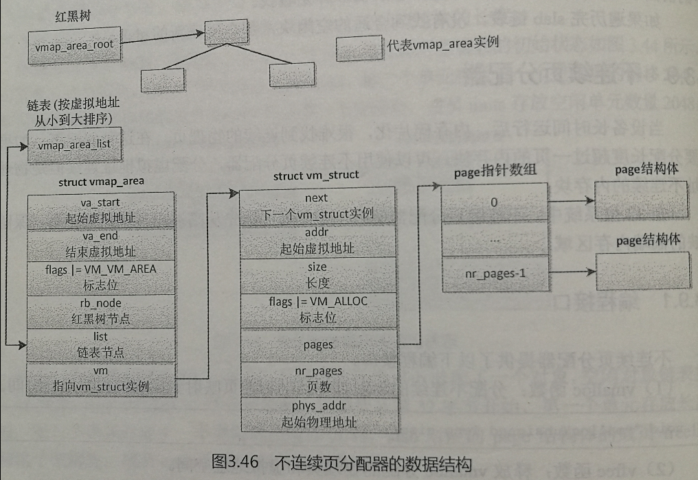
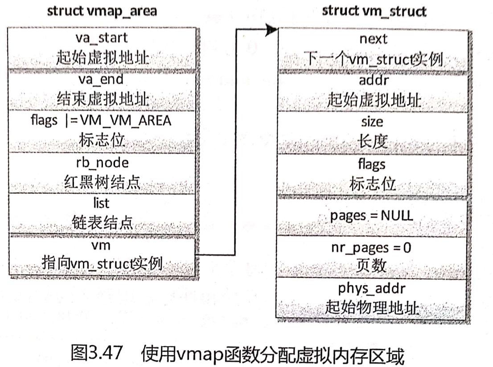

# Linux内核内存管理(十二)——不连续页分配器

- 当设备长时间运行后，内存碎片化，很难找到连续的物理页。在这种情况下，如果需要分配长度超过一页的内存块，可以使用不连续页分配器，分配虚拟地址连续但是物理地址不连续的内存块。
- 在32位系统中，不连续页分配器还有一个好处：优先从高端内存区域分配页，保留稀缺的低端内存区域。

## 12.1 编程接口

- 不连续页分配器提供了以下编程接口

- `vmalloc`函数：分配不连续的物理页并且把物理页映射到连续的虚拟地址空间。

  ```c
  [linux-4.14.130/mm/vmalloc.c]
  void *vmalloc(unsigned long size)
  {
  	return __vmalloc_node_flags(size, NUMA_NO_NODE,
  				    GFP_KERNEL);
  }

  ```

- `vfree`函数：释放`vmalloc`分配的物理页和虚拟地址空间。

  ```c
  [linux-4.14.130/mm/vmalloc.c]
  void vfree(const void *addr)
  {
  	BUG_ON(in_nmi());

  	kmemleak_free(addr);

  	if (!addr)
  		return;
  	if (unlikely(in_interrupt()))
  		__vfree_deferred(addr);
  	else
  		__vunmap(addr, 1);
  }

  ```

- `vmap`函数：把已经分配的不连续物理页映射到连续的虚拟地址空间，参数`pages`是`page`指针数组，`count`是`page`指针数组的大小，`flags`是标志位，`prot`是页保护位

  ```c
  [linux-4.14.130/mm/vmalloc.c]
  void *vmap(struct page **pages, unsigned int count,
  		unsigned long flags, pgprot_t prot)
  {
  	struct vm_struct *area;
  	unsigned long size;		/* In bytes */

  	might_sleep();

  	if (count > totalram_pages)
  		return NULL;

  	size = (unsigned long)count << PAGE_SHIFT;
  	area = get_vm_area_caller(size, flags, __builtin_return_address(0));
  	if (!area)
  		return NULL;

  	if (map_vm_area(area, prot, pages)) {
  		vunmap(area->addr);
  		return NULL;
  	}

  	return area->addr;
  }

  ```

- `vunmap`函数：释放使用`vmap`分配的虚拟地址空间

  ```c
  void vunmap(const void *addr)
  {
  	BUG_ON(in_interrupt());
  	might_sleep();
  	if (addr)
  		__vunmap(addr, 0);
  }

  ```

- 内核还提供了以下函数

- `kvmalloc`函数：先尝试使用`kmalloc`分配内存块，如果失败，那么使用`vmalloc`函数分配不连续的物理页。

  ```c
  [linux-4.14.130/include/linux/mm.h]
  static inline void *kvmalloc(size_t size, gfp_t flags)
  {
  	return kvmalloc_node(size, flags, NUMA_NO_NODE);
  }

  ```

- `kvfree`函数：如果内存块是使用`vmalloc`分配的，那么使用`vfree`释放，否则使用`kfree`释放。

  ```c
  [linux-4.14.130/mm/util.c]
  void kvfree(const void *addr)
  {
  	if (is_vmalloc_addr(addr))
  		vfree(addr);
  	else
  		kfree(addr);
  }

  ```


## 12.2 数据结构

- 不连续页分配器的数据结构如下图所示：                 

1. 每个虚拟内存区域对应一个`vmap_area`实例。

   ```c
   [linux-4.14.130/include/linux/vmalloc.h]
   struct vmap_area {
   	unsigned long va_start; /* 起始虚拟地址 */
   	unsigned long va_end; /* 结束虚拟地址， 虚拟内存区域的范围是[va_start, va_end) */
   	unsigned long flags; /* 标志位，如果设置了标志位 VM_VM_AREA，表示成员vm指向一个vm_struct实例，即 vmap_area实例关联一个vm_struct实例 */
   	struct rb_node rb_node; /* 红黑树节点，用来把 vmap_area实例加入根节点是vmap_area_root的红黑树中，借助红黑树可以根据虚拟地址快速找到vmap_area实例 */
   	struct list_head list;  /* 链表节点，用来把vmap_area实例加入头节点是vmap_area_list的链表中，这条链表按虚拟地址从小到大排序 */
   	struct llist_node purge_list;    /* "lazy purge" list */
   	struct vm_struct *vm; /* 指向vm_struct实例 */
   	struct rcu_head rcu_head;
   };

   ```

- 每个`vmap_area`实例关联一个`vm_struct`实例。

   ```c
   [linux-4.14.130/include/linux/vmalloc.h]
   struct vm_struct {
   	struct vm_struct	*next; /* 指向下一个`vm_struct`实例 */
   	void			*addr; /* 起始虚拟地址 */
   	unsigned long		size; /* 长度 */
   	unsigned long		flags; /* 标志位，如果设置了标志位 VM_ALLOC，表示虚拟内存区域是使用函数 vmalloc 分配的 */
   	struct page		**pages; /* page指针数组，page指针数组的每个元素指向一个物理页的page实例 */
   	unsigned int		nr_pages; /* 页数 */
   	phys_addr_t		phys_addr; /* 起始物理地址， 其与next两个成员仅仅在不连续页分配器初始化以前使用 */
   	const void		*caller;
   };

   ```

   如下图所示，如果虚拟内存区域是使用函数`vmap`分配的，`vm_struct`结构体的差别是：成员`flags`没有设置标志位`VM_ALLOC`，成员`pages`是空指针，成员`nr_pages`是0：

   


## 12.3 技术原理

- `vmalloc`虚拟地址空间的范围是`[VMALLOC_START, VMALLOC_END)`，每种处理器架构都需要定义这两个宏，例如`ARM64`架构定义的宏如下：

  ```c
  [linux-4.14.130/arch/arm64/include/asm/pgtable.h]
  #define VMALLOC_START		(MODULES_END)
  #define VMALLOC_END		(PAGE_OFFSET - PUD_SIZE - VMEMMAP_SIZE - SZ_64K)

  ```

  其中，`MODULES_END`是内核模块区域的结束地址，`PAGE_OFFSET`是线性映射区域的起始地址，`PUD_SIZE`是一个页上层目录表项映射的地址空间长度，`VMEMMAP_SIZE`是`vmemmap`区域的长度。

- `vmalloc`虚拟地址空间的起始地址等于内核模块区域的结束地址。
- `vmalloc`虚拟地址空间的结束地址等于（线性映射区域的起始地址 - 一个页上层目录表项映射的地址空间长度 - `vmemma`区域的长度 - 64KB）。
- 函数`vmalloc`分配的单位是页，如果请求分配的长度不是页的整数倍，那么长度向上对齐到页的整数倍。建议在需要申请的内存长度超过一页的时候使用函数`vmalloc`。
- 函数`vmalloc`的执行过程分为3步：
  1. 分配虚拟内存
     - 分配`vmap_area`实例和`vm_struct`实例；
     - 然后遍历已经存在的`vmap_area`实例，在两个相邻的虚拟内存区域之间找到一个足够大的空洞，如果找到了，把起始虚拟地址和结束虚拟地址保存在新的`vmap_area`实例中，然后把新的`vmap_area`实例加入红黑树和链表；
     - 最后把新的`vmap_area`实例关联到`vm_struct`实例。
  2. 分配物理页
     - `vm_struct`实例成员`nr_pages`存放页数n；
     - 分配`page`指针数组，数组的大小是n，`vm_struct`实例的成员`pages`指向`page`指针数组；
     - 然后连续执行n次如下操作：从页分配器分配一个物理页，把物理页对应的`page`实例的地址存放在`page`指针数组中。
  3. 在内核的页表中把虚拟页映射到物理页
     - 内核的页表就是0号内核线程的页表。0号内核线程的进程描述符是全局变量`init_task`，成员`active_mm`指向全局变量`init_mm`，`init_mm`的成员`pgd`指向页全局目录`swapper_pg_dir`。

- 函数`vmap`和函数`vmalloc`的区别仅仅在于不需要分配物理页。


## 12.4 相关函数解析

- `vmalloc()`函数声明如下：

  ```c
  [linux-4.14.130/mm/vmalloc.c]
  void *vmalloc(unsigned long size)
  {
  	return __vmalloc_node_flags(size, NUMA_NO_NODE,
  				    GFP_KERNEL);
  }

  static inline void *__vmalloc_node_flags(unsigned long size,
  					int node, gfp_t flags)
  {
  	return __vmalloc_node(size, 1, flags, PAGE_KERNEL,
  					node, __builtin_return_address(0));
  }

  static void *__vmalloc_node(unsigned long size, unsigned long align,
  			    gfp_t gfp_mask, pgprot_t prot,
  			    int node, const void *caller)
  {
  	return __vmalloc_node_range(size, align, VMALLOC_START, VMALLOC_END,
  				gfp_mask, prot, 0, node, caller);
  }

  ```

  `vmalloc`使用的分配掩码是`GFP_KERNEL`，`vmalloc()`函数最终调用`__vmalloc_node_range()`函数，`VMALLOC_START`和`VMALLOC_END`是`vmalloc`中很重要的宏，这两个宏定义在`arch/arm64/include/asm/pgtable.h`头文件中， 如下：

  ```c
  [linux-4.14.130/arch/arm64/include/asm/pgtable.h]
  #define VMALLOC_START		(MODULES_END)
  #define VMALLOC_END		(PAGE_OFFSET - PUD_SIZE - VMEMMAP_SIZE - SZ_64K)

  ```

- `vmalloc() -> __vmalloc_node_flags() -> __vmalloc_node() -> __vmalloc_node_range()`

  ```c
  [linux-4.14.130/mm/vmalloc.c]
  void *__vmalloc_node_range(unsigned long size, unsigned long align,
  			unsigned long start, unsigned long end, gfp_t gfp_mask,
  			pgprot_t prot, unsigned long vm_flags, int node,
  			const void *caller)
  {
  	struct vm_struct *area;
  	void *addr;
  	unsigned long real_size = size;

  	size = PAGE_ALIGN(size); /* vmalloc分配的大小要以页面大小对齐 */
  	if (!size || (size >> PAGE_SHIFT) > totalram_pages) /* 判断要分配的内存大小不能为0或者不能大于系统的所有内存 */
  		goto fail;

  	area = __get_vm_area_node(size, align, VM_ALLOC | VM_UNINITIALIZED | /* 分配vm_struct实例  */
  				vm_flags, start, end, node, gfp_mask, caller);
  	if (!area)
  		goto fail;

  	addr = __vmalloc_area_node(area, gfp_mask, prot, node);
  	if (!addr)
  		return NULL;

  	/*
  	 * In this function, newly allocated vm_struct has VM_UNINITIALIZED
  	 * flag. It means that vm_struct is not fully initialized.
  	 * Now, it is fully initialized, so remove this flag here.
  	 */
  	clear_vm_uninitialized_flag(area);

  	kmemleak_vmalloc(area, size, gfp_mask);

  	return addr;

  fail:
  	warn_alloc(gfp_mask, NULL,
  			  "vmalloc: allocation failure: %lu bytes", real_size);
  	return NULL;
  }

  ```

- `vmalloc() -> __vmalloc_node_flags() -> __vmalloc_node() -> __vmalloc_node_range() -> __get_vm_area_node()`

  ```c
  [linux-4.14.130/mm/vmalloc.c]
  static struct vm_struct *__get_vm_area_node(unsigned long size,
  		unsigned long align, unsigned long flags, unsigned long start,
  		unsigned long end, int node, gfp_t gfp_mask, const void *caller)
  {
  	struct vmap_area *va;
  	struct vm_struct *area;

  	BUG_ON(in_interrupt()); /* 确保当前不在中断上下文中，因为这个函数有可能会睡眠 */
  	size = PAGE_ALIGN(size);
  	if (unlikely(!size))
  		return NULL;

  	if (flags & VM_IOREMAP)
  		align = 1ul << clamp_t(int, get_count_order_long(size),
  				       PAGE_SHIFT, IOREMAP_MAX_ORDER);

  	area = kzalloc_node(sizeof(*area), gfp_mask & GFP_RECLAIM_MASK, node); /* 分配一个struct vm_struct数据结构来描述这个vmalloc区域, kzalloc_node()函数最终调用__kmalloc(size, flags)函数分配一块buffer*/
  	if (unlikely(!area))
  		return NULL;

  	if (!(flags & VM_NO_GUARD)) /* 如果flags中没有定义VM_NO_GUARD标志位，那么要多分配一个页来做安全垫 */
  		size += PAGE_SIZE;

  	va = alloc_vmap_area(size, align, start, end, node, gfp_mask); /* alloc_vmap_area()在vmalloc整个空间中查找一块大小合适的并且没有人使用的空间，这段空间称为hole */
  	if (IS_ERR(va)) {
  		kfree(area);
  		return NULL;
  	}

  	setup_vmalloc_vm(area, va, flags, caller);

  	return area;
  }

  ```

- `vmalloc() -> __vmalloc_node_flags() -> __vmalloc_node() -> __vmalloc_node_range() -> __get_vm_area_node() -> alloc_vmap_area()`,`alloc_vmap_area()`在`vmalloc`整个空间中查找一块大小合适的并且没有人使用的空间，这段空间称为`hole`，其中参数`vstart`是指`VMALLOC_START`，`vend`是指`VMALLOC_END`。

  ```c
  [linux-4.14.130/mm/vmalloc.c]
  static struct vmap_area *alloc_vmap_area(unsigned long size,
  				unsigned long align,
  				unsigned long vstart, unsigned long vend,
  				int node, gfp_t gfp_mask)
  {
  	struct vmap_area *va;
  	struct rb_node *n;
  	unsigned long addr;
  	int purged = 0;
  	struct vmap_area *first;

  	BUG_ON(!size);
  	BUG_ON(offset_in_page(size));
  	BUG_ON(!is_power_of_2(align));

  	might_sleep();

  	va = kmalloc_node(sizeof(struct vmap_area),
  			gfp_mask & GFP_RECLAIM_MASK, node); /* 分配一个struct vm_area数据结构, kmalloc_node()函数最终调用kmalloc_slab()函数 */
  	if (unlikely(!va))
  		return ERR_PTR(-ENOMEM);

  	/*
  	 * Only scan the relevant parts containing pointers to other objects
  	 * to avoid false negatives.
  	 */
  	kmemleak_scan_area(&va->rb_node, SIZE_MAX, gfp_mask & GFP_RECLAIM_MASK);

  retry:
  	spin_lock(&vmap_area_lock);
  	/*
  	 * Invalidate cache if we have more permissive parameters.
  	 * cached_hole_size notes the largest hole noticed _below_
  	 * the vmap_area cached in free_vmap_cache: if size fits
  	 * into that hole, we want to scan from vstart to reuse
  	 * the hole instead of allocating above free_vmap_cache.
  	 * Note that __free_vmap_area may update free_vmap_cache
  	 * without updating cached_hole_size or cached_align.
  	 */
  	if (!free_vmap_cache ||
  			size < cached_hole_size ||
  			vstart < cached_vstart ||
  			align < cached_align) { /* free_vmap_cache, cached_hole_size, cached_vstart这几个变量是优化选项，核心思想是从上一次查找的结果中开始查找 */
  nocache:
  		cached_hole_size = 0;
  		free_vmap_cache = NULL;
  	}
  	/* record if we encounter less permissive parameters */
  	cached_vstart = vstart;
  	cached_align = align;

  	/* find starting point for our search */
  	if (free_vmap_cache) {
  		first = rb_entry(free_vmap_cache, struct vmap_area, rb_node);
  		addr = ALIGN(first->va_end, align);
  		if (addr < vstart)
  			goto nocache;
  		if (addr + size < addr)
  			goto overflow;

  	} else { /* 当free_vmap_cache为空时， 查找的地址从VMALLOC_START开始 */
  		addr = ALIGN(vstart, align);
  		if (addr + size < addr)
  			goto overflow;

  		n = vmap_area_root.rb_node;
  		first = NULL;

  		while (n) {/* 我们首先从vmap_area_root这颗红黑树上查找，这个红黑树里存放者系统中正在使用的 vmalloc 区块，遍历左子叶节点找区间地址最小的区块，如果区块的开始地址等于VMALLOC_START，说明者区块是第一块 vmalloc 区块。该while循环语句遍历的结果是返回起始地址最小的vmalloc区块，这个区块可能是VMALLOC_START开始的，也可能不是 */
  			struct vmap_area *tmp;
  			tmp = rb_entry(n, struct vmap_area, rb_node);
  			if (tmp->va_end >= addr) {
  				first = tmp;
  				if (tmp->va_start <= addr)
  					break;
  				n = n->rb_left;
  			} else
  				n = n->rb_right;
  		}

  		if (!first) /* 如果红黑树没有一个节点，说明整个 vmalloc 区间都是空的，此时first为NULL */
  			goto found;
  	}

  	/* from the starting point, walk areas until a suitable hole is found */
      /* 从起始地址开始，查找每个已存在的vmalloc区块的缝隙hole能否容纳目前要分配内存的大小。如果在已有vmalloc区块的缝隙中没能找到合适的hole，那么从最后一块vmalloc区块的结束地址开始一个新的vmalloc区块 */
  	while (addr + size > first->va_start && addr + size <= vend) {
  		if (addr + cached_hole_size < first->va_start)
  			cached_hole_size = first->va_start - addr;
  		addr = ALIGN(first->va_end, align);
  		if (addr + size < addr)
  			goto overflow;

  		if (list_is_last(&first->list, &vmap_area_list))
  			goto found;

  		first = list_next_entry(first, list);
  	}

  found:
  	/*
  	 * Check also calculated address against the vstart,
  	 * because it can be 0 because of big align request.
  	 */
  	if (addr + size > vend || addr < vstart)
  		goto overflow;

  	va->va_start = addr;
  	va->va_end = addr + size;
  	va->flags = 0;
  	__insert_vmap_area(va); /* 找到新的区块hole后，调用 __insert_vmap_area 函数把这个hole注册到红黑树中 */
  	free_vmap_cache = &va->rb_node;
  	spin_unlock(&vmap_area_lock);

  	BUG_ON(!IS_ALIGNED(va->va_start, align));
  	BUG_ON(va->va_start < vstart);
  	BUG_ON(va->va_end > vend);

  	return va;

  overflow:
  	spin_unlock(&vmap_area_lock);
  	if (!purged) {
  		purge_vmap_area_lazy();
  		purged = 1;
  		goto retry;
  	}

  	if (gfpflags_allow_blocking(gfp_mask)) {
  		unsigned long freed = 0;
  		blocking_notifier_call_chain(&vmap_notify_list, 0, &freed);
  		if (freed > 0) {
  			purged = 0;
  			goto retry;
  		}
  	}

  	if (!(gfp_mask & __GFP_NOWARN) && printk_ratelimit())
  		pr_warn("vmap allocation for size %lu failed: use vmalloc=<size> to increase size\n",
  			size);
  	kfree(va);
  	return ERR_PTR(-EBUSY);
  }

  static void __insert_vmap_area(struct vmap_area *va) /* __insert_vmap_area 函数把这个hole注册到红黑树中 */
  {
  	struct rb_node **p = &vmap_area_root.rb_node;
  	struct rb_node *parent = NULL;
  	struct rb_node *tmp;

  	while (*p) {
  		struct vmap_area *tmp_va;

  		parent = *p;
  		tmp_va = rb_entry(parent, struct vmap_area, rb_node);
  		if (va->va_start < tmp_va->va_end)
  			p = &(*p)->rb_left;
  		else if (va->va_end > tmp_va->va_start)
  			p = &(*p)->rb_right;
  		else
  			BUG();
  	}

  	rb_link_node(&va->rb_node, parent, p);
  	rb_insert_color(&va->rb_node, &vmap_area_root);

  	/* address-sort this list */
  	tmp = rb_prev(&va->rb_node);
  	if (tmp) {
  		struct vmap_area *prev;
  		prev = rb_entry(tmp, struct vmap_area, rb_node);
  		list_add_rcu(&va->list, &prev->list);
  	} else
  		list_add_rcu(&va->list, &vmap_area_list);
  }

  ```

- `vmalloc() -> __vmalloc_node_flags() -> __vmalloc_node() -> __vmalloc_node_range() -> __get_vm_area_node() -> setup_vmalloc_vm()`,把刚找到的 `struct vmap_area *va`的相关信息

  ```c
  [linux-4.14.130/mm/vmalloc.c]
  static void setup_vmalloc_vm(struct vm_struct *vm, struct vmap_area *va,
  			      unsigned long flags, const void *caller)
  {
  	spin_lock(&vmap_area_lock);
  	vm->flags = flags;
  	vm->addr = (void *)va->va_start;
  	vm->size = va->va_end - va->va_start;
  	vm->caller = caller;
  	va->vm = vm;
  	va->flags |= VM_VM_AREA;
  	spin_unlock(&vmap_area_lock);
  }

  ```

- `vmalloc() -> __vmalloc_node_flags() -> __vmalloc_node() -> __vmalloc_node_range() -> __vmalloc_area_node()`

  ```c
  [linux-4.14.130/mm/vmalloc.c]
  static void *__vmalloc_area_node(struct vm_struct *area, gfp_t gfp_mask,
  				 pgprot_t prot, int node)
  {
  	struct page **pages;
  	unsigned int nr_pages, array_size, i;
  	const gfp_t nested_gfp = (gfp_mask & GFP_RECLAIM_MASK) | __GFP_ZERO;
  	const gfp_t alloc_mask = gfp_mask | __GFP_NOWARN;
  	const gfp_t highmem_mask = (gfp_mask & (GFP_DMA | GFP_DMA32)) ?
  					0 :
  					__GFP_HIGHMEM;

  	nr_pages = get_vm_area_size(area) >> PAGE_SHIFT; /* 计算vmalloc分配内存大小有几个页面 */
  	array_size = (nr_pages * sizeof(struct page *));

  	area->nr_pages = nr_pages;
  	/* Please note that the recursion is strictly bounded. */
  	if (array_size > PAGE_SIZE) {
  		pages = __vmalloc_node(array_size, 1, nested_gfp|highmem_mask,
  				PAGE_KERNEL, node, area->caller);
  	} else {
  		pages = kmalloc_node(array_size, nested_gfp, node);
  	}
  	area->pages = pages;
  	if (!area->pages) {
  		remove_vm_area(area->addr);
  		kfree(area);
  		return NULL;
  	}
  	/* 分配物理页面，并且使用area->pages保存已分配页面的page数据结构指针 */
  	for (i = 0; i < area->nr_pages; i++) {
  		struct page *page;

  		if (node == NUMA_NO_NODE)
  			page = alloc_page(alloc_mask|highmem_mask);
  		else
  			page = alloc_pages_node(node, alloc_mask|highmem_mask, 0);

  		if (unlikely(!page)) {
  			/* Successfully allocated i pages, free them in __vunmap() */
  			area->nr_pages = i;
  			goto fail;
  		}
  		area->pages[i] = page;
  		if (gfpflags_allow_blocking(gfp_mask|highmem_mask))
  			cond_resched();
  	}
  	/* map_vm_area建立页面映射 */
  	if (map_vm_area(area, prot, pages))
  		goto fail;
  	return area->addr;

  fail:
  	warn_alloc(gfp_mask, NULL,
  			  "vmalloc: allocation failure, allocated %ld of %ld bytes",
  			  (area->nr_pages*PAGE_SIZE), area->size);
  	vfree(area->addr);
  	return NULL;
  }

  /*  map_vm_area最终调用vmap_page_range_noflush来建立页面映射关系 */
  int map_vm_area(struct vm_struct *area, pgprot_t prot, struct page **pages)
  {
  	unsigned long addr = (unsigned long)area->addr;
  	unsigned long end = addr + get_vm_area_size(area);
  	int err;

  	err = vmap_page_range(addr, end, prot, pages);

  	return err > 0 ? 0 : err;
  }
  static int vmap_page_range(unsigned long start, unsigned long end,
  			   pgprot_t prot, struct page **pages)
  {
  	int ret;

  	ret = vmap_page_range_noflush(start, end, prot, pages);
  	flush_cache_vmap(start, end);
  	return ret;
  }
  static int vmap_page_range_noflush(unsigned long start, unsigned long end,
  				   pgprot_t prot, struct page **pages)
  {
  	pgd_t *pgd;
  	unsigned long next;
  	unsigned long addr = start;
  	int err = 0;
  	int nr = 0;

  	BUG_ON(addr >= end);
  	pgd = pgd_offset_k(addr); /* 从 init_mm 中获取指向 PGD 页面目录项的基地址，然后通过地址 addr 来找到对应的 PGD 表项 */
  	do { /* while循环里从开始地址addr到结束地址，按照PGDIR_SIZE的大小以此调用vmap_p4d_range()来处理PGD页表 */
  		next = pgd_addr_end(addr, end);
  		err = vmap_p4d_range(pgd, addr, next, prot, pages, &nr);
  		if (err)
  			return err;
  	} while (pgd++, addr = next, addr != end);

  	return nr;
  }

  /* vmap_p4d_range()函数最后直接调用vmap_pte_range() */
  static int vmap_pte_range(pmd_t *pmd, unsigned long addr,
		unsigned long end, pgprot_t prot, struct page **pages, int *nr)
  {
  	pte_t *pte;

  	/*
  	 * nr is a running index into the array which helps higher level
  	 * callers keep track of where we're up to.
  	 */

  	pte = pte_alloc_kernel(pmd, addr);
  	if (!pte)
  		return -ENOMEM;
  	do {
  		struct page *page = pages[*nr];

  		if (WARN_ON(!pte_none(*pte)))
  			return -EBUSY;
  		if (WARN_ON(!page))
  			return -ENOMEM;
  		set_pte_at(&init_mm, addr, pte, mk_pte(page, prot)); /* mk_pte()宏利用刚分配的page页面和页面属性prot来新生成一个PTE entry，最后通过set_pte_at()函数把PTE entry设置到硬件页表PTE页表项中。 */
  		(*nr)++;
  	} while (pte++, addr += PAGE_SIZE, addr != end);
  	return 0;
  }

  ```
