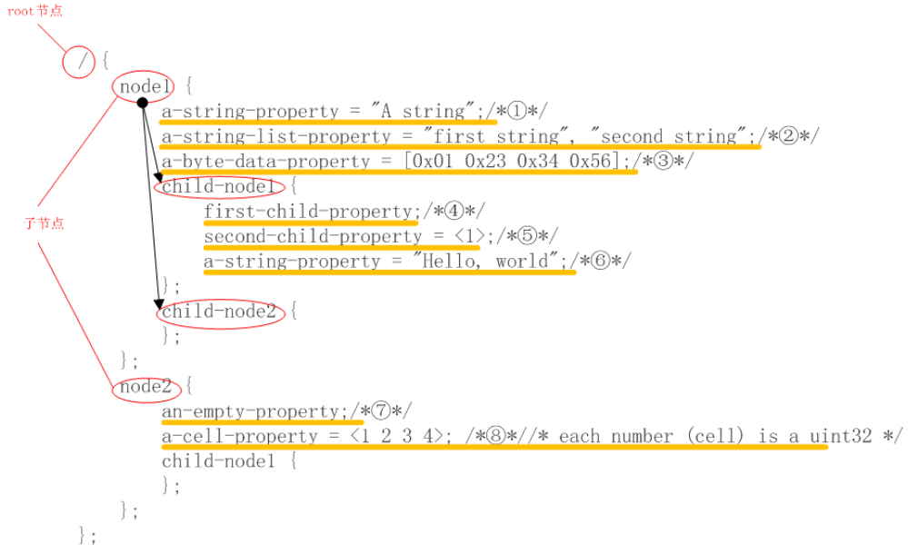
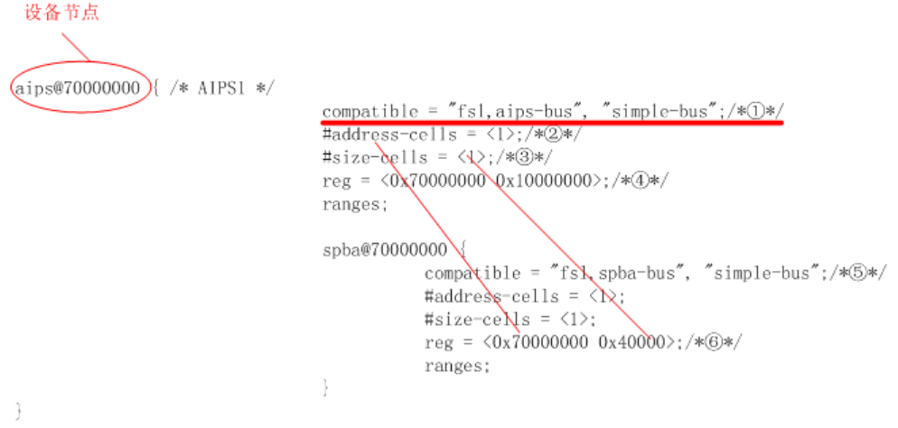
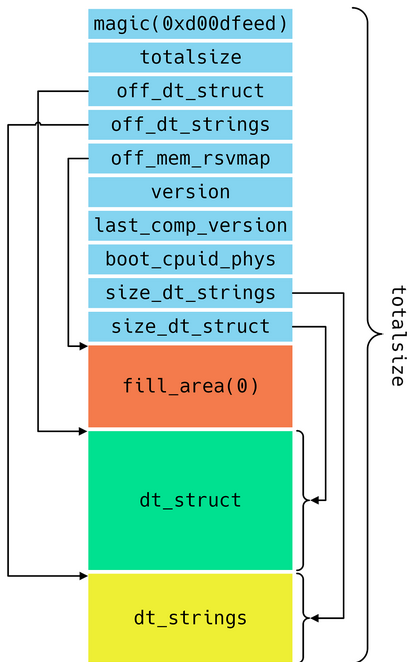
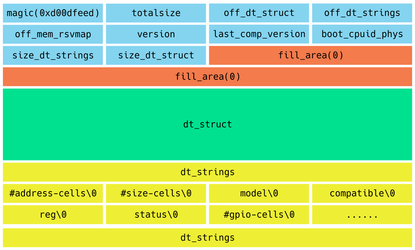
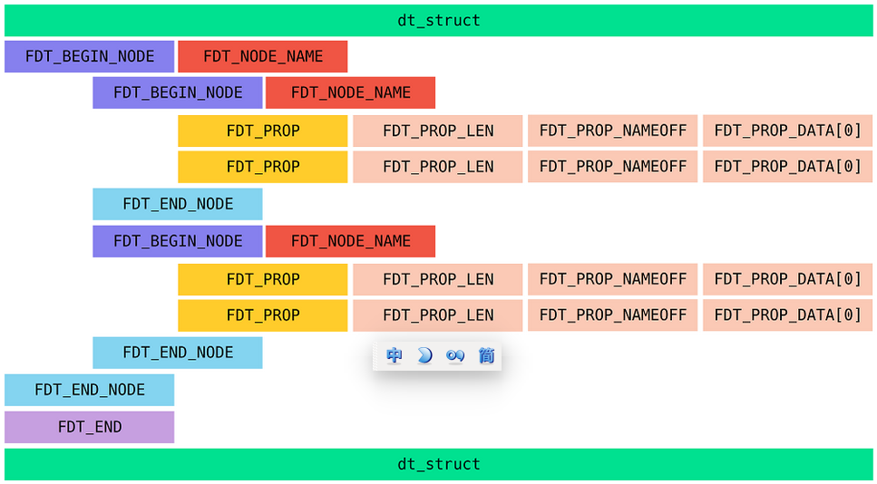
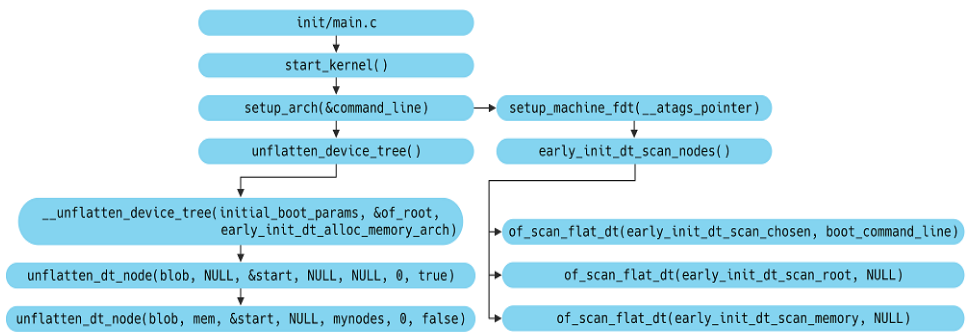

下Linux内核分析（一）——设备树

## 概述

- **本章节详细阐述**了Linux内核中设备树的基本概念、基本内容、相关结构、相关的解析函数和数据结构、加载和解析过程，以及Linux内核中常用的接口函数等等。
- 设备树与Linux内核中驱动模块相关性较强，如果只是了解一下设备树，那么对于设备树的加载及解析相关部分，则不必过于深入追究。
- 本章节全面介绍了设备树的基本知识，以及在设备启动过程中的加载流程，相关函数调用流程，部分调用环节还有待完善，Linux内核中常用的接口函数仍需进一步阐述。

## 1. Linux 内核中设备树的基本概念及作用

- Linux引入FDT目的很明确--降低代码冗余。过去在内核源码中，存在大量对板级细节信息描述的代码。这些代码充斥在/arch/arm/plat-xxx和/arch/arm/mach-xxx目录，对内核而言这些platform设备、resource、i2c_board_info、spi_board_info以及各种硬件的platform_data绝大多数纯属垃圾冗余代码。为了解决这一问题，ARM内核版本3.x之后引入了原先在Power PC等其他体系架构已经使用的Flattened Device Tree。即Linux内核中引入的设备树，Flattened Device Tree，简称FDT，扁平设备树，后续我们Linux内核中所说的设备树，都是扁平设备树。

- 简而言之，设备树就是描述单板资源以及设备的一种文本文件。“A data structure by which bootloaders pass hardware layout to Linux in a device-independent manner, simplifying hardware probing.”开源文档中对设备树的描述是，一种描述硬件资源的数据结构，它通过bootloader将硬件资源传给内核，使得内核和硬件资源描述相对独立。

- Device Tree可以描述的信息包括CPU的数量和类别、内存基地址和大小、总线和桥、外设连接、中断控制器和中断使用情况、GPIO控制器和GPIO使用情况、Clock控制器和Clock使用情况。

- 它基本上就是画一棵电路板上CPU、总线、设备组成的树，Bootloader会将这棵树传递给内核，然后内核可以识别这棵树，并根据它展开出Linux内核中的platform_device、i2c_client、spi_device等设备，而这些设备用到的内存、IRQ等资源，也被传递给了内核，内核会将这些资源绑定给展开的相应的设备。

- 是否Device Tree要描述系统中的所有硬件信息？答案是否定的。基本上，那些可以动态探测到的设备是不需要描述的，例如USB device。不过对于SOC上的usb hostcontroller，它是无法动态识别的，需要在device tree中描述。同样的道理，在computersystem中，PCI device可以被动态探测到，不需要在device tree中描述，但是PCI  bridge如果不能被探测，那么就需要描述之。另外，设备树对于可热插拔的热备不进行具体描述，它只描述用于控制该热插拔设备的控制器。

- 设备树的主要优势：对于同一SOC的不同主板，只需更换设备树文件.dtb即可实现不同主板的无差异支持，而无需更换内核文件。

- 注：要使得3.x之后的内核支持使用设备树，除了内核编译时需要打开相对应的选项外，bootloader也需要支持将设备树的数据结构传给内核。

  


## 2. 设备树基本知识

### 2.1 设备树的组成和使用
- 设备树包含DTC（device tree compiler），DTS（device tree source和DTB（device tree blob）。三者关系如下：

  1. .dts文件是一种ASCII 文本格式的Device Tree描述，此文本格式非常人性化，适合人类的阅读习惯。基本上，在ARM Linux在，一个.dts文件对应一个ARM的machine，一般放置在内核的arch/arm/boot/dts/目录。

  2. 由于一个SoC可能对应多个machine（一个SoC可以对应多个产品和电路板），势必这些.dts文件需包含许多共同的部分，Linux内核为了简化，把SoC公用的部分或者多个machine共同的部分一般提炼为.dtsi，类似于C语言的头文件。其他的machine对应的.dts就include这个.dtsi。当然，和C语言的头文件类似，.dtsi也可以include其他的.dtsi，譬如几乎所有的ARM SoC的.dtsi都引用了skeleton.dtsi，即#include"skeleton.dtsi“ 或者 /include/ "skeleton.dtsi"。

  3. uboot和linux不能识别dts文件，只能识别二进制文件，所以需要将.dts文件编译成.dtb文件。dtb文件是一种可以被kernel和uboot识别的二进制文件。

     ​		把.dts文件编译成.dtb文件的工具就是DTC。DTC的源码位于内核的scripts/dtc目录，内核选中CONFIG_OF，编译内核的时候，主机可执行程序DTC就会被编译出来。即scripts/dtc/Makefile中
  
     ``````makefile
     hostprogs-y := dtc
      always := $(hostprogs-y)
     ``````

     ​		在内核的arch/arm/boot/dts/Makefile中，若选中某种SOC，则与其对应相关的所有dtb文件都将编译出来。在linux下，make dtbs可单独编译dtb。

     ​		在Linux的scripts/dtc目录下除了提供dtc工具外，也可以自己安装dtc工具，linux下执行：sudo apt-get install device-tree-compiler安装dtc工具。dtc工具的使用方法是：dtc -I dts -O dtb -o xxx.dtb xxx.dts，即可生成dts文件对应的dtb文件了。 当然了，dtc -I dtb -O dts -o xxx.dts xxx.dtb反过来即可生成dts文件。其中还提供了一个fdtdump的工具，可以dump dtb文件，方便查看信息。
  
     
  

### 2.2 设备树中DTS（DTSI）文件的基本语法

- Device Tree由一系列被命名的节点（node），以及描述节点的属性（property）的元素组成，而节点本身可包含子节点。所谓属性，其实就是成对出现的name和value。

- 正常情况下所有的dts文件以及dtsi文件都含有一个根节点（root节点）”/”，这样include之后就会造成有很多个根节点? 按理说 device tree既然是一个树，那么其只能有一个根节点，所有其他的节点都是派生于根节点的child node。其实也正是如此，Device Tree Compiler在对.dts进行编译生成dtb时，会对node进行合并操作，最终生成的DTB中只有一个 root  node。

- device tree的基本单元是node。这些node被组织成树状结构，除了root node，每个node都只有一个parent。一个device tree文件中只能有一个root node。每个node中包含了若干的property/value来描述该node的一些特性。每个node用节点名字（node name）标识，节点名字的格式是node-name@unit-address。

- 在一个树状结构的device tree中，如何引用一个node呢？要想唯一指定一个node必须使用full path，例如/node-name-1/node-name-2/node-name-N。

- 在节点的{}里面是描述该节点的属性（property），即设备的特性。它的值是多样化的，我们以下图为例：

  1. 它可以是字符串string，如①；也可能是字符串数组string-list，如②

  2. 它也可以是32 bit unsigned integers，如cell⑧，用<>表示

  3. 它也可以是binary data，如③，用[]表示

  4. 它也可能是空，如⑦

- 在/arch/arm/boot/dts/目录中有一个文件skeleton.dtsi，该文件为各ARM vendor共用的一些硬件定义信息。以下为skeleton.dtsi的全部内容。

  ```c
  / {
  	#address-cells = <1>;
  	#size-cells = <1>;
  	chosen { };
  	aliases { };
  	memory { device_type = "memory"; reg = <0 0>; };
  };
  ```
  
  如上，属性# address-cells的值为1，它代表以“/”根节点为parent的子节点中，reg属性中存在一个address值；#size-cells的值为1，它代表以“/” 根节点为parent的子节点中，reg属性中存在一个size值。即父节点的#address-cells和#size-cells的含义如下：
  
  1. #address-cells，用来描述子节点“reg”属性的地址表中用来描述首地址的cell数量；
  
   	2.  #size-cells，用来描述子节点“reg”属性的地址表中用来描述地址长度的cell数量；

### 2.3 典型节点描述

- chosen node

  ```makefile
  chosen {
          bootargs = "tegraid=40.0.0.00.00 vmalloc=256M video=tegrafb console=ttyS0, 115200n8 earlyprintk";
  };
  ```

  chosen node 主要用来描述由系统指定的runtime parameter，它并没有描述任何硬件设备节点信息。原先通过tag list传递的一些linux kernel运行的参数，可以通过chosen节点来传递。如command line可以通过bootargs这个property来传递。如果存在chosen node，它的parent节点必须为“/”根节点。

- aliases node

  ```makefile
  aliases {
  	i2c6 = &pca9546_i2c0;
  	i2c7 = &pca9546_i2c1;
  	i2c8 = &pca9546_i2c2;
  	i2c9 = &pca9546_i2c3;
  };
  ```

  aliases node用来定义别名，类似C++中引用。上面是一个在.dtsi中的典型应用，当使用i2c6时，也即使用pca9546_i2c0，使得引用节点变得简单方便。例：当.dts  include 该.dtsi时，将i2c6的status属性赋值为okay，则表明该主板上的pca9546_i2c0处于enable状态；反之，status赋值为disabled，则表明该主板上的pca9546_i2c0处于disenable状态。如下是引用的具体例子：

  ```makefile
  &i2c6 {
  	status = "okay";
  };
  ```

- memory node

  ```makefile
  memory {
  	device_type = "memory";
  	reg = <0x00000000 0x20000000>; /* 512 MB */
  };
  ```

  对于memory node，device_type必须为memory，由之前的描述可以知道该memory node是以0x00000000为起始地址，以0x20000000为地址长度的512MB的空间。

  一般而言，在.dts中不对memory进行描述，而是通过bootargs中类似521M@0x00000000的方式传递给内核。

- 其他节点

  由于其他设备节点依据属性进行描述，具有类似的形式。接下来的部分主要分析各种属性的含义及作用，并结合相关的例子进行阐述。

  1. Reg属性

     在device node 中，reg是描述memory-mapped IO register的offset和length。子节点的reg属性address和length长度取决于父节点对应的#address-cells和#size-cells的值。例：

     在上述的aips节点中，存在子节点spda。spda中的中reg为<0x70000000 0x40000 >，其0x700000000为address，0x40000为size。这一点在图(../picture/dts基本语法范例.png)有作介绍。

     这里补充的一点是：设备节点的名称格式[node-name@unit-address](mailto:node-name@unit-address)，节点名称用node-name唯一标识，为一个ASCII字符串。其中@unit-address为可选项，可以不作描述。unit-address的具体格式和设备挂载在哪个bus上相关。如：cpu的unit-address从0开始编址，以此加1；本例中，aips为0x70000000。

  2. compatible属性

     在上图①中，compatible属性为string list，用来将设备匹配对应的driver驱动，优先级为从左向右。本例中spba的驱动优先考虑“fsl，spba-bus”驱动；若没有“fsl，aips-bus”驱动，则用字符串“simple-bus”来继续寻找合适的驱动。即compatible实现了原先内核版本3.x之前，platform_device中.name的功能，至于具体的实现方法，本文后面会做讲解。

     注：对于“/”root节点，它也存在compatible属性，用来匹配machine type。具体说明将在后面给出。

  3. interrupts属性

     设备节点通过interrupt-parent来指定它所依附的中断控制器，当节点没有指定interrupt-parent时，则从parent节点中继承。上面例子中，root节点的interrupt-parent = <&mic>。这里使用了引用，即mic引用了②中的inrerrupt-controller @40008000；root节点的子节点并没有指定interrupt-controller，如ahb、fab，它们均使用从根节点继承过来的mic，即位于0x40008000的中断控制器。

     若子节点使用到中断(中断号、触发方法等等)，则需用interrupt属性来指定，该属性的数值长度受中断控制器中#inrerrupt-cells值③控制，即interrupt属性<>中数值的个数为#inrerrupt-cells的值；本例中#inrerrupt-cells=<2>，因而④中interrupts的值为<0x3d 0>形式，具体每个数值的含义由驱动实现决定。

  4. ranges属性

     ranges属性为地址转换表，这在pcie中使用较为常见，它表明了该设备在到parent节点中所对用的地址映射关系。ranges格式长度受当前节点#address-cell、parent节点#address-cells、当前节点#size-cell所控制。顺序为ranges=<当前节点#address-cell, parent节点#address-cells , 当前节点#size-cell>。在本例中，当前节点#address-cell=<1>,对应于⑤中的第一个0x20000000；parent节点#address-cells=<1>，对应于⑤中的第二个0x20000000；当前节点#size-cell=<1>，对应于⑤中的0x30000000。即ahb节点所占空间从0x20000000地址开始，对应于父节点的0x20000000地址开始的0x30000000地址空间大小。

     注：对于相同名称的节点，dtc会根据定义的先后顺序进行合并，其相同属性，取后定义的那个。

## 3. Device Tree文件结构 

- DTB由三部分组成：头（Header）、结构块（device-tree structure）、字符串块（string block），其布局结构如下：
- 通过以上分析，可以得到Device Tree文件结构如下图所示。dtb文件的头部首先存放的是fdt_header的结构体信息，接着是填充区域，填充大小为off_dt_struct – sizeof(struct fdt_header)，填充的值为0。接着就是struct fdt_property结构体的相关信息。最后是dt_string部分。

### 3.1 Device Tree文件头信息

- 我们使用上文提到的fdtdump工具，以vexpress-v2p-ca5s.dtb文件为例，Linux终端执行fdtdump -sd  vexpress-v2p-ca5s.dtb > vexpress-v2p-ca5s.txt，vexpress-v2p-ca5s.txt部分内容如下：

  ```
  vexpress-v2p-ca5s.dtb: found fdt at offset 0
  /dts-v1/;
  // magic:		0xd00dfeed
  // totalsize:		0x313b (12603)
  // off_dt_struct:	0x38
  // off_dt_strings:	0x2dac
  // off_mem_rsvmap:	0x28
  // version:		17
  // last_comp_version:	16
  // boot_cpuid_phys:	0x0
  // size_dt_strings:	0x38f
  // size_dt_struct:	0x2d74
  ```

- 以上信息便是Device Tree头信息，存储在dtb文件的开头部分，在Linux内核中使用`struct fdt_header`结构体描述，该结构体定义在linux-5.1/scripts/dtc/libfdt/fdt.h文件中。（注：好多设备树相关文章中也有使用`struct boot_param_header`结构体（定义在arch/powerpc/include/asm/prom.h）的，两个结构体内容一样）：

  ```c
    struct fdt_header {
    		fdt32_t	magic;				/* 设备树幻数，固定为0xd00dfeed */
    		fdt32_t	totalsize;			/* 整个设备树的大小*/
        	fdt32_t	off_dt_struct;		/* 保存结构块在整个设备树中的偏移*/
   		fdt32_t	off_dt_strings;		/* 保存字符串块在整个设备树中的偏移*/
  		fdt32_t	off_mem_rsvmap;		/* 保留内存区，该区保留了不能被内核动态分配的内存空间*/
         	fdt32_t	version;			/* 设备树版本*/
          fdt32_t	last_comp_version;	/* 向下兼容版本号*/
    		/* version 2 fields below */
    		fdt32_t	boot_cpuid_phys;	/* 为在多核处理器中用于启动的主CPU的物理id*/
    		/* version 3 fields below */
    		fdt32_t	dt_strings_size;	/* 字符串块大小*/
    		/* version 17 fields below */
    		fdt32_t	dt_struct_size;		/* 结构块大小*/
    };
  ```

  fdtdump工具的输出信息即是以上结构中每一个成员的值，struct fdt_header结构体包含了Device Tree的私有信息。例如: fdt_header.magic是fdt的魔数,固定值为0xd00dfeed，fdt_header.totalsize是fdt文件的大小。使用二进制工具打开vexpress-v2p-ca5s.dtb验证。vexpress-v2p-ca5s.dtb二进制文件头信息如下图所示。从下图中可以得到Device Tree的文件是以大端模式储存。并且，头部信息和fdtdump的输出信息一致。

  ```
    1 0000000: d0 0d fe ed 00 00 31 3b 00 00 00 38 00 00 2d ac  ......1;...8..-.
    2 0000010: 00 00 00 28 00 00 00 11 00 00 00 10 00 00 00 00  ...(............
    3 0000020: 00 00 03 8f 00 00 2d 74 00 00 00 00 00 00 00 00  ......-t........
    4 0000030: 00 00 00 00 00 00 00 00 00 00 00 01 00 00 00 00  ................
    5 0000040: 00 00 00 03 00 00 00 09 00 00 00 00 56 32 50 2d  ............V2P-
    6 0000050: 43 41 35 73 00 00 00 00 00 00 00 03 00 00 00 04  CA5s............
    7 0000060: 00 00 00 06 00 00 02 25 00 00 00 03 00 00 00 04  .......%........
    8 0000070: 00 00 00 0e 00 00 00 0f 00 00 00 03 00 00 00 23  ...............#
    9 0000080: 00 00 00 20 61 72 6d 2c 76 65 78 70 72 65 73 73  ... arm,vexpress
  ```

  

### 3.2 device-tree structure——节点

- 设备树结构块是一个线性化的结构体，是设备树的主体，以<u>节点的形式保存了主板上的设备信息(我的理解：设备树结构体描述了dts文件中的节点信息。)</u>。

- 节点（node）信息使用struct fdt_node_header结构体描述。各个结构体信息如下: `/scripts/dtc/libfdt/fdt.h`

  ```c
  81struct fdt_node_header {
  82	fdt32_t tag;
  83	char name[0];
  84};
  85
  ```

  ​		struct fdt_node_header描述节点信息，tag(有些地方也叫token)是标识node的起始结束等信息的标志位，name指向node名称的首地址。tag的取值如下。：  

  ```c
  #define FDT_BEGIN_NODE	0x1		/* Start of node, full name */
  #define FDT_END_NODE	0x2		/* End node */
  #define FDT_PROP		0x3		/* Property: name off, size, content */
  #define FDT_NOP			0x4		/* nop */
  #define FDT_END			0x9
  ```

  1. FDT_BEGIN_NODE (0x00000001)。该tag描述了一个node的开始位置，紧挨着该tag的就是node name（包括unit address）。
  2. FDT_END_NODE (0x00000002)。该tag描述了一个node的结束位置。
  3. FDT_PROP (0x00000003)。该tag描述了一个property的开始位置，该tag之后是两个u32的数据，分别是length和name offset。length表示该property value data的size。name offset表示该属性字符串在device tree strings block的偏移值。length和name offset之后就是长度为length具体的属性值数据。
  4. FDT_NOP (0x00000004)。
  5. FDT_END (0x00000009)。该tag标识了一个DTB的结束位置。

- 节点属性信息使用struct fdt_property结构体描述。

  ```c
  86struct fdt_property {
  87	fdt32_t tag;
  88	fdt32_t len;
  89	fdt32_t nameoff;
  90	char data[0];
  91};
  ```

  1. 描述属性采用struct fdt_property描述，tag标识是属性，取值为FDT_PROP；
  2. len为属性值的长度（包括‘\0’，单位：字节）；
  3. nameoff为属性名称存储位置相对于off_dt_strings的偏移地址。

- 设备树节点的结构如下：
  
  一个节点的结构如下：
  
  1. 节点开始标志：一般为FDT_BEGIN_NODE（0x00000001）。
  2. 节点路径或者节点的单元名(version<3以节点路径表示，version>=0x10以节点单元名表示)。
  3. 填充字段（对齐到四字节）。
  4. 节点属性。每个属性以宏FDT_PROP(0x00000003)开始，后面依次为属性值的字节长度(4字节)、属性名称在字符串块中的偏移量(4字节)、属性值和填充（对齐到四字节）。
  5. 如果存在子节点，则定义子节点。
  6. 节点结束标志FDT_END_NODE(0x00000002)。


## 4. kernel解析Device Tree

- Device Tree文件结构描述就以上struct fdt_header、struct fdt_node_header及struct fdt_property三个结构体描述。kernel会根据Device Tree的结构解析出kernel能够使用的struct property结构体。<u>kernel根据Device Tree中所有的属性解析出数据填充struct property结构体</u>。struct property结构体描述如下:

  ```c
  struct property {
      char *name;		/*属性名*/
      int	length;		/*属性值长度*/
      void *value;	/*属性值*/
      struct property *next;	/*指向下一个属性值*/
      unsigned long _flags;	/*标志*/
      unsigned int unique_id;
  }
  ```

  ​	kernel根据Device Tree的文件结构信息转换成struct property结构体，并将同一个node节点下面的所有属性通过property.next指针进行链接，形成一个单链表。

- kernel解析Device Tree的函数调用过程如下图所示: 

  1. kernel的C语言阶段的入口函数是init/main.c/start_kernel()函数，在early_init_dt_scan_nodes()中会做以下三件事：
     - 扫描/chosen或者/chose@0节点下面的bootargs属性值到boot_command_line，此外，还处理initrd相关的property，并保存在initrd_start和initrd_end这两个全局变量中；
     - 扫描根节点下面，获取{size,address}-cells信息，并保存在dt_root_size_cells和dt_root_addr_cells全局变量中；   
     - 扫描具有device_type = “memory”属性的/memory或者/memory@0节点下面的reg属性值，并把相关信息保存在meminfo中，全局变量meminfo保存了系统内存相关的信息。 

  2. Device Tree中的每一个node节点经过kernel处理都会生成一个struct device_node的结构体，struct device_node最终一般会被挂接到具体的struct device结构体。struct device_node结构体描述如下：kernel4.14/include/linux/of.h     
      ```c
          49struct device_node {
          50	const char *name;	/*node的名称，取最后一次“/”和“@”之间子串*/
          51	const char *type;	/*device_type的属性名称，没有为<NULL>*/
          52	phandle phandle;	/*phandle属性值*/
          53	const char *full_name;	/*指向该结构体结束的位置，存放node的路径全名，例如：/chosen*/
          54	struct fwnode_handle fwnode;
          55
          56	struct	property *properties;	/*指向该节点下的第一个属性，其他属性与该属性链表相接*/
          57	struct	property *deadprops;	/* removed properties */
          58	struct	device_node *parent;	/*指向父节点*/
          59	struct	device_node *child;		/*指向子节点*/
          60	struct	device_node *sibling;	/*姊妹节点，与自己同等级的node*/
          61	struct	kobject kobj;			/* sysfs文件系统目录体现 */
          62	unsigned long _flags;			/* 当前node状态标志位，见/include/linux/of.h line141-145 */
          63	void	*data;
          64#if defined(CONFIG_SPARC)
          65	const char *path_component_name;
          66	unsigned int unique_id;
          67	struct of_irq_controller *irq_trans;
          68#endif
          69};
          ...
          141/* flag descriptions (need to be visible even when !CONFIG_OF) */
          142#define OF_DYNAMIC	1 /* node and properties were allocated via kmalloc */
          143#define OF_DETACHED	2 /* node has been detached from the device tree */
          144#define OF_POPULATED	3 /* device already created for the node */
          145#define OF_POPULATED_BUS	4 /* of_platform_populate recursed to children of this node */
      ```
      
      - 下面分析以上信息是如何得来的。Device Tree的解析首先从unflatten_device_tree()开始，实现代码如下：     

      ```c
      // linux-5.1/drivers/of/fdt.c    
      1238  /**
      1239   * unflatten_device_tree - create tree of device_nodes from flat blob
      1240   *
      1241   * unflattens the device-tree passed by the firmware, creating the
      1242   * tree of struct device_node. It also fills the "name" and "type"
      1243   * pointers of the nodes so the normal device-tree walking functions
      1244   * can be used.
      1245   */
      1246  void __init unflatten_device_tree(void)
      1247  {
      1248  	__unflatten_device_tree(initial_boot_params, NULL, &of_root,
      1249  				early_init_dt_alloc_memory_arch, false);
      1250  
      1251  	/* Get pointer to "/chosen" and "/aliases" nodes for use everywhere */
      1252  	of_alias_scan(early_init_dt_alloc_memory_arch);
      1253  
      1254  	unittest_unflatten_overlay_base();
      1255  }
              
      ```
      
      - 分析以上代码，在`unflatten_device_tree()`中，调用函数`__unflatten_device_tree()`，参数`initial_boot_params`指向Device Tree在内存中的首地址，`of_root`在经过该函数处理之后，会指向根节点，`early_init_dt_alloc_memory_arch`是一个函数指针，为`struct device_node`和`struct property`结构体分配内存的回调函数（callback）。
      - `__unflatten_device_tree`  函数与`unflatten_device_tree`在同一文件中，定义如下：
      ```c
      // linux-5.1/drivers/of/fdt.c  
      421  /**
      422   * __unflatten_device_tree - create tree of device_nodes from flat blob
      423   *
      424   * unflattens a device-tree, creating the
      425   * tree of struct device_node. It also fills the "name" and "type"
      426   * pointers of the nodes so the normal device-tree walking functions
      427   * can be used.
      428   * @blob: The blob to expand
      429   * @dad: Parent device node
      430   * @mynodes: The device_node tree created by the call
      431   * @dt_alloc: An allocator that provides a virtual address to memory
      432   * for the resulting tree
      433   * @detached: if true set OF_DETACHED on @mynodes
      434   *
      435   * Returns NULL on failure or the memory chunk containing the unflattened
      436   * device tree on success.
      437   */
      438  void *__unflatten_device_tree(const void *blob,
      439  			      struct device_node *dad,
      440  			      struct device_node **mynodes,
      441  			      void *(*dt_alloc)(u64 size, u64 align),
      442  			      bool detached)
      443  {
      444  	int size;
      445  	void *mem;
      446  
      447  	pr_debug(" -> unflatten_device_tree()\n");
      448  
      449  	if (!blob) {
      450  		pr_debug("No device tree pointer\n");
      451  		return NULL;
      452  	}
      453  
      454  	pr_debug("Unflattening device tree:\n");
      455  	pr_debug("magic: %08x\n", fdt_magic(blob));
      456  	pr_debug("size: %08x\n", fdt_totalsize(blob));
      457  	pr_debug("version: %08x\n", fdt_version(blob));
      458  
      459  	if (fdt_check_header(blob)) {
      460  		pr_err("Invalid device tree blob header\n");
      461  		return NULL;
      462  	}
      463  
      464  	/* First pass, scan for size */
      465  	size = unflatten_dt_nodes(blob, NULL, dad, NULL);
      466  	if (size < 0)
      467  		return NULL;
      468  
      469  	size = ALIGN(size, 4);
      470  	pr_debug("  size is %d, allocating...\n", size);
      471  
      472  	/* Allocate memory for the expanded device tree */
      473  	mem = dt_alloc(size + 4, __alignof__(struct device_node));
      474  	if (!mem)
      475  		return NULL;
      476  
      477  	memset(mem, 0, size);
      478  
      479  	*(__be32 *)(mem + size) = cpu_to_be32(0x);
      480  
      481  	pr_debug("  unflattening %p...\n", mem);
      482  
      483  	/* Second pass, do actual unflattening */
      484  	unflatten_dt_nodes(blob, mem, dad, mynodes);
      485  	if (be32_to_cpup(mem + size) != 0xdeadbeef)
      486  		pr_warning("End of tree marker overwritten: %08x\n",
      487  			   be32_to_cpup(mem + size));
      488  
      489  	if (detached && mynodes) {
      490  		of_node_set_flag(*mynodes, OF_DETACHED);
      491  		pr_debug("unflattened tree is detached\n");
      492  	}
      493  
      494  	pr_debug(" <- unflatten_device_tree()\n");
      495  	return mem;
      496  } 
      ```
      - 在`__unflatten_device_tree()`函数中，两次调用`unflatten_dt_nodes()`函数，第一次是为了得到Device Tree转换成`struct device_node`和`struct property`结构体需要分配的内存大小，第二次调用才是具体填充每一个`struct device_node`和`struct property`结构体。
      - `unflatten_dt_nodes()`代码列出如下，需要注意的是，较早版本（Linux4.0）中，该幻数原型为`unflatten_dt_node()`，两个函数实现的功能是一样的，只是在`unflatten_dt_nodes()`函数中多包了一层`populate_node()`，而在`unflatten_dt_node()`函数中，`populate_node()`相关实现代码是展开着的。
      
      ```c
      // linux-5.1/drivers/of/fdt.c
      349  /**
      350   * unflatten_dt_nodes - Alloc and populate a device_node from the flat tree
      351   * @blob: The parent device tree blob
      352   * @mem: Memory chunk to use for allocating device nodes and properties
      353   * @dad: Parent struct device_node
      354   * @nodepp: The device_node tree created by the call
      355   *
      356   * It returns the size of unflattened device tree or error code
      357   */
      358  static int unflatten_dt_nodes(const void *blob,
      359  			      void *mem,
      360  			      struct device_node *dad,
      361  			      struct device_node **nodepp)
      362  {
      363  	struct device_node *root;
      364  	int offset = 0, depth = 0, initial_depth = 0;
      365  #define FDT_MAX_DEPTH	64
      366  	struct device_node *nps[FDT_MAX_DEPTH];
      367  	void *base = mem;
      368  	bool dryrun = !base;
      369  
      370  	if (nodepp)
      371  		*nodepp = NULL;
      372  
      373  	/*
      374  	 * We're unflattening device sub-tree if @dad is valid. There are
      375  	 * possibly multiple nodes in the first level of depth. We need
      376  	 * set @depth to 1 to make fdt_next_node() happy as it bails
      377  	 * immediately when negative @depth is found. Otherwise, the device
      378  	 * nodes except the first one won't be unflattened successfully.
      379  	 */
      380  	if (dad)
      381  		depth = initial_depth = 1;
      382  
      383  	root = dad;
      384  	nps[depth] = dad;
      385  
      386  	for (offset = 0;
      387  	     offset >= 0 && depth >= initial_depth;
      388  	     offset = fdt_next_node(blob, offset, &depth)) {
      389  		if (WARN_ON_ONCE(depth >= FDT_MAX_DEPTH))
      390  			continue;
      391  
      392  		if (!IS_ENABLED(CONFIG_OF_KOBJ) &&
      393  		    !of_fdt_device_is_available(blob, offset))
      394  			continue;
      395  
      396  		if (!populate_node(blob, offset, &mem, nps[depth],
      397  				   &nps[depth+1], dryrun))
      398  			return mem - base;
      399  
      400  		if (!dryrun && nodepp && !*nodepp)
      401  			*nodepp = nps[depth+1];
      402  		if (!dryrun && !root)
      403  			root = nps[depth+1];
      404  	}
      405  
      406  	if (offset < 0 && offset != -FDT_ERR_NOTFOUND) {
      407  		pr_err("Error %d processing FDT\n", offset);
      408  		return -EINVAL;
      409  	}
      410  
      411  	/*
      412  	 * Reverse the child list. Some drivers assumes node order matches .dts
      413  	 * node order
      414  	 */
      415  	if (!dryrun)
      416  		reverse_nodes(root);
      417  
      418  	return mem - base;
      419  }
      ```
      
      - 由`unflatten_dt_nodes()`函数可知，在`__unflatten_device_tree()`函数中，两次调用`unflatten_dt_nodes()`函数，第一次调用`unflatten_dt_nodes()`函数，mem为NULL，根据367、368两行可知，此时dryrun为true，此时就不再执行`if(!dryrun)`相关代码（这部分代码主要实现每一个struct device_node和struct property结构体的具体填充），所以第一次，我们只计算Device Tree转换成struct device_node和struct property结构体需要分配的内存大小（赋值给size），而第二次调用`unflatten_dt_nodes()`函数时，mem参数已经通过`__unflatten_device_tree()`函数中`dt_alloc()`获取相应的值，故在第二次调用`unflatten_dt_nodes()`函数时，此时dryrun为false，通过执行`if(!dryrun)`相关代码填充每一个struct device_node和struct property结构体。
      - `populate_node()`是计算节点所需内存大小的核心函数，其实现代码如下：
      
      ```c
      // linux-5.1/drivers/of/fdt.c 
      279  static bool populate_node(const void *blob,
      280  			  int offset,
      281  			  void **mem,
      282  			  struct device_node *dad,
      283  			  struct device_node **pnp,
      284  			  bool dryrun)
      285  {
      286  	struct device_node *np;
      287  	const char *pathp;
      288  	unsigned int l, allocl;
      289  
      290  	pathp = fdt_get_name(blob, offset, &l);
      291  	if (!pathp) {
      292  		*pnp = NULL;
      293  		return false;
      294  	}
      295  
      296  	allocl = ++l;
      297  
      298  	np = unflatten_dt_alloc(mem, sizeof(struct device_node) + allocl,
      299  				__alignof__(struct device_node));
      300  	if (!dryrun) {
      301  		char *fn;
      302  		of_node_init(np);
      303  		np->full_name = fn = ((char *)np) + sizeof(*np);
      304  
      305  		memcpy(fn, pathp, l);
      306  
      307  		if (dad != NULL) {
      308  			np->parent = dad;
      309  			np->sibling = dad->child;
      310  			dad->child = np;
      311  		}
      312  	}
      313  	/* 处理该node节点下面所有的property */
      314  	populate_properties(blob, offset, mem, np, pathp, dryrun);
      315  	if (!dryrun) {
      316  		np->name = of_get_property(np, "name", NULL);
      317  		if (!np->name)
      318  			np->name = "<NULL>";
      319  	}
      320  
      321  	*pnp = np;
      322  	return true;
      323  }
      ```
      
      - `populate_properties()`函数计算节点内部所有的property所需内存，实现代码如下：
      
      ```c
      // linux-5.1/drivers/of/fdt.c 
      178  static void populate_properties(const void *blob,
      179  				int offset,
      180  				void **mem,
      181  				struct device_node *np,
      182  				const char *nodename,
      183  				bool dryrun)
      184  {
      185  	struct property *pp, **pprev = NULL;
      186  	int cur;
      187  	bool has_name = false;
      188  
      189  	pprev = &np->properties;
      190  	for (cur = fdt_first_property_offset(blob, offset);
      191  	     cur >= 0;
      192  	     cur = fdt_next_property_offset(blob, cur)) {
      193  		const __be32 *val;
      194  		const char *pname;
      195  		u32 sz;
      196  
      197  		val = fdt_getprop_by_offset(blob, cur, &pname, &sz);
      198  		if (!val) {
      199  			pr_warn("Cannot locate property at 0x%x\n", cur);
      200  			continue;
      201  		}
      202  
      203  		if (!pname) {
      204  			pr_warn("Cannot find property name at 0x%x\n", cur);
      205  			continue;
      206  		}
      207  
      208  		if (!strcmp(pname, "name"))
      209  			has_name = true;
      210  
      211  		pp = unflatten_dt_alloc(mem, sizeof(struct property),
      212  					__alignof__(struct property));
      213  		if (dryrun)
      214  			continue;
      215  
      216  		/* We accept flattened tree phandles either in
      217  		 * ePAPR-style "phandle" properties, or the
      218  		 * legacy "linux,phandle" properties.  If both
      219  		 * appear and have different values, things
      220  		 * will get weird. Don't do that.
      221  		 */
      222  		if (!strcmp(pname, "phandle") ||
      223  		    !strcmp(pname, "linux,phandle")) {
      224  			if (!np->phandle)
      225  				np->phandle = be32_to_cpup(val);
      226  		}
      227  
      228  		/* And we process the "ibm,phandle" property
      229  		 * used in pSeries dynamic device tree
      230  		 * stuff
      231  		 */
      232  		if (!strcmp(pname, "ibm,phandle"))
      233  			np->phandle = be32_to_cpup(val);
      234  
      235  		pp->name   = (char *)pname;
      236  		pp->length = sz;
      237  		pp->value  = (__be32 *)val;
      238  		*pprev     = pp;
      239  		pprev      = &pp->next;
      240  	}
      241  
      242  	/* With version 0x10 we may not have the name property,
      243  	 * recreate it here from the unit name if absent
      244  	 */
          	/* 为每个node节点添加一个name的属性 */
      245  	if (!has_name) {
      246  		const char *p = nodename, *ps = p, *pa = NULL;
      247  		int len;
      248  		/* 属性name的value值为node节点的名称，取“/”和“@”之间的子串 */
      249  		while (*p) {
      250  			if ((*p) == '@')
      251  				pa = p;
      252  			else if ((*p) == '/')
      253  				ps = p + 1;
      254  			p++;
      255  		}
      256  
      257  		if (pa < ps)
      258  			pa = p;
      259  		len = (pa - ps) + 1;
      260  		pp = unflatten_dt_alloc(mem, sizeof(struct property) + len,
      261  					__alignof__(struct property));
      262  		if (!dryrun) {
      263  			pp->name   = "name";
      264  			pp->length = len;
      265  			pp->value  = pp + 1;
      266  			*pprev     = pp;
      267  			pprev      = &pp->next;
      268  			memcpy(pp->value, ps, len - 1);
      269  			((char *)pp->value)[len - 1] = 0;
      270  			pr_debug("fixed up name for %s -> %s\n",
      271  				 nodename, (char *)pp->value);
      272  		}
      273  	}
      274  
      275  	if (!dryrun)
      276  		*pprev = NULL;
      277  }
      ```
      
      

## 6. OF的API接口

- OF的接口函数在/drivers/of/目录下，有of_i2c.c、of_mdio.c、of_mtd.c、Adress.c等等，这里将列出几个常用的API接口。各接口内部的函数调用，请自行在Linux-5.1代码中追踪。

1. 用来查找在dtb中的根节点

   `unsigned long __init of_get_flat_dt_root(void)`

   ```c
   // linux-5.1/drivers/of/fdt.c
   766  /**
   767   * of_get_flat_dt_root - find the root node in the flat blob
   768   */
   769  unsigned long __init of_get_flat_dt_root(void)
   770  {
   771  	return 0;
   772  }
   ```

2. 根据deice_node结构的full_name参数，在全局链表of_allnodes中，查找合适的device_node

   `struct device_node *of_find_node_by_path(const char *path)`

   例如：

   ```c
   struct device_node *cpus;
   cpus=of_find_node_by_path("/cpus");
   
   // linux-5.1/include/linux/of.h
   280  static inline struct device_node *of_find_node_by_path(const char *path)
   281  {
   282  	return of_find_node_opts_by_path(path, NULL);
   283  }
   
   // linux-5.1/drivers/of/base.c
   921  /**
   922   *	of_find_node_opts_by_path - Find a node matching a full OF path
   923   *	@path: Either the full path to match, or if the path does not
   924   *	       start with '/', the name of a property of the /aliases
   925   *	       node (an alias).  In the case of an alias, the node
   926   *	       matching the alias' value will be returned.
   927   *	@opts: Address of a pointer into which to store the start of
   928   *	       an options string appended to the end of the path with
   929   *	       a ':' separator.
   930   *
   931   *	Valid paths:
   932   *		/foo/bar	Full path
   933   *		foo		Valid alias
   934   *		foo/bar		Valid alias + relative path
   935   *
   936   *	Returns a node pointer with refcount incremented, use
   937   *	of_node_put() on it when done.
   938   */
   939  struct device_node *of_find_node_opts_by_path(const char *path, const char **opts)
   940  {
   941  	struct device_node *np = NULL;
   942  	struct property *pp;
   943  	unsigned long flags;
   944  	const char *separator = strchr(path, ':');
   945  
   946  	if (opts)
   947  		*opts = separator ? separator + 1 : NULL;
   948  
   949  	if (strcmp(path, "/") == 0)
   950  		return of_node_get(of_root);
   951  
   952  	/* The path could begin with an alias */
   953  	if (*path != '/') {
   954  		int len;
   955  		const char *p = separator;
   956  
   957  		if (!p)
   958  			p = strchrnul(path, '/');
   959  		len = p - path;
   960  
   961  		/* of_aliases must not be NULL */
   962  		if (!of_aliases)
   963  			return NULL;
   964  
   965  		for_each_property_of_node(of_aliases, pp) {
   966  			if (strlen(pp->name) == len && !strncmp(pp->name, path, len)) {
   967  				np = of_find_node_by_path(pp->value);
   968  				break;
   969  			}
   970  		}
   971  		if (!np)
   972  			return NULL;
   973  		path = p;
   974  	}
   975  
   976  	/* Step down the tree matching path components */
   977  	raw_spin_lock_irqsave(&devtree_lock, flags);
   978  	if (!np)
   979  		np = of_node_get(of_root);
   980  	np = __of_find_node_by_full_path(np, path);
   981  	raw_spin_unlock_irqrestore(&devtree_lock, flags);
   982  	return np;
   983  }
   984  EXPORT_SYMBOL(of_find_node_opts_by_path);
   ```

3. 若from=NULL，则在全局链表of_allnodes中根据name查找合适的device_node

   `struct device_node *of_find_node_by_name(struct device_node *from,const char *name)`

   例如：

   ```c
   struct device_node *np;
   np = of_find_node_by_name(NULL,"firewire");
   
   // linux-5.1/drivers/of/base.c
   986  /**
   987   *	of_find_node_by_name - Find a node by its "name" property
   988   *	@from:	The node to start searching from or NULL; the node
   989   *		you pass will not be searched, only the next one
   990   *		will. Typically, you pass what the previous call
   991   *		returned. of_node_put() will be called on @from.
   992   *	@name:	The name string to match against
   993   *
   994   *	Returns a node pointer with refcount incremented, use
   995   *	of_node_put() on it when done.
   996   */
   997  struct device_node *of_find_node_by_name(struct device_node *from,
   998  	const char *name)
   999  {
   1000  	struct device_node *np;
   1001  	unsigned long flags;
   1002  
   1003  	raw_spin_lock_irqsave(&devtree_lock, flags);
   1004  	for_each_of_allnodes_from(from, np)
   1005  		if (of_node_name_eq(np, name) && of_node_get(np))
   1006  			break;
   1007  	of_node_put(from);
   1008  	raw_spin_unlock_irqrestore(&devtree_lock, flags);
   1009  	return np;
   1010  }
   1011  EXPORT_SYMBOL(of_find_node_by_name);
   ```

4. 根据设备类型查找相应的device_node

   `struct device_node *of_find_node_by_type(struct device_node *from,const char *type)`

   例如：

   ```c
   struct device_node *tsi_pci;
   tsi_pci= of_find_node_by_type(NULL,"pci");
   
   // linux-5.1/drivers/of/base.c
   1013  /**
   1014   *	of_find_node_by_type - Find a node by its "device_type" property
   1015   *	@from:	The node to start searching from, or NULL to start searching
   1016   *		the entire device tree. The node you pass will not be
   1017   *		searched, only the next one will; typically, you pass
   1018   *		what the previous call returned. of_node_put() will be
   1019   *		called on from for you.
   1020   *	@type:	The type string to match against
   1021   *
   1022   *	Returns a node pointer with refcount incremented, use
   1023   *	of_node_put() on it when done.
   1024   */
   1025  struct device_node *of_find_node_by_type(struct device_node *from,
   1026  	const char *type)
   1027  {
   1028  	struct device_node *np;
   1029  	unsigned long flags;
   1030  
   1031  	raw_spin_lock_irqsave(&devtree_lock, flags);
   1032  	for_each_of_allnodes_from(from, np)
   1033  		if (__of_node_is_type(np, type) && of_node_get(np))
   1034  			break;
   1035  	of_node_put(from);
   1036  	raw_spin_unlock_irqrestore(&devtree_lock, flags);
   1037  	return np;
   1038  }
   1039  EXPORT_SYMBOL(of_find_node_by_type);
   ```

5. 根据compatible字符串查找device_node

   `struct device_node *of_find_compatible_node(struct device_node *from,const char *type, const char *compatible)`

   ```c
   // linux-5.1/drivers/of/base.c
   
   1041  /**
   1042   *	of_find_compatible_node - Find a node based on type and one of the
   1043   *                                tokens in its "compatible" property
   1044   *	@from:		The node to start searching from or NULL, the node
   1045   *			you pass will not be searched, only the next one
   1046   *			will; typically, you pass what the previous call
   1047   *			returned. of_node_put() will be called on it
   1048   *	@type:		The type string to match "device_type" or NULL to ignore
   1049   *	@compatible:	The string to match to one of the tokens in the device
   1050   *			"compatible" list.
   1051   *
   1052   *	Returns a node pointer with refcount incremented, use
   1053   *	of_node_put() on it when done.
   1054   */
   1055  struct device_node *of_find_compatible_node(struct device_node *from,
   1056  	const char *type, const char *compatible)
   1057  {
   1058  	struct device_node *np;
   1059  	unsigned long flags;
   1060  
   1061  	raw_spin_lock_irqsave(&devtree_lock, flags);
   1062  	for_each_of_allnodes_from(from, np)
   1063  		if (__of_device_is_compatible(np, compatible, type, NULL) &&
   1064  		    of_node_get(np))
   1065  			break;
   1066  	of_node_put(from);
   1067  	raw_spin_unlock_irqrestore(&devtree_lock, flags);
   1068  	return np;
   1069  }
   1070  EXPORT_SYMBOL(of_find_compatible_node);
   ```

   

6. 根据节点属性的name查找device_node

   `struct device_node *of_find_node_with_property(struct device_node *from,const char *prop_name)`

   ```c
   // linux-5.1/drivers/of/base.c
   
   1072  /**
   1073   *	of_find_node_with_property - Find a node which has a property with
   1074   *                                   the given name.
   1075   *	@from:		The node to start searching from or NULL, the node
   1076   *			you pass will not be searched, only the next one
   1077   *			will; typically, you pass what the previous call
   1078   *			returned. of_node_put() will be called on it
   1079   *	@prop_name:	The name of the property to look for.
   1080   *
   1081   *	Returns a node pointer with refcount incremented, use
   1082   *	of_node_put() on it when done.
   1083   */
   1084  struct device_node *of_find_node_with_property(struct device_node *from,
   1085  	const char *prop_name)
   1086  {
   1087  	struct device_node *np;
   1088  	struct property *pp;
   1089  	unsigned long flags;
   1090  
   1091  	raw_spin_lock_irqsave(&devtree_lock, flags);
   1092  	for_each_of_allnodes_from(from, np) {
   1093  		for (pp = np->properties; pp; pp = pp->next) {
   1094  			if (of_prop_cmp(pp->name, prop_name) == 0) {
   1095  				of_node_get(np);
   1096  				goto out;
   1097  			}
   1098  		}
   1099  	}
   1100  out:
   1101  	of_node_put(from);
   1102  	raw_spin_unlock_irqrestore(&devtree_lock, flags);
   1103  	return np;
   1104  }
   1105  EXPORT_SYMBOL(of_find_node_with_property);
   ```

   

7. 根据phandle查找device_node

   `struct device_node *of_find_node_by_phandle(phandle handle)`

   ```c
   // linux-5.1/drivers/of/base.c
   
   1215  /**
   1216   * of_find_node_by_phandle - Find a node given a phandle
   1217   * @handle:	phandle of the node to find
   1218   *
   1219   * Returns a node pointer with refcount incremented, use
   1220   * of_node_put() on it when done.
   1221   */
   1222  struct device_node *of_find_node_by_phandle(phandle handle)
   1223  {
   1224  	struct device_node *np = NULL;
   1225  	unsigned long flags;
   1226  	phandle masked_handle;
   1227  
   1228  	if (!handle)
   1229  		return NULL;
   1230  
   1231  	raw_spin_lock_irqsave(&devtree_lock, flags);
   1232  
   1233  	masked_handle = handle & phandle_cache_mask;
   1234  
   1235  	if (phandle_cache) {
   1236  		if (phandle_cache[masked_handle] &&
   1237  		    handle == phandle_cache[masked_handle]->phandle)
   1238  			np = phandle_cache[masked_handle];
   1239  		if (np && of_node_check_flag(np, OF_DETACHED)) {
   1240  			WARN_ON(1); /* did not uncache np on node removal */
   1241  			of_node_put(np);
   1242  			phandle_cache[masked_handle] = NULL;
   1243  			np = NULL;
   1244  		}
   1245  	}
   1246  
   1247  	if (!np) {
   1248  		for_each_of_allnodes(np)
   1249  			if (np->phandle == handle &&
   1250  			    !of_node_check_flag(np, OF_DETACHED)) {
   1251  				if (phandle_cache) {
   1252  					/* will put when removed from cache */
   1253  					of_node_get(np);
   1254  					phandle_cache[masked_handle] = np;
   1255  				}
   1256  				break;
   1257  			}
   1258  	}
   1259  
   1260  	of_node_get(np);
   1261  	raw_spin_unlock_irqrestore(&devtree_lock, flags);
   1262  	return np;
   1263  }
   1264  EXPORT_SYMBOL(of_find_node_by_phandle);
   ```

   

8. 根据alias的name获得设备id号

   `int of_alias_get_id(struct device_node *np, const char *stem)`

   ```c
   // linux-5.1/drivers/of/base.c
   
   2014  /**
   2015   * of_alias_get_id - Get alias id for the given device_node
   2016   * @np:		Pointer to the given device_node
   2017   * @stem:	Alias stem of the given device_node
   2018   *
   2019   * The function travels the lookup table to get the alias id for the given
   2020   * device_node and alias stem.  It returns the alias id if found.
   2021   */
   2022  int of_alias_get_id(struct device_node *np, const char *stem)
   2023  {
   2024  	struct alias_prop *app;
   2025  	int id = -ENODEV;
   2026  
   2027  	mutex_lock(&of_mutex);
   2028  	list_for_each_entry(app, &aliases_lookup, link) {
   2029  		if (strcmp(app->stem, stem) != 0)
   2030  			continue;
   2031  
   2032  		if (np == app->np) {
   2033  			id = app->id;
   2034  			break;
   2035  		}
   2036  	}
   2037  	mutex_unlock(&of_mutex);
   2038  
   2039  	return id;
   2040  }
   2041  EXPORT_SYMBOL_GPL(of_alias_get_id);
   ```

   

9. device node计数增加/减少

   `struct device_node *of_node_get(struct device_node *node)`

   `void of_node_put(struct device_node *node)`

   ```c
   // linux-5.1/drivers/of/dynamic.c
   
   25  /**
   26   * of_node_get() - Increment refcount of a node
   27   * @node:	Node to inc refcount, NULL is supported to simplify writing of
   28   *		callers
   29   *
   30   * Returns node.
   31   */
   32  struct device_node *of_node_get(struct device_node *node)
   33  {
   34  	if (node)
   35  		kobject_get(&node->kobj);
   36  	return node;
   37  }
   38  EXPORT_SYMBOL(of_node_get);
   39  
   40  /**
   41   * of_node_put() - Decrement refcount of a node
   42   * @node:	Node to dec refcount, NULL is supported to simplify writing of
   43   *		callers
   44   */
   45  void of_node_put(struct device_node *node)
   46  {
   47  	if (node)
   48  		kobject_put(&node->kobj);
   49  }
   50  EXPORT_SYMBOL(of_node_put);
   ```

   

10. 根据property结构的name参数，在指定的device node中查找合适的property

    `struct property *of_find_property(const struct device_node *np,const char *name,int *lenp)`

    ```c
    // linux-5.1/drivers/of/base.c
    
    272  struct property *of_find_property(const struct device_node *np,
    273  				  const char *name,
    274  				  int *lenp)
    275  {
    276  	struct property *pp;
    277  	unsigned long flags;
    278  
    279  	raw_spin_lock_irqsave(&devtree_lock, flags);
    280  	pp = __of_find_property(np, name, lenp);
    281  	raw_spin_unlock_irqrestore(&devtree_lock, flags);
    282  
    283  	return pp;
    284  }
    285  EXPORT_SYMBOL(of_find_property);
    ```

    

11. 根据property结构的name参数，返回该属性的属性值

    `const void *of_get_property(const struct device_node *np, const char *name,int *lenp)`

    ```c
    // linux-5.1/drivers/of/base.c
    
    338  /*
    339   * Find a property with a given name for a given node
    340   * and return the value.
    341   */
    342  const void *of_get_property(const struct device_node *np, const char *name,
    343  			    int *lenp)
    344  {
    345  	struct property *pp = of_find_property(np, name, lenp);
    346  
    347  	return pp ? pp->value : NULL;
    348  }
    349  EXPORT_SYMBOL(of_get_property);
    ```

    

12. 根据compat参数与device node的compatible匹配，返回匹配度

    `int of_device_is_compatible(const struct device_node *device,const char *compat)`

    ```c
    // linux-5.1/drivers/of/base.c
    548  /** Checks if the given "compat" string matches one of the strings in
    549   * the device's "compatible" property
    550   */
    551  int of_device_is_compatible(const struct device_node *device,
    552  		const char *compat)
    553  {
    554  	unsigned long flags;
    555  	int res;
    556  
    557  	raw_spin_lock_irqsave(&devtree_lock, flags);
    558  	res = __of_device_is_compatible(device, compat, NULL, NULL);
    559  	raw_spin_unlock_irqrestore(&devtree_lock, flags);
    560  	return res;
    561  }
    562  EXPORT_SYMBOL(of_device_is_compatible);
    ```

    

13. 获得父节点的device node

    `struct device_node *of_get_parent(const struct device_node *node)`

    ```c
    // linux-5.1/drivers/of/base.c
    
    679  /**
    680   *	of_get_parent - Get a node's parent if any
    681   *	@node:	Node to get parent
    682   *
    683   *	Returns a node pointer with refcount incremented, use
    684   *	of_node_put() on it when done.
    685   */
    686  struct device_node *of_get_parent(const struct device_node *node)
    687  {
    688  	struct device_node *np;
    689  	unsigned long flags;
    690  
    691  	if (!node)
    692  		return NULL;
    693  
    694  	raw_spin_lock_irqsave(&devtree_lock, flags);
    695  	np = of_node_get(node->parent);
    696  	raw_spin_unlock_irqrestore(&devtree_lock, flags);
    697  	return np;
    698  }
    699  EXPORT_SYMBOL(of_get_parent);
    ```

    

14. 将matches数组中of_device_id结构的name和type与device node的compatible和type匹配，返回匹配度最高的of_device_id结构

    `const struct of_device_id *of_match_node(const struct of_device_id *matches,const struct device_node *node)`

    ```c
    // linux-5.1/drivers/of/base.c
    
    1129  /**
    1130   * of_match_node - Tell if a device_node has a matching of_match structure
    1131   *	@matches:	array of of device match structures to search in
    1132   *	@node:		the of device structure to match against
    1133   *
    1134   *	Low level utility function used by device matching.
    1135   */
    1136  const struct of_device_id *of_match_node(const struct of_device_id *matches,
    1137  					 const struct device_node *node)
    1138  {
    1139  	const struct of_device_id *match;
    1140  	unsigned long flags;
    1141  
    1142  	raw_spin_lock_irqsave(&devtree_lock, flags);
    1143  	match = __of_match_node(matches, node);
    1144  	raw_spin_unlock_irqrestore(&devtree_lock, flags);
    1145  	return match;
    1146  }
    1147  EXPORT_SYMBOL(of_match_node);
    ```

    

15. 根据属性名propname，读出属性值中的第index个u32数值给out_value

    `int of_property_read_u32_index(const struct device_node *np,const char *propname,u32 index, u32 *out_value)`

    ```c
    // linux-5.1/drivers/of/property.c
    
    98  /**
    99   * of_property_read_u32_index - Find and read a u32 from a multi-value property.
    100   *
    101   * @np:		device node from which the property value is to be read.
    102   * @propname:	name of the property to be searched.
    103   * @index:	index of the u32 in the list of values
    104   * @out_value:	pointer to return value, modified only if no error.
    105   *
    106   * Search for a property in a device node and read nth 32-bit value from
    107   * it. Returns 0 on success, -EINVAL if the property does not exist,
    108   * -ENODATA if property does not have a value, and -EOVERFLOW if the
    109   * property data isn't large enough.
    110   *
    111   * The out_value is modified only if a valid u32 value can be decoded.
    112   */
    113  int of_property_read_u32_index(const struct device_node *np,
    114  				       const char *propname,
    115  				       u32 index, u32 *out_value)
    116  {
    117  	const u32 *val = of_find_property_value_of_size(np, propname,
    118  					((index + 1) * sizeof(*out_value)),
    119  					0,
    120  					NULL);
    121  
    122  	if (IS_ERR(val))
    123  		return PTR_ERR(val);
    124  
    125  	*out_value = be32_to_cpup(((__be32 *)val) + index);
    126  	return 0;
    127  }
    128  EXPORT_SYMBOL_GPL(of_property_read_u32_index);
    129  
    ```

    

16. 根据属性名propname，读出该属性的数组中sz个属性值给out_values

    `int of_property_read_u8_array(const struct device_node *np,const char *propname, u8 *out_values, size_t sz)`

    `int of_property_read_u16_array(const struct device_node *np,const char *propname, u16 *out_values, size_t sz)`

    `int of_property_read_u32_array(const struct device_node *np,const char *propname, u32 *out_values,size_t sz)`

    `int of_property_read_u64_array(const struct device_node *np,const char *propname, u64 *out_values,size_t sz)`

    ```c
    // linux-5.1/include/linux/of.h
    
    416  /**
    417   * of_property_read_u8_array - Find and read an array of u8 from a property.
    418   *
    419   * @np:		device node from which the property value is to be read.
    420   * @propname:	name of the property to be searched.
    421   * @out_values:	pointer to return value, modified only if return value is 0.
    422   * @sz:		number of array elements to read
    423   *
    424   * Search for a property in a device node and read 8-bit value(s) from
    425   * it. Returns 0 on success, -EINVAL if the property does not exist,
    426   * -ENODATA if property does not have a value, and -EOVERFLOW if the
    427   * property data isn't large enough.
    428   *
    429   * dts entry of array should be like:
    430   *	property = /bits/ 8 <0x50 0x60 0x70>;
    431   *
    432   * The out_values is modified only if a valid u8 value can be decoded.
    433   */
    434  static inline int of_property_read_u8_array(const struct device_node *np,
    435  					    const char *propname,
    436  					    u8 *out_values, size_t sz)
    437  {
    438  	int ret = of_property_read_variable_u8_array(np, propname, out_values,
    439  						     sz, 0);
    440  	if (ret >= 0)
    441  		return 0;
    442  	else
    443  		return ret;
    444  }
    445  
    446  /**
    447   * of_property_read_u16_array - Find and read an array of u16 from a property.
    448   *
    449   * @np:		device node from which the property value is to be read.
    450   * @propname:	name of the property to be searched.
    451   * @out_values:	pointer to return value, modified only if return value is 0.
    452   * @sz:		number of array elements to read
    453   *
    454   * Search for a property in a device node and read 16-bit value(s) from
    455   * it. Returns 0 on success, -EINVAL if the property does not exist,
    456   * -ENODATA if property does not have a value, and -EOVERFLOW if the
    457   * property data isn't large enough.
    458   *
    459   * dts entry of array should be like:
    460   *	property = /bits/ 16 <0x5000 0x6000 0x7000>;
    461   *
    462   * The out_values is modified only if a valid u16 value can be decoded.
    463   */
    464  static inline int of_property_read_u16_array(const struct device_node *np,
    465  					     const char *propname,
    466  					     u16 *out_values, size_t sz)
    467  {
    468  	int ret = of_property_read_variable_u16_array(np, propname, out_values,
    469  						      sz, 0);
    470  	if (ret >= 0)
    471  		return 0;
    472  	else
    473  		return ret;
    474  }
    475  
    476  /**
    477   * of_property_read_u32_array - Find and read an array of 32 bit integers
    478   * from a property.
    479   *
    480   * @np:		device node from which the property value is to be read.
    481   * @propname:	name of the property to be searched.
    482   * @out_values:	pointer to return value, modified only if return value is 0.
    483   * @sz:		number of array elements to read
    484   *
    485   * Search for a property in a device node and read 32-bit value(s) from
    486   * it. Returns 0 on success, -EINVAL if the property does not exist,
    487   * -ENODATA if property does not have a value, and -EOVERFLOW if the
    488   * property data isn't large enough.
    489   *
    490   * The out_values is modified only if a valid u32 value can be decoded.
    491   */
    492  static inline int of_property_read_u32_array(const struct device_node *np,
    493  					     const char *propname,
    494  					     u32 *out_values, size_t sz)
    495  {
    496  	int ret = of_property_read_variable_u32_array(np, propname, out_values,
    497  						      sz, 0);
    498  	if (ret >= 0)
    499  		return 0;
    500  	else
    501  		return ret;
    502  }
    503  
    504  /**
    505   * of_property_read_u64_array - Find and read an array of 64 bit integers
    506   * from a property.
    507   *
    508   * @np:		device node from which the property value is to be read.
    509   * @propname:	name of the property to be searched.
    510   * @out_values:	pointer to return value, modified only if return value is 0.
    511   * @sz:		number of array elements to read
    512   *
    513   * Search for a property in a device node and read 64-bit value(s) from
    514   * it. Returns 0 on success, -EINVAL if the property does not exist,
    515   * -ENODATA if property does not have a value, and -EOVERFLOW if the
    516   * property data isn't large enough.
    517   *
    518   * The out_values is modified only if a valid u64 value can be decoded.
    519   */
    520  static inline int of_property_read_u64_array(const struct device_node *np,
    521  					     const char *propname,
    522  					     u64 *out_values, size_t sz)
    523  {
    524  	int ret = of_property_read_variable_u64_array(np, propname, out_values,
    525  						      sz, 0);
    526  	if (ret >= 0)
    527  		return 0;
    528  	else
    529  		return ret;
    530  }
    ```

    

17. 根据属性名propname，读出该属性的u64属性值

    `int of_property_read_u64(const struct device_node *np, const char *propname,u64 *out_value)`

    ```c
    // linux-5.1/drivers/of/property.c
    301  
    302  /**
    303   * of_property_read_u64 - Find and read a 64 bit integer from a property
    304   * @np:		device node from which the property value is to be read.
    305   * @propname:	name of the property to be searched.
    306   * @out_value:	pointer to return value, modified only if return value is 0.
    307   *
    308   * Search for a property in a device node and read a 64-bit value from
    309   * it. Returns 0 on success, -EINVAL if the property does not exist,
    310   * -ENODATA if property does not have a value, and -EOVERFLOW if the
    311   * property data isn't large enough.
    312   *
    313   * The out_value is modified only if a valid u64 value can be decoded.
    314   */
    315  int of_property_read_u64(const struct device_node *np, const char *propname,
    316  			 u64 *out_value)
    317  {
    318  	const __be32 *val = of_find_property_value_of_size(np, propname,
    319  						sizeof(*out_value),
    320  						0,
    321  						NULL);
    322  
    323  	if (IS_ERR(val))
    324  		return PTR_ERR(val);
    325  
    326  	*out_value = of_read_number(val, 2);
    327  	return 0;
    328  }
    329  EXPORT_SYMBOL_GPL(of_property_read_u64);
    ```

    

18. 根据属性名propname，读出该属性的字符串属性值

    `int of_property_read_string(struct device_node *np, const char *propname,const char **out_string)`

    ```c
    // linux-5.1/drivers/of/property.c
    
    378  /**
    379   * of_property_read_string - Find and read a string from a property
    380   * @np:		device node from which the property value is to be read.
    381   * @propname:	name of the property to be searched.
    382   * @out_string:	pointer to null terminated return string, modified only if
    383   *		return value is 0.
    384   *
    385   * Search for a property in a device tree node and retrieve a null
    386   * terminated string value (pointer to data, not a copy). Returns 0 on
    387   * success, -EINVAL if the property does not exist, -ENODATA if property
    388   * does not have a value, and -EILSEQ if the string is not null-terminated
    389   * within the length of the property data.
    390   *
    391   * The out_string pointer is modified only if a valid string can be decoded.
    392   */
    393  int of_property_read_string(const struct device_node *np, const char *propname,
    394  				const char **out_string)
    395  {
    396  	const struct property *prop = of_find_property(np, propname, NULL);
    397  	if (!prop)
    398  		return -EINVAL;
    399  	if (!prop->value)
    400  		return -ENODATA;
    401  	if (strnlen(prop->value, prop->length) >= prop->length)
    402  		return -EILSEQ;
    403  	*out_string = prop->value;
    404  	return 0;
    405  }
    406  EXPORT_SYMBOL_GPL(of_property_read_string);
    ```

    

19. 根据属性名propname，读出该字符串属性值数组中的第index个字符串

    `int of_property_read_string_index(struct device_node *np, const char *propname,int index, const char **output)`

    ```c
    // linux-5.1/include/linux/of.h
    
    1140  /**
    1141   * of_property_read_string_index() - Find and read a string from a multiple
    1142   * strings property.
    1143   * @np:		device node from which the property value is to be read.
    1144   * @propname:	name of the property to be searched.
    1145   * @index:	index of the string in the list of strings
    1146   * @out_string:	pointer to null terminated return string, modified only if
    1147   *		return value is 0.
    1148   *
    1149   * Search for a property in a device tree node and retrieve a null
    1150   * terminated string value (pointer to data, not a copy) in the list of strings
    1151   * contained in that property.
    1152   * Returns 0 on success, -EINVAL if the property does not exist, -ENODATA if
    1153   * property does not have a value, and -EILSEQ if the string is not
    1154   * null-terminated within the length of the property data.
    1155   *
    1156   * The out_string pointer is modified only if a valid string can be decoded.
    1157   */
    1158  static inline int of_property_read_string_index(const struct device_node *np,
    1159  						const char *propname,
    1160  						int index, const char **output)
    1161  {
    1162  	int rc = of_property_read_string_helper(np, propname, output, 1, index);
    1163  	return rc < 0 ? rc : 0;
    1164  }
    ```

    

20. 读取属性名propname中，字符串属性值的个数

    `int of_property_count_strings(struct device_node *np, const char *propname)`

    ```c
    // linux-5.1/include/linux/of.h
     
    1122  /**
    1123   * of_property_count_strings() - Find and return the number of strings from a
    1124   * multiple strings property.
    1125   * @np:		device node from which the property value is to be read.
    1126   * @propname:	name of the property to be searched.
    1127   *
    1128   * Search for a property in a device tree node and retrieve the number of null
    1129   * terminated string contain in it. Returns the number of strings on
    1130   * success, -EINVAL if the property does not exist, -ENODATA if property
    1131   * does not have a value, and -EILSEQ if the string is not null-terminated
    1132   * within the length of the property data.
    1133   */
    1134  static inline int of_property_count_strings(const struct device_node *np,
    1135  					    const char *propname)
    1136  {
    1137  	return of_property_read_string_helper(np, propname, NULL, 0, 0);
    1138  }
    ```

    

21. 读取该设备的第index个irq号

    `unsigned int irq_of_parse_and_map(struct device_node *dev, int index)`

    ```c
    // linux-5.1/drivers/of/irq.c
    
    28  /**
    29   * irq_of_parse_and_map - Parse and map an interrupt into linux virq space
    30   * @dev: Device node of the device whose interrupt is to be mapped
    31   * @index: Index of the interrupt to map
    32   *
    33   * This function is a wrapper that chains of_irq_parse_one() and
    34   * irq_create_of_mapping() to make things easier to callers
    35   */
    36  unsigned int irq_of_parse_and_map(struct device_node *dev, int index)
    37  {
    38  	struct of_phandle_args oirq;
    39  
    40  	if (of_irq_parse_one(dev, index, &oirq))
    41  		return 0;
    42  
    43  	return irq_create_of_mapping(&oirq);
    44  }
    45  EXPORT_SYMBOL_GPL(irq_of_parse_and_map);
    ```

    

22. 读取该设备的第index个irq号，并填充一个irq资源结构体

    `int of_irq_to_resource(struct device_node *dev, int index, struct resource *r)`

    ```c
    // linux-5.1/drivers/of/irq.c
    
    343  /**
    344   * of_irq_to_resource - Decode a node's IRQ and return it as a resource
    345   * @dev: pointer to device tree node
    346   * @index: zero-based index of the irq
    347   * @r: pointer to resource structure to return result into.
    348   */
    349  int of_irq_to_resource(struct device_node *dev, int index, struct resource *r)
    350  {
    351  	int irq = of_irq_get(dev, index);
    352  
    353  	if (irq < 0)
    354  		return irq;
    355  
    356  	/* Only dereference the resource if both the
    357  	 * resource and the irq are valid. */
    358  	if (r && irq) {
    359  		const char *name = NULL;
    360  
    361  		memset(r, 0, sizeof(*r));
    362  		/*
    363  		 * Get optional "interrupt-names" property to add a name
    364  		 * to the resource.
    365  		 */
    366  		of_property_read_string_index(dev, "interrupt-names", index,
    367  					      &name);
    368  
    369  		r->start = r->end = irq;
    370  		r->flags = IORESOURCE_IRQ | irqd_get_trigger_type(irq_get_irq_data(irq));
    371  		r->name = name ? name : of_node_full_name(dev);
    372  	}
    373  
    374  	return irq;
    375  }
    376  EXPORT_SYMBOL_GPL(of_irq_to_resource);
    ```

    

23. 获取该设备的irq个数

    `int of_irq_count(struct device_node *dev)`

    ```c
    // linux-5.1/drivers/of/irq.c
     
    429  /**
    430   * of_irq_count - Count the number of IRQs a node uses
    431   * @dev: pointer to device tree node
    432   */
    433  int of_irq_count(struct device_node *dev)
    434  {
    435  	struct of_phandle_args irq;
    436  	int nr = 0;
    437  
    438  	while (of_irq_parse_one(dev, nr, &irq) == 0)
    439  		nr++;
    440  
    441  	return nr;
    442  }
    ```

    

24. 获取设备寄存器地址，并填充寄存器资源结构体

    `int of_address_to_resource(struct device_node *dev, int index,struct resource *r)`

    `const __be32 *of_get_address(struct device_node *dev, int index, u64 *size,unsigned int *flags)`

    ```c
    // linux-5.1/drivers/of/address.c
    
    780  /**
    781   * of_address_to_resource - Translate device tree address and return as resource
    782   *
    783   * Note that if your address is a PIO address, the conversion will fail if
    784   * the physical address can't be internally converted to an IO token with
    785   * pci_address_to_pio(), that is because it's either called too early or it
    786   * can't be matched to any host bridge IO space
    787   */
    788  int of_address_to_resource(struct device_node *dev, int index,
    789  			   struct resource *r)
    790  {
    791  	const __be32	*addrp;
    792  	u64		size;
    793  	unsigned int	flags;
    794  	const char	*name = NULL;
    795  
    796  	addrp = of_get_address(dev, index, &size, &flags);
    797  	if (addrp == NULL)
    798  		return -EINVAL;
    799  
    800  	/* Get optional "reg-names" property to add a name to a resource */
    801  	of_property_read_string_index(dev, "reg-names",	index, &name);
    802  
    803  	return __of_address_to_resource(dev, addrp, size, flags, name, r);
    804  }
    805  EXPORT_SYMBOL_GPL(of_address_to_resource);
    
    
    694  const __be32 *of_get_address(struct device_node *dev, int index, u64 *size,
    695  		    unsigned int *flags)
    696  {
    697  	const __be32 *prop;
    698  	unsigned int psize;
    699  	struct device_node *parent;
    700  	struct of_bus *bus;
    701  	int onesize, i, na, ns;
    702  
    703  	/* Get parent & match bus type */
    704  	parent = of_get_parent(dev);
    705  	if (parent == NULL)
    706  		return NULL;
    707  	bus = of_match_bus(parent);
    708  	bus->count_cells(dev, &na, &ns);
    709  	of_node_put(parent);
    710  	if (!OF_CHECK_ADDR_COUNT(na))
    711  		return NULL;
    712  
    713  	/* Get "reg" or "assigned-addresses" property */
    714  	prop = of_get_property(dev, bus->addresses, &psize);
    715  	if (prop == NULL)
    716  		return NULL;
    717  	psize /= 4;
    718  
    719  	onesize = na + ns;
    720  	for (i = 0; psize >= onesize; psize -= onesize, prop += onesize, i++)
    721  		if (i == index) {
    722  			if (size)
    723  				*size = of_read_number(prop + na, ns);
    724  			if (flags)
    725  				*flags = bus->get_flags(prop);
    726  			return prop;
    727  		}
    728  	return NULL;
    729  }
    730  EXPORT_SYMBOL(of_get_address);
    ```

    

25. 获取经过映射的寄存器虚拟地址

    `void __iomem *of_iomap(struct device_node *np, int index)`

    ```c
    // linux-5.1/drivers/of/address.c
    
    826  /**
    827   * of_iomap - Maps the memory mapped IO for a given device_node
    828   * @device:	the device whose io range will be mapped
    829   * @index:	index of the io range
    830   *
    831   * Returns a pointer to the mapped memory
    832   */
    833  void __iomem *of_iomap(struct device_node *np, int index)
    834  {
    835  	struct resource res;
    836  
    837  	if (of_address_to_resource(np, index, &res))
    838  		return NULL;
    839  
    840  	return ioremap(res.start, resource_size(&res));
    841  }
    842  EXPORT_SYMBOL(of_iomap);
    ```

    

26. 根据device_node查找返回该设备对应的platform_device结构

    `struct platform_device *of_find_device_by_node(struct device_node *np)`

    ```c
    // linux-5.1/drivers/of/platform.c
    
    /**
    46   * of_find_device_by_node - Find the platform_device associated with a node
    47   * @np: Pointer to device tree node
    48   *
    49   * Takes a reference to the embedded struct device which needs to be dropped
    50   * after use.
    51   *
    52   * Returns platform_device pointer, or NULL if not found
    53   */
    54  struct platform_device *of_find_device_by_node(struct device_node *np)
    55  {
    56  	struct device *dev;
    57  
    58  	dev = bus_find_device(&platform_bus_type, NULL, np, of_dev_node_match);
    59  	return dev ? to_platform_device(dev) : NULL;
    60  }
    61  EXPORT_SYMBOL(of_find_device_by_node);
    ```

    

27. 根据device node，bus id以及父节点创建该设备的platform_device结构

    `struct platform_device *of_device_alloc(struct device_node *np,const char *bus_id,struct device *parent)`

    `static struct platform_device *of_platform_device_create_pdata(struct device_node *np,const char *bus_id, void *platform_data,struct device *parent)`

    ```c
    // linux-5.1/drivers/of/platform.c
    
    107  /**
    108   * of_device_alloc - Allocate and initialize an of_device
    109   * @np: device node to assign to device
    110   * @bus_id: Name to assign to the device.  May be null to use default name.
    111   * @parent: Parent device.
    112   */
    113  struct platform_device *of_device_alloc(struct device_node *np,
    114  				  const char *bus_id,
    115  				  struct device *parent)
    116  {
    117  	struct platform_device *dev;
    118  	int rc, i, num_reg = 0, num_irq;
    119  	struct resource *res, temp_res;
    120  
    121  	dev = platform_device_alloc("", PLATFORM_DEVID_NONE);
    122  	if (!dev)
    123  		return NULL;
    124  
    125  	/* count the io and irq resources */
    126  	while (of_address_to_resource(np, num_reg, &temp_res) == 0)
    127  		num_reg++;
    128  	num_irq = of_irq_count(np);
    129  
    130  	/* Populate the resource table */
    131  	if (num_irq || num_reg) {
    132  		res = kcalloc(num_irq + num_reg, sizeof(*res), GFP_KERNEL);
    133  		if (!res) {
    134  			platform_device_put(dev);
    135  			return NULL;
    136  		}
    137  
    138  		dev->num_resources = num_reg + num_irq;
    139  		dev->resource = res;
    140  		for (i = 0; i < num_reg; i++, res++) {
    141  			rc = of_address_to_resource(np, i, res);
    142  			WARN_ON(rc);
    143  		}
    144  		if (of_irq_to_resource_table(np, res, num_irq) != num_irq)
    145  			pr_debug("not all legacy IRQ resources mapped for %pOFn\n",
    146  				 np);
    147  	}
    148  
    149  	dev->dev.of_node = of_node_get(np);
    150  	dev->dev.fwnode = &np->fwnode;
    151  	dev->dev.parent = parent ? : &platform_bus;
    152  
    153  	if (bus_id)
    154  		dev_set_name(&dev->dev, "%s", bus_id);
    155  	else
    156  		of_device_make_bus_id(&dev->dev);
    157  
    158  	return dev;
    159  }
    160  EXPORT_SYMBOL(of_device_alloc);
    ```

    

28. 遍历of_allnodes中的节点挂接到of_platform_bus_type总线上,由于此时of_platform_bus_type总线上还没有驱动,所以此时不进行匹配

    `int of_platform_bus_probe(struct device_node *root,const struct of_device_id *matches,struct device *parent)`
    
    ```c
    // linux-5.1/drivers/of/platform.c
    
    414  /**
    415   * of_platform_bus_probe() - Probe the device-tree for platform buses
    416   * @root: parent of the first level to probe or NULL for the root of the tree
    417   * @matches: match table for bus nodes
    418   * @parent: parent to hook devices from, NULL for toplevel
    419   *
    420   * Note that children of the provided root are not instantiated as devices
    421   * unless the specified root itself matches the bus list and is not NULL.
    422   */
    423  int of_platform_bus_probe(struct device_node *root,
    424  			  const struct of_device_id *matches,
    425  			  struct device *parent)
    426  {
    427  	struct device_node *child;
    428  	int rc = 0;
    429  
    430  	root = root ? of_node_get(root) : of_find_node_by_path("/");
    431  	if (!root)
    432  		return -EINVAL;
    433  
    434  	pr_debug("%s()\n", __func__);
    435  	pr_debug(" starting at: %pOF\n", root);
    436  
    437  	/* Do a self check of bus type, if there's a match, create children */
    438  	if (of_match_node(matches, root)) {
    439  		rc = of_platform_bus_create(root, matches, NULL, parent, false);
    440  	} else for_each_child_of_node(root, child) {
    441  		if (!of_match_node(matches, child))
    442  			continue;
    443  		rc = of_platform_bus_create(child, matches, NULL, parent, false);
    444  		if (rc) {
    445  			of_node_put(child);
    446  			break;
    447  		}
    448  	}
    449  
    450  	of_node_put(root);
    451  	return rc;
    452  }
    453  EXPORT_SYMBOL(of_platform_bus_probe);
    ```
    
    