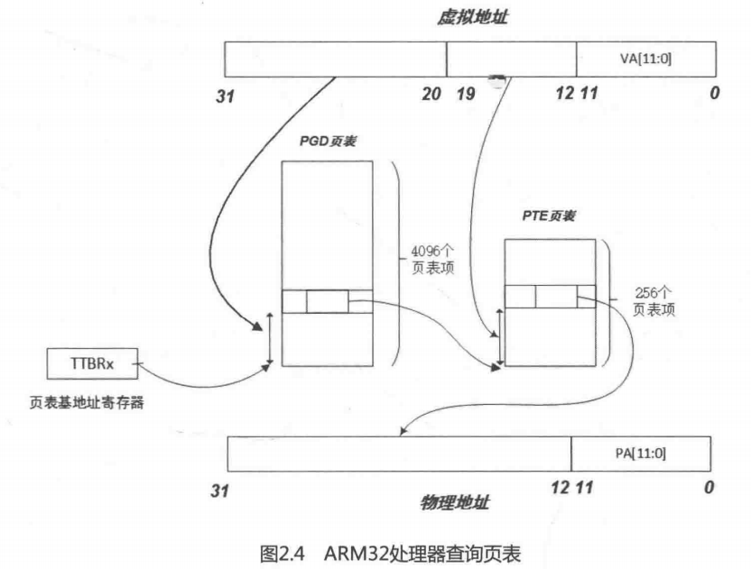

# Linux内核分析(七)——页表的映射过程

## 1. ARM32 页表映射

- 在 32bit 的Linux内核中一般采用3层的映射模型，第1层是页全局目录（Page Global Directory，PGD），第2层是页中间目录（Page Middle Directory，PMD），第3层是页面映射表（Page Table Entry，PTE）。
- ARM32系统中只用到两层映射，因此在实际代码中就要在3层的映射模型中合并1层。

### 1.1 段式映射

- 在ARM32架构中，可以按段（section）来映射，这时采用单层映射模式。在单层映射模式下，内存中有个段映射表，表中有4096个表项，每个表项的大小是4Byte，所以这个段映射表大小是16KB，而且其位置必须与16KB边界对齐。
- 当CPU访问内存时，32位虚拟地址的高12位 [31:20] 用作访问段映射表的索引，从表中找到相应的表项。每个表项提供了一个12位的物理地址，以及相应的标志位。将这12位物理地址和虚拟地址的低20位拼凑在一起，就得到32位的物理地址。
- 每个段表项可以寻址1MB大小的地址空间。在相同表项的情况下，虚拟地址的后20位恰好可以寻址 2^20，即1M大小的地址空间。

### 1.2 页表映射



- 在ARM32架构中，如果采用页表映射方式，段映射表就变成了一级映射表（First Level table，在Linux内核中成为PGD），其表项提供的不再是物理段地址，而是二级页表的基地址。32位虚拟地址的高 12 位（bit[31 : 20]）作为访问一级页表的索引值，找到相应的表项，每个表项指向一个二级页表的起始地址。以虚拟地址的次 8 位（bit[19 : 12]）作为访问二级页表的索引值，得到相应的页表项，从这个页表项中找到20位的物理页面地址。最后将这20位物理页面地址和虚拟地址的低 12 位拼凑在一起，得到最终的  32 位物理地址。这个过程在ARM32架构中由MMU应将完成，软件不需要介入。


### 1.3 页面映射的实现
- 相关宏设置

  ```c
  /* linux-4.14/arch/arm/include/asm/pgtable-2level.h */
  
  81  /*
  82   * PMD_SHIFT determines the size of the area a second-level page table can map
  83   * PGDIR_SHIFT determines what a third-level page table entry can map
  84   */
  85  #define PMD_SHIFT     21
  86  #define PGDIR_SHIFT       21
  87  
  88  #define PMD_SIZE      (1UL << PMD_SHIFT)
  89  #define PMD_MASK      (~(PMD_SIZE-1))
  90  #define PGDIR_SIZE        (1UL << PGDIR_SHIFT)
  91  #define PGDIR_MASK        (~(PGDIR_SIZE-1))
  ```

  PMD_SIZE 宏用于计算由页中间目录的一个单独表项所映射的区域大小;PGDIR_SIZE宏用于计算页全局目录中一个单独表项所能映射区域的大小。

  PGDIR_SHIFT和PMD_SHIFT都被设置成了21，而ARM32架构中一级页表PGD的偏移量应该是20，关于这个问题，后文会具体解释，此处暂时忽略。

- ARM Linux内核的也表映射是通过建立具体内存区间的页面映射来实现的。内存区间通过结构体 map_desc 来描述，具体定义如下：

    ```c
    /* linux-4.14/arch/arm/include/asm/mach/map.h */
    
    17  struct map_desc {
    18  	unsigned long virtual; // 虚拟地址的起始地址
    19  	unsigned long pfn; // 物理地址的起始地址的页帧号
    20  	unsigned long length; // 内存区间长度
    21  	unsigned int type; // 该内存区间的属性
    22  };
    ```

    1. 内存区间的属性通过一个全局的mem_type结构体数组来描述，struct mem_type 定义如下：
    
    ```c
    /* linux-4.14/arch/arm/mm/mm.h */
    42  struct mem_type {
    43  	pteval_t prot_pte; // 用于页面表项的控制位和标志位
    44  	pteval_t prot_pte_s2;
    45  	pmdval_t prot_l1; // 用于一级页面表的控制位和标志位
    46  	pmdval_t prot_sect;
    47  	unsigned int domain; //用于ARM中定义不同的域
    48  };
    ```
    
    全局 mem_type[] 数组描述所有的内存区间类型，其定义如下：
    
    ```c
    /* linux-4.14/arch/arm/mm/mmu.c */
    248  static struct mem_type mem_types[] __ro_after_init = {
    ...
    265  	[MT_DEVICE_CACHED] = {	  /* ioremap_cached */
    266  		.prot_pte	= PROT_PTE_DEVICE | L_PTE_MT_DEV_CACHED,
    267  		.prot_l1	= PMD_TYPE_TABLE,
    268  		.prot_sect	= PROT_SECT_DEVICE | PMD_SECT_WB,
    269  		.domain		= DOMAIN_IO,
    270  	},
    271  	[MT_DEVICE_WC] = {	/* ioremap_wc */
    272  		.prot_pte	= PROT_PTE_DEVICE | L_PTE_MT_DEV_WC,
    273  		.prot_l1	= PMD_TYPE_TABLE,
    274  		.prot_sect	= PROT_SECT_DEVICE,
    275  		.domain		= DOMAIN_IO,
    276  	},
    ...
    305  	[MT_MEMORY_RWX] = {
    306  		.prot_pte  = L_PTE_PRESENT | L_PTE_YOUNG | L_PTE_DIRTY,
    307  		.prot_l1   = PMD_TYPE_TABLE,
    308  		.prot_sect = PMD_TYPE_SECT | PMD_SECT_AP_WRITE,
    309  		.domain    = DOMAIN_KERNEL,
    310  	},
    311  	[MT_MEMORY_RW] = {
    312  		.prot_pte  = L_PTE_PRESENT | L_PTE_YOUNG | L_PTE_DIRTY |
    313  			     L_PTE_XN,
    314  		.prot_l1   = PMD_TYPE_TABLE,
    315  		.prot_sect = PMD_TYPE_SECT | PMD_SECT_AP_WRITE,
    316  		.domain    = DOMAIN_KERNEL,
    317  	},
    ...
    355  };
    ```
    
    
    
    2. ARM中允许使用16个不同的域，但在ARM Linux中只定义和使用3个。
    
    ```c
    /* linux-4.14/arch/arm/include/asm/domain.h */
    41  #define DOMAIN_KERNEL	2 // 用于系统空间
    42  #define DOMAIN_USER	1 // 用于用户空间
    43  #define DOMAIN_IO	0 // 用于I/O地址域，实际上也属于系统空间
    ```
    
    3. `prot_pte` 定义如下：
    
    ```c
    /* linux-4.14/arch/arm/include/asm/pgtable-2level.h */
    120  #define L_PTE_VALID		(_AT(pteval_t, 1) << 0)		/* Valid */
    121  #define L_PTE_PRESENT		(_AT(pteval_t, 1) << 0)
    122  #define L_PTE_YOUNG		(_AT(pteval_t, 1) << 1)
    123  #define L_PTE_DIRTY		(_AT(pteval_t, 1) << 6)
    124  #define L_PTE_RDONLY		(_AT(pteval_t, 1) << 7)
    125  #define L_PTE_USER		(_AT(pteval_t, 1) << 8)
    126  #define L_PTE_XN		(_AT(pteval_t, 1) << 9)
    127  #define L_PTE_SHARED		(_AT(pteval_t, 1) << 10)	/* shared(v6), coherent(xsc3) */
    128  #define L_PTE_NONE		(_AT(pteval_t, 1) << 11)
    
    /* linux-4.14/arch/arm/mm/mmu.c */
    244  #define PROT_PTE_DEVICE		L_PTE_PRESENT|L_PTE_YOUNG|L_PTE_DIRTY|L_PTE_XN
    245  #define PROT_PTE_S2_DEVICE	PROT_PTE_DEVICE
    246  #define PROT_SECT_DEVICE	PMD_TYPE_SECT|PMD_SECT_AP_WRITE
    ```
    
    4. `prot_l1`定义如下：
    
    ```c
    /* linux-4.0/arch/arm/include/asm/pgtable-2level-hwdef.h */
    19  #define PMD_TYPE_MASK		(_AT(pmdval_t, 3) << 0)
    20  #define PMD_TYPE_FAULT		(_AT(pmdval_t, 0) << 0)
    21  #define PMD_TYPE_TABLE		(_AT(pmdval_t, 1) << 0)
    22  #define PMD_TYPE_SECT		(_AT(pmdval_t, 2) << 0)
    23  #define PMD_PXNTABLE		(_AT(pmdval_t, 1) << 2)     /* v7 */
    24  #define PMD_BIT4		(_AT(pmdval_t, 1) << 4)
    25  #define PMD_DOMAIN(x)		(_AT(pmdval_t, (x)) << 5)
    26  #define PMD_PROTECTION		(_AT(pmdval_t, 1) << 9)		/* v5 */
    ```
    
    以上便是整个`map_desc`数据结构，其完整地描述了一个内存区间。

- create_mapping

  1. `create_mapping()`函数就是为一个给定的内存区间建立页面映射，其上层调用流程为：`start_kernel()->setup_arch()->paging_init()->map_lowmem()->create_mapping()`，具体调用细节，感兴趣的可以在代码中进行跟踪，此处不做详细

     其定义如下：

     ```c
     /* linux-4.14/arch/arm/mm/mmu.c */
     911  static void __init __create_mapping(struct mm_struct *mm, struct map_desc *md,
     912  				    void *(*alloc)(unsigned long sz),
     913  				    bool ng)
     914  {
     915  	unsigned long addr, length, end;
     916  	phys_addr_t phys;
     917  	const struct mem_type *type;
     918  	pgd_t *pgd;
     919  
     920  	type = &mem_types[md->type];
     921  
     922  #ifndef CONFIG_ARM_LPAE
     923  	/*
     924  	 * Catch 36-bit addresses
     925  	 */
     926  	if (md->pfn >= 0x100000) {
     927  		create_36bit_mapping(mm, md, type, ng);
     928  		return;
     929  	}
     930  #endif
     931  
     932  	addr = md->virtual & PAGE_MASK;
     933  	phys = __pfn_to_phys(md->pfn);
     934  	length = PAGE_ALIGN(md->length + (md->virtual & ~PAGE_MASK));
     935  
     936  	if (type->prot_l1 == 0 && ((addr | phys | length) & ~SECTION_MASK)) {
     937  		pr_warn("BUG: map for 0x%08llx at 0x%08lx can not be mapped using pages, ignoring.\n",
     938  			(long long)__pfn_to_phys(md->pfn), addr);
     939  		return;
     940  	}
     941  
     942  	pgd = pgd_offset(mm, addr);
     943  	end = addr + length;
     944  	do {
     945  		unsigned long next = pgd_addr_end(addr, end);
     946  
     947  		alloc_init_pud(pgd, addr, next, phys, type, alloc, ng);
     948  
     949  		phys += next - addr;
     950  		addr = next;
     951  	} while (pgd++, addr != end);
     952  }
     ...
     961  static void __init create_mapping(struct map_desc *md)
     962  {
     963  	if (md->virtual != vectors_base() && md->virtual < TASK_SIZE) {
     964  		pr_warn("BUG: not creating mapping for 0x%08llx at 0x%08lx in user region\n",
     965  			(long long)__pfn_to_phys((u64)md->pfn), md->virtual);
     966  		return;
     967  	}
     968  
     969  	if ((md->type == MT_DEVICE || md->type == MT_ROM) &&
     970  	    md->virtual >= PAGE_OFFSET && md->virtual < FIXADDR_START &&
     971  	    (md->virtual < VMALLOC_START || md->virtual >= VMALLOC_END)) {
     972  		pr_warn("BUG: mapping for 0x%08llx at 0x%08lx out of vmalloc space\n",
     973  			(long long)__pfn_to_phys((u64)md->pfn), md->virtual);
     974  	}
     975  
     976  	__create_mapping(&init_mm, md, early_alloc, false);
     977  }
     ```

     