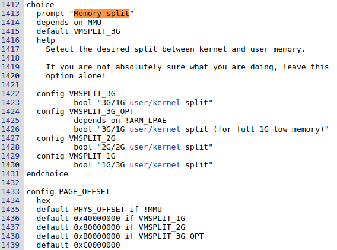
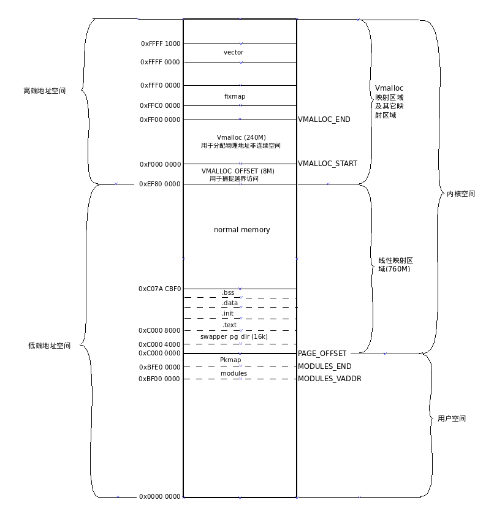
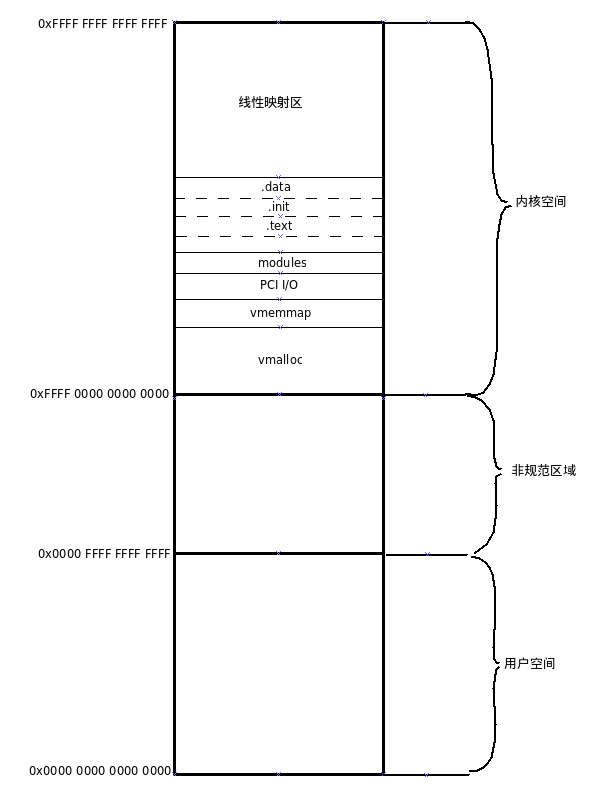
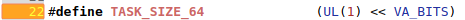
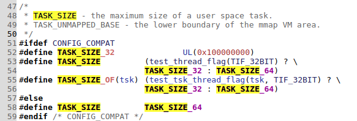
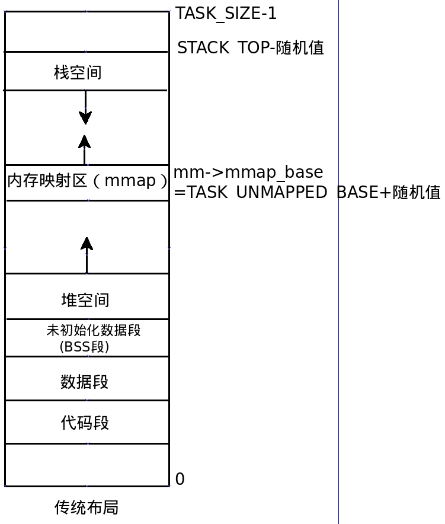
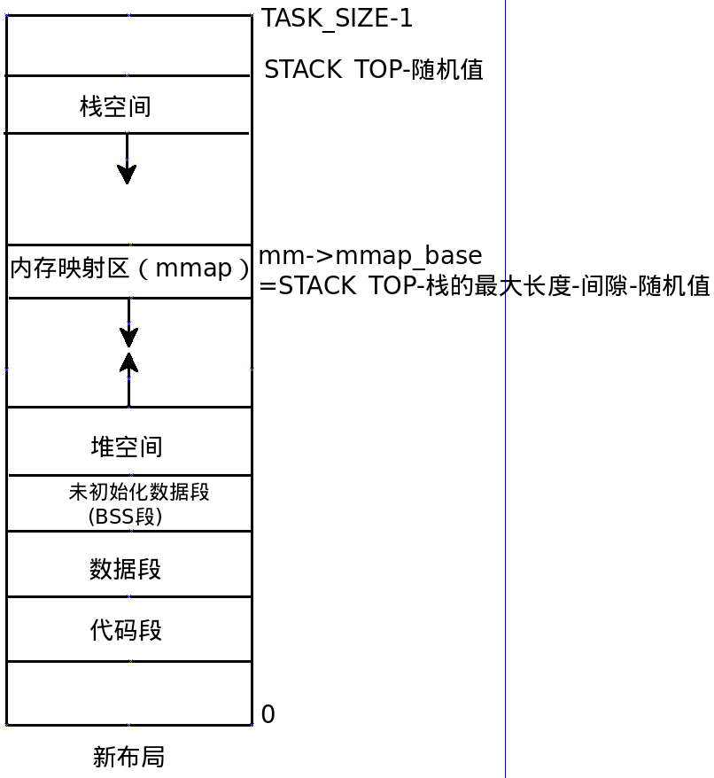

# Linux内核分析（三）——虚拟地址空间布局
## 1. 虚拟地址空间划分

### 1.1 ARM32架构Linux内核

- 在32bit Linux中，一共能使用的虚拟地址空间是4GB（2^32），用户空间和内核空间的划分通常是按照3:1来划分的，也可以按照2:2来划分，调整内核空间和用户空间的大小划分的具体配置如下[linux-4.14/arch/arm/Kconfig]：

- Arm32架构内存分布如下：

### 1.2 ARM64架构Linux内核

- 对于ARM64架构处理器来说，目前应用程序没有那么大的内存需求，所以不需要支持完全的64位虚拟地址， 实际支持情况如下：
    1. 目前基于ARMv8-A架构的处理器，虚拟地址的最大宽度是48位，如下图，内核虚拟地址在64位地址空间的顶部，高16位全部为1,范围是[0xFFFF 0000 0000 0000, 0xFFFF FFFF FFFF FFFF]，用户虚拟地址在64位地址空间的底部，高16位全部为0, 范围是[0x0000 0000 0000 0000, 0x0000 FFFF FFFF FFFF],高16位是全1或是全0的地址称为规范的地址，两者之间的是不规范的地址，不允许使用。
    2. 如果处理器实现了ARMv8.2标准的大虚拟地址（Large Virtual Address,LVA）支持，并且页长度是64KB，那么虚拟地址的最大宽度是52位。
    3. 可以为虚拟地址配置比最大宽度小的宽度，并且可以为内核虚拟地址和用户虚拟地址配置不同的宽度。转换控制寄存器（Translation Control Register）TCR——EL1的字段T0SZ定义了必须是全0的最高位的数量，字段T1SZ定义了必须是全1的最高位的数量。用户虚拟地址的宽度是（64-TCR_EL1.T0SZ），内核虚拟地址的宽度是（64-TCR_EL1.T1SZ）。
    4. 在ARM64架构的Linux内核中，内核虚拟地址和用户虚拟地址的宽度相同。所有进程共享内核虚拟地址空间，每个进程有独立的用户虚拟地址空间，同一个线程组的用户线程共享用户虚拟地址空间，内核线程没有用户虚拟地址空间。

## 2. 用户虚拟地址空间布局

### 2.1 相关宏解释

1. VA_BITS: 编译内核时选择的虚拟地址位数，一般只针对arm64。

   - VA_BITS 定义在 [linux-4.14/arch/arm64/include/asm/memory.h]:

   - CONFIG_ARM64_VA_BITS定义在[linux-4.14/arch/arm64/configs/***_defconfig]，例如arch/arm64/configs/sprd_roc1_defconfig：

     可见，在sprd_roc1_defconfig中，虚拟地址位数为39位。

2. CONFIG_COMPAT：支持执行32位用户空间程序，定义[arch/arm64/configs/sprd_roc1_defconfig]:	

3. TASK_SIZE: 进程的用户虚拟地址空间长度。

   - TASK_SIZE定义在 [arch/arm64/include/asm/processor.h]：

   - test_thread_flag(TIF_32BIT)：判断用户空间程序是不是32位，TIF_32BIT定义在 [arch/arm64/include/asm/thread_info.h]：

### 2.2 用户虚拟地址空间区域

1. 进程的用户虚拟地址空间包含以下区域：

> - 代码段、数据段和未初始化数据段；
> - 动态库的代码段、数据段和未初始化数据段；
> - 存放动态生成的数据的堆；
> - 存放局部变量和实现函数调用的栈；
> - 存放在栈底部的环境变量和参数字符串；
> - 把文件区间映射到虚拟地址空间的内存映射区域。

2. 用户虚拟地址空间布局:

   - 内核使用内存描述符mm_struct描述进程的用户虚拟地址空间，该结构体定义在`linux-4.14/include/linux/mm_types.h`， 其成员变量 `unsigned long mmap_base`指定了内存映射区域的起始地址。用户虚拟地址空间有两种布局，区别是内存映射区域的起始位置和增长方向不同。

   - 传统布局

     ​       内存映射区域自底向上增长，起始地址是`TASK_UNMAPPED_BASE`，每种处理器架构都要定义这个宏，ARM64架构定义为TASK_SIZE/4。默认启用内存映射区域随机化，需要把起始地址加上一个随机值。传统布局的缺点是堆的最大长度受到限制，在32位系统中影响比较大，而64位系统中这不是问题。

   - 新布局

     ​       内存映射区域自顶向下增长，起始地址是（STACK_TOP-栈的最大长度-间隙）。默认启用内存映射区域随机化，需要把起始地址减去一个随机值。

     

## 3. 内核地址空间布局

