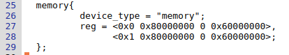
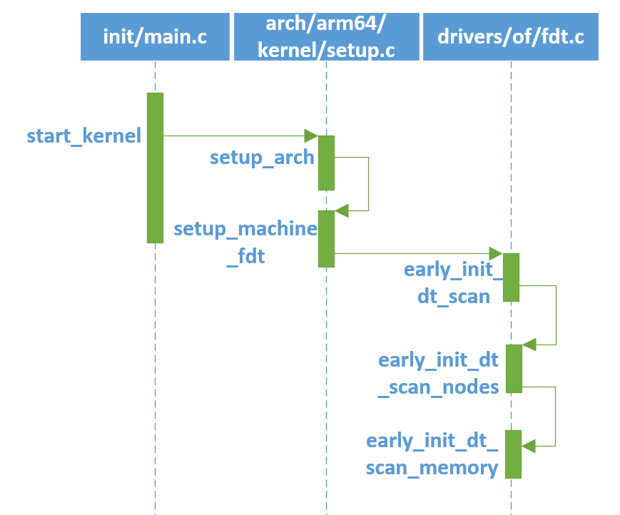

# Linux内核分析（二）——内存

## 1. 物理内存初始化

- 从硬件角度来看内存，随机存储器（RAM）是与CPU直接交换数据的内部存储器。目前大部分计算机都使用DDR的存储设备。DDR的初始化一般是在BIOS或bootloader中，BIOS或bootloader把DDR的大小传递给Linux内核，因此从Linux内核角度来看，DDR其实就是一段物理内存空间。

### 1.1 内存管理概述

- 内存空间分为3个层次：用户空间层、内核空间层、硬件层。
  1. 用户空间层，可以理解为Linux内核内存管理为用户空间暴露的系统调用接口。
  2. 内核空间层，包含的模块相当丰富。用户空间和内核空间的接口是系统调用，因此内核空间层首先需要处理这些内存管理相关的系统调用，例如sys_brk、sys_mmap、sys_madvise等。接下来就包括VMA管理、缺页中断管理、匿名页面、page cache、页面回收、反向映射、slab分配器、页面管理等模块了。
  3. 硬件层，包括处理器的MMU、TLB、cache部件，以及板载的物理内存，例如LPDDR或者DDR。

### 1.2 内核内存大小

- 内核内存定义：

  1. Linux-4.14/arch/arm/boot/dts/vexpress-v2p-ca9.dts               
  2. linux-4.14/arch/arm64/boot/dts/sprd/sp9860g-1h10.dts
  3. 以上分别为arm32、arm64内核内存定义，vexpress-v2p-ca9.dts文件中定义了内核内存的起始地址为0x6000 0000， 大小为0x4000 0000，即1G大小的的内存空间。注意，此处的起始地址为物理地址。
  4. arm32、arm64内存定义因为地址位数不同稍有不同，具体可参考Linux设备树中节点的定义等相关知识，如https://www.linuxidc.com/Linux/2016-01/127337p6.htm

### 1.3 内核内存解析

1. 内核在启动的过程中，需要解析DTS（vexpress-v2p-ca9.dts、sp9832e-1h10.dts）文件，相关代码调用如下：

   

2. 函数解析

   - linux-4.14/init/main.c

     ​		start_kernel(void) -> setup_arch(&command_line)，调用setup_arch函数，传给他的参数是未被初始化的内部变量command_line。

   ```c
   513  asmlinkage __visible void __init start_kernel(void)
   514  {
   515  	char *command_line;
   ...
   534  	setup_arch(&command_line);
   ...
   710  }
   ```

   - linux-4.14/[arch/arm/kernel/setup.c

     ​		setup_arch(&command_line) -> setup_machine_fdt(__atags_pointer)，这个setup_arch()函数是start_kernel阶段最重要的一个函数，每个体系都有自己的setup_arch()函数，是体系结构相关的，具体编译哪个体系的setup_arch()函数，由顶层Makefile中的ARCH变量决定。

   ```c
   1074  void __init setup_arch(char **cmdline_p)
   1075  {
   1076  	const struct machine_desc *mdesc;
   1077  
   1078  	setup_processor();
   1079  	mdesc = setup_machine_fdt(__atags_pointer);
   		...
   405  }
   ```

   ​		参数__atags_pointer是bootloader传递过来的，代表devicetree在内存中的地址，一般为0x68000000。

   - linux-4.14/arch/arm/kernel/devtree.c

     setup_machine_fdt(__atags_pointer) -> early_init_dt_scan(phys_to_virt(dt_phys))

   ```C
   218  const struct machine_desc * __init setup_machine_fdt(unsigned int dt_phys)
   219  {
   ...  
   231  	if (!dt_phys || !early_init_dt_verify(phys_to_virt(dt_phys)))
   232  		return NULL;
   ...
   260  	early_init_dt_scan_nodes();
   ...
   266  }
   ```

   ​		phys_to_virt() 函数将物理地址转化为虚拟地址。dt_phys为0x68000000时，转化为虚拟地址0xc8000000。early_init_dt_verify()函数主要检测设备树的有效性（主要做一些设备树头的检查，设备树相关数据的校验），如下：linux-4.14/drivers/of/fdt.c

   ```c
   1254  bool __init early_init_dt_verify(void *params)
   1255  {
   1256  	if (!params)
   1257  		return false;
   1258  
   1259  	/* check device tree validity */
   1260  	if (fdt_check_header(params))
   1261  		return false;
   1262  
   1263  	/* Setup flat device-tree pointer */
   1264  	initial_boot_params = params;
   1265  	of_fdt_crc32 = crc32_be(~0, initial_boot_params,
   1266  				fdt_totalsize(initial_boot_params));
   1267  	return true;
   1268  }
   ```

   

   - linux-4.14/drivers/of/fdt.c

     early_init_dt_scan_nodes() -> early_init_dt_scan_memory，early_init_dt_scan_nodes()函数实现三部分功能，具体如代码中的注释所述。

   ```c
   1271  void __init early_init_dt_scan_nodes(void)
   1272  {
   1273  	/* Retrieve various information from the /chosen node */
       	/*  扫描 /chosen node，保存运行时参数（bootargs）到boot_command_line，此外，还处理initrd相关的property，并保存在initrd_start和initrd_end这两个全局变量中 */
   1274  	of_scan_flat_dt(early_init_dt_scan_chosen, boot_command_line);
   1275  
   1276  	/* Initialize {size,address}-cells info */
       	/* 扫描根节点，获取 {size,address}-cells信息，并保存在dt_root_size_cells和dt_root_addr_cells全局变量中 */ 
   1277  	of_scan_flat_dt(early_init_dt_scan_root, NULL);
   1278  
   1279  	/* Setup memory, calling early_init_dt_add_memory_arch */
       	/* 扫描DTB中的memory node，并把相关信息保存在meminfo中，全局变量meminfo保存了系统内存相关的信息。*/ 
   1280  	of_scan_flat_dt(early_init_dt_scan_memory, NULL);
   1281  }
   ```

   

   - of_scan_flat_dt函数是用来scan整个device  tree，针对每一个node调用callback函数。"of_scan_flat_dt(early_init_dt_scan_memory, NULL)"针对memory node进行scan。 

   ```c
   737  int __init of_scan_flat_dt(int (*it)(unsigned long node,
   738  				     const char *uname, int depth,
   739  				     void *data),
   740  			   void *data)
   741  {
   742  	const void *blob = initial_boot_params;
   743  	const char *pathp;
   744  	int offset, rc = 0, depth = -1;
   745  
   746  	if (!blob)
   747  		return 0;
   748  
   749  	for (offset = fdt_next_node(blob, -1, &depth);
   750  	     offset >= 0 && depth >= 0 && !rc;
   751  	     offset = fdt_next_node(blob, offset, &depth)) {
   752  
   753  		pathp = fdt_get_name(blob, offset, NULL);
   754  		if (*pathp == '/')
   755  			pathp = kbasename(pathp);
       		/*此处调用的回调函数是early_init_dt_scan_memory，即扫描dtb中的所有device_type = “memory”的节点*/
   756  		rc = it(offset, pathp, depth, data);
   757  	}
   758  	return rc;
   759  }
   ```

   

   - linux-4.14/drivers/of/fdt.c

     early_init_dt_scan_memory函数查找dtb中内存节点（device_type = “memory”的节点）。并将该节点的reg属性值（<base, size>数组）中的base/size值保存在memblock中（early_init_dt_add_memory_arch函数），注意，此处添加的内存起始地址是物理内存。

   ```c
   1061  int __init early_init_dt_scan_memory(unsigned long node, const char *uname,
   1062  				     int depth, void *data)
   1063  {
   1064  	const char *type = of_get_flat_dt_prop(node, "device_type", NULL);
   1065  	const __be32 *reg, *endp;
   1066  	int l;
   1067  	bool hotpluggable;
   1068  
   1069  	/* We are scanning "memory" nodes only */
   1070  	if (type == NULL) {
   1071  		/*
   1072  		 * The longtrail doesn't have a device_type on the
   1073  		 * /memory node, so look for the node called /memory@0.
   1074  		 */
   1075  		if (!IS_ENABLED(CONFIG_PPC32) || depth != 1 || strcmp(uname, "memory@0") != 0)
   1076  			return 0;
   1077  	} else if (strcmp(type, "memory") != 0)
   1078  		return 0;
   1079  
   1080  	reg = of_get_flat_dt_prop(node, "linux,usable-memory", &l);
   1081  	if (reg == NULL)
   1082  		reg = of_get_flat_dt_prop(node, "reg", &l);
   1083  	if (reg == NULL)
   1084  		return 0;
   1085  
   1086  	endp = reg + (l / sizeof(__be32));
   1087  	hotpluggable = of_get_flat_dt_prop(node, "hotpluggable", NULL);
   1088  
   1089  	pr_debug("memory scan node %s, reg size %d,\n", uname, l);
   1090  
   1091  	while ((endp - reg) >= (dt_root_addr_cells + dt_root_size_cells)) {
   1092  		u64 base, size;
   1093  
   1094  		base = dt_mem_next_cell(dt_root_addr_cells, &reg);
   1095  		size = dt_mem_next_cell(dt_root_size_cells, &reg);
   1096  
   1097  		if (size == 0)
   1098  			continue;
   1099  		pr_debug(" - %llx ,  %llx\n", (unsigned long long)base,
   1100  		    (unsigned long long)size);
   1101  
   1102  		early_init_dt_add_memory_arch(base, size);
   1103  
   1104  		if (!hotpluggable)
   1105  			continue;
   1106  
   1107  		if (early_init_dt_mark_hotplug_memory_arch(base, size))
   1108  			pr_warn("failed to mark hotplug range 0x%llx - 0x%llx\n",
   1109  				base, base + size);
   1110  	}
   1111  
   1112  	return 0;
   1113  }
   ```

   ​		early_init_dt_add_memory_arch(base, size)最终调用memblock_add(base, size)将内存添加到到memblock子系统中进行管理。

   ​		memblock内存管理机制用于在Linux启动后管理内存，一直到free_initmem()为止。之后totalram_pages就稳定在一个数值。至于memblock具体介绍，可百度搜索，此处不再具体叙述。