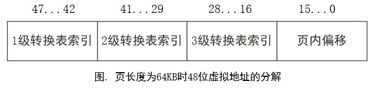
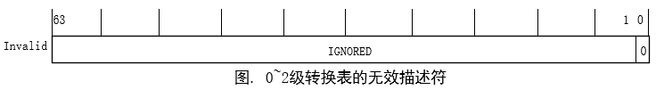
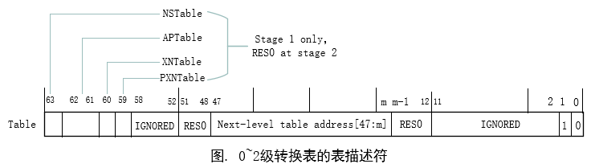
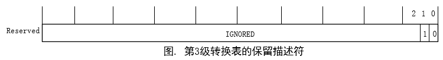
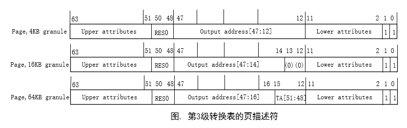

# Linux内核分析(五)——页表

## 1. 统一的页表框架

- 页表用来把虚拟页映射到物理页，并且存放页的保护位，即访问权限。在Linux 4.11版本之前，Liinux内核吧页表分为4级：

  > 1. 页全局目录（Page Global Directory，PGD）
  > 2. 页上层目录（Page Upper Directory，PUD）
  > 3. 页中间目录（Page Middle Directory，PMD）
  > 4. 直接页表（Page Table， PT）

  4.11 版本把页表扩展到五级，在页全局目录和页上层目录之间增加了页四级目录（Page 4th Directory，P4D）。

- 各种处理器架构可以选择使用五级、四级、三级或两极页表，同一种处理器架构在页长度不同的情况下可能选择不同的页表级数。可以使用配置宏 CONFIG_PGTABLE_LEVELS 配置页表级数，一般使用默认值。

- 如果选择四级页表，那么使用页全局目录、页上层目录、页中间目录和直接页表；如果选择三级页表，那么使用页全局目录、页中间目录和直接页表；如果选择两级页表，那么使用页全局目录和直接页表；

- 如果不使用页中间目录，那么内核在头文件“include/asm-generic/pgtable-nopmd.h”中模拟页中间目录，调用函数pmd_offset()根据页上层目录表项和虚拟地址获取页中间目录表项的时候，直接把页上层目录表项指针强制转换成页中间目录表项指针并返回，访问页中间目录表项实际上是访问页上层目录表项。

  ```c
  /* linux-4.14/include/asm-generic/pgtable-nopmd.h */
  
  18  typedef struct { pud_t pud; } pmd_t;
  ...
  44  static inline pmd_t * pmd_offset(pud_t * pud, unsigned long address)
  45  {
  46  	return (pmd_t *)pud;
  47  }
  ```

  ​        同样，如果不使用页上层目录，那么内核在头文件“include/asm-generic/pgtable-nopud.h”中模拟页上层目录。如果不使用页四级目录，那么内核在头文件“include/asm-generic/pgtable-nop4d.h”中模拟页四级目录。

  

## 2. 五级页表结构

 

- 每个进程有独立的页表，进程的mm_struct实例的成员pgd指向页全局目录，前面四级页表的表项存放下一级页表的起始地址，直接页表的表项存放页帧号（Page Frame Number，PFN）。

- 内核也有一个页表，0号内核线程的进程描述符 init_task 的成员 active_mm 指向内存描述符 init_mm，内存描述符 init_mm 的成员 pgd 指向内核的页全局目录 swapper_pg_dir。

- 虚拟地址被分解为6个部分：页全局目录索引、页四级目录索引、页上层目录索引、页中间目录索引、直接页表索引和业内偏移。

- 查询页表，把虚拟地址转换成物理地址的过程如下：

  > 1. 根据页全局目录的起始地址和页全局目录索引得到页全局目录表项的地址，然后从表项得到页四级目录的起始地址；
  > 2. 根据页四级目录的起始地址和页四级目录索引得到页四级目录表项的地址，然后从表项得到页上层目录的起始地址；
  > 3. 根据页上层目录的起始地址和页上层目录索引得到页上层目录表项的地址，然后从表项得到页中间目录的起始地址；
  > 4. 根据页中间目录的起始地址和页中间目录索引得到页中间目录表项的地址，然后从表项得到直接页表的起始地址；
  > 5. 根据直接页表的起始地址和直接页表索引得到直接页表表项的的地址，然后从表项得到页帧号；
  > 6. 把页帧号和页内偏移组合成物理地址。


## 3. 页表相关宏定义

- 内核定义了各级页表索引在*虚拟地址*中的偏移：

  > 1. PAGE_SHIFT：页内偏移的位数，也是直接页表索引的偏移；
  > 2. PMD_SHIFT：页中间目录索引的偏移；
  > 3. PUD_SHIFT：页上层目录索引的偏移；
  > 4. P4D_SHIFT：页四级目录索引的偏移；
  > 5. PGDIR_SHIFT：页全局目录索引的偏移

  

- 内核定义了各级页表表项描述的地址空间的大小：

  > 1. PGDIR_SIZE：页全局目录表项映射的地址空间的大小；
  > 2. P4D_SIZE：页四级目录表项映射的地址空间的大小；
  > 3. PUD_SIZE：页上层目录表项映射的地址空间的大小；
  > 4. PMD_SIZE：页中间目录表项映射的地址空间的大小；
  > 5. PAGE_SIZE：直接页表项映射的地址空间的大小，也是页长度；

  

- 内核定义了各级页表能存放的指针数量，即表项数量：

  > 1. PTRS_PER_PGD：页全局目录的表项数量；
  > 2. PTRS_PER_P4D：页四级目录的表项数量；
  > 3. PTRS_PER_PUD：页上层目录的表项数量；
  > 4. PTRS_PER_PMD：页中间目录的表项数量；
  > 5. PTRS_PER_PTE：直接页表的表项数量；

  

- 内核定义了各级页表占用的页的阶数：

  > 1. PGD_ORDER：页全局目录占用的页的阶数；
  > 2. P4D_ORDER：页四级目录占用的页的阶数；
  > 3. PUD_ORDER：页上层目录占用的页的阶数；
  > 4. PMD_ORDER：页中间目录占用的页的阶数；
  > 5. PTE_ORDER：直接页表占用的页的阶数；

  

- 内核定义了各级页表表项的的数据结构：

  > 1. pgd_t：页全局目录表项的数据结构；
  > 2. p4d_t：页四级目录表项的数据结构；
  > 3. pud_t：页上层目录表项的数据结构；
  > 4. pmd_t：页中间目录表项的数据结构；
  > 5. pte_t：直接页表项的数据结构；

  这些数据结构通常是只包含一个无符号长整型的结构体，例如页全局目录表项的数据结构定义如下：`typedef unsigned long pgd_t;`

  

- 以页全局目录为例，内核定义了以下宏和内联函数：

  > 1. 宏 pgd_val() 用来把 pgd_t 类型转换成无符号长整型：`#define pgd_val(x)	((x).pgd)`
  > 2. 宏 `__pgd()` 用来把无符号长整型转换成 pgd_t 类型：`#define __pgd(x) ((pgd_t) { (x) })`
  > 3. 宏 `pgd_index(address)` 用来从虚拟地址分解出页全局目录索引：`#define pgd_index(addr)	(((addr) >> PGDIR_SHIFT) & (PTRS_PER_PGD - 1))`
  > 4. 宏`pgd_offset(mm, addr)`用来返回指定进程的虚拟地址对应的页全局目录表项的地址。内核定义了宏`pgd_offset_k(addr)`，用来在内核的页全局目录找到虚拟地址对应的表项：`#define pgd_offset_k(addr)	pgd_offset(&init_mm, addr)`
  > 5. 内联函数`pgd_none(pgd)`用来判断页全局目录表项是空表项，空表项没有指向下一级页表，如果是空表项，那么返回非零值。
  > 6. 内联函数`pgd_present(pgd)`用来判断页全局目录是否存在，即是否指向下一级页表，如果表项指向下一级页表，那么返回非零值。


- 前四级页表的表项存放下一级页表的起始地址，直接页表的表项存放页帧号和标志位。大多数处理器支持的最小页长度是4KB，有些处理器支持1KB的页长度，可以使用页帧号以外的位作为标志位。

  ​        不同处理器架构的页表项的格式不同，为了屏蔽差异性，每种处理器架构自定义访问的宏或内联函数：宏 `pte_pfn(x)`从（直接页表）页表项取出页帧号，宏 `pfn_pte(pfn, prot)` 把页帧号和标志位组合成页表项。

  ​		有些标志位是要求每种处理器架构都必须实现的，每种处理器架构定义宏或内联函数来访问这些标志位，例如：

  > 1. `pte_present(pte)` 检查页是否在内存中，如果不在内存中，说明页被换出到交换区；
  > 2. `pte_write(pte)` 检查页是否可写；
  > 3. `pte_young(pte)` 检查页是否被访问过；
  > 4. `pte_dirty(pte)` 检查页是不是脏的，即页的数据是不是被修改过；

  ​		各种处理器架构也可以定义私有的标志位。

  

## 4. 页帧号

- 如果物理地址空间按4KB（4096字节）划分页，无论页是有效还是无效的，都把每一页按从低到高的顺序进行编号，我们称为页帧号。物理内存地址空间越大，页帧号也就越大。32位操作系统4GB 物理地址空间的页帧号范围是0—0xfffff。
- 由于页帧号范围是0—0xfffff，使用20 位便可以记录。编号的目的是什么呢？特定的页帧号代表特定的物理地址空间，空间大小是4096 字节。对于物理地址范围0x00003000—0x00003fff，我们直接用页帧号3 去表示就行。除此之外，我们可以对某页设定一些属性标志，比如这个页是否是有效的内存，是否可以写，是否被访问过等。页帧号加属性标志就能表明一个页大小的内存情况。


## 5. ARM64处理器的页表

- ARM64处理器把页表称为转换表（translation table），最多4级。ARM64处理器支持3中页长度：4KB、16KB、64KB。页长度和虚拟地址的宽度决定了转换表的级数，如果虚拟地址的宽度是48位，页长度和转换表级数的关系如下所示。

  > 1. 页长度是4KB：使用4级页表，转换表和内核的页表术语对应关系是：0级转换表对应页全局目录，1级转换表对应页上层目录，2级转换表对应页中间目录，3级转换表对应直接页表。48位虚拟地址分解如下图所示：
  >
  >    每级转换表占用一页，有512 (2^9)项，索引是48位地址的9个位。
  >
  > 2. 页长度是16KB：使用4级转换表，转换表和内核的页表术语对应关系是：0级转换表对应页全局目录，1级转换表对应页上层目录，2级转换表对应页中间目录，3级转换表对应直接页表。48位虚拟地址分解如下图所示：
  >
  >    0级转换表有2项，索引是48位虚拟地址的最高位；其他转换表占用一页，有2048（2^11）项，索引是48位虚拟地址的11个位。
  >
  > 3. 页长度是64KB：使用3级页表，转换表和内核的页表术语的对应关系是：1级转换表对应页全局目录，2级转换表对应页中间目录，3级转换表对应直接页表。48位虚拟地址分解如下图所示：
  >
  >    1级转换表有64（2^6）项，索引是48位虚拟地址的最高6位；其他转换表占用一页，有8192（2^13）项，索引是48位虚拟地址的13个位。


- ARM64处理器把表项称为描述符（descriptor），使用64位的长描述符格式。描述符的第0位指示描述符是不是有效的；0表示无效，1表示有效；第1位指定描述符类型，如下：

  > 1. 在第0~2级转换表中，0表示块（block）描述符，1表示表（table）描述符。块描述符存放一个内存块（即巨型页）的起始地址，表描述符存放下一级转换表的地址。
  > 2. 在第3级转换表中，0表示保留描述符，1表示页描述符。


- 第0~2级转换表的描述符分为3种：

  > 1. 无效描述符：无效描述符的第0位是0，格式如下图：
  >
  > 2. 块描述符：块描述符的最低两位是 01，当虚拟地址的位数是48时，块描述符的格式如下图：
  >
  >    n的取值：如果页长度是4KB，那么1级描述符的n是30，2级描述符的n是21；如果页长度是16KB，那么2级描述符的n是25；如果页长度是64KB，那么2级描述符的n是29。
  >
  > 3. 表描述符：表描述符的最低两位是 11，当虚拟地址的位数是48时，表描述符的格式如下图：
  >
  >    m的取值：如果页长度是4KB，m是12；如果页长度是16KB，m是14；如果页长度是64KB，m是16。
  >
  >    注意 ”下一级表地址“是下一级转换表的物理地址。使用物理地址，而不使用虚拟地址，是因为ARM64处理器支持转换表遍历（translation table walk）：当ARM64处理器的内存管理单元需要把虚拟地址转换成物理地址时，首先在页表缓存中匹配虚拟地址，如果没有匹配，那么处理器访问内存中的转换表，把最后一级转换表项复制到页表缓存。使用物理地址，可以避免处理器访问内存中的转换表时需要把转换表的虚拟地址转换成物理地址。


- 第3级转换表的描述符分为3种

  > 1. 无效描述符：无效描述符的第0位是0，格式如下图：
  > 2. 保留描述符：保留描述符的最低两位是01，现在没有使用，保留给将来使用，格式如下图：
  > 3. 页描述符：页描述符最低两位是11，当虚拟地址的位数是48时，页长度分别为4KB、16KB和64KB的页描述符的格式如下图：


- 在块描述符和页描述符中，内存属性被拆分成一个高属性块和一个低属性块，如下图：

  > 1. 第59~62位：基于页的硬件属性（Page-Based Hardware Attributes，PBHA），如果有实现ARMv8.2-TTPBHA，忽略。
  > 2. 第55~58位：保留给软件使用。
  > 3. 第54位：在异常级别0，表示UXN（Unprivileged execute-Never），即不允许异常级别0执行内核代码；在其他异常级别，表示XN（execute-Never），不允许执行。
  > 4. 第53位：PXN（Privileged execute-Never），不允许在特权级别（即异常级别1/2/3）执行。
  > 5. 第52位：连续（Contiguous），指示这条转换表项属于一个连续表项集合，一个连续表项集合可以被缓存在一条TLB表项里面。
  > 6. 第51位：脏位修饰符（Dirty Bit Modifier，DBM），指示页或内存块是否被修改过。
  > 7. 第11位：非全局（not global，nG）。nG位是1，表示转换不是全局的，是进程私有的，有一个关联的地址空间标识符（Address Space Identifier，ASID）；nG位是0，表示转换时全局的，是所有进程共享的，内核的页或内存块是所有进程共享的。
  > 8. 第10位：访问标志（Access Flag，AF），指示页或内存块自从相应的转换表描述符中的访问标志被设置为0以后是否被访问过。
  > 9. 第8~9位：可共享性（SHareability，SH），00表示不共享，01是保留值，10表示外部共享，11表示内部共享。
  > 10. 第6~7位：AP[2 ：1]（Data Access Permission，数据访问权限），在阶段1 转换中，AP[2]用来选择只读或读写，1 表示只读，0 表示读写；AP[1] 用来选择是否允许异常级别 0 访问，1 表示允许异常级别 0 访问，0 表示不允许异常级别 0 访问。在非安全异常级别 1 和 0 转换机制的阶段 2 转换中， AP[2 ：1] 为 00 表示不允许访问，01 表示只读，10 表示只写， 11 表示读写。
  > 11. 第5位：非安全（Non-Secure，NS）。对于安全状态的内存访问，指定输出地址在安全地址映射还是非安全地址映射。
  > 12. 第2~4位：内存属性索引（memory attributes index，AttrIndex），指定及寄存器MAIR_ELx中内存属性字段的索引，内存属性间接寄存器（Memory Attribute Indirection Register，MAIR_ELx）有8个8位内存属性字段：`Attr<n>`，n等于 0~7。