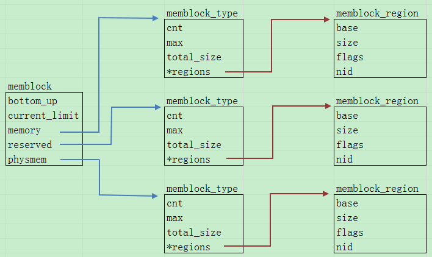
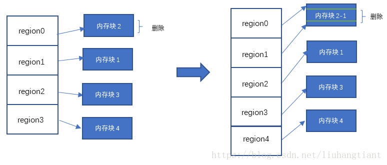
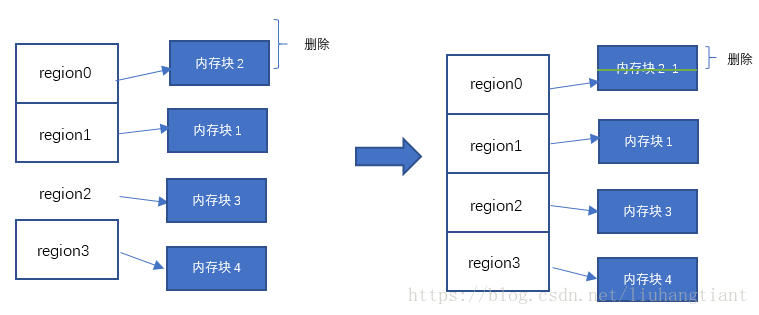

# 初期内存分配器——memblock

## 1. memblock

- 系统初始化的时候`buddy`系统（伙伴系统），`slab`分配器等并没有被初始化，当需要执行一些内存管理、内存分配的任务，就引入了一种内存管理器`bootmem`分配器。

- 当`buddy`系统和`slab`分配器初始化结束后，在`mem_init()`中对`bootmem`分配器进行释放，内存管理与分配由`buddy`系统，`slab`分配器等进行接管。

- 而`memblock`是用来替代`bootmem`的新接口。`memblock`用于开机阶段的内存管理。
- 内存中的某些部分是永久的分配给内核的，比如内核代码段和数据段，`ramdisk`和`fdt`占用的空间等。它们是系统内存的一部分，但是不能被侵占，也不参与内存分配，称之为静态内存；还有，`GPU`、`Camera`等都需要预留大量连续内存，这部分内存平时不用，但是系统必须提前预留好，称之为预留内存；最后，内存的其余部分称之为动态内存，是需要内存管理的宝贵资源。
- 在开机阶段内存以内存区块来管理，`memblock`把物理内存划分为若干内存区块，内存区块由结构体`struct memblock_region`来描述，`Memblock`中有两种内存类型, `memory`和`reserved`，`memory`用于记录总的内存资源，`reserved`用于记录已经使用或者预留的内存资源。

  

## 2. memblock 相关数据结构

> `memblock`结构体

```c
[linux-4.14/include/linux/memblock.h]
48  struct memblock {
49  	bool bottom_up;  // 表示分配器分配内存的方式 true:从低地址向高地址分配  false:相反就是从高地址向低地址分配内存
50  	phys_addr_t current_limit; // 可以使用的内存的上限
51  	struct memblock_type memory; // 可分配内存的集合，申请内存时，会从这些集合中分配内存
52  	struct memblock_type reserved; // 已分配内存（包括预留内存）的集合，分配出去的内存会放在这个集合里面管理
53  #ifdef CONFIG_HAVE_MEMBLOCK_PHYS_MAP
54  	struct memblock_type physmem; // 物理内存的集合
55  #endif
56  };

```

> `memblock_type`结构体

```c
[linux-4.14/include/linux/memblock.h]
40  struct memblock_type {
41  	unsigned long cnt;	/* number of regions 当前管理的集合中记录的内存区域个数 */
42  	unsigned long max;	/* size of the allocated array 当前管理的集合中可记录的内存区域的最大个数，最大值是INIT_PHYSMEM_REGIONS */
43  	phys_addr_t total_size;	/* size of all regions 集合记录的内存总和 */
44  	struct memblock_region *regions; // 执行内存区域结构（memblock_region）的指针
45  	char *name;
46  };

```

> `memblock_region`结构体描述了内存区域

```c
[linux-4.14/include/linux/memblock.h]
20  #define INIT_MEMBLOCK_REGIONS	128 /* 数组最大容纳128个区块，如果超过这个限制将重新分配一个区块管理数组，并且是原来的两倍大小 */

31  struct memblock_region { // 描述一个内存区域
32  	phys_addr_t base; // 内存区域的起始地址，是物理地址
33  	phys_addr_t size; // 内存区域大小，单位是字节
34  	unsigned long flags; // 该内存区域的标识，例如MEMBLOCK_NOMAP，在做映射的时候不要映射到内核中
35  #ifdef CONFIG_HAVE_MEMBLOCK_NODE_MAP
36  	int nid; // 节点号，CPU被划分为多个节点(node)，每个node 有对应的内存簇bank，一个标识
37  #endif
38  };


```

> 结构体`memblock`、`memblock_type`、`memblock_region`之间的逻辑关系如下图：

 

> 在memblock中，管理内存的数据结构（struct memblock）被定义为一个全局的变量，并且赋予了对应的初值。

```c
[linux-4.14/include/linux/memblock.h]
20  #define INIT_MEMBLOCK_REGIONS	128
21  #define INIT_PHYSMEM_REGIONS	4
299  #define MEMBLOCK_ALLOC_ANYWHERE	(~(phys_addr_t)0) //0xffffffff（32位）

[linux-4.14/mm/memblock.c]
/* 对于__init、__initdata和__exit、__exitdata的定义位于<linux/init.h>,这些宏定义的作用是告诉编译器将这些函数或者数据放入相应的section中，而在模块加载的阶段.ko文件中的代码和数据的加载区域是根据section来加载的。之所以要使用这个宏定义，其中一个原因是标记为初始化的函数和数据,表明该函数和数据仅在初始化期间使用。在模块装载之后，模块装载就会将初始化函数扔掉。这样可以将该函数占用的内存释放出来。 */
28  static struct memblock_region memblock_memory_init_regions[INIT_MEMBLOCK_REGIONS] __initdata_memblock;
29  static struct memblock_region memblock_reserved_init_regions[INIT_MEMBLOCK_REGIONS] __initdata_memblock;
30  #ifdef CONFIG_HAVE_MEMBLOCK_PHYS_MAP
31  static struct memblock_region memblock_physmem_init_regions[INIT_PHYSMEM_REGIONS] __initdata_memblock;
32  #endif
33
34  struct memblock memblock __initdata_memblock = {
35  	.memory.regions		= memblock_memory_init_regions,
36  	.memory.cnt		= 1,	/* empty dummy entry 表示内存块数量，还没有插入内存块时设置为1*/
37  	.memory.max		= INIT_MEMBLOCK_REGIONS, /* 数组最大容纳区块数 */
38  	.memory.name		= "memory", /* 内存数组名 */
39  
40  	.reserved.regions	= memblock_reserved_init_regions,
41  	.reserved.cnt		= 1,	/* empty dummy entry */
42  	.reserved.max		= INIT_MEMBLOCK_REGIONS,
43  	.reserved.name		= "reserved",
44  
45  #ifdef CONFIG_HAVE_MEMBLOCK_PHYS_MAP
46  	.physmem.regions	= memblock_physmem_init_regions,
47  	.physmem.cnt		= 1,	/* empty dummy entry */
48  	.physmem.max		= INIT_PHYSMEM_REGIONS,
49  	.physmem.name		= "physmem",
50  #endif
51  
52  	.bottom_up		= false, //内存分配方式是从高地址往低地址分配
53  	.current_limit		= MEMBLOCK_ALLOC_ANYWHERE,
54  };
```

memblock.memory.regions 指向 memblock_memory_init_regions 数组，数组大小是128，memblock.reserved.regions 指向memblock_reserved_init_regions 数组，数组大小是128，memblock.physmem.regions 指向 memblock_physmem_init_regions 数组，数组大小是4。memblock 初始化后如下图：

 


## 3. memblock主要函数

- 系统初始化阶段，所有的内存资源，都会添加到memory类型内存中。我们在《设备树》章节中有讲到，设备树本身就是描述硬件资源信息的，理所当然，内存资源信息也应该挂在设备树上，即Linux中的内存资源信息，是以设备树的形式来告知内核。对于Linux内核如何从设备树上获取内存资源信息，《内存解析》章节有详细介绍，接下来我们基于《内存解析》章节着重分析一下，内核获取到内存资源信息后，以什么样的形式保存内存资源信息。

### 3.1 memblock_add

- `memblock_add()`函数用于添加region到memblock.memory中

- 函数调用关系：
  
  `start_kernel() -> setup_arch() -> setup_machine_fdt() -> early_init_dt_scan_nodes() -> early_init_dt_scan_memory() -> early_init_dt_add_memory_arch() -> memblock_add()`

  我们从`early_init_dt_add_memory_arch()`函数开始解析，其上层的函数调用流程在《内存解析》章节中已有详细解析，此处不再赘述。`early_init_dt_add_memory_arch()`函数定义及解析如下：
  
  ```c
  [linux-4.14/drivers/of/fdt.c]
  
  1158  #ifdef CONFIG_HAVE_MEMBLOCK
  1159  #ifndef MIN_MEMBLOCK_ADDR
  1160  #define MIN_MEMBLOCK_ADDR	__pa(PAGE_OFFSET)
  1161  #endif
  1162  #ifndef MAX_MEMBLOCK_ADDR
  1163  #define MAX_MEMBLOCK_ADDR	((phys_addr_t)~0)
  1164  #endif
  /*	
  	base: 设备树内存节点中的起始地址值；
  	size: 该内存节点中包含内存的大小。
  	arm32 内存节点中reg属性一般格式：reg = <0x60000000 0x40000000>;对应 base=0x60000000，size=0x40000000 
  */
  1166  void __init __weak early_init_dt_add_memory_arch(u64 base, u64 size)
  1167  {
  1168  	const u64 phys_offset = MIN_MEMBLOCK_ADDR;/* 获取内核起始地址（PAGE_OFFSET）对应的物理地址 */
  1169  
  1170  	if (!PAGE_ALIGNED(base)) { /* 检查 base 是否页对齐 */
  1171  		if (size < PAGE_SIZE - (base & ~PAGE_MASK)) {
  1172  			pr_warn("Ignoring memory block 0x%llx - 0x%llx\n",
  1173  				base, base + size);
  1174  			return;
  1175  		}
  1176  		size -= PAGE_SIZE - (base & ~PAGE_MASK);
  1177  		base = PAGE_ALIGN(base);
  1178  	}
  1179  	size &= PAGE_MASK;
  1180  
  1181  	if (base > MAX_MEMBLOCK_ADDR) {
  1182  		pr_warning("Ignoring memory block 0x%llx - 0x%llx\n",
  1183  				base, base + size);
  1184  		return;
  1185  	}
  1186  
  1187  	if (base + size - 1 > MAX_MEMBLOCK_ADDR) {
  1188  		pr_warning("Ignoring memory range 0x%llx - 0x%llx\n",
  1189  				((u64)MAX_MEMBLOCK_ADDR) + 1, base + size);
  1190  		size = MAX_MEMBLOCK_ADDR - base + 1;
  1191  	}
  1192  
  1193  	if (base + size < phys_offset) {
  1194  		pr_warning("Ignoring memory block 0x%llx - 0x%llx\n",
  1195  			   base, base + size);
  1196  		return;
  1197  	}
  1198  	if (base < phys_offset) {
  1199  		pr_warning("Ignoring memory range 0x%llx - 0x%llx\n",
  1200  			   base, phys_offset);
  1201  		size -= phys_offset - base;
  1202  		base = phys_offset;
  1203  	}
  1204  	memblock_add(base, size);
  1205  }
  
  ```
  
  下面我们继续分析`memblock_add()`函数，其定义和解析如下：
  
  ```c
  [linux-4.14/mm/memblock.c]
  /* base: 物理内存的起始地址
   * size: 物理内存的大小
   * base,size表示出物理内存区间，第一次调用memblock_add（）函数时，<base, size> = <0x6000 0000, 0x4000 0000>
  */
  596  int __init_memblock memblock_add(phys_addr_t base, phys_addr_t size)
  597  {
  598  	phys_addr_t end = base + size - 1;
  599  
  600  	memblock_dbg("memblock_add: [%pa-%pa] %pF\n",
  601  		     &base, &end, (void *)_RET_IP_);
  602  	/* 调用memblock_add_range(),
  		 * memblock.memory: memblock 即上面介绍的全局变量，memblock.memory就是可用内存集合。 
  		 */
  603  	return memblock_add_range(&memblock.memory, base, size, MAX_NUMNODES, 0);
  604  }
  
   
  428  /**
  429   * memblock_merge_regions - merge neighboring compatible regions
  430   * @type: memblock type to scan
  431   *
  432   * Scan @type and merge neighboring compatible regions.
  433   */
  434  static void __init_memblock memblock_merge_regions(struct memblock_type *type)
  435  {
  436  	int i = 0;
  437  
  438  	/* cnt never goes below 1 */
  439  	while (i < type->cnt - 1) {
  440  		struct memblock_region *this = &type->regions[i];
  441  		struct memblock_region *next = &type->regions[i + 1];
  442  
  443  		if (this->base + this->size != next->base || //前一个内存区域的结尾地址不等于下一个内存区域的起始地址
  444  		    memblock_get_region_node(this) != 
  445  		    memblock_get_region_node(next) || //两个内存区域不是同一个node
  446  		    this->flags != next->flags) { //两个内存区域的标志不一样
  447  			BUG_ON(this->base + this->size > next->base);
  448  			i++;
  449  			continue;
  450  		}
  451  
  452  		this->size += next->size; //如果两个内存区域相连，则进行合并
  453  		/* move forward from next + 1, index of which is i + 2 */
  454  		memmove(next, next + 1, (type->cnt - (i + 2)) * sizeof(*next)); //后面部分往前挪一个位置
  455  		type->cnt--; //内存区域计数减1
  456  	}
  457  }
  
  459  /**
  460   * memblock_insert_region - insert new memblock region
  461   * @type:	memblock type to insert into
  462   * @idx:	index for the insertion point
  463   * @base:	base address of the new region
  464   * @size:	size of the new region
  465   * @nid:	node id of the new region
  466   * @flags:	flags of the new region
  467   *
  468   * Insert new memblock region [@base,@base+@size) into @type at @idx.
  469   * @type must already have extra room to accommodate the new region.
  470   */
      /**
       * memblock_insert_region()的实现很简单，就是把idx 位置后面的数据往后挪一个位置，然后把要添加
       * 的内存区域信息保存在idx对应的数据结构中
       */
  471  static void __init_memblock memblock_insert_region(struct memblock_type *type,
  472  						   int idx, phys_addr_t base,
  473  						   phys_addr_t size,
  474  						   int nid, unsigned long flags)
  475  {
  476  	struct memblock_region *rgn = &type->regions[idx];
  477  
  478  	BUG_ON(type->cnt >= type->max);
  479  	memmove(rgn + 1, rgn, (type->cnt - idx) * sizeof(*rgn));//把插入位置后的内存区域都往后面挪一个位置，memmove（）函数可自行查看源码，比较简单，功能就是实现逐字节拷贝。
  480  	rgn->base = base;//上面挪完之后，将加入的内存区域插入当前位置
  481  	rgn->size = size;
  482  	rgn->flags = flags;
  483  	memblock_set_region_node(rgn, nid);
  484  	type->cnt++;//新加的内存区域个数加1
  485  	type->total_size += size;//总的内存大小累加
  486  }
  
  488  /**
  489   * memblock_add_range - add new memblock region
  490   * @type: memblock type to add new region into
  491   * @base: base address of the new region
  492   * @size: size of the new region
  493   * @nid: nid of the new region
  494   * @flags: flags of the new region
  495   *
  496   * Add new memblock region [@base,@base+@size) into @type.  The new region
  497   * is allowed to overlap with existing ones - overlaps don't affect already
  498   * existing regions.  @type is guaranteed to be minimal (all neighbouring
  499   * compatible regions are merged) after the addition.
  500   *
  501   * RETURNS:
  502   * 0 on success, -errno on failure.
  503   */
  504  int __init_memblock memblock_add_range(struct memblock_type *type,
  505  				phys_addr_t base, phys_addr_t size,
  506  				int nid, unsigned long flags)
  507  {
  508  	bool insert = false;
  509  	phys_addr_t obase = base;
  510  	phys_addr_t end = base + memblock_cap_size(base, &size);
  511  	int idx, nr_new;
  512  	struct memblock_region *rgn;
  513  
  514  	if (!size)
  515  		return 0;
  516  
  517  	/* special case for empty array */
      	/* 刚开始还没有空余的memory加入到 memblock 管理的数组中，所以type->regions[0].size == 0成立，跑完if 里面的代码后就返回了 */
  518  	if (type->regions[0].size == 0) {
  519  		WARN_ON(type->cnt != 1 || type->total_size);
  520  		type->regions[0].base = base;
  521  		type->regions[0].size = size;
  522  		type->regions[0].flags = flags;
  523  		memblock_set_region_node(&type->regions[0], nid);
  524  		type->total_size = size;
  525  		return 0;
  526  	}
       /* 以下代码在第二次调用memblock_add（）函数时才会执行, 因为第二次调用memblock_add（）函数时， type->regions[0].size ！= 0，不再执行上面的if语句 */
  527  repeat:
  528  	/*
  529  	 * The following is executed twice.  Once with %false @insert and
  530  	 * then with %true.  The first counts the number of regions needed
  531  	 * to accommodate the new area.  The second actually inserts them.
  532  	 */
  533  	base = obase;
  534  	nr_new = 0;
  535  
  536  	for_each_memblock_type(type, rgn) {
  537  		phys_addr_t rbase = rgn->base;
  538  		phys_addr_t rend = rbase + rgn->size;
  539  
  540  		if (rbase >= end)
  541  			break;
  542  		if (rend <= base)
  543  			continue;
  544  		/*
  545  		 * @rgn overlaps.  If it separates the lower part of new
  546  		 * area, insert that portion.
  547  		 */
  548  		if (rbase > base) {
  549  #ifdef CONFIG_HAVE_MEMBLOCK_NODE_MAP
  550  			WARN_ON(nid != memblock_get_region_node(rgn));
  551  #endif
  552  			WARN_ON(flags != rgn->flags);
  553  			nr_new++;
  554  			if (insert)
  555  				memblock_insert_region(type, idx++, base,
  556  						       rbase - base, nid,
  557  						       flags);
  558  		}
  559  		/* area below @rend is dealt with, forget about it */
  560  		base = min(rend, end);
  561  	}
  562  
  563  	/* insert the remaining portion */
  564  	if (base < end) {
  565  		nr_new++;
  566  		if (insert)
  567  			memblock_insert_region(type, idx, base, end - base,
  568  					       nid, flags);
  569  	}
  570  
  571  	if (!nr_new)
  572  		return 0;
  573  
  574  	/*
  575  	 * If this was the first round, resize array and repeat for actual
  576  	 * insertions; otherwise, merge and return.
  577  	 */
  578  	if (!insert) {
  579  		while (type->cnt + nr_new > type->max)//添加的内存区域超过了最大值128
  580  			if (memblock_double_array(type, obase, size) < 0)//把数组扩大一倍，这种情况我们先不考虑
  581  				return -ENOMEM;
  582  		insert = true;
  583  		goto repeat;
  584  	} else {
  585  		memblock_merge_regions(type);
  586  		return 0;
  587  	}
  588  }
  
  
  ```
  
  第一次调用`memblock_add()`函数，只执行到 memblock_add_range（）526行，repeat标志位下的代码不再执行，在arm 32位下，没有再去调用`memblock_add()`函数，而在arm 64位下，第一次调用`memblock_add()`函数后，返回到setup_arch() 函数，把dtf 得到的memory base和size信息添加到memblock后，继续执行arm64_memblock_init()，在arm64_memblock_init()函数中，再一次调用了`memblock_add()`函数，此时就会执行repeat标志位下的代码。
  
  

### 3.2 memblock_remove

-  `memblock_remove()`函数用于将一个region从memblock.memory中移除

- 删除内存就是从memory类型的内存中，删除一段内存空间。由于这段内存空间往往是某个或某些region的一部分，所以删除一段内存空间，有可能将一个region拆分成两个region。内存删除规则：

  1. 如果删除的内存位于某个region的中间，则该region会首先被拆分成三个region，最后一个中间的region被删除，如下图：

  2. 如果删除的内存位于某个region的前半部分或者后半部分，则该region首先被拆分成两个region，后面或者前面的region会被删除，如下图：
  3. 如果删除的内存跨越多个region，会按照前两条规则将region拆分，最后删除相应的region，如下图：

- 函数调用关系：memblock_remove() -> memblock_remove_range() -> memblock_isolate_range()

  ​																											|-> memblock_remove_region()

- `memblock_remove()`函数定义如下，其中`memblock_isolate_range()`函数的作用是把要移除的区域标识出来，`start_rgn`标识了移除区域的起始位置，`end_rgn`是结束位置，最用调用`memblock_remove_region()`函数把这些区域移除，部分函数前面已解析过，其他函数也比较简单，暂不做过多解析： 

  ```c
  [linux-4.14/mm/memblock.c]
  
  697  int __init_memblock memblock_remove(phys_addr_t base, phys_addr_t size)
  698  {
  699  	return memblock_remove_range(&memblock.memory, base, size);
  700  }
  
  682  static int __init_memblock memblock_remove_range(struct memblock_type *type,
  683  					  phys_addr_t base, phys_addr_t size)
  684  {
  685  	int start_rgn, end_rgn;
  686  	int i, ret;
  687  
  688  	ret = memblock_isolate_range(type, base, size, &start_rgn, &end_rgn);
  689  	if (ret)
  690  		return ret;
  691  
  692  	for (i = end_rgn - 1; i >= start_rgn; i--)
  693  		memblock_remove_region(type, i);
  694  	return 0;
  695  }
  696  
  
  
  606  /**
  607   * memblock_isolate_range - isolate given range into disjoint memblocks
  608   * @type: memblock type to isolate range for
  609   * @base: base of range to isolate
  610   * @size: size of range to isolate
  611   * @start_rgn: out parameter for the start of isolated region
  612   * @end_rgn: out parameter for the end of isolated region
  613   *
  614   * Walk @type and ensure that regions don't cross the boundaries defined by
  615   * [@base,@base+@size).  Crossing regions are split at the boundaries,
  616   * which may create at most two more regions.  The index of the first
  617   * region inside the range is returned in *@start_rgn and end in *@end_rgn.
  618   *
  619   * RETURNS:
  620   * 0 on success, -errno on failure.
  621   */
  622  static int __init_memblock memblock_isolate_range(struct memblock_type *type,
  623  					phys_addr_t base, phys_addr_t size,
  624  					int *start_rgn, int *end_rgn)
  625  {
  626  	phys_addr_t end = base + memblock_cap_size(base, &size);
  627  	int idx;
  628  	struct memblock_region *rgn;
  629  
  630  	*start_rgn = *end_rgn = 0;
  631  
  632  	if (!size)
  633  		return 0;
  634  
  635  	/* we'll create at most two more regions */
      	/* 当删除的内存位于某个region的中间，则该region会首先被拆分成三个region，此时，region个数会增加2个，下面while检测当region个数增加2后是否越过max值 */
  636  	while (type->cnt + 2 > type->max)
  637  		if (memblock_double_array(type, base, size) < 0)
  638  			return -ENOMEM;
  639  
  640  	for_each_memblock_type(type, rgn) {
  641  		phys_addr_t rbase = rgn->base;
  642  		phys_addr_t rend = rbase + rgn->size;
  643  
  644  		if (rbase >= end)
  645  			break;
  646  		if (rend <= base)
  647  			continue;
  648  
  649  		if (rbase < base) {
  650  			/*
  651  			 * @rgn intersects from below.  Split and continue
  652  			 * to process the next region - the new top half.
  653  			 */
  654  			rgn->base = base;
  655  			rgn->size -= base - rbase;
  656  			type->total_size -= base - rbase;
  657  			memblock_insert_region(type, idx, rbase, base - rbase,
  658  					       memblock_get_region_node(rgn),
  659  					       rgn->flags);
  660  		} else if (rend > end) {
  661  			/*
  662  			 * @rgn intersects from above.  Split and redo the
  663  			 * current region - the new bottom half.
  664  			 */
  665  			rgn->base = end;
  666  			rgn->size -= end - rbase;
  667  			type->total_size -= end - rbase;
  668  			memblock_insert_region(type, idx--, rbase, end - rbase,
  669  					       memblock_get_region_node(rgn),
  670  					       rgn->flags);
  671  		} else {
  672  			/* @rgn is fully contained, record it */
  673  			if (!*end_rgn)
  674  				*start_rgn = idx;
  675  			*end_rgn = idx + 1;
  676  		}
  677  	}
  678  
  679  	return 0;
  680  } 
  
  269  static void __init_memblock memblock_remove_region(struct memblock_type *type, unsigned long r)
  270  {
  271  	type->total_size -= type->regions[r].size;
  272  	memmove(&type->regions[r], &type->regions[r + 1],
  273  		(type->cnt - (r + 1)) * sizeof(type->regions[r]));
  274  	type->cnt--;
  275  
  276  	/* Special case for empty arrays */
  277  	if (type->cnt == 0) {
  278  		WARN_ON(type->total_size != 0);
  279  		type->cnt = 1;
  280  		type->regions[0].base = 0;
  281  		type->regions[0].size = 0;
  282  		type->regions[0].flags = 0;
  283  		memblock_set_region_node(&type->regions[0], MAX_NUMNODES);
  284  	}
  285  }
  ```


### 3.3 memblock_alloc

- `memblock_alloc()`函数用于分配内存，其内部逻辑分两步：

  1. 遍历memory类型内存的region，并从中剔除掉已经分配的内存，已经分配的内存以region的形式存放在rserved类型内存中，从中分配合适的内存。
  2. 调用memblock_reserve函数将分配的内存以region的形式存放在rserved类型内存中。
  
  ```c
  [linux-4.14/include/linux/memblock.h]
  /* Definition of memblock flags. */
  24  enum {
  25  	MEMBLOCK_NONE		= 0x0,	/* No special request */
  		...
  29  };
  300  #define MEMBLOCK_ALLOC_ACCESSIBLE	0
  [linux-4.14/include/linux/numa.h]
  14  #define	NUMA_NO_NODE	(-1)
  
  
  [linux-4.14/mm/memblock.c]
  1207  phys_addr_t __init memblock_alloc(phys_addr_t size, phys_addr_t align)
  1208  {
  1209  	return memblock_alloc_base(size, align, MEMBLOCK_ALLOC_ACCESSIBLE);
  1210  }
  
  /* memblock_alloc 最终调用到 memblock_alloc_range_nid, 中间调用了许多函数，这些函数实际上没有做什么，只不过多传了一些参数而已，此处就不列出来了 
  start: 0
  end: MEMBLOCK_ALLOC_ACCESSIBLE // MEMBLOCK_ALLOC_ACCESSIBLE也为0
  nid: NUMA_NO_NODE // NUMA_NO_NODE 为-1
  flags: MEMBLOCK_NONE // MEMBLOCK_NONE 为0
  */
  1135  static phys_addr_t __init memblock_alloc_range_nid(phys_addr_t size,
  1136  					phys_addr_t align, phys_addr_t start,
	1137  					phys_addr_t end, int nid, ulong flags)
  1138  {
  1139  	phys_addr_t found;
  1140  
  1141  	if (!align)
  1142  		align = SMP_CACHE_BYTES;
  1143  
  1144  	found = memblock_find_in_range_node(size, align, start, end, nid,
  1145  					    flags);
  1146  	if (found && !memblock_reserve(found, size)) {
  1147  		/*
  1148  		 * The min_count is set to 0 so that memblock allocations are
  1149  		 * never reported as leaks.
  1150  		 */
  1151  		kmemleak_alloc_phys(found, size, 0, 0);
  1152  		return found;
  1153  	}
  1154  	return 0;
  1155  }
  
  
  166  /**
  167   * memblock_find_in_range_node - find free area in given range and node
  168   * @size: size of free area to find
  169   * @align: alignment of free area to find
  170   * @start: start of candidate range
  171   * @end: end of candidate range, can be %MEMBLOCK_ALLOC_{ANYWHERE|ACCESSIBLE}
  172   * @nid: nid of the free area to find, %NUMA_NO_NODE for any node
  173   * @flags: pick from blocks based on memory attributes
  174   *
  175   * Find @size free area aligned to @align in the specified range and node.
  176   *
  177   * When allocation direction is bottom-up, the @start should be greater
  178   * than the end of the kernel image. Otherwise, it will be trimmed. The
  179   * reason is that we want the bottom-up allocation just near the kernel
  180   * image so it is highly likely that the allocated memory and the kernel
  181   * will reside in the same node.
  182   *
  183   * If bottom-up allocation failed, will try to allocate memory top-down.
  184   *
  185   * RETURNS:
  186   * Found address on success, 0 on failure.
  187   */
  188  phys_addr_t __init_memblock memblock_find_in_range_node(phys_addr_t size,
  189  					phys_addr_t align, phys_addr_t start,
  190  					phys_addr_t end, int nid, ulong flags)
  191  {
  192  	phys_addr_t kernel_end, ret;
  193  
  194  	/* pump up @end */
  195  	if (end == MEMBLOCK_ALLOC_ACCESSIBLE)
  196  		end = memblock.current_limit;
  197  
  198  	/* avoid allocating the first page */
  199  	start = max_t(phys_addr_t, start, PAGE_SIZE);
  200  	end = max(start, end);
  201  	kernel_end = __pa_symbol(_end);
  202  
  203  	/*
  204  	 * try bottom-up allocation only when bottom-up mode
  205  	 * is set and @end is above the kernel image.
  206  	 */
      	/* memblock_bottom_up()函数获取全局变量memblock.bottom_up值，因为memblock.bottom_up为false，即内存分配方式是从高地址向低地址，所以此处不执行if语句内部代码 */
  207  	if (memblock_bottom_up() && end > kernel_end) {
  208  		phys_addr_t bottom_up_start;
  209  
  210  		/* make sure we will allocate above the kernel */
  211  		bottom_up_start = max(start, kernel_end);
  212  
  213  		/* ok, try bottom-up allocation first */
  214  		ret = __memblock_find_range_bottom_up(bottom_up_start, end,
  215  						      size, align, nid, flags);
  216  		if (ret)
  217  			return ret;
  218  
  219  		/*
  220  		 * we always limit bottom-up allocation above the kernel,
  221  		 * but top-down allocation doesn't have the limit, so
  222  		 * retrying top-down allocation may succeed when bottom-up
  223  		 * allocation failed.
  224  		 *
  225  		 * bottom-up allocation is expected to be fail very rarely,
  226  		 * so we use WARN_ONCE() here to see the stack trace if
  227  		 * fail happens.
  228  		 */
  229  		WARN_ONCE(1, "memblock: bottom-up allocation failed, memory hotunplug may be affected\n");
  230  	}
  231  
  232  	return __memblock_find_range_top_down(start, end, size, align, nid,
  233  					      flags);
  234  }
  
  
  128  /**
  129   * __memblock_find_range_top_down - find free area utility, in top-down
  130   * @start: start of candidate range
  131   * @end: end of candidate range, can be %MEMBLOCK_ALLOC_{ANYWHERE|ACCESSIBLE}
  132   * @size: size of free area to find
  133   * @align: alignment of free area to find
  134   * @nid: nid of the free area to find, %NUMA_NO_NODE for any node
  135   * @flags: pick from blocks based on memory attributes
  136   *
  137   * Utility called from memblock_find_in_range_node(), find free area top-down.
  138   *
  139   * RETURNS:
  140   * Found address on success, 0 on failure.
  141   */
  142  static phys_addr_t __init_memblock
  143  __memblock_find_range_top_down(phys_addr_t start, phys_addr_t end,
  144  			       phys_addr_t size, phys_addr_t align, int nid,
  145  			       ulong flags)
  146  {
  147  	phys_addr_t this_start, this_end, cand;
  148  	u64 i;
  149  
  150  	for_each_free_mem_range_reverse(i, nid, flags, &this_start, &this_end,
  151  					NULL) {	//遍历memory.regions 和 reserved.regions
  152  		this_start = clamp(this_start, start, end); //在允许申请的地址范围 取值 , 可以认为就返回了this_start
  153  		this_end = clamp(this_end, start, end); //在允许申请的地址范围 取值 。 可以认为就返回了this_end
  154  
  155  		if (this_end < size) //可分配内存区域小于要申请的内存大小，继续查找下一个可分配内存区域
  156  			continue;
  157  
  158  		cand = round_down(this_end - size, align); //这里可以直接看作是 cand = this -end  ，因为内存分配方式是从高到低
  159  		if (cand >= this_start) // cand 肯定要在this_start 到this_end 之前才行呀    cand |<--size -->|
  160  			return cand;  //                                    this_start|------- ... ------| this_end
  161  	}
  162  
  163  	return 0;
  164  }
  ```
  
  上面150行`for_each_free_mem_range_reverse`为一个for循环的宏， 内部调用了`__next_mem_range_rev()`函数，如下：
  
  ```c
  [linux-4.14/include/linux/memblock.h]
  222  /**
  223   * for_each_free_mem_range_reverse - rev-iterate through free memblock areas
  224   * @i: u64 used as loop variable
  225   * @nid: node selector, %NUMA_NO_NODE for all nodes
  226   * @flags: pick from blocks based on memory attributes
  227   * @p_start: ptr to phys_addr_t for start address of the range, can be %NULL
  228   * @p_end: ptr to phys_addr_t for end address of the range, can be %NULL
  229   * @p_nid: ptr to int for nid of the range, can be %NULL
  230   *
  231   * Walks over free (memory && !reserved) areas of memblock in reverse
  232   * order.  Available as soon as memblock is initialized.
  233   */
  234  #define for_each_free_mem_range_reverse(i, nid, flags, p_start, p_end,	\
  235  					p_nid)				\
  236  	for_each_mem_range_rev(i, &memblock.memory, &memblock.reserved,	\
  237  			       nid, flags, p_start, p_end, p_nid)
      
  135  /**
  136   * for_each_mem_range_rev - reverse iterate through memblock areas from
  137   * type_a and not included in type_b. Or just type_a if type_b is NULL.
  138   * @i: u64 used as loop variable
  139   * @type_a: ptr to memblock_type to iterate
  140   * @type_b: ptr to memblock_type which excludes from the iteration
  141   * @nid: node selector, %NUMA_NO_NODE for all nodes
  142   * @flags: pick from blocks based on memory attributes
  143   * @p_start: ptr to phys_addr_t for start address of the range, can be %NULL
  144   * @p_end: ptr to phys_addr_t for end address of the range, can be %NULL
  145   * @p_nid: ptr to int for nid of the range, can be %NULL
  146   */
  147  #define for_each_mem_range_rev(i, type_a, type_b, nid, flags,		\
  148  			       p_start, p_end, p_nid)			\
  149  	for (i = (u64)ULLONG_MAX,					\
  150  		     __next_mem_range_rev(&i, nid, flags, type_a, type_b,\
  151  					  p_start, p_end, p_nid);	\
  152  	     i != (u64)ULLONG_MAX;					\
  153  	     __next_mem_range_rev(&i, nid, flags, type_a, type_b,	\
  154  				  p_start, p_end, p_nid))
  
  [linux-4.14/mm/memblock.c]
  
  962  /**
  963   * __next_mem_range_rev - generic next function for for_each_*_range_rev()
  964   *
  965   * Finds the next range from type_a which is not marked as unsuitable
  966   * in type_b.
  967   *
  968   * @idx: pointer to u64 loop variable
  969   * @nid: node selector, %NUMA_NO_NODE for all nodes
  970   * @flags: pick from blocks based on memory attributes
  971   * @type_a: pointer to memblock_type from where the range is taken
  972   * @type_b: pointer to memblock_type which excludes memory from being taken
  973   * @out_start: ptr to phys_addr_t for start address of the range, can be %NULL
  974   * @out_end: ptr to phys_addr_t for end address of the range, can be %NULL
  975   * @out_nid: ptr to int for nid of the range, can be %NULL
  976   *
  977   * Reverse of __next_mem_range().
  978   */
  979  void __init_memblock __next_mem_range_rev(u64 *idx, int nid, ulong flags,
  980  					  struct memblock_type *type_a,
  981  					  struct memblock_type *type_b,
  982  					  phys_addr_t *out_start,
  983  					  phys_addr_t *out_end, int *out_nid)
  984  {
  985  	int idx_a = *idx & 0xffffffff;
  986  	int idx_b = *idx >> 32;
  987  
  988  	if (WARN_ONCE(nid == MAX_NUMNODES, "Usage of MAX_NUMNODES is deprecated. Use NUMA_NO_NODE instead\n"))
  989  		nid = NUMA_NO_NODE;
  990  
  991  	if (*idx == (u64)ULLONG_MAX) {
  992  		idx_a = type_a->cnt - 1;
  993  		if (type_b != NULL)
  994  			idx_b = type_b->cnt;
  995  		else
  996  			idx_b = 0;
  997  	}
  998  
  999  	for (; idx_a >= 0; idx_a--) {
  1000  		struct memblock_region *m = &type_a->regions[idx_a];
  1001  
  1002  		phys_addr_t m_start = m->base;
  1003  		phys_addr_t m_end = m->base + m->size;
  1004  		int m_nid = memblock_get_region_node(m);
  1005  
  1006  		/* only memory regions are associated with nodes, check it */
  1007  		if (nid != NUMA_NO_NODE && nid != m_nid)
  1008  			continue;
  1009  
  1010  		/* skip hotpluggable memory regions if needed */
  1011  		if (movable_node_is_enabled() && memblock_is_hotpluggable(m))
  1012  			continue;
  1013  
  1014  		/* if we want mirror memory skip non-mirror memory regions */
  1015  		if ((flags & MEMBLOCK_MIRROR) && !memblock_is_mirror(m))
  1016  			continue;
  1017  
  1018  		/* skip nomap memory unless we were asked for it explicitly */
  1019  		if (!(flags & MEMBLOCK_NOMAP) && memblock_is_nomap(m))
  1020  			continue;
  1021  
  1022  		if (!type_b) {
  1023  			if (out_start)
  1024  				*out_start = m_start;
  1025  			if (out_end)
  1026  				*out_end = m_end;
  1027  			if (out_nid)
  1028  				*out_nid = m_nid;
  1029  			idx_a--;
  1030  			*idx = (u32)idx_a | (u64)idx_b << 32;
  1031  			return;
  1032  		}
  1033  
  1034  		/* scan areas before each reservation */
  1035  		for (; idx_b >= 0; idx_b--) {
  1036  			struct memblock_region *r;
  1037  			phys_addr_t r_start;
  1038  			phys_addr_t r_end;
  1039  
  1040  			r = &type_b->regions[idx_b];
  1041  			r_start = idx_b ? r[-1].base + r[-1].size : 0;
  1042  			r_end = idx_b < type_b->cnt ?
  1043  				r->base : ULLONG_MAX;
  1044  			/*
  1045  			 * if idx_b advanced past idx_a,
  1046  			 * break out to advance idx_a
  1047  			 */
  1048  
  1049  			if (r_end <= m_start)
  1050  				break;
  1051  			/* if the two regions intersect, we're done */
  1052  			if (m_end > r_start) {
  1053  				if (out_start)
  1054  					*out_start = max(m_start, r_start);
  1055  				if (out_end)
  1056  					*out_end = min(m_end, r_end);
  1057  				if (out_nid)
  1058  					*out_nid = m_nid;
  1059  				if (m_start >= r_start)
  1060  					idx_a--;
  1061  				else
  1062  					idx_b--;
  1063  				*idx = (u32)idx_a | (u64)idx_b << 32;
  1064  				return;
  1065  			}
  1066  		}
  1067  	}
  1068  	/* signal end of iteration */
  1069  	*idx = ULLONG_MAX;
  1070  }
  ```
  
  