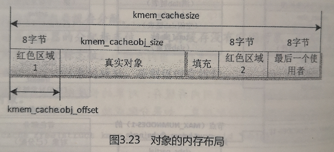
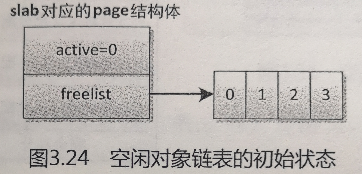
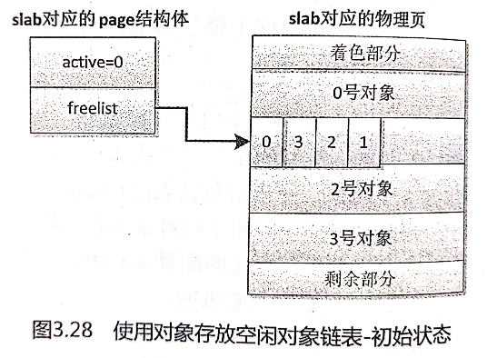
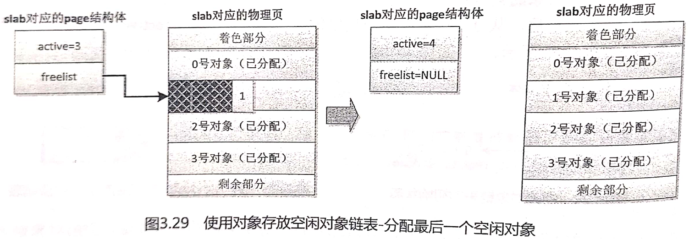
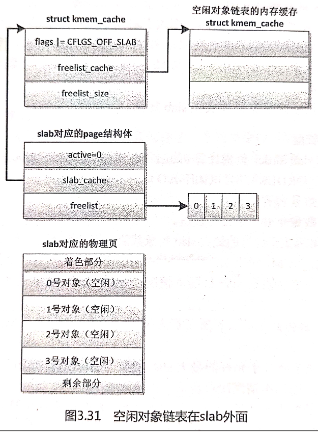
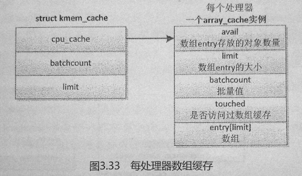

# Linux内核分析(十一)——块分配器

## 11.1 概述

- 伙伴系统分配内存时是以`page`为单位的，而在实际中有很多内存需求是以`Byte`为单位的，为了解决小块内存的分配问题，Linux内核提供了块分配器，最早实现的块分配器是`slab`分配器。

- `slab`分配器的作用不仅仅是分配小块内存，更重要的作用是针对经常分配和释放的对象充当缓存，`slab`分配器的核心思想是：为每种对象类型创建一个内存缓存，每个内存缓存由多个大块（`slab`，原意是大块的混凝土）组成，一个大块是一个或多个连续的物理页，每个大块包含多个对象。`slab`采用了面向对象的思想，基于对象类型管理内存，每种对象被划分为一类，例如进程描述符（task_struct）是一个类，每个进程描述符实例是一个对象，内存缓存的组成如下图：                                          

- `slab`分配器在某些情况下表现不太好，所以Linux内核提供了两个改进的块分配器：

  > 1. 在配备了大量物理内存的大型计算机上，`slab`分配器的管理数据结构的内存开销比较大，所以设计了`slub`分配器；
  > 2. 在小内存的嵌入式设备上，`slab`分配器的代码太多，太复杂，所以设计了一个精简的`slob`分配器，slob是`Simple List Of Blocks`的缩写，意思是简单的块链表。

  目前`slub`分配器已成为默认的块分配器。

- `slab`分配器最终还是由伙伴系统来分配出实际的物理页面，只不过`slab`分配器在这些连续的物理页面上实现了自己的算法，以此来对小内存块进行管理。


## 11.2 编程接口

- 3种块分配器（`slab`，`slub`，`slob`）提供了统一的编程接口。

- 为了方便使用，块分配器在初始化的时候创建了一些通用的内存缓存，对象的长度大多是 2^n 字节，从普通区域分配页的内存缓存的名称是`kmalloc-<size>`(size 是对象的长度)，从DMA区域分配页的内存缓存的名称是`dma-kmalloc-<size>`，执行命令`cat/proc/slabinfo`可以看到这些通用的内存缓存。

- 通用的内存缓存的编程接口：

  > 分配内存

  ```c
  void *kmalloc(size_t size, gfp_t flags);
  size: 需要的内存长度；
  flags: 传给页分配器的分配标志位，当内存缓存没有空闲对象，向页分配器请求分配页的时候使用这个分配标志位。
  页分配器找到一个合适的通用内存缓存：对象的长度刚好大于或等于请求的内存长度，然后从这个内存缓存分配对象。如果分配成功，返回对象的地址，否则返回空指针。
  
  ```

  > 重新分配内存

  ```c
  void *krealloc(const void *p, size_t new_size, gfp_t flags);
  p: 需要重新分配内存的对象。
  new_size: 新的长度。
  flags: 传给页分配器的分配标志位。
  根据新的长度为对象重新分配内存，如果分配成功，返回新的地址，否则返回空指针。
  
  ```

  > 释放内存

  ```c
  void kfree(const void *objp);
  objp: kmalloc()返回的对象的地址。
  
  ```

- 使用通用的内存缓存的缺点是：块分配器需要找到一个对象的长度刚好大于或等于请求的内存长度的通用内存缓存，如果请求的内存长度和内存缓存的对象长度相差很远，浪费比较大，例如申请36字节，实际分配的内存长度是64字节，浪费了28字节。所以有时候使用者需要创建专用的内存缓存，编程接口如下：

  > 创建内存缓存

  ```c
  struct kmem_cache *kmem_cache_create(const char *name, size_t size, size_t align, unsigned long flags, void (*ctor)(void *));
  name: `slab`描述符名称；
  size: 对象的长度；
  align: 对象需要对齐的数值；
  flags: `slab`标志位；
  ctor: 对象的构造函数；
  如果创建成功，返回内存缓存的地址，否则返回空指针。
  
  ```

  > 从指定的内存缓存分配对象

  ```c
  void *kmem_cache_alloc(struct kmem_cache *cachep, gfp_t flags)；
  cachep: 从指定的内存缓存分配；
  flags: 传给页分配器的分配标志位，当内存缓存没有空闲对象，向页分配器请求分配页的时候使用这个分配标志位。
  如果分配成功，返回对象的地址，否则返回空指针。
  
  ```

  > 释放对象

  ```c
  void kmem_cache_free(struct kmem_cache *cachep, void *objp)；
  cachep： 对象所属的内存缓存；
  objp： 对象的地址；
  
  ```

  > 销毁内存缓存

  ```c
  void kmem_cache_destroy(struct kmem_cache *s)；
  s： 内存缓存。
  
  ```


## 11.3 `slab`分配器

### 11.3.1 数据结构

- 内存缓存的数据结构如下图：

  1. 每个内存缓存对应一个`kmem_cache`实例。`struct kmem_cache`数据结构是`slab`分配器的核心数据结构，我们把它称为`slab`描述符，每个`slab`描述符都由一个`struct kmem_cache`数据结构来抽象描述。其定义如下：

     ```c
     [linux-4.14/include/linux/slab_def.h]
     
     11  struct kmem_cache {
     12  	struct array_cache __percpu *cpu_cache; //一个`Per-CPU`的`struct array_cache`数据结构，每个CPU一个，表示本地CPU的对象缓冲池。
     13  
     14  /* 1) Cache tunables. Protected by slab_mutex */
     15  	unsigned int batchcount; //表示当前CPU的本地对象缓冲池 array_cache 为空时，从共享的缓冲池或者 slabs_partial/slabs_free 列表中获取对象的数目
     16  	unsigned int limit; //当本地对象缓冲池中的空闲对象数目大于limit时就会主动释放batchcount个对象，便于内核回收和销毁slab
     17  	unsigned int shared; //用于多核系统
     18  
     19  	unsigned int size; // 对象的长度，这个长度要加上align对齐字节
     20  	struct reciprocal_value reciprocal_buffer_size;
     21  /* 2) touched by every alloc & free from the backend */
     22  
     23  	unsigned int flags;		/* constant flags 对象的分配掩码*/
     24  	unsigned int num;		/* # of objs per slab 一个slab中最多可以有多少个对象*/
     25  
     26  /* 3) cache_grow/shrink */
     27  	/* order of pgs per slab (2^n) */
     28  	unsigned int gfporder; // `slab`的阶数，一个slab中占用2^gfporder个页面
     29  
     30  	/* force GFP flags, e.g. GFP_DMA */
     31  	gfp_t allocflags;
     32  
     33  	size_t colour;			/* cache colouring range 一个slab中有几个不同的cache line*/
     34  	unsigned int colour_off;	/* colour offset 一个cache colour的长度，和L1 cache line大小相同*/
     35  	struct kmem_cache *freelist_cache; 
     36  	unsigned int freelist_size; // 每个对象要占用1Byte来存放freelist
     37  
     38  	/* constructor func */
     39  	void (*ctor)(void *obj);
     40  
     41  /* 4) cache creation/removal */
     42  	const char *name; // slab描述符的名称
     43  	struct list_head list;
     44  	int refcount;
     45  	int object_size; // 对象的实际大小
     46  	int align; // 对齐的长度
     47  
     48  /* 5) statistics */
     49  #ifdef CONFIG_DEBUG_SLAB
     50  	unsigned long num_active;
     51  	unsigned long num_allocations;
     52  	unsigned long high_mark;
     53  	unsigned long grown;
     54  	unsigned long reaped;
     55  	unsigned long errors;
     56  	unsigned long max_freeable;
     57  	unsigned long node_allocs;
     58  	unsigned long node_frees;
     59  	unsigned long node_overflow;
     60  	atomic_t allochit;
     61  	atomic_t allocmiss;
     62  	atomic_t freehit;
     63  	atomic_t freemiss;
     64  #ifdef CONFIG_DEBUG_SLAB_LEAK
     65  	atomic_t store_user_clean;
     66  #endif
     67  
     68  	/*
     69  	 * If debugging is enabled, then the allocator can add additional
     70  	 * fields and/or padding to every object. size contains the total
     71  	 * object size including these internal fields, the following two
     72  	 * variables contain the offset to the user object and its size.
     73  	 */
     74  	int obj_offset;
     75  #endif /* CONFIG_DEBUG_SLAB */
     76  
     77  #ifdef CONFIG_MEMCG
     78  	struct memcg_cache_params memcg_params;
     79  #endif
     80  #ifdef CONFIG_KASAN
     81  	struct kasan_cache kasan_info;
     82  #endif
     83  
     84  #ifdef CONFIG_SLAB_FREELIST_RANDOM
     85  	unsigned int *random_seq;
     86  #endif
     87  
     88  	struct kmem_cache_node *node[MAX_NUMNODES]; // slab 节点，在NUMA系统中每个节点有一个struct kmem_cache_node数据结构，而在非NUMA系统中，只有一个节点。
     89  };
     
     ```

  3. 每个内存节点对应一个`kmem_cache_node`实例。该实例包含3个`slab`链表：链表`slabs_partial`把部分对象空闲的`slab`链接起来，链表`slabs_full`把没有空闲对象的`slab`链接起来，链表`slabs_free`把所有对象空闲的`slab`链接起来。成员`total_slabs`是`slab`数量。

     ```c
     [linux-4.14/mm/slab.h]
     
     453  struct kmem_cache_node {
     454  	spinlock_t list_lock;
     455  
     456  #ifdef CONFIG_SLAB
     457  	struct list_head slabs_partial;	/* partial list first, better asm code */
     458  	struct list_head slabs_full;
     459  	struct list_head slabs_free;
     460  	unsigned long total_slabs;	/* length of all slab lists */
     461  	unsigned long free_slabs;	/* length of free slab list only */
     462  	unsigned long free_objects;
     463  	unsigned int free_limit;
     464  	unsigned int colour_next;	/* Per-node cache coloring */
     465  	struct array_cache *shared;	/* shared per node */
     466  	struct alien_cache **alien;	/* on other nodes */
     467  	unsigned long next_reap;	/* updated without locking */
     468  	int free_touched;		/* updated without locking */
     469  #endif
     470  
      471  #ifdef CONFIG_SLUB
     472  	unsigned long nr_partial;
      473  	struct list_head partial;
     474  #ifdef CONFIG_SLUB_DEBUG
     475  	atomic_long_t nr_slabs;
     476  	atomic_long_t total_objects;
     477  	struct list_head full;
     478  #endif
     479  #endif
     480  
     481  };
     
     ```
  
     每个`slab`由一个或多个连续的物理页组成，页的阶数是`kmem_cache.gfporder`，如果阶数大于0，组成一个复合页。`slab`被划分为多个对象，大多数情况下，`slab`长度不是对象长度的整数倍，`slab`有剩余部分，可以用来给`slab`着色：“把`slab`的第一个对象从`slab`的起始位置偏移一个数值，偏移值是处理器的一级缓存行长度的整数倍，不同`slab`的偏移值不同，使不同`slab`的对象映射到处理器不同的缓存行”，所以我们看到在`slab`的前面有一个着色部分。
  
     page结构体的相关成员如下(无关的成员已省略)：
  
     ```c
     /* linux-4.14/include/linux/mm_types.h */
     
     42  struct page {
     43  	/* First double word block */
     44  	unsigned long flags;		/* `flags`设置标志位`PG_slab`，表示页属于`slab`分配器 */
     45  					 
     46  	union {
     			...
     54  		void *s_mem;			/* `s_mem`存放`slab`第一个对象的地址 */
     			...
     57  	};
     58
     59  	/* Second double word */
     60  	union {
     			...
     62  		void *freelist;		/* `freelist`指向空闲对象链表 */
     			...
     64  	};
     65
     66  	union {
     			...
     79  		struct {
     80  
     81  			union {
     					...
     93  				unsigned int active;		/* `active`表示已分配对象的数量 */
     					...
     100  			};
     				...
     106  		};
     107  	};
     108  
     		...
     116  	union {
     117  		struct list_head lru;	/* `lru`作为链表节点加入其中一条`slab`链表 */
     			...
     136  		};
     			...
     170  	};
     171
     172  	/* Remainder is not double word aligned */
     173  	union {
     			...
     188  		struct kmem_cache *slab_cache;	/* `slab_cache`指向`kmem_cache`实例 */
     189  	};
     		...
     213  }
     
     ```
     
     `kfree`函数怎么知道对象属于哪个通用的内存缓存？ 分为以下5步：
     
     * 根据对象的虚拟地址得到物理地址，因为块分配器使用的虚拟地址属于直接映射的内核虚拟地址空间，虚拟地址=物理地址+常量，把虚拟地址转换成物理地址很方便；
     * 根据物理地址得到物理页号；
     * 根据物理页号得到page实例；
     * 如果是复合页，需要得到首页的page实例；
     * 根据page实例的成员`slab_cache`得到`kmem_cache`实例。
     
  4. `kmem_cache`实例的成员`cpu_cache`指向`array_cache`实例，每个处理器对应一个`array_cache`实例，称为数组缓存，用来缓存刚刚释放的对象，分配时首先从当前处理器的数组缓存分配，避免每次都要从`slab`分配，减少链表操作和锁操作，提高分配速度。`slab`描述符给每个CPU都提供了一个对象缓存池（`array_cache`），其数据结构定义如下：
  
     ```c
  [linux-4.14/mm/slab.c]
     
     184  struct array_cache {
     185  	unsigned int avail; //对象缓存池中可用的对象数目，即数组`entry`存放的对象数量
     186  	unsigned int limit; //数组缓存大小
     187  	unsigned int batchcount; //同 struct kmem_cache 定义
  	188  	unsigned int touched; //从缓存池移除一个对象时，将touched置1，而收缩缓存时，将touched置0
     189  	void *entry[]; //保存对象的实体，存放对象的地址
  194  };
     
     ```
  ```
     
     每个对象的内存布局如下图：           
  
     * 红色区域1：长度是8字节，写入一个魔幻数，如果值被修改，说明对象被改写；
  * 真实对象：长度是`kmem_cache.obj_size`，偏移是`kmem_cache.obj_offset`；
     * 填充：用来对齐的填充字节；
  * 红色区域2：长度是8字节，写入一个魔幻数，如果值被修改，说明对象被改写；
     * 最后一个使用者：在64位系统上长度是8字节，存放最后一个调用者的地址，用来确定对象被谁改写。
  
     - 对象的长度是`kmem_cache.size`。红色区域1、2和最后一个使用者是可选的，当想要发现内存分配和使用的错误，打开调试配置宏`CONFIG_DEBUG_SLAB`的时候，对象才包括这3个成员。
  
     - `kmem_cache.obj_size`是调用者指定的对象长度，`kmem_cache.size`是对象的实际占用的内存长度，通常比前者大，原因是为了提高访问对象的速度，需要把对象的地址和长度都对齐到某个值，对齐值的计算步骤如下：
     
       - 如果创建内存缓存时指定了标志位`SLAB_HWCACHE_ALIGN`，要求和处理器的一级缓存行的长度对齐，计算对齐值的方法如下：
         * 如果对象的长度大于一级缓存行的长度的一半，对齐值取一级缓存行的长度；
     
         * 如果对象的长度小于一级缓存行的长度的一半，对齐值取（一级缓存行的长度/2^n），把2^n个对象放在一个一级缓存行里面，需要为n找到一个合适的值。
     
         * 如果对齐值小于指定的对齐值，取指定的对齐值。
     
         举例说明：假设指定的对齐值是4字节，一级缓存行的长度是32字节，对象的长度是12字节，那么对齐值是16字节，对象占用的内存长度是16字节，把两个对象放在一个一级缓存行里面。
     
       - 如果对齐值小于`ARCH_SLAB_MINALIGN`，那么取`ARCH_SLAB_MINALIGN`，`ARCH_SLAB_MINALIGN`是各种处理器架构定义的最小对齐值，默认值是8.
     
       - 把对齐值向上调整为指针长度的整数倍。
       
         
  ```

### 11.3.2 空闲对象链表

- 每个`slab`需要一个空闲对象链表，从而把所有空闲对象链接起来，空闲对象链表是用数组实现的，数组的元素个数是`slab`的对象数量，数组存放空闲对象的索引。假设一个`slab`包含4个对象，空闲对象链表的初始状态如下图所示：

  `page->freelist`指向空闲对象链表，数组中第n个元素存放的对象索引是n，如果打开了`SLAB`空闲链表随机化的配置宏`CONFIG_SLAB_FREELIST_RANDOM`，数组中第n个元素存放的对象索引是随机的。

  `page->active`为0，有两重意思：存放空闲对象索引的第一数组元素的索引是0；已分配对象的数量是0。

- 第一次分配对象，从0号数组元素取出空闲对象索引0，`page->active`增加到1，空闲对象链表如下图所示：

- 当所有对象分配完毕后，`page->active`增加到4，等于`slab`的对象数量，空闲对象链表如下图所示：

- 当释放索引为0的对象以后，`page->active`减1变成3,3号数组元素存放空闲对象索引0，空闲对象链表如下图所示：

- 空闲对象链表的位置有3种选择：
  * 使用一个对象存放空闲对象链表，此时`kmem_cache.flags`设置了标志位`CFLGS_OBJFREELIST_SLAB`。
  * 把空闲对象链表放在`slab`外面，此时`kmem_cache.flags`设置了标志位`CFLGS_OFF_SLAB`。
  * 把空闲对象链表放在`slab`尾部。如果`kmem_cache.flags`没有设置上面两个标志位，就表示把空闲对象链表放在`slab`尾部。

- 如果使用一个对象存放空闲对象链表，默认使用最后一个对象。如果打开了`SLAB`空闲链表随机化的配置宏`CONFIG_SLAB_FREELIST_RANDOM`，这个对象是随机选择的。假设一个`slab`包含4个对象，使用1号对象存放空闲对象链表，初始状态如下图所示：                                               

  这种方案会不会导致可以分配的对象减少一个呢？答案是不会，存放空闲对象链表的对象可以被分配。这种方案采用了巧妙的方法：

  > 1. 必须把存放空闲对象链表的对象索引放在空闲对象数组的最后面，保证这个对象是最后一个被分配出去的；
  > 2. 分配最后一个空闲对象，`page->active`增加到4，`page->freelist`变成空指针，所有对象被分配出去，已经不需要空闲对象链表，如下图所示：
  > 3. 在所有对象分配完毕后，假设现在释放2号对象，`slab`使用2号对象存放空闲对象链表，`page->freelist`指向2号对象，把对象索引2存放在空闲对象数组的最后面，如下图所示：

- 如果把空闲对象链表放在`slab`外面，需要为空闲对象链表创建一个内存缓存，`kmem_cache.freelist_cache`指向空闲对象链表的内存缓存，如下图所示：                           

- 如果`slab`尾部的剩余部分足够大，可以把空闲对象链表放在`slab`尾部，如下图所示：

- 创建内存缓存的时候，确定空闲对象链表的位置的方法如下：

  1. 首选尝试使用一个对象存放空闲对象链表：

     > 1). 如果指定了对象的构造函数，那么这种方案不适合；
     >
     > 2). 如果指定了标志位`SLAB_TYPESAFE_BY_RCU`，表示使用RCU技术延迟释放`slab`，那么这种方案不适合；
     >
     > 3). 计算出`slab`长度和`slab`的对象数量，空闲对象链表的长度等于（`slab`的对象数量 * 对象索引长度）。如果空闲对象链表的长度大于对象的长度，那么这种方案不适合。

  2. 接着尝试把空闲对象链表放在`slab`外面，计算出`slab`长度和`slab`的对象数量，如果`slab`的剩余长度大于或等于空闲对象链表的长度，应该把空闲对象链表放在`slab`尾部，不应该使用这种方案。

  3. 最后尝试把空闲对象链表放在`slab`尾部。


### 11.3.3 计算`slab`长度

- 函数`calculate_slab_order`负责计算`slab`长度，从0阶到`kmalloc()`函数支持的最大阶数`KMALLOC_MAX_ORDER`，尝试如下：

  > 1. 计算对象数量和剩余长度；
  > 2. 如果对象数量是0，那么不合适；
  > 3. 如果对象数量大于允许的最大`slab`对象数量，那么不合适。允许的最大`slab`对象数量是`SLAB_OBJ_MAX_NUM`，等于`2^(sizeof(freelist_idx_t))×8-1`，`freelist_idx_t`是对象索引的数据类型；
  > 4. 对于空闲对象链表在`slab`外面的情况，如果空闲对象链表的长度大于对象长度的一半，那么不合适；
  > 5. 如果`slab`是可回收的（设置了标志位`SLAB_RECLAIM_ACCOUNT`），那么选择这个阶数；
  > 6. 如果阶数大于或等于允许的最大`slab`阶数（`slab_max_order`），那么选择这个阶数，尽量选择低的阶数，因为申请高阶页块成功的概率低。
  > 7. 如果剩余长度小于或等于`slab`长度的`1/8`，那么选择这个阶数。

- `slab_max_order`：允许的最大`slab`阶数。如果内存容量大于32MB，那么默认值是1，否则默认值是0。可以通过内核参数`slab_max_order`指定。

  

### 11.3.4 着色

- `slab`是一个或多个连续的物理页，起始地址总是页长度的整数倍，不同`slab`中相同的偏移位置在处理器一级缓存中的索引相同。如果`slab`的剩余部分的长度超过一级缓存行的长度，剩余部分对应的一级缓存行没有被利用；如果对象的填充字节的长度超过一级缓存行的长度，填充字节对应的一级缓存行没有被利用。这两种情况导致处理器的某些缓存行被过度使用，另一些缓存行很少使用。
- 在`slab`的剩余部分的长度超过一级缓存行的长度的情况下，为了均匀利用处理器的所以一级缓存行，`slab`着色（slab corloring）利用`slab`的剩余部分，使不同`slab`的第一个对象的偏移不同。
- 着色是一个比喻，和颜色无关，只是表示`slab`中的第一个对象需要移动一个偏移量，使对象放到不同的一级缓存行里。
- 内存缓存中着色相关的成员如下：
  1. `kmem_cache.colour_off`是颜色偏移，等于处理器的一级缓存行的长度，如果小于对齐值，那么取对齐值；
  2. `kmem_cache.colour`是着色范围，等于（`slab`的剩余长度/颜色偏移）。
  3. `kmem_cache.node[n]->colour_next`是下一种颜色，初始值是0。

- 在内存节点n上创建新的`slab`，计算`slab`的颜色偏移的方法如下：
  1. 把`kmem_cache.node[n]->colour_next`加1，如果大于或等于着色范围，那么把值设为0；
  2. `slab`的颜色偏移 = `kmem_cache.node[n]->colour_next * kmem_cache.colour_off`。

- `slab`对应的page结构体的成员`s_mem`存放第一个对象的地址，等于（`slab`的起始地址 + `slab`的颜色偏移）。


### 11.3.5 每处理器数组缓存

- 如下图所示， 内存缓存为每个处理器创建了一个数组缓存（结构体`array_cache`）。释放对象时，把对象存放到当前处理器对应的数组缓存中：分配对象时，先从当前处理器的数组缓存分配对象，采用后进先出（Last In Fisrt Out, LIFO）的原则，这种做法可以提高性能。
  1. 刚释放的对象很可能还在处理器的缓存中，可以更好地利用处理器的缓存。
  2. 减少链表操作。
  3. 避免处理器之间的互斥，减少自旋锁操作。

- 结构体`array_cache`如下：
  1. 成员`entry`是存放对象地址的数组；
  2. 成员`avail`是数组存放的对象的数量；
  3. 成员`limit`是数组的大小，和结构体`kmem_cache`的成员`limit`的值相同，是根据对象长度猜测的一个值；
  4. 成员`batchcount`是批量值，和结构体`kmem_cache`的成员`batchcount`的值相同，批量值是数组大小的一半。

- 分配对象的时候，先从当前处理器的数组缓存分配对象。如果数组缓存是空，那么从批量分配对象以重新填充数组缓存，批量值就是数组缓存的成员`batchcount`。
- 释放对象的时候，如果数组缓存是满的，那么先从数组缓存中的对象批量归还给`slab`，批量值就是数组缓存的成员`batchcount`，然后把正在释放的对象存放到数组缓存中。


### 11.3.6 内存缓存合并

- 为了减少内存开销和增加对象的缓存热度，块分配器会合并相似的内存缓存。在创建内存缓存的时候，从已经存在的内存缓存中找到一个相似的内存缓存，和原始的创建者共享这个内存缓存。3种分配器都（`slab`，`slub`，`slob`）支持内存缓存合并。

- 假设正在创建的内存缓存是t：

  > 1. 如果合并控制变量`slab_nomerge`的值是1，那么不合并。默认值是0，如果想要禁止合并，可以在引导内核时使用内核参数`slab_nomerge`指定。
  >
  > 2. 如果t指定了对象构造函数，不能合并。
  >
  > 3. 如果t设置了阻止合并的标志位，那么不能合并。阻止合并的标志位是调试和使用`RCU`技术延迟释放`slab`，其代码如下：
  >
  >    ```c
  >    #define SLAB_NEVER_MERGE (SLAB_RED_ZONE | SLAB_POISON | SLAB_STORE_USER | \
  >    		SLAB_TRACE | SLAB_TYPESAFE_BY_RCU | SLAB_NOLEAKTRACE | \
  >    		SLAB_FAILSLAB | SLAB_KASAN)
  >    
  >    ```

- 遍历每个内存缓存s，判断t是否可以和s合并：

  > 1. 如果s设置了阻止合并的标志位，那么t不能和s合并；
  >
  > 2. 如果s指定了对象构造函数，那么t不能和s合并；
  >
  > 3. 如果t的对象长度大于s的对象长度，那么t不能和s合并；
  >
  > 4. 如果t的下面三个标志位和s不相同，那么t不能和s合并；
  >
  >    ```c
  >    #define SLAB_MERGE_SAME (SLAB_RECLAIM_ACCOUNT | SLAB_CACHE_DMA | \
  >    			 SLAB_ACCOUNT)
  >    
  >    ```
  >
  > 5. 如果对齐值不兼容，即s的对象长度不是t的对齐值的整数倍，那么t不能和s合并；
  >
  > 6. 如果s的对象长度和t的对象长度的差值大于或等于指针长度，那么t不能和s合并；
  >
  > 7. `slab`分配器特有的检查项：如果t的对齐值不是0，并且t的对齐值大于s的对齐值，或者s的对齐值不是t的对齐值的整数倍，那么t不能和s合并；
  >
  > 8. 顺利通过前面7项检查，说明t和s可以合并。

- 找到可以合并的内存缓存以后，把引用计数加1，对象的原始长度取两者的最大值，然后把内存缓存的地址返回给调用者。


### 11.3.7 回收内存

- 对于所有对象空闲的`slab`，没有立即释放，而是放在空闲`slab`链表中。只有内存节点上空闲对象的数量超过限制，才开始回收空闲`slab`，直到空闲对象的数量小于或等于限制。
- 如下图所示，结构体`kmem_cache_node`的成员`slabs_free`是空闲`slab`链表的头节点，成员`free_objects`是空闲对象的数量，成员`free_limit`是空闲对象的数量限制。                               

- 节点n的空闲对象的数量限制 = （1 + 节点的处理器数量）*`kmem_cache.bachcount` + `kmem_cache.num`。
- `slab`分配器定期回收对象和空闲`slab`，实现方法是在每个处理器上向全局工作队列添加一个延迟工作项，工作项的处理函数是`cache_reap`。
- 每个处理器每隔2秒针对每个内存缓存执行如下操作：
  1. 回收节点n（假设当前处理器属于节点n）对应的远程节点数组缓存中的对象；
  2. 如果过去2秒没有从当前处理器的数组缓存分配对象，那么回收数组缓存中的对象；

- 每个处理器每隔4秒针对每个内存缓存执行如下操作：
  1. 如果过去4秒没有从共享数组缓存分配对象，那么回收共享数组缓存中的对象；
  2. 如果过去4秒没有从空闲`slab`分配对象，那么回收空闲`slab`。


### 11.3.8 调试

- 出现内存改写时，我们需要定位出是谁改写。`slab`分配器提供了调试功能，我们可以打开调试配置宏`CONFIG_DEBUG_SLAB`，此时对象增加3个字段：红色区域1、红色区域2和最后一个使用者，如下图所示：

- 分配对象时，把对象毒化：把最后1字节以外的每个字节设置为`0x5a`，把最后1个字节设置为`0xa5`；把对象前后的红色区域设置为宏`RED_ACTIVE`表示魔幻数；字段“最后一个使用者”保存调用函数的地址。
- 释放对象时，检查对象：如果对象前后的红色区域都是宏`RED_ACTIVE`表示的魔幻数，说明正常；如果对象前后的红色区域都是宏`RED_INACTIVE`表示的魔幻数，说明重复释放；其他情况，说明写越界。
- 释放对象时，把对象毒化：把最后1字节以外的每个字节设置为`0x6b`，把最后1个字节设置为`0xa5`；把对象前后的红色区域设置为宏`RED_INACTIVE`，字段“最后一个使用者”保存调用函数的地址。
- 再次分配对象时，检查对象：如果对象不符合“最后1字节以外的每个字节为`0x6b`，最后1个字节为`0xa5`”，说明对象被改写；如果对象前后的红色区域不是宏`RED_INACTIVE`表示的魔幻数，说明重复释放或者写越界。


## 11.4 `slub`分配器

- `slub`分配器继承了`slab`分配器的核心思想，在某些地方做了改进：
  1. `slab`分配器的管理数据结构开销大，早期每个`slab`有一个描述符和跟在后面的空闲对象数组。`slub`分配器把`slab`的管理信息保存在page结构体中，使用联合体重用`page`的结构体成员，没有使`page`结构体的大小增加。现在`slab`分配器反过来向`slub`分配器学习，抛弃了`slab`描述符，把`slab`的管理信息保存在page结构体中。
  2. `slab`分配器的链表多，分为空闲`slab`链表、部分空闲`slab`链表和满`slab`链表，管理复杂。`slub`分配器只保留了部分空闲`slab`链表。
  3. `slab`分配器对`NUMA`系统的支持复杂，每个内存节点有共享数组缓存和远程节点数组缓存，对象在这些数组缓存之间转移，实现复杂。`slub`分配器做了简化。
  4. `slub`分配器抛弃了效果不明显的`slab`着色。

### 11.4.1 数据结构

- slub分配器内存缓存的数据结构如下图所示：

1. 每个内存缓存对应一个kmem_cache实例

   ```c
   [linux-4.14/include/linux/slub_def.h]
   
   82  struct kmem_cache {
   83  	struct kmem_cache_cpu __percpu *cpu_slab; /*  */
   84  	/* Used for retriving partial slabs etc */
   85  	unsigned long flags;
   86  	unsigned long min_partial;
   87  	int size;		/* The size of an object including meta data，包括元数据的对象长度 */
   88  	int object_size;	/* The size of an object without meta data， 对象的原始长度 */
   89  	int offset;		/* Free pointer offset. */
   90  #ifdef CONFIG_SLUB_CPU_PARTIAL
   91  	/* Number of per cpu partial objects to keep around */
   92  	unsigned int cpu_partial;
   93  #endif
   94  	struct kmem_cache_order_objects oo; /* 存放最优slab的阶数和对象数，低16位是对象数，高16位是slab的阶数，即oo等于（（slab的阶数）<<16 | 对象数），最优slab是剩余部分最小的slab */
   95  
   96  	/* Allocation and freeing of slabs */
   97  	struct kmem_cache_order_objects max;
   98  	struct kmem_cache_order_objects min; /* 存放最小slab的阶数和对象数，格式和oo相同。最小slab只需要足够存放一个对象。当设备长时间运行以后，内存碎片化，分配连续物理页很难成功，如果分配最优slab失败，就分配最小slab */
   99  	gfp_t allocflags;	/* gfp flags to use on each alloc */
   100  	int refcount;		/* Refcount for slab cache destroy */
   101  	void (*ctor)(void *);
   102  	int inuse;		/* Offset to metadata */
   103  	int align;		/* Alignment */
   104  	int reserved;		/* Reserved bytes at the end of slabs，如果slab长度不是对象长度的整数倍，尾部有剩余部分，尾部也可能有保留部分，成员reserved存放保留长度 */
   105  	int red_left_pad;	/* Left redzone padding size */
   106  	const char *name;	/* Name (only for display!) */
   107  	struct list_head list;	/* List of slab caches */
   108  #ifdef CONFIG_SYSFS
   109  	struct kobject kobj;	/* For sysfs */
   110  	struct work_struct kobj_remove_work;
   111  #endif
   112  #ifdef CONFIG_MEMCG
   113  	struct memcg_cache_params memcg_params;
   114  	int max_attr_size; /* for propagation, maximum size of a stored attr */
   115  #ifdef CONFIG_SYSFS
   116  	struct kset *memcg_kset;
   117  #endif
   118  #endif
   119  
   120  #ifdef CONFIG_SLAB_FREELIST_HARDENED
   121  	unsigned long random;
   122  #endif
   123  
   124  #ifdef CONFIG_NUMA
   125  	/*
   126  	 * Defragmentation by allocating from a remote node.
   127  	 */
   128  	int remote_node_defrag_ratio;
   129  #endif
   130  
   131  #ifdef CONFIG_SLAB_FREELIST_RANDOM
   132  	unsigned int *random_seq;
   133  #endif
   134  
   135  #ifdef CONFIG_KASAN
   136  	struct kasan_cache kasan_info;
   137  #endif
   138  
   139  	struct kmem_cache_node *node[MAX_NUMNODES];
   140  };
   
   ```

2. 每个内存节点对应一个`kmem_cache_node`实例：

   ```c
   [linux-4.14/mm/slab.h]
   
   453  struct kmem_cache_node {
   454  	spinlock_t list_lock;
   		...
   471  #ifdef CONFIG_SLUB
   472  	unsigned long nr_partial; /* nr_partial是部分空闲slab的数量 */
   473  	struct list_head partial; /* 链表partial把部分空闲的slab链接起来 */
   474  #ifdef CONFIG_SLUB_DEBUG
   475  	atomic_long_t nr_slabs;
   476  	atomic_long_t total_objects;
   477  	struct list_head full;
   478  #endif
   479  #endif
   480  
   481  };
   
   ```

3. 每个`slab`由一个或多个连续的物理页组成，页的阶数是最优`slab`或最小`slab`的阶数，如果阶数大于0，组成一个复合页。

   - `slab`被划分为多个对象，如果`slab`长度不是对象长度的整数倍，尾部有剩余部分，尾部也可能有保留部分，`kmem_cache`实例的成员`reserved`存放保留长度。
   
   - 在创建内存缓存的时候，如果指定了标志位`SLAB_TYPESAFE_BY_RCU`，要求使用`RCU`延迟释放`slab`，在调用函数`call_rcu`把释放`slab`的函数加入`RCU`回调函数队列的时候，需要提供一个`rcu_head`实例，`slab`提供的`rcu_head`实例的位置分为两种情况：
     1. 如果`page`结构体的成员`lru`的长度大于或等于`rcu_head`结构体的长度，那么重用成员`lru`；
  2. 如果`page`结构体的成员`lru`的长度小于`rcu_head`结构体的长度，那么必须在`slab`尾部为`rcu_head`结构体保留空间，保留长度是`rcu_head`结构体的长度。
   
- `page`结构体相关成员如下(无关成员已省略)：
	
     ```c
  /* linux-4.14/include/linux/mm_types.h */
     
      42  struct page {
      43  	/* First double word block */
      44  	unsigned long flags;		/* `flags`设置标志位`PG_slab`，表示页属于`slub`分配器 */
      45  					 
      46  	union {
                  ...
      54  		void *s_mem;			/* `s_mem`存放`slab`第一个对象的地址 */
                  ...
      57  	};
      58
      59  	/* Second double word */
      60  	union {
                  ...
      62  		void *freelist;		/* `freelist`指向第一个空闲对象 */
                  ...
      64  	};
      65
      66  	union {
                  ...
      79  		struct {
      80  
      81  			union {
                      ...
      94  				struct {			/* SLUB */
      95  					unsigned inuse:16; /* 表示已分配对象的数量 */
      96  					unsigned objects:15; /* 对象数量 */
      97  					unsigned frozen:1; /* 表示slab释放被冻结在每处理器slab缓存中。如果slab在每处理器slab缓存中，它处于冻结状态；如果slab在内存节点的部分空闲slab链表中，它处于解冻状态。*/
      98  				};
                      ...
      100  			};
                  ...
      106  		};
      107  	};
      108  
              ...
      116  	union {
      117  		struct list_head lru;	/* `lru`作为链表节点加入部分空闲`slab`链表 */
                  ...
      136  		};
                  ...
      170  	};
      171
      172  	/* Remainder is not double word aligned */
      173  	union {
                  ...
      188  		struct kmem_cache *slab_cache;	/* `slab_cache`指向`kmem_cache`实例 */
      189  	};
              ...
   213  }
	  
	  ```
	
4. `kmem_cache`实例的成员`cpu_slab`指向kmem_cache_cpu实例，每个处理器对应一个kmem_cache_cpu实例，称为每处理器slab缓存。

   - slab分配器的每处理器数组缓存以对象为单位，而slub分配器的每处理器slab缓存以slab为单位。
   - 成员freelist指向当前使用的slab的空闲对象链表，成员page指向当前使用的slab对应的page实例。成员partial指向每处理器部分空闲slab链表

## 11.5 `slob`分配器


## 11.6 相关函数解析

