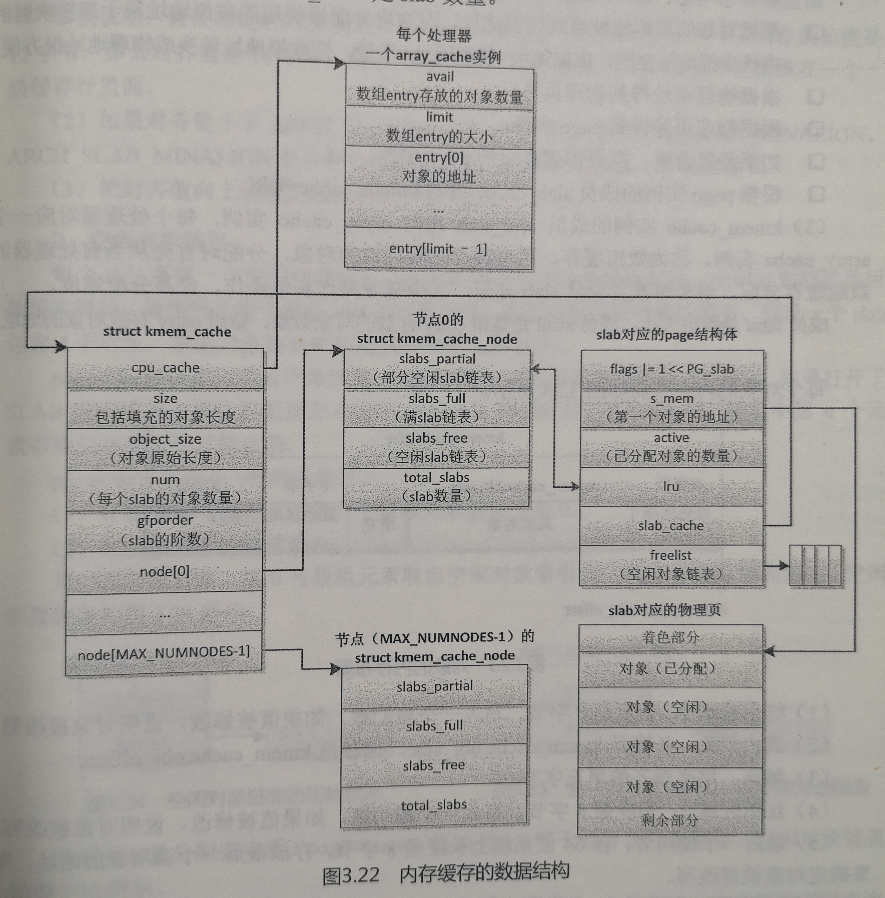
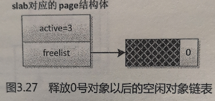

# Linux内核分析(十一)——块分配器

## 11.1 概述

- 伙伴系统分配内存时是以`page`为单位的，而在实际中有很多内存需求是以`Byte`为单位的，为了解决小块内存的分配问题，Linux内核提供了块分配器，最早实现的块分配器是`slab`分配器。

- `slab`分配器的作用不仅仅是分配小块内存，更重要的作用是针对经常分配和释放的对象充当缓存，`slab`分配器的核心思想是：为每种对象类型创建一个内存缓存，每个内存缓存由多个大块（`slab`，原意是大块的混凝土）组成，一个大块是一个或多个连续的物理页，每个大块包含多个对象。`slab`采用了面向对象的思想，基于对象类型管理内存，每种对象被划分为一类，例如进程描述符（task_struct）是一个类，每个进程描述符实例是一个对象，内存缓存的组成如下图：                                          

- `slab`分配器在某些情况下表现不太好，所以Linux内核提供了两个改进的块分配器：

  > 1. 在配备了大量物理内存的大型计算机上，`slab`分配器的管理数据结构的内存开销比较大，所以设计了`slub`分配器；
  > 2. 在小内存的嵌入式设备上，`slab`分配器的代码太多，太复杂，所以设计了一个精简的`slob`分配器，slob是`Simple List Of Blocks`的缩写，意思是简单的块链表。

  目前`slub`分配器已成为默认的块分配器。

- `slab`分配器最终还是由伙伴系统来分配出实际的物理页面，只不过`slab`分配器在这些连续的物理页面上实现了自己的算法，以此来对小内存块进行管理。


## 11.2 编程接口

- 3种块分配器（`slab`，`slub`，`slob`）提供了统一的编程接口。

- 为了方便使用，块分配器在初始化的时候创建了一些通用的内存缓存，对象的长度大多是 2^n 字节，从普通区域分配页的内存缓存的名称是`kmalloc-<size>`(size 是对象的长度)，从DMA区域分配页的内存缓存的名称是`dma-kmalloc-<size>`，执行命令`cat/proc/slabinfo`可以看到这些通用的内存缓存。

- 通用的内存缓存的编程接口：

  > 分配内存

  ```c
  void *kmalloc(size_t size, gfp_t flags);
  size: 需要的内存长度；
  flags: 传给页分配器的分配标志位，当内存缓存没有空闲对象，向页分配器请求分配页的时候使用这个分配标志位。
  页分配器找到一个合适的通用内存缓存：对象的长度刚好大于或等于请求的内存长度，然后从这个内存缓存分配对象。如果分配成功，返回对象的地址，否则返回空指针。
  
  ```

  > 重新分配内存

  ```c
  void *krealloc(const void *p, size_t new_size, gfp_t flags);
  p: 需要重新分配内存的对象。
  new_size: 新的长度。
  flags: 传给页分配器的分配标志位。
  根据新的长度为对象重新分配内存，如果分配成功，返回新的地址，否则返回空指针。
  
  ```

  > 释放内存

  ```c
  void kfree(const void *objp);
  objp: kmalloc()返回的对象的地址。
  
  ```

- 使用通用的内存缓存的缺点是：块分配器需要找到一个对象的长度刚好大于或等于请求的内存长度的通用内存缓存，如果请求的内存长度和内存缓存的对象长度相差很远，浪费比较大，例如申请36字节，实际分配的内存长度是64字节，浪费了28字节。所以有时候使用者需要创建专用的内存缓存，编程接口如下：

  > 创建内存缓存

  ```c
  struct kmem_cache *kmem_cache_create(const char *name, size_t size, size_t align, unsigned long flags, void (*ctor)(void *));
  name: 名称；
  size: 对象的长度；
  align: 对象需要对齐的数值；
  flags: `slab`标志位；
  ctor: 对象的构造函数；
  如果创建成功，返回内存缓存的地址，否则返回空指针。
  
  ```

  > 从指定的内存缓存分配对象

  ```c
  void *kmem_cache_alloc(struct kmem_cache *cachep, gfp_t flags)；
  cachep: 从指定的内存缓存分配；
  flags: 传给页分配器的分配标志位，当内存缓存没有空闲对象，向页分配器请求分配页的时候使用这个分配标志位。
  如果分配成功，返回对象的地址，否则返回空指针。
  
  ```

  > 释放对象

  ```c
  void kmem_cache_free(struct kmem_cache *cachep, void *objp)；
  cachep： 对象所属的内存缓存；
  objp： 对象的地址；
  
  ```

  > 销毁内存缓存

  ```c
  void kmem_cache_destroy(struct kmem_cache *s)；
  s： 内存缓存。
  
  ```


## 11.3 `slab`分配器

### 11.3.1 数据结构

- 内存缓存的数据结构如下图：

  1.  每个内存缓存对应一个`kmem_cache`实例。`struct kmem_cache`结构体定义如下：

     ```c
     [linux-4.14/include/linux/slab_def.h]
     
     11  struct kmem_cache {
     12  	struct array_cache __percpu *cpu_cache;
     13  
     14  /* 1) Cache tunables. Protected by slab_mutex */
     15  	unsigned int batchcount;
     16  	unsigned int limit;
     17  	unsigned int shared;
     18  
     19  	unsigned int size;
     20  	struct reciprocal_value reciprocal_buffer_size;
     21  /* 2) touched by every alloc & free from the backend */
     22  
     23  	unsigned int flags;		/* constant flags */
     24  	unsigned int num;		/* # of objs per slab */
     25  
     26  /* 3) cache_grow/shrink */
     27  	/* order of pgs per slab (2^n) */
     28  	unsigned int gfporder;
     29  
     30  	/* force GFP flags, e.g. GFP_DMA */
     31  	gfp_t allocflags;
     32  
     33  	size_t colour;			/* cache colouring range */
     34  	unsigned int colour_off;	/* colour offset */
     35  	struct kmem_cache *freelist_cache;
     36  	unsigned int freelist_size;
     37  
     38  	/* constructor func */
     39  	void (*ctor)(void *obj);
     40  
     41  /* 4) cache creation/removal */
     42  	const char *name;
     43  	struct list_head list;
     44  	int refcount;
     45  	int object_size;
     46  	int align;
     47  
     48  /* 5) statistics */
     49  #ifdef CONFIG_DEBUG_SLAB
     50  	unsigned long num_active;
     51  	unsigned long num_allocations;
     52  	unsigned long high_mark;
     53  	unsigned long grown;
     54  	unsigned long reaped;
     55  	unsigned long errors;
     56  	unsigned long max_freeable;
     57  	unsigned long node_allocs;
     58  	unsigned long node_frees;
     59  	unsigned long node_overflow;
     60  	atomic_t allochit;
     61  	atomic_t allocmiss;
     62  	atomic_t freehit;
     63  	atomic_t freemiss;
     64  #ifdef CONFIG_DEBUG_SLAB_LEAK
     65  	atomic_t store_user_clean;
     66  #endif
     67  
     68  	/*
     69  	 * If debugging is enabled, then the allocator can add additional
     70  	 * fields and/or padding to every object. size contains the total
     71  	 * object size including these internal fields, the following two
     72  	 * variables contain the offset to the user object and its size.
     73  	 */
     74  	int obj_offset;
     75  #endif /* CONFIG_DEBUG_SLAB */
     76  
     77  #ifdef CONFIG_MEMCG
     78  	struct memcg_cache_params memcg_params;
     79  #endif
     80  #ifdef CONFIG_KASAN
     81  	struct kasan_cache kasan_info;
     82  #endif
     83  
     84  #ifdef CONFIG_SLAB_FREELIST_RANDOM
     85  	unsigned int *random_seq;
     86  #endif
     87  
     88  	struct kmem_cache_node *node[MAX_NUMNODES];
     89  };
     
     ```

     成员`gfporder`是`slab`的阶数，成员`num`是每个`slab`包含的对象数量，成员`object_size`是对象的原始长度，成员`size`是包括填充的对象长度。

  2. 每个内存节点对应一个`kmem_cache_node`实例。该实例包含3个`slab`链表：链表`slabs_partial`把部分对象空闲的`slab`链接起来，链表`slabs_full`把没有空闲对象的`slab`链接起来，链表`slabs_free`把所有对象空闲的`slab`链接起来。成员`total_slabs`是`slab`数量。

     ```c
     [linux-4.14/mm/slab.h]
     
     453  struct kmem_cache_node {
     454  	spinlock_t list_lock;
     455  
     456  #ifdef CONFIG_SLAB
     457  	struct list_head slabs_partial;	/* partial list first, better asm code */
     458  	struct list_head slabs_full;
     459  	struct list_head slabs_free;
     460  	unsigned long total_slabs;	/* length of all slab lists */
     461  	unsigned long free_slabs;	/* length of free slab list only */
     462  	unsigned long free_objects;
     463  	unsigned int free_limit;
     464  	unsigned int colour_next;	/* Per-node cache coloring */
     465  	struct array_cache *shared;	/* shared per node */
     466  	struct alien_cache **alien;	/* on other nodes */
     467  	unsigned long next_reap;	/* updated without locking */
     468  	int free_touched;		/* updated without locking */
     469  #endif
     470  
     471  #ifdef CONFIG_SLUB
     472  	unsigned long nr_partial;
     473  	struct list_head partial;
     474  #ifdef CONFIG_SLUB_DEBUG
     475  	atomic_long_t nr_slabs;
     476  	atomic_long_t total_objects;
     477  	struct list_head full;
     478  #endif
     479  #endif
     480  
     481  };
     
     ```

     每个`slab`由一个或多个连续的物理页组成，页的阶数是`kmem_cache.gfporder`，如果阶数大于0，组成一个复合页。`slab`被划分为多个对象，大多数情况下，`slab`长度不是对象长度的整数倍，`slab`有剩余部分，可以用来给`slab`着色：“把`slab`的第一个对象从`slab`的起始位置偏移一个数值，偏移值是处理器的一级缓存行长度的整数倍，不同`slab`的偏移值不同，使不同`slab`的对象映射到处理器不同的缓存行”，所以我们看到在`slab`的前面有一个着色部分。

     page结构体的相关成员如下：
  
     * 成员`flags`设置标志位`PG_slab`，表示页属于`slab`分配器；
     * 成员`s_mem`存放`slab`第一个对象的地址；
     * 成员`active`表示已分配对象的数量；
     * 成员`lru`作为链表节点加入其中一条`slab`链表；
     * 成员`slab_cache`指向`kmem_cache`实例；
     * 成员`freelist`指向空闲对象链表；
  
     `kfree`函数怎么知道对象属于哪个通用的内存缓存？ 分为以下5步：
  
     * 根据对象的虚拟地址得到物理地址，因为块分配器使用的虚拟地址属于直接映射的内核虚拟地址空间，虚拟地址=物理地址+常量，把虚拟地址转换成物理地址很方便；
     * 根据物理地址得到物理页号；
     * 根据物理页号得到page实例；
     * 如果是复合页，需要得到首页的page实例；
     * 根据page实例的成员`slab_cache`得到`kmem_cache`实例。
  
  3.  `kmem_cache`实例的成员`cpu_cache`指向`array_cache`实例，每个处理器对应一个`array_cache`实例，称为数组缓存，用来缓存刚刚释放的对象，分配时首先从当前处理器的数组缓存分配，避免每次都要从`slab`分配，减少链表操作和锁操作，提高分配速度。成员`limit`是数组大小，成员`avail`是数组`entry`存放的对象数量，数组`entry`存放对象的地址。
  
     每个对象的内存布局如下图：           
  
     * 红色区域1：长度是8字节，写入一个魔幻数，如果值被修改，说明对象被改写；
     * 真实对象：长度是`kmem_cache.obj_size`，偏移是`kmem_cache.obj_offset`；
     * 填充：用来对齐的填充字节；
     * 红色区域2：长度是8字节，写入一个魔幻数，如果值被修改，说明对象被改写；
     * 最后一个使用者：在64位系统上长度是8字节，存放最后一个调用者的地址，用来确定对象被谁改写。
  
     - 对象的长度是`kmem_cache.size`。红色区域1、2和最后一个使用者是可选的，当想要发现内存分配和使用的错误，打开调试配置宏`CONFIG_DEBUG_SLAB`的时候，对象才包括这3个成员。
  
     - `kmem_cache.obj_size`是调用者指定的对象长度，`kmem_cache.size`是对象的实际占用的内存长度，通常比前者大，原因是为了提高访问对象的速度，需要把对象的地址和长度都对齐到某个值，对齐值的计算步骤如下：
  
       - 如果创建内存缓存时指定了标志位`SLAB_HWCACHE_ALIGN`，要求和处理器的一级缓存行的长度对齐，计算对齐值的方法如下：
         * 如果对象的长度大于一级缓存行的长度的一半，对齐值取一级缓存行的长度；
  
         * 如果对象的长度小于一级缓存行的长度的一半，对齐值取（一级缓存行的长度/2^n），把2^n个对象放在一个一级缓存行里面，需要为n找到一个合适的值。
  
         * 如果对齐值小于指定的对齐值，取指定的对齐值。
  
         举例说明：假设指定的对齐值是4字节，一级缓存行的长度是32字节，对象的长度是12字节，那么对齐值是16字节，对象占用的内存长度是16字节，把两个对象放在一个一级缓存行里面。
  
       - 如果对齐值小于`ARCH_SLAB_MINALIGN`，那么取`ARCH_SLAB_MINALIGN`，`ARCH_SLAB_MINALIGN`是各种处理器架构定义的最小对齐值，默认值是8.
  
       - 把对齐值向上调整为指针长度的整数倍。

### 11.3.2 空闲对象链表

- 每个`slab`需要一个空闲对象链表，从而把所有空闲对象链接起来，空闲对象链表是用数组实现的，数组的元素个数是`slab`的对象数量，数组存放空闲对象的索引。假设一个`slab`包含4个对象，空闲对象链表的初始状态如下图所示：

  `page->freelist`指向空闲对象链表，数组中第n个元素存放的对象索引是n，如果打开了`SLAB`空闲链表随机化的配置宏`CONFIG_SLAB_FREELIST_RANDOM`，数组中第n个元素存放的对象索引是随机的。

  `page->active`为0，有两重意思：存放空闲对象索引的第一数组元素的索引是0；已分配对象的数量是0。

- 第一次分配对象，从0号数组元素取出空闲对象索引0，`page->active`增加到1，空闲对象链表如下图所示：

- 当所有对象分配完毕后，`page->active`增加到4，等于`slab`的对象数量，空闲对象链表如下图所示：

- 当释放索引为0的对象以后，`page->active`减1变成3,3号数组元素存放空闲对象索引0，空闲对象链表如下图所示：

- 空闲对象链表的位置有3种选择：
  * 使用一个对象存放空闲对象链表，此时`kmem_cache.flags`设置了标志位`CFLGS_OBJFREELIST_SLAB`。
  * 把空闲对象链表放在`slab`外面，此时`kmem_cache.flags`设置了标志位`CFLGS_OFF_SLAB`。
  * 把空闲对象链表放在`slab`尾部。如果`kmem_cache.flags`没有设置上面两个标志位，就表示把空闲对象链表放在`slab`尾部。