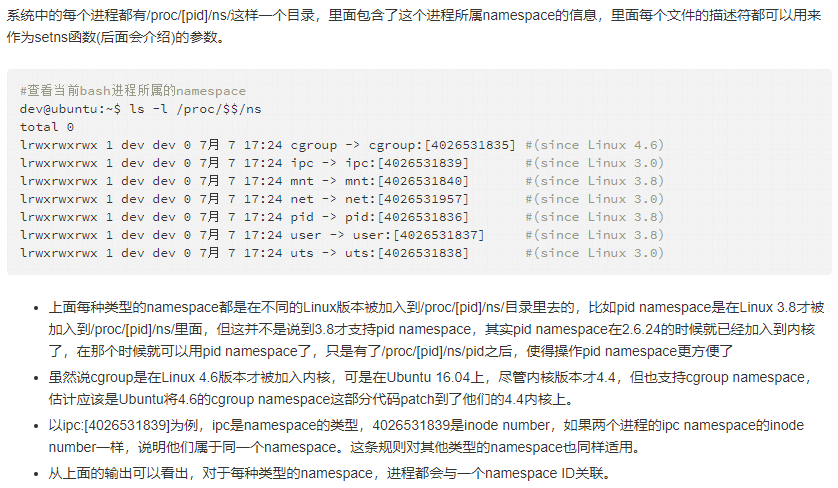

# Linux内核进程管理(一)——进程

## 1. 进程

- 进程是`Linux`内核最基本的抽象之一，它是处于执行期的程序，或者说`进程 = 程序 + 执行`。但是进程并不仅局限于一段可执行代码（代码段），它还包括进程需要的其他资源，例如打开的文件、挂起的信号量、内存管理、处理器状态、一个或者多个执行线程和数据段等。

- Linux 内核通常把进程成为任务（task），因此进程控制块`processing control block，PCB`也被命名为`struct task_struct`。

- 线程被称为轻量级进程，它是操作系统调度的最小单元，通常一个进程可以拥有多个线程。线程和进程的区别在于进程拥有独立的资源空间，而线程则共享进程的资源空间，Linux内核并没有对线程有特别的调度算法或定义特别的数据结构来标识线程，线程和进程都使用相同的进程 PCB 数据结构。内核里使用`clone`方法来创建线程，其工作方式和创建进程的`fork`方法类似，但会确定哪些资源和父进程共享，哪些资源为线程独享。

- 进程的虚拟地址空间分为用户虚拟地址空间和内核虚拟地址空间，所有进程共享内核虚拟地址空间，每个进程有独立的用户虚拟地址空间。

- 进程有两种特殊形式：没有用户虚拟地址空间的进程称为内核线程，共享用户虚拟地址空间的进程称为用户线程，通常在不会引起混淆的情况下把用户线程简称为线程。共享同一个用户虚拟地址空间的所有用户线程组成一个线程组。

- C 标准库的进程术语和 Linux 内核的进程术语的对应关系如表1.1所示：

	| C 标准库的进程术语 | 对应的 Linux 内核的进程术语 |
	| :----------------: | :-------------------------: |
	| 包含多个线程的进程 |           线程组            |
	| 只有一个线程的进程 |         进程或任务          |
	|        线程        | 共享用户虚拟地址空间的进程  |


## 2. 进程描述符`struct task_struct`

- 结构体`task_struct`是进程描述符，结构体定义路径：`linux-4.14.130/include/linux/sched.h`，实现如下：

	```c
	struct task_struct {
	#ifdef CONFIG_THREAD_INFO_IN_TASK
	/*
		* For reasons of header soup (see current_thread_info()), this
		* must be the first element of task_struct.
		*/
	struct thread_info		thread_info;
	#endif
	/* -1 unrunnable, 0 runnable, >0 stopped: */
	volatile long			state;

	/*
		* This begins the randomizable portion of task_struct. Only
		* scheduling-critical items should be added above here.
		*/
	randomized_struct_fields_start

	void				*stack;
	atomic_t			usage;
	/* Per task flags (PF_*), defined further below: */
	unsigned int			flags;
	unsigned int			ptrace;

	#ifdef CONFIG_SMP
	struct llist_node		wake_entry;
	int				on_cpu;
	#ifdef CONFIG_THREAD_INFO_IN_TASK
	/* Current CPU: */
	unsigned int			cpu;
	#endif
	unsigned int			wakee_flips;
	unsigned long			wakee_flip_decay_ts;
	struct task_struct		*last_wakee;

	int				wake_cpu;
	#endif
	int				on_rq;

	int				prio;
	int				static_prio;
	int				normal_prio;
	unsigned int			rt_priority;

	const struct sched_class	*sched_class;
	struct sched_entity		se;
	struct sched_rt_entity		rt;
	#ifdef CONFIG_CGROUP_SCHED
	struct task_group		*sched_task_group;
	#endif
	struct sched_dl_entity		dl;

	#ifdef CONFIG_PREEMPT_NOTIFIERS
	/* List of struct preempt_notifier: */
	struct hlist_head		preempt_notifiers;
	#endif

	#ifdef CONFIG_BLK_DEV_IO_TRACE
	unsigned int			btrace_seq;
	#endif

	unsigned int			policy;
	int				nr_cpus_allowed;
	cpumask_t			cpus_allowed;

	#ifdef CONFIG_PREEMPT_RCU
	int				rcu_read_lock_nesting;
	union rcu_special		rcu_read_unlock_special;
	struct list_head		rcu_node_entry;
	struct rcu_node			*rcu_blocked_node;
	#endif /* #ifdef CONFIG_PREEMPT_RCU */

	#ifdef CONFIG_TASKS_RCU
	unsigned long			rcu_tasks_nvcsw;
	u8				rcu_tasks_holdout;
	u8				rcu_tasks_idx;
	int				rcu_tasks_idle_cpu;
	struct list_head		rcu_tasks_holdout_list;
	#endif /* #ifdef CONFIG_TASKS_RCU */

	struct sched_info		sched_info;

	struct list_head		tasks;
	#ifdef CONFIG_SMP
	struct plist_node		pushable_tasks;
	struct rb_node			pushable_dl_tasks;
	#endif

	struct mm_struct		*mm;
	struct mm_struct		*active_mm;

	/* Per-thread vma caching: */
	struct vmacache			vmacache;

	#ifdef SPLIT_RSS_COUNTING
	struct task_rss_stat		rss_stat;
	#endif
	int				exit_state;
	int				exit_code;
	int				exit_signal;
	/* The signal sent when the parent dies: */
	int				pdeath_signal;
	/* JOBCTL_*, siglock protected: */
	unsigned long			jobctl;

	/* Used for emulating ABI behavior of previous Linux versions: */
	unsigned int			personality;

	/* Scheduler bits, serialized by scheduler locks: */
	unsigned			sched_reset_on_fork:1;
	unsigned			sched_contributes_to_load:1;
	unsigned			sched_migrated:1;
	unsigned			sched_remote_wakeup:1;
	/* Force alignment to the next boundary: */
	unsigned			:0;

	/* Unserialized, strictly 'current' */

	/* Bit to tell LSMs we're in execve(): */
	unsigned			in_execve:1;
	unsigned			in_iowait:1;
	#ifndef TIF_RESTORE_SIGMASK
	unsigned			restore_sigmask:1;
	#endif
	#ifdef CONFIG_MEMCG
	unsigned			memcg_may_oom:1;
	#ifndef CONFIG_SLOB
	unsigned			memcg_kmem_skip_account:1;
	#endif
	#endif
	#ifdef CONFIG_COMPAT_BRK
	unsigned			brk_randomized:1;
	#endif
	#ifdef CONFIG_CGROUPS
	/* disallow userland-initiated cgroup migration */
	unsigned			no_cgroup_migration:1;
	#endif

	unsigned long			atomic_flags; /* Flags requiring atomic access. */

	struct restart_block		restart_block;

	pid_t				pid;
	pid_t				tgid;

	#ifdef CONFIG_CC_STACKPROTECTOR
	/* Canary value for the -fstack-protector GCC feature: */
	unsigned long			stack_canary;
	#endif
	/*
		* Pointers to the (original) parent process, youngest child, younger sibling,
		* older sibling, respectively.  (p->father can be replaced with
		* p->real_parent->pid)
		*/

	/* Real parent process: */
	struct task_struct __rcu	*real_parent;

	/* Recipient of SIGCHLD, wait4() reports: */
	struct task_struct __rcu	*parent;

	/*
		* Children/sibling form the list of natural children:
		*/
	struct list_head		children;
	struct list_head		sibling;
	struct task_struct		*group_leader;

	/*
		* 'ptraced' is the list of tasks this task is using ptrace() on.
		*
		* This includes both natural children and PTRACE_ATTACH targets.
		* 'ptrace_entry' is this task's link on the p->parent->ptraced list.
		*/
	struct list_head		ptraced;
	struct list_head		ptrace_entry;

	/* PID/PID hash table linkage. */
	struct pid_link			pids[PIDTYPE_MAX];
	struct list_head		thread_group;
	struct list_head		thread_node;

	struct completion		*vfork_done;

	/* CLONE_CHILD_SETTID: */
	int __user			*set_child_tid;

	/* CLONE_CHILD_CLEARTID: */
	int __user			*clear_child_tid;

	u64				utime;
	u64				stime;
	#ifdef CONFIG_ARCH_HAS_SCALED_CPUTIME
	u64				utimescaled;
	u64				stimescaled;
	#endif
	u64				gtime;
	struct prev_cputime		prev_cputime;
	#ifdef CONFIG_VIRT_CPU_ACCOUNTING_GEN
	struct vtime			vtime;
	#endif

	#ifdef CONFIG_NO_HZ_FULL
	atomic_t			tick_dep_mask;
	#endif
	/* Context switch counts: */
	unsigned long			nvcsw;
	unsigned long			nivcsw;

	/* Monotonic time in nsecs: */
	u64				start_time;

	/* Boot based time in nsecs: */
	u64				real_start_time;

	/* MM fault and swap info: this can arguably be seen as either mm-specific or thread-specific: */
	unsigned long			min_flt;
	unsigned long			maj_flt;

	#ifdef CONFIG_POSIX_TIMERS
	struct task_cputime		cputime_expires;
	struct list_head		cpu_timers[3];
	#endif

	/* Process credentials: */

	/* Tracer's credentials at attach: */
	const struct cred __rcu		*ptracer_cred;

	/* Objective and real subjective task credentials (COW): */
	const struct cred __rcu		*real_cred;

	/* Effective (overridable) subjective task credentials (COW): */
	const struct cred __rcu		*cred;

	/*
		* executable name, excluding path.
		*
		* - normally initialized setup_new_exec()
		* - access it with [gs]et_task_comm()
		* - lock it with task_lock()
		*/
	char				comm[TASK_COMM_LEN];

	struct nameidata		*nameidata;

	#ifdef CONFIG_SYSVIPC
	struct sysv_sem			sysvsem;
	struct sysv_shm			sysvshm;
	#endif
	#ifdef CONFIG_DETECT_HUNG_TASK
	unsigned long			last_switch_count;
	#endif
	/* Filesystem information: */
	struct fs_struct		*fs;

	/* Open file information: */
	struct files_struct		*files;

	/* Namespaces: */
	struct nsproxy			*nsproxy;

	/* Signal handlers: */
	struct signal_struct		*signal;
	struct sighand_struct		*sighand;
	sigset_t			blocked;
	sigset_t			real_blocked;
	/* Restored if set_restore_sigmask() was used: */
	sigset_t			saved_sigmask;
	struct sigpending		pending;
	unsigned long			sas_ss_sp;
	size_t				sas_ss_size;
	unsigned int			sas_ss_flags;

	struct callback_head		*task_works;

	struct audit_context		*audit_context;
	#ifdef CONFIG_AUDITSYSCALL
	kuid_t				loginuid;
	unsigned int			sessionid;
	#endif
	struct seccomp			seccomp;

	/* Thread group tracking: */
	u32				parent_exec_id;
	u32				self_exec_id;

	/* Protection against (de-)allocation: mm, files, fs, tty, keyrings, mems_allowed, mempolicy: */
	spinlock_t			alloc_lock;

	/* Protection of the PI data structures: */
	raw_spinlock_t			pi_lock;

	struct wake_q_node		wake_q;

	#ifdef CONFIG_RT_MUTEXES
	/* PI waiters blocked on a rt_mutex held by this task: */
	struct rb_root_cached		pi_waiters;
	/* Updated under owner's pi_lock and rq lock */
	struct task_struct		*pi_top_task;
	/* Deadlock detection and priority inheritance handling: */
	struct rt_mutex_waiter		*pi_blocked_on;
	#endif

	#ifdef CONFIG_DEBUG_MUTEXES
	/* Mutex deadlock detection: */
	struct mutex_waiter		*blocked_on;
	#endif

	#ifdef CONFIG_TRACE_IRQFLAGS
	unsigned int			irq_events;
	unsigned long			hardirq_enable_ip;
	unsigned long			hardirq_disable_ip;
	unsigned int			hardirq_enable_event;
	unsigned int			hardirq_disable_event;
	int				hardirqs_enabled;
	int				hardirq_context;
	unsigned long			softirq_disable_ip;
	unsigned long			softirq_enable_ip;
	unsigned int			softirq_disable_event;
	unsigned int			softirq_enable_event;
	int				softirqs_enabled;
	int				softirq_context;
	#endif

	#ifdef CONFIG_LOCKDEP
	# define MAX_LOCK_DEPTH			48UL
	u64				curr_chain_key;
	int				lockdep_depth;
	unsigned int			lockdep_recursion;
	struct held_lock		held_locks[MAX_LOCK_DEPTH];
	#endif

	#ifdef CONFIG_LOCKDEP_CROSSRELEASE
	#define MAX_XHLOCKS_NR 64UL
	struct hist_lock *xhlocks; /* Crossrelease history locks */
	unsigned int xhlock_idx;
	/* For restoring at history boundaries */
	unsigned int xhlock_idx_hist[XHLOCK_CTX_NR];
	unsigned int hist_id;
	/* For overwrite check at each context exit */
	unsigned int hist_id_save[XHLOCK_CTX_NR];
	#endif

	#ifdef CONFIG_UBSAN
	unsigned int			in_ubsan;
	#endif

	/* Journalling filesystem info: */
	void				*journal_info;

	/* Stacked block device info: */
	struct bio_list			*bio_list;

	#ifdef CONFIG_BLOCK
	/* Stack plugging: */
	struct blk_plug			*plug;
	#endif

	/* VM state: */
	struct reclaim_state		*reclaim_state;

	struct backing_dev_info		*backing_dev_info;

	struct io_context		*io_context;

	/* Ptrace state: */
	unsigned long			ptrace_message;
	siginfo_t			*last_siginfo;

	struct task_io_accounting	ioac;
	#ifdef CONFIG_TASK_XACCT
	/* Accumulated RSS usage: */
	u64				acct_rss_mem1;
	/* Accumulated virtual memory usage: */
	u64				acct_vm_mem1;
	/* stime + utime since last update: */
	u64				acct_timexpd;
	#endif
	#ifdef CONFIG_CPUSETS
	/* Protected by ->alloc_lock: */
	nodemask_t			mems_allowed;
	/* Seqence number to catch updates: */
	seqcount_t			mems_allowed_seq;
	int				cpuset_mem_spread_rotor;
	int				cpuset_slab_spread_rotor;
	#endif
	#ifdef CONFIG_CGROUPS
	/* Control Group info protected by css_set_lock: */
	struct css_set __rcu		*cgroups;
	/* cg_list protected by css_set_lock and tsk->alloc_lock: */
	struct list_head		cg_list;
	#endif
	#ifdef CONFIG_INTEL_RDT
	u32				closid;
	u32				rmid;
	#endif
	#ifdef CONFIG_FUTEX
	struct robust_list_head __user	*robust_list;
	#ifdef CONFIG_COMPAT
	struct compat_robust_list_head __user *compat_robust_list;
	#endif
	struct list_head		pi_state_list;
	struct futex_pi_state		*pi_state_cache;
	#endif
	#ifdef CONFIG_PERF_EVENTS
	struct perf_event_context	*perf_event_ctxp[perf_nr_task_contexts];
	struct mutex			perf_event_mutex;
	struct list_head		perf_event_list;
	#endif
	#ifdef CONFIG_DEBUG_PREEMPT
	unsigned long			preempt_disable_ip;
	#endif
	#ifdef CONFIG_NUMA
	/* Protected by alloc_lock: */
	struct mempolicy		*mempolicy;
	short				il_prev;
	short				pref_node_fork;
	#endif
	#ifdef CONFIG_NUMA_BALANCING
	int				numa_scan_seq;
	unsigned int			numa_scan_period;
	unsigned int			numa_scan_period_max;
	int				numa_preferred_nid;
	unsigned long			numa_migrate_retry;
	/* Migration stamp: */
	u64				node_stamp;
	u64				last_task_numa_placement;
	u64				last_sum_exec_runtime;
	struct callback_head		numa_work;

	struct list_head		numa_entry;
	struct numa_group		*numa_group;

	/*
		* numa_faults is an array split into four regions:
		* faults_memory, faults_cpu, faults_memory_buffer, faults_cpu_buffer
		* in this precise order.
		*
		* faults_memory: Exponential decaying average of faults on a per-node
		* basis. Scheduling placement decisions are made based on these
		* counts. The values remain static for the duration of a PTE scan.
		* faults_cpu: Track the nodes the process was running on when a NUMA
		* hinting fault was incurred.
		* faults_memory_buffer and faults_cpu_buffer: Record faults per node
		* during the current scan window. When the scan completes, the counts
		* in faults_memory and faults_cpu decay and these values are copied.
		*/
	unsigned long			*numa_faults;
	unsigned long			total_numa_faults;

	/*
		* numa_faults_locality tracks if faults recorded during the last
		* scan window were remote/local or failed to migrate. The task scan
		* period is adapted based on the locality of the faults with different
		* weights depending on whether they were shared or private faults
		*/
	unsigned long			numa_faults_locality[3];

	unsigned long			numa_pages_migrated;
	#endif /* CONFIG_NUMA_BALANCING */

	struct tlbflush_unmap_batch	tlb_ubc;

	struct rcu_head			rcu;

	/* Cache last used pipe for splice(): */
	struct pipe_inode_info		*splice_pipe;

	struct page_frag		task_frag;

	#ifdef CONFIG_TASK_DELAY_ACCT
	struct task_delay_info		*delays;
	#endif

	#ifdef CONFIG_FAULT_INJECTION
	int				make_it_fail;
	unsigned int			fail_nth;
	#endif
	/*
		* When (nr_dirtied >= nr_dirtied_pause), it's time to call
		* balance_dirty_pages() for a dirty throttling pause:
		*/
	int				nr_dirtied;
	int				nr_dirtied_pause;
	/* Start of a write-and-pause period: */
	unsigned long			dirty_paused_when;

	#ifdef CONFIG_LATENCYTOP
	int				latency_record_count;
	struct latency_record		latency_record[LT_SAVECOUNT];
	#endif
	/*
		* Time slack values; these are used to round up poll() and
		* select() etc timeout values. These are in nanoseconds.
		*/
	u64				timer_slack_ns;
	u64				default_timer_slack_ns;

	#ifdef CONFIG_KASAN
	unsigned int			kasan_depth;
	#endif

	#ifdef CONFIG_FUNCTION_GRAPH_TRACER
	/* Index of current stored address in ret_stack: */
	int				curr_ret_stack;

	/* Stack of return addresses for return function tracing: */
	struct ftrace_ret_stack		*ret_stack;

	/* Timestamp for last schedule: */
	unsigned long long		ftrace_timestamp;

	/*
		* Number of functions that haven't been traced
		* because of depth overrun:
		*/
	atomic_t			trace_overrun;

	/* Pause tracing: */
	atomic_t			tracing_graph_pause;
	#endif

	#ifdef CONFIG_TRACING
	/* State flags for use by tracers: */
	unsigned long			trace;

	/* Bitmask and counter of trace recursion: */
	unsigned long			trace_recursion;
	#endif /* CONFIG_TRACING */

	#ifdef CONFIG_KCOV
	/* Coverage collection mode enabled for this task (0 if disabled): */
	enum kcov_mode			kcov_mode;

	/* Size of the kcov_area: */
	unsigned int			kcov_size;

	/* Buffer for coverage collection: */
	void				*kcov_area;

	/* KCOV descriptor wired with this task or NULL: */
	struct kcov			*kcov;
	#endif

	#ifdef CONFIG_MEMCG
	struct mem_cgroup		*memcg_in_oom;
	gfp_t				memcg_oom_gfp_mask;
	int				memcg_oom_order;

	/* Number of pages to reclaim on returning to userland: */
	unsigned int			memcg_nr_pages_over_high;
	#endif

	#ifdef CONFIG_UPROBES
	struct uprobe_task		*utask;
	#endif
	#if defined(CONFIG_BCACHE) || defined(CONFIG_BCACHE_MODULE)
	unsigned int			sequential_io;
	unsigned int			sequential_io_avg;
	#endif
	#ifdef CONFIG_DEBUG_ATOMIC_SLEEP
	unsigned long			task_state_change;
	#endif
	int				pagefault_disabled;
	#ifdef CONFIG_MMU
	struct task_struct		*oom_reaper_list;
	#endif
	#ifdef CONFIG_VMAP_STACK
	struct vm_struct		*stack_vm_area;
	#endif
	#ifdef CONFIG_THREAD_INFO_IN_TASK
	/* A live task holds one reference: */
	atomic_t			stack_refcount;
	#endif
	#ifdef CONFIG_LIVEPATCH
	int patch_state;
	#endif
	#ifdef CONFIG_SECURITY
	/* Used by LSM modules for access restriction: */
	void				*security;
	#endif

	/*
		* New fields for task_struct should be added above here, so that
		* they are included in the randomized portion of task_struct.
		*/
	randomized_struct_fields_end

	/* CPU-specific state of this task: */
	struct thread_struct		thread;

	/*
		* WARNING: on x86, 'thread_struct' contains a variable-sized
		* structure.  It *MUST* be at the end of 'task_struct'.
		*
		* Do not put anything below here!
		*/
	};

	```

	进程描述符`task_struct`结构体定义很大，我们主要关注以下几个主要成员，如表1.2所示：
  
	| 成员                                                         | 说明                                                         |
	| :----------------------------------------------------------- | ------------------------------------------------------------ |
	| `volatile long state;`                                       | 进程的状态                                                   |
	| `void *stack;`                                               | 指向内核栈                                                   |
	| `pid_t pid;`                                                 | 全局的进程号                                                 |
	| `pid_t tgid;`                                                | 全局的线程组标识符                                           |
	| `struct pid_link pids[PIDTYPE_MAX];`                         | 进程号，进程组标识符和会话标识符                             |
	| `struct task_struct __rcu *real_parent; struct task_struct __rcu *parent;` | `real_parent` 指向真是的父进程，parent指向父进程：如果进程被另一个进程（通常是调度器）使用系统调用`ptrace`跟踪，那么父进程是跟踪进程，否则和`real_parent`相同 |
	| `struct task_struct	*group_leader;`                       | 指向线程组的组长                                             |
	| `const struct cred __rcu *real_cred; const struct cred __rcu *cred;` | `real_cred`指向主体和真实客体证书，`cred`指向有效客体证书。通常情况下，`real_cred`和`cred`指向相同的证书，但是`cred`可以被临时改变 |
	| `char comm[TASK_COMM_LEN];`                                  | 进程名称                                                     |
	| `int prio; int static_prio; int	normal_prio; unsigned int rt_priority; unsigned int policy;` | 调度策略和优先级                                             |
	| `cpumask_t cpus_allowed;`                                    | 允许进程在哪些处理器上运行                                   |
	| `struct mm_struct *mm; struct mm_struct	*active_mm;`      | 指向内存描述符，进程： `mm`和`active_mm`指向同一个内存描述符；内核线程：`mm`是空指针，当内核线程运行时，`active_mm`指向从进程借用的内存描述符 |
	| `struct fs_struct *fs;`                                      | 文件系统信息，主要是进程的根目录和当前工作目录               |
	| `struct files_struct *files;`                                | 打开文件表                                                   |
	| `struct nsproxy	*nsproxy;`                                | 命名空间                                                     |
	| `struct signal_struct *signal; struct sighand_struct *sighand; sigset_t	blocked; sigset_t real_blocked; sigset_t saved_sigmask; struct sigpending  pending;` | 信号处理（结构体`signal_struct`比较混乱，里面包含很多和信号无关的成员） |
	| `struct sysv_sem sysvsem; struct sysv_shm sysvshm;`          | `UNIX`系统5信号量和共享内存                                  |

  

## 3. 命名空间

- Linux的命名空间机制提供了一种资源隔离的解决方案。PID,IPC,Network等系统资源不再是全局性的，而是属于特定的Namespace。Linux Namespace机制为实现基于容器的虚拟化技术提供了很好的基础，LXC（Linux  containers）就是利用这一特性实现了资源的隔离。不同Container内的进程属于不同的Namespace，彼此透明，互不干扰。

- Namespace是对全局系统资源的一种封装隔离，使得处于不同namespace的进程拥有独立的全局系统资源，改变一个namespace中的系统资源只会影响当前namespace里的进程，对其他namespace中的进程没有影响。

- Linux查看进程的命名空间                               

- Linux内核支持的namespace类型

	目前，Linux内核里面实现了7种不同类型的namespace。

	| 名称                | 宏定义          | 隔离内容                                                     |
	| ------------------- | --------------- | ------------------------------------------------------------ |
	| 控制组（Cgroup）    | CLONE_NEWCGROUP | Cgroup root directory (since Linux 4.6)                      |
	| 进程间通信（IPC）   | CLONE_NEWIPC    | System V IPC, POSIX message queues (since Linux 2.6.19)      |
	| 网络（Network）     | CLONE_NEWNET    | Network devices, stacks, ports, etc. (since Linux 2.6.24)    |
	| 挂载（Mount）       | CLONE_NEWNS     | Mount points (since Linux 2.4.19)                            |
	| 进程号（PID）       | CLONE_NEWPID    | Process IDs (since Linux 2.6.24)                             |
	| 用户（User）        | CLONE_NEWUSER   | User and group IDs (started in Linux 2.6.23 and completed in Linux 3.8) |
	| UNIX分时系统（UTS） | CLONE_NEWUTS    | Hostname and NIS domain name (since Linux 2.6.19)            |

	下面简要介绍一个以上不同类型的命名空间的作用：

	> IPC：用于隔离进程间通讯所需的资源（ System V IPC, POSIX message queues），PID命名空间和IPC命名空间可以组合起来用，同一个IPC名字空间内的进程可以彼此看见，允许进行交互，不同空间进程无法交互
	>
	> Network：Network  Namespace为进程提供了一个完全独立的网络协议栈的视图。包括网络设备接口，IPv4和IPv6协议栈，IP路由表，防火墙规则，sockets等等。一个Network Namespace提供了一份独立的网络环境，就跟一个独立的系统一样。
	>
	> Mount：每个进程都存在于一个mount Namespace里面，mount  Namespace为进程提供了一个文件层次视图。如果不设定这个flag，子进程和父进程将共享一个mount  Namespace，其后子进程调用mount或umount将会影响到所有该Namespace内的进程。如果子进程在一个独立的mount  Namespace里面，就可以调用mount或umount建立一份新的文件层次视图。
	>
	> PID：：linux通过命名空间管理进程号，同一个进程，在不同的命名空间进程号不同！进程命名空间是一个父子结构，子空间对于父空间可见。
	>
	> User：用于隔离用户
	>
	> UTS：用于隔离主机名


- 命名空间相关的API

	与命名空间相关的API主要有三个：clone，setns和unshare，这三个API都是针对一个进程来操作的。

	> clone, clone方法会创建一个新的子进程，然后让子进程加入新的namespace，而当前进程保持不变。

	```c
	int clone(int (*child_func)(void *), void *child_stac, int flags, void *arg);

	```

	> setns, setns方法用于将当前进程加入到已有的namespace中。

	```c
	int setns(int fd, int nstype);

	fd： 
		指向/proc/[pid]/ns/目录里相应namespace对应的文件，
		表示要加入哪个namespace

	nstype：
		指定namespace的类型（上面的任意一个CLONE_NEW*）：
		1. 如果当前进程不能根据fd得到它的类型，如fd由其他进程创建，
		并通过UNIX domain socket传给当前进程，
		那么就需要通过nstype来指定fd指向的namespace的类型
		2. 如果进程能根据fd得到namespace类型，比如这个fd是由当前进程打开的，
		那么nstype设置为0即可

	```

	> unshare, unshare方法使当前进程退出指定类型的namespace，并加入到新创建的namespace（相当于创建并加入新的namespace）

	```c
	int unshare(int flags);

	flags：
		指定一个或者多个namespace的类型

	```

- 小结

	> namespace的本质就是把原来所有进程全局共享的资源拆分成了很多个一组一组进程共享的资源
	>
	> 当一个namespace里面的所有进程都退出时，namespace也会被销毁，所以抛开进程谈namespace没有意义
	>
	> UTS namespace就是进程的一个属性，属性值相同的一组进程就属于同一个namespace，跟这组进程之间有没有亲戚关系无关
	>
	> UTS namespace没有嵌套关系，即不存在说一个namespace是另一个namespace的父namespace


## 4. 进程标识符

- 进程有以下标识符

	> 进程标识符：进程所属的进程号命名空间到根的每层命名空间，都会给进程分配一个标识符。
	>
	> 线程组标识符：多个共享用户虚拟地址空间的进程组成一个线程组，线程组中的主进程称为组长，线程组标识符就是组长的进程标识符。当调用系统调用`clone`传入标志`CLONE_THREAD`以创建新进程时，新进程和当前进程属于一个线程组。进程描述符的成员`tgid`存放线程组标识符，成员`group_leader`指向组长的进程描述符。
	>
	> 进程组标识符：多个进程可以组成一个进程组，进程组标识符是组长的进程标识符。进程可以使用系统调用`setpgid`创建或者加入一个进程组。会话和进程组被设计用来支持`shell`作业控制，`shell`为执行单一命令或者管道的进程创建一个进程组。进程组简化了向进程组的所有成员发送信号的操作。
	>
	> 会话标识符：多个进程组可以组成一个会话。当进程调用系统调用`setsid`的时候，创建一个新的会话，会话标识符是该进程的进程标识符。创建会话的进程是会话的首进程。Linux是多用户操作系统，用户登录时会创建一个会话，用户启动的所有进程都属于这个会话。登录`shell`是会话的首进程，它所使用的终端就是会话的控制终端，会话首进程通常也被称为控制进程。当用户退出登录时，所有属于这个会话的进程都将被终止。

- 假设某个进程属于进程号命名空间b，b的父命名空间是a，a的父命名空间是初始进程号命名空间，从b到初始的每一级命名空间分配的进程号依次是10、20、30，进程标识符数据结构如下图所示，                                                                                                                                                       

	进程描述符的相关成员如下：

	> 成员`pid`存储全局进程号，即初始进程号命名空间分配的进程号30；
	>
	> 成员`pids[PIDTYPE_PID].pid`指向结构体`pid`，存放3个命名空间分配的进程号；
	>
	> 成员`pids[PIDTYPE_PID].pid`指向进程组组长的结构体`pid`（限于篇幅，上图未给出）；
	>
	> 成员`pids[PIDTYPE_SID].pid`指向会话首进程的结构体`pid`（限于篇幅，上图未给出）；

	进程标识符结构体`pid`的成员如下：

	> 成员`count`是引用计数；
	>
	> 成员`level`是进程所属的进程号命名空间的层次；
	>
	> 数组`numbers`的元素个数是成员`level`的值加上1，3个元素依次存放初始命名空间、a、b三个命名空间分配的进程号。`numbers[i].nr`是进程号命名空间分配的进程号，`numbers[i].ns`指向进程号命名空间的结构体`pid_namespace`，`numbers[i].pid_chain`用来把进程加入进程号散列表`pid_hash`，根据进程号和命名空间计算散列值。