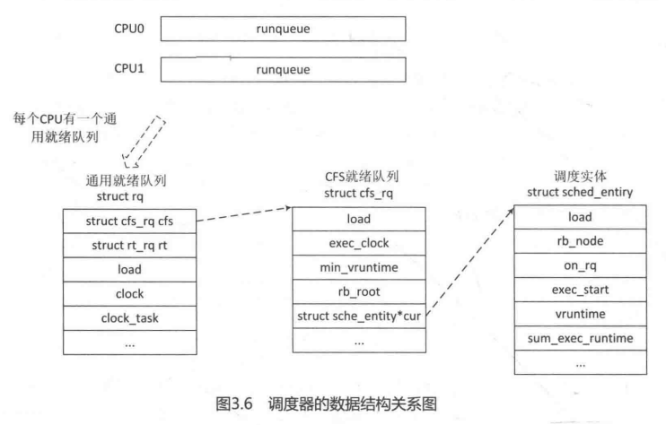

# Linux内核进程管理(七)——CFS调度器之二

-   本章介绍CFS调度器在进程创建过程中涉及的一些东西，本章节建议与《进程创建》章节结合来阅读。

    

## 1. 进程创建中的进程调度初始化

-   进程的创建通过`do_fork()`函数来完成，`do_fork()`在执行过程中就参与了进程调度相关的初始化(主要调用流程`[do_fork() -> sched_fork() -> __sched_fork()]`)。
-   `kernel4.14/kernel/sched/core.c`, `[do_fork() -> sched_fork()]`

```c
/*
 * fork()/clone()-time setup:
 */
int sched_fork(unsigned long clone_flags, struct task_struct *p)
{
	unsigned long flags;
	int cpu = get_cpu();

    /* __sched_fork函数执行基本设置，即初始化进程调度相关的数据结构，调度实体
     * 用struct sched_entity数据结构来描述，每个进程或线程都是一个调度实体，
     * 另外，也包括组调度（sched group）,task_struct结构体中有一个成员se，
     * 就是来描述调度实体的，__sched_fork函数就是为se初始化，该函数定义我们
     * 已在下面给出
     */
	__sched_fork(clone_flags, p);
	/*
	 * We mark the process as NEW here. This guarantees that
	 * nobody will actually run it, and a signal or other external
	 * event cannot wake it up and insert it on the runqueue either.
	 */
    //设置新进程的状态为TASK_NEW
	p->state = TASK_NEW;

	/*
	 * Make sure we do not leak PI boosting priority to the child.
	 */
    /* 把新进程的调度优先级设置为当前进程的正常优先级，至于为什么不设置为当前
     * 进程的调度优先级，是因为当前进程可能因为占有实时互斥锁而被临时提升了优先级
     */
	p->prio = current->normal_prio;

	/*
	 * Revert to default priority/policy on fork if requested.
	 * 以下if语句，如果当前进程使用sched_setscheduler设置调度策略和相关参数时
	 * 设置了标志SCHED_RESET_ON_FORK，要求创建新进程的调度策略和优先级设置为
	 * 默认值，具体处理如下
	 */
	if (unlikely(p->sched_reset_on_fork)) {
		if (task_has_dl_policy(p) || task_has_rt_policy(p)) {
            /* 如果当前进程是限制进程或实时进程，那么把新进程的调度策略恢复成SCHED_NORMAL，
             * 把nice值设置成默认值0，对应静态优先级120
             */
			p->policy = SCHED_NORMAL;
			p->static_prio = NICE_TO_PRIO(0);
			p->rt_priority = 0;
		} else if (PRIO_TO_NICE(p->static_prio) < 0) 
            /* 如果当前进程是普通进程，并且nice值小于0，那么把新进程的nice值恢复成默认值0，
             * 对应静态优先级120 
             */
			p->static_prio = NICE_TO_PRIO(0);

		p->prio = p->normal_prio = __normal_prio(p);
		set_load_weight(p);

		/*
		 * We don't need the reset flag anymore after the fork. It has
		 * fulfilled its duty:
		 */
		p->sched_reset_on_fork = 0;
	}
	/* 根据新进程的调度优先级设置调度类 */
	if (dl_prio(p->prio)) {
        /* 如果调度优先级是限期调度类的优先级，那么返回EAGAIN，因为不允许限期进程
         * 分叉生成新的限期进程
         */
		put_cpu();
		return -EAGAIN;
	} else if (rt_prio(p->prio)) {
        /* 如果调度优先级是实时调度类的优先级，那么把调度类设置为实时调度类
         */
		p->sched_class = &rt_sched_class;
	} else {
        /* 如果调度优先级是公平调度类的优先级，那么把调度类设置为公平调度类
         */
		p->sched_class = &fair_sched_class;
	}

    /* 如果定义了CONFIG_SMP，该函数配置新进程调度实体se的成员avg参数，如果
     * 没有定义，该函数为空，什么也不做
     */
	init_entity_runnable_average(&p->se);

	/*
	 * The child is not yet in the pid-hash so no cgroup attach races,
	 * and the cgroup is pinned to this child due to cgroup_fork()
	 * is ran before sched_fork().
	 *
	 * Silence PROVE_RCU.
	 */
	raw_spin_lock_irqsave(&p->pi_lock, flags);
	/*
	 * We're setting the CPU for the first time, we don't migrate,
	 * so use __set_task_cpu(). 
	 */
    /* 调用函数__set_task_cpu，设置新进程在哪个处理器上，如果开启公平组调度和
     * 实时组调度，那么还需要设置新进程属于哪个公平运行队列和哪个实时运行队列。*/
	__set_task_cpu(p, cpu);
    /* 执行调度类的task_fork方法 */
	if (p->sched_class->task_fork)
		p->sched_class->task_fork(p);
	raw_spin_unlock_irqrestore(&p->pi_lock, flags);

#ifdef CONFIG_SCHED_INFO
	if (likely(sched_info_on()))
		memset(&p->sched_info, 0, sizeof(p->sched_info));
#endif
#if defined(CONFIG_SMP)
	p->on_cpu = 0;
#endif
    /* 初始化新进程的抢占计数器，在抢占式内核中设置为2，在非抢占式内核中设置为0，因为在
     * 抢占式内核中，如果函数schedule()在调度进程时选中了新进程，那么调度函数rq_unlock_irq()
     * 和sched_preempt_enable_no_resched()时会把新进程的抢占技术减两次
     */
	init_task_preempt_count(p);
#ifdef CONFIG_SMP
	plist_node_init(&p->pushable_tasks, MAX_PRIO);
	RB_CLEAR_NODE(&p->pushable_dl_tasks);
#endif
	/* put_cpu()和get_cpu()函数配对使用，put_cpu()会使能内核抢占 */
	put_cpu();
	return 0;
}

```


## 2. task_fork方法

### 2.1 `task_fork_fair()`函数相关数据结构

-   每个调度类都定义了一套操作方法集，调用CFS调度器的`task_fork`方法做一些fork相关的初始化。CFS调度器调度类定义的操作方法集如下：

```c
/*
 * All the scheduling class methods:
 */
const struct sched_class fair_sched_class = {
	.next			= &idle_sched_class,
	.enqueue_task		= enqueue_task_fair,
	.dequeue_task		= dequeue_task_fair,
	.yield_task		= yield_task_fair,
	.yield_to_task		= yield_to_task_fair,

	.check_preempt_curr	= check_preempt_wakeup,

	.pick_next_task		= pick_next_task_fair,
	.put_prev_task		= put_prev_task_fair,

#ifdef CONFIG_SMP
	.select_task_rq		= select_task_rq_fair,
	.migrate_task_rq	= migrate_task_rq_fair,

	.rq_online		= rq_online_fair,
	.rq_offline		= rq_offline_fair,

	.task_dead		= task_dead_fair,
	.set_cpus_allowed	= set_cpus_allowed_common,
#endif

	.set_curr_task          = set_curr_task_fair,
	.task_tick		= task_tick_fair,
	.task_fork		= task_fork_fair,

	.prio_changed		= prio_changed_fair,
	.switched_from		= switched_from_fair,
	.switched_to		= switched_to_fair,

	.get_rr_interval	= get_rr_interval_fair,

	.update_curr		= update_curr_fair,

#ifdef CONFIG_FAIR_GROUP_SCHED
	.task_change_group	= task_change_group_fair,
#endif
};

```

-   `task_fork`方法实现在`kernel4.14/kernel/sched/fair.c`

```c
/*
 * called on fork with the child task as argument from the parent's context
 *  - child not yet on the tasklist
 *  - preemption disabled
 */
static void task_fork_fair(struct task_struct *p)
{
	struct cfs_rq *cfs_rq;
	struct sched_entity *se = &p->se, *curr;
	struct rq *rq = this_rq();
	struct rq_flags rf;

	rq_lock(rq, &rf);
	update_rq_clock(rq);

	cfs_rq = task_cfs_rq(current);
	curr = cfs_rq->curr;
	if (curr) {
		update_curr(cfs_rq);
		se->vruntime = curr->vruntime;
	}
	place_entity(cfs_rq, se, 1);

	if (sysctl_sched_child_runs_first && curr && entity_before(curr, se)) {
		/*
		 * Upon rescheduling, sched_class::put_prev_task() will place
		 * 'current' within the tree based on its new key value.
		 */
		swap(curr->vruntime, se->vruntime);
		resched_curr(rq);
	}

	se->vruntime -= cfs_rq->min_vruntime;
	rq_unlock(rq, &rf);
}

```

>   `task_fork_fair()`函数的参数p表示新创建的进程。进程`task_struct`数据结构中内嵌了调度实体`struct sched_entity`结构体，因此由`task_struct`可以得到该进程的调度实体。系统中每一个CPU有一个就绪队列(`runqueue`)，它是`Per-CPU`类型，即每个CPU有一个`struct rq`数据结构。`this_rq()`可以获取当前CPU就绪队列数据结构`struct rq`。`kernel4.14/kernel/sched/sched.h`

```c
DECLARE_PER_CPU_SHARED_ALIGNED(struct rq, runqueues);

#define cpu_rq(cpu)		(&per_cpu(runqueues, (cpu)))
#define this_rq()		this_cpu_ptr(&runqueues)
#define task_rq(p)		cpu_rq(task_cpu(p))
#define cpu_curr(cpu)		(cpu_rq(cpu)->curr)
#define raw_rq()		raw_cpu_ptr(&runqueues)

```

>   `struct rq`数据结构是描述CPU的通用就绪队列，rq数据结构中记录了一个就绪队列所需要的全部信息，包括一个CFS调度器就绪队列数据结构`struct cfs_rq`、一个实时进程当前就绪队列数据结构`struct rt_rq`和一个deadline调度器就绪队列数据结构`struct dl_rq`，以及就绪队列的权重load等信息。`struct rq`重要的数据结构定义如下：`kernel4.14/kernel/sched/sched.h`

```c
/*
 * This is the main, per-CPU runqueue data structure.
 *
 * Locking rule: those places that want to lock multiple runqueues
 * (such as the load balancing or the thread migration code), lock
 * acquire operations must be ordered by ascending &runqueue.
 */
struct rq {
	/* runqueue lock: */
	raw_spinlock_t lock;

	/*
	 * nr_running and cpu_load should be in the same cacheline because
	 * remote CPUs use both these fields when doing load calculation.
	 */
	unsigned int nr_running;
	...
	/* capture load from *all* tasks on this cpu: */
	struct load_weight load;
	unsigned long nr_load_updates;
	u64 nr_switches;

	struct cfs_rq cfs;
	struct rt_rq rt;
	struct dl_rq dl;

	...

	struct task_struct *curr, *idle, *stop;
	unsigned long next_balance;
	struct mm_struct *prev_mm;

	unsigned int clock_update_flags;
	u64 clock;
	u64 clock_task;

	atomic_t nr_iowait;

#ifdef CONFIG_SMP
	struct root_domain *rd;
	struct sched_domain *sd;

	unsigned long cpu_capacity;
	unsigned long cpu_capacity_orig;

	struct callback_head *balance_callback;

	unsigned char idle_balance;

	unsigned long misfit_task_load;

	/* For active balancing */
	int active_balance;
	int push_cpu;
	struct task_struct *push_task;
	struct cpu_stop_work active_balance_work;
	/* cpu of this runqueue: */
	int cpu;
	int online;

	...
#endif

	...
};

```

>   `struct cfs_rq`是CFS调度器就绪队列的数据结构，定义如下，`kernel4.14/kernel/sched/sched.h`

```c
/* CFS-related fields in a runqueue */
struct cfs_rq {
	struct load_weight load;
	unsigned int nr_running, h_nr_running;

	u64 exec_clock;
	u64 min_vruntime;
#ifndef CONFIG_64BIT
	u64 min_vruntime_copy;
#endif

	struct rb_root_cached tasks_timeline;

	/*
	 * 'curr' points to currently running entity on this cfs_rq.
	 * It is set to NULL otherwise (i.e when none are currently running).
	 */
	struct sched_entity *curr, *next, *last, *skip;

	...

#ifdef CONFIG_SMP
	/*
	 * CFS load tracking
	 */
	struct sched_avg avg;
	u64 runnable_load_sum;
	unsigned long runnable_load_avg;
	...
#endif /* CONFIG_SMP */

	...
};

```

>   内核中调度器相关数据结构的关系如下图所示，看起来很复杂，其实它们是有关联的：




### 2.2 获取CFS就绪队列

-   继续解析`task_fork_fair()`函数，为解析更加清晰，我们再次将代码贴出来：

```c
/*
 * called on fork with the child task as argument from the parent's context
 *  - child not yet on the tasklist
 *  - preemption disabled
 */
static void task_fork_fair(struct task_struct *p)
{
	struct cfs_rq *cfs_rq;
	struct sched_entity *se = &p->se, *curr;
	struct rq *rq = this_rq();
	struct rq_flags rf;

	rq_lock(rq, &rf);
	update_rq_clock(rq);

	cfs_rq = task_cfs_rq(current);
	curr = cfs_rq->curr;
	if (curr) {
		update_curr(cfs_rq);
		se->vruntime = curr->vruntime;
	}
	place_entity(cfs_rq, se, 1);

	if (sysctl_sched_child_runs_first && curr && entity_before(curr, se)) {
		/*
		 * Upon rescheduling, sched_class::put_prev_task() will place
		 * 'current' within the tree based on its new key value.
		 */
		swap(curr->vruntime, se->vruntime);
		resched_curr(rq);
	}

	se->vruntime -= cfs_rq->min_vruntime;
	rq_unlock(rq, &rf);
}

```

>   se表示新进程的调度实体，由current变量取得当前进程对应的CFS调度器就绪队列的数据结构(cfs_rq)。调度器代码中经常有类似的转换，例如取出当前CPU的通用就绪队列`struct rq`数据结构，取出当前进程对应的通用就绪队列，取出当前进程对应的CFS调度器就绪队列等。
>
>   `task_cfs_rq()`函数可以取出当前进程对应的CFS就绪队列：

```c
# define task_thread_info(task)	((struct thread_info *)(task)->stack)

static inline unsigned int task_cpu(const struct task_struct *p)
{
#ifdef CONFIG_THREAD_INFO_IN_TASK
	return p->cpu;
#else
	return task_thread_info(p)->cpu;
#endif
}

#define cpu_rq(cpu)		(&per_cpu(runqueues, (cpu)))
#define task_rq(p)		cpu_rq(task_cpu(p))

static inline struct cfs_rq *task_cfs_rq(struct task_struct *p)
{
	return &task_rq(p)->cfs;
}

```


### 2.3 update_curr

-   继续解析`task_fork_fair()`函数，`task_fork_fair() -> update_curr()`，`update_curr()`函数是CFS调度器中比较核心的函数，`kernel4.14/kernel/sched/fair.c`

```c
/*
 * Update the current task's runtime statistics.
 */
static void update_curr(struct cfs_rq *cfs_rq)
{
	struct sched_entity *curr = cfs_rq->curr;
	u64 now = rq_clock_task(rq_of(cfs_rq));
	u64 delta_exec;
	int cpu = cpu_of(rq_of(cfs_rq));

	if (unlikely(!curr))
		return;

	delta_exec = now - curr->exec_start;
	if (unlikely((s64)delta_exec <= 0))
		return;

	curr->exec_start = now;

	schedstat_set(curr->statistics.exec_max,
		      max(delta_exec, curr->statistics.exec_max));

	curr->sum_exec_runtime += delta_exec;

	if (cpumask_test_cpu(cpu, &min_cap_cpu_mask))
		curr->s_sum_exec_runtime += delta_exec;
	else
		curr->b_sum_exec_runtime += delta_exec;

	schedstat_add(cfs_rq->exec_clock, delta_exec);

	curr->vruntime += calc_delta_fair(delta_exec, curr);
	update_min_vruntime(cfs_rq);

	if (entity_is_task(curr)) {
		struct task_struct *curtask = task_of(curr);

		trace_sched_stat_runtime(curtask, delta_exec, curr->vruntime);
		cpuacct_charge(curtask, delta_exec);
		account_group_exec_runtime(curtask, delta_exec);
	}

	account_cfs_rq_runtime(cfs_rq, delta_exec);
}

/*
 * delta /= w
 */
static inline u64 calc_delta_fair(u64 delta, struct sched_entity *se)
{
	if (unlikely(se->load.weight != NICE_0_LOAD))
		delta = __calc_delta(delta, NICE_0_LOAD, &se->load);

	return delta;
}

```

>   `update_curr()`函数的参数是当前进程对应的CFS就绪队列，`curr`指针指向的调度实体是当前进程，即父进程。`rq_clock_task()`获取当前就绪队列保存的`clock_task`值，该变量在每次时钟滴答(tick)到来时更新。`delta_exec`计算该进程从上次调用`update_curr()`函数到现在的时间差。`calc_delta_fair()`使用`delta_exec`时间差来计算该进程的虚拟时间`vruntime`。
>
>   调度实体`struct sched_entity`数据结构有一个成员`weight`，用于记录该进程的权重。`calc_delta_fair()`函数首先判断该调度实体的权重是否为`NICE_0_LOAD`，如果是，则直接使用该`delta`时间。`delta`为实际运行时间，arm64架构下，`NICE_0_LOAD`值为`2^20`，最终虚拟运行时间的计算公式为： `虚拟运行时间 = 实际运行时间 X nice 0 对应的权重/进程nice值对应的权重`。`__calc_delta()`利用参考权重来计算虚拟时间。把nice值为0的进程作为一个参考进程，系统上所有的进程都以此为参照物，根据参考进程权重和权重的比值作为速率向前奔跑。nice值范围是`-20 ～ 19`，nice值越大，优先级越低，优先级越低的进程，其权重也越低。因此按照`vruntime`的计算公式，进程权重小，那么在红黑树中选择`vruntime`值反而越大；反之，进程优先级高，权重也大，`vruntime`值反而越小，CFS总是在红黑树中选择`vruntime`最小的进程进程调度，优先级高的进程总会被优先选择，随着`vruntime`增长，优先级低的进程也会有机会运行。


### 2.4 place_entity

-   继续分析`task_fork_fair()`函数，`task_fork_fair() -> place_entity()`，`kernel4.14/kernel/sched/fair.c`

```c
static void
place_entity(struct cfs_rq *cfs_rq, struct sched_entity *se, int initial)
{
	u64 vruntime = cfs_rq->min_vruntime;

	/*
	 * The 'current' period is already promised to the current tasks,
	 * however the extra weight of the new task will slow them down a
	 * little, place the new task so that it fits in the slot that
	 * stays open at the end.
	 */
	if (initial && sched_feat(START_DEBIT))
		vruntime += sched_vslice(cfs_rq, se);

	/* sleeps up to a single latency don't count. */
	if (!initial) {
		unsigned long thresh = sysctl_sched_latency;

		/*
		 * Halve their sleep time's effect, to allow
		 * for a gentler effect of sleepers:
		 */
		if (sched_feat(GENTLE_FAIR_SLEEPERS))
			thresh >>= 1;

		vruntime -= thresh;
	}

	/* ensure we never gain time by being placed backwards. */
	se->vruntime = max_vruntime(se->vruntime, vruntime);
}

```

>   `place_entity()`参数`cfs_rq`指父进程对应的cfs就绪队列，se是新进程的调度实体，initial值为1。每个`cfs_rq`就绪队列中都有一个成员min_vruntime，min_vruntime其实是单步递增的，用于跟踪整个CFS就绪队列中红黑树里最小vruntime值。
>
>   上述代码中，第12行，如果当前进程用于fork新进程，那么这里会对新进程的vruntime做一些惩罚，因为新创建了一个进程导致CFS运行队列的权重发生了变化。惩罚值通过`sched_vslice()`函数来计算，代码如下，`kernel4.14/kernel/sched/fair.c`

```c
unsigned int sysctl_sched_latency			= 6000000ULL;
static unsigned int sched_nr_latency = 8;
/*
 * Minimal preemption granularity for CPU-bound tasks:
 *
 * (default: 0.75 msec * (1 + ilog(ncpus)), units: nanoseconds)
 */
unsigned int sysctl_sched_min_granularity		= 750000ULL;

static u64 __sched_period(unsigned long nr_running)
{
	if (unlikely(nr_running > sched_nr_latency))
		return nr_running * sysctl_sched_min_granularity;
	else
		return sysctl_sched_latency;
}

/*
 * We calculate the wall-time slice from the period by taking a part
 * proportional to the weight.
 *
 * s = p*P[w/rw]
 */
static u64 sched_slice(struct cfs_rq *cfs_rq, struct sched_entity *se)
{
	u64 slice = __sched_period(cfs_rq->nr_running + !se->on_rq);

	for_each_sched_entity(se) {
		struct load_weight *load;
		struct load_weight lw;

		cfs_rq = cfs_rq_of(se);
		load = &cfs_rq->load;

		if (unlikely(!se->on_rq)) {
			lw = cfs_rq->load;

			update_load_add(&lw, se->load.weight);
			load = &lw;
		}
		slice = __calc_delta(slice, se->load.weight, load);
	}
	return slice;
}

/*
 * We calculate the vruntime slice of a to-be-inserted task.
 *
 * vs = s/w
 */
static u64 sched_vslice(struct cfs_rq *cfs_rq, struct sched_entity *se)
{
	return calc_delta_fair(sched_slice(cfs_rq, se), se);
}

```

>   由以上代码，我们可以看出`sched_vslice()`函数调用流程：`sched_vslice()->sched_slice()->__sched_period()->calc_delta_fair()`。
>
>   首先`__sched_period()`函数会计算CFS就绪队列中的一个调度周期的长度，可以理解为一个调度周期的时间片，它根据当前运行的进程数目来计算。CFS调度器有一个默认调度时间片，默认值为6ms，即`sysctl_sched_latency`变量，当运行中的进程数目大于8（即变量`sched_nr_latency`值）时，则按照进程最小的调度延时（`sysctl_sched_min_granularity， 0.75ms`）乘以进程数目来计算调度周期时间片，反之，用系统默认的调度时间片，即`sysctl_sched_latency`。
>
>   其次`sched_slice()`根据当前进程的权重来计算在CFS就绪队列总权重中可以瓜分到的调度时间。
>
>   最后`calc_delta_fair`根据`sched_slice()`计算得来的时间计算可以得到多少虚拟运行时间。

>   再看`place_entity`函数，新创建的进程会得到惩罚，惩罚的时间根据新进程的权重由`sched_vslice()`函数计算虚拟时间。最后新进程调度实体的虚拟时间是在调度实体的实际虚拟时间和CFS运行队列中`vruntime`中取最大值。


### 2.5 调度实体最终虚拟运行时间

-   继续分析`task_fork_fair()`函数，即代码第33行，`se->vruntime -= cfs_rq->min_vruntime;`，之所以通过`place_entity`函数计算得到的`se->vruntime`要减去`min_vruntime`，是因为新进程还没加入到调度器中，加入调度器时会重新加上`min_vruntime`值。


## 3. wake_up_new_task方法

-   新进程创建完成后需要由`wake_up_new_task()`函数把它加入到调度器中。`_do_fork -> wake_up_new_task`，`kernel4.14/kernel/sched/core.c`

```c
/*
 * wake_up_new_task - wake up a newly created task for the first time.
 *
 * This function will do some initial scheduler statistics housekeeping
 * that must be done for every newly created context, then puts the task
 * on the runqueue and wakes it.
 */
void wake_up_new_task(struct task_struct *p)
{
	struct rq_flags rf;
	struct rq *rq;

	raw_spin_lock_irqsave(&p->pi_lock, rf.flags);

	walt_init_new_task_load(p);
	// 把新进程的状态从 TASK_NEW 切换到 TASK_RUNNING
	p->state = TASK_RUNNING;
#ifdef CONFIG_SMP
	/*
	 * Fork balancing, do it here and not earlier because:
	 *  - cpus_allowed can change in the fork path
	 *  - any previously selected CPU might disappear through hotplug
	 *
	 * Use __set_task_cpu() to avoid calling sched_class::migrate_task_rq,
	 * as we're not fully set-up yet.
	 *
	 * 在SMP系统上，创建新进程是执行负载均衡的绝佳机会，为新进程选择一个负载最轻的处理器
	 */
    
	__set_task_cpu(p, select_task_rq(p, task_cpu(p), SD_BALANCE_FORK, 0, 1));
#endif
	rq = __task_rq_lock(p, &rf); // 锁住运行队列
	update_rq_clock(rq); // 更新运行队列的时钟
	post_init_entity_util_avg(&p->se); // 根据公平队列的平均负载统计值，推算新进程的平均负载统计值

	walt_mark_task_starting(p); 
	activate_task(rq, p, ENQUEUE_NOCLOCK); // 把新进程插入运行队列

	p->on_rq = TASK_ON_RQ_QUEUED;
	trace_sched_wakeup_new(p);
	check_preempt_curr(rq, p, WF_FORK); // 检查新进程是否可以抢占当前进程
#ifdef CONFIG_SMP
	if (p->sched_class->task_woken) {
		/*
		 * Nothing relies on rq->lock after this, so its fine to
		 * drop it.
		 */
		rq_unpin_lock(rq, &rf);
        // 在SMP系统上，调用调度类的task_woken方法
		p->sched_class->task_woken(rq, p);
		rq_repin_lock(rq, &rf);
	}
#endif
	task_rq_unlock(rq, p, &rf); // 释放运行队列的锁
}

```

>   `select_task_rq()`函数会调用CFS调度类的`select_task_rq_fair()`方法来选择一个合适的调度域中最悠闲的CPU。该函数我们会在后续章节中解析。
>
>   `activate_task()`函数调用`enqueue_task()`函数，把新进程插入运行队列。`kernel4.14/kernel/sched/core.c`

```c
void activate_task(struct rq *rq, struct task_struct *p, int flags)
{
	if (task_contributes_to_load(p))
		rq->nr_uninterruptible--;

	enqueue_task(rq, p, flags);
}

static inline void enqueue_task(struct rq *rq, struct task_struct *p, int flags)
{
	if (!(flags & ENQUEUE_NOCLOCK))
		update_rq_clock(rq);

	if (!(flags & ENQUEUE_RESTORE)) {
		sched_info_queued(rq, p);
		psi_enqueue(p, flags & ENQUEUE_WAKEUP);
	}

	p->sched_class->enqueue_task(rq, p, flags);
}

```

>   `update_rq_clock`更新`rq->clock_task`。
>
>   上面代码最后一行，调用了调度类的`enqueue_task`方法，CFS调度器中，对应的函数为`enqueue_task_fair`，`kernel4.14/kernel/sched/fair.c`

```c
static void
enqueue_task_fair(struct rq *rq, struct task_struct *p, int flags)
{
	struct cfs_rq *cfs_rq;
	struct sched_entity *se = &p->se;
	int task_new = !(flags & ENQUEUE_WAKEUP);

	/* Update rq's walt util before update schedutil */
	walt_inc_cumulative_runnable_avg(rq, p);

	/*
	 * The code below (indirectly) updates schedutil which looks at
	 * the cfs_rq utilization to select a frequency.
	 * Let's add the task's estimated utilization to the cfs_rq's
	 * estimated utilization, before we update schedutil.
	 */
	util_est_enqueue(&rq->cfs, p);

	/*
	 * The code below (indirectly) updates schedutil which looks at
	 * the cfs_rq utilization to select a frequency.
	 * Let's update schedtune here to ensure the boost value of the
	 * current task is accounted for in the selection of the OPP.
	 *
	 * We do it also in the case where we enqueue a throttled task;
	 * we could argue that a throttled task should not boost a CPU,
	 * however:
	 * a) properly implementing CPU boosting considering throttled
	 *    tasks will increase a lot the complexity of the solution
	 * b) it's not easy to quantify the benefits introduced by
	 *    such a more complex solution.
	 * Thus, for the time being we go for the simple solution and boost
	 * also for throttled RQs.
	 */
	schedtune_enqueue_task(p, cpu_of(rq));

	/*
	 * If in_iowait is set, the code below may not trigger any cpufreq
	 * utilization updates, so do it here explicitly with the IOWAIT flag
	 * passed.
	 */
	if (p->in_iowait)
		cpufreq_update_util(rq, SCHED_CPUFREQ_IOWAIT);

	for_each_sched_entity(se) {
		if (se->on_rq)
			break;
		cfs_rq = cfs_rq_of(se);
		enqueue_entity(cfs_rq, se, flags);

		/*
		 * end evaluation on encountering a throttled cfs_rq
		 *
		 * note: in the case of encountering a throttled cfs_rq we will
		 * post the final h_nr_running increment below.
		 */
		if (cfs_rq_throttled(cfs_rq))
			break;
		cfs_rq->h_nr_running++;
		walt_inc_cfs_cumulative_runnable_avg(cfs_rq, p);

		flags = ENQUEUE_WAKEUP;
	}

	for_each_sched_entity(se) {
		cfs_rq = cfs_rq_of(se);
		cfs_rq->h_nr_running++;
		walt_inc_cfs_cumulative_runnable_avg(cfs_rq, p);

		if (cfs_rq_throttled(cfs_rq))
			break;

		update_load_avg(se, UPDATE_TG);
		update_cfs_shares(se);
	}

	if (!se) {
		add_nr_running(rq, 1);
		if (!task_new)
			update_overutilized_status(rq);
	}

	hrtick_update(rq);
}

```

>   `enqueue_task_fair()`把新进程添加到CFS就绪队列中。上述代码第一个for循环，对于没有定义`FAIR_GROUP_SCHED`的系统来说，其实是调度实体se。
>
>   `enqueue_entity()`把调度实体se添加到`cfs_rq`就绪队列中。`kernel4.14/kernel/sched/fair.c`

```c
static void
enqueue_entity(struct cfs_rq *cfs_rq, struct sched_entity *se, int flags)
{
	bool renorm = !(flags & ENQUEUE_WAKEUP) || (flags & ENQUEUE_MIGRATED);
	bool curr = cfs_rq->curr == se;

	/*
	 * If we're the current task, we must renormalise before calling
	 * update_curr().
	 */
	if (renorm && curr) /* 进程是刚创建的，因此该进程的vruntime要加上min_vruntime，我们之前在task_fork_fair()函数里vruntime减去min_vruntime，这里又添加回来，因为task_fork_fair()函数只是创建进程还没有把该进程添加到调度器。这期间min_vruntime已经发生了变化，因此添加上min_vruntime是比较准确的。 */
		se->vruntime += cfs_rq->min_vruntime;

	update_curr(cfs_rq); /* 更新当前进程的vruntime和该CFS就绪队列的min_vruntime */

	/*
	 * Otherwise, renormalise after, such that we're placed at the current
	 * moment in time, instead of some random moment in the past. Being
	 * placed in the past could significantly boost this task to the
	 * fairness detriment of existing tasks.
	 */
	if (renorm && !curr)
		se->vruntime += cfs_rq->min_vruntime;

	/*
	 * When enqueuing a sched_entity, we must:
	 *   - Update loads to have both entity and cfs_rq synced with now.
	 *   - Add its load to cfs_rq->runnable_avg
	 *   - For group_entity, update its weight to reflect the new share of
	 *     its group cfs_rq
	 *   - Add its new weight to cfs_rq->load.weight
	 */
	update_load_avg(se, UPDATE_TG);
	enqueue_entity_load_avg(cfs_rq, se);/* 计算该调度实体se的平均负载load_avg_contrib,然后添加到整个CFS就绪队列的总平均负载cfs->runnable_load_avg */
	update_cfs_shares(se);
	account_entity_enqueue(cfs_rq, se);

	if (flags & ENQUEUE_WAKEUP)
		place_entity(cfs_rq, se, 0); /* 处理刚被唤醒的进程，place_entity对唤醒进程有一定的补偿，最多可以补偿一个调度周期的一半（默认值sysctl_sched_latency/2, 3ms），即vruntime减去半个调度周期时间 */

	check_schedstat_required();
	update_stats_enqueue(cfs_rq, se, flags);
	check_spread(cfs_rq, se);
	if (!curr)
		__enqueue_entity(cfs_rq, se); /* 把该调度实体添加到CFS就绪队列的红黑树中 */
	se->on_rq = 1; /* 设置该调度实体的on_rq值为1，表示已经在CFS就绪队列中。se -> on_rq经常会被用到。 */

	if (cfs_rq->nr_running == 1) {
		list_add_leaf_cfs_rq(cfs_rq);
		check_enqueue_throttle(cfs_rq);
	}
}

```

>   `__enqueue_entity()`函数把该调度实体添加到CFS就绪队列的红黑树中，`kernel4.14/kernel/sched/fair.c`

```c
/*
 * Enqueue an entity into the rb-tree:
 */
static void __enqueue_entity(struct cfs_rq *cfs_rq, struct sched_entity *se)
{
	struct rb_node **link = &cfs_rq->tasks_timeline.rb_root.rb_node;
	struct rb_node *parent = NULL;
	struct sched_entity *entry;
	bool leftmost = true;

	/*
	 * Find the right place in the rbtree:
	 */
	while (*link) {
		parent = *link;
		entry = rb_entry(parent, struct sched_entity, run_node);
		/*
		 * We dont care about collisions. Nodes with
		 * the same key stay together.
		 */
		if (entity_before(se, entry)) {
			link = &parent->rb_left;
		} else {
			link = &parent->rb_right;
			leftmost = false;
		}
	}

	rb_link_node(&se->run_node, parent, link);
	rb_insert_color_cached(&se->run_node,
			       &cfs_rq->tasks_timeline, leftmost);
}

```

