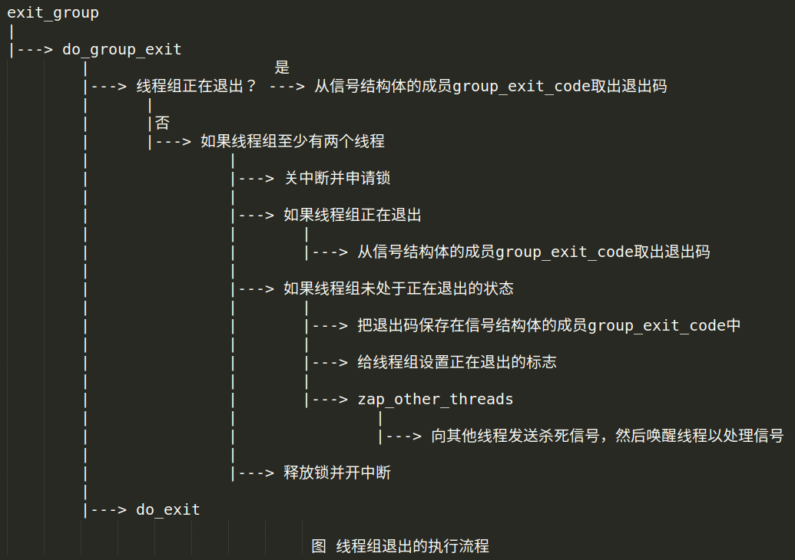

# Linux内核进程管理(三)——进程退出

## 1. 进程退出

进程退出分两种情况：进程主动退出和终止进程。

### 1.1 进程主动退出

Linux内核提供了以下两个使进程主动退出的系统调用。

>   `exit`用来使一个线程退出

```c
void exit(int status);

```

>   Linux私有的系统调用`exit_group`用来使一个线程组的所有线程退出。

```c
void exit_group(int status);

```

`glic`库封装了库函数`exit、_exit、Exit`用来使一个进程退出，这些库函数调用系统调用`exit_group`。库函数`exit、_exit`的区别是`exit`会执行由进程使用`atexit`和`on_exit`注册的函数。

注意，我们编写用户程序时调用的函数`exit`，是`glibc`库的函数`exit`，不是系统调用`exit`。


### 1.2 终止进程

终止进程是通过给进程发送信号实现的，`Linux`内核提供了发送信号的系统调用。

>   `kill`用来发送信号给进程或者进程组。

```c
int kill(pid_t pid, int sig);

```

>   `tkill`用来发送信号给线程，参数`tid`是线程标识符。

```c
int tkill(int tid, int sig);

```

>   `tgkill`用来发送信号给线程，参数`tgid`是线程组标识符，参数`tid`是线程标识符。

```c
int tgkill(int tgid, int tid, int sig);

```

`tkill`和`tgkill`是`Linux`私有的系统调用，`tkill`已经废弃，被`tgkill`取代。


### 1.3 进程退出处理

当进程退出的时候，根据父进程是否关注了子进程退出事件，处理存在如下差异：

1.   如果父进程关注子进程退出事件，那么进程退出时释放各种资源，只留下一个空的进程描述符，变成僵尸进程，发送信号`SIGCHLD`(`CHID`是`child`的缩写)通知父进程，父进程在查询进程终止的原因以后回收子进程的进程描述符。
2.   如果父进程不关注子进程退出事件，那么进程退出时释放各种资源，释放进程描述符，自动消失。

进程默认关注子进程退出事件，如果不想关注，可以使用系统调用`sigaction`针对信号`SIGCHID`设置标志`SA_NOCLDWAIT`(`CLD`是`child`的缩写)，已指示子进程退出时不要变成僵尸进程，或者设置忽略信号`SIGCHLD`


怎么查询子进程终止的原因？ Linux内核提供了3个系统调用来等待子进程的状态改变，状态改变包括：子进程终止；信号`SIGSTOP`使子进程停止执行；信号`SIGCONT`使子进程继续执行。这3个系统调用如下：

```c
pid_t waitpid(pid_t pid, int *wstatus, int options);

int waitid(idtype_t idtype, id_t id, siginfo_t *infop, int options);

pid_t wait4(pid_t pid, int *wstatus, int options, struct rusage *rusage);

```

注意： `wait4`已经废弃，新的程序应该使用`waitpid`和`waitid`。


子进程退出以后需要父进程回收进程描述符，如果父进程先退出，子进程成为”孤儿“，此时就需要父进程在其退出时给子进程寻找一个”领养者“，按照下面的顺序选择领养”孤儿“的进程：

1.   如果进程属于一个线程组，且该线程组还有其他线程，那么选择任意一个线程；
2.   选择最亲近的充当”替补领养者“的祖先进程。进程可以使用系统调用`prctl(PR_SET_CHILD_SUBREAPER)`把自己设置为”替补领养者“(`subreaper`);
3.   选择进程所属的进程号命名空间中的 1 号进程。


## 2. 线程组退出

系统调用`exit_group`实现线程组退出，执行流程如下图所示，其把主要工作委托给函数`do_group_exit`

代码实现，`kernel4.14/kernel/exit.c`

```c
SYSCALL_DEFINE1(exit_group, int, error_code)
{
	do_group_exit((error_code & 0xff) << 8);
	/* NOTREACHED */
	return 0;
}

void
do_group_exit(int exit_code)
{
	struct signal_struct *sig = current->signal;

	BUG_ON(exit_code & 0x80); /* core dumps don't get here */

	if (signal_group_exit(sig))
		exit_code = sig->group_exit_code; /* 如果线程组正在退出，那么从信号结构体的成员group_exit_code取出退出码 */
	else if (!thread_group_empty(current)) {/* 如果线程组未处于正在退出的状态，并且线程组至少有两个线程*/
		struct sighand_struct *const sighand = current->sighand;

		spin_lock_irq(&sighand->siglock); /* 关中断并申请锁 */
		if (signal_group_exit(sig)) 
			/* Another thread got here before we took the lock. 如果线程组正在退出，那么从信号结构体的成员group_exit_code取出退出码 */
			exit_code = sig->group_exit_code;
		else {/* 如果线程组未处于正在退出的状态 */
			sig->group_exit_code = exit_code; /* 把退出码保存在信号结构体的成员group_exit_code中，传递给其他线程 */
			sig->flags = SIGNAL_GROUP_EXIT; /* 给线程组设置正在退出的标志 */
			zap_other_threads(current); /* 向线程组的其他线程发送杀死信号，然后唤醒线程以处理信号 */
		}
		spin_unlock_irq(&sighand->siglock); /* 释放锁并开中断 */
	}

	do_exit(exit_code); /* 当前线程调用do_exit以退出 */
	/* NOTREACHED */
}

```

假设一个线程组有两个线程，称为线程1和线程2，线程1调用`exit_group`使线程组退出，线程1的执行流程如下：

1.   把退出码保存在信号结构体的成员`group_exit_code`中，传递给线程2；
2.   给线程组设置正在退出的标志；
3.   向线程2发送杀死信号，然后唤醒线程2，让线程2处理杀死信号；
4.   线程1调用函数`do_exit`以退出。

线程2退出的执行流程如下图所示，线程2准备返回用户模式的时候，发现收到了杀死信号，于是处理杀死信号，调用函数`do_group_exit`，函数`do_group_exit`执行过程如下：    

1.   因为线程组处于正在退出的状态，所有线程2从信号结构体的成员`group_exit_code`取出退出码；
2.   线程2调用函数`do_exit`以退出。

线程2可能在以下3中情况下准备返回用户模式：

1.   执行完系统调用；
2.   被中断抢占，中断处理程序执行完；
3.   执行指令时生成异常，异常处理程序执行完。


函数`do_exit`的代码实现，`kernel4.14/kernel/exit.c`：

```c
void __noreturn do_exit(long code)
{
	struct task_struct *tsk = current; //获取当前要释放进程的进程描述符
	int group_dead;

    /* 至函数exit_notify处，释放各种资源，把资源对应的数据结构的引用计数减 1，
     * 如果引用计数变成 0，那么释放数据结构
     */
	profile_task_exit(tsk); // 触发task_exit_notifier通知, 从而触发对应的处理函数
	kcov_task_exit(tsk);

	WARN_ON(blk_needs_flush_plug(tsk)); // 保证task_struct中的plug字段是空的，或者plug字段指向的队列是空的。plug字段的意义是stack plugging

	if (unlikely(in_interrupt())) // 中断上下文不能执行do_exit函数
		panic("Aiee, killing interrupt handler!");
	if (unlikely(!tsk->pid)) // 不能终止PID为0的进程
		panic("Attempted to kill the idle task!");
	if (unlikely(tsk->pid == 1)) // 不能终止PID为1的进程
		panic("Attempted to kill the init task!");

	/*
	 * If do_exit is called because this processes oopsed, it's possible
	 * that get_fs() was left as KERNEL_DS, so reset it to USER_DS before
	 * continuing. Amongst other possible reasons, this is to prevent
	 * mm_release()->clear_child_tid() from writing to a user-controlled
	 * kernel address.
	 */
	set_fs(USER_DS); // 设定进程可以使用的虚拟地址的上限（用户空间）,与处理器架构相关

	ptrace_event(PTRACE_EVENT_EXIT, code);

	validate_creds_for_do_exit(tsk);

	/*
	 * We're taking recursive faults here in do_exit. Safest is to just
	 * leave this task alone and wait for reboot.
	 */
    /*current->flags的PF_EXITING标志表示进程正在被删除 */
	if (unlikely(tsk->flags & PF_EXITING)) { /*  检查PF_EXITING标志是否未被设置  */
		pr_alert("Fixing recursive fault but reboot is needed!\n");
		/*
		 * We can do this unlocked here. The futex code uses
		 * this flag just to verify whether the pi state
		 * cleanup has been done or not. In the worst case it
		 * loops once more. We pretend that the cleanup was
		 * done as there is no way to return. Either the
		 * OWNER_DIED bit is set by now or we push the blocked
		 * task into the wait for ever nirwana as well.
		 */
        /*  设置进程标识为PF_EXITPIDONE*/
		tsk->flags |= PF_EXITPIDONE;
        /*  设置进程状态为不可中断的等待状态 */
		set_current_state(TASK_UNINTERRUPTIBLE);
        /*  调度其它进程  */
		schedule();
	}
	/*如果标识PF_EXITING未被设置, 则通过exit_signals来设置*/
	exit_signals(tsk);  /* sets PF_EXITING */
	/*
	 * Ensure that all new tsk->pi_lock acquisitions must observe
	 * PF_EXITING. Serializes against futex.c:attach_to_pi_owner().
	 */
	smp_mb(); /*  内存屏障，用于确保在它之后的操作开始执行之前，它之前的操作已经完成  */
	/*
	 * Ensure that we must observe the pi_state in exit_mm() ->
	 * mm_release() -> exit_pi_state_list().
	 */
	raw_spin_lock_irq(&tsk->pi_lock); 
	raw_spin_unlock_irq(&tsk->pi_lock);/*  一直等待，直到获得current->pi_lock自旋锁  */

	if (unlikely(in_atomic())) {
		pr_info("note: %s[%d] exited with preempt_count %d\n",
			current->comm, task_pid_nr(current),
			preempt_count());
		preempt_count_set(PREEMPT_ENABLED);
	}

	/* sync mm's RSS info before statistics gathering */
	if (tsk->mm) /* 同步进程的mm的rss_stat */
		sync_mm_rss(tsk->mm);
	acct_update_integrals(tsk); /* 更新进程的运行时间, 获取current->mm->rss_stat.count[member]计数  */
	group_dead = atomic_dec_and_test(&tsk->signal->live); /* 清除定时器 */
	if (group_dead) {
#ifdef CONFIG_POSIX_TIMERS
		hrtimer_cancel(&tsk->signal->real_timer);
		exit_itimers(tsk->signal);
#endif
		if (tsk->mm)
			setmax_mm_hiwater_rss(&tsk->signal->maxrss, tsk->mm);
	}
	acct_collect(code, group_dead); /* 收集进程会计信息 */
	if (group_dead)
		tty_audit_exit(); /* 记录审计事件 */
	audit_free(tsk); /* 释放struct audit_context结构体 */

	tsk->exit_code = code;
	taskstats_exit(tsk, group_dead);

    /* 释放存储空间,放弃进程占用的mm,如果没有其他进程使用该mm，则释放它。*/
	exit_mm(); 

    /* 输出进程会计信息 */
	if (group_dead)
		acct_process();
	trace_sched_process_exit(tsk);

	exit_sem(tsk); // 释放用户空间的“信号量”
	exit_shm(tsk); /* 释放锁 */
	exit_files(tsk); /* 释放已经打开的文件 */
	exit_fs(tsk); /* 释放用于表示工作目录等结构 */
	if (group_dead)
		disassociate_ctty(1); // 脱离控制终端
	exit_task_namespaces(tsk); /* 释放命名空间 */
	exit_task_work(tsk);
	exit_thread(tsk); //释放task_struct中的thread_struct结构

	/*
	 * Flush inherited counters to the parent - before the parent
	 * gets woken up by child-exit notifications.
	 *
	 * because of cgroup mode, must be called before cgroup_exit()
	 */
	perf_event_exit_task(tsk); // Performance Event功能相关资源的释放

	sched_autogroup_exit_task(tsk); 
	cgroup_exit(tsk);

	/*
	 * FIXME: do that only when needed, using sched_exit tracepoint
	 */
	flush_ptrace_hw_breakpoint(tsk); // 注销断点

	exit_tasks_rcu_start();
    /* 调用函数 exit_notify ，先为成为”孤儿“的子进程选择”领养者“，然后把自己
     * 的死讯通知父进程
     */
	exit_notify(tsk, group_dead);
	proc_exit_connector(tsk);//进程事件连接器(通过它来报告进程fork、exec、exit以及进程用户ID与组ID的变化）
	mpol_put_task_policy(tsk);
#ifdef CONFIG_FUTEX
	if (unlikely(current->pi_state_cache))
		kfree(current->pi_state_cache);
#endif
	/*
	 * Make sure we are holding no locks:
	 */
	debug_check_no_locks_held();
	/*
	 * We can do this unlocked here. The futex code uses this flag
	 * just to verify whether the pi state cleanup has been done
	 * or not. In the worst case it loops once more.
	 */
	tsk->flags |= PF_EXITPIDONE;

    /* 释放struct futex_pi_state结构体所占用的内存 */
	if (tsk->io_context)
		exit_io_context(tsk);
	/* 释放与进程描述符splice_pipe字段相关的资源 */
	if (tsk->splice_pipe)
		free_pipe_info(tsk->splice_pipe);

	if (tsk->task_frag.page)
		put_page(tsk->task_frag.page);

	validate_creds_for_do_exit(tsk);

	check_stack_usage(); //检查有多少未使用的进程内核栈
	preempt_disable();
	if (tsk->nr_dirtied)
		__this_cpu_add(dirty_throttle_leaks, tsk->nr_dirtied);
	exit_rcu();
	exit_tasks_rcu_finish();

	lockdep_free_task(tsk);
    /* do_task_dead把进程状态设置为TASK_DEAD，进程进入僵死状态，已经无法被再次调度，
     * 因为对应用程序或者用户空 间来说此进程已经死了, 但是尽管进程已经不能再被调度，但
     * 系统还是保留了它的进程描述符，这样做是为了让系统有办法在进程终止后仍能获得它的信
     * 息。在父进程获得已终止子进程的信息后，子进程的task_struct结构体才被释放（包括此
     * 进程的内核栈）, do_task_dead最后依次调用函数__schedule以调度进程，do_task_dead
     * 函数定义下面已给出
     */
	do_task_dead();
}
EXPORT_SYMBOL_GPL(do_exit);

/* kernel4.14/kernel/sched/core.c */
void __noreturn do_task_dead(void)
{
	/* Causes final put_task_struct in finish_task_switch(): */
	set_special_state(TASK_DEAD);

	/* Tell freezer to ignore us: */
	current->flags |= PF_NOFREEZE;

	__schedule(false);
	BUG();

	/* Avoid "noreturn function does return" - but don't continue if BUG() is a NOP: */
	for (;;)
		cpu_relax();
}
```

死亡进程最后一次调用函数`__schedule`(`do_exit()->do_task_dead()->__schedule()`)调度进程时，进程调度器做了如下特殊处理，`kernel4.14/kernel/sched/core.c`，`__schedule()->context_switch()->finish_task_switch()`

```c
static struct rq *finish_task_switch(struct task_struct *prev)
	__releases(rq->lock)
{
	...
	prev_state = prev->state;
	...
	if (unlikely(prev_state == TASK_DEAD)) {
		if (prev->sched_class->task_dead) // 执行调度类的task_dead方法
			prev->sched_class->task_dead(prev);
		...
		put_task_stack(prev); //如果结构体thread_info放在进程描述符里面，而不是放在内核栈的顶部，那么是否进程的内核栈
		put_task_struct(prev); //把进程描述符的引用计数减1，如果引用计数变为0，那么是否进程描述符。
	}
	...
}

```


## 3. 终止进程

>   系统调用`kill`负责向线程组或者进程组发送信号，执行流程如下图：


代码实现如下，上图已详细叙述其执行流程，代码部分不再解析，`kernel4.14/kernel/signal.c`

```c
/**
 *  sys_kill - send a signal to a process
 *  @pid: the PID of the process
 *  @sig: signal to be sent
 */
SYSCALL_DEFINE2(kill, pid_t, pid, int, sig)
{
	struct siginfo info;

	info.si_signo = sig;
	info.si_errno = 0;
	info.si_code = SI_USER;
	info.si_pid = task_tgid_vnr(current);
	info.si_uid = from_kuid_munged(current_user_ns(), current_uid());

	return kill_something_info(sig, &info, pid);
}

/*
 * kill_something_info() interprets pid in interesting ways just like kill(2).
 *
 * POSIX specifies that kill(-1,sig) is unspecified, but what we have
 * is probably wrong.  Should make it like BSD or SYSV.
 */

static int kill_something_info(int sig, struct siginfo *info, pid_t pid)
{
	int ret;

	if (pid > 0) {
		rcu_read_lock();
		ret = kill_pid_info(sig, info, find_vpid(pid));
		rcu_read_unlock();
		return ret;
	}

	/* -INT_MIN is undefined.  Exclude this case to avoid a UBSAN warning */
	if (pid == INT_MIN)
		return -ESRCH;

	read_lock(&tasklist_lock);
	if (pid != -1) {
		ret = __kill_pgrp_info(sig, info,
				pid ? find_vpid(-pid) : task_pgrp(current));
	} else {
		int retval = 0, count = 0;
		struct task_struct * p;

		for_each_process(p) {
			if (task_pid_vnr(p) > 1 &&
					!same_thread_group(p, current)) {
				int err = group_send_sig_info(sig, info, p);
				++count;
				if (err != -EPERM)
					retval = err;
			}
		}
		ret = count ? retval : -ESRCH;
	}
	read_unlock(&tasklist_lock);

	return ret;
}

```

>   函数`kill_pid_info`负责向线程组发送信号，执行流程如下图所示：

​     

函数`check_kill_permission`检查当前进程是否有权限发送信号，函数`__send_signal`负责发送信号，其主要代码如下，`kernel4.14/kernel/signal.c`

```c
static int __send_signal(int sig, struct siginfo *info, struct task_struct *t,
			int group, int from_ancestor_ns)
{
	struct sigpending *pending;
	struct sigqueue *q;
	int override_rlimit;
	int ret = 0, result;

	assert_spin_locked(&t->sighand->siglock);

	result = TRACE_SIGNAL_IGNORED;
	if (!prepare_signal(sig, t,
			from_ancestor_ns || (info == SEND_SIG_PRIV) || (info == SEND_SIG_FORCED)))
        // 如果目标线程忽略信号，那么没必要发送信号
		goto ret;
	/* 确定把信号添加到哪个信号队列和集合。线程组有一个共享的信号队列和集合，每个线程有一个私有的信号队列
     * 和集合。如果向线程组发送信号，那么应该把信号添加到线程组共享的信号队列和集合中；如果向线程发送信号，
     * 那么应该把信号添加到线程私有的信号队列和集合中
     */
	pending = group ? &t->signal->shared_pending : &t->pending;
	/*
	 * Short-circuit ignored signals and support queuing
	 * exactly one non-rt signal, so that we can get more
	 * detailed information about the cause of the signal.
	 */
	result = TRACE_SIGNAL_ALREADY_PENDING;
	if (legacy_queue(pending, sig))
        // 如果是传统信号，并且信号集合已经包含同一个信号，那么没必要重复发送信号
		goto ret;

	result = TRACE_SIGNAL_DELIVERED;
	/*
	 * fast-pathed signals for kernel-internal things like SIGSTOP
	 * or SIGKILL.
	 */
	if (info == SEND_SIG_FORCED)
		goto out_set;

	/*
	 * Real-time signals must be queued if sent by sigqueue, or
	 * some other real-time mechanism.  It is implementation
	 * defined whether kill() does so.  We attempt to do so, on
	 * the principle of least surprise, but since kill is not
	 * allowed to fail with EAGAIN when low on memory we just
	 * make sure at least one signal gets delivered and don't
	 * pass on the info struct.
	 */
    /* 判断分配信号队列节点时是否可以忽略信号队列长度的限制：对于传统信号，如果是特殊的信号信息，或者信号
     * 的编码大于0，那么允许忽略；如果是实时信号，那么不允许忽略。
     */
	if (sig < SIGRTMIN) 
		override_rlimit = (is_si_special(info) || info->si_code >= 0);
	else
		override_rlimit = 0;
	
    // 分配一个信号队列节点
	q = __sigqueue_alloc(sig, t, GFP_ATOMIC, override_rlimit);
	if (q) {
        // 如果分配信号队列节点成功，那么把它添加到信号队列中
		list_add_tail(&q->list, &pending->list);
		switch ((unsigned long) info) {
		case (unsigned long) SEND_SIG_NOINFO:
			q->info.si_signo = sig;
			q->info.si_errno = 0;
			q->info.si_code = SI_USER;
			q->info.si_pid = task_tgid_nr_ns(current,
							task_active_pid_ns(t));
			q->info.si_uid = from_kuid_munged(current_user_ns(), current_uid());
			break;
		case (unsigned long) SEND_SIG_PRIV:
			q->info.si_signo = sig;
			q->info.si_errno = 0;
			q->info.si_code = SI_KERNEL;
			q->info.si_pid = 0;
			q->info.si_uid = 0;
			break;
		default:
			copy_siginfo(&q->info, info);
			if (from_ancestor_ns)
				q->info.si_pid = 0;
			break;
		}

		userns_fixup_signal_uid(&q->info, t);

	} else if (!is_si_special(info)) {
		if (sig >= SIGRTMIN && info->si_code != SI_USER) {
			/*
			 * Queue overflow, abort.  We may abort if the
			 * signal was rt and sent by user using something
			 * other than kill().
			 */
			result = TRACE_SIGNAL_OVERFLOW_FAIL;
			ret = -EAGAIN;
			goto ret;
		} else {
			/*
			 * This is a silent loss of information.  We still
			 * send the signal, but the *info bits are lost.
			 */
			result = TRACE_SIGNAL_LOSE_INFO;
		}
	}

out_set:
    /* 如果某个进程正在通过信号文件描述符(sifnalfd)监听信号，那么通知进程。sifnalfd是进程创建用来接受
     * 信号的文件描述符，进程可以使用select或poll监听信号文件描述符。
     */
	signalfd_notify(t, sig);
    // 把信号添加到信号集合中
	sigaddset(&pending->signal, sig);
    /* 调用函数complete_signal：如果向线程组发送信号，那么需要在线程组中查找一个没有屏蔽信号的线程，
     * 唤醒它，让它处理信号
     */
	complete_signal(sig, t, group);
ret:
	trace_signal_generate(sig, info, t, group, result);
	return ret;
}

```


## 4. 查询子进程终止原因

>   系统调用`waitid`的原型如下：

```c
int waitid(idtype_t idtype, id_t id, siginfo_t *infop, int options);

```

参数`idtype`指定标识符类型，支持以下取值：

1.   `P_ALL`: 表示等待任意子进程，忽略参数`id`；
2.   `P_PID`: 表示等待进程号为`id`的子进程；
3.   `P_PGID`: 表示等待进程组标识符是`id`的任意子进程。

参数`options`是选项，取值是 0 或者以下标志的组合：

1.   `WEXITED`: 等待退出的子进程；
2.   `WSTOPPED`: 等待收到信号`SIGSTOP`并停止执行的子进程；
3.   `WCONTINUED`: 等待收到信号`SIGCONT`并继续执行的子进程；
4.   `WNOHANG`: 如果没有子进程退出，立即返回；
5.   `WNOWAIT`: 让子进程处于僵尸状态，以后可以再次查询状态信息。


>   系统调用`waitpid`的原型如下：

```c
pid_t waitpid(pid_t pid, int *wstatus, int options);

```

>   系统调用`wait4`的原型如下：

```c
pid_t wait4(pid_t pid, int *wstatus, int options, struct rusage *rusage);

```

参数`pid`取值如下：

1.   大于 0， 表示等待进程号为`pid`的子进程；
2.   等于 0， 表示等待和调用进程属于同一个进程组的任意子进程；
3.   等于 -1，表示等待任意子进程；
4.   小于 -1，表示等待进程组标识符是`pid`的绝对值的任意子进程。

参数`options`是选项，取值是 0 或者以下标志的组合：

1.   `WNOHANG`: 如果没有子进程退出，立即返回；
2.   `WUNTRACED`: 如果子进程停止执行，但是不被`ptrace`跟踪，那么立即返回；
3.   `WCONTINUED`: 等待收到信号`SIGCONT`并继续执行的子进程；

以下选项是Linux私有的，和使用`clone`创建子进程一起使用：

1.   `__WCLONE`: 只等待克隆的子进程；
2.   `__WALL`: 等待所有子进程；
3.   `__WNOTHREAD`: 不等待相同线程组中其他线程的子进程。

>   系统调用`waitpid`、`waitid`和`wait4`把主要工作委托给函数`do_wait`，函数`do_wait`的执行流程如下图所示，遍历当前线程组的每个线程，针对每个线程遍历它的子进程，如果是僵尸进程，调用函数`eligible_child`来判断是不是符合等待条件的子进程，如果符合等待条件，调用函数`wait_task_zombie`进行处理：


函数`wait_task_zombie`的执行流程如下，`kernel4.14/kernel/exit.c`：

```c
static int wait_task_zombie(struct wait_opts *wo, struct task_struct *p)
{
	int state, status;
	pid_t pid = task_pid_vnr(p);
	uid_t uid = from_kuid_munged(current_user_ns(), task_uid(p));
	struct waitid_info *infop;

    //如果调用者没有传入标志WEXITED，说明调用者不想等待退出的子进程，那么直接返回
	if (!likely(wo->wo_flags & WEXITED))
		return 0;

	if (unlikely(wo->wo_flags & WNOWAIT)) {
        //如果调用者传入标志WNOWAIT，标志调用者想让子进程处于僵尸状态，以后可以再次查询子进程的状态信息，那么只读取进程的状态信息，从线程的成员exit_code读取退出码。
		status = p->exit_code;
		get_task_struct(p);
		read_unlock(&tasklist_lock);
		sched_annotate_sleep();
		if (wo->wo_rusage)
			getrusage(p, RUSAGE_BOTH, wo->wo_rusage);
		put_task_struct(p);
		goto out_info;
	}
	/*
	 * Move the task's state to DEAD/TRACE, only one thread can do this.
	 */
    // 如果调用者没有传入标志WNOWAIT，读取进程的状态信息
	state = (ptrace_reparented(p) && thread_group_leader(p)) ?
		EXIT_TRACE : EXIT_DEAD;
    if (cmpxchg(&p->exit_state, EXIT_ZOMBIE, state) != EXIT_ZOMBIE)
		return 0;
	/*
	 * We own this thread, nobody else can reap it.
	 */
	read_unlock(&tasklist_lock);
	sched_annotate_sleep();

	/*
	 * Check thread_group_leader() to exclude the traced sub-threads.
	 */
	if (state == EXIT_DEAD && thread_group_leader(p)) {
		struct signal_struct *sig = p->signal;
		struct signal_struct *psig = current->signal;
		unsigned long maxrss;
		u64 tgutime, tgstime;

		/*
		 * The resource counters for the group leader are in its
		 * own task_struct.  Those for dead threads in the group
		 * are in its signal_struct, as are those for the child
		 * processes it has previously reaped.  All these
		 * accumulate in the parent's signal_struct c* fields.
		 *
		 * We don't bother to take a lock here to protect these
		 * p->signal fields because the whole thread group is dead
		 * and nobody can change them.
		 *
		 * psig->stats_lock also protects us from our sub-theads
		 * which can reap other children at the same time. Until
		 * we change k_getrusage()-like users to rely on this lock
		 * we have to take ->siglock as well.
		 *
		 * We use thread_group_cputime_adjusted() to get times for
		 * the thread group, which consolidates times for all threads
		 * in the group including the group leader.
		 */
		thread_group_cputime_adjusted(p, &tgutime, &tgstime);
		spin_lock_irq(&current->sighand->siglock);
		write_seqlock(&psig->stats_lock);
		psig->cutime += tgutime + sig->cutime;
		psig->cstime += tgstime + sig->cstime;
		psig->cgtime += task_gtime(p) + sig->gtime + sig->cgtime;
		psig->cmin_flt +=
			p->min_flt + sig->min_flt + sig->cmin_flt;
		psig->cmaj_flt +=
			p->maj_flt + sig->maj_flt + sig->cmaj_flt;
		psig->cnvcsw +=
			p->nvcsw + sig->nvcsw + sig->cnvcsw;
		psig->cnivcsw +=
			p->nivcsw + sig->nivcsw + sig->cnivcsw;
		psig->cinblock +=
			task_io_get_inblock(p) +
			sig->inblock + sig->cinblock;
		psig->coublock +=
			task_io_get_oublock(p) +
			sig->oublock + sig->coublock;
		maxrss = max(sig->maxrss, sig->cmaxrss);
		if (psig->cmaxrss < maxrss)
			psig->cmaxrss = maxrss;
		task_io_accounting_add(&psig->ioac, &p->ioac);
		task_io_accounting_add(&psig->ioac, &sig->ioac);
		write_sequnlock(&psig->stats_lock);
		spin_unlock_irq(&current->sighand->siglock);
	}

	if (wo->wo_rusage)
		getrusage(p, RUSAGE_BOTH, wo->wo_rusage);
    /* 如果线程组处于正在退出的状态，从线程组的信号结构体的成员group_exit_code读取退出码；
     * 如果只是一个线程退出，那么从线程的成员exit_code读取退出码
     */
	status = (p->signal->flags & SIGNAL_GROUP_EXIT)
		? p->signal->group_exit_code : p->exit_code;
	wo->wo_stat = status;

	if (state == EXIT_TRACE) {
		write_lock_irq(&tasklist_lock);
		/* We dropped tasklist, ptracer could die and untrace */
		ptrace_unlink(p);

		/* If parent wants a zombie, don't release it now */
		state = EXIT_ZOMBIE;
		if (do_notify_parent(p, p->exit_signal))
			state = EXIT_DEAD;
		p->exit_state = state;
		write_unlock_irq(&tasklist_lock);
	}
	if (state == EXIT_DEAD) // 把状态切换到死亡，释放进程描述符
		release_task(p);

out_info:
	infop = wo->wo_info;
	if (infop) {
		if ((status & 0x7f) == 0) {
			infop->cause = CLD_EXITED;
			infop->status = status >> 8;
		} else {
			infop->cause = (status & 0x80) ? CLD_DUMPED : CLD_KILLED;
			infop->status = status & 0x7f;
		}
		infop->pid = pid;
		infop->uid = uid;
	}

	return pid;
}

```

