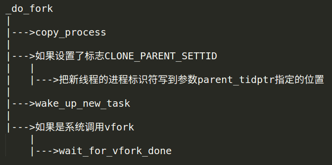
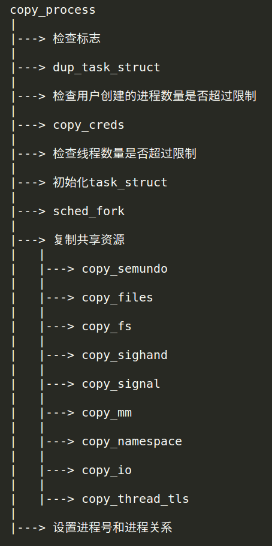
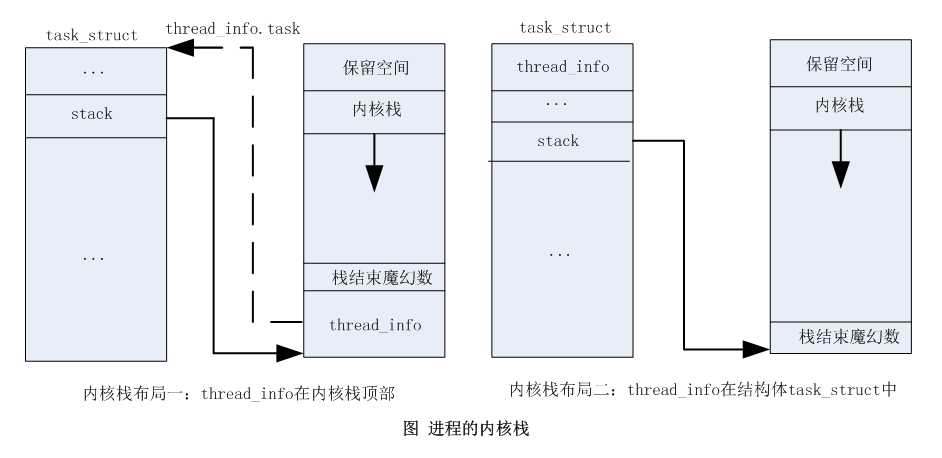
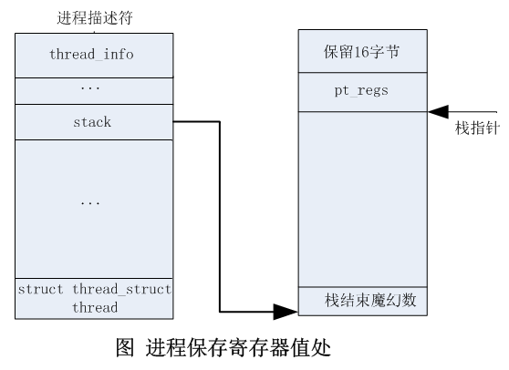
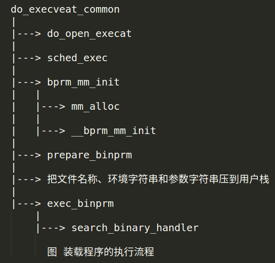
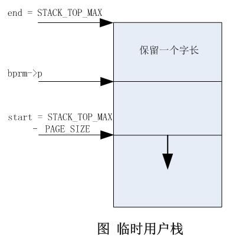
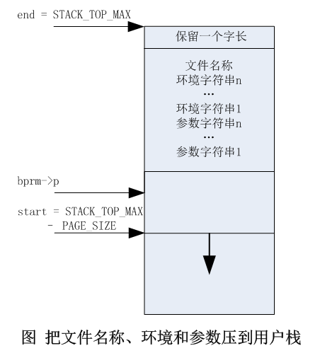
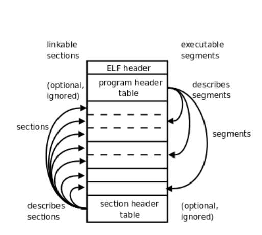
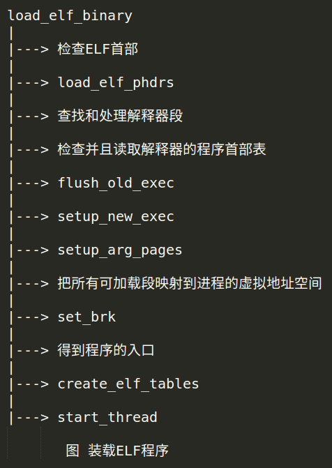
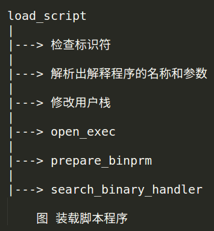

# Linux内核进程管理(二)——进程创建

>   在Linux内核中，新进程是从一个已经存在的进程复制出来的。内核使用静态数据结构造出0号内核线程，0号内核线程分叉生成1号内核线程和2号内核线程（`kthreadd`线程）。1号内核线程完成初始化以后装载用户程序，变成1号进程，其他进程都是1号进程或者它的子孙进程分叉生成的；其他内核线程是`kthreadd`线程分叉生成的。

>   共有3个系统调用可以创建新的进程
1. fork(分叉): 子进程是父进程的一个副本，采用了写时复制的技术；
2. vfork: 用于创建子进程，之后子进程立即调用`execve`以装载新程序的情况。为例避免复制物理页，父进程会睡眠等待子进程装载新程序。现在`fork`采用了写时复制的技术，`vfork`失去了速度优势，已经被废弃；
3. clone(克隆): 可以精确地控制子进程和父进程共享哪些资源。这个系统调用的主要用处是可供`pthread`库用来创建线程，`clone`是功能最齐全的函数，参数多，使用复杂，`fork`是`clone`的简化函数。

> Linux内核定义系统调用的方式，我们以`fork`为例：
```c
SYSCALL_DEFINE0(fork)
// 把宏展开以后是：
asmlinkage long sys_fork(void)
```
- `SYSCALL_DEFINE`后面的数组表示系统调用的参数个数，`SYSCALL_DEFINE0`表示系统调用没有参数，`SYSCALL_DEFINE6`表示系统调用有6个参数，如果参数超过6各，使用宏`SYSCALL_DEFINEx`。
- `asmlinkage`表示这个C语言函数可以被汇编代码调用。如果使用C++编译器，`asmlinkage`被定义为`extern "C"`，如果使用C编译器，`asmlinkage`是空的宏。
- 系统调用的函数名称以`sys_`开头。
  
> 创建新进程的进程p和生成的新进程的关系有3中情况：
1. 新进程是进程p的子进程；
2. 如果`clone`传入标志位`CLONE_PARENT`，那么新进程和进程p拥有同一个父进程，是兄弟关系；
3. 如果`clone`传入标志位`CLONE_THREAD`，那么新进程和进程p拥有同一个线程组；

>   创建新进程的3个系统调用在文件`kernel/fork.c`中，它们把工作委托给函数`_do_fork`。

## 1. 函数`_do_fork`

>   函数`_do_fork`定义如下，`kernel4.14/kernel/fork.c`

```c
/*
 *  Ok, this is the main fork-routine.
 *
 * It copies the process, and if successful kick-starts
 * it and waits for it to finish using the VM if required.
 */
long _do_fork(unsigned long clone_flags,
	      unsigned long stack_start,
	      unsigned long stack_size,
	      int __user *parent_tidptr,
	      int __user *child_tidptr,
	      unsigned long tls)
{
	struct task_struct *p;
	int trace = 0;
	long nr;

	/*
	 * Determine whether and which event to report to ptracer.  When
	 * called from kernel_thread or CLONE_UNTRACED is explicitly
	 * requested, no event is reported; otherwise, report if the event
	 * for the type of forking is enabled.
	 */
	if (!(clone_flags & CLONE_UNTRACED)) {
		if (clone_flags & CLONE_VFORK)
			trace = PTRACE_EVENT_VFORK;
		else if ((clone_flags & CSIGNAL) != SIGCHLD)
			trace = PTRACE_EVENT_CLONE;
		else
			trace = PTRACE_EVENT_FORK;

		if (likely(!ptrace_event_enabled(current, trace)))
			trace = 0;
	}

	p = copy_process(clone_flags, stack_start, stack_size, parent_tidptr,
			 child_tidptr, NULL, trace, tls, NUMA_NO_NODE);
	add_latent_entropy();
	/*
	 * Do this prior waking up the new thread - the thread pointer
	 * might get invalid after that point, if the thread exits quickly.
	 */
	if (!IS_ERR(p)) {
		struct completion vfork;
		struct pid *pid;

		cpufreq_task_times_alloc(p);

		trace_sched_process_fork(current, p);

		pid = get_task_pid(p, PIDTYPE_PID);
		nr = pid_vnr(pid);

		if (clone_flags & CLONE_PARENT_SETTID)
			put_user(nr, parent_tidptr);

		if (clone_flags & CLONE_VFORK) {
			p->vfork_done = &vfork;
			init_completion(&vfork);
			get_task_struct(p);
		}
		// 唤醒新进程
		wake_up_new_task(p);

		/* forking complete and child started to run, tell ptracer */
		if (unlikely(trace))
			ptrace_event_pid(trace, pid);

		if (clone_flags & CLONE_VFORK) {
			if (!wait_for_vfork_done(p, &vfork))
				ptrace_event_pid(PTRACE_EVENT_VFORK_DONE, pid);
		}

		put_pid(pid);
	} else {
		nr = PTR_ERR(p);
	}
	return nr;
}

```

`_do_fork`参数含义如下：

-   参数`clone_flags`是克隆标志，最低字节指定了进程退出时发给父进程的信号，创建线程时，该参数的最低字节是 0，表示线程退出时不需要向父进程发送信号。
-   参数`stack_start`只在创建线程时有意义，用来指定新线程的用户栈的起始地址。
-   参数`stack_size`只在创建线程时有意义，用来指定新线程的用户栈的长度，这个参数已经废弃。
-   参数`parent_tidptr`只在创建线程时有意义，如果参数`clone_flags`指定了标志位`CLONE_PARENT_SETTID`，那么调用线程需要把新线程的进程标识符写到参数`parent_tidptr`指定的位置，也就是新线程保存自己的进程标识符的位置。
-   参数`child_tidptr`只在创建线程时有意义，存放新线程保存自己的进程标识符的位置。如果参数`clone_flags`指定了标志位`CLONE_CHILD_CLEARTID`，那么线程退出时需要消除自己的进程标识符。如果参数`clone_flags`指定了标志位`CLONE_CHILD_SETTID`，那么线程第一次被调度时需要把自己的进程标识符写到参数`child_tidptr`指定的位置。
-   参数`tls`只在创建线程时有意义，如果参数`clone_flags`指定了标志位`CLONE_SETTLS`，那么参数`tls`指定新线程的线程本地存储的地址。

如下图所示，函数`_do_fork`的执行流程：                                      

-   调用函数`copy_process`以创建新进程。
-   如果设置了标志`CLONE_PARENT_SETTID`，那么把新线程的进程标识符写到参数`parent_tidptr`指定的位置。
-   调用函数`wake_up_new_task`以唤醒新进程。
-   如果是系统调用`vfork`，那么当前进程等待子进程装载程序。


## 2. 函数`copy_process`

>   创建新进程的主要工作由函数`copy_process`实现，其定义如下，`kernel4.14/kernel/fork.c`

```c
/*
 * This creates a new process as a copy of the old one,
 * but does not actually start it yet.
 *
 * It copies the registers, and all the appropriate
 * parts of the process environment (as per the clone
 * flags). The actual kick-off is left to the caller.
 */
static __latent_entropy struct task_struct *copy_process(
					unsigned long clone_flags,
					unsigned long stack_start,
					unsigned long stack_size,
					int __user *parent_tidptr,
					int __user *child_tidptr,
					struct pid *pid,
					int trace,
					unsigned long tls,
					int node)
{
	int pidfd = -1, retval;
	struct task_struct *p;
	// 23-88行，为检查标志，以下标志组合是非法的
    /* 同时设置CLONE_NEWNS和CLONE_FS，即新进程属于新的挂载命名空间，同时和当前进程共享文件系统信息 */
	if ((clone_flags & (CLONE_NEWNS|CLONE_FS)) == (CLONE_NEWNS|CLONE_FS))
		return ERR_PTR(-EINVAL);
	/* 同时设置CLONE_NEWUSER和CLONE_FS，即新进程属于新的用户命名空间，同时和当前进程共享文件系统信息 */
	if ((clone_flags & (CLONE_NEWUSER|CLONE_FS)) == (CLONE_NEWUSER|CLONE_FS))
		return ERR_PTR(-EINVAL);

	/*
	 * Thread groups must share signals as well, and detached threads
	 * can only be started up within the thread group.
	 */
    /* 设置CLONE_THREAD，未设置CLONE_SIGHAND，即新进程和当前进程属于同一个线程组，但是不共享信号处理程序 */
	if ((clone_flags & CLONE_THREAD) && !(clone_flags & CLONE_SIGHAND))
		return ERR_PTR(-EINVAL);

	/*
	 * Shared signal handlers imply shared VM. By way of the above,
	 * thread groups also imply shared VM. Blocking this case allows
	 * for various simplifications in other code.
	 */
    /* 设置CLONE_SIGHAND，未设置CLONE_VM，即新进程和当前进程共享信号处理程序，但是不共享虚拟内存*/
	if ((clone_flags & CLONE_SIGHAND) && !(clone_flags & CLONE_VM))
		return ERR_PTR(-EINVAL);

	/*
	 * Siblings of global init remain as zombies on exit since they are
	 * not reaped by their parent (swapper). To solve this and to avoid
	 * multi-rooted process trees, prevent global and container-inits
	 * from creating siblings.
	 */
    /* 新进程想要和当前进程成为兄弟关系，并且当前进程是某个进程号命名空间中的1号进程，这种标志组合是非法的，说明1号进程不存在兄弟进程 */
	if ((clone_flags & CLONE_PARENT) &&
				current->signal->flags & SIGNAL_UNKILLABLE)
		return ERR_PTR(-EINVAL);

	/*
	 * If the new process will be in a different pid or user namespace
	 * do not allow it to share a thread group with the forking task.
	 */
    /* 新进程和当前进程属于同一个线程组，同时新进程属于不同的用户命名空间或者进程号命名空间，这种组合是非法，说明同一个线程组的所有线程必须属于相同的用户命名空间和进程号命名空间 */
	if (clone_flags & CLONE_THREAD) {
		if ((clone_flags & (CLONE_NEWUSER | CLONE_NEWPID)) ||
		    (task_active_pid_ns(current) !=
				current->nsproxy->pid_ns_for_children))
			return ERR_PTR(-EINVAL);
	}

	if (clone_flags & CLONE_PIDFD) {
		int reserved;

		/*
		 * - CLONE_PARENT_SETTID is useless for pidfds and also
		 *   parent_tidptr is used to return pidfds.
		 * - CLONE_DETACHED is blocked so that we can potentially
		 *   reuse it later for CLONE_PIDFD.
		 * - CLONE_THREAD is blocked until someone really needs it.
		 */
		if (clone_flags &
		    (CLONE_DETACHED | CLONE_PARENT_SETTID | CLONE_THREAD))
			return ERR_PTR(-EINVAL);

		/*
		 * Verify that parent_tidptr is sane so we can potentially
		 * reuse it later.
		 */
		if (get_user(reserved, parent_tidptr))
			return ERR_PTR(-EFAULT);

		if (reserved != 0)
			return ERR_PTR(-EINVAL);
	}

	retval = -ENOMEM;
	p = dup_task_struct(current, node); //为新进程的进程描述符分配内存，下文将详细解析该函数
	if (!p)
		goto fork_out;

	cpufreq_task_times_init(p);

	/*
	 * This _must_ happen before we call free_task(), i.e. before we jump
	 * to any of the bad_fork_* labels. This is to avoid freeing
	 * p->set_child_tid which is (ab)used as a kthread's data pointer for
	 * kernel threads (PF_KTHREAD).
	 */
	p->set_child_tid = (clone_flags & CLONE_CHILD_SETTID) ? child_tidptr : NULL;
	/*
	 * Clear TID on mm_release()?
	 */
	p->clear_child_tid = (clone_flags & CLONE_CHILD_CLEARTID) ? child_tidptr : NULL;

	ftrace_graph_init_task(p);

	rt_mutex_init_task(p);

#ifdef CONFIG_PROVE_LOCKING
	DEBUG_LOCKS_WARN_ON(!p->hardirqs_enabled);
	DEBUG_LOCKS_WARN_ON(!p->softirqs_enabled);
#endif
	retval = -EAGAIN;
    /*检查用户的进程数量限制，如果拥有当前进程的用户创建的进程数量达到或者超过限制，
     *并且用户不是根用户，也没有忽略资源限制的权限（`CAP_SYS_RESOURCE`）和系统
     *管理权限（`CAP_SYS_ADMIN`），那么不允许创建新进程。
     */
	if (atomic_read(&p->real_cred->user->processes) >= 
			task_rlimit(p, RLIMIT_NPROC)) {
		if (p->real_cred->user != INIT_USER &&
		    !capable(CAP_SYS_RESOURCE) && !capable(CAP_SYS_ADMIN))
			goto bad_fork_free;
	}
	current->flags &= ~PF_NPROC_EXCEEDED;

    //复制或共享证书，下文有详细解析
	retval = copy_creds(p, clone_flags);
	if (retval < 0)
		goto bad_fork_free;

	/*
	 * If multiple threads are within copy_process(), then this check
	 * triggers too late. This doesn't hurt, the check is only there
	 * to stop root fork bombs.
	 */
	retval = -EAGAIN;
    /* 检查线程数量限制，如果线程数量达到允许的线程最大数量，那么不允许创建新进程。
     * 全局变量nr_threads存放当前的线程数量，max_threads存放允许创建的线程最大
     * 数量，默认值是MAX_THREADS
     */
	if (nr_threads >= max_threads)
		goto bad_fork_cleanup_count;

    /* delayacct_tsk_init函数：如果开启了CONFIG_TASK_DELAY_ACCT，那么进程task_struct中的delays成员
     * 记录等待相关的统计数据供用户空间程序使用
     */
	delayacct_tsk_init(p);	/* Must remain after dup_task_struct() */
    /* 下面两行，task_struct数据结构中有一个成员flags用于存放进程重要的标志位，这些标志位定义在 
     * include/linux/sched.h文件中，这里首选取消使用超级用户权限并告诉系统这不是一个
     * worker线程，worker线程由工作队列机制创建，另外设置PF_FORKNOEXEC标志位，这个进
     * 程暂时还不能执行 */
	p->flags &= ~(PF_SUPERPRIV | PF_WQ_WORKER | PF_IDLE);
	p->flags |= PF_FORKNOEXEC;
    /* 下面三行，p->children链表是新进程的子进程链表，p->sibling链表是新进程的兄
     * 弟进程链表。rcu_copy_process函数，对PREEMPT_RCU和TASKS_RCU进行初始化
     */
	INIT_LIST_HEAD(&p->children);
	INIT_LIST_HEAD(&p->sibling);
	rcu_copy_process(p);
    /* 对进程task_struct数据结构的一些成员进行初始化，之前进程task_struct数据结构的
     * 内容是从父进程复制过来的，但是作为新进程，有些内容还是要重新初始化。
     */
	p->vfork_done = NULL;
	spin_lock_init(&p->alloc_lock);

	init_sigpending(&p->pending);

	p->utime = p->stime = p->gtime = 0;
#ifdef CONFIG_ARCH_HAS_SCALED_CPUTIME
	p->utimescaled = p->stimescaled = 0;
#endif
	prev_cputime_init(&p->prev_cputime);

#ifdef CONFIG_VIRT_CPU_ACCOUNTING_GEN
	seqcount_init(&p->vtime.seqcount);
	p->vtime.starttime = 0;
	p->vtime.state = VTIME_INACTIVE;
#endif

#if defined(SPLIT_RSS_COUNTING)
	memset(&p->rss_stat, 0, sizeof(p->rss_stat));
#endif

	p->default_timer_slack_ns = current->timer_slack_ns;

#ifdef CONFIG_PSI
	p->psi_flags = 0;
#endif

	task_io_accounting_init(&p->ioac);
	acct_clear_integrals(p);

	posix_cpu_timers_init(p);

	p->io_context = NULL;
	p->audit_context = NULL;
	cgroup_fork(p);
#ifdef CONFIG_NUMA
	p->mempolicy = mpol_dup(p->mempolicy);
	if (IS_ERR(p->mempolicy)) {
		retval = PTR_ERR(p->mempolicy);
		p->mempolicy = NULL;
		goto bad_fork_cleanup_threadgroup_lock;
	}
#endif
#ifdef CONFIG_CPUSETS
	p->cpuset_mem_spread_rotor = NUMA_NO_NODE;
	p->cpuset_slab_spread_rotor = NUMA_NO_NODE;
	seqcount_init(&p->mems_allowed_seq);
#endif
#ifdef CONFIG_TRACE_IRQFLAGS
	p->irq_events = 0;
	p->hardirqs_enabled = 0;
	p->hardirq_enable_ip = 0;
	p->hardirq_enable_event = 0;
	p->hardirq_disable_ip = _THIS_IP_;
	p->hardirq_disable_event = 0;
	p->softirqs_enabled = 1;
	p->softirq_enable_ip = _THIS_IP_;
	p->softirq_enable_event = 0;
	p->softirq_disable_ip = 0;
	p->softirq_disable_event = 0;
	p->hardirq_context = 0;
	p->softirq_context = 0;
#endif

	p->pagefault_disabled = 0;

#ifdef CONFIG_LOCKDEP
	p->lockdep_depth = 0; /* no locks held yet */
	p->curr_chain_key = 0;
	p->lockdep_recursion = 0;
	lockdep_init_task(p);
#endif

#ifdef CONFIG_DEBUG_MUTEXES
	p->blocked_on = NULL; /* not blocked yet */
#endif
#ifdef CONFIG_BCACHE
	p->sequential_io	= 0;
	p->sequential_io_avg	= 0;
#endif

	/* Perform scheduler related setup. Assign this task to a CPU. */
    // sched_fork函数为新进程设置调度器相关参数，下文有代码相关解析
	retval = sched_fork(clone_flags, p);
	if (retval)
		goto bad_fork_cleanup_policy;

	retval = perf_event_init_task(p);
	if (retval)
		goto bad_fork_cleanup_policy;
	retval = audit_alloc(p);
	if (retval)
		goto bad_fork_cleanup_perf;
	/* copy all the process information */
	shm_init_task(p);
	retval = security_task_alloc(p, clone_flags);
	if (retval)
		goto bad_fork_cleanup_audit;
    /* 复制或者共享资源，共包括以下9类资源，每个函数，我们在下文都会具体解析
     */
    // 函数copy_semundo处理UNIX系统5信号量的共享问题
	retval = copy_semundo(clone_flags, p);
	if (retval)
		goto bad_fork_cleanup_security;
    // 函数copy_files复制或者共享打开文件表
	retval = copy_files(clone_flags, p);
	if (retval)
		goto bad_fork_cleanup_semundo;
    // 函数copy_fs复制或共享文件系统信息
	retval = copy_fs(clone_flags, p);
	if (retval)
		goto bad_fork_cleanup_files;
    // 函数copy_sighand复制或共享信号处理程序
	retval = copy_sighand(clone_flags, p);
	if (retval)
		goto bad_fork_cleanup_fs;
    // 函数copy_signal复制或共享信号结构体
	retval = copy_signal(clone_flags, p);
	if (retval)
		goto bad_fork_cleanup_sighand;
    // 函数copy_mm复制或共享虚拟内存
	retval = copy_mm(clone_flags, p);
	if (retval)
		goto bad_fork_cleanup_signal;
    // 函数copy_namespace创建或共享命名空间
	retval = copy_namespaces(clone_flags, p);
	if (retval)
		goto bad_fork_cleanup_mm;
    // 函数copy_io创建或共享I/O上下文
	retval = copy_io(clone_flags, p);
	if (retval)
		goto bad_fork_cleanup_namespaces;
    // 函数copy_thread_tls复制当前进程的寄存器值，并且修改一部分寄存器值
	retval = copy_thread_tls(clone_flags, stack_start, stack_size, p, tls);
	if (retval)
		goto bad_fork_cleanup_io;
	// 设置进程号和进程关系
	if (pid != &init_struct_pid) {
        /*
         * 为新进程分配进程号，从新进程所属的进程号命名空间一直到根，每层进程号命名空间为新进程
         * 分配一个进程号。
         * 开始需要判断pid 是否等于 init_struct_pid的地址，这是因为在内核初始化时，引导处理
         * 器为每个从处理器分叉生成一个空闲线程（参考函数 idle_threads_init），所有处理器的空
         * 闲线程使用进程号0，全局变量 init_struct_pid 存放空闲线程的进程号。
         */
		pid = alloc_pid(p->nsproxy->pid_ns_for_children);
		if (IS_ERR(pid)) {
			retval = PTR_ERR(pid);
			goto bad_fork_cleanup_thread;
		}
	}

	/*
	 * This has to happen after we've potentially unshared the file
	 * descriptor table (so that the pidfd doesn't leak into the child
	 * if the fd table isn't shared).
	 */
	if (clone_flags & CLONE_PIDFD) {
		retval = pidfd_create(pid);
		if (retval < 0)
			goto bad_fork_free_pid;

		pidfd = retval;
		retval = put_user(pidfd, parent_tidptr);
		if (retval)
			goto bad_fork_put_pidfd;
	}

#ifdef CONFIG_BLOCK
	p->plug = NULL;
#endif
	futex_init_task(p);

	/*
	 * sigaltstack should be cleared when sharing the same VM
	 */
	if ((clone_flags & (CLONE_VM|CLONE_VFORK)) == CLONE_VM)
		sas_ss_reset(p);

	/*
	 * Syscall tracing and stepping should be turned off in the
	 * child regardless of CLONE_PTRACE.
	 */
	user_disable_single_step(p);
	clear_tsk_thread_flag(p, TIF_SYSCALL_TRACE);
#ifdef TIF_SYSCALL_EMU
	clear_tsk_thread_flag(p, TIF_SYSCALL_EMU);
#endif
	clear_all_latency_tracing(p);

	/* ok, now we should be set up.. */
	p->pid = pid_nr(pid);
    /* 下面if/else语句，分情况设置新进程退出时发给父进程的信号，设置新进程
     * 所属的线程组
     */
	if (clone_flags & CLONE_THREAD) {
		/* 如果是创建线程，那么把新线程的成员 exit_signal 设置为 -1，新线
		 * 程退出时不需要发生信号给父进程；因为新线程和当前线程属于同一个线程
		 * 组，所以成员 group_leader指向同一个组长，成员 tgid存放组长的进程号
		 */
        p->exit_signal = -1;
		p->group_leader = current->group_leader;
		p->tgid = current->tgid;
	} else { // 创建进程
		if (clone_flags & CLONE_PARENT)
            /* 如果传入标志 CLONE_PARENT，新进程和当前进程是兄弟关系，那么新进程
             * 的成员 exit_signal等于当前进程所属线程组的组长的成员exit_signal
             */
			p->exit_signal = current->group_leader->exit_signal;
		else
            /* 如果没有传入标志 CLONE_PARENT，新进程和当前进程是父子关系，那么新进程
             * 的成员 exit_signal 是调用者指定的信号
             */
			p->exit_signal = (clone_flags & CSIGNAL);
		p->group_leader = p; // 新进程所属线程组的组长是自己
		p->tgid = p->pid;
	}

	p->nr_dirtied = 0;
	p->nr_dirtied_pause = 128 >> (PAGE_SHIFT - 10);
	p->dirty_paused_when = 0;

	p->pdeath_signal = 0;
	INIT_LIST_HEAD(&p->thread_group);
	p->task_works = NULL;

	cgroup_threadgroup_change_begin(current);
	/*
	 * Ensure that the cgroup subsystem policies allow the new process to be
	 * forked. It should be noted the the new process's css_set can be changed
	 * between here and cgroup_post_fork() if an organisation operation is in
	 * progress.
	 */
    /* 以下3行，控制组的进程数控制器检查是否允许创建新进程：从当前进程所属的控制组一直到控制组
     * 层级的根，如果其中一个控制组的进程数量大于或等于限制，那么不允许使用fork和clone创建新进程。
     * 控制组（cgroup）和进程数（PIDs）控制器：用来限制控制组及其子控制组中的进程使用fork和
     * clone创建新进程的数量，如果进程 p所属的控制组到控制组层级的根，其中有一个控制组的进程数量
     * 大于或等于限制，那么不允许进程 p使用fork和clone创建新进程。
     */
	retval = cgroup_can_fork(p);
	if (retval)
		goto bad_fork_cgroup_threadgroup_change_end;

	/*
	 * From this point on we must avoid any synchronous user-space
	 * communication until we take the tasklist-lock. In particular, we do
	 * not want user-space to be able to predict the process start-time by
	 * stalling fork(2) after we recorded the start_time but before it is
	 * visible to the system.
	 */

	p->start_time = ktime_get_ns();
	p->real_start_time = ktime_get_boot_ns();

	/*
	 * Make it visible to the rest of the system, but dont wake it up yet.
	 * Need tasklist lock for parent etc handling!
	 */
	write_lock_irq(&tasklist_lock);

	/* CLONE_PARENT re-uses the old parent */
    /* 下面if/else语句，为新进程设置父进程 */
	if (clone_flags & (CLONE_PARENT|CLONE_THREAD)) {
        /* 如果传入了标志 CLONE_PARENT（表示拥有相同的父进程） 或者 CLONE_THREAD（
         * 表示创建线程），那么新进程和当前进程拥有相同的父进程
         */
		p->real_parent = current->real_parent;
		p->parent_exec_id = current->parent_exec_id;
	} else { // 否则，新进程的父进程是当前进程
		p->real_parent = current;
		p->parent_exec_id = current->self_exec_id;
	}

	klp_copy_process(p);

	spin_lock(&current->sighand->siglock);

	/*
	 * Copy seccomp details explicitly here, in case they were changed
	 * before holding sighand lock.
	 */
	copy_seccomp(p);

	/*
	 * Process group and session signals need to be delivered to just the
	 * parent before the fork or both the parent and the child after the
	 * fork. Restart if a signal comes in before we add the new process to
	 * it's process group.
	 * A fatal signal pending means that current will exit, so the new
	 * thread can't slip out of an OOM kill (or normal SIGKILL).
	*/
	recalc_sigpending();
	if (signal_pending(current)) {
		retval = -ERESTARTNOINTR;
		goto bad_fork_cancel_cgroup;
	}
	if (unlikely(!(ns_of_pid(pid)->nr_hashed & PIDNS_HASH_ADDING))) {
		retval = -ENOMEM;
		goto bad_fork_cancel_cgroup;
	}

	if (likely(p->pid)) {
		ptrace_init_task(p, (clone_flags & CLONE_PTRACE) || trace);
		/* init_task_pid函数把新进程的成员 pids[PIDTYPE_PID].pid 指向第2行代码
		 * 分配的进程号结构体 
		 */
		init_task_pid(p, PIDTYPE_PID, pid);
		if (thread_group_leader(p)) { // 如果是创建新进程
            /* 下一行，因为新进程和当前进程属于同一个进程组，所以成员 pids[PIDTYPE_PGID].pid
             * 指向同一个进程组的组长的进程号结构体
             */
			init_task_pid(p, PIDTYPE_PGID, task_pgrp(current));
            /* 下一行，因为新进程和当前进程属于同一个会话，所以成员 pids[PIDTYPE_SID].pid
             * 指向同一个会话的控制进程的进程号结构体
             */
			init_task_pid(p, PIDTYPE_SID, task_session(current));

			if (is_child_reaper(pid)) {
                /* 如果新进程是1号进程，那么新进程是进程号命名空间中的孤儿进程领养者
                 * 忽略致命的信号，因为1号进程是不能杀死的。如果把1号进程杀死了，谁来
                 * 领养孤儿进程呢
                 */
				ns_of_pid(pid)->child_reaper = p;
				p->signal->flags |= SIGNAL_UNKILLABLE;
			}

			p->signal->leader_pid = pid;
			p->signal->tty = tty_kref_get(current->signal->tty);
			/*
			 * Inherit has_child_subreaper flag under the same
			 * tasklist_lock with adding child to the process tree
			 * for propagate_has_child_subreaper optimization.
			 */
			p->signal->has_child_subreaper = p->real_parent->signal->has_child_subreaper ||
							 p->real_parent->signal->is_child_subreaper;
            // 下一行，把新进程添加到父进程的子进程链表中
			list_add_tail(&p->sibling, &p->real_parent->children);
            // 下一行，把新进程添加到进程链表中，链表节点是成员 tasks，头结点是
            // 空闲进程的成员 tasks(init_task.tasks)
			list_add_tail_rcu(&p->tasks, &init_task.tasks);
			// 下一行，把新进程添加到进程组的进程链表中
            attach_pid(p, PIDTYPE_PGID);
            // 下一行，把新进程添加到会话的进程链表中
			attach_pid(p, PIDTYPE_SID);
			__this_cpu_inc(process_counts);
		} else { // 创建线程
            // 下一行，把线程组的线程计数加 1
			current->signal->nr_threads++;
            // 下一行，把线程组的第 2 个线程计数加 1，这个计数值是原子变量
			atomic_inc(&current->signal->live);
            // 下一行，把信号结构体的引用计数加 1
			atomic_inc(&current->signal->sigcnt);
            /* 下两行，把线程加入线程组的线程链表中，链表节点是成员 thread_group，
             * 头结点是组长的成员thread_group 
             */
			list_add_tail_rcu(&p->thread_group,
					  &p->group_leader->thread_group);
            /* 下两行，把线程加入线程组的第二条线程链表中，链表节点是成员 thread_node，
             * 头结点是信号结构体的成员thread_head
             */
			list_add_tail_rcu(&p->thread_node,
					  &p->signal->thread_head);
		}
        // 下一行，把新进程添加到进程号结构体的进程链表中
		attach_pid(p, PIDTYPE_PID);
        // 下一行，把线程计数值加 1
		nr_threads++;
	}

	total_forks++;
	spin_unlock(&current->sighand->siglock);
	syscall_tracepoint_update(p);
	write_unlock_irq(&tasklist_lock);
	/* 调用函数proc_fork_connector，通过进程事件连接器向用户空间通告进程事件 
	 * PROC_EVENT_FORK。进程可以通过进程事件连接器监视进程事件：创建协议号为
	 * NETLINK_CONNECTOR 的netlink套接字，然后绑定到多播组 CN_IDX_PROC
	 */
	proc_fork_connector(p);
	cgroup_post_fork(p);
	cgroup_threadgroup_change_end(current);
	perf_event_fork(p);

	trace_task_newtask(p, clone_flags);
	uprobe_copy_process(p, clone_flags);

	return p;

bad_fork_cancel_cgroup:
	spin_unlock(&current->sighand->siglock);
	write_unlock_irq(&tasklist_lock);
	cgroup_cancel_fork(p);
bad_fork_cgroup_threadgroup_change_end:
	cgroup_threadgroup_change_end(current);
bad_fork_put_pidfd:
	if (clone_flags & CLONE_PIDFD)
		sys_close(pidfd);
bad_fork_free_pid:
	if (pid != &init_struct_pid)
		free_pid(pid);
bad_fork_cleanup_thread:
	exit_thread(p);
bad_fork_cleanup_io:
	if (p->io_context)
		exit_io_context(p);
bad_fork_cleanup_namespaces:
	exit_task_namespaces(p);
bad_fork_cleanup_mm:
	if (p->mm) {
		mm_clear_owner(p->mm, p);
		mmput(p->mm);
	}
bad_fork_cleanup_signal:
	if (!(clone_flags & CLONE_THREAD))
		free_signal_struct(p->signal);
bad_fork_cleanup_sighand:
	__cleanup_sighand(p->sighand);
bad_fork_cleanup_fs:
	exit_fs(p); /* blocking */
bad_fork_cleanup_files:
	exit_files(p); /* blocking */
bad_fork_cleanup_semundo:
	exit_sem(p);
bad_fork_cleanup_security:
	security_task_free(p);
bad_fork_cleanup_audit:
	audit_free(p);
bad_fork_cleanup_perf:
	perf_event_free_task(p);
bad_fork_cleanup_policy:
	lockdep_free_task(p);
#ifdef CONFIG_NUMA
	mpol_put(p->mempolicy);
bad_fork_cleanup_threadgroup_lock:
#endif
	delayacct_tsk_free(p);
bad_fork_cleanup_count:
	atomic_dec(&p->cred->user->processes);
	exit_creds(p);
bad_fork_free:
	p->state = TASK_DEAD;
	put_task_stack(p);
	delayed_free_task(p);
fork_out:
	return ERR_PTR(retval);
}

```

函数`copy_process`的执行流程如下图：                                                                  

>   标志检查，我们已在函数`copy_process`中具体解析。

>   函数`dup_task_struct`，为新进程的进程描述符分配内存，把当前进程的进程描述符复制一份，为新进程分配内核栈。其定义如下，`kernel4.14/kernel/fork.c`

```c
static struct task_struct *dup_task_struct(struct task_struct *orig, int node)
{
	struct task_struct *tsk;
	unsigned long *stack;
	struct vm_struct *stack_vm_area;
	int err;
	// 此处node参数是从函数 copy_process 传过来的，其值为NUMA_NO_NODE
	if (node == NUMA_NO_NODE)
		node = tsk_fork_get_node(orig);
	tsk = alloc_task_struct_node(node);
	if (!tsk)
		return NULL;

	stack = alloc_thread_stack_node(tsk, node);
	if (!stack)
		goto free_tsk;

	stack_vm_area = task_stack_vm_area(tsk);
	/* arch_dup_task_struct把父进程orig的task_struct数据结构复制到子进程的task_struct数据结构中。struct task_struct数据结构有一个成员stack指向struct thread_info实例，struct thread_info数据结构也有一个成员task指针指向struct task_struct数据结构 */
	err = arch_dup_task_struct(tsk, orig);

	/*
	 * arch_dup_task_struct() clobbers the stack-related fields.  Make
	 * sure they're properly initialized before using any stack-related
	 * functions again.
	 */
	tsk->stack = stack;
#ifdef CONFIG_VMAP_STACK
	tsk->stack_vm_area = stack_vm_area;
#endif
/* CONFIG_THREAD_INFO_IN_TASK的定义下文有说明 */
#ifdef CONFIG_THREAD_INFO_IN_TASK
	atomic_set(&tsk->stack_refcount, 1);
#endif

	if (err)
		goto free_stack;

	err = scs_prepare(tsk, node);
	if (err)
		goto free_stack;

#ifdef CONFIG_SECCOMP
	/*
	 * We must handle setting up seccomp filters once we're under
	 * the sighand lock in case orig has changed between now and
	 * then. Until then, filter must be NULL to avoid messing up
	 * the usage counts on the error path calling free_task.
	 */
	tsk->seccomp.filter = NULL;
#endif
	/* setup_thread_stack函数把父进程的struct thread_info数据结构的内容复制到子进程的struct thread_info中 */
	setup_thread_stack(tsk, orig);
	clear_user_return_notifier(tsk);
    /* 清除thread_info->flags中的TIF_NEED_RESCHED标志位，因为新进程还没有完全诞生，不希望现在被调度。 */
	clear_tsk_need_resched(tsk);
	set_task_stack_end_magic(tsk);

#ifdef CONFIG_CC_STACKPROTECTOR
	tsk->stack_canary = get_random_canary();
#endif

	/*
	 * One for us, one for whoever does the "release_task()" (usually
	 * parent)
	 */
	atomic_set(&tsk->usage, 2);
#ifdef CONFIG_BLK_DEV_IO_TRACE
	tsk->btrace_seq = 0;
#endif
	tsk->splice_pipe = NULL;
	tsk->task_frag.page = NULL;
	tsk->wake_q.next = NULL;

	account_kernel_stack(tsk, 1);

	kcov_task_init(tsk);

#ifdef CONFIG_FAULT_INJECTION
	tsk->fail_nth = 0;
#endif

	return tsk;

free_stack:
	free_thread_stack(tsk);
free_tsk:
	free_task_struct(tsk);
	return NULL;
}

```

如下图所示，进程描述符的成员`stack`（`task_struct->stack`）指向内核栈：

内核栈的定义如下，`kernel4.14/include/linux/sched.h`

```c
union thread_union {
#ifndef CONFIG_THREAD_INFO_IN_TASK
	struct thread_info thread_info;
#endif
	unsigned long stack[THREAD_SIZE/sizeof(long)];
};

```

内核栈有两种布局：

1.  结构体`thread_info`占用内核栈的空间，在内核栈顶部，成员`task`指向进程描述符。
2.  结构体`thread_info`没有占用内核栈的空间，是进程描述符的第一个成员。

两种布局的区别是结构体`thread_info`的位置不同，如果选择第二种布局，需要打开配置宏`CONFIG_THREAD_INFO_IN_TASK`，`ARM64`架构使用第二种内核栈布局。第二种内核栈布局的好处是：`thread_info`结构体作为进程描述符的第一个成员，它的地址和进程描述符的地址相同。当进程在内核模式运行时，`ARM64`架构的内核使用用户栈指针寄存器`SP_EL0`存放当前进程的`thread_info`结构体地址，通过这个寄存器可以得到`thread_info`结构体地址，也可以得到进程描述符的地址。

内核栈的长度是`THREAD_SIZE`，它由各种处理器架构自己定义，`ARM64`架构定义的内核栈长度是`16KB`。

结构体`thread_info`存放汇编代码需要直接访问的底层数据，由各种处理器架构定义，`ARM64`架构定义的结构体如下，`kernel4.14/arch/arm64/include/asm/thread_info.h`

```c
struct thread_info {
	unsigned long		flags;		/* low level flags 底层标志位*/
	mm_segment_t		addr_limit;	/* address limit 地址限制*/
#ifdef CONFIG_ARM64_SW_TTBR0_PAN
	u64			ttbr0;		/* saved TTBR0_EL1 保存的寄存器TTBR0_EL1*/
#endif
	int			preempt_count;	/* 0 => preemptable, <0 => bug 0表示可抢占，小于0是缺陷*/
#ifdef CONFIG_SHADOW_CALL_STACK
	void			*shadow_call_stack;
#endif
};

```

1.  flags: 底层标志，常用的标志是`_TIF_SIGPENDING`和`_TIF_NEED_RESCHED`，前者表示进程有需要处理的信号，后者表示调度器需要重新调度进程。
2.  addr_limit: 进程可以访问的地址空间的上限，对于进程，它的值是用户地址空间的上限，对于内核线程，它的值是内核地址空间的上限。
3.  preempt_count： 抢占计数器。

>   检查用户的进程数量限制，我们已在函数`copy_process`中具体解析。

>   函数`copy_creds`，负责复制或共享证书，证书存放进程的用户标识符、组标识符和访问权限。如果设置了标志`CLONE_THREAD`，即新进程和当前进程属于同一个线程组，那么新进程和当前进程共享证书，如下图所示，否则，子进程复制当前进程的证书。如果设置了标志`CLONE_NEWUSER`，那么需要为新进程创建新的用户命名空间，新的用户命名空间是当前进程的用户命名空间的子命名空间，最后把用户的进程数量加 1。

 

>   检查线程数量限制，我们已在函数`copy_process`中具体解析

>   函数`sched_fork`，为新进程设置调度器相关参数，其定义如下，`kernel4.14/kernel/sched/core.c`

```c
/*
 * fork()/clone()-time setup:
 */
int sched_fork(unsigned long clone_flags, struct task_struct *p)
{
	unsigned long flags;
	int cpu = get_cpu();

    /* __sched_fork函数执行基本设置，即初始化进程调度相关的数据结构，调度实体
     * 用struct sched_entity数据结构来描述，每个进程或线程都是一个调度实体，
     * 另外，也包括组调度（sched group）,task_struct结构体中有一个成员se，
     * 就是来描述调度实体的，__sched_fork函数就是为se初始化，该函数定义我们
     * 已在下面给出
     */
	__sched_fork(clone_flags, p);
	/*
	 * We mark the process as NEW here. This guarantees that
	 * nobody will actually run it, and a signal or other external
	 * event cannot wake it up and insert it on the runqueue either.
	 */
    //设置新进程的状态为TASK_NEW
	p->state = TASK_NEW;

	/*
	 * Make sure we do not leak PI boosting priority to the child.
	 */
    /* 把新进程的调度优先级设置为当前进程的正常优先级，至于为什么不设置为当前
     * 进程的调度优先级，是因为当前进程可能因为占有实时互斥锁而被临时提升了优先级
     */
	p->prio = current->normal_prio;

	/*
	 * Revert to default priority/policy on fork if requested.
	 * 以下if语句，如果当前进程使用sched_setscheduler设置调度策略和相关参数时
	 * 设置了标志SCHED_RESET_ON_FORK，要求创建新进程的调度策略和优先级设置为
	 * 默认值，具体处理如下
	 */
	if (unlikely(p->sched_reset_on_fork)) {
		if (task_has_dl_policy(p) || task_has_rt_policy(p)) {
            /* 如果当前进程是限制进程或实时进程，那么把新进程的调度策略恢复成SCHED_NORMAL，
             * 把nice值设置成默认值0，对应静态优先级120
             */
			p->policy = SCHED_NORMAL;
			p->static_prio = NICE_TO_PRIO(0);
			p->rt_priority = 0;
		} else if (PRIO_TO_NICE(p->static_prio) < 0) 
            /* 如果当前进程是普通进程，并且nice值小于0，那么把新进程的nice值恢复成默认值0，
             * 对应静态优先级120 
             */
			p->static_prio = NICE_TO_PRIO(0);

		p->prio = p->normal_prio = __normal_prio(p);
		set_load_weight(p);

		/*
		 * We don't need the reset flag anymore after the fork. It has
		 * fulfilled its duty:
		 */
		p->sched_reset_on_fork = 0;
	}
	/* 根据新进程的调度优先级设置调度类 */
	if (dl_prio(p->prio)) {
        /* 如果调度优先级是限期调度类的优先级，那么返回EAGAIN，因为不允许限期进程
         * 分叉生成新的限期进程
         */
		put_cpu();
		return -EAGAIN;
	} else if (rt_prio(p->prio)) {
        /* 如果调度优先级是实时调度类的优先级，那么把调度类设置为实时调度类
         */
		p->sched_class = &rt_sched_class;
	} else {
        /* 如果调度优先级是公平调度类的优先级，那么把调度类设置为公平调度类
         */
		p->sched_class = &fair_sched_class;
	}

    /* 如果定义了CONFIG_SMP，该函数配置新进程调度实体se的成员avg参数，如果
     * 没有定义，该函数为空，什么也不做
     */
	init_entity_runnable_average(&p->se);

	/*
	 * The child is not yet in the pid-hash so no cgroup attach races,
	 * and the cgroup is pinned to this child due to cgroup_fork()
	 * is ran before sched_fork().
	 *
	 * Silence PROVE_RCU.
	 */
	raw_spin_lock_irqsave(&p->pi_lock, flags);
	/*
	 * We're setting the CPU for the first time, we don't migrate,
	 * so use __set_task_cpu(). 
	 */
    /* 调用函数__set_task_cpu，设置新进程在哪个处理器上，如果开启公平组调度和
     * 实时组调度，那么还需要设置新进程属于哪个公平运行队列和哪个实时运行队列。*/
	__set_task_cpu(p, cpu);
    /* 执行调度类的task_fork方法 */
	if (p->sched_class->task_fork)
		p->sched_class->task_fork(p);
	raw_spin_unlock_irqrestore(&p->pi_lock, flags);

#ifdef CONFIG_SCHED_INFO
	if (likely(sched_info_on()))
		memset(&p->sched_info, 0, sizeof(p->sched_info));
#endif
#if defined(CONFIG_SMP)
	p->on_cpu = 0;
#endif
    /* 初始化新进程的抢占计数器，在抢占式内核中设置为2，在非抢占式内核中设置为0，因为在
     * 抢占式内核中，如果函数schedule()在调度进程时选中了新进程，那么调度函数rq_unlock_irq()
     * 和sched_preempt_enable_no_resched()时会把新进程的抢占技术减两次
     */
	init_task_preempt_count(p);
#ifdef CONFIG_SMP
	plist_node_init(&p->pushable_tasks, MAX_PRIO);
	RB_CLEAR_NODE(&p->pushable_dl_tasks);
#endif
	/* put_cpu()和get_cpu()函数配对使用，put_cpu()会使能内核抢占 */
	put_cpu();
	return 0;
}

/*
 * Perform scheduler related setup for a newly forked process p.
 * p is forked by current.
 *
 * __sched_fork() is basic setup used by init_idle() too:
 */
static void __sched_fork(unsigned long clone_flags, struct task_struct *p)
{
	p->on_rq			= 0;

	p->se.on_rq			= 0;
	p->se.exec_start		= 0;
	p->se.sum_exec_runtime		= 0;
	p->se.s_sum_exec_runtime	= 0;
	p->se.b_sum_exec_runtime	= 0;
	p->se.prev_sum_exec_runtime	= 0;
	p->se.nr_migrations		= 0;
	p->se.vruntime			= 0;
#ifdef CONFIG_SCHED_WALT
	p->last_sleep_ts		= 0;
#endif

	INIT_LIST_HEAD(&p->se.group_node);
	walt_init_new_task_load(p);

#ifdef CONFIG_FAIR_GROUP_SCHED
	p->se.cfs_rq			= NULL;
#endif

#ifdef CONFIG_SCHEDSTATS
	/* Even if schedstat is disabled, there should not be garbage */
	memset(&p->se.statistics, 0, sizeof(p->se.statistics));
#endif

	RB_CLEAR_NODE(&p->dl.rb_node);
	init_dl_task_timer(&p->dl);
	init_dl_inactive_task_timer(&p->dl);
	__dl_clear_params(p);

	INIT_LIST_HEAD(&p->rt.run_list);
	p->rt.timeout		= 0;
	p->rt.time_slice	= sched_rr_timeslice;
	p->rt.on_rq		= 0;
	p->rt.on_list		= 0;

#ifdef CONFIG_PREEMPT_NOTIFIERS
	INIT_HLIST_HEAD(&p->preempt_notifiers);
#endif

#ifdef CONFIG_NUMA_BALANCING
	if (p->mm && atomic_read(&p->mm->mm_users) == 1) {
		p->mm->numa_next_scan = jiffies + msecs_to_jiffies(sysctl_numa_balancing_scan_delay);
		p->mm->numa_scan_seq = 0;
	}

	if (clone_flags & CLONE_VM)
		p->numa_preferred_nid = current->numa_preferred_nid;
	else
		p->numa_preferred_nid = -1;

	p->node_stamp = 0ULL;
	p->numa_scan_seq = p->mm ? p->mm->numa_scan_seq : 0;
	p->numa_scan_period = sysctl_numa_balancing_scan_delay;
	p->numa_work.next = &p->numa_work;
	p->numa_faults = NULL;
	p->last_task_numa_placement = 0;
	p->last_sum_exec_runtime = 0;

	p->numa_group = NULL;
#endif /* CONFIG_NUMA_BALANCING */
}

static inline void __set_task_cpu(struct task_struct *p, unsigned int cpu)
{
	set_task_rq(p, cpu);
#ifdef CONFIG_SMP
	/*
	 * After ->cpu is set up to a new value, task_rq_lock(p, ...) can be
	 * successfuly executed on another CPU. We must ensure that updates of
	 * per-task data have been completed by this moment.
	 */
    /* 调用 smp_wmb()写内存屏障语句来保证之前内容写入完成后才设置cpu*/
	smp_wmb();
#ifdef CONFIG_THREAD_INFO_IN_TASK
	p->cpu = cpu;
#else
	task_thread_info(p)->cpu = cpu;
#endif
	p->wake_cpu = cpu;
#endif
}
```

>   切回到`copy_process`,复制或共享资源如下：

-   `UNIX`系统5信号量，只有属于同一个线程组的线程之间才会共享`UNIX`系统5信号量。函数`copy_semundo`处理UNIX系统5信号量的共享问题，其函数定义如下，`kernel4.14/ipc/sem.c`。

```c
int copy_semundo(unsigned long clone_flags, struct task_struct *tsk)
{
	struct sem_undo_list *undo_list;
	int error;

	if (clone_flags & CLONE_SYSVSEM) {
        /* 如果调用者传入标志CLONE_SYSVSEM，表示共享UNIX系统5信号量，那么新
         * 进程和当前进程共享UNIX系统5信号量的撤销请求链表，对应结构体sem_undo_list，
         * 把计数加 1，当进程退出时，内核需要把信号量的计数值加上该进程曾经减去的数值。 
         */
		error = get_undo_list(&undo_list);
		if (error)
			return error;
		refcount_inc(&undo_list->refcnt);
		tsk->sysvsem.undo_list = undo_list;
	} else
        /* 否则，新进程的UNIX系统5信号量的撤销请求链接是空的 */
		tsk->sysvsem.undo_list = NULL;

	return 0;
}


```

-   打开文件表，只有属于同一个线程组的线程之间才会共享打开文件表。函数`copy_files`复制或者共享打开文件表，其函数定义如下，`kernel4.14/kernel/fork.c`

```c
static int copy_files(unsigned long clone_flags, struct task_struct *tsk)
{
	struct files_struct *oldf, *newf;
	int error = 0;

	/*
	 * A background process may not have any files ...
	 */
	oldf = current->files;
	if (!oldf)
		goto out;

	if (clone_flags & CLONE_FILES) {
        /*
         * 如果调用者传入标志CLONE_FILES，表示共享打开文件表，那么新进
         * 程和当前进程共享打开文件表的结构体 files_struct，把计数加 1
         */
		atomic_inc(&oldf->count);
		goto out;
	}
	// 否则，新进程把当前进程的打开文件表复制一份
	newf = dup_fd(oldf, &error);
	if (!newf)
		goto out;

	tsk->files = newf;
	error = 0;
out:
	return error;
}

```

-   文件系统信息。进程的文件系统信息包括根目录、当前工作目录、文件模式创建掩码。只有属于同一个线程组的线程之间才会共享文件系统信息。函数`copy_fs`复制或共享文件系统信息。其函数定义如下，`kernel4.14/kernel/fork.c`。

```c
static int copy_fs(unsigned long clone_flags, struct task_struct *tsk)
{
	struct fs_struct *fs = current->fs;
	if (clone_flags & CLONE_FS) {
		/* tsk->fs is already what we want */
        /*
         * 如果调用者传入标志CLONE_FS，表示共享文件系统信息，那么新进
         * 程和当前进程共享文件系统信息的结构体 fs_struct，把计数users加 1
         */
		spin_lock(&fs->lock);
		if (fs->in_exec) {
			spin_unlock(&fs->lock);
			return -EAGAIN;
		}
		fs->users++;
		spin_unlock(&fs->lock);
		return 0;
	}
    // 否则，新进程把当前进程的文件系统信息复制一份
	tsk->fs = copy_fs_struct(fs);
	if (!tsk->fs)
		return -ENOMEM;
	return 0;
}

```

-   信号处理程序。只有属于同一个线程组的线程之间才会共享信号处理程序。函数`copy_sighand`复制或共享信号处理程序，其函数定义如下，`kernel4.14/kernel/fork.c`。

```c
static int copy_sighand(unsigned long clone_flags, struct task_struct *tsk)
{
	struct sighand_struct *sig;

	if (clone_flags & CLONE_SIGHAND) {
        /*
         * 如果调用者传入标志CLONE_SIGHAND，表示共享信号处理程序，那么新进
         * 程和当前进程共享信号处理程序的结构体 sighand_struct，把计数加 1
         */
		atomic_inc(&current->sighand->count);
		return 0;
	}
    // 否则，新进程把当前进程的信号处理程序复制一份
	sig = kmem_cache_alloc(sighand_cachep, GFP_KERNEL);
	rcu_assign_pointer(tsk->sighand, sig);
	if (!sig)
		return -ENOMEM;

	atomic_set(&sig->count, 1);
	spin_lock_irq(&current->sighand->siglock);
	memcpy(sig->action, current->sighand->action, sizeof(sig->action));
	spin_unlock_irq(&current->sighand->siglock);
	return 0;
}

```

-   信号结构体。只有属于同一个线程组的线程之间才会共享信号结构体。函数`copy_signal`复制或共享信号结构体，其函数定义如下，`kernel4.14/kernel/fork.c`。

```c
static int copy_signal(unsigned long clone_flags, struct task_struct *tsk)
{
	struct signal_struct *sig;

    /*
     * 如果调用者传入标志CLONE_THREAD，表示创建线程，那么新进
     * 程和当前进程共享信号结构体 signal_struct
     */
	if (clone_flags & CLONE_THREAD)
		return 0;
	// 否则，为新进程分配信号结构体，然后初始化，继承当前进程的资源限制
	sig = kmem_cache_zalloc(signal_cachep, GFP_KERNEL);
	tsk->signal = sig;
	if (!sig)
		return -ENOMEM;

	sig->nr_threads = 1;
	atomic_set(&sig->live, 1);
	atomic_set(&sig->sigcnt, 1);

	/* list_add(thread_node, thread_head) without INIT_LIST_HEAD() */
	sig->thread_head = (struct list_head)LIST_HEAD_INIT(tsk->thread_node);
	tsk->thread_node = (struct list_head)LIST_HEAD_INIT(sig->thread_head);

	init_waitqueue_head(&sig->wait_chldexit);
	sig->curr_target = tsk;
	init_sigpending(&sig->shared_pending);
	seqlock_init(&sig->stats_lock);
	prev_cputime_init(&sig->prev_cputime);

#ifdef CONFIG_POSIX_TIMERS
	INIT_LIST_HEAD(&sig->posix_timers);
	hrtimer_init(&sig->real_timer, CLOCK_MONOTONIC, HRTIMER_MODE_REL);
	sig->real_timer.function = it_real_fn;
#endif

	task_lock(current->group_leader);
	memcpy(sig->rlim, current->signal->rlim, sizeof sig->rlim);
	task_unlock(current->group_leader);

	posix_cpu_timers_init_group(sig);

	tty_audit_fork(sig);
	sched_autogroup_fork(sig);

	sig->oom_score_adj = current->signal->oom_score_adj;
	sig->oom_score_adj_min = current->signal->oom_score_adj_min;

	mutex_init(&sig->cred_guard_mutex);

	return 0;
}

```

-   虚拟内存。只有属于同一个线程组的线程之间才会共享虚拟内存。函数`copy_mm`复制或共享虚拟内存，其函数定义如下，`kernel4.14/kernel/fork.c`。

```c
static int copy_mm(unsigned long clone_flags, struct task_struct *tsk)
{
	struct mm_struct *mm, *oldmm;
	int retval;

	tsk->min_flt = tsk->maj_flt = 0;
	tsk->nvcsw = tsk->nivcsw = 0;
#ifdef CONFIG_DETECT_HUNG_TASK
	tsk->last_switch_count = tsk->nvcsw + tsk->nivcsw;
#endif

	tsk->mm = NULL;
	tsk->active_mm = NULL;

	/*
	 * Are we cloning a kernel thread?
	 *
	 * We need to steal a active VM for that..
	 */
	oldmm = current->mm;
	if (!oldmm)
		return 0;

	/* initialize the new vmacache entries */
	vmacache_flush(tsk);

	if (clone_flags & CLONE_VM) {
        /*
     	 * 如果调用者传入标志CLONE_VM，表示共享虚拟内存，那么新进
     	 * 程和当前进程共享内存描述符 mm_struct，把计数mm_users加 1
     	 */
		mmget(oldmm);
		mm = oldmm;
		goto good_mm;
	}

	retval = -ENOMEM;
    // 否则，新进程复制当前进程的虚拟内存
	mm = dup_mm(tsk);
	if (!mm)
		goto fail_nomem;

good_mm:
	tsk->mm = mm;
	tsk->active_mm = mm;
	return 0;

fail_nomem:
	return retval;
}

```

-   命名空间。函数`copy_namespace`创建或共享命名空间，其函数定义如下，`kernel4.14/kernel/nsproxy.c`。

```c
int copy_namespaces(unsigned long flags, struct task_struct *tsk)
{
	struct nsproxy *old_ns = tsk->nsproxy;
	struct user_namespace *user_ns = task_cred_xxx(tsk, user_ns);
	struct nsproxy *new_ns;

	if (likely(!(flags & (CLONE_NEWNS | CLONE_NEWUTS | CLONE_NEWIPC |
			      CLONE_NEWPID | CLONE_NEWNET |
			      CLONE_NEWCGROUP)))) {
        /*
     	 * 如果共享除了用户以外的所有其他命名空间，那么新进
     	 * 程和当前进程共享命名空间代理结构体 nsproxy，把计数加 1
     	 */
		get_nsproxy(old_ns);
		return 0;
	}

    // 如果进程没有系统管理权限，那么不允许创建新的命名空间
	if (!ns_capable(user_ns, CAP_SYS_ADMIN))
		return -EPERM;

	/*
	 * CLONE_NEWIPC must detach from the undolist: after switching
	 * to a new ipc namespace, the semaphore arrays from the old
	 * namespace are unreachable.  In clone parlance, CLONE_SYSVSEM
	 * means share undolist with parent, so we must forbid using
	 * it along with CLONE_NEWIPC.
	 */
    // 如果既要求创建新的进程间通信命名空间，又要求共享UNIX系统5信号量，那么这种要求是不合理的。
	if ((flags & (CLONE_NEWIPC | CLONE_SYSVSEM)) ==
		(CLONE_NEWIPC | CLONE_SYSVSEM)) 
		return -EINVAL;
	/* 创建新的命名空间代理，然后创建或者共享命名空间
	 * 如果设置了标志CLONE_NEWNS，那么创建新的挂载命名空间，否则共享挂载命名空间
	 * 如果设置了标志CLONE_NEWUTS，那么创建新的UTS命名空间，否则共享UTS命名空间
	 * 如果设置了标志CLONE_NEWIPC，那么创建新的进程间通信命名空间，否则共享进程间通信命名空间
	 * 如果设置了标志CLONE_NEWPID，那么创建新的进程号命名空间，否则共享进程号命名空间
	 * 如果设置了标志CLONE_NEWCGROUP，那么创建新的控制组命名空间，否则共享控制组命名空间
	 * 如果设置了标志CLONE_NEWNET，那么创建新的网络命名空间，否则共享网络命名空间
	 */
	new_ns = create_new_namespaces(flags, tsk, user_ns, tsk->fs);
	if (IS_ERR(new_ns))
		return  PTR_ERR(new_ns);

	tsk->nsproxy = new_ns;
	return 0;
}

```

-   I/O上下文。函数`copy_io`创建或共享I/O上下文，其函数定义如下，`kernel4.14/kernel/fork.c`。

```c
static int copy_io(unsigned long clone_flags, struct task_struct *tsk)
{
#ifdef CONFIG_BLOCK
    struct io_context *ioc = current->io_context;
    struct io_context *new_ioc;

    if (!ioc)
        return 0;
    /*
        * Share io context with parent, if CLONE_IO is set
        */
    if (clone_flags & CLONE_IO) {
        /*
            * 如果调用者传入标志CLONE_IO，表示共享I/O上下文，那么新进
            * 程和当前进程共享I/O上下文结构体 io_context，把计数nr_tasks加 1
            */
        ioc_task_link(ioc);
        tsk->io_context = ioc;
    } else if (ioprio_valid(ioc->ioprio)) {
        // 否则，创建新的I/O上下文，然后初始化，继承当前进程的I/O优先级。
        new_ioc = get_task_io_context(tsk, GFP_KERNEL, NUMA_NO_NODE);
        if (unlikely(!new_ioc))
            return -ENOMEM;

        new_ioc->ioprio = ioc->ioprio;
        put_io_context(new_ioc);
    }
#endif
    return 0;
}

```

-   复制寄存器。调用函数`copy_thread_tls`复制当前进程的寄存器值，并且修改一部分寄存器值。如下图所示，进程有两处用来保存寄存器值：从用户模式切换到内核模式时，把用户模式的各种寄存器保存在内核栈底部的结构体`pt_regs`中；进程调度器调度进程时，切换出去的进程把寄存器值保存在进程描述符的成员`thread`中。因为不同处理器架构的寄存器不同，所以各种处理器架构需要自己定义结构体`pt_regs`和`thread_struct`，实现函数`copy_thread_tls`。ARM64架构的函数`copy_thread_tls`把主要工作委托给函数`copy_thread`，函数`copy_thread`的定义如下，``kernel4.14/arch/arm64/kernel/process.c`

```c
int copy_thread(unsigned long clone_flags, unsigned long stack_start,
		unsigned long stk_sz, struct task_struct *p)
{
	struct pt_regs *childregs = task_pt_regs(p);
	/*
	 * 把新进程的进程描述符的成员thread.cpu_context清0，在调度进程时切换出去的
	 * 进程使用这个成员保存通用寄存器的值。
	 */
	memset(&p->thread.cpu_context, 0, sizeof(struct cpu_context));

	/*
	 * In case p was allocated the same task_struct pointer as some
	 * other recently-exited task, make sure p is disassociated from
	 * any cpu that may have run that now-exited task recently.
	 * Otherwise we could erroneously skip reloading the FPSIMD
	 * registers for p.
	 */
	fpsimd_flush_task_state(p);

	if (likely(!(p->flags & PF_KTHREAD))) { // 用户进程
        /*
         * 子进程把当前进程内核栈底部的 pt_regs 结构体复制一份。当前进程从用户
         * 模式切换到内核模式时，把用户模式的各种寄存器保存一份放在内核栈底部的
         * pt_regs 结构体中。
         */
        *childregs = *current_pt_regs();
        /*
         * 把子进程的X0寄存器设置为0，因为X0寄存器存放系统调用的返回值，调用fork
         * 或clone后，子进程返回0
         */
		childregs->regs[0] = 0;

		/*
		 * Read the current TLS pointer from tpidr_el0 as it may be
		 * out-of-sync with the saved value.
		 */
        /*
         * 下面一行
		 * 把子进程的TPIDR_EL0寄存器设置为当前进程的TPIDR_EL0寄存器的值。TPIDR_EL0
		 * 是用户读写线程标识符寄存器（User Read and Write Thread ID Register），
		 * pthread库用来存放每线程数据的基准地址，存放每线程数据的区域通常被称为线程本
		 * 地存储（Thread Local Storage，TLS）
		 * 从寄存器tpidr_el0读取当前线程的线程本地存储的地址，因为它可能和保存的值不一致
		 */
		*task_user_tls(p) = read_sysreg(tpidr_el0);

		if (stack_start) {
            /*
		     * 如果系统调用clone创建线程时，指定了用户栈的起始地址，那么把新线程的栈指针
		     * 寄存器SP_EL0设置为用户栈的起始地址。
		     */
			if (is_compat_thread(task_thread_info(p)))
				childregs->compat_sp = stack_start;
			else
				childregs->sp = stack_start;
		}

		/*
		 * If a TLS pointer was passed to clone (4th argument), use it
		 * for the new thread.
		 */
        /*
		 * 如果系统调用clone创建线程时设置了标志位CLONE_SETTLS，那么把新线程的TPDIR_EL0
		 * 寄存器设置为系统调用clone第4个参数tls指定的线程本地存储的地址。
		 */
		if (clone_flags & CLONE_SETTLS)
			p->thread.tp_value = childregs->regs[3];
	} else { // 内核线程
        // 把子进程内核栈底部的 pt_regs 结构体清0
		memset(childregs, 0, sizeof(struct pt_regs)); 
        /*
         * 把子进程的处理器状态设置为PSR_MODE_EL1h，值为5，其中第0位是栈指针选择符（ARM64
         * 架构在异常级别1时可以使用异常级别1的栈指针寄存器SP_EL1，也可以使用异常级别0的栈
         * 指针寄存器SP_EL0），值为1表示选择栈指针寄存器SP_EL1；第2、3位是异常级别，值为1
         * 表示异常级别1
         */
		childregs->pstate = PSR_MODE_EL1h;
		if (IS_ENABLED(CONFIG_ARM64_UAO) &&
		    cpus_have_const_cap(ARM64_HAS_UAO))
			childregs->pstate |= PSR_UAO_BIT;

		if (arm64_get_ssbd_state() == ARM64_SSBD_FORCE_DISABLE)
			set_ssbs_bit(childregs);

        /*
         * 把子进程的x19寄存器设置为线程函数的地址，注意参数stack_start存放线程函数的地址，即
         * 用来创建内核线程的函数kernel_thread的第一个参数
         */
		p->thread.cpu_context.x19 = stack_start;
        /*
         * 把子进程的x20寄存器设置为传给线程函数的参数，注意参数stk_sz存放传给线程函数的参数，即
         * 用来创建内核线程的函数kernel_thread的第二个参数
         */
		p->thread.cpu_context.x20 = stk_sz;
	}
    //把子进程的程序计数器设置为函数ret_from_fork，子进程被调度时，从函数ret_from_fork开始执行
	p->thread.cpu_context.pc = (unsigned long)ret_from_fork;
    //把子进程的栈指针寄存器SP_EL1设置为内核栈底部 pt_regs 结构体的起始地址
	p->thread.cpu_context.sp = (unsigned long)childregs;

	ptrace_hw_copy_thread(p);

	return 0;
}

```

>   设置进程号和进程关系，我们已在函数`copy_process`中具体解析。

## 3. 唤醒新进程`wake_up_new_task`

>   `_do_fork() -> wake_up_new_task()`，函数 `wake_up_new_task()`负责唤醒刚刚创建的新进程，其函数定义如下，`kernel4.14/kernel/sched/core.c`

```c
/*
 * wake_up_new_task - wake up a newly created task for the first time.
 *
 * This function will do some initial scheduler statistics housekeeping
 * that must be done for every newly created context, then puts the task
 * on the runqueue and wakes it.
 */
void wake_up_new_task(struct task_struct *p)
{
	struct rq_flags rf;
	struct rq *rq;

	raw_spin_lock_irqsave(&p->pi_lock, rf.flags);

	walt_init_new_task_load(p);
	// 把新进程的状态从 TASK_NEW 切换到 TASK_RUNNING
	p->state = TASK_RUNNING;
#ifdef CONFIG_SMP
	/*
	 * Fork balancing, do it here and not earlier because:
	 *  - cpus_allowed can change in the fork path
	 *  - any previously selected CPU might disappear through hotplug
	 *
	 * Use __set_task_cpu() to avoid calling sched_class::migrate_task_rq,
	 * as we're not fully set-up yet.
	 *
	 * 在SMP系统上，创建新进程是执行负载均衡的绝佳机会，为新进程选择一个负载最轻的处理器
	 */
    
	__set_task_cpu(p, select_task_rq(p, task_cpu(p), SD_BALANCE_FORK, 0, 1));
#endif
	rq = __task_rq_lock(p, &rf); // 锁住运行队列
	update_rq_clock(rq); // 更新运行队列的时钟
	post_init_entity_util_avg(&p->se); // 根据公平队列的平均负载统计值，推算新进程的平均负载统计值

	walt_mark_task_starting(p); 
	activate_task(rq, p, ENQUEUE_NOCLOCK); // 把新进程插入运行队列

	p->on_rq = TASK_ON_RQ_QUEUED;
	trace_sched_wakeup_new(p);
	check_preempt_curr(rq, p, WF_FORK); // 检查新进程是否可以抢占当前进程
#ifdef CONFIG_SMP
	if (p->sched_class->task_woken) {
		/*
		 * Nothing relies on rq->lock after this, so its fine to
		 * drop it.
		 */
		rq_unpin_lock(rq, &rf);
        // 在SMP系统上，调用调度类的task_woken方法
		p->sched_class->task_woken(rq, p);
		rq_repin_lock(rq, &rf);
	}
#endif
	task_rq_unlock(rq, p, &rf); // 释放运行队列的锁
}

```


## 4. 新进程第一次运行

>   新进程第一次运行，是从函数`ret_from_fork`开始执行。函数`ret_from_fork`是由各种处理器架构自定义的函数，ARM64架构定义的`ret_from_fork`函数如下，`kernel4.14/arch/arm64/kernel/entry.S`

```c
tsk	.req	x28		// current thread_info，当前进程的thread_info结构体的地址

/*
 * This is how we return from a fork.
 */
ENTRY(ret_from_fork)
	bl	schedule_tail // 调用schedule_tail函数，为上一个进程执行清理操作
	cbz	x19, 1f	// not a kernel thread，如果寄存器x19的值是0，说明当前进程是用户进程，那么就跳转到标号1
	mov	x0, x20 // 内核线程：x19存放线程函数的地址，x20存放线程函数的参数
	blr	x19 // 调用线程函数
1:	get_thread_info tsk // 用户进程：x28 = sp_el0 = 当前进程的thread_info结构体的地址
	b	ret_to_user // 返回用户模式
ENDPROC(ret_from_fork)

```

我们在上文解析函数`copy_process`时，在解析函数`copy_thread`，我们已经提到：如果新进程是内核线程，寄存器`x19`存放线程函数的地址，寄存器`x20`存放线程函数的参数；如果新进程是用户进程，寄存器`x19`的值是 0。

函数`schedule_tail`负责为上一个进程执行清理操作，是新进程第一次运行时必须最先做的事情，其函数定义如下，`kernel4.14/Kernel/sched/core.c`

```c
asmlinkage __visible void schedule_tail(struct task_struct *prev)
	__releases(rq->lock)
{
	struct rq *rq;

	/*
	 * New tasks start with FORK_PREEMPT_COUNT, see there and
	 * finish_task_switch() for details.
	 *
	 * finish_task_switch() will drop rq->lock() and lower preempt_count
	 * and the preempt_enable() will end up enabling preemption (on
	 * PREEMPT_COUNT kernels).
	 */

	rq = finish_task_switch(prev); // 调用finish_task_switch()，为上一个进程执行清理操作
	balance_callback(rq); // 执行运行队列的所有负载均衡回调函数
	preempt_enable(); // 开启内核抢占

	if (current->set_child_tid) // 如果phread库在调用clone()创建线程时设置了标志位CLONE_CHILD_SETTID，那么新进程把自己的进程标识符写到指定位置。
		put_user(task_pid_vnr(current), current->set_child_tid);
}

```


## 5. 装载程序

当调度器调度新进程时，新进程从函数`ret_from_fork`开始执行，然后从系统调用`fork`返回用户空间，返回值是 0。接着新进程使用系统调用 `execve` 装载程序。

Linux内核提供了两个装载程序的系统调用：

```c
int execve(const char *filename, char *const argv[], char *const envp[]);
int execveat(int dirfd, const char *pathname, char *const argv[], char *const      envp[], int flags)

```

-   两个系统调用的主要区别是：如果路径名是相对的，那么`execve`解释为相对调用进程的当前工作目录，而`execveat`解释为相对文件描述符`dirfd`指向的目录。如果路径名是绝对的，那么`execveat`忽略参数`dirfd`。
-   参数`argv`是传给新程序的参数指针数组，数组的每个元素存放一个参数字符串的地址，`argv[0]`应该指向要装载的程序的名称。
-   参数`envp`是传给新程序的环境指针数组，数组的每个元素存放一个环境字符串的地址，环境字符串的形式是“键=值”。
-   `argv`和`envp`都必须在数组的末尾包含一个空指针。
-   如果程序的`main`函数被定义为下面的形式，参数指针数组和环境指针数组可以被程序的`main`函数访问：

```c
int main(int argc, char *argc[], char *envp[]);

```

-   可是，`POSIX.1`标准没有规定`main`函数的第3个参数。根据`POSIX.1`标准，应该借助外部变量`environ`访问环境指针数组。

两个系统调用最终都调用函数`do_execveat_common`，其执行流程如下图所示：

1) 调用函数`do_open_exevat`打开可执行文件

2) 调用函数`sched_exec`。装载程序是一次很好的实现处理器负载均衡的机会，因为此时进程在内存和缓存中的数据是最少的。选择负载最轻的处理器，然后唤醒当前处理器上的迁移线程，当前进程睡眠等待迁移线程把自己迁移到目标处理器。

3) 调用函数`bprm_mm_init`创建新的内存描述符，分配临时的用户栈。如下图所示，临时用户栈的长度是一页，虚拟地址范围是`[STACK_TOP_MAX-页长度, STACK_TOP_MAX]`，`bprm->p`指向在栈底保留一个字长（指针长度）后的位置。

4) 调用函数`prepare_binprm`设置进程证书，然后读文件的前面 128 字节到缓冲区。

5) 依次把文件名称、环境字符串和参数字符串压到用户栈，如下图所示：

6) 调用函数`exec_binprm`。函数`exec_binprm`调用函数`search_binary_handler`，尝试注册过的每种二进制格式的处理程序，直到某个处理程序识别正在装载的程序为止。


>   二进制格式

在Linux内核中，每种二进制格式都表示为下面的数据结构的一个实例，`include/linux/binfmts.h`

```c
/*
 * This structure defines the functions that are used to load the binary formats that
 * linux accepts.
 */
struct linux_binfmt {
	struct list_head lh;
	struct module *module;
	int (*load_binary)(struct linux_binprm *);
	int (*load_shlib)(struct file *);
	int (*core_dump)(struct coredump_params *cprm);
	unsigned long min_coredump;	/* minimal dump size */
} __randomize_layout;

```

每种二进制格式必须提供下面 3 个函数：

1）`load_binary`用来加载普通函数；

2）`load_shlib`用来加载共享库；

3）`core_dump`用来在进程异常退出时生成核心转储文件。程序员使用调试器（例如 `GDB`）分析核心转储文件以找出原因。`min_coredump`指定核心转储文件的最小长度。

每种二进制格式必须使用函数`register_binfmt`向内核注册，常用的二进制格式有：`ELF`格式和脚本格式。


>   装载`ELF`程序

1）`ELF`文件：`ELF（Executable and Linkable Format）`是可执行与可链接格式，主要有以下 4 种类型。

-   目标文件（`object file`），也称为可重定位文件（`relocaltable file`），扩展名是`.o`，多个目标文件可以链接生成可执行文件或者共享库。
-   可执行文件（`executable file`）。
-   共享库（`shared object file`），扩展名是`.so`。
-   核心转储文件（`core dump file`）。

如下图所示，ELF 文件分成 4 个部分： ELF 首部（`ELF header`）、程序首部表（`program header table`）、节（`section`）和节首部表（`section header table`）。实际上，一个文件不一定包含全部内容，而且它们的位置也不一定向下图中这样安排，只有 ELF 首部的位置是固定的，其余各部分的位置和大小由 ELF 首部的成员决定。

程序首部表就是我们所说的段表（`segment table`），段（`segment`）是从运行的角度描述，节（`section`）是从链接的角度描述，一个段包含一个或多个节。在不会混淆的情况下，我们通常把节成为段，例如代码段（`text section`），不称为代码节。

32 位 ELF 文件和 64 位 ELF 文件的差别很小，本章节只介绍 64 位 ELF 文件的格式。ELF 首部的成员及说明如下表：

| ELF 首部的成员                     | 说明                                                         |
| :--------------------------------- | :----------------------------------------------------------- |
| `unsigned_char e_ident[EI_NIDENT]` | 16字节的魔幻数。前 4 字节是 ELF 文件的标识符，第 1 字节是`0x7F`（即删除的`ASCII`编码），第 2~4 字节是 ELF；第 5 字节表示 ELF 文件类别，1 表示32位ELF文件类别，2 表示64位ELF文件；第 6 字节表示字节序；第 7 字节表示版本；第 8 字节表示应用二进制接口（`ABI`）的类型；其他字节暂不需要，用 0 填充 |
| `Elf64_Half e_type`                | ELF 文件类型，1 表示可重定位文件（目标文件），2 表示可执行文件，3 表示动态库，4 表示核心转储文件 |
| `Elf64_Half e_machine`             | 机器类型，例如`EM_ARM(40)`表示`ARM 32`位，`EM_AARCH64(183)`表示`ARM 64`位 |
| `Elf64_Word e_version`             | 版本，用来区分不同的 ELF 变体，目前的规范只定义了版本 1      |
| `Elf64_Addr e_entry`               | 程序入口的虚拟地址                                           |
| `Elf64_Off e_phoff`                | 程序首部表的文件偏移                                         |
| `Elf64_Off e_shoff`                | 节首部表的文件偏移                                           |
| `Elf64_Word e_flags`               | 处理器特定的标志                                             |
| `Elf64_Half e_ehsize`              | ELF 首部的长度                                               |
| `Elf64_Half e_phentsize`           | 程序首部表中表项的长度，单位是字节                           |
| `Elf64_Half e_phnum`               | 程序首部表中表项的数量                                       |
| `Elf64_Half e_shentsize`           | 节首部表中表项的长度，单位是字节                             |
| `Elf64_Half e_shnum`               | 节首部表中表项的数量                                         |
| `Elf64_Half e_shstrndx`            | 节名称字符串表在节首部表中的索引                             |

程序首部表中每条表项的成员及说明如下：

| 程序首部表中每条表项的成员 | 说明                                                         |
| -------------------------- | ------------------------------------------------------------ |
| `Elf64_Word p_type`        | 段的类型，常见的段类型如下：1）可加载段(`PT_LOAD`，类型值为1)，表示一个需要从二进制文件映射到虚拟地址空间的段，例如程序的代码和数据； 2) 解释器段(`PT_INTERP`，类型值为3)，指定把可执行文件映射到虚拟地址空间以后必须调用的解释器，解释器负责链接动态库和解析没有解析的符号。解释器通常是动态链接器，即`ld`共享库，负责把程序依赖的动态库映射到虚拟地址空间。 |
| `Elf64_Word p_flags`       | 段的标志，常用的3个权限标志是读、写、执行                    |
| `Elf64_Off p_offset`       | 段在文件中的偏移                                             |
| `Elf64_Addr p_vaddr`       | 段的虚拟地址                                                 |
| `Elf64_Addr p_paddr`       | 段的物理地址                                                 |
| `Elf64_Xword p_filesz`     | 段在文件中的长度                                             |
| `Elf64_Xword p_memsz`      | 段在内存中的长度                                             |
| `Elf64_Xword p_align`      | 段的对齐值                                                   |

节首部表中每条表项的成员及说明如下：

| 节首部表中每条表项的成员   | 说明                                                         |
| -------------------------- | ------------------------------------------------------------ |
| `Elf64_Word sh_name`       | 节名称在节名称字符串表中的偏移                               |
| `Elf64_Word sh_type`       | 节的类型                                                     |
| `Elf64_Xword sh_flags`     | 节的属性                                                     |
| `Elf64_Addr sh_addr`       | 节在执行时的虚拟地址                                         |
| `Elf64_Off sh_offset`      | 节的文件偏移                                                 |
| `Elf64_Xword sh_size`      | 节的长度                                                     |
| `Elf64_Word sh_link`       | 引用另一个节首部表表项，指定该表项的索引                     |
| `Elf64_Word sh_info`       | 附加的节信息                                                 |
| `Elf64_Xword sh_addralign` | 节的对齐值                                                   |
| `Elf64_Xword sh_entsize`   | 如果节包含一个表项长度固定的表，例如符号表，那么这个成员存放表项的长度 |

重要的节及说明如下：

| 节名称      | 说明                                                         |
| ----------- | ------------------------------------------------------------ |
| `.text`     | 代码节(也称文本节)，通常称为代码段，包含程序的机器指令       |
| `.data`     | 数据节，通常称为数据段，包含已经初始化的数据，程序在运行期间可以修改 |
| `.rodata`   | 只读数据                                                     |
| `.bss`      | 没有初始化的数据，在程序开始运行前用 0 填充(`bss`的全程是`Block Started by Symbol`，表示以符号开始的块) |
| `.interp`   | 保存解释器的名称，通常是动态链接器，即`ld`共享库             |
| `.shstrtab` | 节名称字符串表                                               |
| `.symtab`   | 符号表。符号包括函数和全局变量，符号名称存放在字符串表中，符号表存储符号名称在字符串表里面的偏移，可以执行命令`readelf --symbols<ELF文件的名称>`查看符号表 |
| `.strtab`   | 字符串表，存放符号表需要的所有字符串                         |
| `.init`     | 程序初始化时执行的机器指令                                   |
| `.fini`     | 程序结束时执行的机器指令                                     |
| `.dynamic`  | 存放动态链接信息，包含程序依赖的所有动态库，这是动态链接器需要的信息。可以执行命令`readelf --dynamic<ELF文件的名称>`来查看 |
| `.dynsym`   | 存放动态符号表，包含需要动态链接的所有符号，即程序所引用的动态库里面的函数和全局变量，这是动态链接器需要的信息。可以执行命令`readelf --dyn-syms<ELF文件的名称>`查看动态符号表 |
| `.dynstr`   | 这个节存放一个字符串表，包含动态链接库需要的所有字符串，即动态库的名称、函数名称和全局变量的名称。`.dynamic`节不直接存储动态库的名称，而是存储库名称在该字符串表里面的偏移。动态符号表不直接存储符号名称，而是存储符号名称在该字符串表里面的偏移。 |

可以使用`readelf`查看`ELF`文件的信息。

-   查看`ELF`首部：`readelf -h <ELF 文件的名称>`
-   查看程序首部表：`readelf -l <ELF 文件的名称>`
-   查看节首部表：`readelf -S <ELF 文件的名称>`


代码实现: 内核中负责解析`ELF`程序的源文件，如下表所示:

| 源文件                   | 说明                                                         |
| ------------------------ | ------------------------------------------------------------ |
| `fs/binfmt_elf.c`        | 解析64位ELF程序，和处理器架构无关                            |
| `fs/compat_binfmt_elf.c` | 在64位内核中解析32位ELF程序，和处理器架构无关。注意：该源文件首先对一些数据类型和函数重命名，然后包含源文件`binfmt_elf.c` |

函数`load_elf_binary`负责装载`ELF`程序，该函数执行流程如下图所示：        

其代码如下，`kernel4.14/fs/binfmt_elf.c`:

```c
static int load_elf_binary(struct linux_binprm *bprm)
{
	struct file *interpreter = NULL; /* to shut gcc up */
 	unsigned long load_addr = 0, load_bias = 0;
	int load_addr_set = 0;
	char * elf_interpreter = NULL;
	unsigned long error;
	struct elf_phdr *elf_ppnt, *elf_phdata, *interp_elf_phdata = NULL;
	unsigned long elf_bss, elf_brk;
	int bss_prot = 0;
	int retval, i;
	unsigned long elf_entry;
	unsigned long interp_load_addr = 0;
	unsigned long start_code, end_code, start_data, end_data;
	unsigned long reloc_func_desc __maybe_unused = 0;
	int executable_stack = EXSTACK_DEFAULT;
	struct pt_regs *regs = current_pt_regs();
	struct {
		struct elfhdr elf_ex;
		struct elfhdr interp_elf_ex;
	} *loc;
	struct arch_elf_state arch_state = INIT_ARCH_ELF_STATE;
	loff_t pos;

	loc = kmalloc(sizeof(*loc), GFP_KERNEL);
	if (!loc) {
		retval = -ENOMEM;
		goto out_ret;
	}
	
	/* Get the exec-header 
	 * 使用映像文件的前128个字节对bprm->buf进行了填充
	 */
	loc->elf_ex = *((struct elfhdr *)bprm->buf);

	retval = -ENOEXEC;
    /* 1. 检查 ELF 首部 */
	/* First of all, some simple consistency checks 
	 * 检查前 4 字节是不是 ELF 魔幻数
	 */
	if (memcmp(loc->elf_ex.e_ident, ELFMAG, SELFMAG) != 0)
		goto out;
	/* 检查是不是可执行文件或者共享库 */
	if (loc->elf_ex.e_type != ET_EXEC && loc->elf_ex.e_type != ET_DYN)
		goto out;
    /* 检查处理器架构 */
	if (!elf_check_arch(&loc->elf_ex))
		goto out;
	if (!bprm->file->f_op->mmap)
		goto out;
	/* 2. 读取程序首部表 */
	elf_phdata = load_elf_phdrs(&loc->elf_ex, bprm->file);
	if (!elf_phdata)
		goto out;

	elf_ppnt = elf_phdata;
	elf_bss = 0;
	elf_brk = 0;

	start_code = ~0UL;
	end_code = 0;
	start_data = 0;
	end_data = 0;
	/* 3. 下面的for循环，其目的就是在程序首部表中查找 解释器 段，如果程序需要链接动态库，那么存在解释器
	 * 段，从解释器段读取解释器的文件名称，打开文件，然后读取 ELF 首部
     */
	for (i = 0; i < loc->elf_ex.e_phnum; i++) {
        /* 3.1 检查是否有需要加载的“解释器”，“解释器”段的类型为PT_INTERP */
		if (elf_ppnt->p_type == PT_INTERP) { 
			/* This is the program interpreter used for
			 * shared libraries - for now assume that this
			 * is an a.out format binary
			 */
			retval = -ENOEXEC;
			if (elf_ppnt->p_filesz > PATH_MAX || 
			    elf_ppnt->p_filesz < 2)
				goto out_free_ph;

			retval = -ENOMEM;
			elf_interpreter = kmalloc(elf_ppnt->p_filesz,
						  GFP_KERNEL);
			if (!elf_interpreter)
				goto out_free_ph;

			pos = elf_ppnt->p_offset;
            /* 3.2 找到后就根据其位置的p_offset和大小p_filesz把整个”解释器”段的内容读入缓冲区 */
			retval = kernel_read(bprm->file, elf_interpreter,
					     elf_ppnt->p_filesz, &pos);
			if (retval != elf_ppnt->p_filesz) {
				if (retval >= 0)
					retval = -EIO;
				goto out_free_interp;
			}
			/* make sure path is NULL terminated */
			retval = -ENOEXEC;
			if (elf_interpreter[elf_ppnt->p_filesz - 1] != '\0')
				goto out_free_interp;

            /* 3.3 解释器”段实际上只是一个字符串，即解释器的文件名，如”/lib/ld-linux.so.2”, 或者64位
             * 机器上对应的叫做”/lib64/ld-linux-x86-64.so.2”,有了解释器的文件名以后，就通过	
             * open_exec()打开这个文件
			 */
			interpreter = open_exec(elf_interpreter);
			retval = PTR_ERR(interpreter);
			if (IS_ERR(interpreter))
				goto out_free_interp;

			/*
			 * If the binary is not readable then enforce
			 * mm->dumpable = 0 regardless of the interpreter's
			 * permissions.
			 */
			would_dump(bprm, interpreter);

			/* Get the exec headers */
			pos = 0;
            /* 3.4 通过kernel_read()读入解释器的前128个字节，即解释器映像的头部。*/
			retval = kernel_read(interpreter, &loc->interp_elf_ex,
					     sizeof(loc->interp_elf_ex), &pos);
			if (retval != sizeof(loc->interp_elf_ex)) {
				if (retval >= 0)
					retval = -EIO;
				goto out_free_dentry;
			}

			break;
		}
		elf_ppnt++;
	}

	elf_ppnt = elf_phdata;
	for (i = 0; i < loc->elf_ex.e_phnum; i++, elf_ppnt++)
		switch (elf_ppnt->p_type) {
		case PT_GNU_STACK:
			if (elf_ppnt->p_flags & PF_X)
				executable_stack = EXSTACK_ENABLE_X;
			else
				executable_stack = EXSTACK_DISABLE_X;
			break;

		case PT_LOPROC ... PT_HIPROC:
			retval = arch_elf_pt_proc(&loc->elf_ex, elf_ppnt,
						  bprm->file, false,
						  &arch_state);
			if (retval)
				goto out_free_dentry;
			break;
		}

	/* Some simple consistency checks for the interpreter 
	 * 4. 检查解释器的 ELF 首部，读取解释器的程序首部表
	 */
    /* 4.1 检查解释器的ELF首部 */
	if (elf_interpreter) {
		retval = -ELIBBAD;
		/* Not an ELF interpreter */
		if (memcmp(loc->interp_elf_ex.e_ident, ELFMAG, SELFMAG) != 0)
			goto out_free_dentry;
		/* Verify the interpreter has a valid arch */
		if (!elf_check_arch(&loc->interp_elf_ex))
			goto out_free_dentry;

		/* Load the interpreter program headers 
		 * 4.2 读取解释器的程序首部表
		 */
		interp_elf_phdata = load_elf_phdrs(&loc->interp_elf_ex,
						   interpreter);
		if (!interp_elf_phdata)
			goto out_free_dentry;

		/* Pass PT_LOPROC..PT_HIPROC headers to arch code */
		elf_ppnt = interp_elf_phdata;
		for (i = 0; i < loc->interp_elf_ex.e_phnum; i++, elf_ppnt++)
			switch (elf_ppnt->p_type) {
			case PT_LOPROC ... PT_HIPROC:
				retval = arch_elf_pt_proc(&loc->interp_elf_ex,
							  elf_ppnt, interpreter,
							  true, &arch_state);
				if (retval)
					goto out_free_dentry;
				break;
			}
	}

	/*
	 * Allow arch code to reject the ELF at this point, whilst it's
	 * still possible to return an error to the code that invoked
	 * the exec syscall.
	 */
	retval = arch_check_elf(&loc->elf_ex,
				!!interpreter, &loc->interp_elf_ex,
				&arch_state);
	if (retval)
		goto out_free_dentry;

	/* Flush all traces of the currently running executable 
	 * 5. 调用flush_old_exec终止线程组中的所有其他线程，释放旧的用户虚拟地址空间，
	 * 关闭那些设置了”执行execve时关闭“标志的文件
	 */
	retval = flush_old_exec(bprm);
	if (retval)
		goto out_free_dentry;

	/* Do this immediately, since STACK_TOP as used in setup_arg_pages
	   may depend on the personality.  */
	SET_PERSONALITY2(loc->elf_ex, &arch_state);
	if (elf_read_implies_exec(loc->elf_ex, executable_stack))
		current->personality |= READ_IMPLIES_EXEC;

	if (!(current->personality & ADDR_NO_RANDOMIZE) && randomize_va_space)
		current->flags |= PF_RANDOMIZE;

    /* 6. 调用函数setup_new_exec，函数setup_new_exec调用函数arch_pick_mmap_layout
     * 以设置内存映像的布局，在堆和栈之间有一个内存映射区域，传统方案是内存映射区域向栈
     * 的方向扩展，两一种方案是内存映射区域向堆的方向扩展，从两种方案中选择一个，然后把
     * 进程的名称设置为目标程序的名称，设置用户虚拟地址空间的大小。
     */
	setup_new_exec(bprm);
	install_exec_creds(bprm);

	/* Do this so that we can load the interpreter, if need be.  We will
	   change some of these later 
	 * 7. 以前调用函数 bpm_mm_init创建了临时的用户栈，现在调用函数setup_arg_pages把
	 * 用户栈定下来，更新用户栈的标志位和访问权限，把用户栈移动到最终的位置，并且扩大
	 * 用户栈。
	 */
	retval = setup_arg_pages(bprm, randomize_stack_top(STACK_TOP),
				 executable_stack);
	if (retval < 0)
		goto out_free_dentry;
	
	current->mm->start_stack = bprm->p;

	/* Now we do a little grungy work by mmapping the ELF image into
	   the correct location in memory. 
	 * 8. 把所有可加载段映射到进程的虚拟地址空间。
	 */
	for(i = 0, elf_ppnt = elf_phdata;
	    i < loc->elf_ex.e_phnum; i++, elf_ppnt++) {
		int elf_prot = 0, elf_flags;
		unsigned long k, vaddr;
		unsigned long total_size = 0;

		if (elf_ppnt->p_type != PT_LOAD)
			continue;

		if (unlikely (elf_brk > elf_bss)) {
			unsigned long nbyte;
	            
			/* There was a PT_LOAD segment with p_memsz > p_filesz
			   before this one. Map anonymous pages, if needed,
			   and clear the area.  */
			retval = set_brk(elf_bss + load_bias,
					 elf_brk + load_bias,
					 bss_prot);
			if (retval)
				goto out_free_dentry;
			nbyte = ELF_PAGEOFFSET(elf_bss);
			if (nbyte) {
				nbyte = ELF_MIN_ALIGN - nbyte;
				if (nbyte > elf_brk - elf_bss)
					nbyte = elf_brk - elf_bss;
				if (clear_user((void __user *)elf_bss +
							load_bias, nbyte)) {
					/*
					 * This bss-zeroing can fail if the ELF
					 * file specifies odd protections. So
					 * we don't check the return value
					 */
				}
			}
		}

		if (elf_ppnt->p_flags & PF_R)
			elf_prot |= PROT_READ;
		if (elf_ppnt->p_flags & PF_W)
			elf_prot |= PROT_WRITE;
		if (elf_ppnt->p_flags & PF_X)
			elf_prot |= PROT_EXEC;

		elf_flags = MAP_PRIVATE | MAP_DENYWRITE | MAP_EXECUTABLE;

		vaddr = elf_ppnt->p_vaddr;
		/*
		 * If we are loading ET_EXEC or we have already performed
		 * the ET_DYN load_addr calculations, proceed normally.
		 */
		if (loc->elf_ex.e_type == ET_EXEC || load_addr_set) {
			elf_flags |= MAP_FIXED;
		} else if (loc->elf_ex.e_type == ET_DYN) {
			/*
			 * This logic is run once for the first LOAD Program
			 * Header for ET_DYN binaries to calculate the
			 * randomization (load_bias) for all the LOAD
			 * Program Headers, and to calculate the entire
			 * size of the ELF mapping (total_size). (Note that
			 * load_addr_set is set to true later once the
			 * initial mapping is performed.)
			 *
			 * There are effectively two types of ET_DYN
			 * binaries: programs (i.e. PIE: ET_DYN with INTERP)
			 * and loaders (ET_DYN without INTERP, since they
			 * _are_ the ELF interpreter). The loaders must
			 * be loaded away from programs since the program
			 * may otherwise collide with the loader (especially
			 * for ET_EXEC which does not have a randomized
			 * position). For example to handle invocations of
			 * "./ld.so someprog" to test out a new version of
			 * the loader, the subsequent program that the
			 * loader loads must avoid the loader itself, so
			 * they cannot share the same load range. Sufficient
			 * room for the brk must be allocated with the
			 * loader as well, since brk must be available with
			 * the loader.
			 *
			 * Therefore, programs are loaded offset from
			 * ELF_ET_DYN_BASE and loaders are loaded into the
			 * independently randomized mmap region (0 load_bias
			 * without MAP_FIXED).
			 */
			if (elf_interpreter) {
				load_bias = ELF_ET_DYN_BASE;
				if (current->flags & PF_RANDOMIZE)
					load_bias += arch_mmap_rnd();
				elf_flags |= MAP_FIXED;
			} else
				load_bias = 0;

			/*
			 * Since load_bias is used for all subsequent loading
			 * calculations, we must lower it by the first vaddr
			 * so that the remaining calculations based on the
			 * ELF vaddrs will be correctly offset. The result
			 * is then page aligned.
			 */
			load_bias = ELF_PAGESTART(load_bias - vaddr);

			total_size = total_mapping_size(elf_phdata,
							loc->elf_ex.e_phnum);
			if (!total_size) {
				retval = -EINVAL;
				goto out_free_dentry;
			}
		}
		/* 虚拟地址空间与目标映像文件的映射确定了装入地址后，就通过elf_map()建立
		 * 用户空间虚拟地址空间与目标映像文件中某个连续区间之间的映射，其返回值就
		 * 是实际映射的起始地址 
		 */
		error = elf_map(bprm->file, load_bias + vaddr, elf_ppnt,
				elf_prot, elf_flags, total_size);
		if (BAD_ADDR(error)) {
			retval = IS_ERR((void *)error) ?
				PTR_ERR((void*)error) : -EINVAL;
			goto out_free_dentry;
		}

		if (!load_addr_set) {
			load_addr_set = 1;
			load_addr = (elf_ppnt->p_vaddr - elf_ppnt->p_offset);
			if (loc->elf_ex.e_type == ET_DYN) {
				load_bias += error -
				             ELF_PAGESTART(load_bias + vaddr);
				load_addr += load_bias;
				reloc_func_desc = load_bias;
			}
		}
		k = elf_ppnt->p_vaddr;
		if (k < start_code)
			start_code = k;
		if (start_data < k)
			start_data = k;

		/*
		 * Check to see if the section's size will overflow the
		 * allowed task size. Note that p_filesz must always be
		 * <= p_memsz so it is only necessary to check p_memsz.
		 */
		if (BAD_ADDR(k) || elf_ppnt->p_filesz > elf_ppnt->p_memsz ||
		    elf_ppnt->p_memsz > TASK_SIZE ||
		    TASK_SIZE - elf_ppnt->p_memsz < k) {
			/* set_brk can never work. Avoid overflows. */
			retval = -EINVAL;
			goto out_free_dentry;
		}

		k = elf_ppnt->p_vaddr + elf_ppnt->p_filesz;

		if (k > elf_bss)
			elf_bss = k;
		if ((elf_ppnt->p_flags & PF_X) && end_code < k)
			end_code = k;
		if (end_data < k)
			end_data = k;
		k = elf_ppnt->p_vaddr + elf_ppnt->p_memsz;
		if (k > elf_brk) {
			bss_prot = elf_prot;
			elf_brk = k;
		}
	}

	loc->elf_ex.e_entry += load_bias;
	elf_bss += load_bias;
	elf_brk += load_bias;
	start_code += load_bias;
	end_code += load_bias;
	start_data += load_bias;
	end_data += load_bias;

	/* Calling set_brk effectively mmaps the pages that we need
	 * for the bss and break sections.  We must do this before
	 * mapping in the interpreter, to make sure it doesn't wind
	 * up getting placed where the bss needs to go.
	 * 9. 调用set_brk函数把未初始化数据段映射到进程的用户虚拟地址空间，并且
	 * 设置堆的起始虚拟地址，然后调用padzero函数用0填充未初始化数据段
	 */
	retval = set_brk(elf_bss, elf_brk, bss_prot);
	if (retval)
		goto out_free_dentry;
	if (likely(elf_bss != elf_brk) && unlikely(padzero(elf_bss))) {
		retval = -EFAULT; /* Nobody gets to see this, but.. */
		goto out_free_dentry;
	}
	/* 10. 获取程序的入口，如果程序有解释器段，那么把解释器程序中的所有可加载段映射到
	 * 进程的用户虚拟地址空间，程序入口是解释器程序的入口，否则就是目标程序自身的入口
	 */
	if (elf_interpreter) {
		unsigned long interp_map_addr = 0;

		elf_entry = load_elf_interp(&loc->interp_elf_ex,
					    interpreter,
					    &interp_map_addr,
					    load_bias, interp_elf_phdata);
		if (!IS_ERR((void *)elf_entry)) {
			/*
			 * load_elf_interp() returns relocation
			 * adjustment
			 */
			interp_load_addr = elf_entry;
			elf_entry += loc->interp_elf_ex.e_entry;
		}
		if (BAD_ADDR(elf_entry)) {
			retval = IS_ERR((void *)elf_entry) ?
					(int)elf_entry : -EINVAL;
			goto out_free_dentry;
		}
		reloc_func_desc = interp_load_addr;

		allow_write_access(interpreter);
		fput(interpreter);
		kfree(elf_interpreter);
	} else {
		elf_entry = loc->elf_ex.e_entry;
		if (BAD_ADDR(elf_entry)) {
			retval = -EINVAL;
			goto out_free_dentry;
		}
	}

	kfree(interp_elf_phdata);
	kfree(elf_phdata);

	set_binfmt(&elf_format);

#ifdef ARCH_HAS_SETUP_ADDITIONAL_PAGES
	retval = arch_setup_additional_pages(bprm, !!elf_interpreter);
	if (retval < 0)
		goto out;
#endif /* ARCH_HAS_SETUP_ADDITIONAL_PAGES */
	/* 11. 调用函数create_elf_tables依次把传递ELF解释器信息的辅助向量、环境指针数组
	 * envp、参数指针数组argv、参数个数argc压到进程的用户栈
	 */
	retval = create_elf_tables(bprm, &loc->elf_ex,
			  load_addr, interp_load_addr);
	if (retval < 0)
		goto out;
	/* N.B. passed_fileno might not be initialized? */
	current->mm->end_code = end_code;
	current->mm->start_code = start_code;
	current->mm->start_data = start_data;
	current->mm->end_data = end_data;
	current->mm->start_stack = bprm->p;

	if ((current->flags & PF_RANDOMIZE) && (randomize_va_space > 1)) {
		current->mm->brk = current->mm->start_brk =
			arch_randomize_brk(current->mm);
#ifdef compat_brk_randomized
		current->brk_randomized = 1;
#endif
	}

	if (current->personality & MMAP_PAGE_ZERO) {
		/* Why this, you ask???  Well SVr4 maps page 0 as read-only,
		   and some applications "depend" upon this behavior.
		   Since we do not have the power to recompile these, we
		   emulate the SVr4 behavior. Sigh. */
		error = vm_mmap(NULL, 0, PAGE_SIZE, PROT_READ | PROT_EXEC,
				MAP_FIXED | MAP_PRIVATE, 0);
	}

#ifdef ELF_PLAT_INIT
	/*
	 * The ABI may specify that certain registers be set up in special
	 * ways (on i386 %edx is the address of a DT_FINI function, for
	 * example.  In addition, it may also specify (eg, PowerPC64 ELF)
	 * that the e_entry field is the address of the function descriptor
	 * for the startup routine, rather than the address of the startup
	 * routine itself.  This macro performs whatever initialization to
	 * the regs structure is required as well as any relocations to the
	 * function descriptor entries when executing dynamically links apps.
	 */
	ELF_PLAT_INIT(regs, reloc_func_desc);
#endif
	/* 12. 调用函数start_thread设置结构体pt_regs中的程序计数器和栈指针寄存器。当进程
	 * 从用户模式切换到内核模式时，内核把用户模式的各种寄存器保存在内核栈底部的结构体
	 * pt_regs中，因为不同处理器架构的寄存器不同，所以各种处理器架构必须自定义结构体
	 * pt_regs和函数start_thread，下面有ARM64架构定义的函数start_thread的定义
	 */
	start_thread(regs, elf_entry, bprm->p);
	retval = 0;
out:
	kfree(loc);
out_ret:
	return retval;

	/* error cleanup */
out_free_dentry:
	kfree(interp_elf_phdata);
	allow_write_access(interpreter);
	if (interpreter)
		fput(interpreter);
out_free_interp:
	kfree(elf_interpreter);
out_free_ph:
	kfree(elf_phdata);
	goto out;
}

//kernel4.14/arch/arm64/include/asm/processor.h
static inline void start_thread_common(struct pt_regs *regs, unsigned long pc)
{
	memset(regs, 0, sizeof(*regs));
	forget_syscall(regs);
	regs->pc = pc; //把程序计数器设置为程序的入口
}

static inline void start_thread(struct pt_regs *regs, unsigned long pc,
				unsigned long sp)
{
	start_thread_common(regs, pc);
	regs->pstate = PSR_MODE_EL0t; // 把处理器状态设置为0，其中异常级别是0
	regs->sp = sp; // 设置用户栈指针
}

```

>   装载脚本程序

脚本程序的主要特征是：前两个字节是`#!`,后面是解释程序的名称和参数。解释程序用来解释执行脚本程序。函数`load_script`负责装载脚本程序，该函数执行流程如下图所示：                                                         

其代码如下，`kernel4.14/fs/binfmt_script.c`:

```c
static int load_script(struct linux_binprm *bprm)
{
	const char *i_arg, *i_name;
	char *cp;
	struct file *file;
	int retval;

    /* 检查前两个字节是不是脚本程序的标识符 */
	if ((bprm->buf[0] != '#') || (bprm->buf[1] != '!'))
		return -ENOEXEC;

	/*
	 * If the script filename will be inaccessible after exec, typically
	 * because it is a "/dev/fd/<fd>/.." path against an O_CLOEXEC fd, give
	 * up now (on the assumption that the interpreter will want to load
	 * this file).
	 */
	if (bprm->interp_flags & BINPRM_FLAGS_PATH_INACCESSIBLE)
		return -ENOENT;

	/*
	 * This section does the #! interpretation.
	 * Sorta complicated, but hopefully it will work.  -TYT
	 * 2. 解析出解释程序的名称和参数
	 */

	allow_write_access(bprm->file);
	fput(bprm->file);
	bprm->file = NULL;

	bprm->buf[BINPRM_BUF_SIZE - 1] = '\0';
	if ((cp = strchr(bprm->buf, '\n')) == NULL)
		cp = bprm->buf+BINPRM_BUF_SIZE-1;
	*cp = '\0';
	while (cp > bprm->buf) {
		cp--;
		if ((*cp == ' ') || (*cp == '\t'))
			*cp = '\0';
		else
			break;
	}
	for (cp = bprm->buf+2; (*cp == ' ') || (*cp == '\t'); cp++);
	if (*cp == '\0')
		return -ENOEXEC; /* No interpreter name found */
	i_name = cp;
	i_arg = NULL;
	for ( ; *cp && (*cp != ' ') && (*cp != '\t'); cp++)
		/* nothing */ ;
	while ((*cp == ' ') || (*cp == '\t'))
		*cp++ = '\0';
	if (*cp)
		i_arg = cp;
	/*
	 * OK, we've parsed out the interpreter name and
	 * (optional) argument.
	 * Splice in (1) the interpreter's name for argv[0]
	 *           (2) (optional) argument to interpreter
	 *           (3) filename of shell script (replace argv[0])
	 *
	 * This is done in reverse order, because of how the
	 * user environment and arguments are stored.
	 * 3. 从用户栈删除第一个参数，然后依次把脚本程序的文件名称、传给解释程序
	 * 的参数和解释程序的名称压到用户栈
	 */
	retval = remove_arg_zero(bprm);
	if (retval)
		return retval;
	retval = copy_strings_kernel(1, &bprm->interp, bprm);
	if (retval < 0)
		return retval;
	bprm->argc++;
	if (i_arg) {
		retval = copy_strings_kernel(1, &i_arg, bprm);
		if (retval < 0)
			return retval;
		bprm->argc++;
	}
	retval = copy_strings_kernel(1, &i_name, bprm);
	if (retval)
		return retval;
	bprm->argc++;
	retval = bprm_change_interp(i_name, bprm);
	if (retval < 0)
		return retval;

	/*
	 * OK, now restart the process with the interpreter's dentry.
	 * 4. 调用open_exec打开解释程序文件
	 */
	file = open_exec(i_name);
	if (IS_ERR(file))
		return PTR_ERR(file);

	bprm->file = file;
    /* 5. 调用函数prepare_binprm设置进程证书，然后读取解释程序文件的前128字节到缓冲区
     */
	retval = prepare_binprm(bprm);
	if (retval < 0)
		return retval;
    /* 6. 调用函数search_binary_handler，尝试注册过的每种二进制格式的处理程序，
     * 直到某个处理程序识别解释程序为止
     */
	return search_binary_handler(bprm);
}

```

