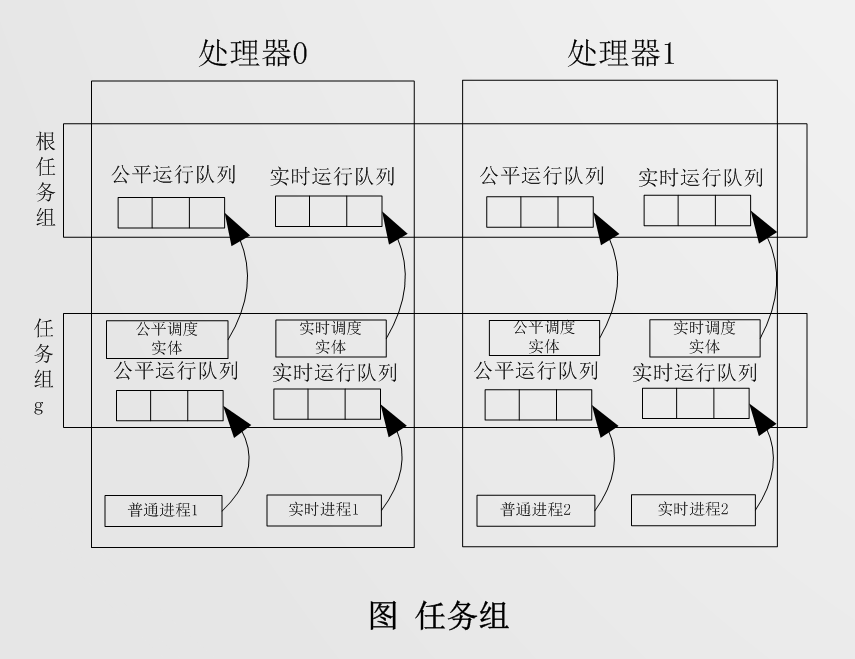
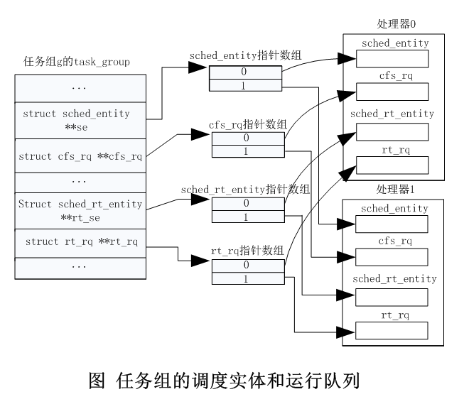
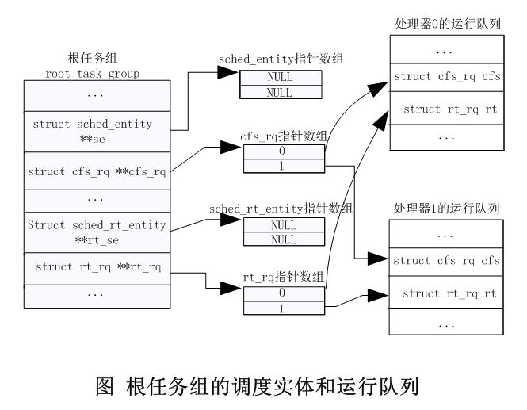
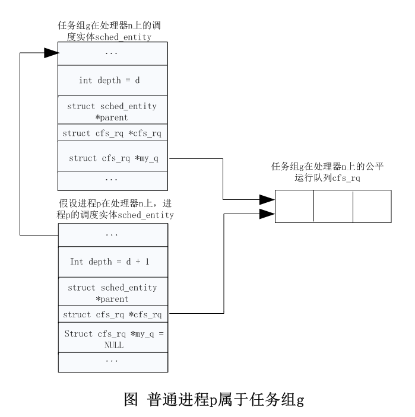

# Linux内核进程管理(五)——进程调度之一

## 1. 调度策略

Linux内核作为一个通用操作系统，需要兼顾各种各样类型的进程，包括实时进程、交互式进程、批处理进程等。每种类型进程都有其特别的行为特征，总结如下：

1.   交互式进程： 与人机交互的进程，和鼠标、键盘、触摸屏等相关的应用，例如vim编辑器等，它们一直在睡眠同时等待用户召唤它们。这类进程的特点是系统响应时间越快越好，否则用户就会抱怨系统卡顿。
2.   批处理进程： 此类进程默默地工作和付出，可能会占用比较多的系统资源，例如编译代码等。
3.   实时进程： 有些应用对整体时延有严格要求，例如现在很火的`VR`设备，从头部转动到视频显示需要控制到19毫秒以内，否则会使人出现眩晕感。而对于工业控制系统，不符合要求的时延可能会导致严重的事故。

Linux内核支持的调度策略如下：`kernel4.14/include/uapi/linux/sched.h`

```c
/*
 * Scheduling policies
 */
#define SCHED_NORMAL		0
#define SCHED_FIFO		1
#define SCHED_RR		2
#define SCHED_BATCH		3
/* SCHED_ISO: reserved but not implemented yet */
#define SCHED_IDLE		5
#define SCHED_DEADLINE		6

```

1.   限期进程使用限期调度策略（`SCHED_DEADLINE`）。
2.   实时进程支持两种调度策略：先进先出调度（`SCHED_FIFO`）和轮流调度（`SCHED_RR`）。
3.   普通进程支持两种调度策略：标准轮流分时（`SCHED_NORMAL`）和空闲（`SCHED_IDLE`）。以前普通进程还有一种调度策略，称为批量调度策略（`SCHED_BATCH`），Linux内核引入完全公平调度算法以后，批量调度策略被废弃了，等同于标准轮流分时策略。
4.   每个进程的调度策略保存在进程描述符`task_struct`中的`policy`字段

>   限期调度策略有3个参数：运行事件`runtime`、截止期限`deadline`和周期`period`。如下图所示，每个周期运行一次，在截止期限之前执行完，依次运行的时间长度是`runtime`：


>   先进先出调度没有时间片，非常霸道，如果没有更高优先级的实时进度，并且它不睡眠，那么它将一直霸占处理器。

>   轮流调度有时间片，进程用完时间片以后加入优先级对应运行队列的尾部，把处理器让给优先级相同的其他实时进程。

>   标准轮流分时策略使用完全公平调度算法，把处理器时间公平地分配给每个进程。

>   空闲调度策略用来执行优先级非常低的后台作业，优先级比使用标准轮流分时策略和相对优先级为19的普通进程还要低，进程的相对优先级对空闲调度策略没有影响。


## 2. 进程优先级

限期进程优先级比实时进程高，实时进程的优先级比普通进程高。

限期进程的优先级是 -1 。

实时进程的实时优先级(`rt_priority`)是 0 ～ 99，实时优先级数值越大，表示优先级越高。

普通进程的静态优先级(`statuc_prio`)是 100 ～ 139，静态优先级数值越小，表示优先级越高，可通过修改`nice`值（即相对优先级，取值范围 -20 ～ 19）改变普通进程的优先级，优先级等于 120 + nice值。

在进程描述符`task_struct`结构体中，有4个成员与优先级相关，`kernel4.14/include/linux/sched.h`：

```c
struct task_struct {
    ...
    int				prio;
    int				static_prio;
    int				normal_prio;
    unsigned int			rt_priority;
    ...
};

```

>   `prio`动态优先级，是调度器最终使用的优先级数值，即调度器选择一个进程时实际选择的值。`prio`值越小，表明进程的优先级越高。`prio` 值的取值范围是 `0 ~ MAX_PRIO`，即 `0 ~ 139`（包括 0 和 139），根据调度策略的不同，又可以分为两个区间，其中区间 `0 ~ 99` 的属于实时进程，区间 `100 ~139` 的为非实时进程。`prio`取值的相关代码如下，`kernel4.14/kernel/sched/core.c`

```c
/*
 * __normal_prio - return the priority that is based on the static prio
 */
static inline int __normal_prio(struct task_struct *p)
{	// __normal_prio 函数，返回静态优先级值
	return p->static_prio;
}

/*
 * Calculate the expected normal priority: i.e. priority
 * without taking RT-inheritance into account. Might be
 * boosted by interactivity modifiers. Changes upon fork,
 * setprio syscalls, and whenever the interactivity
 * estimator recalculates.
 */
static inline int normal_prio(struct task_struct *p)
{
	int prio;

	if (task_has_dl_policy(p)) // task_has_dl_policy 函数，判断进程是否为限期进程，若为限期进程，则返回1，否则返回0
		prio = MAX_DL_PRIO-1;
	else if (task_has_rt_policy(p)) // task_has_rt_policy 函数，判断进程是否为实时进程，若为实时进程，则返回1，否则返回0
		prio = MAX_RT_PRIO-1 - p->rt_priority;
	else // 进程为普通进程，则 prio 值为静态优先级值，即 prio = p->static_prio 
		prio = __normal_prio(p);
	return prio;
}

```

>   `static_prio`静态优先级，不会随时间改变，内核不会主动修改它，只能通过系统调用`nice`去修改，如下`kernel4.14/include/linux/sched/prio.h`

```c
/* SPDX-License-Identifier: GPL-2.0 */
#ifndef _LINUX_SCHED_PRIO_H
#define _LINUX_SCHED_PRIO_H

#define MAX_NICE	19
#define MIN_NICE	-20
#define NICE_WIDTH	(MAX_NICE - MIN_NICE + 1)

...

#define MAX_USER_RT_PRIO	100
#define MAX_RT_PRIO		MAX_USER_RT_PRIO
...
#define DEFAULT_PRIO		(MAX_RT_PRIO + NICE_WIDTH / 2)

/*
 * Convert user-nice values [ -20 ... 0 ... 19 ]
 * to static priority [ MAX_RT_PRIO..MAX_PRIO-1 ],
 * and back.
 */
#define NICE_TO_PRIO(nice)	((nice) + DEFAULT_PRIO)
...

#endif /* _LINUX_SCHED_PRIO_H */


```

当有需要时，系统会通过`NICE_TO_PRIO()`来修改`static_prio`的值，例如：`kernel4.14/kernel/sched/core.c`

```c
void set_user_nice(struct task_struct *p, long nice)
{
	...
	p->static_prio = NICE_TO_PRIO(nice);
	...
}
EXPORT_SYMBOL(set_user_nice);

```

由上面代码知道，我们可以通过调用`NICE_TO_PRIO(nice)`来修改`static_prio`的值， `static_prio` 值的计算方法如下：

`static_prio = MAX_RT_PRIO + nice +20`，`MAX_RT_PRIO` 的值为100，`nice`的范围是`-20 ~ 19`，故`static_prio`值的范围是`100 ~ 139`。 `static_prio`的值越小，表明进程的静态优先级越高。

>   `normal_prio`正常优先级，是基于静态优先级和调度策略计算出来的优先级，可以通过`_setscheduler` 函数来设置 `normal_prio` 的值 。对于非实时进程，非限期进程，`normal_prio` 的值就等于静态优先级值  `static_prio`；对于实时进程，`normal_prio = MAX_RT_PRIO-1 - p->rt_priority`，对于限期进程，`normal_prio` 的值就等于 -1。代码如下，`kernel4.14/kernel/sched/core.c`

```c
static inline int normal_prio(struct task_struct *p)
{
	int prio;

	if (task_has_dl_policy(p))
		prio = MAX_DL_PRIO-1;
	else if (task_has_rt_policy(p))
		prio = MAX_RT_PRIO-1 - p->rt_priority;
	else
		prio = __normal_prio(p);
	return prio;
}

```

>   rt_priority 实时优先级，`rt_priority` 值的范围是 `0 ~ 99`，只对实时进程有效。由式子： `prio = MAX_RT_PRIO-1 - p->rt_priority`知道，`rt_priority`值越大，则`prio`值越小，故实时优先级（`rt_priority`）的值越大，意味着进程优先级越高。　　`rt_priority`的值也是取决于调度策略的，可以在`_setscheduler` 函数中对`rt_priority`值进行设置。


## 3. 调度类

内核引入调度类（`struct sched_class`）说明了调度器应该具有哪些功能。内核中每种调度策略都有该调度类的一个实例，该实例也是针对每种调度策略的具体实现。调度类封装了不同调度策略的具体实现，屏蔽了各种调度策略的细节实现。Linux内核目前实现了 5 种调度类，如下表所示：

| 调度类                       | 调度策略                    | 调度算法          | 调度对象               |
| ---------------------------- | --------------------------- | ----------------- | ---------------------- |
| 停机调度类`stop_sched_class` | 无                          | 无                | 停机进程               |
| 限期调度类`dl_sched_class`   | `SCHED_DEADLINE`            | 最早期限优先      | 限期进程               |
| 实时调度类`rt_sched_class`   | `SCHED_FIFO`/`SCHED_RR`     | 先进先出/轮流调度 | 实时进程               |
| 公平调度类`fair_sched_class` | `SCHED_NORMAL`/`SCHED_IDLE` | 完全公平调度算法  | 普通进程               |
| 空闲调度类`idle_sched_class` | 无                          | 无                | 每个处理器上的空闲进程 |

这 5 种调度类的优先级从高到低依次为：停机调度类、限期调度类、实时调度类、公平调度类和空闲调度类。

调度类就是代表的各种调度策略，调度实体就是调度单位，这个实体通常是一个进程，但是自从引入了`cgroup`后，这个调度实体可能就不是一个进程了，而是一个组。

>   停机调度类

停机调度类是优先级最高的调度类，停机进程`stop-task`是优先级最高的进程，可以抢占所有其他进程，其他进程不可以抢占停机进程。停机（`stop`是指`stop machine`）的意思是使处理器停下来，做更急的事情。

目前只有迁移进程属于停机调度类，每个处理器有一个迁移进程（名称是`migration/<cpu_id>`），用来把进程从当前处理器迁移到其他处理器，迁移进程对外伪装成实时优先级为 99 的先进先出实时进程。

停机进程没有时间片，如果它不主动让出处理器，那么它将一直霸占处理器。

引入停机调度类的一个原因是：支持限期调度类，迁移线程的优先级必须比限期进程的优先级高，能够抢占所有其他进程，才能快速处理调度器发出的迁移请求，把进程从当前处理器迁移到其他处理器。

>   限期调度类

限期调度类使用最早期限有限算法，使用红黑树（一种平衡的二叉树）把进程按照绝对截止期限从小到大排序，每次调度时选择绝对截止期限最小的进程。

如果限期进程用完了它的运行时间，它将让出处理器，并且把它从运行队列中删除。在下一个周期的开始，重新把它添加到运行队列中。

>   实时调度类

实时调度类为每个调度优先级维护一个队列，如下，`kernel4.14/kernel/sched/sched.h`

```c
struct rt_prio_array {
	DECLARE_BITMAP(bitmap, MAX_RT_PRIO+1); /* include 1 bit for delimiter */
	struct list_head queue[MAX_RT_PRIO];
};

```

位图`bitmap`用来快速查找第一个非空队列。数组`queue`的下标是实时进程的调度优先级，下标越小，优先级越高。

每次调度，先找到优先级最高的第一个非空队列，然后从队列中选择第一个进程。

使用先进先出调度策略的进程没有时间片，如果没有优先级更高的进程，并且它不主动让出处理器，那么它将一直霸占处理器。

使用轮流调度策略的进程有时间片，用完时间片以后，进程加入队列的尾部。默认的时间片是 5 毫秒，可以通过文件`/proc/sys/kernel/sched_rr_time	slice_ms`修改时间片。

>   公平调度类

公平调度类使用完全公平调度算法。完全公平调度算法引入了虚拟运行时间的概念：

`虚拟运行时间 = 实际运行时间 X nice 0 对应的权重/进程的权重`

`nice`值和权重信息的对应关系如下，`kernel4.14/kernel/sched/core.c`

```c
const int sched_prio_to_weight[40] = {
 /* -20 */     88761,     71755,     56483,     46273,     36291,
 /* -15 */     29154,     23254,     18705,     14949,     11916,
 /* -10 */      9548,      7620,      6100,      4904,      3906,
 /*  -5 */      3121,      2501,      1991,      1586,      1277,
 /*   0 */      1024,       820,       655,       526,       423,
 /*   5 */       335,       272,       215,       172,       137,
 /*  10 */       110,        87,        70,        56,        45,
 /*  15 */        36,        29,        23,        18,        15,
};

```

`nice 0`对应的权重是1024，`nice n-1`的权重大约是`nice n`权重的1.25倍。

使用空闲调度策略的普通进程的权重是 3，`nice`值对权重没有影响，定义如下，`kernel4.14/kernel/sched/sched.h`

```c
#define WEIGHT_IDLEPRIO                3

```

完全公平调度类算法使用红黑树把进程按虚拟运行时间从小到大排序，每次调度时选择虚拟运行时间最小的进程。

显然，进程的静态优先级越高，权重越大，在实际运行时间相同的情况下，虚拟运行时间越短，进程累计的虚拟运行时间增加得越慢，在红黑树中向右移动的速度越慢，被调度器选中的机会越大，被分配的运行时间相对越多。

调度器选中进程以后分配的时间片，我们先看以下几个概念：

调度周期： 在某个时间长度可以保证运行队列中的每个进程至少运行一次，我们把这个时间长度称为调度周期。

调度最小粒度：为了防止进程切换太频繁，进程被调度后应该至少运行一小段时间，我们把这个时间长度称为调度最小粒度。默认值是 0.75 毫秒，可以通过文件`/proc/sys/kernel/sched_min_granularity_ns`调整。

如果运行队列中的进程数量大于 8，那么调度周期等于调度最小粒度乘以进程数量，否则调度周期是 6毫秒。

进程的时间片的计算公式：`进程的时间片 = （调度周期 X 进程的权重 / 运行队列中所有进程的权重总和）`，按照这个公式计算出来的时间片称为理想的运行时间。 

>   空闲调度类

每个处理器上有一个空闲线程，即 0 号线程。空闲调度类的优先级最低，仅当没有其他进程可以调度的时候，才会调度空闲线程。


## 4. 运行队列

每个处理器有一个运行队列，结构体是`rq`，定义从全局变量如下，`kernel4.14/kernel/sched/core.c`

```c
DEFINE_PER_CPU_SHARED_ALIGNED(struct rq, runqueues);

```

如下图所示，结构体`rq`中嵌入了公平运行队列`cfs`、实时运行队列`rt`和限期运行队列`dl`，停机调度类和空闲调度类在每个处理器上只有一个内核线程，不需要运行队列，直接定义成员`stop`和`idle`分别指向迁移线程和空闲线程。                               


## 5. 任务分组

### 5.1 任务分组的意义

我们先看以下两种场景：

1.   执行`make -j10`(选项`-j10`表示同时执行10条命令)，编译 Linux 内核，同时运行视频播放器，如果给每个进程平均分配 CPU 时间，会导致视频播放很卡。
2.   用户 1 启动100个进程，用户 2 启动1个进程，如果给每个进程平均分配CPU时间，用户 2 的进程只能得到不到 1% 的CPU时间，用户 2 的体验很差。

进程分组，正是为了解决以上场景的。对于第一种场景，把编译Linux内核的所有进程放在一个任务组中，把视频播放器放在另一个任务组中，给两个任务组分别分配 50% 的CPU时间。对于第二种场景，给用户 1 和用户 2分别创建一个任务组，给两个任务组分别分配 50% 的CPU时间。


### 5.2 任务分组的方式

Linux内核支持以下任务分组方式：

1.   自动组，配置宏是`CONFIG_SCHED_AUTOGROUP`。
2.   CPU控制组，即控制组(`cgroup`)的CPU控制器。需要打开配置宏`CONFIG_CGROUP`和`CONFIG_CGROUP_SCHED`，如果公平调度类要支持任务组，打开配置宏`CONFIG_FAIR_GROUP_SCHED`; 如果实时调度类要支持任务组，打开配置宏`CONFIG_RT_GROUP_SCHED`

>   自动组：创建会员时创建一个自动组，会话里面的所有进程是自动组的成员。启动一个终端窗口时就会创建一个会话。在运行过程中可以通过文件`/proc/sys/kernel/sched_autogroup_enabled`开启或者关闭该功能，默认值是 1。实现自动组的源文件是`kernel4.14/sched/auto_group.c`。

>   CPU控制组：可以使用`cgroup`创建任务组和把进程加入任务组。`cgroup`已经从版本1（`cgroup v1`）演进到版本2（`cgroup v2`），版本1可以创建多个控制组层级树，版本2只有一个控制组层级树。

使用`cgroup`版本1的CPU控制器配置的方法如下：

-1 在目录`sys/fs/cgroup`下挂载`tmpfs`文件系统：

```shell
mount -t tmpfs cgroup_root /sys/fs/cgroup
 
```

-2 在目录`sys/fs/cgroup`下创建子目录`cpu`：

```shell
mkdir sys/fs/cgroup/cpu

```

-3 在目录`sys/fs/cgroup/cpu`下挂载`cgroup`文件系统，把`CPU`控制器关联到控制组层级树。

```shell
mount -t cgroup -o cpu none /sys/fs/cgroup/cpu

```

-4 创建两个任务组

```shell
cd /sys/fs/cgroup/cpu
mkdir multimedia	# 创建"multimedia"任务组
mkdir browser		# 创建“browser”任务组

```

-5 指定两个任务组的权重

```shell
echo 2018 > multimedia/cpu.shares
echo 1024 > browser/cpu.shares

```

-6 把线程加入任务组

```shell
echo <pid1> > browser/tasks
echo <pid2> > multimedia/tasks

```

-7 也可以把线程组加入任务组，指定线程组中的任意一个线程的标识符，就会把线程组的所有线程加入任务组

```shell
echo <pid1> > browser/cgroup.procs
echo <pid2> > multimedia/cgroup.procs

```


`cgroup`版本2从内核4.15版本开始支持CPU控制器。使用`cgroup`版本2的PU控制器配置方法如下：

-1 在目录`sys/fs/cgroup`下挂载`tmpfs`文件系统：

```shell
mount -t tmpfs cgroup_root /sys/fs/cgroup
 
```

-2 在目录`sys/fs/cgroup`下挂载`cgroup2`文件系统：

```shell
mount -t cgroup2 none /sys/fs/cgroup

```

-3 在根控制组开启CPU控制器：

```shell
cd /sys/fs/cgroup
echo "+cpu" > cgroup.subtree_control

```

-4 创建两个任务组

```shell
mkdir multimedia	# 创建"multimedia"任务组
mkdir browser		# 创建“browser”任务组

```

-5 指定两个任务组的权重

```shell
echo 2018 > multimedia/cpu.weight
echo 1024 > browser/cpu.weight

```

-6 把线程组加入控制组

```shell
echo <pid1> > browser/cgroup.procs
echo <pid2> > multimedia/cgroup.procs

```

-7 把线程加入控制组。控制组默认只支持线程组，如果想把线程加入控制组，必须先把控制组的类型设置成线程化的控制组，方法是写字符串`threaded`到文件`cgroup.type`中。在线程化的控制组中，如果写文件`cgroup.procs`，将会把线程组中的所有线程加入控制组。

```shell
echo threaded > browser/cgroup.type
echo <pid1> > browser/cgroup.threads
echo threaded > multimedia/cgroup.type
echo <pid1> > multimedia/cgroup.threads

```


### 5.3 数据结构

>   任务组的结构体是`task_group`。默认的任务组是根任务组（全局变量`root_task_group`），默认情况下所有进程属于根任务组。

>   引入任务组以后，因为调度器的调度对象不仅仅是进程，所以内核抽象出调度实体，调度器的调度对象是调度实体，调度实体是进程或进程组。

>   进程描述符中嵌入了公平、实时和限期3种调度实体，成员`sched_class`指向进程所属的调度类，进程可以更换调度类，并且使用调度类对应的调度实体。`kernel4.14/include/linux/sched.h`

```c
struct task_struct {
    ...
    const struct sched_class	*sched_class; // 调度类
    struct sched_entity		se; // 公平调度实体
    struct sched_rt_entity		rt; // 实时调度实体
    #ifdef CONFIG_CGROUP_SCHED
    struct task_group		*sched_task_group;
    #endif
    struct sched_dl_entity		dl; // 限期调度实体
    ...
};

```

>   如下图所示，任务组在每个处理器上有公平调度实体、公平运行队列、实时调度实体和实时运行队列，根任务组比较特殊，没有公平调度实体和实时调度实体。

1.   任务组的下级公平调度实体加入任务组的公平运行队列，任务组的公平调度实体加入上级任务组的公平运行队列；
2.   任务组的下级实时调度实体加入任务组的实时运行队列，任务组的实时调度实体加入上级任务组的实时运行队列；



-   之所以任务组在每个处理器上有一个公平调度实体和一个公平运行队列，是因为任务组包含多个进程，每个进程可能在不同的处理器上运行。同理，任务组在每个处理器上也有一个实时调度实体和一个实时运行队列。

>   在每个处理器上，计算任务组的公平调度实体的权重的方法如下(参考源文件`kernel4.14/kernel/sched/fair.c`中的函数`update_cfs_shares`):

1.   公平调度实体的权重 = 任务组的权重 x 负载比例；
2.   公平调度实体的负载比例 = 公平运行队列的权重 / (任务组的平均负载 - 公平运行队列的平均负载 + 公平运行队列的权重)；
3.   公平运行队列的权重 = 公平运行队列中所有调度实体的权重总和；
4.   任务组的平均负载 = 所有公平运行队列的平均负载的总和。

-   之所以负载比例不是公平运行队列的平均负载除以任务组的平均负载，是因为公平运行队列的权重是实时负载，而公平运行队列的平均负载是上一次计算的负载值，更新被延迟了，我们使用实时负载计算权重。

>   在每个处理器上，任务组的实时调度实体的调度优先级，取实时运行队列中所有实时调度实体的最高调度优先级。用数据结构描述任务组的调度实体和运行队列，如下图所示：



>   如下图所示，根任务组没有公平调度实体和实时调度实体，公平运行队列指针指向运行队列中嵌入的运行队列，实时运行队列指针指向运行队列中嵌入的实时运行队列。



>   假设普通进程p在处理器n上运行，它属于任务组g，数据结构如下图所示：

1.   成员`depth`是调度实体在调度树中的深度，任务组g的深度是d，进程p的深度是（d+1）；
2.   成员`parent`指向调度树中的父亲，进程p的父亲是任务组g；
3.   成员`cfs_rq`指向调度实体所属的公平运行队列。进程p所属的公平运行队列就是任务组g在处理器n上拥有的公平运行队列；
4.   成员`my_q`指向调度实体拥有的公平运行队列，任务组拥有公平运行队列，进程没有公平运行队列。任务组g在每个处理器上有一个公平调度实体和一个公平运行队列，处理器n上的调度实体的成员`my_q`指向处理器n上的公平运行队列。

