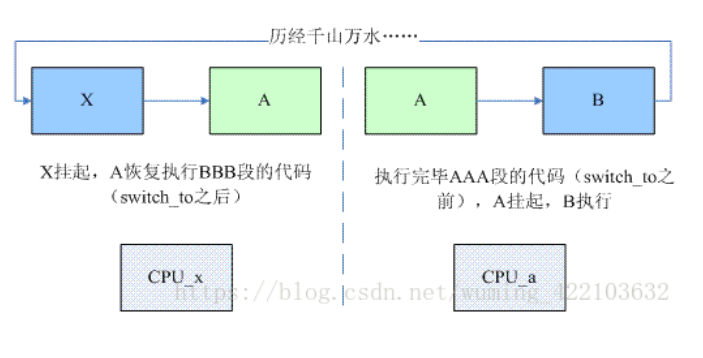

# Linux内核进程管理(八)——CFS调度器之三

本章节主要解析调度器的核心函数`__schedule()`，其作用是让调度器选择和切换到一个合适进程运行。

## 1. 调度时机

>   调度时机，即什么时候，会驱动调度器进入此函数，调度时机可以分为如下3种：

-   阻塞操作： 互斥量(`mutex`)、信号量(`semaphore`)、等待队列(`waitqueue`)等。

-   在中断返回前和系统调用返回用户空间时，去检查`TIF_NEED_RESCHED`标志位以判断是否需要调度。

-   将要被唤醒的进程(`Wakeups`)不会马上调用`schedule()`，而是会被添加到`CFS`就绪队列中，并且设置`TIF_NEED_RESCHED`标志位。那么唤醒进程什么时候被调度呢？这要根据内核是否具有可抢占功能(`CONFIG_PREEMPT=y`)分两种情况。

*   1) 如果内核可抢占，则：如果唤醒动作发生在系统调用或者异常处理上下文中，在下一次调用`preempt_enable()`时会检查是否需要抢占调度；如果唤醒动作发生在硬中断处理上下文中，硬件中断处理返回前夕会检查是否抢占当前进程。
*   2）如果内核不可抢占，则：当前进程调用`cond_resched()`时会检查是否要调度；主动调度调用`schedule()`；系统调用或者异常处理返回到用户空间；中断处理完成返回用户空间。

>   以上就是明确调度的时机，上面提到的硬件中断返回前夕和硬件中断返回用户空间前夕是两个不同的概念。前者是每次硬件中断返回前夕都会检查是否有进程需要被抢占调度，不管中断发生点是在内核空间还是用户空间；后者是只有中断发生点在用户空间才会检查。
>
>   从调度时机，我们可以看出来，调用路径很多，也说明了调度器的复杂性。


## 2. `__schedule()`函数解析

-   我们将从以下几个部分来拆解解析函数`__schedule()`：

*   1) 调度之前的初始化工作；
*   2) 根据preempt flag/当前进程的状态；
*   3) 挑选next进程来取代当前运行的进程;
*   4）prev与next进程上下文切换;
*   5) balance_callback调用。

-   `__schedule()`函数定义如下，`kernel4.14/kernel/sched/core.c`

```c
/*
 * __schedule() is the main scheduler function.
 *
 * The main means of driving the scheduler and thus entering this function are:
 *
 *   1. Explicit blocking: mutex, semaphore, waitqueue, etc.
 *
 *   2. TIF_NEED_RESCHED flag is checked on interrupt and userspace return
 *      paths. For example, see arch/x86/entry_64.S.
 *
 *      To drive preemption between tasks, the scheduler sets the flag in timer
 *      interrupt handler scheduler_tick().
 *
 *   3. Wakeups don't really cause entry into schedule(). They add a
 *      task to the run-queue and that's it.
 *
 *      Now, if the new task added to the run-queue preempts the current
 *      task, then the wakeup sets TIF_NEED_RESCHED and schedule() gets
 *      called on the nearest possible occasion:
 *
 *       - If the kernel is preemptible (CONFIG_PREEMPT=y):
 *
 *         - in syscall or exception context, at the next outmost
 *           preempt_enable(). (this might be as soon as the wake_up()'s
 *           spin_unlock()!)
 *
 *         - in IRQ context, return from interrupt-handler to
 *           preemptible context
 *
 *       - If the kernel is not preemptible (CONFIG_PREEMPT is not set)
 *         then at the next:
 *
 *          - cond_resched() call
 *          - explicit schedule() call
 *          - return from syscall or exception to user-space
 *          - return from interrupt-handler to user-space
 *
 * WARNING: must be called with preemption disabled!
 */
static void __sched notrace __schedule(bool preempt)
{
	struct task_struct *prev, *next;
	unsigned long *switch_count;
	struct rq_flags rf;
	struct rq *rq;
	int cpu;
	u64 wallclock;

	cpu = smp_processor_id();
	rq = cpu_rq(cpu);
	prev = rq->curr;

	schedule_debug(prev);

	if (sched_feat(HRTICK))
		hrtick_clear(rq);

	local_irq_disable();
	rcu_note_context_switch(preempt);

	/*
	 * Make sure that signal_pending_state()->signal_pending() below
	 * can't be reordered with __set_current_state(TASK_INTERRUPTIBLE)
	 * done by the caller to avoid the race with signal_wake_up().
	 */
	rq_lock(rq, &rf);
	smp_mb__after_spinlock();

	/* Promote REQ to ACT */
	rq->clock_update_flags <<= 1;
	update_rq_clock(rq);

	switch_count = &prev->nivcsw;
	if (!preempt && prev->state) {
		if (unlikely(signal_pending_state(prev->state, prev))) {
			prev->state = TASK_RUNNING;
		} else {
			deactivate_task(rq, prev, DEQUEUE_SLEEP | DEQUEUE_NOCLOCK);
			prev->on_rq = 0;

			if (prev->in_iowait) {
				atomic_inc(&rq->nr_iowait);
				delayacct_blkio_start();
			}

			/*
			 * If a worker went to sleep, notify and ask workqueue
			 * whether it wants to wake up a task to maintain
			 * concurrency.
			 */
			if (prev->flags & PF_WQ_WORKER) {
				struct task_struct *to_wakeup;

				to_wakeup = wq_worker_sleeping(prev);
				if (to_wakeup)
					try_to_wake_up_local(to_wakeup, &rf);
			}
		}
		switch_count = &prev->nvcsw;
	}

	next = pick_next_task(rq, prev, &rf);
	wallclock = walt_ktime_clock();
	walt_update_task_ravg(prev, rq, PUT_PREV_TASK, wallclock, 0);
	walt_update_task_ravg(next, rq, PICK_NEXT_TASK, wallclock, 0);
	clear_tsk_need_resched(prev);
	clear_preempt_need_resched();

	if (likely(prev != next)) {
#ifdef CONFIG_SCHED_WALT
		if (!prev->on_rq)
			prev->last_sleep_ts = wallclock;
#endif
		rq->nr_switches++;
		rq->curr = next;
		/*
		 * The membarrier system call requires each architecture
		 * to have a full memory barrier after updating
		 * rq->curr, before returning to user-space. For TSO
		 * (e.g. x86), the architecture must provide its own
		 * barrier in switch_mm(). For weakly ordered machines
		 * for which spin_unlock() acts as a full memory
		 * barrier, finish_lock_switch() in common code takes
		 * care of this barrier. For weakly ordered machines for
		 * which spin_unlock() acts as a RELEASE barrier (only
		 * arm64 and PowerPC), arm64 has a full barrier in
		 * switch_to(), and PowerPC has
		 * smp_mb__after_unlock_lock() before
		 * finish_lock_switch().
		 */
		++*switch_count;

		trace_sched_switch(preempt, prev, next);

		/* Also unlocks the rq: */
		rq = context_switch(rq, prev, next, &rf);
	} else {
		rq->clock_update_flags &= ~(RQCF_ACT_SKIP|RQCF_REQ_SKIP);
		rq_unlock_irq(rq, &rf);
	}

	balance_callback(rq);
}

```

下面分别按上述几个部分对函数`__schedule()`进行解析。


### 2.1 调度之前初始化工作

-   本部分分析下面的代码：

```c
static void __sched notrace __schedule(bool preempt)
{
	struct task_struct *prev, *next;
	unsigned long *switch_count;
	struct rq_flags rf;
	struct rq *rq;
	int cpu;
	u64 wallclock;
	/*__schedule函数运行所在的cpu id上*/
	cpu = smp_processor_id(); 
	rq = cpu_rq(cpu); /*获取此cpu的rq运行队列*/
	prev = rq->curr; /*获取当前在rq上运行的task*/
	/*基于时间调度检测和调度统计,debug使用*/
	schedule_debug(prev);
	/*在feature.h中SCHED_FEAT(HRTICK, false),不成立*/
	if (sched_feat(HRTICK))
		hrtick_clear(rq);/*取消rq成员变量 hrtick_timer hrtimer结构体变量*/

	local_irq_disable();
	rcu_note_context_switch(preempt);

	/*
	 * Make sure that signal_pending_state()->signal_pending() below
	 * can't be reordered with __set_current_state(TASK_INTERRUPTIBLE)
	 * done by the caller to avoid the race with signal_wake_up().
	 */
    /*对上面的理解如下:
      1. 当存在signal_pending_state()->signal_pending()时候,即后面有signal处于 
         pending状态
      2. 但是此时调用者设置了进程状态为TASK_INTERRUPTIBLE(可响应信号/中断)
      3. 确保他们响应signal的次序不会被重排,目的避免使用signal_wake_up引起竞争.*/
	rq_lock(rq, &rf);
	smp_mb__after_spinlock();

	/* Promote REQ to ACT */
	rq->clock_update_flags <<= 1;
	update_rq_clock(rq);
	/*获取当前进程上下文切换次数.*/
	switch_count = &prev->nivcsw;
    ......
}

```


### 2.2 根据preempt flag/当前进程的状态

```c
static void __sched notrace __schedule(bool preempt)
{
	......
	switch_count = &prev->nivcsw;
	if (!preempt && prev->state) {
		if (unlikely(signal_pending_state(prev->state, prev))) {
            /*如果preempt为false && prev进程状态存在,并且此进程有pending的signal发
           生,则将此进程状态设置为running状态*/
			prev->state = TASK_RUNNING;
		} else {
            /*其他情况,则直接将prev进程移出队列,同时设置on_rq=0,表示prev进程不在当前
            rq上*/
			deactivate_task(rq, prev, DEQUEUE_SLEEP | DEQUEUE_NOCLOCK);
			prev->on_rq = 0;

			if (prev->in_iowait) {
				atomic_inc(&rq->nr_iowait);
				delayacct_blkio_start();
			}

			/*
			 * If a worker went to sleep, notify and ask workqueue
			 * whether it wants to wake up a task to maintain
			 * concurrency.
			 */
            /*对上面的解释如下:
            * 如果工作者线程已经休眠了,通知并且询问工作者队列是否需要唤醒进程来维持并发性
            * 如果当前进程的flags集配置了PF_WQ_WORKER则需要处理.
            */ 
			if (prev->flags & PF_WQ_WORKER) {
				struct task_struct *to_wakeup;
				/*获取线程池中第一个idle的worker,如果此worker不为空,则返回此
            worker相关联的进程.*/
				to_wakeup = wq_worker_sleeping(prev);
                /*将to_wakeup进程放入到运行队列中,开始被调度*/
				if (to_wakeup)
					try_to_wake_up_local(to_wakeup, &rf);/*入队,虚拟运行时间update*/ 
			}
		}
		switch_count = &prev->nvcsw;
	}

    ......
}

```

在`struct task_struct`结构体存有三个与上下文切换相关的计数器,如下所示，其中`nvcsw/nivcsw`是自愿（voluntary）/非自愿（involuntary）上下文切换计数。`last_switch_count`是`nvcsw`和`nivcsw`的总和。比如在fork,exit等操作的时候都会修改这几个参数数值。

```c
struct task_struct {
    ...
	/* Context switch counts: */
	unsigned long			nvcsw;
	unsigned long			nivcsw;
	...
#ifdef CONFIG_DETECT_HUNG_TASK
	unsigned long			last_switch_count;
#endif
    ...
}

```


### 2.3 挑选next进程取代当前运行的进程

需要解析的代码如下：

```c
static void __sched notrace __schedule(bool preempt)
{
	......
    /*根据prev信息,rq信息,rf信息,pick一个进程即next*/ 
	next = pick_next_task(rq, prev, &rf);
    /*update 使用WALT方式计算进程负载的真实时间,即当前窗口的时间*/
	wallclock = walt_ktime_clock();
    /*根据进程状态,分别更新prev和next两个进程的walt相关参数*/
	walt_update_task_ravg(prev, rq, PUT_PREV_TASK, wallclock, 0);
	walt_update_task_ravg(next, rq, PICK_NEXT_TASK, wallclock, 0);
    /*清除prev进程TIF_NEED_RESCHED flag*/
	clear_tsk_need_resched(prev);
    /*清除PREEMPT_NEED_RESCHED flag,ARM平台此函数为空*/
	clear_preempt_need_resched();
	......
}

```

下面来看下核心函数`pick_next_task`的实现方式，`kernel4.14/kernel/sched/core.c`:

```c
/*
 * Pick up the highest-prio task:
 */
static inline struct task_struct *
pick_next_task(struct rq *rq, struct task_struct *prev, struct rq_flags *rf)
{
	const struct sched_class *class;
	struct task_struct *p;

	/*
	 * Optimization: we know that if all tasks are in the fair class we can
	 * call that function directly, but only if the @prev task wasn't of a
	 * higher scheduling class, because otherwise those loose the
	 * opportunity to pull in more work from other CPUs.
	 */
    /*当前调度类为fair类或者idle类,并且该CPU运行队列的nr_running数量=cfs队列h_nr_running数量
      即当前CPU运行队列里面只有normal类型的进程,没有RT类的进程，否则就需要遍历整个调度类。*/ 
	if (likely((prev->sched_class == &idle_sched_class ||
		    prev->sched_class == &fair_sched_class) &&
		   rq->nr_running == rq->cfs.h_nr_running)) {
		/*执行fair调度类的pick next函数*/
		p = fair_sched_class.pick_next_task(rq, prev, rf);
		if (unlikely(p == RETRY_TASK))
			goto again;

		/* Assumes fair_sched_class->next == idle_sched_class */
        /*如果pick到了idle进程,则修改调度类,执行idle调度类,使rq进入idle状态*/
		if (unlikely(!p))
			p = idle_sched_class.pick_next_task(rq, prev, rf);

		return p;
	}

again:
    /*按照class优先级的高低依次遍历各个class并执行对应的pick next task函数,直到失败为止。调度类的
      优先级为stop_sched_class > dl_sched_class > rt_sched_class > fair_sched_class > 
      idle_sched_class。stop_sched_class用于关闭CPU，dl_sched_class和rt_sched_class是实
      时性进程，所以当系统有实时性进程时，它们总是优先执行。*/
	for_each_class(class) {
		p = class->pick_next_task(rq, prev, rf);
		if (p) {
			if (unlikely(p == RETRY_TASK))
				goto again;
			return p;
		}
	}

	/* The idle class should always have a runnable task: */
	BUG();
}

```

仅仅分析fair调度类的pick_next_task函数,代码比较长,源码如下，`kernel4.14/kernel/sched/fair.c`:

```c
static struct task_struct *
pick_next_task_fair(struct rq *rq, struct task_struct *prev, struct rq_flags *rf)
{
	struct cfs_rq *cfs_rq = &rq->cfs;
	struct sched_entity *se;
	struct task_struct *p;
	int new_tasks;

again:
	if (!cfs_rq->nr_running)
		goto idle;

#ifdef CONFIG_FAIR_GROUP_SCHED
	if (prev->sched_class != &fair_sched_class)
		goto simple;

	/*
	 * Because of the set_next_buddy() in dequeue_task_fair() it is rather
	 * likely that a next task is from the same cgroup as the current.
	 *
	 * Therefore attempt to avoid putting and setting the entire cgroup
	 * hierarchy, only change the part that actually changes.
	 */

	do {
		struct sched_entity *curr = cfs_rq->curr;

		/*
		 * Since we got here without doing put_prev_entity() we also
		 * have to consider cfs_rq->curr. If it is still a runnable
		 * entity, update_curr() will update its vruntime, otherwise
		 * forget we've ever seen it.
		 */
		if (curr) {
			if (curr->on_rq)
				update_curr(cfs_rq);
			else
				curr = NULL;

			/*
			 * This call to check_cfs_rq_runtime() will do the
			 * throttle and dequeue its entity in the parent(s).
			 * Therefore the nr_running test will indeed
			 * be correct.
			 */
			if (unlikely(check_cfs_rq_runtime(cfs_rq))) {
				cfs_rq = &rq->cfs;

				if (!cfs_rq->nr_running)
					goto idle;

				goto simple;
			}
		}

		se = pick_next_entity(cfs_rq, curr);
		cfs_rq = group_cfs_rq(se);
	} while (cfs_rq);

	p = task_of(se);

	/*
	 * Since we haven't yet done put_prev_entity and if the selected task
	 * is a different task than we started out with, try and touch the
	 * least amount of cfs_rqs.
	 */
	if (prev != p) {
		struct sched_entity *pse = &prev->se;

		while (!(cfs_rq = is_same_group(se, pse))) {
			int se_depth = se->depth;
			int pse_depth = pse->depth;

			if (se_depth <= pse_depth) {
				put_prev_entity(cfs_rq_of(pse), pse);
				pse = parent_entity(pse);
			}
			if (se_depth >= pse_depth) {
				set_next_entity(cfs_rq_of(se), se);
				se = parent_entity(se);
			}
		}

		put_prev_entity(cfs_rq, pse);
		set_next_entity(cfs_rq, se);
	}

	if (hrtick_enabled(rq))
		hrtick_start_fair(rq, p);

	update_misfit_status(p, rq);

	return p;
simple:
#endif

	put_prev_task(rq, prev);

	do {
		se = pick_next_entity(cfs_rq, NULL);
		set_next_entity(cfs_rq, se);
		cfs_rq = group_cfs_rq(se);
	} while (cfs_rq);

	p = task_of(se);

	if (hrtick_enabled(rq))
		hrtick_start_fair(rq, p);

	update_misfit_status(p, rq);

	return p;

idle:
	update_misfit_status(NULL, rq);
	new_tasks = idle_balance(rq, rf);

	/*
	 * Because idle_balance() releases (and re-acquires) rq->lock, it is
	 * possible for any higher priority task to appear. In that case we
	 * must re-start the pick_next_entity() loop.
	 */
	if (new_tasks < 0)
		return RETRY_TASK;

	if (new_tasks > 0)
		goto again;

	return NULL;
}

```

对上面代码的分析,先解析若干个核心函数:

1.   `update_curr`
2.   `check_cfs_rq_runtime`
3.   `pick_next_entity`
4.   `group_cfs_rq`
5.   `is_same_group`
6.   `put_prev_entity`
7.   `set_next_entity`
8.   `parent_entity`
9.   `update_misfit_status`
10.   `put_prev_task`
11.   `idle_balance`

#### 2.3.1 函数`update_curr`解析

>   `__schedule() -> pick_next_task_fair() -> update_curr()`定义如下，`kernel4.14/kernel/sched/fair.c`：

```c
/*
 * Update the current task's runtime statistics.
 */
static void update_curr(struct cfs_rq *cfs_rq)
{
    /*获取当前cfs_rq队列的调度实体*/
	struct sched_entity *curr = cfs_rq->curr;
	u64 now = rq_clock_task(rq_of(cfs_rq));/*当前cfs_rq的时间*/ 
	u64 delta_exec;
	int cpu = cpu_of(rq_of(cfs_rq));

	if (unlikely(!curr))
		return;
	/*当前调度实体已经分配的运行时间*/
	delta_exec = now - curr->exec_start;
	if (unlikely((s64)delta_exec <= 0))
		return;

	curr->exec_start = now;

	schedstat_set(curr->statistics.exec_max,
		      max(delta_exec, curr->statistics.exec_max));
	/*更新当前调度实体的总的运行时间*/ 
	curr->sum_exec_runtime += delta_exec;

	if (cpumask_test_cpu(cpu, &min_cap_cpu_mask))
		curr->s_sum_exec_runtime += delta_exec;
	else
		curr->b_sum_exec_runtime += delta_exec;

	schedstat_add(cfs_rq->exec_clock, delta_exec);
	/*根据分配的运行时间和调度实体的权重,增加当前调度实体的虚拟运行时间*/
	curr->vruntime += calc_delta_fair(delta_exec, curr);
    /*更新cfs_rq最小虚拟运行时间(这个是作为所有虚拟运行时间的base value).同时调整由各个
      调度实体的虚拟运行时间组成的红黑树(根据当前调度实体的虚拟运行时间调整当前调度实体在红
      黑树的节点位置)
     */
	update_min_vruntime(cfs_rq);

	if (entity_is_task(curr)) {
		struct task_struct *curtask = task_of(curr);

		trace_sched_stat_runtime(curtask, delta_exec, curr->vruntime);
        /*将此进程的运行时间添加到它的会话组内(即进程组中.)*/  
		cpuacct_charge(curtask, delta_exec);
        /*维护线程组执行运行时间,其实就是维护thread_group_cputimer这个结构体里面的
          成员变量(thread group interval timer counts)*/
		account_group_exec_runtime(curtask, delta_exec);
	}
	/*此函数涉及到throttle相关的feature,如果被throttle或者运行时间运行完毕,会重新分配
      一部分运行时间给当前进程,如果分配失败,则设置重新调度的条件,或者抢占调度*/
	account_cfs_rq_runtime(cfs_rq, delta_exec);
}

```

>   这个函数的最重要目的如下:

1.  更新当前调度实体的虚拟运行时间
2.  更新当前cfs_rq的最小虚拟运行时间
3.  统计调度相关信息和数据
4.  根据分配的运行时间来确定是否需要抢占调度

>   `update_curr() -> account_cfs_rq_runtime()`定义及调用流程如下，`kernel4.14/kernel/sched/fair.c`：

```c
static __always_inline
void account_cfs_rq_runtime(struct cfs_rq *cfs_rq, u64 delta_exec)
{
	if (!cfs_bandwidth_used() || !cfs_rq->runtime_enabled)
		return;

	__account_cfs_rq_runtime(cfs_rq, delta_exec);
}

static void __account_cfs_rq_runtime(struct cfs_rq *cfs_rq, u64 delta_exec)
{
	/* dock delta_exec before expiring quota (as it could span periods) */
    /*runtime_remaining是一个配额,这次分配了delta_exec运行时间,则配额自然会减少*/
	cfs_rq->runtime_remaining -= delta_exec;

	if (likely(cfs_rq->runtime_remaining > 0))
		return;

	if (cfs_rq->throttled)
		return;
	/*
	 * if we're unable to extend our runtime we resched so that the active
	 * hierarchy can be throttled
	 */
	if (!assign_cfs_rq_runtime(cfs_rq) && likely(cfs_rq->curr))
		resched_curr(rq_of(cfs_rq));
}

/* returns 0 on failure to allocate runtime */
static int assign_cfs_rq_runtime(struct cfs_rq *cfs_rq)
{
	struct task_group *tg = cfs_rq->tg;
	struct cfs_bandwidth *cfs_b = tg_cfs_bandwidth(tg);
	u64 amount = 0, min_amount;

	/* note: this is a positive sum as runtime_remaining <= 0 */
	min_amount = sched_cfs_bandwidth_slice() - cfs_rq->runtime_remaining;

	raw_spin_lock(&cfs_b->lock);
	if (cfs_b->quota == RUNTIME_INF)
		amount = min_amount;
	else {
        /*重新激活throttle/unthrottle的定时器*/
		start_cfs_bandwidth(cfs_b);
		/*runtime是可以运行的运行时间限额,是cfs_rq在启动时候申请的.*/
		if (cfs_b->runtime > 0) {
			amount = min(cfs_b->runtime, min_amount);
            /*增加了amount运行时间,则限额需要减去新分配的运行时间*/
			cfs_b->runtime -= amount;
			cfs_b->idle = 0;
		}
	}
	raw_spin_unlock(&cfs_b->lock);
	/*增加运行时间配额,也即是增加了进程的运行时间*/
	cfs_rq->runtime_remaining += amount;

	return cfs_rq->runtime_remaining > 0;
}

```

>   至此`update_curr`更新当前调度实体的虚拟运行时间,调整其红黑树节点位置,同时处理其运行时间使用完毕之后的逻辑流程.

#### 2.3.2 函数`check_cfs_rq_runtime`解析

>   `__schedule() -> pick_next_task_fair() -> check_cfs_rq_runtime()`，这个函数的功能是检测当前是否做`throttle`操作.如果`throttle`操作,则直接将`prev`进程重新入队,重新选择新的调度实体。后面的函数会讲解到`put_prev_entity`函数的原理，定义如下，`kernel4.14/kernel/sched/fair.c`

```c
/* conditionally throttle active cfs_rq's from put_prev_entity() */
static bool check_cfs_rq_runtime(struct cfs_rq *cfs_rq)
{
	if (!cfs_bandwidth_used())
		return false;

	if (likely(!cfs_rq->runtime_enabled || cfs_rq->runtime_remaining > 0))
		return false;

	/*
	 * it's possible for a throttled entity to be forced into a running
	 * state (e.g. set_curr_task), in this case we're finished.
	 */
	if (cfs_rq_throttled(cfs_rq))
		return true;
	/*对cfs_rq做throttle操作*/
	throttle_cfs_rq(cfs_rq);
	return true;
}

```


#### 2.3.3 函数`pick_next_entity`解析

>   `__schedule() -> pick_next_task_fair() -> pick_next_entity()`，定义如下，`kernel4.14/kernel/sched/fair.c`

```c
/*
 * Pick the next process, keeping these things in mind, in this order:
 * 1) keep things fair between processes/task groups
 * 2) pick the "next" process, since someone really wants that to run
 * 3) pick the "last" process, for cache locality
 * 4) do not run the "skip" process, if something else is available
 */
static struct sched_entity *
pick_next_entity(struct cfs_rq *cfs_rq, struct sched_entity *curr)
{
    /*挑选红黑树最左边的叶子节点,即虚拟运行时间最小的节点,也是优先被调度的节点*/
	struct sched_entity *left = __pick_first_entity(cfs_rq);
	struct sched_entity *se;

	/*
	 * If curr is set we have to see if its left of the leftmost entity
	 * still in the tree, provided there was anything in the tree at all.
	 */
    /*根据当前调度实体的虚拟运行时间来修改left调度实体的指向*/
	if (!left || (curr && entity_before(curr, left)))
		left = curr;
	/*理想情况下,我们需要调度最小虚拟运行时间的调度实体*/
	se = left; /* ideally we run the leftmost entity */

	/*
	 * Avoid running the skip buddy, if running something else can
	 * be done without getting too unfair.
	 */
    /*skip buddy是不应该被选择的调度实体,但是最小的虚拟运行时间的调度实体与
      skip_buddy是同一个,则需要重现选择候选者.*/ 
	if (cfs_rq->skip == se) {
		struct sched_entity *second;

		if (se == curr) {
            /*rb tree的最左边的节点,与当前调度实体是同一个调度实体,则直接选择当前调度
          实体的下一个节点作为候选调度实体*/
			second = __pick_first_entity(cfs_rq);
		} else {
            /*否则选最小虚拟运行时间的调度实体的下一个节点作为候选的调度实体*/
			second = __pick_next_entity(se);
            /*根据系统状态变化修正候选者,比如选择的候选者为空或者候选者的虚拟运行时间
            大于当前调度实体*/ 
			if (!second || (curr && entity_before(curr, second)))
				second = curr;
		}
		/*统一决策:目的只有一个,在选择next调度实体的时候,不要选择之后导致抢占的发生,否则
        浪费系统资源还影响系统性能.具体在后面分析wakeup_preempt_entity函数*/
		if (second && wakeup_preempt_entity(second, left) < 1)
			se = second;
	}

	/*
	 * Prefer last buddy, try to return the CPU to a preempted task.
	 */
    /*如果cfs_rq的last成员不为空,并且last调度实体的虚拟运行时间等因素比left更需要被
     调度,则重新设置选择的调度实体为last*/  
	if (cfs_rq->last && wakeup_preempt_entity(cfs_rq->last, left) < 1)
		se = cfs_rq->last;

	/*
	 * Someone really wants this to run. If it's not unfair, run it.
	 */
    /*再次检测对应的调度环境,正如这条语句所说的,某些进程想要本次运行,并且也符合抢占
     的条件,那么修改选择的调度实体*/ 
	if (cfs_rq->next && wakeup_preempt_entity(cfs_rq->next, left) < 1)
		se = cfs_rq->next;
	/*对cfs_rq队列的三个成员变量,last,skip,next分别进行清空操作.即只要任一个等于
    se,则将其设置为NULL*/
	clear_buddies(cfs_rq, se);

	return se;
}

static inline int entity_before(struct sched_entity *a,
				struct sched_entity *b)
{
	return (s64)(a->vruntime - b->vruntime) < 0;
}

struct sched_entity *__pick_first_entity(struct cfs_rq *cfs_rq)
{
	struct rb_node *left = rb_first_cached(&cfs_rq->tasks_timeline);

	if (!left)
		return NULL;

	return rb_entry(left, struct sched_entity, run_node);
}

static struct sched_entity *__pick_next_entity(struct sched_entity *se)
{
	struct rb_node *next = rb_next(&se->run_node);

	if (!next)
		return NULL;

	return rb_entry(next, struct sched_entity, run_node);
}

/*
 * Should 'se' preempt 'curr'.
 *
 *             |s1
 *        |s2
 *   |s3
 *         g
 *      |<--->|c
 *
 *  w(c, s1) = -1
 *  w(c, s2) =  0
 *  w(c, s3) =  1
 *
 */
static int
wakeup_preempt_entity(struct sched_entity *curr, struct sched_entity *se)
{
	s64 gran, vdiff = curr->vruntime - se->vruntime;
	/*如果vdiff<=0,表示curr应该优先调度*/
	if (vdiff <= 0)
		return -1;
	/*惩罚优先级低的进程,即增加优先级低的虚拟运行时间.如果vdiff差值大于惩罚值,则se可
    以抢占curr调度实体,也即是说,在pick next entity的时候会选择se而不会选择curr调度
    实体*/
	gran = wakeup_gran(curr, se);
	if (vdiff > gran)
		return 1;

	return 0;
}

/*保证调度实体se的最少运行时间为sysctl_sched_wakeup_granularity,转化为se虚拟运行 
  时间增益*/
static unsigned long
wakeup_gran(struct sched_entity *curr, struct sched_entity *se)
{	/*最小运行时间颗粒度,是必须保证的,否则进程运行时间过短没有多大意义*/
	unsigned long gran = sysctl_sched_wakeup_granularity;

	/*
	 * Since its curr running now, convert the gran from real-time
	 * to virtual-time in his units.
	 *
	 * By using 'se' instead of 'curr' we penalize light tasks, so
	 * they get preempted easier. That is, if 'se' < 'curr' then
	 * the resulting gran will be larger, therefore penalizing the
	 * lighter, if otoh 'se' > 'curr' then the resulting gran will
	 * be smaller, again penalizing the lighter task.
	 *
	 * This is especially important for buddies when the leftmost
	 * task is higher priority than the buddy.
	 */
	return calc_delta_fair(gran, se);
}

static void clear_buddies(struct cfs_rq *cfs_rq, struct sched_entity *se)
{
	if (cfs_rq->last == se)
		__clear_buddies_last(se);

	if (cfs_rq->next == se)
		__clear_buddies_next(se);

	if (cfs_rq->skip == se)
		__clear_buddies_skip(se);
}

static void __clear_buddies_last(struct sched_entity *se)
{
	for_each_sched_entity(se) {
		struct cfs_rq *cfs_rq = cfs_rq_of(se);
		if (cfs_rq->last != se)
			break;

		cfs_rq->last = NULL;
	}
}

static void __clear_buddies_next(struct sched_entity *se)
{
	for_each_sched_entity(se) {
		struct cfs_rq *cfs_rq = cfs_rq_of(se);
		if (cfs_rq->next != se)
			break;

		cfs_rq->next = NULL;
	}
}

static void __clear_buddies_skip(struct sched_entity *se)
{
	for_each_sched_entity(se) {
		struct cfs_rq *cfs_rq = cfs_rq_of(se);
		if (cfs_rq->skip != se)
			break;

		cfs_rq->skip = NULL;
	}
}

```

>   从上面的代码可以清晰的知道,`pick_next_entity`目的是从`rb tree`中选择最左边的节点作为`next entity`.  重点是需要考虑与当前调度实体,`cfs_rq`队列中`last/next/skip`调度实体参数的关系,最后确定`next  entity`.最重要的目的就是选择`next entity`之后,尽可能的减少被抢占的可能性.

#### 2.3.4 函数`group_cfs_rq`解析

>   `__schedule() -> pick_next_task_fair() -> group_cfs_rq()`，定义如下，`kernel4.14/kernel/sched/fair.c`

```c
/* runqueue "owned" by this group */
static inline struct cfs_rq *group_cfs_rq(struct sched_entity *grp)
{
	return grp->my_q;
}

```

>   表示调度实体`grp`是一个进程组内的一个进程,进程组有自己的`cfs_rq`运行队列.进程组内的调度实体都放到`my_q`运行队列,而不会放到其他`cfs_rq`队列。

#### 2.3.5 函数`is_same_group`解析

>   `__schedule() -> pick_next_task_fair() -> is_same_group()`，`is_same_group()`函数比较两个调度实体是否在同一个`cfs_rq`上,即同一个运行队列中，定义如下，`kernel4.14/kernel/sched/fair.c`

```c
/* Do the two (enqueued) entities belong to the same group ? */
static inline struct cfs_rq *
is_same_group(struct sched_entity *se, struct sched_entity *pse)
{
	if (se->cfs_rq == pse->cfs_rq)
		return se->cfs_rq;

	return NULL;
}

```

#### 2.3.6 函数`put_prev_entity`解析

>   `__schedule() -> pick_next_task_fair() -> put_prev_entity()`，定义如下，`kernel4.14/kernel/sched/fair.c`

```c
static void put_prev_entity(struct cfs_rq *cfs_rq, struct sched_entity *prev)
{
	/*
	 * If still on the runqueue then deactivate_task()
	 * was not called and update_curr() has to be done:
	 */
    /*如果prev调度实体还在运行队列里面,直接update此调度实体的vruntime和此cfs_rq的
    min_vruntime*/
	if (prev->on_rq)
		update_curr(cfs_rq);

	/* throttle cfs_rqs exceeding runtime */
	check_cfs_rq_runtime(cfs_rq);

	check_spread(cfs_rq, prev);

	if (prev->on_rq) {
		update_stats_wait_start(cfs_rq, prev);
		/* Put 'current' back into the tree. */
        /*将prev根据vruntime数值插入到rb tree中*/ 
		__enqueue_entity(cfs_rq, prev);
		/* in !on_rq case, update occurred at dequeue */
        /*根据PELT算法,更新调度实体和队列本身的负载*/
		update_load_avg(prev, 0);
	}
	cfs_rq->curr = NULL;
}

```

#### 2.3.7 函数`set_next_entity`解析

>   `__schedule() -> pick_next_task_fair() -> set_next_entity()`，定义如下，`kernel4.14/kernel/sched/fair.c`

```c
static void
set_next_entity(struct cfs_rq *cfs_rq, struct sched_entity *se)
{
	/* 'current' is not kept within the tree. */
	if (se->on_rq) {
		/*
		 * Any task has to be enqueued before it get to execute on
		 * a CPU. So account for the time it spent waiting on the
		 * runqueue.
		 */
		update_stats_wait_end(cfs_rq, se);
        /*将调度实体se从rb tree中删除,即选择此调度实体开始运行*/  
		__dequeue_entity(cfs_rq, se);
        /*更新进程组的load*/ 
		update_load_avg(se, UPDATE_TG);
	}

	update_stats_curr_start(cfs_rq, se);
    /*设置当前运行的调度实体为se*/ 
	cfs_rq->curr = se;

	/*
	 * Track our maximum slice length, if the CPU's load is at
	 * least twice that of our own weight (i.e. dont track it
	 * when there are only lesser-weight tasks around):
	 */
	if (schedstat_enabled() && rq_of(cfs_rq)->load.weight >= 2*se->load.weight) {
		schedstat_set(se->statistics.slice_max,
			max((u64)schedstat_val(se->statistics.slice_max),
			    se->sum_exec_runtime - se->prev_sum_exec_runtime));
	}

	se->prev_sum_exec_runtime = se->sum_exec_runtime;
}

```

#### 2.3.8 函数`parent_entity`解析

>   `__schedule() -> pick_next_task_fair() -> parent_entity()`，`parent_entity()`函数返回调度实体`se`的父节点，定义如下，`kernel4.14/kernel/sched/fair.c`

```c
static inline struct sched_entity *parent_entity(struct sched_entity *se)
{
	return se->parent;
}

```

#### 2.3.9 函数`update_misfit_status`解析

>   `__schedule() -> pick_next_task_fair() -> update_misfit_status()`，`update_misfit_status()`函数更新`rq`的成员`misfit_task_load`，定义如下，`kernel4.14/kernel/sched/fair.c`

```c
static inline void update_misfit_status(struct task_struct *p, struct rq *rq)
{
	if (!static_branch_unlikely(&sched_asym_cpucapacity))
		return;

	if (!p) {
		rq->misfit_task_load = 0;
		return;
	}

	if (task_fits_capacity(p, cpu_of(rq))) {
		rq->misfit_task_load = 0;
		return;
	}

	rq->misfit_task_load = task_h_load(p);
}

```

#### 2.3.10 函数`put_prev_task`解析

>   `__schedule() -> pick_next_task_fair() -> put_prev_task()`，`put_prev_task()`函数目的是取消进程prev的调度，定义如下，`put_prev_task`[`kernel4.14/kernel/sched/sched.h`], `put_prev_task_fair`[`kernel4.14/kernel/sched/fair.c`]

```c
static inline void put_prev_task(struct rq *rq, struct task_struct *prev)
{
	prev->sched_class->put_prev_task(rq, prev);
}

/*
 * Account for a descheduled task:
 */
static void put_prev_task_fair(struct rq *rq, struct task_struct *prev)
{
	struct sched_entity *se = &prev->se;
	struct cfs_rq *cfs_rq;

	for_each_sched_entity(se) {
		cfs_rq = cfs_rq_of(se);
		put_prev_entity(cfs_rq, se);
	}
}

```

#### 2.3.11 函数`idle_balance`解析

>   `__schedule() -> pick_next_task_fair() -> idle_balance()`，`idle_balance()`函数涉及到负载均衡，后续章节我们会单独讨论，定义如下，`kernel4.14/kernel/sched/fair.c`

```c
/*
 * In CONFIG_NO_HZ_COMMON case, the idle balance kickee will do the
 * rebalancing for all the cpus for whom scheduler ticks are stopped.
 */
static void nohz_idle_balance(struct rq *this_rq, enum cpu_idle_type idle)
{
	int this_cpu = this_rq->cpu;
	struct rq *rq;
	struct sched_domain *sd;
	int balance_cpu;
	/* Earliest time when we have to do rebalance again */
	unsigned long next_balance = jiffies + 60*HZ;
	int update_next_balance = 0;
#ifdef CONFIG_SPRD_CORE_CTL
	cpumask_t cpus;
#endif

	if (idle != CPU_IDLE ||
	    !test_bit(NOHZ_BALANCE_KICK, nohz_flags(this_cpu)))
		goto end;

	/*
	 * This cpu is going to update the blocked load of idle CPUs either
	 * before doing a rebalancing or just to keep metrics up to date. we
	 * can safely update the next update timestamp
	 */
	rcu_read_lock();
	sd = rcu_dereference(this_rq->sd);
	/*
	 * Check whether there is a sched_domain available for this cpu.
	 * The last other cpu can have been unplugged since the ILB has been
	 * triggered and the sched_domain can now be null. The idle balance
	 * sequence will quickly be aborted as there is no more idle CPUs
	 */
	if (sd)
		nohz.next_update = jiffies + msecs_to_jiffies(LOAD_AVG_PERIOD);
	rcu_read_unlock();

#ifdef CONFIG_SPRD_CORE_CTL
	cpumask_andnot(&cpus, nohz.idle_cpus_mask, cpu_isolated_mask);
	for_each_cpu(balance_cpu, &cpus) {
#else
	for_each_cpu(balance_cpu, nohz.idle_cpus_mask) {
#endif
		if (balance_cpu == this_cpu || !idle_cpu(balance_cpu))
			continue;

		/*
		 * If this cpu gets work to do, stop the load balancing
		 * work being done for other cpus. Next load
		 * balancing owner will pick it up.
		 */
		if (need_resched())
			break;

		rq = cpu_rq(balance_cpu);

		/*
		 * If time for next balance is due,
		 * do the balance.
		 */
		if (time_after_eq(jiffies, rq->next_balance)) {
			struct rq_flags rf;

			rq_lock_irq(rq, &rf);
			update_rq_clock(rq);
			cpu_load_update_idle(rq);
			rq_unlock_irq(rq, &rf);

			update_blocked_averages(balance_cpu);
			/*
			 * This idle load balance softirq may have been
			 * triggered only to update the blocked load and shares
			 * of idle CPUs (which we have just done for
			 * balance_cpu). In that case skip the actual balance.
			 */
			if (!test_bit(NOHZ_STATS_KICK, nohz_flags(this_cpu)))
				rebalance_domains(rq, idle);
		}

		if (time_after(next_balance, rq->next_balance)) {
			next_balance = rq->next_balance;
			update_next_balance = 1;
		}
	}

	/*
	 * next_balance will be updated only when there is a need.
	 * When the CPU is attached to null domain for ex, it will not be
	 * updated.
	 */
	if (likely(update_next_balance))
		nohz.next_balance = next_balance;
end:
	clear_bit(NOHZ_BALANCE_KICK, nohz_flags(this_cpu));
}

```


### 2.4 `prev`与`next`进程上下文切换

要解析的代码如下：

```c
static void __sched notrace __schedule(bool preempt)
{
	......
    /*如果prev进程与pick的next进程不是同一个进程*/
    if (likely(prev != next)) {
#ifdef CONFIG_SCHED_WALT
		if (!prev->on_rq)
            /*设置prev进程退出rq的时间戳*/  
			prev->last_sleep_ts = wallclock;
#endif
        /*rq里面进程被切换的次数*/
		rq->nr_switches++;
        /*设置rq的当前进程为选择的next进程*/
		rq->curr = next;
		/*
		 * The membarrier system call requires each architecture
		 * to have a full memory barrier after updating
		 * rq->curr, before returning to user-space. For TSO
		 * (e.g. x86), the architecture must provide its own
		 * barrier in switch_mm(). For weakly ordered machines
		 * for which spin_unlock() acts as a full memory
		 * barrier, finish_lock_switch() in common code takes
		 * care of this barrier. For weakly ordered machines for
		 * which spin_unlock() acts as a RELEASE barrier (only
		 * arm64 and PowerPC), arm64 has a full barrier in
		 * switch_to(), and PowerPC has
		 * smp_mb__after_unlock_lock() before
		 * finish_lock_switch().
		 */
        /*增加进程上下文切换的次数*/
		++*switch_count;

		trace_sched_switch(preempt, prev, next);

		/* Also unlocks the rq: */
        /*prev和next进程上下文切换*/
		rq = context_switch(rq, prev, next, &rf);
	} else {
        /*prev与next是同一个进程,则不需要做上下文切换,直接unlock即可*/  
		rq->clock_update_flags &= ~(RQCF_ACT_SKIP|RQCF_REQ_SKIP);
		rq_unlock_irq(rq, &rf);
	}
	......
}

```

>   `__schedule() -> context_switch()`,源码如下,`kernel4.14/kernel/sched/core.c`:

```c
/*
 * context_switch - switch to the new MM and the new thread's register state.
 */
static __always_inline struct rq *
context_switch(struct rq *rq, struct task_struct *prev,
	       struct task_struct *next, struct rq_flags *rf)
{
	struct mm_struct *mm, *oldmm;

	prepare_task_switch(rq, prev, next);
	/*获取next进程的地址空间描述符*/
	mm = next->mm;
    /*获取prev进程正在使用的地址空间描述符*/
	oldmm = prev->active_mm;
	/*
	 * For paravirt, this is coupled with an exit in switch_to to
	 * combine the page table reload and the switch backend into
	 * one hypercall.
	 */
	arch_start_context_switch(prev);
	/*如果next进程的地址空间描述符为空,则表示next是内核线程,那么next进程的地址空间描述符
     使用prev进程的描述符.由于是kernespace,所以使用lazy tlb,不需要flush tlb操作.这里
    next进程借用了prev进程的地址空间描述符,所以不需要switch_mm操作.*/
	if (!mm) {
		next->active_mm = oldmm;
		mmgrab(oldmm);
		enter_lazy_tlb(oldmm, next);
	} else/*这里next有自己的地址空间描述符,那么就必须使用switch_mm与prev进程切换
    地址空间描述符了.*/ 
		switch_mm_irqs_off(oldmm, mm, next);
	/*prev是内核线程,则将prev进程的使用的地址空间描述符置为空,并且保存当前rq上次使用的
    地址描述符为prev进程的.由于prev是内核线程,在切换之后其地址空间没有用处了(即不会被借用
    了)*/
	if (!prev->mm) {
		prev->active_mm = NULL;
		rq->prev_mm = oldmm;
	}

	rq->clock_update_flags &= ~(RQCF_ACT_SKIP|RQCF_REQ_SKIP);

	/*
	 * Since the runqueue lock will be released by the next
	 * task (which is an invalid locking op but in the case
	 * of the scheduler it's an obvious special-case), so we
	 * do an early lockdep release here:
	 */
	rq_unpin_lock(rq, rf);
	spin_release(&rq->lock.dep_map, 1, _THIS_IP_);

	/* Here we just switch the register state and the stack. */
	switch_to(prev, next, prev);
	barrier();

	return finish_task_switch(prev);
}

```

>   分析上面的函数之前,我们需要了解下进程结构体(`struct task_struct`)中两个成员变量:

```c
struct task_struct {
...
struct mm_struct		*mm;
struct mm_struct		*active_mm;
...
};

```

>   解释如下:
>
>   mm指向进程所拥有的内存描述符，而active_mm指向进程运行时所使用的内存描述符。对于普通进程而言，这两个指针变量的值相同。但是，内核线程不拥有任何内存描述符，所以它们的mm成员总是为NULL。当内核线程得以运行时，它的active_mm成员被初始化为前一个运行进程的 active_mm值。
>
>   这样就好解释进程上下文切换的逻辑了.分别分析如下:

#### 2.4.1 `prepare_task_switch`分析

>   `__schedule() -> context_switch() -> prepare_task_switch()`,源码如下,`kernel4.14/kernel/sched/core.c`:

```c
/**
 * prepare_task_switch - prepare to switch tasks
 * @rq: the runqueue preparing to switch
 * @prev: the current task that is being switched out
 * @next: the task we are going to switch to.
 *
 * This is called with the rq lock held and interrupts off. It must
 * be paired with a subsequent finish_task_switch after the context
 * switch.
 *
 * prepare_task_switch sets up locking and calls architecture specific
 * hooks.
 */
static inline void
prepare_task_switch(struct rq *rq, struct task_struct *prev,
		    struct task_struct *next)
{
	kcov_prepare_switch(prev);
    /*调度信息切换,即将prev进行清除其调度信息,next进程添加其调度信息,主要
     是确定next进程还需要等待多久才能被正在的调度到*/
	sched_info_switch(rq, prev, next);
    /*perf event切换*/ 
	perf_event_task_sched_out(prev, next);
    /*触发抢占调度notification*/  
	fire_sched_out_preempt_notifiers(prev, next);
    /*设定next在rq所在的cpu上*/  
	prepare_lock_switch(rq, next);
    /*arm架构此函数为空*/
	prepare_arch_switch(next);
}

```

#### 2.4.2 `enter_lazy_tlb`分析

>   如果mm为NULL,则表示切换的进程是内核线程，在arm架构中,`enter_lazy_tlb`函数没有实现.

#### 2.4.3 `switch_mm_irqs_off`分析

>   对于`ARM64`这个`cpu arch`，每一个`cpu core`都有两个寄存器来指示当前运行在该`CPU  core`上的进程（线程）实体的地址空间。这两个寄存器分别是`ttbr0_el1`（用户地址空间）和`ttbr1_el1`（内核地址空间）。由于所有的进程共享内核地址空间，因此所谓地址空间切换也就是切换`ttbr0_el1`而已。地址空间听起来很抽象，实际上就是内存中的若干`Translation table`而已，每一个进程都有自己独立的一组用于翻译用户空间虚拟地址的`Translation  table`，这些信息保存在内存描述符中，具体位于`struct  mm_struct`中的`pgd`成员中。以`pgd`为起点，可以遍历该内存描述符的所有用户地址空间的`Translation table`。源码如下:

>   `kernel4.14/include/linux/mmu_context.h`

```c
#ifndef switch_mm_irqs_off
# define switch_mm_irqs_off switch_mm
#endif

```

>   `kernel4.14/arch/arm64/include/asm/mmu_context.h`

```c
static inline void
switch_mm(struct mm_struct *prev, struct mm_struct *next,
	  struct task_struct *tsk)
{
	if (prev != next)
		__switch_mm(next);

	/*
	 * Update the saved TTBR0_EL1 of the scheduled-in task as the previous
	 * value may have not been initialised yet (activate_mm caller) or the
	 * ASID has changed since the last run (following the context switch
	 * of another thread of the same process).
	 */
	update_saved_ttbr0(tsk, next);
}

static inline void __switch_mm(struct mm_struct *prev_mm, struct mm_struct *next_mm,
			       struct task_struct *tsk)
{
#ifdef CONFIG_MPU
	unsigned int cpu = smp_processor_id();
#endif
	if (prev_mm == next_mm)
		return;
#ifdef CONFIG_MPU
	if (prev_mm->context.page_rwx_mask == current_rwx_mask[cpu]) {
		flush_switched_cplbs(cpu);
		set_mask_dcplbs(next_mm->context.page_rwx_mask, cpu);
	}
#endif

#ifdef CONFIG_APP_STACK_L1
	/* L1 stack switching.  */
	if (!next_mm->context.l1_stack_save)
		return;
	if (next_mm->context.l1_stack_save == current_l1_stack_save)
		return;
	if (current_l1_stack_save) {
		memcpy(current_l1_stack_save, l1_stack_base, l1_stack_len);
	}
	current_l1_stack_save = next_mm->context.l1_stack_save;
	memcpy(l1_stack_base, current_l1_stack_save, l1_stack_len);
#endif
}

```

>   `kernel4.14/mm/init-mm.c`

```c
struct mm_struct init_mm = {
	.mm_rb		= RB_ROOT,
	.pgd		= swapper_pg_dir,
	.mm_users	= ATOMIC_INIT(2),
	.mm_count	= ATOMIC_INIT(1),
	.mmap_sem	= __RWSEM_INITIALIZER(init_mm.mmap_sem),
	.page_table_lock =  __SPIN_LOCK_UNLOCKED(init_mm.page_table_lock),
	.mmlist		= LIST_HEAD_INIT(init_mm.mmlist),
	.user_ns	= &init_user_ns,
	INIT_MM_CONTEXT(init_mm)
};

```

>   具体的解释如下:
>
>   1）`prev_mm`是要切出的地址空间，`next_mm`是要切入的地址空间，`tsk`是将要切入的进程。
>   2）要切出的地址空间和要切入的地址空间是一个地址空间的话，那么切换地址空间也就没有什么意义了。
>   3）在`ARM64`中，地址空间的切换主要是切换`ttbr0_el1`，对于`swapper`进程的地址空间，其用户空间没有任何的mapping，而如果要切入的地址空间就是swapper进程的地址空间的时候，将（设定`ttbr0_el1`指向empty_zero_page）。
>   4）check_and_switch_context中有很多`TLB、ASID`相关的操作，我们将会在另外的文档中给出细致描述，这里就简单略过，实际上，最终该函数会调用`arch/arm64/mm/proc.S`文件中的`cpu_do_switch_mm`将要切入进程的`L0 Translation table`物理地址（保存在内存描述符的`pgd`成员）写入`ttbr0_el1`。

#### 2.4.4 `switch_to`分析

>   `switch_to`定义如下, `kernel4.14/arch/parisc/include/asm/switch_to.h`：

```c
#define switch_to(prev, next, last) do {			\
	(last) = _switch_to(prev, next);			\
} while(0)

```

>   一个switch_to将代码分成两段：

    AAA  
    
    switch_to(prev, next, prev);  
    
    BBB  
    

>   一次进程切换，涉及到了三个进程，`prev`和`next`是大家都熟悉的参数了，对于进程A（下图中的右半图片），如果它想要切换到B进程，那么：
>
>   prev＝A
>   next＝B



>   这时候，在A进程中调用`switch_to`完成A到B进程的切换。但是，当经历万水千山，A进程又被重新调度的时候，我们又来到了`switch_to`返回的这一点（上图中的左半图片），这时候，我们是从哪一个进程切换到A呢？谁知道呢（在A进程调用`switch_to`的时候是不知道的）？在A进程调用`switch_to`之后，`cpu`就执行B进程了，后续B进程切到哪个进程呢？随后又经历了怎样的进程切换过程呢？当然，这一切对于A进程来说它并不关心，它唯一关心的是当切换回A进程的时候，该`cpu`上（也不一定是A调用`switch_to`切换到B进程的那个`CPU`）执行的上一个`task`是谁？这就是第三个参数的含义（实际上这个参数的名字就是`last`，也基本说明了其含义）。也就是说，在`AAA`点上，`prev`是A进程，对应的`run queue`是`CPUa`的`run queue`，而在`BBB`点上，A进程恢复执行，last是X进程，对应的`run queue`是`CPUx`的`run  queue`。
>
>   由于存在`MMU`，内存中可以有多个`task`，并且由调度器依次调度到`cpu core`上实际执行。系统有多少个`cpu  core`就可以有多少个进程（线程）同时执行。即便是对于一个特定的`cpu  core`，调度器可以可以不断的将控制权从一个`task`切换到另外一个`task`上。实际的`context  switch`的动作也不复杂：就是将当前的上下文保存在内存中，然后从内存中恢复另外一个`task`的上下文。对于`ARM64`而言，`context`包括：
>
>   1）通用寄存器
>   2）浮点寄存器
>   3）地址空间寄存器（`ttbr0_el1`和`ttbr1_el1`），上一节已经描述
>   4）其他寄存器（`ASID、thread process ID register`等）

>   `__switch_to`代码（位于`kernel4.14/arch/tile/kernel/process.c`）如下：

```c
/*
 * Thread switching.
 */
__notrace_funcgraph struct task_struct *__switch_to(struct task_struct *prev,
				struct task_struct *next)
{
	struct task_struct *last;

	fpsimd_thread_switch(next); /*（1）*/
	tls_thread_switch(next); /*（2）*/
    /*跟硬件跟踪相关*/
	hw_breakpoint_thread_switch(next);
	contextidr_thread_switch(next);
	entry_task_switch(next);
	uao_thread_switch(next);
	sprd_update_cpu_usage(prev, next);
	ssbs_thread_switch(next);
	scs_overflow_check(next);

	/*
	 * Complete any pending TLB or cache maintenance on this CPU in case
	 * the thread migrates to a different CPU.
	 * This full barrier is also required by the membarrier system
	 * call.
	 */
	dsb(ish);

	/* the actual thread switch */
	last = cpu_switch_to(prev, next); /*（3）*/

	return last;
}

```

>   1）`fp`是`float-point`的意思，和浮点运算相关。`simd`是`Single Instruction Multiple Data`的意思，和多媒体以及信号处理相关。`fpsimd_thread_switch`其实就是把当前`FPSIMD`的状态保存到了内存中（`task.thread.fpsimd_state`），从要切入的`next`进程描述符中获取`FPSIMD`状态，并加载到CPU上。
>   2）概念同上，不过是处理`tls（thread local storage）`的切换。这里硬件寄存器涉及`tpidr_el0`和`tpidrro_el0`，涉及的内存是`task.thread.tp_value`。具体的应用场景是和线程库相关，具体大家可以自行学习了。
>   3）具体的切换发生在`arch/arm64/kernel/entry.S`文件中的`cpu_switch_to`，代码如下：

```
/*
 * Register switch for AArch64. The callee-saved registers need to be saved
 * and restored. On entry:
 *   x0 = previous task_struct (must be preserved across the switch)
 *   x1 = next task_struct
 * Previous and next are guaranteed not to be the same.
 *
 */
ENTRY(cpu_switch_to) /* 1 */
	mov	x10, #THREAD_CPU_CONTEXT /* 2 */
	add	x8, x0, x10 /* 3 */
	mov	x9, sp
	stp	x19, x20, [x8], #16		// store callee-saved registers  /* 4 */
	stp	x21, x22, [x8], #16
	stp	x23, x24, [x8], #16
	stp	x25, x26, [x8], #16
	stp	x27, x28, [x8], #16
	stp	x29, x9, [x8], #16
	str	lr, [x8]   /* A */
	add	x8, x1, x10  /* 5 */
	ldp	x19, x20, [x8], #16		// restore callee-saved registers /* 6 */
	ldp	x21, x22, [x8], #16 
	ldp	x23, x24, [x8], #16
	ldp	x25, x26, [x8], #16
	ldp	x27, x28, [x8], #16
	ldp	x29, x9, [x8], #16
	ldr	lr, [x8] /* B */
	mov	sp, x9  /* C */
	msr	sp_el0, x1
#ifdef CONFIG_SHADOW_CALL_STACK
	str	x18, [x0, #TSK_TI_SCS]
	ldr	x18, [x1, #TSK_TI_SCS]
	str	xzr, [x1, #TSK_TI_SCS]		// limit visibility of saved SCS
#endif
	ret  /* 7 */
ENDPROC(cpu_switch_to)

```

>   1）进入`cpu_switch_to`函数之前，`x0，x1`用做参数传递，`x0`是`prev task`，就是那个要挂起的`task，x1`是`next task`，就是马上要切入的`task`。`cpu_switch_to`和其他的普通函数没有什么不同，尽管会走遍万水千山，但是最终还是会返回调用者函数`__switch_to`。
>   在进入细节之前，先想一想这个问题：`cpu_switch_to`要如何保存现场？要保存那些通用寄存器呢？其实上一小段描述已经做了铺陈：尽管有点怪异，本质上`cpu_switch_to`仍然是一个普通函数，需要符合`ARM64`标准过程调用文档。在该文档中规定，`x19～x28`是属于`callee-saved registers`，也就是说，在`__switch_to`函数调用`cpu_switch_to`函数这个过程中，`cpu_switch_to`函数要保证`x19～x28`这些寄存器值是和调用`cpu_switch_to`函数之前一模一样的。除此之外，`pc、sp、fp`当然也是必须是属于现场的一部分的。
>
>   2）得到`THREAD_CPU_CONTEXT`的偏移，保存在`x10`中。
>
>   3）`x0`是`pre task`的进程描述符，加上偏移之后就获取了访问`cpu context`内存的指针（`x8`寄存器）。所有`context`的切换的原理都是一样的，就是把当前`cpu`寄存器保存在内存中，这里的内存是在进程描述符中的 `thread.cpu_context`中。
>
>   4）一旦定位到保存`cpu context`（各种通用寄存器）的内存，那么使用`stp`保存硬件现场。这里`x29`就是`fp（frame pointer）`，`x9`保存了`stack pointer`，`lr`是返回的`PC`值。到A代码处，完成了`pre task cpu context`的保存动作。
>
>   5）和步骤 3）类似，只不过是针对`next task`而言的。这时候`x8`指向了`next task`的`cpu context`。
>
>   6）和步骤 4）类似，不同的是这里的操作是恢复`next task`的`cpu context`。执行到代码B处，所有的寄存器都已经恢复，除了`PC`和`SP`，其中`PC`保存在了`lr（x30）`中，而`sp`保存在了`x9`中。在代码C出恢复了`sp`值，这时候万事俱备，只等`PC`操作了。
>
>   7）`ret`指令其实就是把`x30（lr）`寄存器的值加载到`PC`，至此现场完全恢复到调用`cpu_switch_to`那一点上了。

#### 2.4.5 `finish_task_switch`分析

>   涉及到mm的处理,我们整体理清楚这部分代码:
>
>   我们上面已经说过：如果切入内核线程，那么其实进程地址空间实际上并没有切换，该内核线程只是借用了切出进程使用的那个地址空间（`active_mm`）。对于内核中的实体，我们都会使用引用计数来根据一个数据对象，从而确保在没有任何引用的情况下释放该数据对象实体，对于内存描述符亦然。因此，在`context_switch`中有代码如下：

```c
if (!mm) {
	next->active_mm = oldmm;
	mmgrab(oldmm); /* 内部调用atomic_inc，增加引用计数 */
	enter_lazy_tlb(oldmm, next);
}

```

>   既然是借用别人的内存描述符（地址空间），那么调用`atomic_inc`是合理的，反正马上就切入B进程了，在A进程中提前增加引用计数也OK的。话说有借有还，那么在内核线程被切出的时候，就是归还内存描述符的时候了。
>
>   这里还有一个悖论，对于内核线程而言，在运行的时候，它会借用其他进程的地址空间，因此，在整个内核线程运行过程中，需要使用该地址空间（内存描述符），因此对内存描述符的增加和减少引用计数的操作只能在在内核线程之外完成。假如一次切换是这样的：…A—>B（内核线程）—>C…，增加引用计数比较简单，上面已经说了，在A进程调用`context_switch`的时候完成。现在问题来了，如何在C中完成减少引用计数的操作呢？我们还是从代码中寻找答案，如下（`context_switch`函数中，去掉了不相关的代码）：

```c
if (!prev->mm) {
	prev->active_mm = NULL;
	rq->prev_mm = oldmm; /* 在rq->prev_mm上保存了上一次使用的mm struct */
}

```

>   借助其他进程内存描述符的东风，内核线程B欢快的运行，然而，快乐总是短暂的，也许是B自愿的，也许是强迫的，调度器最终会剥夺B的执行，切入C进程。也就是说，B内核线程调用`switch_to`（执行了AAA段代码），自己挂起，C粉墨登场，执行BBB段的代码。具体的代码在`finish_task_switch`，如下，`kernel4.14/kernel/sched/core.c`：

```c
/**
 * finish_task_switch - clean up after a task-switch
 * @prev: the thread we just switched away from.
 *
 * finish_task_switch must be called after the context switch, paired
 * with a prepare_task_switch call before the context switch.
 * finish_task_switch will reconcile locking set up by prepare_task_switch,
 * and do any other architecture-specific cleanup actions.
 *
 * Note that we may have delayed dropping an mm in context_switch(). If
 * so, we finish that here outside of the runqueue lock. (Doing it
 * with the lock held can cause deadlocks; see schedule() for
 * details.)
 *
 * The context switch have flipped the stack from under us and restored the
 * local variables which were saved when this task called schedule() in the
 * past. prev == current is still correct but we need to recalculate this_rq
 * because prev may have moved to another CPU.
 */
static struct rq *finish_task_switch(struct task_struct *prev)
	__releases(rq->lock)
{
	struct rq *rq = this_rq();
	struct mm_struct *mm = rq->prev_mm; /* 1) */
	long prev_state;

	/*
	 * The previous task will have left us with a preempt_count of 2
	 * because it left us after:
	 *
	 *	schedule()
	 *	  preempt_disable();			// 1
	 *	  __schedule()
	 *	    raw_spin_lock_irq(&rq->lock)	// 2
	 *
	 * Also, see FORK_PREEMPT_COUNT.
	 */
	if (WARN_ONCE(preempt_count() != 2*PREEMPT_DISABLE_OFFSET,
		      "corrupted preempt_count: %s/%d/0x%x\n",
		      current->comm, current->pid, preempt_count()))
		preempt_count_set(FORK_PREEMPT_COUNT);

	rq->prev_mm = NULL;

	/*
	 * A task struct has one reference for the use as "current".
	 * If a task dies, then it sets TASK_DEAD in tsk->state and calls
	 * schedule one last time. The schedule call will never return, and
	 * the scheduled task must drop that reference.
	 *
	 * We must observe prev->state before clearing prev->on_cpu (in
	 * finish_lock_switch), otherwise a concurrent wakeup can get prev
	 * running on another CPU and we could rave with its RUNNING -> DEAD
	 * transition, resulting in a double drop.
	 */
	prev_state = prev->state;
	vtime_task_switch(prev);
	perf_event_task_sched_in(prev, current);
	/*
	 * The membarrier system call requires a full memory barrier
	 * after storing to rq->curr, before going back to user-space.
	 *
	 * TODO: This smp_mb__after_unlock_lock can go away if PPC end
	 * up adding a full barrier to switch_mm(), or we should figure
	 * out if a smp_mb__after_unlock_lock is really the proper API
	 * to use.
	 */
	smp_mb__after_unlock_lock();
	finish_lock_switch(rq, prev);
	finish_arch_post_lock_switch();
	kcov_finish_switch(current);

	fire_sched_in_preempt_notifiers(current);
	if (mm)
		mmdrop(mm); /* 2) */
	if (unlikely(prev_state == TASK_DEAD)) {
		if (prev->sched_class->task_dead)
			prev->sched_class->task_dead(prev);

		/*
		 * Remove function-return probe instances associated with this
		 * task and put them back on the free list.
		 */
		kprobe_flush_task(prev);

		/* Task is done with its stack. */
		put_task_stack(prev);

		put_task_struct(prev);
	}

	tick_nohz_task_switch();
	return rq;
}


```

>   1）我们假设B是内核线程，在进程A调用`context_switch`切换到B线程的时候，借用的地址空间被保存在CPU对应的`run queue`中。在B切换到C之后，通过`rq->prev_mm`就可以得到借用的内存描述符。
>   2）已经完成B到C的切换后，借用的地址空间可以返还了。因此在C进程中调用`mmdrop`来完成这一动作。很神奇，在A进程中为内核线程B借用地址空间，但却在C进程中释放它。
>
>   进程切换这部分参考如下:http://www.wowotech.net/process_management/context-switch-arch.html

### 2.5 `balance_callback`调用

```c
static void __sched notrace __schedule(bool preempt)
{
	......
	balance_callback(rq);
}

```

>   `__schedule() -> balance_callback()`, `kernel4.14/kernel/sched/core.c`

```c
/* rq->lock is NOT held, but preemption is disabled */
static void __balance_callback(struct rq *rq)
{
	struct callback_head *head, *next;
	void (*func)(struct rq *rq);
	unsigned long flags;

	raw_spin_lock_irqsave(&rq->lock, flags);
	head = rq->balance_callback;
	rq->balance_callback = NULL;
	while (head) {
		func = (void (*)(struct rq *))head->func;
		next = head->next;
		head->next = NULL;
		head = next;

		func(rq);
	}
	raw_spin_unlock_irqrestore(&rq->lock, flags);
}

static inline void balance_callback(struct rq *rq)
{
	if (unlikely(rq->balance_callback))
		__balance_callback(rq);
}


```

>   `kernel4.14/kernel/sched/sched.h`

```c
//对于fail sched class并没有定义此函数,但是rt sched class定义了,如下:
static inline void
queue_balance_callback(struct rq *rq,
		       struct callback_head *head,
		       void (*func)(struct rq *rq))
{
	lockdep_assert_held(&rq->lock);

	if (unlikely(head->next))
		return;

	head->func = (void (*)(struct callback_head *))func;
	head->next = rq->balance_callback;
	rq->balance_callback = head;
}

```

`kernel4.14/kernel/sched/deadline.c`

```c
static inline void queue_push_tasks(struct rq *rq)
{
	if (!has_pushable_dl_tasks(rq))
		return;

	queue_balance_callback(rq, &per_cpu(dl_push_head, rq->cpu), push_dl_tasks);
}

static inline void queue_pull_task(struct rq *rq)
{
	queue_balance_callback(rq, &per_cpu(dl_pull_head, rq->cpu), pull_dl_task);
}

```

>   以上细节不在深入解析,留到讲解`rt sched class`章节详细分析.
>   上面有两个遗留问题:
>
>   1) `fair sched class`的负载均衡
>
>   2) rt 调度算法思想和负载均衡
>
>   进程上下文切换(context_switch)参考如下:
>   http://www.wowotech.net/process_management/context-switch-arch.html