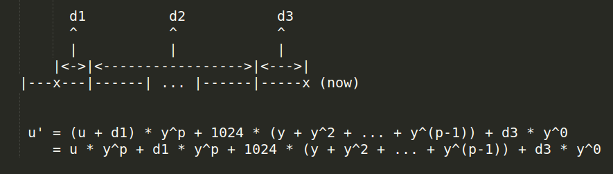

# Linux内核进程管理(六)——CFS调度器之一

## 1. 调度器

-   进程是操作系统虚拟出来的概念，用来组织计算机中的任务。但随着进程被赋予越来越多的任务，进程好像有了真实的生命，它从诞生就随着CPU时间执行，直到最终消失。不过，进程的生命都得到了操作系统内核的关照。就好像疲于照顾几个孩子的母亲内核必须做出决定，如何在进程间分配有限的计算资源，最终让用户获得最佳的使用体验。内核中安排进程执行的模块称为调度器（scheduler）。
-   调度器可以切换进程状态（`process state`）。一个Linux进程从被创建到死亡，可能会经过很多种状态，我们在前文有讲述进程的多种状态，比如就绪、运行、轻度睡眠、。我们可以把Linux下繁多的进程状态，归纳为三种基本状态。**就绪（Ready）**:进程已经获得了CPU以外的所有必要资源，如进程空间、网络连接等。就绪状态下的进程等到CPU，便可立即执行。**执行（Running）**:进程获得CPU，执行程序。**阻塞（Blocked）**：当进程由于等待某个事件而无法执行时，便放弃CPU，处于阻塞状态。
-   进程创建后，就自动变成了就绪状态。如果内核把CPU时间分配给该进程，那么进程就从就绪状态变成了执行状态。在执行状态下，进程执行指令，最为活跃。正在执行的进程可以主动进入阻塞状态，比如这个进程需要将一部分硬盘中的数据读取到内存中。在这段读取时间里，进程不需要使用CPU，可以主动进入阻塞状态，让出CPU。当读取结束时，计算机硬件发出信号，进程再从阻塞状态恢复为就绪状态。进程也可以被迫进入阻塞状态，比如接收到`SIGSTOP`信号。如下图所示：
-   调度器是CPU时间的管理员。Linux调度器需要负责做两件事：一件事是选择某些就绪的进程来执行；另一件事是打断某些执行中的进程，让它们变回就绪状态。不过，并不是所有的调度器都有第二个功能。有的调度器的状态切换是单向的，只能让就绪进程变成执行状态，不能把正在执行中的进程变回就绪状态。支持双向状态切换的调度器被称为抢占式（`pre-emptive`）调度器。
-   调度器在让一个进程变回就绪时，就会立即让另一个就绪的进程开始执行。多个进程接替使用CPU，从而最大效率地利用CPU时间。当然，如果执行中进程主动进入阻塞状态，那么调度器也会选择另一个就绪进程来消费CPU时间。所谓的上下文切换（`context  switch`）就是指进程在CPU中切换执行的过程。内核承担了上下文切换的任务，负责储存和重建进程被切换掉之前的CPU状态，从而让进程感觉不到自己的执行被中断。应用程序的开发者在编写计算机程序时，就不用专门写代码处理上下文切换了。 


## 2. 普通进程

-   调度器分配CPU时间的基本依据，就是进程的优先级。进程的优先级，我们在上一章节中已有相关论述，此处我们只做简要介绍，实时进程由Linux操作系统创造，普通用户只能创建普通进程。两种进程的优先级不同，实时进程的优先级永远高于普通进程。进程的优先级是一个0到139的整数。数字越小，优先级越高。其中，优先级0到99留给实时进程，100到139留给普通进程。
-   一个普通进程的默认优先级是120。我们可以用命令`nice`来修改一个（普通）进程的默认优先级。例如有一个可执行程序叫app，执行命令**nice -n -20 ./app**，命令中的-20指的是从默认优先级上减去20。通过这个命令执行app程序，内核会将app进程的默认优先级设置成100，也就是普通进程的最高优先级。命令中的-20可以被换成-20至19中任何一个整数，包括-20 和 19。默认优先级将会变成执行时的静态优先级（`static priority`）。
-   调度器最终使用的优先级根据的是进程的动态优先级，静态优先级与动态优先级的关系，我们在上一章节中已有论述。
-   我们在上一章节中已有介绍，普通进程的调度使用的调度算法是完全公平调度算法，调度策略是`SCHED_NORMAL`/`SCHED_IDLE`，对应的调度类是公平调度类`fair_sched_class`，使用的调度器则是CFS调度器。

## 3. 早期的O(n)和O(1)调度器

-   在介绍CFS调度器之前，我们先来了解一下O(n)和O(1)调度器。
-   Linux最原始的调度策略是按照优先级排列好进程，等到一个进程运行完了再运行优先级较低的一个，但这种策略完全无法发挥多任务系统的优势。因此，随着时间推移，操作系统的调度器也多次进化。
-   Linux 2.4内核推出的O(n)调度器。O(n)这个名字，来源于算法复杂度的大O表示法。大O符号代表这个算法在最坏情况下的复杂度。字母n在这里代表操作系统中的活跃进程数量。O(n)表示这个调度器的时间复杂度和活跃进程的数量成正比。
-   O(n)调度器把时间分成大量的微小时间片（Epoch）。在每个时间片开始的时候，调度器会检查所有处在就绪状态的进程。调度器计算每个进程的优先级，然后选择优先级最高的进程来执行。一旦被调度器切换到执行，进程可以不被打扰地用尽这个时间片。如果进程没有用尽时间片，那么该时间片的剩余时间会增加到下一个时间片中。
-   O(n)调度器在每次使用时间片前都要检查所有就绪进程的优先级。这个检查时间和进程中进程数目n成正比，这也正是该调度器复杂度为O(n)的原因。当计算机中有大量进程在运行时，这个调度器的性能将会被大大降低。也就是说，O(n)调度器没有很好的可拓展性。O(n)调度器是Linux 2.6之前使用的进程调度器。当Java语言逐渐流行后，由于Java虚拟机会创建大量进程，调度器的性能问题变得更加明显。
-   为了解决O(n)调度器的性能问题，O(1)调度器被发明了出来，并从Linux  2.6内核开始使用。顾名思义，O(1)调度器是指调度器每次选择要执行的进程的时间都是1个单位的常数，和系统中的进程数量无关。这样，就算系统中有大量的进程，调度器的性能也不会下降。O(1)调度器的创新之处在于，它会把进程按照优先级排好，放入特定的数据结构中。在选择下一个要执行的进程时，调度器不用遍历进程，就可以直接选择优先级最高的进程。

-   和O(n)调度器类似，O(1)也是把时间片分配给进程。优先级为120以下的进程时间片为：**(140–priority)×20毫秒**，优先级120及以上的进程时间片为：**(140–priority)×5 毫秒**。
-   O(1)调度器会用两个队列来存放进程。一个队列称为活跃队列，用于存储那些待分配时间片的进程。另一个队列称为过期队列，用于存储那些已经享用过时间片的进程。O(1)调度器把时间片从活跃队列中调出一个进程。这个进程用尽时间片，就会转移到过期队列。当活跃队列的所有进程都被执行过后，调度器就会把活跃队列和过期队列对调，用同样的方式继续执行这些进程。

-   上面的描述没有考虑优先级。加入优先级后，情况会变得复杂一些。操作系统会创建140个活跃队列和过期队列，对应优先级0到139的进程。一开始，所有进程都会放在活跃队列中。然后操作系统会从优先级最高的活跃队列开始依次选择进程来执行，如果两个进程的优先级相同，他们有相同的概率被选中。执行一次后，这个进程会被从活跃队列中剔除。如果这个进程在这次时间片中没有彻底完成，它会被加入优先级相同的过期队列中。当140个活跃队列的所有进程都被执行完后，过期队列中将会有很多进程。调度器将对调优先级相同的活跃队列和过期队列继续执行下去。过期队列和活跃队列，如下图所示：


-   我们下面看一个例子，有五个进程，如表1所示，Linux操作系统中的进程队列（run queue），如表2所示：


-   那么在一个执行周期，被选中的进程依次是先A，然后B和C，随后是D，最后是E。注意，普通进程的执行策略并没有保证优先级为100的进程会先被执行完进入结束状态，再执行优先级为101的进程，而是在每个对调活跃和过期队列的周期中都有机会被执行，这种设计是为了避免进程饥饿（starvation）。所谓的进程饥饿，就是优先级低的进程很久都没有机会被执行。
-   我们看到，O(1)调度器在挑选下一个要执行的进程时很简单，不需要遍历所有进程。但是它依然有一些缺点。进程的运行顺序和时间片长度极度依赖于优先级。比如，计算优先级为100、110、120、130和139这几个进程的时间片长度，如下图所示：


-   从表格中会发现，优先级为110和120的进程的时间片长度差距比120和130之间的大了10倍。也就是说，进程时间片长度的计算存在很大的随机性。O(1)调度器会根据平均休眠时间来调整进程优先级。该调度器假设那些休眠时间长的进程是在等待用户互动。这些互动类的进程应该获得更高的优先级，以便给用户更好的体验。一旦这个假设不成立，O(1)调度器对CPU的调配就会出现问题，即O(1)调度器对交互式进程的处理存在问题。


## 4. CFS调度器

-   O(1)调度器在处理某些交互式进程依然存在问题，特别是有一些测试场景下导致交互式进程反应缓慢，另外对NUMA支持也不完善，因此大量难以维护和阅读的代码被加入该调度器。
-   Linux内核社区的一位传奇人物`Con Kolivas`提出了`RSDL`(楼梯调度算法)来实现公平性，在社区的一番争论之后，`RedHat`公司的`Ingo Molnar`借鉴`RSDL`的思想提出了一个CFS调度算法。
-   从Linux 2.6.23版本起，完全公平调度器（`CFS，Completely Fair Scheduler`）取代了O(1)调度器。CFS调度器不对进程进行任何形式的估计和猜测。这一点和O(1)区分交互和非交互进程的做法完全不同。
-   CFS调度器增加了一个虚拟运行时（`virtual  runtime`）的概念。每次一个进程在CPU中被执行了一段时间，就会增加它虚拟运行时的记录。在每次选择要执行的进程时，不是选择优先级最高的进程，而是选择虚拟运行时最少的进程。完全公平调度器用一种叫红黑树的数据结构取代了O(1)调度器的140个队列。红黑树可以高效地找到虚拟运行最小的进程。
-   我们先通过例子来看CFS调度器。假如一台运行的计算机中本来拥有A、B、C、D四个进程。内核记录着每个进程的虚拟运行时，如下图所示：


-   系统增加一个新的进程E。新创建进程的虚拟运行时不会被设置成0，而会被设置成当前所有进程最小的虚拟运行时。这能保证该进程被较快地执行。在原来的进程中，最小虚拟运行时是进程A的1000纳秒，因此E的初始虚拟运行时会被设置为1000纳秒。新的进程列表如下图所示：


-   假如调度器需要选择下一个执行的进程，进程A会被选中执行。进程A会执行一个调度器决定的时间片。假如进程A运行了250纳秒，那它的虚拟运行时增加。而其他的进程没有运行，所以虚拟运行时不变。在A消耗完时间片后，更新后的进程列表，如下图所示：


-   可以看到，进程A的排序下降到了第三位，下一个将要被执行的进程是进程E。从本质上看，虚拟运行时代表了该进程已经消耗了多少CPU时间。如果它消耗得少，那么理应优先获得计算资源。
-   按照上述的基本设计理念，CFS调度器能让所有进程公平地使用CPU。听起来，这让进程的优先级变得毫无意义。CFS调度器也考虑到了这一点。CFS调度器会根据进程的优先级来计算一个时间片因子。同样是增加250纳秒的虚拟运行时，优先级低的进程实际获得的可能只有200纳秒，而优先级高的进程实际获得可能有300纳秒。这样，优先级高的进程就获得了更多的计算资源。

## 5. 权重计算

>   调度实体

引入任务组以后，因为调度器的调度对象不再仅仅只有进程，所以内核抽象出调度实体，调度器的调度对象是调度实体，调度实体是进程或进程组。在进程描述符的数据结构`struct task_struct`中，已嵌入进程的调度实体，内核使用数据结构`sched_entity`来描述调度实体，如下，`kernel4.14/include/linux/sched.h`

```c
struct task_struct {
    ...
    const struct sched_class	*sched_class; // 调度类
    struct sched_entity		se; // 公平调度实体
    struct sched_rt_entity		rt; // 实时调度实体
    #ifdef CONFIG_CGROUP_SCHED
    struct task_group		*sched_task_group;
    #endif
    struct sched_dl_entity		dl; // 限期调度实体
    ...
};

struct sched_entity {
	/* For load-balancing: */
	struct load_weight		load; // 调度实体的权重信息
	struct rb_node			run_node; // 红黑树的结点
	struct list_head		group_node; // 所在进程组
	unsigned int			on_rq; // 标记是否处于就绪运行队列中接受调度

	u64				exec_start; // 进程开始执行的时间
	u64				sum_exec_runtime; // 进程运行总时间
	u64				vruntime; // 虚拟运行时间
	u64				prev_sum_exec_runtime; // 上个调度周期中进程运行的总时间
	u64				s_sum_exec_runtime;
	u64				b_sum_exec_runtime;

	u64				nr_migrations;

	struct sched_statistics		statistics;

#ifdef CONFIG_FAIR_GROUP_SCHED
	int				depth;
	struct sched_entity		*parent;
	/* rq on which this entity is (to be) queued: */
	struct cfs_rq			*cfs_rq;
	/* rq "owned" by this entity/group: */
	struct cfs_rq			*my_q;
#endif

#ifdef CONFIG_SMP
	/*
	 * Per entity load average tracking.
	 *
	 * Put into separate cache line so it does not
	 * collide with read-mostly values above.
	 */
	struct sched_avg		avg ____cacheline_aligned_in_smp; /* 调度实体的负载信息 */
#endif
};

```

内核使用`load_weight`数据结构来记录调度实体的权重信息，如下：`kernel4.14/include/linux/sched.h`

```c
struct load_weight {
	unsigned long			weight; //调度实体的权重
	u32				inv_weight; //inverse weight的缩写，它是权重的一个中间计算结果
};

```

从调度实体的数据结构中，我们可以看出，调度实体已经内嵌了`struct load_weight`结构体，用于描述调度实体的权重。因此代码中经常通过`p->se.load`来获取进程p的权重信息，进程的权重相关的这两个值，我们在下文会介绍。

>   进程nice值

上一章节中，我们在讲述进程优先级时知道，普通进程的优先级范围`[100, 139]`，这个区间的优先级又称为静态优先级(`static priority`)，之所以称为静态优先级是因为它不会随着时间而改变，内核不会修改它，只能通过系统调用nice去修改。静态优先级用进程描述符中的`static_prio`表示。

nice值，表示进程可被执行的优先级的修正数值，因为nice值只是为内核提供修正普通进程的优先级使用，所以其只适用范围为普通进程。

下面我们从内核源码解析，普通进程的静态优先级与nice值的关系，以及静态优先级与调度器最终使用的进程优先级关系。在进程描述符`task_struct`结构体中，`kernel4.14/include/linux/sched.h`：

```c
struct task_struct {
    ...
    int				prio;
    int				static_prio;
    ...
};

```

其中`prio`为动态优先级，是调度器最终使用的优先级数值，即调度器选择一个进程时实际选择的值。`prio`值越小，表明进程的优先级越高。`prio` 值的取值范围是 `0 ~ MAX_PRIO`，即 `0 ~ 139`（包括 0 和 139），根据调度策略的不同，又可以分为两个区间，其中区间 `0 ~ 99` 的属于实时进程，区间 `100 ~139` 的为非实时进程，即普通进程。`prio`取值的相关代码如下，`kernel4.14/kernel/sched/core.c`

```c
/*
 * __normal_prio - return the priority that is based on the static prio
 */
static inline int __normal_prio(struct task_struct *p)
{	// __normal_prio 函数，返回静态优先级值
	return p->static_prio;
}

/*
 * Calculate the expected normal priority: i.e. priority
 * without taking RT-inheritance into account. Might be
 * boosted by interactivity modifiers. Changes upon fork,
 * setprio syscalls, and whenever the interactivity
 * estimator recalculates.
 */
static inline int normal_prio(struct task_struct *p)
{
	int prio;

	if (task_has_dl_policy(p)) // task_has_dl_policy 函数，判断进程是否为限期进程，若为限期进程，则返回1，否则返回0
		prio = MAX_DL_PRIO-1;
	else if (task_has_rt_policy(p)) // task_has_rt_policy 函数，判断进程是否为实时进程，若为实时进程，则返回1，否则返回0
		prio = MAX_RT_PRIO-1 - p->rt_priority;
	else // 进程为普通进程，则 prio 值为静态优先级值，即 prio = p->static_prio 
		prio = __normal_prio(p);
	return prio;
}

```

可知，当进程为普通进程时，调度器最终使用的动态优先级`prio`就是普通进程的静态优先级`static_prio`。

那么内核是如何修改`static_prio`静态优先级呢？我们知道，`static_prio`静态优先级，不会随时间改变，所有内核不会主动修改它，只能通过系统调用`nice`去修改，如下`kernel4.14/include/linux/sched/prio.h`

```c
/* SPDX-License-Identifier: GPL-2.0 */
#ifndef _LINUX_SCHED_PRIO_H
#define _LINUX_SCHED_PRIO_H

#define MAX_NICE	19
#define MIN_NICE	-20
#define NICE_WIDTH	(MAX_NICE - MIN_NICE + 1)

...

#define MAX_USER_RT_PRIO	100
#define MAX_RT_PRIO		MAX_USER_RT_PRIO
...
#define DEFAULT_PRIO		(MAX_RT_PRIO + NICE_WIDTH / 2)

/*
 * Convert user-nice values [ -20 ... 0 ... 19 ]
 * to static priority [ MAX_RT_PRIO..MAX_PRIO-1 ],
 * and back.
 */
#define NICE_TO_PRIO(nice)	((nice) + DEFAULT_PRIO)
...

#endif /* _LINUX_SCHED_PRIO_H */


```

所以当有需要时，系统会通过`NICE_TO_PRIO()`来修改`static_prio`的值，例如：`kernel4.14/kernel/sched/core.c`

```c
void set_user_nice(struct task_struct *p, long nice)
{
	...
	p->static_prio = NICE_TO_PRIO(nice);
	...
}
EXPORT_SYMBOL(set_user_nice);

```

由上面代码知道，我们可以通过调用`NICE_TO_PRIO(nice)`来修改`static_prio`的值， `static_prio` 值的计算方法如下：

`static_prio = MAX_RT_PRIO + nice +20`，`MAX_RT_PRIO` 的值为100，`nice`的范围是`-20 ~ 19`，故`static_prio`值的范围是`100 ~ 139`。 `static_prio`的值越小，表明进程的静态优先级越高。

内核约定nice值为0的权重值为1024，其他nice值对应的权重值可以通过查表的方式来获取，内核预先计算好了一个表`sched_prio_to_weight[40]`，表下标对应nice值[-20~19],`kernel4.14/kernel/sched/core.c`

```c
const int sched_prio_to_weight[40] = {
 /* -20 */     88761,     71755,     56483,     46273,     36291,
 /* -15 */     29154,     23254,     18705,     14949,     11916,
 /* -10 */      9548,      7620,      6100,      4904,      3906,
 /*  -5 */      3121,      2501,      1991,      1586,      1277,
 /*   0 */      1024,       820,       655,       526,       423,
 /*   5 */       335,       272,       215,       172,       137,
 /*  10 */       110,        87,        70,        56,        45,
 /*  15 */        36,        29,        23,        18,        15,
};

/*
 * Inverse (2^32/x) values of the sched_prio_to_weight[] array, precalculated.
 *
 * In cases where the weight does not change often, we can use the
 * precalculated inverse to speed up arithmetics by turning divisions
 * into multiplications:
 */
const u32 sched_prio_to_wmult[40] = {
 /* -20 */     48388,     59856,     76040,     92818,    118348,
 /* -15 */    147320,    184698,    229616,    287308,    360437,
 /* -10 */    449829,    563644,    704093,    875809,   1099582,
 /*  -5 */   1376151,   1717300,   2157191,   2708050,   3363326,
 /*   0 */   4194304,   5237765,   6557202,   8165337,  10153587,
 /*   5 */  12820798,  15790321,  19976592,  24970740,  31350126,
 /*  10 */  39045157,  49367440,  61356676,  76695844,  95443717,
 /*  15 */ 119304647, 148102320, 186737708, 238609294, 286331153,
};

```

`nice 0`对应的权重是1024，`nice n-1`的权重大约是`nice n`权重的1.25倍。表`sched_prio_to_wmult[40]`，也是预先计算好的，其计算公式为`inv_weight = 2^32/weight`，其中，`inv_weight`是`inverse weight`的缩写，指权重被倒转了，`weight`值即为表`sched_prio_to_weight[40]`中相应的值，表`sched_prio_to_wmult[40]`的作用是为后面计算方便。

内核提供一个函数来查询这两个表，然后把值存放在`p->se.load`数据结构中，即`struct load_weight`结构中，`kernel4.14/kernel/sched/core.c`

```c
static void set_load_weight(struct task_struct *p)
{
	int prio = p->static_prio - MAX_RT_PRIO;
	struct load_weight *load = &p->se.load;

	/*
	 * SCHED_IDLE tasks get minimal weight:
	 */
	if (idle_policy(p->policy)) {
		load->weight = scale_load(WEIGHT_IDLEPRIO);
		load->inv_weight = WMULT_IDLEPRIO;
		return;
	}

	load->weight = scale_load(sched_prio_to_weight[prio]);
	load->inv_weight = sched_prio_to_wmult[prio];
}

```

`kernel4.14/kernel/sched/sched.h`

```c
#ifdef CONFIG_64BIT
# define NICE_0_LOAD_SHIFT	(SCHED_FIXEDPOINT_SHIFT + SCHED_FIXEDPOINT_SHIFT)
# define scale_load(w)		((w) << SCHED_FIXEDPOINT_SHIFT)
# define scale_load_down(w)	((w) >> SCHED_FIXEDPOINT_SHIFT)
#else
# define NICE_0_LOAD_SHIFT	(SCHED_FIXEDPOINT_SHIFT)
# define scale_load(w)		(w)
# define scale_load_down(w)	(w)
#endif

```

`kernel4.14/include/linux/sched.h`

```c
# define SCHED_FIXEDPOINT_SHIFT		10

```

从以上代码中可以看出，进程权重`load->weight`的计算方法在32位和64位内核中不同，32位内核中，进程的权重值为表`sched_prio_to_weight`中对应的下标值，64位内核中，进程的权重值为表**`sched_prio_to_weight`中对应的下标值 X 2^10**。

表`sched_prio_to_wmult`主要是为计算CFS调度器的虚拟运行时间准备的，如上所述，CFS调度器引入了虚拟运行时间的概念，计算虚拟运行时间的核心函数`calc_delta_fair`，定义如下，`kernel4.14/kernel/sched/fair.c`

```c
static inline u64 calc_delta_fair(u64 delta, struct sched_entity *se)
{
	if (unlikely(se->load.weight != NICE_0_LOAD))
		delta = __calc_delta(delta, NICE_0_LOAD, &se->load);

	return delta;
}

```

其中`delta`为实际运行时间，arm64架构下，`NICE_0_LOAD`值为`2^20`，该函数比较简单，不作展开解析，最终虚拟运行时间的计算公式为： `虚拟运行时间 = 实际运行时间 X nice 0 对应的权重/进程nice值对应的权重`，其中间的计算公式为：`虚拟运行时间 = (实际运行时间 X nice 0 对应的权重 X 2^32/进程nice值对应的权重) >> 32`，这里巧妙地运用了`sched_prio_to_wmult[40]`表做了预先的除法(`inv_weight = 2^32/weight`)，因此，实际的计算只有乘法和移位操作，这就是为什么要定义`sched_prio_to_wmult[40]`表的缘故。


## 6. CPU负载计算

计算一个CPU的负载，最简单的方法是计算CPU上就绪队列上所有进程的权重。仅考虑优先级权重是有问题的，因为没有考虑该进程的行为，有的进程使用的CPU是突发性的，有的是恒定的，有的是CPU密集型，也有的是IO密集型。进程调度考虑优先级权重的方法可行，但是如果延伸到多CPU之间的负载均衡就显得不准确了，因此从`Linux 3.8`内核以后，进程的负载计算不仅考虑权重，而且跟踪每个调度实体的负载情况，该方法称为`PELT(Pre-entity Load Tracking)`。

### 6.1 PELT(Per-Entity Load Tracking)

-   完美的调度算法需要一个能够预知未来的水晶球：只有当内核准确地推测出每个进程对系统的需求，她才能最佳地完成调度任务。不幸的是，硬件制造商推出各种性能强劲的处理器，但从来也不考虑预测进程负载的需求。在没有硬件支持的情况下，调度器只能祭出通用的预测大法：用“过去”预测“未来”，也就是说调度器是基于过去的调度信息来预测未来该进程对`CPU`的需求。而在这些调度信息中，每一个进程过去的“性能”信息是核心要考虑的因素。但有趣的是，虽然内核密切跟踪每个进程实际运行的时间，但它并不清楚每个进程对系统负载的贡献程度。
-   有人可能会问：“消耗的`CPU`时间”和“负载`（load）`”是否有区别？是的，当然有区别，`Paul Turner`在提交`per-entity load  tracking`补丁集的时候对这个问题做了回答。一个进程即便当前没有在`cpu`上运行，例如：该进程仅仅是挂入`runqueue`等待执行，它也能够对`cpu` 负载作出贡献。**“负载”是一个瞬时量，表示当前时间点的进程对系统产生的“压力”是怎样的？**显然`runqueue`中有10个等待运行的进程对系统造成的“压力”要大于一个`runqueue`中只有1个等待进程的场景。与之相对的“CPU使用率`（usage）`”不一样，它不是瞬时量，而是一个累积量。有一个长时间运行的进程，它可能上周占用大量的处理器时间，但是现在可能占用很少的`cpu`时间，尽管它过去曾经“辉煌”过（占用大量`CPU`时间），但这对现在的系统负荷贡献很小。
-   `Linux`内核`3.8`版本之前的内核`CFS`调度器在计算`CPU load`的时候采用的是跟踪每个运行队列上的负载`（per-rq load  tracking）`。需要注意的是：`CFS`中的“运行队列”实际上是有多个，至少每个`CPU`就有一个`runqueue`。而且，当使用“按组调度”`（ group scheduling）`功能时，每个控制组`（control  group）`都有自己的`per-CPU`运行队列。对于`per-rq`的负载跟踪方法，调度器可以了解到每个运行队列对整个系统负载的贡献。这样的统计信息足以帮助组调度器`（group  scheduler）`在控制组之间分配`CPU`时间，但从整个系统的角度看，我们并不知道当前负载来自何处。除此之外，`per-rq`的负载跟踪方法还有另外一个问题，即使在工作负载相对稳定的情况下，跟踪到的运行队列的负载值也会变化很大。
-   `Per-entity load tracking`系统解决了这些问题，这是通过把负载跟踪从`per-rq`推进到`per-entity`的层次。所谓调度实体`（scheduling entity）`其实就是一个进程或者`control  group`中的一组进程。为了做到`Per-entity`的负载跟踪，时间（物理时间，不是虚拟时间）被分成了`1024us`的序列（周期，称为`period`，简称`PI`，每个周期为`1024us`，主要是为例方便移位操作，也可以认为是1毫秒），在每一个`1024us`的周期中，一个`entity`对系统负载的贡献可以根据该实体处于`runnable`状态（正在`CPU`上运行或者等待`cpu`调度运行）的时间进行计算。如果在该周期内，`runnable`的时间是`x`，那么对系统负载的贡献就是`（x/1024）`。当然，一个实体在一个计算周期内的负载可能会超过`1024us`，这是因为我们会累积在过去周期中的负载，即一个进程对系统负载贡献，包含当前负载和历史负载，而对于过去的负载我们在计算的时候需要乘一个衰减因子。
-   如果我们让`Li`表示在周期`pi`中该调度实体的对系统负载贡献，那么一个调度实体对系统负荷的总贡献可以表示为： 其中y是衰减因子，衰减的意义类似于信号处理中的采样，距离当前时间点越远，衰减系数越大，对总体影响越小。`L0`表示当前周期负载值,通过上面的公式可以看出：1）调度实体对系统负荷的贡献值是一个序列之和组成; 2）最近的负荷值拥有最大的权重; 3）过去的负荷也会被累计，但是是以递减的方式来影响负载计算。4)`y^32 = 0.5, y = 0.97857206`，可以看出每经过32个周期，衰减值减半； 5) 使用这个公式，内核不用维护n个周期的负载值,只需要记录上一次负载和，因为根据公式很容易得到`Ln = L0 + Ln-1*y`； 6) PELT是计算累加时间的衰减和。**load = 累加时间衰减值* weight**。使用这样序列的好处是计算简单，我们不需要使用数组来记录过去的负荷贡献，只要把上次的总负荷的贡献值乘以`y`再加上新的`L0`负荷值就可以了。
-   举个例子，如何计算一个`se`的负载贡献。如果有一个task，从第一次加入`rq`后开始一直运行`4096us`后一直睡眠，那么在`1023us、2047us、3071us、4095us、5119us、6143us、7167us和8191us`时间的每一个时刻负载贡献分别是多少呢？

```verilog
1023us: L0 = 1023
2047us: L1 = 1023 + 1024 * y                                = 1023 + (L0 + 1) * y = 2025
3071us: L2 = 1023 + 1024 * y + 1024 * y^2                    = 1023 + (L1 + 1) * y = 3005
4095us: L3 = 1023 + 1024 * y + 1024 * y^2 + 1024 * y^3        = 1023 + (L2 + 1) * y = 3963
5119us: L4 = 0    + 1024 * y + 1024 * y^2 + 1024 * y^3 + 1024 * y^4   = 0 + (L3 + 1) * y = 3877
6143us: L5 = 0    +    0     + 1024 * y^2 + 1024 * y^3 + 1024 * y^4 + 1024 * y^5 = 0 + L4 * y = 3792
7167us: L6 = 0    + L5 * y = L4 * y^2 = 3709
8191us: L7 = 0    + L6 * y = L5 * y^2 = L4 * y^3 = 3627

```

-   经过以上的举例，我们不难发现一个规律，计算当前时间的负载只需要上个周期负载贡献总和乘以衰减系数y，并加上当前时间点的负载即可。
-   从上面的计算公式我们也可以看出，经常需要计算`val*y^n`(如`1024 * y^2`)的值，因此内核提供`decay_load()`函数用于计算第n个周期的衰减值。为了避免浮点数运算，采用移位和乘法运算提高计算速度。`decay_load(val, n) = val*y^n*2^32>>32`。我们将`y^n*2^32`的值提前计算出来保存在数组`runnable_avg_yN_inv`中。
-   `runnable_avg_yN_inv[n] = y^n * 2^32, n > 0 && n < 32`
-   `runnable_avg_yN_inv`的计算可以参考`calc_runnable_avg_yN_inv()`函数, `kernel4.14/Documentation/scheduler/sched-pelt.c`

```c
void calc_runnable_avg_yN_inv(const int halflife)
{
	int i;
	unsigned int x;

	printf("static const u32 runnable_avg_yN_inv[] = {");
	for (i = 0; i < halflife; i++) {
		x = ((1UL<<32)-1)*pow(y, i);

		if (i % 4 == 0) printf("\n\t");
		printf("0x%8x,", x);
	}
	printf("\n};\n\n");
}

```

-   由于`y^32=0.5`，因此我们只需要计算`y*2^32 ~ y^31*2^32`的值保存到数组中即可。当n大于31的时候，为了计算`y^n*2^32`我们可以借助`y^32=0.5`公式间接计算。例如`y^33*2^32=y^32*y*2^32=0.5*y*2^32=0.5*runnable_avg_yN_inv[1]`。`calc_runnable_avg_yN_inv()`函数简单归纳就是：`runnable_avg_yN_inv[i] = ((1UL << 32) - 1) * pow(0.97857206, i),i>=0 && i<32`。`pow(x, y)`是求`x^y`的值。计算得到`runnable_avg_yN_inv`数组的值如下，`kernel4.14/kernel/sched/sched-pelt.h`：

```c
static const u32 runnable_avg_yN_inv[] = {
	0xffffffff,0xfa83b2da,0xf5257d14,0xefe4b99a,
	0xeac0c6e6,0xe5b906e6,0xe0ccdeeb,0xdbfbb796,
	0xd744fcc9,0xd2a81d91,0xce248c14,0xc9b9bd85,
	0xc5672a10,0xc12c4cc9,0xbd08a39e,0xb8fbaf46,
	0xb504f333,0xb123f581,0xad583ee9,0xa9a15ab4,
	0xa5fed6a9,0xa2704302,0x9ef5325f,0x9b8d39b9,
	0x9837f050,0x94f4efa8,0x91c3d373,0x8ea4398a,
	0x8b95c1e3,0x88980e80,0x85aac367,0x82cd8698,
};

```

-   根据`runnable_avg_yN_inv`数组的值，我们就方便实现`decay_load()`函数，`kernel4.14/kernel/sched/fair.c`

```c
static u64 decay_load(u64 val, u64 n)
{
	unsigned int local_n;

	if (unlikely(n > LOAD_AVG_PERIOD * 63))
		return 0;

	/* after bounds checking we can collapse to 32-bit */
	local_n = n;

	/*
	 * As y^PERIOD = 1/2, we can combine
	 *    y^n = 1/2^(n/PERIOD) * y^(n%PERIOD)
	 * With a look-up table which covers y^n (n<PERIOD)
	 *
	 * To achieve constant time decay_load.
	 */
	if (unlikely(local_n >= LOAD_AVG_PERIOD)) {
		val >>= local_n / LOAD_AVG_PERIOD;
		local_n %= LOAD_AVG_PERIOD;
	}

	val = mul_u64_u32_shr(val, runnable_avg_yN_inv[local_n], 32);
	return val;
}

```

>1.   `LOAD_AVG_PERIOD`的值为32，我们认为当时间经过2016个周期后，衰减后的值为0。即`val*y^n=0, n > 2016`。
>2.   当n大于等于32的时候，就需要根据`y^32=0.5`条件计算`y^n`的值。`y^n*2^32 = 1/2n/32 * y^(n%32)*2^32=1/(2^(n/32)) * runnable_avg_yN_inv[n%32]`。 	

-   经过上面举例，我们可以知道计算当前负载贡献并不需要记录所有历史负载贡献。我们只需要知道上一刻负载贡献就可以计算当前负载贡献，这大大降低了代码实现复杂度。我们继续上面举例问题的思考，我们依然假设一个task开始从0时刻运行，那么`1022us`后的负载贡献自然就是1022。当task经过`10us`之后，此时（现在时刻是`1032us`）的负载贡献又是多少呢？很简单，`10us`中的`2us`和之前的`1022us`可以凑成一个周期`1024us`。这个`1024us`需要进行一次衰减，即现在的负载贡献是：`(1024 - 1022 + 1022)y + 10 - (1024 - 1022) = 1022y + 2y + 8 =  1010`。`1022y`可以理解成由于经历了一个周期，因此上一时刻的负载需要衰减一次，因此1022需要乘以衰减系数y，`2y`可以理解成，`2us`属于上一个负载计算时距离一个周期`1024us`的差值，由于2是上一个周期的时间，因此也需要衰减一次，8是当前周期时间，不需要衰减。又经过了`2124us`，此时（现在时刻是`3156us`）负载贡献又是多少呢？即：`(1024 - 8 + 1010)y^2 + 1024y + 2124 - 1024 - (1024 - 8) = 1010y^2 + 1016y^2 + 1024y + 84 =  3024`。`2124us`可以分解成3部分：`1016us`补齐上一时刻不足`1024us`部分，凑成一个周期；`1024us`一个整周期；当前时刻不足一个周期的剩余`84us`部分。相当于我们经过了2个周期，因此针对上一次的负载贡献需要衰减2次，也就是`1010y^2`部分，`1016us`是补齐上一次不足一个周期的部分，因此也需要衰减2次，所以公式中还有`1016y^2` 部分。`1024us`部分相当于距离当前时刻是一个周期，所以需要衰减1次，最后84部分是当前剩余时间，不需要衰减。
-   针对以上事例，我们可以得到一个更通用情况下的计算公式。假设上一时刻负载贡献是u，经历d时间后的负载贡献如何计算呢？根据上面的例子，我们可以把时间d分成3和部分：`d1`是离当前时间最远（不完整的）`period` 的剩余部分，`d2` 是完整period时间，而`d3`是（不完整的）当前 period 的剩余部分。假设时间d是经过p个周期`（d=d1+d2+d3, p=1+d2/1024）`。`d1，d2，d3` 的示意图如下：



-   上面的例子现在就可以套用上面的公式计算。例如，上一次的负载贡献`u=1010`，经过时间`d=2124us`，可以分解成3部分，`d1=1016us，d2=1024，d3=84`。经历的周期`p=2`。所以当前时刻负载贡献`u'=1010y2 + 1016y2 + 1024y + 84`，与上面计算结果一致。


### 6.2 负载信息记录

-   Linux中使用`struct sched_avg`结构体记录调度实体或者就绪队列的负载信息。每个调度实体以及就绪队列结构体中都包含一个`struct sched_avg`结构体用于记录负载信息，`kernel4.14/include/linux/sched.h`

```c
struct sched_entity {
	...
#ifdef CONFIG_SMP
	/*
	 * Per entity load average tracking.
	 *
	 * Put into separate cache line so it does not
	 * collide with read-mostly values above.
	 */
	struct sched_avg		avg ____cacheline_aligned_in_smp;
#endif
};

struct sched_avg {
	u64				last_update_time; //上一次负载更新时间。用于计算时间间隔。
	u64				load_sum; //基于可运行（runnable）时间的负载贡献总和。runnable时间包含两部分：一是在rq中等待cpu调度运行的时间，二是正在`cpu`上运行的时间。 
	u32				util_sum; //基于正在运行（running）时间的负载贡献总和。running时间是指调度实体se正在cpu上执行时间。
	u32				period_contrib; 
	unsigned long			load_avg; //基于可运行（runnable）时间的平均负载贡献。
	unsigned long			util_avg; // 基于正在运行（running）时间的平均负载贡献。
	struct util_est			util_est;
};

```

-   一个调度实体可能属于task，也有可能属于group（Linux支持组调度，需要配置`CONFIG_FAIR_GROUP_SCHED`）。调度实体的初始化针对task和group也就有所区别。调度实体`struct sched_entity`结构体描述，我们在上文已介绍。
-   调度实体的初始化函数是`init_entity_runnable_average()`，`kernel4.14/kernel/sched/fair.c`

```c
void init_entity_runnable_average(struct sched_entity *se)
{
	struct sched_avg *sa = &se->avg;

	memset(sa, 0, sizeof(*sa));
	/*
	 * util_avg is initialized in post_init_entity_util_avg.
	 * util_est should start from zero.
	 * sched_avg's period_contrib should be strictly less then 1024, so
	 * we give it 1023 to make sure it is almost a period (1024us), and
	 * will definitely be update (after enqueue).
	 */
	sa->period_contrib = 1023;
	/*
	 * Tasks are intialized with full load to be seen as heavy tasks until
	 * they get a chance to stabilize to their real load level.
	 * Group entities are intialized with zero load to reflect the fact that
	 * nothing has been attached to the task group yet.
	 */
	if (entity_is_task(se))
		sa->load_avg = scale_load_down(se->load.weight);
	sa->load_sum = sa->load_avg * LOAD_AVG_MAX;
	/* when this task enqueue'ed, it will contribute to its cfs_rq's load_avg */
}

```

>   针对`task  se`初始化，load_avg的值是和`se`的权重（`se->load.weight`）相等。而且根据注释其实也可以知道，load_avg在后续的负载计算中累加的最大值其实就是`se`的权重值。也就意味着，load_avg的值可以间接的表明task的繁重程度。对于task的load_sum，即基于可运行（runnable）时间的负载贡献总和（runnable时间包含两部分：一是在rq中等待cpu调度运行的时间，二是正在`cpu`上运行的时间。)，将其初始化为`sa->load_avg * LOAD_AVG_MAX`。
>
>   针对`group se`，load_avg的值初始化为0。这也意味着当前task  group中没有任何task需要调度。
>
>   针对`task  se`和`group se`， 它们的load_sum都被初始化为`sa->load_avg * LOAD_AVG_MAX`，当然因为`group se`的load_avg的值初始化为0，所以其load_sum也为0。


-   在了解了以上信息后，我们来看上文计算负载贡献的公式（`u' = (u + d1) * y^p + 1024 * (y + y^2 + ... + y^(p-1)) + d3 * y^0  = u * y^p + d1 * y^p + 1024 * (y + y^2 + ... + y^(p-1)) + d3 * y^0`）的源码实现，该公式在代码中由两部实现，`accumulate_sum()`函数计算`step1`部分，然后调用`__accumulate_pelt_segments()`函数计算`step2`部分。

```c
/*
 * Accumulate the three separate parts of the sum; d1 the remainder
 * of the last (incomplete) period, d2 the span of full periods and d3
 * the remainder of the (incomplete) current period.
 *
 *           d1          d2           d3
 *           ^           ^            ^
 *           |           |            |
 *         |<->|<----------------->|<--->|
 * ... |---x---|------| ... |------|-----x (now)
 *
 *                           p-1
 * u' = (u + d1) y^p + 1024 \Sum y^n + d3 y^0
 *                           n=1
 *
 *    = u y^p +					(Step 1)
 *
 *                     p-1
 *      d1 y^p + 1024 \Sum y^n + d3 y^0		(Step 2)
 *                     n=1
 */
static __always_inline u32
accumulate_sum(u64 delta, int cpu, struct sched_avg *sa,
	       unsigned long weight, int running, struct cfs_rq *cfs_rq)
{
	unsigned long scale_freq, scale_cpu;
	u32 contrib = (u32)delta; /* p == 0 -> delta < 1024 */
	u64 periods;

	scale_freq = arch_scale_freq_capacity(NULL, cpu);
	scale_cpu = arch_scale_cpu_capacity(NULL, cpu);

	delta += sa->period_contrib; /* period_contrib记录的是上次更新负载不足1024us周期的时间。delta是经过的时间，为了计算经过的周期个数需要加上period_contrib，然后整除1024。*/
	periods = delta / 1024; /* A period is 1024us (~1ms) 计算周期个数*/

	/*
	 * Step 1: decay old *_sum if we crossed period boundaries.
	 */
	if (periods) {
		sa->load_sum = decay_load(sa->load_sum, periods); /* 调用decay_load()函数计算公式中的step1部分 */
		if (cfs_rq) {
			cfs_rq->runnable_load_sum =
				decay_load(cfs_rq->runnable_load_sum, periods);
		}
		sa->util_sum = decay_load((u64)(sa->util_sum), periods); 

		/*
		 * Step 2
		 */
		delta %= 1024;
		contrib = __accumulate_pelt_segments(periods, 
				1024 - sa->period_contrib, delta); /* __accumulate_pelt_segments()负责计算公式step2部分。 */
	}
	sa->period_contrib = delta; /* 更新period_contrib为本次不足1024us部分。 */

	contrib = cap_scale(contrib, scale_freq);
	if (weight) {
		sa->load_sum += weight * contrib;
		if (cfs_rq)
			cfs_rq->runnable_load_sum += weight * contrib;
	}
	if (running)
		sa->util_sum += contrib * scale_cpu;

	return periods;
}

static u32 __accumulate_pelt_segments(u64 periods, u32 d1, u32 d3)
{
	u32 c1, c2, c3 = d3; /* y^0 == 1 */

	/*
	 * c1 = d1 y^p
	 */
	c1 = decay_load((u64)d1, periods);

	/*
	 *            p-1
	 * c2 = 1024 \Sum y^n
	 *            n=1
	 *
	 *              inf        inf
	 *    = 1024 ( \Sum y^n - \Sum y^n - y^0 )
	 *              n=0        n=p
	 */
	c2 = LOAD_AVG_MAX - decay_load(LOAD_AVG_MAX, periods) - 1024;

	return c1 + c2 + c3;
}

```

>   从`__accumulate_pelt_segments()`函数可以看出内核已经放弃了`runnable_avg_yN_sum`数组，该函数主要的关注点应该是这个`c2`是如何计算的。本来是一个多项式求和，非常巧妙的变成了一个很简单的计算方法。这个转换过程如下:

```
                           p-1
                c2 = 1024 \Sum y^n
                           n=1
        
        In terms of our maximum value:
        
                            inf               inf        p-1
                max = 1024 \Sum y^n = 1024 ( \Sum y^n + \Sum y^n + y^0 )
                            n=0               n=p        n=1
        
        Further note that:
        
                   inf              inf            inf
                ( \Sum y^n ) y^p = \Sum y^(n+p) = \Sum y^n
                   n=0              n=0            n=p
        
        Combined that gives us:
        
                           p-1
                c2 = 1024 \Sum y^n
                           n=1
        
                             inf        inf
                   = 1024 ( \Sum y^n - \Sum y^n - y^0 )
                             n=0        n=p
        
                   = max - (max y^p) - 1024

```

>   `LOAD_AVG_MAX`其实就是`1024(1 + y + y2 + ... + yn)`的最大值，计算方法很简单，等比数列求和公式一套，然后n趋向于正无穷即可。最终`LOAD_AVG_MAX`的值是`47742`。当然我们使用数学方法计算的数值可能和这个值有点误差，并不是完全相等。那是因为`47742`这个值是通过代码计算得到的，计算机计算的过程中涉及浮点数运算及取整操作，有误差也是正常的。LOAD_AVG_MAX的计算由函数`calc_converged_max()`实现，代码如下，`kernel4.14/Documentation/scheduler/sched-pelt.c`

```c
#define SHIFT 32

double y;
int n;
long max;

void calc_converged_max(const int halflife)
{
	long last = 0, y_inv = ((1UL<<32)-1)*y;

	for (; ; n++) {
		if (n > -1)
			max = ((max*y_inv)>>SHIFT) + 1024;
			/*
			 * This is the same as:
			 * max = max*y + 1024;
			 */

		if (last == max)
			break;

		last = max;
	}
	n--;
	printf("#define LOAD_AVG_PERIOD %d\n", halflife);
	printf("#define LOAD_AVG_MAX %ld\n", max);
	printf("#define LOAD_AVG_MAX_N %d\n\n", n);
}

```


### 6.3 调度实体更新负载贡献

>   更新调度实体负载的函数是`update_load_avg()`。该函数会在以下情况调用。

1.   向就绪队列中添加一个进程，在`CFS`中就是`enqueue_entity`操作。 
2.   从就绪队列中删除一个进程，在`CFS`中就是`dequeue_entity`操作。 
3.   `scheduler tick`，周期性调用更新负载信息。 

`update_load_avg()`源码如下，`kernel4.14/kernel/sched/fair.c`：

```c
/*
 * Optional action to be done while updating the load average
 */
#define UPDATE_TG	0x1
#define SKIP_AGE_LOAD	0x2

/* Update task and its cfs_rq load average */
static inline void update_load_avg(struct sched_entity *se, int flags)
{
	struct cfs_rq *cfs_rq = cfs_rq_of(se);
	u64 now = cfs_rq_clock_task(cfs_rq);
	struct rq *rq = rq_of(cfs_rq);
	int cpu = cpu_of(rq);
	int decayed;

	/*
	 * Track task load average for carrying it to new CPU after migrated, and
	 * track group sched_entity load average for task_h_load calc in migration
	 */
	if (se->avg.last_update_time && !(flags & SKIP_AGE_LOAD))
		__update_load_avg_se(now, cpu, cfs_rq, se); /* 负责更新调度实体se的负载信息 */

	decayed  = update_cfs_rq_load_avg(now, cfs_rq); /* 在更新se负载后，顺便更新se attach的cfs就绪队列的负载信息。runqueue的负载就是该runqueue下所有的se负载总和 */
	decayed |= propagate_entity_load_avg(se);

	if (decayed && (flags & UPDATE_TG))
		update_tg_load_avg(cfs_rq, 0);
}

static int
__update_load_avg_se(u64 now, int cpu, struct cfs_rq *cfs_rq, struct sched_entity *se)
{
	if (___update_load_avg(now, cpu, &se->avg,
			       se->on_rq * scale_load_down(se->load.weight),
			       cfs_rq->curr == se, NULL, 0, 0)) {
		trace_sched_load_se(se);
		cfs_se_util_change(&se->avg);

#ifdef UTIL_EST_DEBUG /* 展锐平台未定义UTIL_EST_DEBUG */
		/*
		 * Trace utilization only for actual tasks.
		 *
		 * These trace events are mostly useful to get easier to
		 * read plots for the estimated utilization, where we can
		 * compare it with the actual grow/decrease of the original
		 * PELT signal.
		 * Let's keep them disabled by default in "production kernels".
		 */
		if (entity_is_task(se)) {
			struct task_struct *tsk = task_of(se);

			trace_sched_util_est_task(tsk, &se->avg);

			/* Trace utilization only for top level CFS RQ */
			cfs_rq = &(task_rq(tsk)->cfs);
			trace_sched_util_est_cpu(cpu, cfs_rq);
		}
#endif /* UTIL_EST_DEBUG */

		return 1;
	}

	return 0;
}

static __always_inline int
___update_load_avg(u64 now, int cpu, struct sched_avg *sa,
		  unsigned long weight, int running, struct cfs_rq *cfs_rq,
		  int irq, int last_accum)
{
	u64 delta;
	u32 ret;

    /* delta是两次负载更新之间时间差，单位是ns。整除1024是将ns转换成us单位。PELT算法最小时间计量单位时us，如果时间差连1us都不到，就没必要衰减计算，直接返回即可。*/
	delta = now - sa->last_update_time;
	/*
	 * This should only happen when time goes backwards, which it
	 * unfortunately does during sched clock init when we swap over to TSC.
	 */
	if ((s64)delta < 0) {
		sa->last_update_time = now;
		return 0;
	}

	/*
	 * Use 1024ns as the unit of measurement since it's a reasonable
	 * approximation of 1us and fast to compute.
	 */
	delta >>= 10;
	if (!delta)
		return 0;

    /* 更新last_update_time，方便下次更新负载信息，计算时间差。  */
	sa->last_update_time += delta << 10;

	/*
	 * running is a subset of runnable (weight) so running can't be set if
	 * runnable is clear. But there are some corner cases where the current
	 * se has been already dequeued but cfs_rq->curr still points to it.
	 * This means that weight will be 0 but not running for a sched_entity
	 * but also for a cfs_rq if the latter becomes idle. As an example,
	 * this happens during idle_balance() which calls
	 * update_blocked_averages()
	 */
	if (!weight)
		running = 0;

	/*
	 * Now we know we crossed measurement unit boundaries. The *_avg
	 * accrues by two steps:
	 *
	 * Step 1: accumulate *_sum since last_update_time. If we haven't
	 * crossed period boundaries, finish.
	 */
    /* 通过accumulate_sum()进行负载计算，该函数我们已在上文解析过 */
	ret = accumulate_sum(delta, cpu, sa, weight, running, cfs_rq);
	if (!ret) {
		if (!irq || (irq && !last_accum))
			return 0;
	} else if (irq == 1)
		return 1;

	/*
	 * Step 2: update *_avg.
	 */
	sa->load_avg = div_u64(sa->load_sum, LOAD_AVG_MAX - 1024 + sa->period_contrib);
	if (cfs_rq) {
		cfs_rq->runnable_load_avg =
			div_u64(cfs_rq->runnable_load_sum, LOAD_AVG_MAX - 1024 + sa->period_contrib);
	}
	sa->util_avg = sa->util_sum / (LOAD_AVG_MAX - 1024 + sa->period_contrib);

	return 1;
}

```

>   `___update_load_avg`函数合并了内核之前版本的`___update_load_sum`、`___update_load_avg`两个函数。
>
>   通过`accumulate_sum()`函数在负载计算中可知，`se->load_sum`和`cfs_rq->runnable_load_sum`最大值就是`LOAD_AVG_MAX - 1024 +  se->period_contrib`。所以函数`___update_load_avg`在计算平均负载时，分母都是使用的`LOAD_AVG_MAX - 1024 +  se->period_contrib`。
