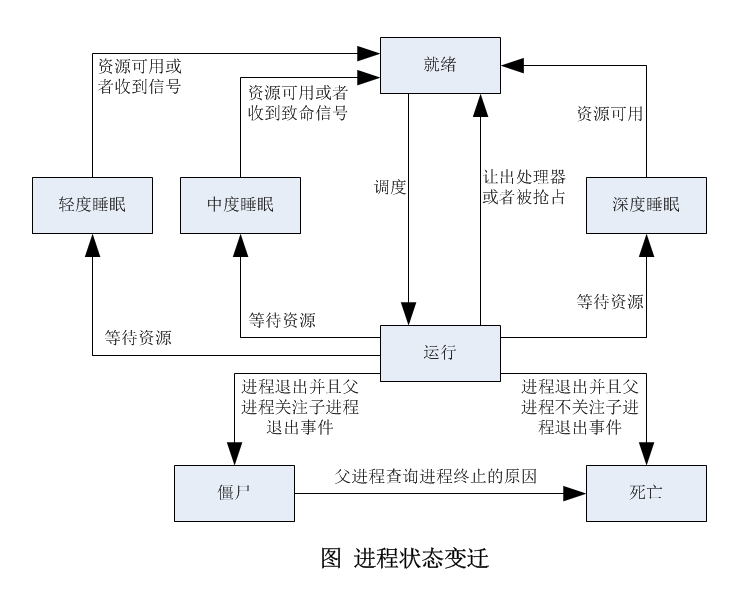

# Linux内核进程管理(四)——进程状态

进程主要有以下状态：

1.   就绪状态: 进程描述符的字段`state`是`TASK_RUNNING`（Linux内核没有严格区分就绪状态和运行状态），正在运行队列中等待调度器调度。
2.   运行状态: 进程描述符的字段`state`是`TASK_RUNNING`，被调度器选中，正在处理器上运行。
3.   轻度睡眠: 也称为可打断的睡眠状态，进程描述符的字段`state`是`TASK_INTERRUPTIBLE`，可以被信号打断。
4.   中度睡眠: 进程描述符的字段`state`是`TASK_KILLABLE`，只能被致命的信号打断。
5.   深度睡眠: 也称为不可打断的睡眠状态，进程描述符的字段`state`是`TASK_UNINTERRUPTIBLE`，不能被信号打断。
6.   僵尸状态: 进程描述符的字段`state`是`TASK_DEAD`，字段`exit_state`是`EXIT_ZOMBIE`。如果父进程关注子进程退出事件，那么子进程在退出时发送`SIGCHLD`信号通知父进程，变成僵尸进程，父进程在查询子进程的终止原因以后回收子进程的进程描述符。
7.   死亡状态: 进程描述符的字段`state`是`TASK_DEAD`，字段`exit_state`是`EXIT_DEAD`。如果父进程不关注子进程退出事件，那么子进程退出时自动消亡。

进程状态变迁如下图所示：

