# 克隆盘制作

## 1. 克隆盘是什么

- 克隆盘，让我们具备了一次性快速部署特殊apk或大量apk(几百个)到手机或zebu中的能力，提高了软件部署效率，节约了大量时间，对于FDE盘可以通过dm节点导入，对于FBE或者normal盘，直接Reasechdownload、fastboot或克隆盘工具即可完成部署;
- 将需要安装的apk安装到一台手机中，使用克隆盘工具将磁盘克隆到PC上，形成具备繁殖能力的母盘，随后即可直接部署到其他手机上享受母盘的成果; 比如有些apk需要通过网络安装一些插件包，数据包很大，或者网速很慢，或者国内无法下载需要代下等，这些问题都可以通过克隆盘工具解决，只需要下载一次，克隆出母盘分发给相关人员，相关人员直接克隆母盘到自己手机中，绕过上面繁琐甚至时间、资源浪费的重复操作，通过克隆盘技术，可以达到：母盘Ready，部署无忧。

## 2. 克隆盘常用命令介绍

- 命令所在路径：platform/vendor/sprd/proprietories-source/tiny-formatter/tool 
- 通常情况下为方便使用，我们一般将tiny-formatter目录拷贝到本地，并在.bashrc中添加其路径： export PATH=/home/haibin.xu/Documents/git-dir/tiny-formatter/tool:$PATH 后，再执行： source ~/.bashrc
- 克隆盘经常使用的命令在tiny-formatter/tool目录下 
- 准备：手机连接数据线到主机，adb root， adb remount
  1.  clone-userdata2pc.img userdata_from_phone.img 100; 从手机中克隆100M的userdata到当前目录， 输出为userdata_from_phone.img。如果第二个参数100不写，默认克隆整个userdata到本地 
  2.  clone-userdata2phone.img userdata_to_phone.img; 克隆本地userdata_to_phone.img到手机的userdata分区
  3.  mboot-resize-ext4-image-size userdata_from_phone.img 1024; 自定义size命令。把userdata_from_phone.img的大小提高到1024M 
  4.  clone-img2pc /dev/mmcblk0p36 userdata_from_phone.img 100; 克隆userdata所在分区mmcblk0p36到本地，命名为 userdata_from_phone.img，大小100M。该命令是对命令1)的升级，既能在mboot模式下的克隆也适应Android，命令1只能在Android系统起来时才能使用 
  5.  clone-img2phone userdata_to_phone.img /dev/mmcblk0p36; 克隆userdata_to_phone.img 到手机mmcblk0p36分区, 该命令是对命令2)的升级，既能在mboot模式下的克隆也适应Android，命令2)只能在Android系统起来时才能使用 

## 3. 克隆盘制作流程

- 我们以Sharkl5Pro平台的AndroidQ（ums512_1h10_Natv-userdebug-native）版本为例，制作安装有Antutu V7应用, 文件系统格式为ext4的userdata克隆盘。

1. 解决手机的一些权限问题，使用原始pac包对手机进行oem-unlock（很重要！否则会有很多权限问题无法解决）

2. 修改userdata分区文件系统格式为ext4格式，修改方法如下图所示：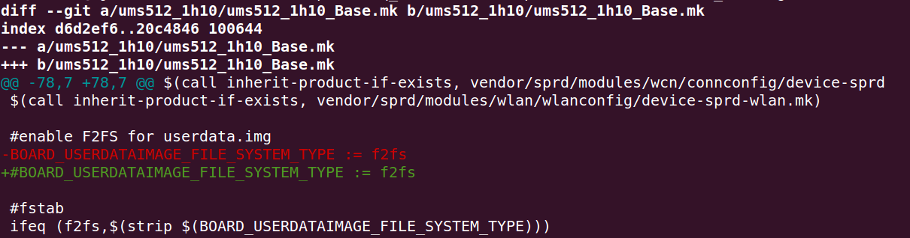

   Sharkl5Pro userdata默认文件系统格式为 f2fs 格式，将上面 BOARD_USERDATAIMAGE_FILE_SYSTEM_TYPE := f2fs 注销后，userdata 文件系统格式切换为 ext4 格式。

3. 取消 userdata 加密选项，修改方法如下图所示：  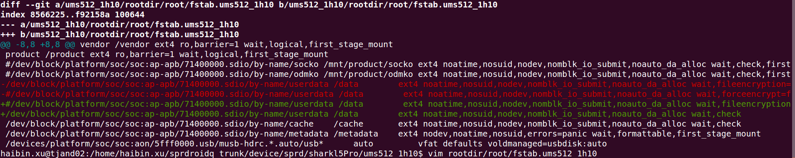

   取消加密选项，也可以在手机正常启动后，动态修改 vendor/etc/fstab.ums512_1h10 后保存退出即可。

4. 编译 ums512_1h10_Natv-userdebug-tiny@haps[zebu],mboot 版本，在编译之前，请确保 tiny-formatter 下 haps.mk、zebu.mk 中已经将 resize2fs、fsck.f2fs 两个模块添加到变量 modules_removed 中，裁剪这两个模块（分别针对 f2fs 和 ext4 两种格式），可以使 userdata 的大小根据我们的需求来设置。

5. 编译完 tiny-mboot 版本后，将 bin、img 文件烧录手机，确保编译的版本可以使手机正常启动，tiny-mboot版本的启动需要借助串口小板，启动方法参考《mboot》。进入console或是shell中，查看如下信息： 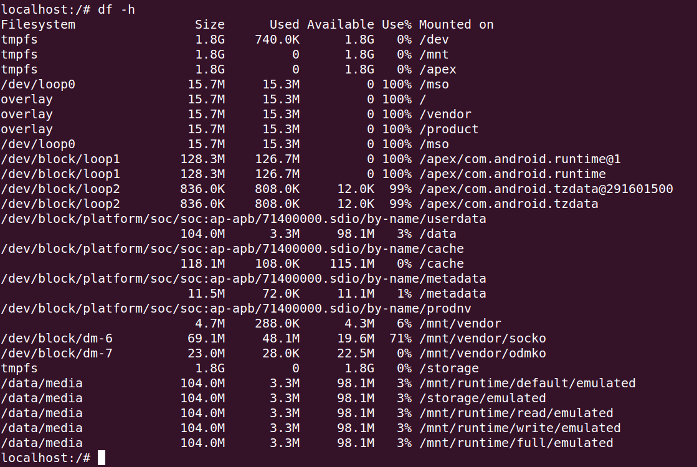

   获取 userdata 挂载节点： /dev/block/platform/soc/soc:ap-apb/71400000.sdio/by-name/userdata， 供后续流程使用

6. 在 sprdroidq_trunk 工程下，先lunch一个combo(ums512_1h10_Natv-userdebug-native)，此处我们制作一个 640M ext4 格式的 userdata，命令如下：         make_ext4fs -l 640M -a data userdata.ext4img，生成一个 640M ext4 格式的 userdata.ext4img，如下图所示：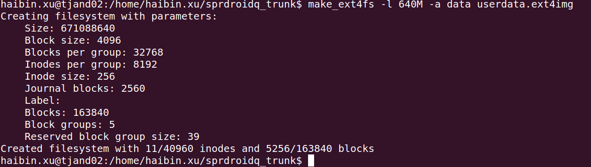

7. 通过 ResearchDownload 烧写 userdata.ext4img(userdata分区)进手机，进入console，我们可以看到手机如下信息：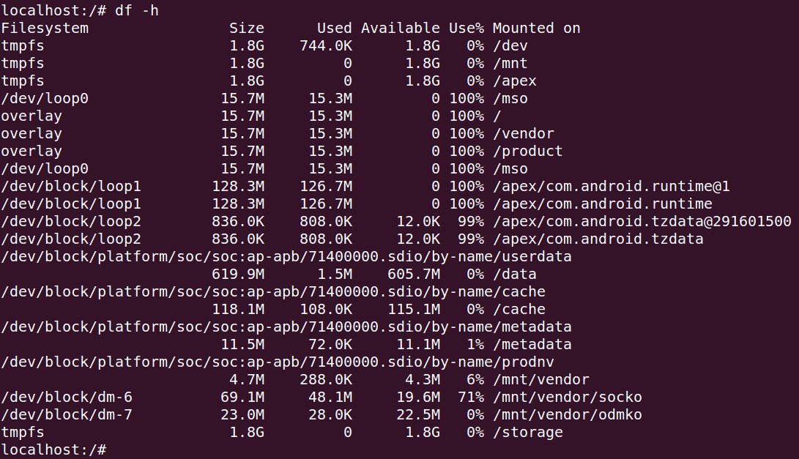

   可以看到，data 分区 Size 大小为 619.9M，说明替换成功。

8. 安装 Antutu 相关应用，安装命令如下：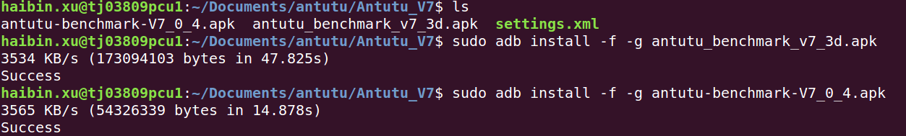

   加上 -f -g 可以在后续启动应用时免去相关授权操作。

9. 推送 settings.xml 文件，推送手机路径如下：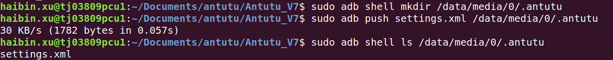

   通过修改 settings.xml 中相关选项，可以控制 Antutu 后续测试运行哪些 case。

10.  安装第三方 app 默认安装在手机的 data 分区下，查看此时 data 分区：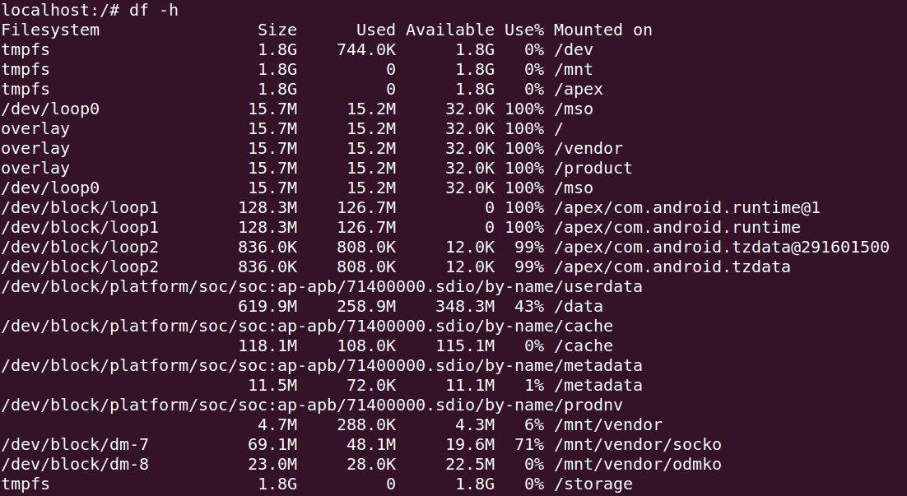

    可以看到 data 分区已使用的存储已从之前的 1.5M 增加到 258.9M

11.  克隆 data 分区到本地，相关命令如下：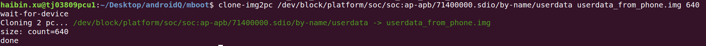

    注意： 有些情况下，执行此命令时通常会出现如下情况，一直卡在这里，没有进行拷贝操作，这种情况下，可以打开 clone-img2pc 脚本（tiny-formatter/tool），在脚本所有的adb前面增加sudo ，即可解决该问题。：                        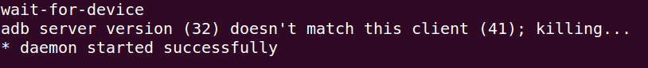

12.  初步检查克隆盘 userdata_from_phone.img 有效性

    查看 userdata_from_phone.img 类型：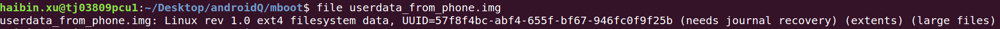

    mount userdata_from_phone.img 到本地，查看内部文件：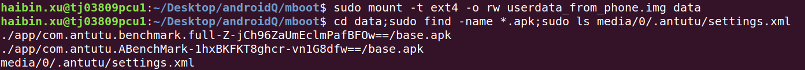

    通过以上两项确认，基本上该克隆盘就可以认为是有效的，如果文件类型不一致或者无法mount到本地，基本上可以确认该克隆盘制作失败。

13.  验证克隆盘 userdata_from_phone.img

    将克隆盘 userdata_from_phone.img 替换 userdata.img 烧录到手机中，手机正常启动，且 Antutu 相关app显示在手机桌面上，如下图所示，则表示该克隆盘制作成功。：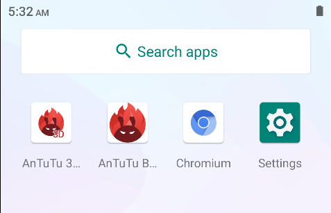

## 4. 克隆盘母盘制作

- 克隆盘母盘，其实是将克隆盘内未被占用的空间全部给裁去了。
- 获取已制作好的克隆盘，执行如下操作即可获取到克隆盘母盘： 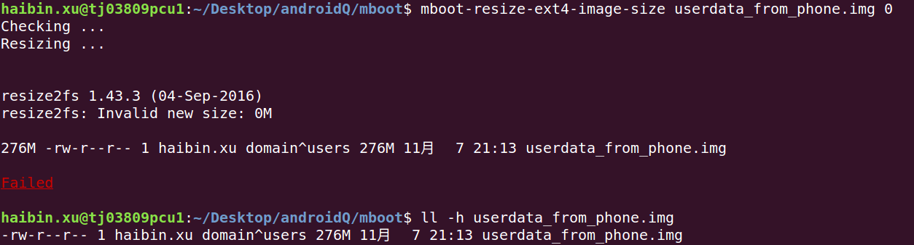

- 之所以制作克隆盘母盘，是因为我们可以以克隆盘母盘为基础，繁殖出任何我们想要的size（当然，必须要大于母盘size）的克隆盘。

  

## 5. 克隆盘制作注意事项

### 5.1 空盘的size大小设置

- 克隆盘制作流程第 6 步，制作空盘时，切勿设置的size过大，刚开始我们设置的 2G、1G的空盘，到第 12 步检查时，高概率检查失败，要么是 file 文件格式不正确，要么是 mount 失败。

  file 文件格式只显示data：                  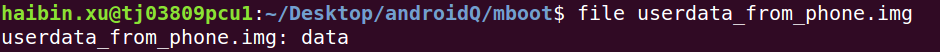                                       

  file 文件格式显示内容包含 （errors）：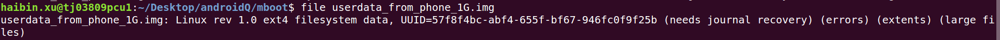      

  file 文件格式正常，mount失败：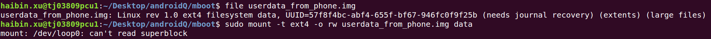

  file 文件格式正常，mount正常，但是查找文件有问题：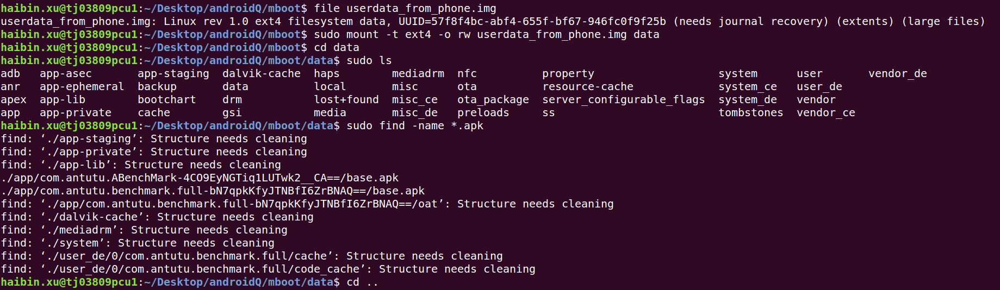

- 同样，克隆盘制作流程第 6 步，制作空盘时，也勿设置的size过小，如我们设置空盘为 512M 时，在安装 Antutu app时就会发生安装失败的问题，如下图所示：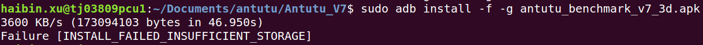

- 所以，具体空盘的size设置多少，需要我们多次进行尝试，一个是参考安装的应用需要占据多少data分区的大小，另一个是参考我们克隆到本地的克隆盘检查是否有问题，如果我们设置的size，一直无法通过检查，可考虑适当减小size大小。

### 5.2 获取指定size的克隆盘

- 如果，我们想要制作一个512M ext4 格式的克隆盘，但是如果按流程来做的话，我们无法成功安装 App，但是我们又看到，成功安装 Antutu App后，只是占用了 data 分区 258.9M，所以说，我们如果将 data 分区设置为 512M，理论上应该也是可以的，这种情况下，我们就需要间接地通过母盘扩展来的方法来制作我们想要的size的克隆盘。如下图所示：!

- 切勿将母盘作为克隆盘来使用，这种情况下，手机一般是无法正常开机的，母盘的唯一用处便是通过扩展来制作预定size大小的克隆盘。

  

### 5.3 克隆盘的使用

- 如果是正常pac版本使用克隆盘，需要满足以下条件：

  1. 确定该pac版本中 userdata分区的文件格式与克隆盘文件格式一致，如果文件格式不一致，需要制作对应文件格式的克隆盘，或是修改源码更改分区的文件格式；

  2. 需要关闭resize.f2fs（针对f2fs格式）或resize2fs（针对ext4格式），目的是让系统找不到resiz2.f2fs或resize2fs命令，这样就可以使 userdata 的大小根据我们的需求来设置，我们这里直接将其重命名即可，如下图所示：               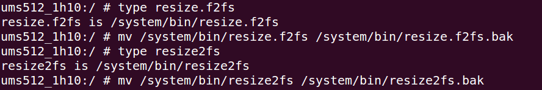

  3. 在保证前两项都已完成后，才可以烧录克隆盘，也就是正常pac版本使用克隆盘时，不能首次就直接烧录克隆盘，因为首次需要在正常启动的情况下进行上述步骤的设置，这样在下一次烧录克隆盘时，克隆盘才能正常工作。

     

## 6. 总结

- 克隆盘的制作，关键在于母盘的制作，这个过程中，我们无需过多关注空盘大小的 size 设置，只要这个 size 可以制作出正常的克隆盘即可，而对于我们想要的 size，可以待母盘制作完成后，通过母盘扩展的方法来制作我们想要的 size 的克隆盘。