# 如何使用`trace32`解析`sysdump`

## 1. `sysdump`触发方式

>   `sysdump`可以由系统发生`kernel crash、watchdog`等异常自动触发，也可以人为触发。

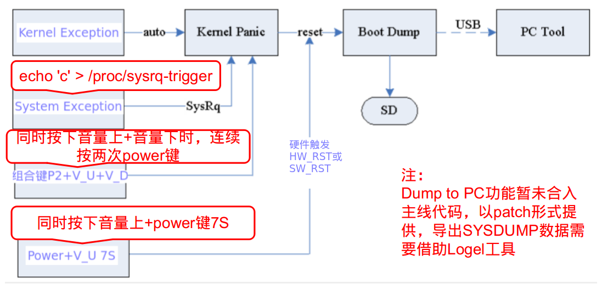

>   特别提醒：user版本触发sysdump前需要确认使能状态

1）[sysdump功能使能状态确认和修改（点击我查看详情）](http://10.0.93.103/AP-Android/wiki/SysdumpConfig)
2）特别的，在7S长按场景中，还需要确保系统的重启方式一定是SW reset 而非HW reset，在工程模式中确认 见下述图示

>   sysdump触发可以分为系统异常触发和人为触发。

其中人为触发分为：

1）命令方式（该方式为linux kernel默认自带功能）

```
echo 'c' > /proc/sysrq-trigger

```

2）组合键方式
根据不同项目手机组合键的方式可能不同，一般为同时按下音量上下键，然后连续两次按下power键

3)7S长按方式
根据不同项目手机组合键的方式可能不同，一般为同时按下音量上和power键保持7S或者只按下power键保持7S
在7S长按场景中要确保系统的重启方式一定是SW reset 而非HW reset，在工程模式中确认

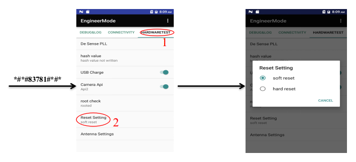

## 2. `sysdump`功能完成度和文件完整性确认

>   Sysdump功能完成度确认：

Sysdump最后完成屏幕显示内容拍照留存。 正确完成应该是屏幕显示：

```
Writing done.
Press any key (Exp power key) to continue...

```

若非该内容，如怀疑sysdump过程卡死，请提供卡死时屏幕显示内容和屏幕显示内容已经保持的时间。
注意：sysdump log文件较大，sysdump时请耐心等待完成 

>   文件完整性确认：

Sysdump文件中一定会有一个以时间命名的txt文件，其中一行内容为:

```
Mem_num is xxx

```


生成的文件中文件名都是sysdump.core.00xxx格式，例如：“Mem_num is 11” ，sysdump文件名应该是从sysdump.core.00xxx ~sysdump.core.11xxx，如果发现文件缺失，或者大小为0情况，请及时将uboot_log分区内容导出，并提供。方便debug。


## 3. `DUMP To PC`实现`patch`、导出工具及使用说明**

>   Dump To PC功能是为了适应无SD卡场景的sysdump功能，将sysdump产生的日志借助PC的工具导出到PC上。目前该功能默认实现为有SD卡时默认往SD卡保存，没有SD卡或者检查失败时，提示连接PC进行Dump To PC操作

>   目前有如下分支已经合入Dump To PC 代码，其他分支均以patch形式提供

```
sprdroid4.4_sfphone_17f_rls1， W18.31.1之后版本 
sprdroid9.0_trunk_18c， W19.23.2之后版本 
sprdroid9.0_trunk_18c_zte_cus， W19.19.1之后版本 
sprdroid9.0_trunk， W19.17.1之后版本（该分支目前有roc1和sharkl5）

```

说明：sprdroid9.0_trunk合入sysdump2.0功能后，凡使用u-boot15主线代码仓库分支，以后都支持dump2pc功能

>   DUMP To PC 功能patch

| code branch                |                                                              |
| -------------------------- | ------------------------------------------------------------ |
| sprdroid9.0_trunk          | http://10.0.93.103/AP-Android/attachment/wiki/SysdumpToPC/sprdroid9.0_trunk_18c_dump_to_pc.patch |
| sprdroid9.0_trunk_18c_rls1 | http://review.source.spreadtrum.com/gerrit/#/c/584002/       |
| sprdroid9.0_trunk_18c_rls1 | http://review.source.spreadtrum.com/gerrit/#/c/584002/       |
| sprdroid8.1_trunk          | http://10.0.93.103/AP-Android/attachment/wiki/SysdumpToPC/sprdroid8.1_trunk_dump_to_pc.patch |
| sprdroid8.1_trunk_18a      | http://10.0.93.103/AP-Android/attachment/wiki/SysdumpToPC/sprdroid8.1_trunk_18a_dump_to_pc.patch |
| sprdroid8.1_trunk_18a_rls2 | http://10.0.93.103/AP-Android/attachment/wiki/SysdumpToPC/sprdroid8.1_trunk_18a_rls2_dump_to_pc.patch |
| sprdroid7.0_trunk_k44_17b  | http://10.0.93.103/AP-Android/attachment/wiki/SysdumpToPC/dump_to_pc.patch |
| sprdroid7.0_trunk_k44_17e  | http://review.source.spreadtrum.com/gerrit/#/c/613759/       |
| sprdroid6.0_trunk_16b_rls2 | http://10.0.93.103/AP-Android/attachment/wiki/SysdumpToPC/sprdroid6.0_trunk_16b_rls2-dump-to-pc.patch |
| sprdroid4.4_sfphone        | http://10.0.93.103/AP-Android/attachment/wiki/SysdumpToPC/sprdroid4.4_sfphone-dump-to-pc.patch |
| sprdroid4.4_kaios2.5       | http://10.0.93.103/AP-Android/attachment/wiki/SysdumpToPC/dump2pc.patch |

patch Usage

1) 进入代码根目录下的对应uboot目录（u-boot15或者uboot64），将文件patch复制到当前目录。执行命令： `git apply *.patch`

2）重新编译uboot替换，代码修改即可生效

>   Dump to PC Function Usage

1）手机设备显示
手机发生sysdump时（可以使用命令echo 'c' >/proc/sysrq-trigger手动触发），在屏幕打印"Reset  mode:"之后，会有"Dump to PC start.."和"check usb cable's status!!"字符打印

2)PC工具操作
PC端启动Logel工具(无需安装，解压直接使用/Bin/ArmLogel.exe)，USB数据线连接PC和设备. 如果之前已经Dump过信息，应先关闭"Assert InFormation?"窗口，再连接处于Dump状态的手机。Logel工具配置如图,基本无需作任何配置：

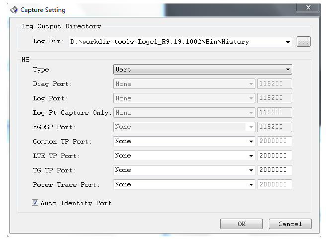

[点击我下载PC工具logel](http://10.0.93.103/AP-Android/attachment/wiki/Sysdump/Logel_R8.18.1702_P2.rar)
tool owner:hongliang.xin，最新版本下载路径：shnas01\PublicShared?\ShareData?\Debug_Tools\LatestVersion?\Logel  

注意：新的logel工具（Logel_R9.19.1002_P1 之后）默认将自动识别AP Dump 的端口关闭了，因为这个端口与下载端口/校准端口名字一样，当同一台PC上同时使用`Pandora/Simba/ResearchDownload`时就会互相强制这个端口，所以工具默认关闭了自动识别的功能。可以通过点击工具的菜单Option->Tool Configure， 将Auto Identity AP Dump Pt勾上即可，如下图所示：

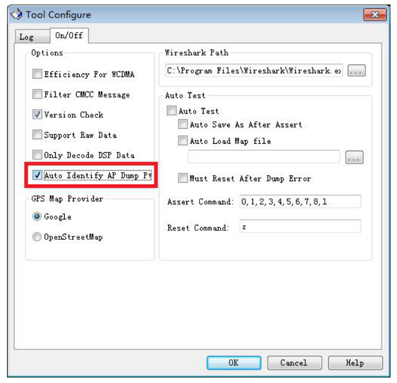

3）开始dump信息
Logel工具和手机握手成功，PC端工具会自动弹出数据框（注：有时需要手动点击"capture"按钮，自动弹出是因为之前使用过相同端口导出过），并在其中显示dump数据信息，同时手机屏幕也会打印dump信息。 PC端显示界面如图：

 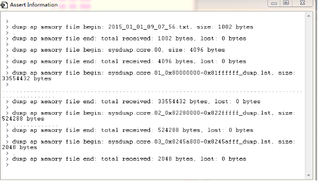

4）PC和手机完成确认
dump 完成后手机提示"Press any key(Exp power key) to contiue..."，PC端也会显示"Total sysdump finished!"字符串。PC端显示界面如图：
 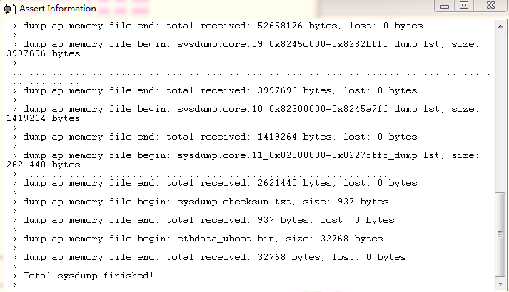

5)生成的dump文件检查
dump信息文件存储在PC端工具的解压根目录/Bin/History/下以当前时间命名的文件夹XXX_armlog的ap_sys_dump文件夹中， PC端显示界面如图：
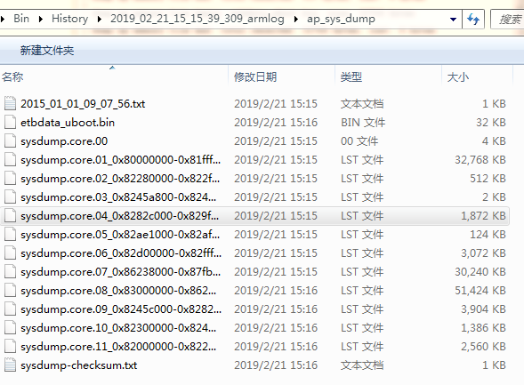

## 4. `sysdump`文件分析

>   SYSDUMP 分析工具及使用方法

sysdump文件需要借助crash tool进行分析，工具获取路径为vendor/sprd/tools/crash(此路径仅为参考路径，或许会有些许变动)
crash_arm: 用于32bit ARM 平台

-   [crash_arm](http://10.0.93.103/AP-Android/attachment/wiki/Sysdump/crash_arm)
-   [alios平台crash工具crash_arm_alios](http://10.0.93.103/AP-Android/attachment/wiki/SysdumpAnalyze/crash_arm_alios)
-   [kaios平台crash工具下载](http://10.0.1.79:8081/xref/sprdroid4.4_kaios2.5/vendor/sprd/tools/crash/)

crash_arm64:用于64bit ARM 平台

-   [crash_arm64](http://10.0.93.103/AP-Android/attachment/wiki/Sysdump/crash_arm64)


该路径下有命令使用说明文件`vendor/sprd/tools/crash/Usage`

```
crash_arm -m phys_base=0x80000000 vmlinux vmcore 
crash_arm64 -m phys_offset=0x80000000 vmlinux vmcore 
 
```

如上命令，分析sysdump文件时，需要两部分输入文件
1）sysdump文件
发生sysdump时，手机界面会有相应的状态提示，可以按照提示进行操作

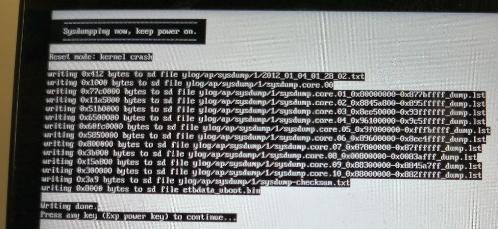

sysdump完成后，使用log导出工具导出日志（sysdump log一般存放在sd下的ylog/ap/SYSDUMP下，其中文件夹1是最新的）。可以获取如下文件

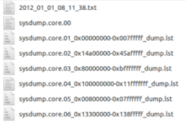

其中`*.txt`文件是SYSDUMP信息文件，记录了SYSDUMP文件的个数，重启原因等，`sysdump.core*`：SYSDUMP文件需要合成`cat sysdump.core.*  >  vmcore`， 另外命令中使用的符号表文件在如下路径： `out/target/product/xxxx/obj/KERNEL/vmlinux`

## 5. `trace32`解析`sysdump`文件

>   获取mmu寄存器

```
1. 先获取到per_cpu mmu reg
crash_arm64> p -x sprd_debug_mmu_reg
PER-CPU DATA TYPE:
  struct sprd_debug_mmu_reg_t sprd_debug_mmu_reg;
PER-CPU ADDRESSES:
  [0]: ffffffc07d44ecf0
  [1]: ffffffc07d464cf0
  [2]: ffffffc07d47acf0
  [3]: ffffffc07d490cf0
  [4]: ffffffc07d4a6cf0
  [5]: ffffffc07d4bccf0
  [6]: ffffffc07d4d2cf0
  [7]: ffffffc07d4e8cf0

2. 当前CPU id 为3，就可以获取到cpu id为3 的sprd_debug_mmu_reg_t结构体变量的值：
crash_arm64> struct sprd_debug_mmu_reg_t -x ffffffc07d490cf0
struct sprd_debug_mmu_reg_t {
  sctlr_el1 = 0x3455d91d,
  ttbr0_el1 = 0x9e48e000,
  ttbr1_el1 = 0x4604000081581000,
  tcr_el1 = 0xb2b5593519,
  mair_el1 = 0xbbff440c0400,
  amair_el1 = 0x0,
  contextidr_el1 = 0x0
}

```

也可以使用下面的命令直接获得：

```
crash_arm64> px sprd_debug_mmu_reg:3

```

>   获取CPSR寄存器，借助crash_arm64工具，执行命令`px sprd_debug_core_reg:3`，其中`pstate`就是CPSR寄存器的值，如下：

```c
crash_arm64> px sprd_debug_core_reg:3
per_cpu(sprd_debug_core_reg, 3) = $1 = {
  x0 = 0xffffff8008cd61a6, 
  x1 = 0xffffff8008cd6000, 
  x2 = 0xffffffffffffffc8, 
  x3 = 0x0, 
  x4 = 0x0, 
  x5 = 0x40, 
  x6 = 0xffffffc07d490bdc, 
  x7 = 0xffffff800923c618, 
  x8 = 0xffffffc07d490be0, 
  x9 = 0xffffff8008edcbe0, 
  x10 = 0xffffff80091fef10, 
  x11 = 0xffffff8008edccf0, 
  x12 = 0xffffff8009e3b5d0, 
  x13 = 0xffffff80084c0ff4, 
  x14 = 0x600001c5, 
  x15 = 0x4, 
  x16 = 0xffffff8008a0771c, 
  x17 = 0x3c, 
  x18 = 0xd0, 
  x19 = 0xffffff800936f955, 
  x20 = 0xffffff800929ea18, 
  x21 = 0x1c0, 
  x22 = 0xffffff8008ed4018, 
  x23 = 0x0, 
  x24 = 0xffffff800942a000, 
  x25 = 0xffffff800929e550, 
  x26 = 0xffffff800923c618, 
  x27 = 0x2, 
  x28 = 0x0, 
  x29 = 0xffffff8009e3b710, 
  x30 = 0xffffff80084c1014, 
  sp = 0xffffff8009e3b5d0, 
  pc = 0xffffff80084c10fc, 
  pstate = 0x200001c5
}

```


>   trace32配置mmu寄存器

注：从trace32的帮助文档中可以查询到设置mmu寄存器的命令，如下，但是在trace32命令窗口直接键入该命令或者在cmm脚本中写该命令都会显示无效。

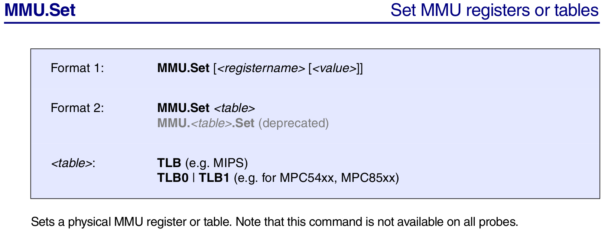

退而求其次，点击`ARM64 Simulator T32 -> CPU -> Peripherals`，如下：

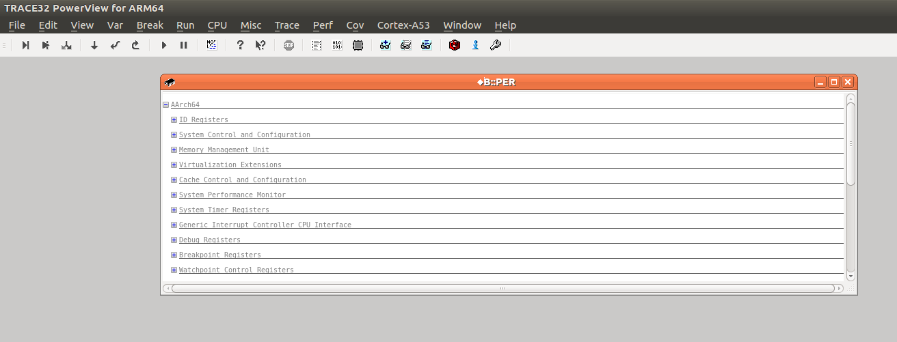

点击`Memory Management Unit`，如下：

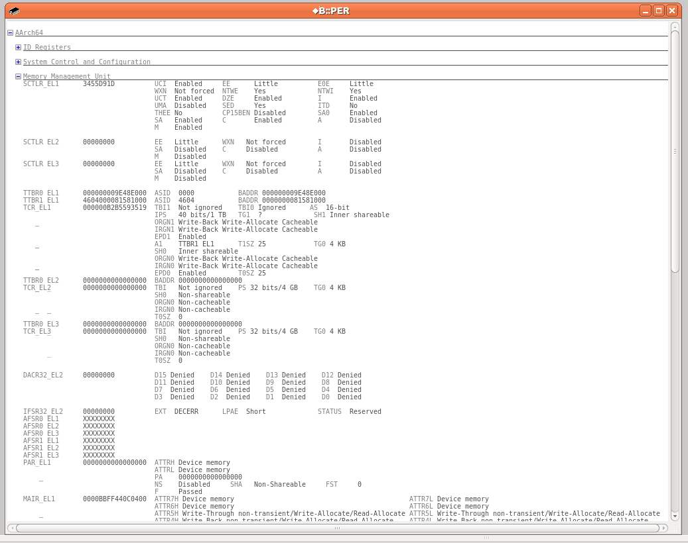

右键点击寄存器对应的地址，在弹出框中，点击`Set...`，然后在Trace32的命令输入窗口中会显示相应设置命令，如下：

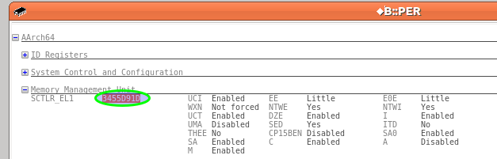

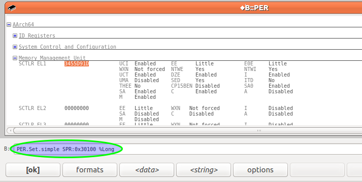

```
sctlr_el1, ttbr0_el1, ttbr1_el1, tcr_el1, mair_el1, amair_el1 各自对应的设置命令如下：  
PER.Set.simple SPR:0x30100 %Long  0x3455D91D
PER.Set.simple SPR:0x30200 %Quad  0x9e48e000
PER.Set.simple SPR:0x30201 %Quad  0x4604000081581000
PER.Set.simple SPR:0x30202 %Quad  0xb2b5593519
PER.Set.simple SPR:0x30A20 %Quad  0xbbff440c0400
PER.Set.simple SPR:0x30A30 %Quad  0x0

```

>   `ARM64 Simulator T32`运行加载sysdump日志的脚本，脚本范本如下：

```
system.reset
sys.cpu CORTEXA55
wclear
system.up

d.load.elf /home/haibin.xu/Documents/trace32/sysdump/systdump/vmcore

PER.Set.simple SPR:0x30100 %Long  0x3455D91D
PER.Set.simple SPR:0x30200 %Quad  0x9e48e000
PER.Set.simple SPR:0x30201 %Quad  0x4604000081581000
PER.Set.simple SPR:0x30202 %Quad  0xb2b5593519
PER.Set.simple SPR:0x30A20 %Quad  0xbbff440c0400
PER.Set.simple SPR:0x30A30 %Quad  0x0

Register.Set CPSR 0x200001c5

MMU.Delete
MMU.SCAN PT 0xFFFFFF8000000000--0xFFFFFFFFFFFFFFFF
mmu.on
mmu.pt.list 0xffffff8000000000

data.load.elf /home/haibin.xu/Documents/trace32/sysdump/vmlinux /nocode /NoClear

v.v %s linux_banner

```

执行结果如下，`linux_banner`已正常显示出Kernel版本信息：

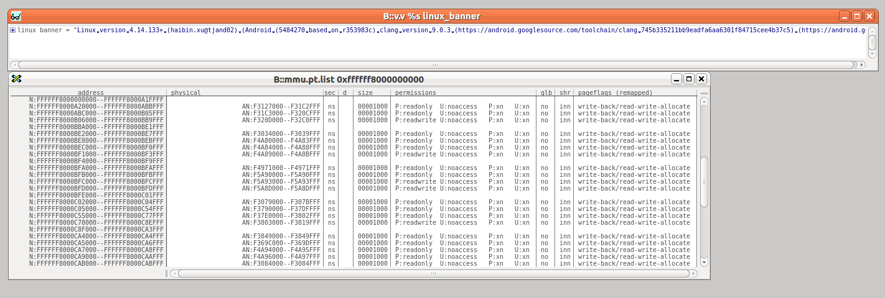