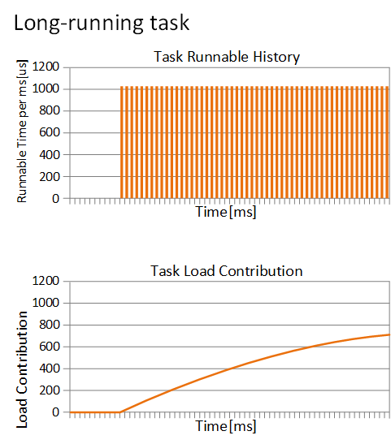
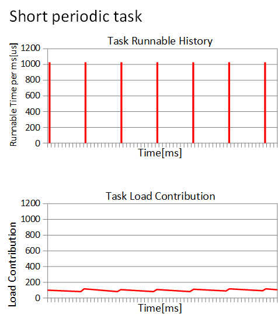

## CFS调度器——PELT(per entity load tracking)

作者：[smcdef](http://www.wowotech.net/author/531) 发布于：2018-12-2 15:40  		分类：[进程管理](http://www.wowotech.net/sort/process_management)  	

## 1. 为什么需要PELT？

​	为了让调度器更加的聪明，我们总是希望系统满足最大吞吐量同时又最大限度的降低功耗。虽然可能有些矛盾，但是现实总是这样。PELT算法是Linux  3.8合入的，那么在此之前，我们存在什么问题才引入PELT算法呢？在Linux  3.8之前，CFS以每个运行队列（runqueue，简称rq）为基础跟踪负载。但是这种方法，我们无法确定当前负载的来源。同时，即使工作负载相对稳定的情况下，在rq级别跟踪负载，其值也会产生很大变化。为了解决以上的问题，PELT算法会跟踪每个调度实体（per-scheduling entity）的负载情况。

>   注：代码分析基于Linux 4.18.0。 


## 2. 如何进行PEL

-   具体原理的东西可以参考这篇文章[《per-entity load tracking》](http://www.wowotech.net/process_management/PELT.html)。我就无耻的从这篇文章中摘录一段话吧。为了做到Per-entity的负载跟踪，时间（物理时间，不是虚拟时间）被分成了1024us的序列，在每一个1024us的周期中，一个entity对系统负载的贡献可以根据该实体处于runnable状态（正在CPU上运行或者等待cpu调度运行）的时间进行计算。如果在该周期内，runnable的时间是x，那么对系统负载的贡献就是（x/1024）。当然，一个实体在一个计算周期内的负载可能会超过1024us，这是因为我们会累积在过去周期中的负载，当然，对于过去的负载我们在计算的时候需要乘一个衰减因子。如果我们让Li表示在周期pi中该调度实体的对系统负载贡献，那么一个调度实体对系统负荷的总贡献可以表示为：

```
L = L0 + L1 * y + L2 * y2 + L3 * y3 + ... + Ln * yn

```

其中，y^32 = 0.5, y = 0.97857206 

-   初次看到以上公式，不知道你是否在想这都是什么玩意！举个例子，如何计算一个se的负载贡献。如果有一个task，从第一次加入rq后开始一直运行4096us后一直睡眠，那么在1023us、2047us、3071us、4095us、5119us、6143us、7167us和8191us时间的每一个时刻负载贡献分别是多少呢？

```
1023us: L0 = 1023
2047us: L1 = 1023 + 1024 * y          = 1023 + (L0 + 1) * y = 2025
3071us: L2 = 1023 + 1024 * y + 1024 * y2  = 1023 + (L1 + 1) * y = 3005
4095us: L3 = 1023 + 1024 * y + 1024 * y2 + 1024 * y3 = 1023 + (L2 + 1) * y = 3963
5119us: L4 = 0    + 1024 * y + 1024 * y2 + 1024 * y3 + 1024 * y4 = 0 + (L3 + 1) * y                                                                  = 3877
6143us: L5 = 0    +    0     + 1024 * y2 + 1024 * y3 + 1024 * y4 + 1024 * y5 = 0 +                                                                  L4 * y = 3792
7167us: L6 = 0    + L5 * y = L4 * y2 = 3709
8191us: L7 = 0    + L6 * y = L5 * y2 = L4 * y3 = 3627 

```

-   经过以上的举例，我们不难发现一个规律，计算当前时间的负载只需要上个周期负载贡献总和乘以衰减系数y，并加上当前时间点的负载即可。

-   从上面的计算公式我们也可以看出，经常需要计算`val*y^n`的值，因此内核提供decay_load()函数用于计算第n个周期的衰减值。为了避免浮点数运算，采用移位和乘法运算提高计算速度。`decay_load(val, n) = val*y^n*232>>32`。我们将`y^n*2^32`的值提前计算出来保存在数组runnable_avg_yN_inv中。	

```
runnable_avg_yN_inv[n] = y^n*232, n > 0 && n < 32

```

-   `runnable_avg_yN_inv`的计算可以参考`/Documentation/scheduler/sched-pelt.c`文件`calc_runnable_avg_yN_inv()`函数。由于`y^32=0.5`，因此我们只需要计算`y*2^32~y^31*2^32`的值保存到数组中即可。当n大于31的时候，为了计算`y^n*2^32`我们可以借助`y^32=0.5`公式间接计算。例如`y^33*2^32=y^32*y*2^32=0.5*y*2^32=0.5*runnable_avg_yN_inv[1]。calc_runnable_avg_yN_inv()`函数简单归纳就是：`runnable_avg_yN_inv[i] = ((1UL << 32) - 1) * pow(0.97857206, i),i>=0 && i<32`。pow(x, y)是求x^y的值。计算得到runnable_avg_yN_inv数组的值如下：

```
  static const u32 runnable_avg_yN_inv[] = {	
  		0xffffffff, 0xfa83b2da, 0xf5257d14, 0xefe4b99a, 0xeac0c6e6, 0xe5b906e6,			0xe0ccdeeb, 0xdbfbb796, 0xd744fcc9, 0xd2a81d91, 0xce248c14, 0xc9b9bd85,			0xc5672a10, 0xc12c4cc9, 0xbd08a39e, 0xb8fbaf46, 0xb504f333, 0xb123f581,			0xad583ee9, 0xa9a15ab4, 0xa5fed6a9, 0xa2704302, 0x9ef5325f, 0x9b8d39b9,			0x9837f050, 0x94f4efa8, 0x91c3d373, 0x8ea4398a, 0x8b95c1e3, 0x88980e80,			0x85aac367, 0x82cd8698,}; 
  		
```

-   根据runnable_avg_yN_inv数组的值，我们就方便实现decay_load()函数。

```
/*
* Approximate:
*   val * y^n,    where y^32 ~= 0.5 (~1 scheduling period)
*/
static u64 decay_load(u64 val, u64 n)
{
	unsigned int local_n;

	if (unlikely(n > LOAD_AVG_PERIOD * 63))                              /* 1 */
		return 0;

    /* after bounds checking we can collapse to 32-bit */
    local_n = n;

    /*
    * As y^PERIOD = 1/2, we can combine
    *    y^n = 1/2^(n/PERIOD) * y^(n%PERIOD)
    * With a look-up table which covers y^n (n<PERIOD)
    *
    * To achieve constant time decay_load.
    */
    if (unlikely(local_n >= LOAD_AVG_PERIOD)) {                           /* 2 */
        val >>= local_n / LOAD_AVG_PERIOD;
        local_n %= LOAD_AVG_PERIOD;
	}

    val = mul_u64_u32_shr(val, runnable_avg_yN_inv[local_n], 32);         /* 2 */
    return val;
}

```

>   LOAD_AVG_PERIOD的值为32，我们认为当时间经过2016个周期后，衰减后的值为0。即val*y^n=0, n > 2016。 
>
>   当n大于等于32的时候，就需要根据y^32=0.5条件计算yn的值。y^n*2^32 = (1/2)^(n/32) * y^(n%32)*2^32=(1/2)^(n/32) * runnable_avg_yN_inv[n%32]。 	

## 	3. 如何计算当前负载贡献

-   经过上面举例，我们可以知道计算当前负载贡献并不需要记录所有历史负载贡献。我们只需要知道上一刻负载贡献就可以计算当前负载贡献，这大大降低了代码实现复杂度。我们继续上面举例问题的思考，我们依然假设一个task开始从0时刻运行，那么1022us后的负载贡献自然就是1022。当task经过10us之后，此时（现在时刻是1032us）的负载贡献又是多少呢？很简单，10us中的2us和之前的1022us可以凑成一个周期1024us。这个1024us需要进行一次衰减，即现在的负载贡献是：(1024 - 1022 + 1022)y + 10 - (1024 - 1022) = 1022y + 2y + 8 =  1010。1022y可以理解成由于经历了一个周期，因此上一时刻的负载需要衰减一次，因此1022需要乘以衰减系数y，2y可以理解成，2us属于上一个负载计算时距离一个周期1024us的差值，由于2是上一个周期的时间，因此也需要衰减一次，8是当前周期时间，不需要衰减。又经过了2124us，此时（现在时刻是3156us）负载贡献又是多少呢？即：(1024 - 8 + 1010)y^2 + 1024y + 2124 - 1024 - (1024 - 8) = 1010y^2 + 1016y^2 + 1024y + 84 =  3024。2124us可以分解成3部分：1016us补齐上一时刻不足1024us部分，凑成一个周期；1024us一个整周期；当前时刻不足一个周期的剩余84us部分。相当于我们经过了2个周期，因此针对上一次的负载贡献需要衰减2次，也就是1010y^2部分，1016us是补齐上一次不足一个周期的部分，因此也需要衰减2次，所以公式中还有1016y^2 部分。1024us部分相当于距离当前时刻是一个周期，所以需要衰减1次，最后84部分是当前剩余时间，不需要衰减。

-   针对以上事例，我们可以得到一个更通用情况下的计算公式。假设上一时刻负载贡献是u，经历d时间后的负载贡献如何计算呢？根据上面的例子，我们可以把时间d分成3和部分：d1是离当前时间最远（不完整的）period 的剩余部分，d2 是完整period时间，而d3是（不完整的）当前 period 的剩余部分。假设时间d是经过p个周期（d=d1+d2+d3, p=1+d2/1024）。d1，d2，d3 的示意图如下：

```
          d1          d2           d3
          ^           ^            ^
          |           |            |
        |<->|<----------------->|<--->|
    |---x---|------| ... |------|-----x (now)
              
                               p-1
     u' = (u + d1) y^p + 1024 \Sum y^n + d3 y^0
                               n=1
                                 p-1
        = u y^p + d1 y^p + 1024 \Sum y^n + d3 y^0
                                 n=1

```

-   上面的例子现在就可以套用上面的公式计算。例如，上一次的负载贡献u=1010，经过时间d=2124us，可以分解成3部分，d1=1016us，d2=1024，d3=84。经历的周期p=2。所以当前时刻负载贡献u'=1010y^2 + 1016y^2 + 1024y + 84，与上面计算结果一致。

## 4. 如何记录负载信息

​	Linux中使用`struct sched_avg`结构体记录调度实体se或者就绪队列cfs rq负载信息。每个调度实体se以及cfs就绪队列结构体中都包含一个`struct sched_avg`结构体用于记录负载信息。`struct sched_avg`定义如下。

```
  struct sched_avg {	
  		u64						last_update_time;	
  		u64						load_sum;	
  		u64						runnable_load_sum;	
  		u32						util_sum;	
  		u32						period_contrib;	
  		unsigned long			load_avg;	
  		unsigned long			runnable_load_avg;	
  		unsigned long			util_avg;}; 
  		
```

>   last_update_time：上一次负载更新时间。用于计算时间间隔。 	
>
>   load_sum：基于可运行（runnable）时间的负载贡献总和。runnable时间包含两部分：一是在rq中等待cpu调度运行的时间，二是正在cpu上运行的时间。 	
>
>   util_sum：基于正在运行（running）时间的负载贡献总和。running时间是指调度实体se正在cpu上执行时间。 
>
>   load_avg：基于可运行（runnable）时间的平均负载贡献。 	
>
>   util_avg：基于正在运行（running）时间的平均负载贡献。 	

-   一个调度实体se可能属于task，也有可能属于group（Linux支持组调度，需要配置CONFIG_FAIR_GROUP_SCHED）。调度实体se的初始化针对task se和group se也就有所区别。调度实体使用`struct sched_entity`描述如下。

```
  struct sched_entity {	
  		struct load_weight		load;	
  		unsigned long			runnable_weight;
  #ifdef CONFIG_SMP	
  		struct sched_avg		avg;
  #endif
  };
  
```

-   调度实体se初始化函数是init_entity_runnable_average()，代码如下。

```
void init_entity_runnable_average(struct sched_entity *se)
{	
	struct sched_avg *sa = &se->avg; 
	
	memset(sa, 0, sizeof(*sa)); 
	
	/*	 
	 * Tasks are intialized with full load to be seen as heavy tasks until	 
	 * they get a chance to stabilize to their real load level.	 
	 * Group entities are intialized with zero load to reflect the fact that	 
	 * nothing has been attached to the task group yet.	 
	 */	
	if (entity_is_task(se))		
		sa->runnable_load_avg = sa->load_avg = scale_load_down(se->load.weight); 
    
    se->runnable_weight = se->load.weight; 
    
    /* when this task enqueue'ed, it will contribute to its cfs_rq's load_avg */
} 
		
```

-   针对task  se初始化，runnable_load_avg和load_avg的值是和se的权重（se->load.weight）相等。而且根据注释其实也可以知道，runnable_load_avg和load_avg在后续的负载计算中累加的最大值其实就是se的权重值。也就意味着，runnable_load_avg和load_avg的值可以间接的表明task的繁重程度。runnable_weight成员主要是针对group se提出的。对于task se来说，runnable_weight就是se的weight，二者的值完全一样。

-   针对group se，runnable_load_avg和load_avg的值初始化为0。这也意味着当前task  group中没有任何task需要调度。runnable_weight虽然现在初始化为se的权重值，但是在后续的代码中会不断的更新runnable_weight的值。runnable_weight是实体权重的一部分，表示组runqueue的可运行部分。

## 	5. 负载计算代码实现

-   在了解了以上信息后，可以开始研究上一节中计算负载贡献的公式的源码实现。

```
                               p-1
     u' = (u + d1) y^p + 1024 \Sum y^n + d3 y^0
                               n=1
     
        = u y^p +								(Step 1)
     
                         p-1
          d1 y^p + 1024 \Sum y^n + d3 y^0		(Step 2)
                         n=1
 
```

-   以上公式在代码中由两部实现，accumulate_sum()函数计算step1部分，然后调用__accumulate_pelt_segments()函数计算step2部分。

```
 

    static __always_inline u32
    accumulate_sum(u64 delta, int cpu, struct sched_avg *sa,
    	       unsigned long load, unsigned long runnable, int running)
    {
    	unsigned long scale_freq, scale_cpu;
    	u32 contrib = (u32)delta; /* p == 0 -> delta < 1024 */
    	u64 periods;
     
    	scale_freq = arch_scale_freq_capacity(cpu);
    	scale_cpu = arch_scale_cpu_capacity(NULL, cpu);
     
    	delta += sa->period_contrib;                                 /* 1 */
    	periods = delta / 1024; /* A period is 1024us (~1ms) */      /* 2 */
     
    	/*
    	 * Step 1: decay old *_sum if we crossed period boundaries.
    	 */
    	if (periods) {
    		sa->load_sum = decay_load(sa->load_sum, periods);        /* 3 */
    		sa->runnable_load_sum = decay_load(sa->runnable_load_sum, periods);
    		sa->util_sum = decay_load((u64)(sa->util_sum), periods);
     
    		/*
    		 * Step 2
    		 */
    		delta %= 1024;
    		contrib = __accumulate_pelt_segments(periods,            /* 4 */
    				1024 - sa->period_contrib, delta);
    	}
    	sa->period_contrib = delta;                                  /* 5 */
     
    	contrib = cap_scale(contrib, scale_freq);
    	if (load)
    		sa->load_sum += load * contrib;
    	if (runnable)
    		sa->runnable_load_sum += runnable * contrib;
    	if (running)
    		sa->util_sum += contrib * scale_cpu;
     
    	return periods;
    }


 
```

>   period_contrib记录的是上次更新负载不足1024us周期的时间。delta是经过的时间，为了计算经过的周期个数需要加上period_contrib，然后整除1024。 	
>
>   计算周期个数。 	
>
>   调用decay_load()函数计算公式中的step1部分。 	
>
>   __accumulate_pelt_segments()负责计算公式step2部分。 	
>
>   更新period_contrib为本次不足1024us部分。 	

-   下面分析__accumulate_pelt_segments()函数。

```
    static u32 __accumulate_pelt_segments(u64 periods, u32 d1, u32 d3)
    {
    	u32 c1, c2, c3 = d3; /* y^0 == 1 */
     
    	/*
    	 * c1 = d1 y^p
    	 */
    	c1 = decay_load((u64)d1, periods);
     
    	/*
    	 *            p-1
    	 * c2 = 1024 \Sum y^n
    	 *            n=1
    	 *
    	 *              inf        inf
    	 *    = 1024 ( \Sum y^n - \Sum y^n - y^0 )
    	 *              n=0        n=p
    	 */
    	c2 = LOAD_AVG_MAX - decay_load(LOAD_AVG_MAX, periods) - 1024;
     
    	return c1 + c2 + c3;
    }

```

-   __accumulate_pelt_segments()函数主要的关注点应该是这个c2是如何计算的。本来是一个多项式求和，非常巧妙的变成了一个很简单的计算方法。这个转换过程如下。

```
                           p-1
                c2 = 1024 \Sum y^n
                           n=1
        
        In terms of our maximum value:
        
                            inf               inf        p-1
                max = 1024 \Sum y^n = 1024 ( \Sum y^n + \Sum y^n + y^0 )
                            n=0               n=p        n=1
        
        Further note that:
        
                   inf              inf            inf
                ( \Sum y^n ) y^p = \Sum y^(n+p) = \Sum y^n
                   n=0              n=0            n=p
        
        Combined that gives us:
        
                           p-1
                c2 = 1024 \Sum y^n
                           n=1
        
                             inf        inf
                   = 1024 ( \Sum y^n - \Sum y^n - y^0 )
                             n=0        n=p
        
                   = max - (max y^p) - 1024
```

-   LOAD_AVG_MAX其实就是1024(1 + y + y^2 + ... + y^n)的最大值，计算方法很简单，等比数列求和公式一套，然后n趋向于正无穷即可。最终LOAD_AVG_MAX的值是47742。当然我们使用数学方法计算的数值可能和这个值有点误差，并不是完全相等。那是因为47742这个值是通过代码计算得到的，计算机计算的过程中涉及浮点数运算及取整操作，有误差也是正常的。LOAD_AVG_MAX的计算代码如下。

```
    void calc_converged_max(void)
    {
        int n = -1;
        long max = 1024;
    	long last = 0, y_inv = ((1UL << 32) - 1) * y;
     
    	for (; ; n++) {
    		if (n > -1)
    			max = ((max * y_inv) >> 32) + 1024;
    			/*
    			 * This is the same as:
    			 * max = max*y + 1024;
    			 */
    		if (last == max)
    			break;
    		last = max;
    	}
    	printf("#define LOAD_AVG_MAX %ld\n", max);
    }
    
```

## 	6. 调度实体更新负载贡献

更新调度实体负载的函数是update_load_avg()。该函数会在以下情况调用。

-   向就绪队列中添加一个进程，在CFS中就是enqueue_entity操作。 
-   从就绪队列中删除一个进程，在CFS中就是dequeue_entity操作。 
-   scheduler tick，周期性调用更新负载信息。 

```
    static inline void update_load_avg(struct cfs_rq *cfs_rq, struct sched_entity *se, int flags)
    {
    	u64 now = cfs_rq_clock_task(cfs_rq);
    	struct rq *rq = rq_of(cfs_rq);
    	int cpu = cpu_of(rq);
    	int decayed;
     
    	/*
    	 * Track task load average for carrying it to new CPU after migrated, and
    	 * track group sched_entity load average for task_h_load calc in migration
    	 */
    	if (se->avg.last_update_time && !(flags & SKIP_AGE_LOAD))
    		__update_load_avg_se(now, cpu, cfs_rq, se);                  /* 1 */
     
    	decayed  = update_cfs_rq_load_avg(now, cfs_rq);                  /* 2 */
    	/* ...... */
    }

```

>   1.  __update_load_avg_se()负责更新调度实体se的负载信息。 	
>   2.  在更新se负载后，顺便更新se attach的cfs就绪队列的负载信息。runqueue的负载就是该runqueue下所有的se负载总和。 	

-   __update_load_avg_se()代码如下。

```
     static int
    __update_load_avg_se(u64 now, int cpu, struct cfs_rq *cfs_rq, struct sched_entity *se)
    {
    	if (entity_is_task(se))
    		se->runnable_weight = se->load.weight;                            /* 1 */
     
    	if (___update_load_sum(now, cpu, &se->avg, !!se->on_rq, !!se->on_rq,  /* 2 */
    				cfs_rq->curr == se)) {
     
    		___update_load_avg(&se->avg, se_weight(se), se_runnable(se));     /* 3 */
    		cfs_se_util_change(&se->avg);
    		return 1;
    	}
     
    	return 0;
    }

```

>   runnable_weight称作可运行权重，该概念主要针对group se提出。针对task  se来说，runnable_weight的值就是和进程权重weight相等。针对group  se，runnable_weight的值总是小于等于weight。 	
>
>   通过___update_load_sum()函数计算调度实体se的负载总和信息。 	
>
>   更新平均负载信息，例如se->load_avg成员。 	

-   ___update_load_sum()函数实现如下。

```
    static __always_inline int
    ___update_load_sum(u64 now, int cpu, struct sched_avg *sa,
    		  unsigned long load, unsigned long runnable, int running)
    {
    	u64 delta;
     
    	delta = now - sa->last_update_time;
    	delta >>= 10;                                                       /* 1 */
    	if (!delta)
    		return 0;
     
    	sa->last_update_time += delta << 10;                                /* 2 */
     
    	if (!load)
    		runnable = running = 0;
     
    	if (!accumulate_sum(delta, cpu, sa, load, runnable, running))       /* 3 */
    		return 0;
     
    	return 1;
    }

```

>   delta是两次负载更新之间时间差，单位是ns。整除1024是将ns转换成us单位。PELT算法最小时间计量单位时us，如果时间差连1us都不到，就没必要衰减计算，直接返回即可。 	
>
>   更新last_update_time，方便下次更新负载信息，计算时间差。 	
>
>   通过accumulate_sum()进行负载计算，由上面调用地方可知，这里的参数load、runnable及running非0即1。因此，在负载计算中可知，se->load_sum和se->runnable_load_sum最大值就是LOAD_AVG_MAX - 1024 +  se->period_contrib。并且，se->load_sum的值和se->runnable_load_sum相等。 	

-   继续探究平均负载信息如何更新。___update_load_avg()函数如下。

```
    static __always_inline void
    ___update_load_avg(struct sched_avg *sa, unsigned long load, unsigned long runnable)
    {
    	u32 divider = LOAD_AVG_MAX - 1024 + sa->period_contrib;
     
    	/*
    	 * Step 2: update *_avg.
    	 */
    	sa->load_avg = div_u64(load * sa->load_sum, divider);
    	sa->runnable_load_avg =	div_u64(runnable * sa->runnable_load_sum, divider);
    	sa->util_avg = sa->util_sum / divider;
    }

```

-   由上面的代码可知，load是调度实体se的权重weight，runnable是调度实体se的runnable_weight。因此平均负债计算公式如下。针对task  se来说，se->load_avg和se->runnable_load_avg的值是相等的（因为，se->load_sum和se->runnable_load_sum相等，并且se->load.weight和se->runnable_weight相等），并且其值是小于等于se->load.weight。

​	

```
                                    se->load_sum
    se->load_avg = -------------------------------------------- * se->load.weight
                     LOAD_AVG_MAX - 1024 + sa->period_contrib
     
                                      se->runnable_load_sum
    se->runnable_load_avg = -------------------------------------------- * se->runnable_weight
                              LOAD_AVG_MAX - 1024 + sa->period_contrib
```

-   针对频繁运行的进程，load_avg的值会越来越接近权重weight。例如，权重1024的进程长时间运行，其负载贡献曲线如下。上面的表格是进程运行的时间，下表是负载贡献曲线。

​	

-   从某一时刻进程开始运行，负载贡献就开始一直增加。现在如果是一个周期运行的进程（每次运行1ms，睡眠9ms），那么负载贡献曲线图如何呢？

​	

-   负载贡献的值基本维持在最小值和最大值两个峰值之间。这也符合我们的预期，我们认为负载贡献就是反应进程运行的频繁程度。因此，基于PELT算法，我们在负载均衡的时候，可以更清楚的计算一个进程迁移到其他CPU的影响。

## 	7. 就绪队列更新负载信息

-   前面已经提到更新就绪队列负载信息的函数是update_cfs_rq_load_avg()。

```cpp
static inline int
update_cfs_rq_load_avg(u64 now, struct cfs_rq *cfs_rq)
{	
    int decayed = 0;	
    decayed |= __update_load_avg_cfs_rq(now, cpu_of(rq_of(cfs_rq)), cfs_rq);	
    return decayed;}
  
```

-   继续调用__update_load_avg_cfs_rq()更新CFS就绪队列负载信息。该函数和以上更新调度实体se负载信息函数很相似。

```
static int
__update_load_avg_cfs_rq(u64 now, int cpu, struct cfs_rq *cfs_rq)
{	
	if (___update_load_sum(now, cpu, &cfs_rq->avg,						 	
							scale_load_down(cfs_rq->load.weight),				
							scale_load_down(cfs_rq->runnable_weight),			
							cfs_rq->curr != NULL)) { 	
    
         ___update_load_avg(&cfs_rq->avg, 1, 1);		
         return 1;	
    } 
    
    return 0;
    } 
```

-   `struct cfs_rq`结构体内嵌`struct sched_avg`结构体，用于跟踪就绪队列负载信息。___update_load_sum()函数上面已经分析过，这里和更新调度实体se负载的区别是传递的参数不一样。load和runnable分别传递的是CFS就绪队列的权重以及可运行权重。CFS就绪队列的权重是指CFS就绪队列上所有就绪态调度实体权重之和。CFS就绪队列平均负载贡献是指所有调度实体平均负载之和。在每次更新调度实体负载信息时也会同步更新se依附的CFS就绪队列负载信息。

## 9. runnable_load_avg和load_avg区别

-   在介绍`struct sched_avg`结构体的时候，我们只介绍了load_avg成员而忽略了runnable_load_avg成员。那么他们究竟有什么区别呢？我们知道`struct sched_avg`结构体会被内嵌在调度实体`struct sched_entity`和就绪队列`struct cfs_rq`中，分别用来跟踪调度实体和就绪队列的负载信息。针对task  se，runnable_load_avg和load_avg的值是没有差别的。但是对于就绪队列负载来说，二者就有不一样的意义。load_avg代表就绪队列平均负载，其包含睡眠进程的负载贡献。runnable_load_avg只包含就绪队列上所有可运行进程的负载贡献。如何体现区别呢？我们看一下在进程加入就绪队列的处理。又是大家熟悉的enqueue_entity()函数。

```
static void
enqueue_entity(struct cfs_rq *cfs_rq, struct sched_entity *se, int flags)
{	
	/*	 
	 * When enqueuing a sched_entity, we must:	 
	 *   - Update loads to have both entity and cfs_rq synced with now.	 
	 *   - Add its load to cfs_rq->runnable_avg	 
	 *   - For group_entity, update its weight to reflect the new share of	 
	 *     its group cfs_rq	 
	 *   - Add its new weight to cfs_rq->load.weight	 
	 */	
	update_load_avg(cfs_rq, se, UPDATE_TG | DO_ATTACH);   /* 1 */    
	enqueue_runnable_load_avg(cfs_rq, se);                /* 2 */
	}
    
```

>   load_avg成员更新信息，传递flag包含DO_ATTACH。当进程创建第一次调用update_load_avg()函数时，这个flag会用上。 	
>
>   更新runnable_load_avg信息。 	

-   我们熟悉的update_load_avg()函数如下。

```
static inline void update_load_avg(struct cfs_rq *cfs_rq, struct sched_entity *se, int flags)
{	
	u64 now = cfs_rq_clock_task(cfs_rq);	
	struct rq *rq = rq_of(cfs_rq);	
	int cpu = cpu_of(rq);	
	int decayed; 
	
	if (!se->avg.last_update_time && (flags & DO_ATTACH)) {		
			/*		 
			 * DO_ATTACH means we're here from enqueue_entity().		 
			 * !last_update_time means we've passed through		 
			 * migrate_task_rq_fair() indicating we migrated.		 
			 *		 
			 * IOW we're enqueueing a task on a new CPU.		 
			 */		
			attach_entity_load_avg(cfs_rq, se, SCHED_CPUFREQ_MIGRATION);  /* 1 */
			update_tg_load_avg(cfs_rq, 0);	
    } else if (decayed && (flags & UPDATE_TG))		
    		update_tg_load_avg(cfs_rq, 0);
}

```

>   进程第一次被创建之后，se->avg.last_update_time的值为0。因此，attach_entity_load_avg()函数本次会被调用。 	

-   attach_entity_load_avg()函数如下。

```
static void attach_entity_load_avg(struct cfs_rq *cfs_rq, struct sched_entity *se, int flags)
{	
	u32 divider = LOAD_AVG_MAX - 1024 + cfs_rq->avg.period_contrib; 
	
	se->avg.last_update_time = cfs_rq->avg.last_update_time;	
	se->avg.period_contrib = cfs_rq->avg.period_contrib;	
	se->avg.util_sum = se->avg.util_avg * divider; 
	
	se->avg.load_sum = divider;	
	if (se_weight(se)) {		
			se->avg.load_sum =			
					div_u64(se->avg.load_avg * se->avg.load_sum, se_weight(se));	} 
					
	se->avg.runnable_load_sum = se->avg.load_sum;	
	enqueue_load_avg(cfs_rq, se);	
	cfs_rq->avg.util_avg += se->avg.util_avg;	
	cfs_rq->avg.util_sum += se->avg.util_sum;	
	add_tg_cfs_propagate(cfs_rq, se->avg.load_sum);	
	cfs_rq_util_change(cfs_rq, flags);
} 

```

>   我们可以看到调度室se关于负载的一大堆的初始化。我们现在关注的点是enqueue_load_avg()函数。 

-   enqueue_load_avg()函数如下，很清晰明了直接将调度实体负载信息累加到就绪队列的load_avg成员。

```
static inline void
enqueue_load_avg(struct cfs_rq *cfs_rq, struct sched_entity *se)
{	
	cfs_rq->avg.load_avg += se->avg.load_avg;	
	cfs_rq->avg.load_sum += se_weight(se) * se->avg.load_sum;
} 

```

-   当进程从就绪队列删除的时候，并不会将se的负载从就绪队列的load_avg中删除。因此，load_avg包含了所有调度实体的可运行状态以及阻塞状态的负载信息。

-   runnable_load_avg是只包含可运行进程的负载信息。我们看下enqueue_runnable_load_avg()函数。很清晰明了，直接将调度实体负载信息累加runnable_load_avg成员。

```
  static inline voidenqueue_runnable_load_avg(struct cfs_rq *cfs_rq, struct sched_entity *se){	cfs_rq->runnable_weight += se->runnable_weight; cfs_rq->avg.runnable_load_avg += se->avg.runnable_load_avg;	cfs_rq->avg.runnable_load_sum += se_runnable(se) * se->avg.runnable_load_sum;} 
```

​	下面继续看下dequeue_entity操作。

```
static void
dequeue_entity(struct cfs_rq *cfs_rq, struct sched_entity *se, int flags)
{	
	/*	 
	 * When dequeuing a sched_entity, we must:	 
	 *   - Update loads to have both entity and cfs_rq synced with now.	 
	 *   - Substract its load from the cfs_rq->runnable_avg.	 
	 *   - Substract its previous weight from cfs_rq->load.weight.	 
	 *   - For group entity, update its weight to reflect the new share	 
	 *     of its group cfs_rq.	 
	 */	
	 update_load_avg(cfs_rq, se, UPDATE_TG);	
	 account_entity_dequeue(cfs_rq, se);
} 

```

-   account_entity_dequeue()函数就是减去即将出队的调度实体的负载信息。account_entity_dequeue()函数如下。

```
static inline void
dequeue_runnable_load_avg(struct cfs_rq *cfs_rq, struct sched_entity *se)
{	
	cfs_rq->runnable_weight -= se->runnable_weight; 
	
	sub_positive(&cfs_rq->avg.runnable_load_avg, se->avg.runnable_load_avg);	
	sub_positive(&cfs_rq->avg.runnable_load_sum,		     
				 se_runnable(se) * se->avg.runnable_load_sum);
} 

```

-   我们并没有看到load_avg成员减去调度实体的负载信息，只看到runnable_load_avg成员的变化。因此，调度实体入队和出队的操作中会对应增加和减少runnable_load_avg。所以，runnable_load_avg包含的是所有就绪队列上可运行状态调度实体的负载信息之和。load_avg是所有的可运行状态及阻塞状态进程的负载之和。