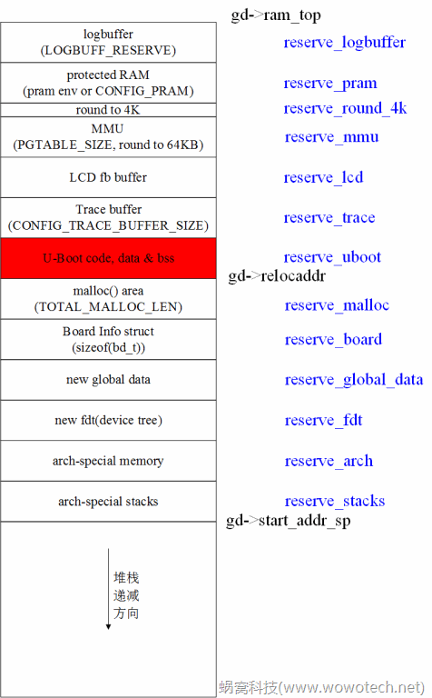

# u-boot启动流程分析(2)_板级(board)部分

作者：[wowo](http://www.wowotech.net/author/2) 发布于：2016-6-7 22:06  		分类：[u-boot分析](http://www.wowotech.net/sort/u-boot)  	

## 1. 前言

书接上文（[u-boot启动流程分析(1)_平台相关部分](http://www.wowotech.net/u-boot/boot_flow_1.html)），本文介绍u-boot启动流程中和具体版型（board）有关的部分，也即[board_init_f](https://github.com/wowotechX/u-boot/blob/x_integration/common/board_f.c)/[board_init_r](https://github.com/wowotechX/u-boot/blob/x_integration/common/board_r.c)所代表的、board有关初始化过程。该过程将持续u-boot的整个生命周期，直到main_loop（即传说中的命令行）。

注1：由于u-boot后初始化过程，基本上涉及到了所有的软件模块，因此本文不能一一分析，基本原则就是捡看着顺眼的、熟的下手了~。

## 2. Generic Board

我们在“[u-boot启动流程分析(1)_平台相关部分](http://www.wowotech.net/u-boot/boot_flow_1.html)”中，介绍过board_init_f接口，并在“[X-003-UBOOT-基于Bubblegum-96平台的u-boot移植说明](http://www.wowotech.net/x_project/bubblegum_uboot_porting.html)”中，通过在SPL image中的board_init_f点亮了一个LED灯。

u-boot的基本策略，就是声明一系列的API（如low_level_init、board_init_f、board_init_r等等），并在u-boot的核心逻辑中调用它们。平台的移植和开发者，所需要做的，就是根据实际情况，实现它们。

与此同时，为了减少开发的工作量，u-boot为大部分API提供了通用实现（一般通过CONFIG配置项或者若定义去控制是否编译）。以board_init_f和board_init_r两个板级的初始化接口为例，u-boot分别在[common/board_f.c](https://github.com/wowotechX/u-boot/blob/x_integration/common/board_f.c)和[common/board_r.c](https://github.com/wowotechX/u-boot/blob/x_integration/common/board_r.c)两个文件中提供了通用实现。查看common/Makefile可知：

```
ifndef CONFIG_SPL_BUILD      
…       
# boards       
obj-$(CONFIG_SYS_GENERIC_BOARD) += board_f.o       
obj-$(CONFIG_SYS_GENERIC_BOARD) += board_r.o       
…       
endif # !CONFIG_SPL_BUILD 

```

这两个通用接口是由CONFIG_SYS_GENERIC_BOARD配置项控制的，并且只会在u-boot image中被编译。再通过arch/Kconfig中ARM平台有关的配置可知：

```
config ARM      
    bool "ARM architecture"       
    select CREATE_ARCH_SYMLINK       
    select HAVE_PRIVATE_LIBGCC if !ARM64       
    select HAVE_GENERIC_BOARD       
    select SYS_GENERIC_BOARD       
    select SUPPORT_OF_CONTROL

```

ARM平台自动使能了CONFIG_SYS_GENERIC_BOARD配置，因此u-boot image有关的板级启动流程，是由Generic Board的代码实现的，具体可参考后续的分析。

注2：由“[u-boot启动流程分析(1)_平台相关部分](http://www.wowotech.net/u-boot/boot_flow_1.html)”中的分析可知，SPL image的声明周期，在自定义的board_init_f执行完成后，便结束了，因此本文将只针对u-boot image。

## 3. _main

接着“[u-boot启动流程分析(1)_平台相关部分](http://www.wowotech.net/u-boot/boot_flow_1.html)”的表述，我们从_main函数重新分析（只不过此时不再是SPL build，代码不再贴出）。执行过程如下：

1）设置初始的堆栈

基址由CONFIG_SYS_INIT_SP_ADDR定义。

2）分配global data所需的空间

将堆栈16 bits对齐之后，调用board_init_f_alloc_reserve接口，从堆栈开始的地方，为u-boot的global data（struct global_data）分配空间。如下：

```
/* common/init/board_init.c */

ulong board_init_f_alloc_reserve(ulong top)      
{       
    /* Reserve early malloc arena */       
#if defined(CONFIG_SYS_MALLOC_F)       
    top -= CONFIG_SYS_MALLOC_F_LEN;       
#endif       
    /* LAST : reserve GD (rounded up to a multiple of 16 bytes) */       
    top = rounddown(top-sizeof(struct global_data), 16);

    return top;      
}

```

需要注意的是，如果定义了CONFIG_SYS_MALLOC_F_LEN，则会先预留出early malloc所需的空间。

3）初始化global data

global data的空间分配后，调用board_init_f_init_reserve，初始化global data。所谓的初始化，无非就是一些清零操作，不过有几个地方需要注意：

>   1）如果不是ARM平台（!CONFIG_ARM），则可以调用arch_setup_gd接口，进行arch级别的设置。当然，前提是，对应的arch应该实现这个接口。
>
>   2）如果定义了CONFIG_SYS_MALLOC_F，则会初始化gd->malloc_base。

4）执行前置的（front）初始化操作

调用board_init_f接口，执行前置的初始化操作，会再后面的章节详细说明。

5）执行relocation操作，后面会详细说明。

6）清除BBS段

7）执行后置的（rear）初始化操作

调用board_init_r接口，执行前置的初始化操作，会再后面的章节详细说明。

## 4. global data介绍以及背后的思考

### 4.1 背景知识

要理解global data的意义，需要先理解如下的事实：

>   u-boot是一个bootloader，有些情况下，它可能位于系统的只读存储器（ROM或者flash）中，并从那里开始执行。
>
>   因此，这种情况下，在u-boot执行的前期（在将自己copy到可读写的存储器之前），它所在的存储空间，是不可写的，这会有两个问题：
>
>   1）堆栈无法使用，无法执行函数调用，也即C环境不可用。
>
>   2）没有data段（或者正确初始化的data段）可用，不同函数或者代码之间，无法通过全局变量的形式共享数据。

对于问题1，通常的解决方案是：

>   u-boot运行起来之后，在那些不需要执行任何初始化动作即可使用的、可读写的存储区域，开辟一段堆栈（stack）空间。
>
>   一般来说，大部分的平台（如很多ARM平台），都有自己的SRAM，可用作堆栈空间。如果实在不行，也有可借用CPU的data cache的方法（不再过多说明）。

对于问题2，解决方案要稍微复杂一些：

>   首先，对于开发者来说，在u-boot被拷贝到可读写的RAM（这个动作称作relocation）之前，永远不要使用全局变量。
>
>   其次，在relocation之前，不同模块之间，确实有通过全局变量的形式传递数据的需求。怎么办？这就是global data需要解决的事情。

### 4.2 global data

为了在relocation前通过全局变量的形式传递数据，u-boot设计了一个巧妙的方法：

1）定义一个struct global_data类型的数据结构，里面保存了各色各样需要传递的数据

>   该数据结构的具体内容，后面用到的时候再一个一个解释，这里不再详细介绍。具体可参考：[include/asm-generic/global_data.h](https://github.com/wowotechX/u-boot/blob/x_integration/include/asm-generic/global_data.h)

2）堆栈配置好之后，在堆栈开始的位置，为struct global_data预留空间（可参考第3章中相关的说明），并将开始地址（就是一个struct global_data指针）保存在一个寄存器中，后续的传递，都是通过保存在寄存器中的指针实现

对arm64平台来说，该指针保存在了X18寄存器中，如下：

>   /* https://github.com/wowotechX/u-boot/blob/x_integration/arch/arm/lib/crt0_64.S */

```
bl   board_init_f_alloc_reserve      
mov   sp, x0       
/* set up gd here, outside any C code */       
mov   x18, x0       
bl   board_init_f_init_reserve

```

上面board_init_f_alloc_reserve的返回值（x0）就是global data的指针。

>   [/* arch/arm/include/asm/global_data.h */](https://github.com/wowotechX/u-boot/blob/x_integration/arch/arm/include/asm/global_data.h)     

```
#ifdef __clang__

#define DECLARE_GLOBAL_DATA_PTR      
#define gd   get_gd()

static inline gd_t *get_gd(void)      
{       
    gd_t *gd_ptr;

#ifdef CONFIG_ARM64      
    …       
    __asm__ volatile("mov %0, x18\n" : "=r" (gd_ptr));        
#else       
    …       
}

#else

#ifdef CONFIG_ARM64      
#define DECLARE_GLOBAL_DATA_PTR     register volatile gd_t *gd asm ("x18")        
#else       
…       
#endif  

```


## 5. 前置的板级初始化操作

global data准备好之后，u-boot会执行前置的板级初始化动作，即board_init_f。所谓的前置的初始化动作，主要是relocation之前的初始化操作，也就是说：

>   执行board_init_f的时候，u-boot很有可能还在只读的存储器中。大家记住这一点就可以了！
>
>   注3：大家可能会觉得这里的f(front?)和r(rear?)的命名有点奇怪，我猜这个软件工程师应该是车迷，是不是借用了前驱和后驱的概念？不得而知啊。

对于ARM等平台来说，u-boot提供了一个通用的board_init_f接口，该接口使用u-boot惯用的设计思路：

>   u-boot将需要在board_init_f中初始化的内容，抽象为一系列API。这些API由u-boot声明，由平台的开发者根据实际情况实现。具体可参考本章后续的描述。

### 5.1 board_init_f

位于[common/board_f.c](https://github.com/wowotechX/u-boot/blob/x_integration/common/board_f.c)中的board_init_f接口的实现非常简单，如下（省略了一些无用代码）：

```c
void board_init_f(ulong boot_flags)      
{       
	…

    gd->flags = boot_flags;      
    gd->have_console = 0;

    if (initcall_run_list(init_sequence_f))      
        hang();

…      
}
    
```

对global  data进行简单的初始化之后，调用位于init_sequence_f数组中的各种初始化API，进行各式各样的初始化动作。后面将会简单介绍一些和ARM平台有关的、和平台的移植工作有关的、比较重要的API。其它API，大家可以参考source code自行理解。

注4：下面红色字体标注的API，是u-boot移植时有很大可能需要的API，大家留意就是。

### 5.2 fdtdec_setup

```
#ifdef CONFIG_OF_CONTROL      
    fdtdec_setup,       
#endif

```

如果打开了CONFIG_OF_CONTROL，则调用fdtdec_setup，配置gd->fdt_blob指针（即device tree所在的存储位置）。对ARM平台来说，u-boot的Makefile会通过连接脚本，将dtb文件打包到u-boot  image的“__dtb_dt_begin”位置处，因此不需要特别关心。

### 5.3 trace_early_init

```
#ifdef CONFIG_TRACE      
    trace_early_init,       
#endif

```

由CONFIG_TRACE配置项控制，暂且不用关注，后面用到的时候再分析。

### 5.4 initf_malloc

如果定义了CONFIG_SYS_MALLOC_F_LEN，则调用initf_malloc，初始化malloc有关的global data，如gd->malloc_limit、gd->malloc_ptr。

### 5.5 arch_cpu_init

cpu级别的初始化操作，可以在需要的时候由CPU有关的code实现。

### 5.6 initf_dm

driver  model有关的初始化操作。如果定义了CONFIG_DM，则调用dm_init_and_scan初始化并扫描系统所有的device。如果定义了CONFIG_TIMER_EARLY，调用dm_timer_init初始化driver model所需的timer。

### 5.7 board_early_init_f

```
#if defined(CONFIG_BOARD_EARLY_INIT_F)      
    board_early_init_f,       
#endif

```

如果定义CONFIG_BOARD_EARLY_INIT_F，则调用board_early_init_f接口，执行板级的early初始化。平台的开发者可以根据需要，实现board_early_init_f接口，以完成特定的功能。

### 5.8 timer_init

初始化系统的timer。

该接口应该由平台或者板级的代码实现，初始化成功后，u-boot会通过其它的API获取当前的timestamp，后面用到的时候再详细介绍。

### 5.9 get_clocks

获取当前CPU和BUS的时钟频率，并保存在global data中：

>   gd->cpu_clk
>
>   gd->bus_clk

### 5.10 env_init

初始化环境变量有关的逻辑，不需要特别关注。

### 5.11 init_baud_rate

>   gd->baudrate = getenv_ulong("baudrate", 10, CONFIG_BAUDRATE);

获取当前使用串口波特率，可以有两个途径（优先级从高到低）：从"baudrate"中获取；从CONFIG_BAUDRATE配置项获取。

### 5.12 serial_init

初始化serial，包括u-boot serial core以及具体的serial driver。该函数执行后，系统的串口（特别是用于控制台的）已经可用。

### 5.13 console_init_f

```
/* Called before relocation - use serial functions */      
int console_init_f(void)       
{       
    gd->have_console = 1;

#ifdef CONFIG_SILENT_CONSOLE      
    if (getenv("silent") != NULL)       
        gd->flags |= GD_FLG_SILENT;       
#endif

    print_pre_console_buffer(PRE_CONSOLE_FLUSHPOINT1_SERIAL);

    return 0;      
}

```

初始化系统的控制台，之后串口输出可用。大家可留意CONFIG_SILENT_CONSOLE配置项，如果使能，可以通过“silent”环境变量，控制u-boot的控制台是否输出。

### 5.14 fdtdec_prepare_fdt

```
#ifdef CONFIG_OF_CONTROL      
    fdtdec_prepare_fdt,       
#endif

```

如果定义了CONFIG_OF_CONTROL，调用fdtdec_prepare_fdt接口，准备device tree有关的内容。后续device tree的分析文章会详细介绍。

### 5.15 display_options/display_text_info/print_cpuinfo/show_board_info

通过控制台，显示一些信息，可用于debug。

### 5.16 misc_init_f

```
#if defined(CONFIG_MISC_INIT_F)      
    misc_init_f,       
#endif

```

如果使能了CONFIG_MISC_INIT_F，则调用misc_init_f执行misc driver有关的初始化。

### 5.17 init_func_i2c

```
#if defined(CONFIG_HARD_I2C) || defined(CONFIG_SYS_I2C)      
    init_func_i2c,       
#endif

```

如果使能了CONFIG_HARD_I2C或者CONFIG_SYS_I2C，则调用init_func_i2c执行i2c driver有关的初始化。

### 5.18 init_func_spi

```
#if defined(CONFIG_HARD_SPI)      
    init_func_spi,       
#endif

```

如果使能了CONFIG_HARD_SPI，则调用init_func_spi执行spi driver有关的初始化。

### 5.19 announce_dram_init

宣布我们要进行DDR的初始化动作了（其实就是一行打印）。

### 5.20 dram_init

```
#if defined(CONFIG_ARM) || defined(CONFIG_X86) || defined(CONFIG_NDS32) || \      
        defined(CONFIG_MICROBLAZE) || defined(CONFIG_AVR32)       
    dram_init,       /* configure available RAM banks */       
#endif

```

调用dram_init接口，初始化系统的DDR。dram_init应该由平台相关的代码实现。

如果DDR在SPL中已经初始化过了，则不需要重新初始化，只需要把DDR信息保存在global data中即可，例如：

>   gd->ram_size = …

### 5.21 testdram

```
#if defined(CONFIG_SYS_DRAM_TEST)      
    testdram,       
#endif /* CONFIG_SYS_DRAM_TEST */

```

如果定义了CONFIG_SYS_DRAM_TEST，则会调用testdram执行DDR的测试操作。可以在开发阶段打开，系统稳定后关闭。

### 5.22 DRAM空间的分配

DRAM初始化完成后，就可以着手规划u-boot需要使用的部分，如下图：



总结如下：

>   1）考虑到后续的kernel是在RAM的低端位置解压缩并执行的，为了避免麻烦，u-boot将使用DRAM的顶端地址，即gd->ram_top所代表的位置。其中gd->ram_top是由setup_dest_addr函数配置的。
>
>   2）u-boot所使用的DRAM，主要分为三类：各种特殊功能所需的空间，如log buffer、MMU page table、LCD fb buffer、trace  buffer、等等；u-boot的代码段、数据段、BSS段所占用的空间（就是u-boot  relocate之后的执行空间），由gd->relocaddr标示；堆栈空间，从gd->start_addr_sp处递减。
>
>   3）特殊功能以及u-boot所需空间，是由reserve_xxx系列函数保留的，具体可参考source code，这里不再详细分析。
>
>   4）reserve空间分配完毕后，堆栈紧随其后，递减即可。

### 5.23 setup_dram_config

调用dram_init_banksize接口（由具体的平台代码实现），初始化DDR的bank信息。

### 5.24 reloc_fdt

如果没有定义CONFIG_OF_EMBED，则先将device tree拷贝到图片1 new_fdt所在的位置，也就是device tree的relocation操作。

### 5.25 setup_reloc

计算relocation有关的信息，主要是 gd->reloc_off，计算公式如下：

>   gd->reloc_off = gd->relocaddr - CONFIG_SYS_TEXT_BASE;

其中CONFIG_SYS_TEXT_BASE是u-boot  relocation之前在（只读）memory的位置（也是编译时指定的位置），gd->relocaddr是relocation之后的位置，因此gd->reloc_off代表u-boot relocation操作之后的偏移量，后面relocation时会用到。

同时，该函数顺便把global data拷贝到了图片1所示的“new global data”处，其实就是global data的relocation。

## 6. u-boot的relocation

前面讲过，u-boot是有可能在只读的memory中启动的。简单起见，u-boot假定所有的启动都是这样，因此u-boot的启动逻辑，都是针对这种情况设计的。在这种情况下，基于如下考虑：

>   1）只读memory中执行，代码需要小心编写（不能使用全局变量，等等）。
>
>   2）只读memory执行速度通常比较慢。

u-boot需要在某一个时间点，将自己从“只读memory”中，拷贝到可读写的memory（如SDRAM，后面统称RAM，注意和SRAM区分，不要理解错了）中继续执行，这就是relocation（重定位）操作。

relocation的时间点，可以是“系统可读写memory始化完成之后“的任何时间点。根据u-boot当前的代码逻辑，是在board_init_f执行完成之后，因为board_init_f中完成了很多relocation有关的准备动作，具体可参考第5章的描述。

u-boot relocation的代码如下（以arm64为例）：

>   /* https://github.com/wowotechX/u-boot/blob/x_integration/arch/arm/lib/crt0_64.S */

```
    ldr   x0, [x18, #GD_START_ADDR_SP]  /* x0 <- gd->start_addr_sp */      
    bic   sp, x0, #0xf  /* 16-byte alignment for ABI compliance */       
    ldr   x18, [x18, #GD_BD]       /* x18 <- gd->bd */       
    sub   x18, x18, #GD_SIZE       /* new GD is below bd */

    adr   lr, relocation_return      
    ldr   x9, [x18, #GD_RELOC_OFF]    /* x9 <- gd->reloc_off */       
    add   lr, lr, x9   /* new return address after relocation */       
    ldr   x0, [x18, #GD_RELOCADDR]    /* x0 <- gd->relocaddr */       
    b    relocate_code

relocation_return:

```

逻辑比较简单：

1）从global data中取出relocation之后的堆栈基址，16-byte对齐后，保存到sp中。

2）将新的global data的指针，保存在x18寄存器中。

3）计算relocation之后的执行地址（relocation_return处），计算的方法就是当前的relocation_return位置加上gd->reloc_off。

4）以relocation的目的地址（gd->relocaddr）为参数，调用relocate_code执行实际的relocation动作，就是将u-boot的代码段、data段、bss段等数据，拷贝到新的位置（gd->relocaddr）。

## 7. 后置的板级初始化操作

relocate完成之后，真正的C运行环境才算建立了起来，接下来会执行“后置的板级初始化操作”，即board_init_r函数。board_init_r和board_init_f的设计思路基本一样，也有一个很长的初始化序列----init_sequence_r，该序列中包含如下的初始化函数（逻辑比较简单，这里不再涉及细节，权当列出index吧）：

注5：老规矩，红色字体标注的函数是比较重要的函数。

1）initr_trace，初始化并使能u-boot的tracing system，涉及的配置项有CONFIG_TRACE。

2）initr_reloc，设置relocation完成的标志。

3）initr_caches，使能dcache、icache等，涉及的配置项有CONFIG_ARM。

4）initr_malloc，malloc有关的初始化。

5）initr_dm，relocate之后，重新初始化DM，涉及的配置项有CONFIG_DM。

**6）board_init，具体的板级初始化，需要由board代码根据需要实现，涉及的配置项有CONFIG_ARM。**

7）set_cpu_clk_info，Initialize clock framework，涉及的配置项有CONFIG_CLOCKS。

8）initr_serial，重新初始化串口（不太明白什么意思）。

9）initr_announce，宣布已经在RAM中执行，会打印relocate后的地址。

**10）board_early_init_r，由板级代码实现，涉及的配置项有CONFIG_BOARD_EARLY_INIT_R。**

**11）arch_early_init_r，由arch代码实现，涉及的配置项有CONFIG_ARCH_EARLY_INIT_R。**

**12）power_init_board，板级的power init代码，由板级代码实现，例如hold住power。**

13）initr_flash、initr_nand、initr_onenand、initr_mmc、initr_dataflash，各种flash设备的初始化。

14）initr_env，环境变量有关的初始化。

15）initr_secondary_cpu，初始化其它的CPU core。

16）stdio_add_devices，各种输入输出设备的初始化，如LCD driver等。

17）interrupt_init，中断有关的初始化。

18）initr_enable_interrupts，使能系统的中断，涉及的配置项有CONFIG_ARM（ARM平台u-boot实在开中断的情况下运行的）。

19）initr_status_led，状态指示LED的初始化，涉及的配置项有CONFIG_STATUS_LED、STATUS_LED_BOOT。

20）initr_ethaddr，Ethernet的初始化，涉及的配置项有CONFIG_CMD_NET。

**21）board_late_init，由板级代码实现，涉及的配置项有CONFIG_BOARD_LATE_INIT。**

22）等等…

23）run_main_loop/main_loop，执行到main_loop，开始命令行操作。