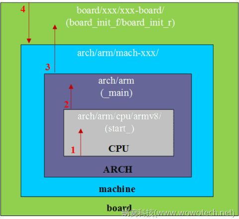

# u-boot启动流程分析_平台相关部分

作者：[wowo](http://www.wowotech.net/author/2) 发布于：2016-5-19 22:38  		分类：[u-boot分析](http://www.wowotech.net/sort/u-boot)  	

## 1. 前言

本文将结合u-boot的“board—>machine—>arch—>cpu”框架，介绍u-boot中平台相关部分的启动流程。并通过对启动流程的简单分析，掌握u-boot移植的基本方法。 

注1：本文所使用的u-boot版本，是2016/4/23从u-boot官网（git://git.denx.de/u-boot.git）导入的一个快照，具体可参考“https://github.com/wowotechX/u-boot”。 

注2：为了方便，本文将“平台相关部分的启动流程”，定义为从u-boot启动开始，到board有关的C代码被执行为止。后续的部分，会在下一篇文章中分析。 

## 2. 多平台架构

嵌入式软件工程师，在设计某一个软件的时候，或多或少的都会思考“跨平台”的问题（驱动和系统工程师尤甚）： 

>   这个“软件”是否可以运行于不同的软硬件环境中？ 
>
>   这个“软件”和其它“软件”是否有共同的地方可以抽象出来？ 

这些问题的本质，是软件工程中的抽象和封装，以最简洁、最高效的方式，实现尽可能多的功能。u-boot作为一个跨平台、跨设备的bootloader，同样会面临这些问题。它的解决方案，就是“board—>machine—>arch—>cpu”框架，如下： 



该结构其实就是device tree普及之前，linux kernel所采用的结构，它基本上和硬件的拓扑结构保持一致： 

>   一个嵌入式产品，无论是一款手机，还是一块开发板，首先呈现给用户的就是一个可满足产品功能的“硬件实体”，该“实体”包括一些必要的外部设备，如显示屏、按键、麦克风、扬声器等等，它就是图片1中最大的那个方块----board； 
>
>   除了用户能感知到的外部设备，board上还有一个最重要设备----CPU，是产品的运算和控制中心。不过，众所周知，当今的CPU非常不单纯，它在一个芯片上，尽可能多的集成了和外部设备有关的功能，例如各种各样的设备控制器。这就是传说中的SOC，对应图片1中的“machine”； 
>
>   SOC里面，涉及到ARCH和CPU的概念，需要注意的是，u-boot的抽象，和ARM等标准抽象（可参考“[ARM概念梳理：Architecture, Core, CPU，SOC](http://www.wowotech.net/armv8a_arch/arm_concept.html)”中的描述）不一致。如上图所示，u-boot把arm（包括arm32和arm64）归为一个ARCH大类，而把armv8等抽象为CPU。有点奇葩，大家记着就是了。 

基于图片1的架构，u-boot和平台有关的初始化流程，显得比较直观、清晰： 

>   1）u-boot启动后，会先执行CPU（如armv8）的初始化代码。 
>
>   2）CPU相关的代码，会调用ARCH的公共代码（如arch/arm）。 
>
>   3）ARCH的公共代码，在适当的时候，调用board有关的接口。u-boot的功能逻辑，大多是由common代码实现，部分和平台有关的部分，则由公共代码声明，由board代码实现。 
>
>   4）board代码在需要的时候，会调用machine（arch/arm/mach-xxx）提供的接口，实现特定的功能。因此machine的定位是提供一些基础的代码支持，不会直接参与到u-boot的功能逻辑中。 

具体请参考后面的分析。 

## 3. 平台相关部分的启动流程分析

本文先不涉及u-boot和平台相关的Kconfig/Makefile部分，以ARM64为例，假定u-boot首先从“[arch/arm/cpu/armv8/start.S](https://github.com/wowotechX/u-boot/blob/x_integration/arch/arm/cpu/armv8/start.S)”的`_start`接口开始执行。因此我们从`_start`开始分析。 

注3：后续u-boot的移植指南中，会介绍该假定的依据。 

注4：启动流程分析的过程中，我们会重点解释、归纳出代码中以CONFIG_为前缀的配置项，后续u-boot的移植工作，大部分就是这些配置项的确定过程。 

### 3.1 _start

_start是u-boot启动后的第一个执行地址，对armv8来说，它只是简单的跳转到reset处执行，如下： 

>   /* https://github.com/wowotechX/u-boot/blob/x_integration/arch/arm/cpu/armv8/start.S */ 

```
.globl	_start
_start:
	b	reset

```

### 3.2 reset

reset的代码如下：

>   /* https://github.com/wowotechX/u-boot/blob/x_integration/arch/arm/cpu/armv8/start.S */    

```
reset:
#ifdef CONFIG_SYS_RESET_SCTRL
	bl reset_sctrl
#endif
	/*
	 * Could be EL3/EL2/EL1, Initial State:
	 * Little Endian, MMU Disabled, i/dCache Disabled
	 */
	adr	x0, vectors
	switch_el x1, 3f, 2f, 1f
3:	msr	vbar_el3, x0
	mrs	x0, scr_el3
	orr	x0, x0, #0xf		/* SCR_EL3.NS|IRQ|FIQ|EA */
	msr	scr_el3, x0
	msr	cptr_el3, xzr		/* Enable FP/SIMD */
#ifdef COUNTER_FREQUENCY
	ldr	x0, =COUNTER_FREQUENCY
	msr	cntfrq_el0, x0		/* Initialize CNTFRQ */
#endif
	b	0f
2:	msr	vbar_el2, x0
	mov	x0, #0x33ff
	msr	cptr_el2, x0		/* Enable FP/SIMD */
	b	0f
1:	msr	vbar_el1, x0
	mov	x0, #3 << 20
	msr	cpacr_el1, x0		/* Enable FP/SIMD */
0:

	/* Apply ARM core specific erratas */
	bl	apply_core_errata

	/*
	 * Cache/BPB/TLB Invalidate
	 * i-cache is invalidated before enabled in icache_enable()
	 * tlb is invalidated before mmu is enabled in dcache_enable()
	 * d-cache is invalidated before enabled in dcache_enable()
	 */

	/* Processor specific initialization */
	bl	lowlevel_init

#ifdef CONFIG_ARMV8_MULTIENTRY
	branch_if_master x0, x1, master_cpu

	/*
	 * Slave CPUs
	 */
slave_cpu:
	wfe
	ldr	x1, =CPU_RELEASE_ADDR
	ldr	x0, [x1]
	cbz	x0, slave_cpu
	br	x0		/* branch to the given address */
master_cpu:
	/* On the master CPU */
#endif /* CONFIG_ARMV8_MULTIENTRY */

	bl	_main

```

主要做如下事情：

1）reset SCTRL寄存器 

具体可参考reset_sctrl函数，由CONFIG_SYS_RESET_SCTRL控制，一般不需要打开。该配置项的解释如下： 

>   Reset the SCTRL register at the very beginning of execution to  avoid interference from stale mappings set up by early  firmware/loaders/etc. 
>
>   http://lists.denx.de/pipermail/u-boot/2015-April/211147.html 

2）根据当前的EL级别，配置中断向量、MMU、Endian、i/d Cache等。 

3）配置ARM的勘误表 

具体可参考apply_core_errata函数，由CONFIG_ARM_ERRATA_XXX控制，在项目的初期，可以不打开，后续根据实际情况打开）。 

4）调用lowlevel_init 

的功能解释如下（具体可参考[u-boot的readme文档](https://raw.githubusercontent.com/wowotechX/u-boot/x_integration/README)）： 

```
- purpose: essential init to permit execution to reach board_init_f() 

- no global_data or BSS 

- there is no stack (ARMv7 may have one but it will soon be removed) 

- must not set up SDRAM or use console 

- must only do the bare minimum to allow execution to continue to 

  board_init_f() 

- this is almost never needed 

- return normally from this function 
 
```

一般情况下，不需要实现。[start.S](https://github.com/wowotechX/u-boot/blob/x_integration/arch/arm/cpu/armv8/start.S)中也有一个WEAK类型的定义，由CONFIG_GICV2 | CONFIG_GICV3控制，一般情况下，没有打开的必要。 

5）如果是多CPU的场景，处理其它的CPU的boot 

多CPU功能由CONFIG_ARMV8_MULTIENTRY控制，不需要打开。 

6）跳转到arm公共的_main中执行 

ARM64平台的_main位于[crt0_64.S](https://github.com/wowotechX/u-boot/blob/x_integration/arch/arm/lib/crt0_64.S)文件中，具体请参考下面的描述。 

### 3.3 _main

crt0是C-runtime Startup Code的简称，意思就是运行C代码之前的准备工作。关于_main函数，[crt0_64.S](https://github.com/wowotechX/u-boot/blob/x_integration/arch/arm/lib/crt0_64.S)中有非常详细的注释（这一点要给u-boot点100个赞！），大家可以参考。该函数的定义如下： 

>   /* https://github.com/wowotechX/u-boot/blob/x_integration/arch/arm/lib/crt0_64.S */ 

```
ENTRY(_main)

/*
 * Set up initial C runtime environment and call board_init_f(0).
 */
#if defined(CONFIG_SPL_BUILD) && defined(CONFIG_SPL_STACK)
	ldr	x0, =(CONFIG_SPL_STACK)
#else
	ldr	x0, =(CONFIG_SYS_INIT_SP_ADDR)
#endif
	bic	sp, x0, #0xf/* 16-byte alignment for ABI compliance */
	mov	x0, sp
	bl	board_init_f_alloc_reserve
	mov	sp, x0
	/* set up gd here, outside any C code */
	mov	x18, x0
	bl	board_init_f_init_reserve

	mov	x0, #0
	bl	board_init_f

#if !defined(CONFIG_SPL_BUILD)
/*
 * Set up intermediate environment (new sp and gd) and call
 * relocate_code(addr_moni). Trick here is that we'll return
 * 'here' but relocated.
 */
	ldr	x0, [x18, #GD_START_ADDR_SP]/* x0 <- gd-="">start_addr_sp */
	bic	sp, x0, #0xf/* 16-byte alignment for ABI compliance */
	ldr	x18, [x18, #GD_BD]		/* x18 <- gd-="">bd */
	sub	x18, x18, #GD_SIZE		/* new GD is below bd */

	adr	lr, relocation_return
	ldr	x9, [x18, #GD_RELOC_OFF]	/* x9 <- gd-="">reloc_off */
	add	lr, lr, x9/* new return address after relocation */
	ldr	x0, [x18, #GD_RELOCADDR]	/* x0 <- gd-="">relocaddr */
	b	relocate_code

relocation_return:

/*
 * Set up final (full) environment
 */
	bl	c_runtime_cpu_setup	/* still call old routine */

/* TODO: For SPL, call spl_relocate_stack_gd() to alloc stack relocation */

/*
 * Clear BSS section
 */
	ldr	x0, =__bss_start	/* this is auto-relocated! */
	ldr	x1, =__bss_end	/* this is auto-relocated! */
	mov	x2, #0
clear_loop:
	str	x2, [x0]
	add	x0, x0, #8
	cmp	x0, x1
	b.lo	clear_loop

	/* call board_init_r(gd_t *id, ulong dest_addr) */
	mov	x0, x18			/* gd_t */
	ldr	x1, [x18, #GD_RELOCADDR]	/* dest_addr */
	b	board_init_r		/* PC relative jump */

	/* NOTREACHED - board_init_r() does not return */

#endif /* !CONFIG_SPL_BUILD */

ENDPROC(_main)

```

功能可总结为（大部分翻译自[crt0_64.S](https://github.com/wowotechX/u-boot/blob/x_integration/arch/arm/lib/crt0_64.S)中的注释）： 

1）设置C代码的运行环境，为调用board_init_f接口做准备。包括： 

>   a）设置堆栈（C代码的函数调用，堆栈是必须的）。如果当前的编译是SPL（由CONFIG_SPL_BUILD定义），可单独定义堆栈基址（CONFIG_SPL_STACK），否则，通过CONFIG_SYS_INIT_SP_ADDR定义堆栈基址。 
>
>   b）调用[board_init_f_alloc_reserve](https://github.com/wowotechX/u-boot/blob/x_integration/common/init/board_init.c)接口，从堆栈开始的地方，为u-boot中大名鼎鼎的GD ('global data') 数据结构，分配空间。 
>
>   c）调用[board_init_f_init_reserve](https://github.com/wowotechX/u-boot/blob/x_integration/common/init/board_init.c)接口，对GD进行初始化。 

2）调用board_init_f函数，完成一些前期的初始化工作，例如： 

>   a）点亮一个Debug用的LED灯，表示u-boot已经活了。 
>
>   b）初始化DRAM、DDR等system范围的RAM等。 
>
>   c）计算后续代码需要使用的一些参数，包括relocation destination、the future stack、the future GD location等。 
>
>   注5：关于u-boot的relocation操作，后续会有专门的文章介绍。 

3）如果当前是SPL（由CONFIG_SPL_BUILD控制），则_main函数结束，直接返回。如果是正常的u-boot，则继续执行后续的动作。 

4）根据board_init_f指定的参数，执行u-boot的relocation操作。 

5）清除BBS段。 

6）调用[board_init_r](https://github.com/wowotechX/u-boot/blob/x_integration/common/board_r.c)函数，执行后续的初始化操作（已经不再本文的讨论范围了，具体请参考后续的分析文章）。 

## 4. 总结

### 4.1 SPL功能

SPL是Secondary Program Loader的简称，之所以称作secondary，是相对于ROM  code来说的。SPL是u-boot中独立的一个代码分支，由CONFIG_SPL_BUILD配置项控制，是为了在正常的u-boot  image之外，提供一个独立的、小size的SPL  image，通常用于那些SRAM比较小（或者其它限制）、无法直接装载并运行整个u-boot的平台。 

如果使用了SPL功能，u-boot的启动流程通常是： 

>   ROM code加载SPL并运行； 
>
>   SPL进行必要的初始化之后，加载u-boot并运行； 
>
>   u-boot进行后续的操作。 

因此，如果使用SPL功能，需要尽可能的减少SPL的代码量，以减小它的size。 

### 4.2 配置项总结

经过第3章的流程分析，我们可以总结出和“平台相关部分的启动流程”有关的配置项，记录如下： 

>   CONFIG_SYS_RESET_SCTRL，控制是否在启动的时候reset SCTRL寄存器，一般不需要打开； 
>
>   CONFIG_ARM_ERRATA_XXX，控制ARM core的勘误信息，一般不需要打开； 
>
>   CONFIG_GICV2、CONFIG_GICV3，控制GIC的版本，用到的时候再说明； 
>
>   CONFIG_ARMV8_MULTIENTRY，控制是否在u-boot中使用多CPU，一般不需要； 
>
>   CONFIG_SPL_BUILD，是否是能SPL的编译，需要的话可以打开； 
>
>   CONFIG_SPL_STACK，如果配置了CONFIG_SPL_BUILD，是否为SPL image配置单独的stack（SP基址），如果需要，通过该配置项配置，如果不需要，则使用CONFIG_SYS_INIT_SP_ADDR； 
>
>   CONFIG_SYS_INIT_SP_ADDR，配置u-boot的stack（SP基址），对于u-boot功能来说，必须提供。 